# Booklet Gedung A.A. Maramis (Updated Sept 2026)

> **Dokumen Sumber:** `0 - source/Booklet Gedung AA Maramis - Updated Sept 2026.pdf`  
> **Pengelola:** Lembaga Manajemen Aset Negara (LMAN) – Kementerian Keuangan Republik Indonesia  
> **Status Bangunan:** Bangunan Cagar Budaya Peringkat Nasional  
> **Format Ingesti:** Markdown dengan Katalog Spesifikasi Teknis, Denah, Foto, Tata Tertib, dan Tarif Sewa  

---

## Daftar Isi
1. [Profil & Sejarah Gedung A.A. Maramis](#1-profil--sejarah-gedung-aa-maramis)
2. [Denah Lokasi & Akses Kawasan](#2-denah-lokasi--akses-kawasan)
3. [Spesifikasi Teknis Gedung Keseluruhan](#3-spesifikasi-teknis-gedung-keseluruhan)
   - [Pembagian Blok Gedung](#pembagian-blok-gedung)
   - [Spesifikasi Per Lantai](#spesifikasi-per-lantai)
4. [Spesifikasi Teknis & Tarif Sewa Per Ruangan](#4-spesifikasi-teknis--tarif-sewa-per-ruangan)
   - [Gedung C – Lantai 1 (Paket Pemanfaatan Lantai 1)](#gedung-c--lantai-1)
   - [Gedung A – Lantai 2](#gedung-a--lantai-2)
   - [Gedung C – Lantai 2](#gedung-c--lantai-2)
   - [Gedung A – Lantai 3](#gedung-a--lantai-3)
   - [Gedung C – Lantai 3](#gedung-c--lantai-3)
5. [Tabel Rekapitulasi Lengkap Ruangan & Tarif](#5-tabel-rekapitulasi-lengkap-ruangan--tarif)
6. [House Rules / Tata Tertib](#6-house-rules--tata-tertib)
   - [Tata Tertib Pengunjung Gedung A.A. Maramis](#tata-tertib-pengunjung-gedung-aa-maramis)
   - [Tata Tertib Mitra Pemanfaatan Gedung A.A. Maramis](#tata-tertib-mitra-pemanfaatan-gedung-aa-maramis)
   - [Kontak Koordinasi Operasional & Teknis](#kontak-koordinasi-operasional--teknis)
7. [Kontak & Informasi Kolaborasi](#7-kontak--informasi-kolaborasi)

---

## 1. Profil & Sejarah Gedung A.A. Maramis

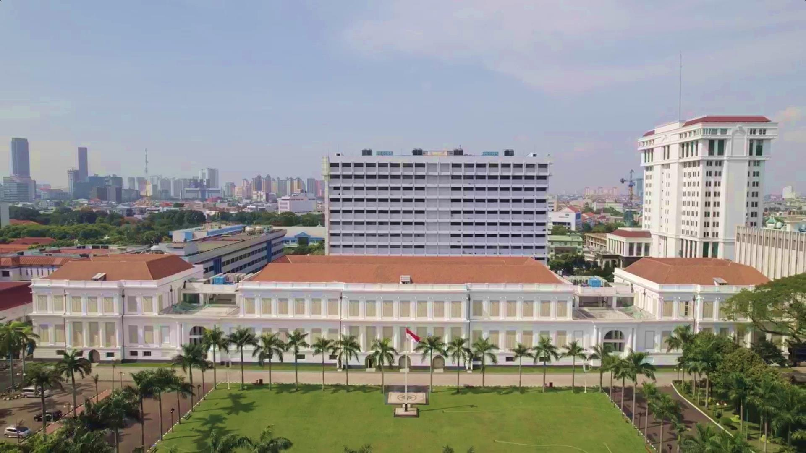

### Sejarah Gedung

Sepanjang pembangunan dan penggunaannya gedung ini memiliki berbagai nama, mulai dari **Istana Daendels** (pencetus pembangunannya), **Paleis Weltevreden**, **Het Groote Huis** (*Rumah Besar*), dan **Het Witte Huis** (*Gedung Putih*), serta sekarang dinamakan **Gedung A.A. Maramis**.

Gedung ini adalah bangunan Cagar Budaya peringkat Nasional dalam Kompleks Kementerian Keuangan Republik Indonesia, yang erat kaitannya dengan Lapangan Banteng, Jakarta. Keduanya menjadi penanda perpindahan pusat kota Batavia di muara Sungai Ciliwung ke area selatannya di Weltevreden pada abad ke-19.

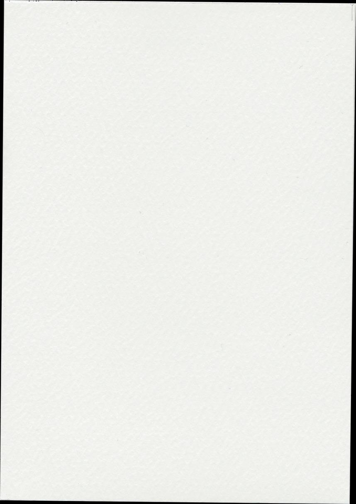

* **Tahun 1809:** Herman Willem Daendels mengusulkan pembangunan kediaman baru untuk Gubernur Jenderal di Weltevreden. Letnan Kolonel J.C. Schultze ditunjuk sebagai arsitek utama, dan dibantu oleh Johannes Jongkind. Bangunan tersebut didesain bergaya imperialisme dengan didukung fungsi perkantoran dan istal kuda.
* **Tahun 1811 – 1826:** Pembangunan sempat terhenti di tahun 1811 dan kemudian dilanjutkan oleh Gubernur Jenderal Du Bus de Gisignes sampai tahun 1826 dengan perubahan fungsi menjadi kantor bagi Pemerintah Hindia Belanda.
* **Tahun 1828:** Bangunan resmi digunakan sebagai pusat administrasi pemerintahan Hindia Belanda.
* **Tahun 1836 – 1970-an:** Terjadi penambahan-penambahan dan alterasi ruang bertahap.
* **Era Kemerdekaan RI:** Gedung ini difungsikan sebagai kantor Kementerian Keuangan Republik Indonesia. Gedung ini dinamakan Gedung A.A. Maramis untuk menghormati Mr. Alexander Andries Maramis, Menteri Keuangan Indonesia pada era revolusi kemerdekaan.
* **Era Restorasi & Revitalisasi:** Sempat terbengkalai selama beberapa tahun, Gedung A.A. Maramis telah mengalami pemugaran menyeluruh berstandar cagar budaya untuk dimanfaatkan kembali sebagai ruang publik, kegiatan kenegaraan, pameran seni-budaya, rapat, dan acara kolaboratif.

---

## 2. Denah Lokasi & Akses Kawasan

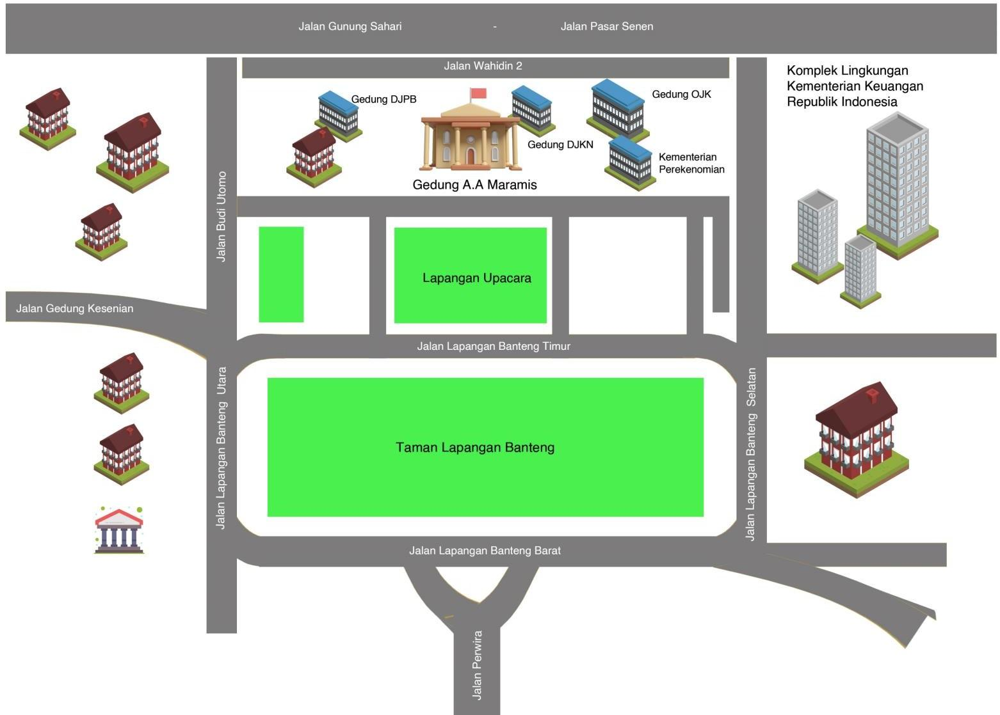

Gedung A.A. Maramis berlokasi strategis di kawasan Lapangan Banteng, Jakarta Pusat, berada di dalam kompleks Kementerian Keuangan Republik Indonesia.

### Keterangan Kawasan Sekitar:
* **Gedung A.A. Maramis** (Pusat Kawasan Heritage)
* **Gedung DJKN** (Direktorat Jenderal Kekayaan Negara)
* **Gedung OJK** (Otoritas Jasa Keuangan / Kompleks Kemenkeu)
* **Gedung DPB**
* **Kementerian Koordinator Bidang Perekonomian**

### Akses Jalan:
* Jalan Pasar Senen (Sisi Timur Laut)
* Jalan Lapangan Banteng Timur (Sisi Barat)
* Jalan Lapangan Banteng Barat & Lapangan Banteng Selatan
* Jalan Wahidin II (Kompleks Lingkungan Kementerian Keuangan)

---

## 3. Spesifikasi Teknis Gedung Keseluruhan

### Pembagian Blok Gedung

Kompleks Gedung A.A. Maramis terdiri dari beberapa zona blok bangunan utama:

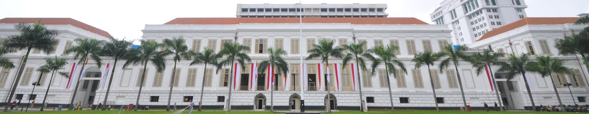

* **GEDUNG A:** Bagian fasad depan utama / blok muka menghadap Lapangan Banteng.
* **GEDUNG B:** Blok sayap barat penghubung.
* **GEDUNG C:** Blok utama bagian dalam / koridor membujur sayap panjang.
* **GEDUNG D:** Blok sayap timur.
* **GEDUNG E:** Blok pendukung bagian belakang.

### Spesifikasi Per Lantai

Bangunan terdiri atas 3 (tiga) lantai utama dengan pembagian denah dan fungsi sirkulasi pintu (Keyplan):
* **Lantai 1:** Area ground floor / aula pertemuan besar (Sayap Barat, Tengah, dan Sayap Timur).
* **Lantai 2:** Area ruang rapat representatif, ruang pertemuan bertema sejarah kerajaan nusantara (*Mataram, Sriwijaya, Bone, Majapahit, Ternate, Kutai*).
* **Lantai 3:** Ruang-ruang pertemuan serbaguna skala medium hingga besar (*termasuk aula C3.8 berkapasitas 340 orang*).

---

## 4. Spesifikasi Teknis & Tarif Sewa Per Ruangan

---

### Gedung C – Lantai 1

Pada Lantai 1 Gedung C, pemanfaatan ditawarkan dalam **skema paket keseluruhan lantai** (*full floor / ballroom suite*) yang mencakup seluruh ruangan sayap dan koridor.

* **Tarif Sewa Paket Lantai 1:** **Rp 125.000.000 / hari**

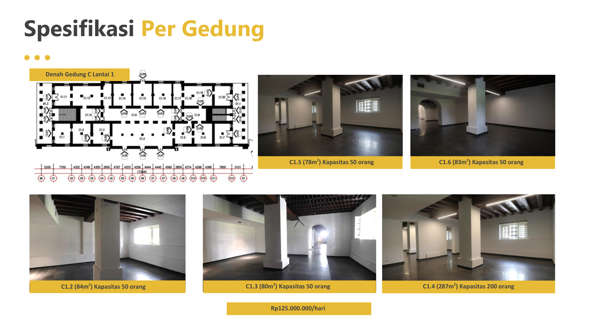
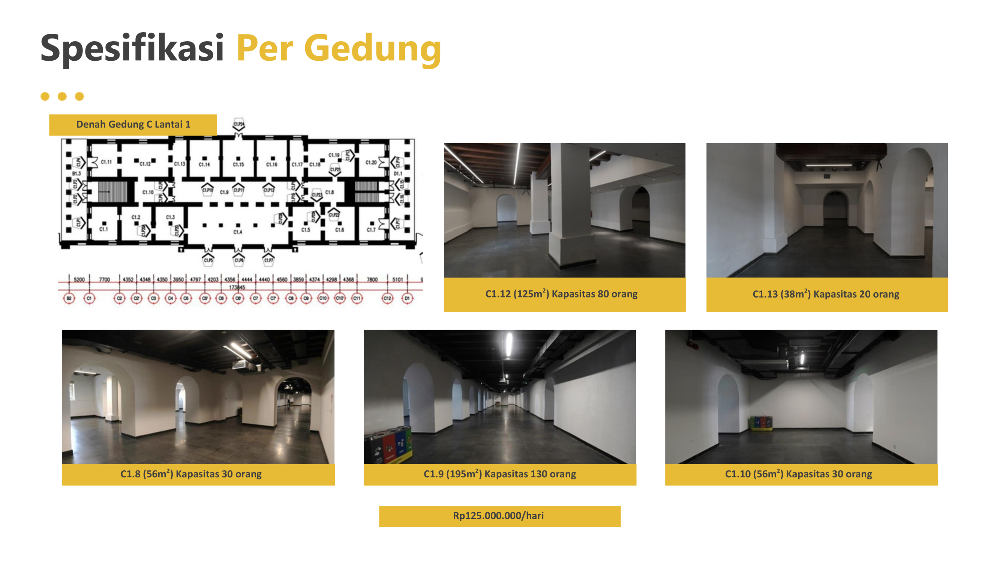
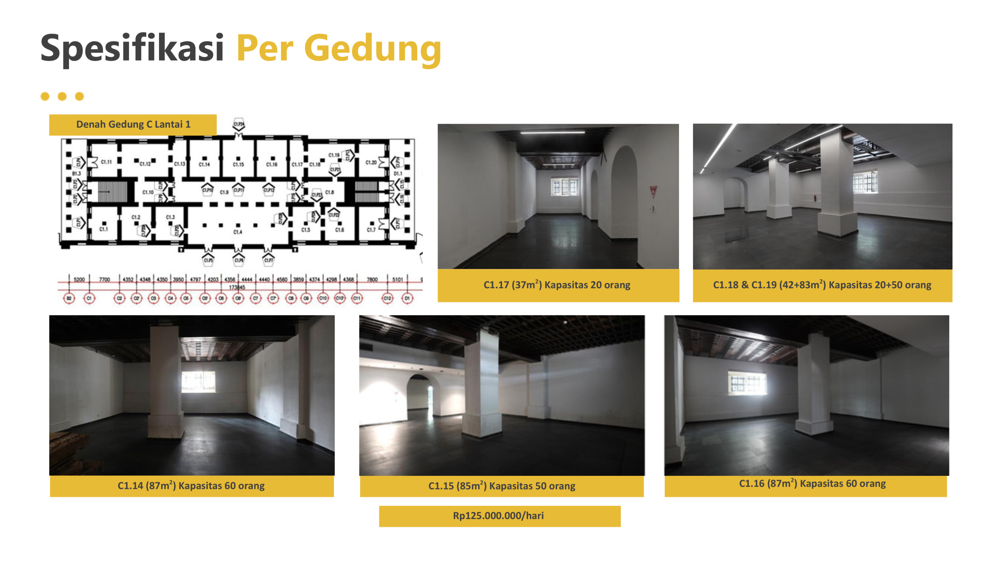

#### Rincian Ruangan di Lantai 1 Gedung C:
| Kode Ruangan | Luas Area ($m^2$) | Estimasi Kapasitas | Keterangan / Halaman Booklet |
| :--- | :---: | :---: | :--- |
| **C1.2** | $84\text{ m}^2$ | 50 orang | Halaman 7 |
| **C1.3** | $80\text{ m}^2$ | 50 orang | Halaman 7 |
| **C1.4** | $287\text{ m}^2$ | 200 orang | Halaman 7 (Aula Utama Lantai 1) |
| **C1.5** | $78\text{ m}^2$ | 50 orang | Halaman 7 |
| **C1.6** | $83\text{ m}^2$ | 50 orang | Halaman 7 |
| **C1.8** | $56\text{ m}^2$ | 30 orang | Halaman 8 |
| **C1.9** | $195\text{ m}^2$ | 130 orang | Halaman 8 |
| **C1.10** | $56\text{ m}^2$ | 30 orang | Halaman 8 |
| **C1.12** | $125\text{ m}^2$ | 80 orang | Halaman 8 |
| **C1.13** | $38\text{ m}^2$ | 20 orang | Halaman 8 |
| **C1.14** | $87\text{ m}^2$ | 60 orang | Halaman 9 |
| **C1.15** | $85\text{ m}^2$ | 50 orang | Halaman 9 |
| **C1.16** | $87\text{ m}^2$ | 60 orang | Halaman 9 |
| **C1.17** | $37\text{ m}^2$ | 20 orang | Halaman 9 |
| **C1.18 & C1.19** | $42 + 83\text{ m}^2$ ($125\text{ m}^2$) | $20 + 50$ orang ($70$ orang) | Halaman 9 (Kombinasi Ruangan) |

---

### Gedung A – Lantai 2

Ruang-ruang pertemuan representatif di sayap depan Gedung A Lantai 2, disewakan per ruangan per hari.

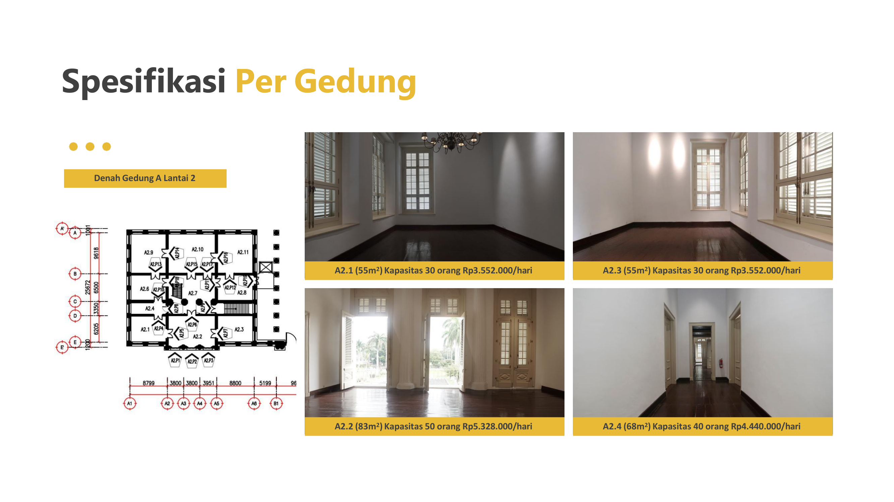
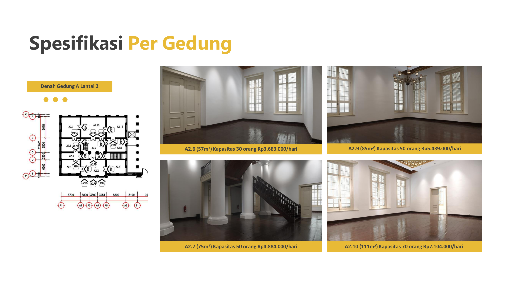

#### Rincian Ruangan Gedung A Lantai 2:
| Kode Ruangan | Luas ($m^2$) | Kapasitas | Tarif Sewa / Hari | Halaman |
| :--- | :---: | :---: | :---: | :---: |
| **A2.1** | $55\text{ m}^2$ | 30 orang | **Rp 3.552.000** | Hal. 10 |
| **A2.2** | $83\text{ m}^2$ | 50 orang | **Rp 5.328.000** | Hal. 10 |
| **A2.3** | $55\text{ m}^2$ | 30 orang | **Rp 3.552.000** | Hal. 10 |
| **A2.4** | $68\text{ m}^2$ | 40 orang | **Rp 4.440.000** | Hal. 10 |
| **A2.6** | $57\text{ m}^2$ | 30 orang | **Rp 3.663.000** | Hal. 11 |
| **A2.7** | $75\text{ m}^2$ | 50 orang | **Rp 4.884.000** | Hal. 11 |
| **A2.9** | $85\text{ m}^2$ | 50 orang | **Rp 5.439.000** | Hal. 11 |
| **A2.10** | $111\text{ m}^2$ | 70 orang | **Rp 7.104.000** | Hal. 11 |

---

### Gedung C – Lantai 2

Ruang pertemuan premium bertema kerajaan nusantara dengan kapasitas menengah hingga besar di Gedung C Lantai 2.

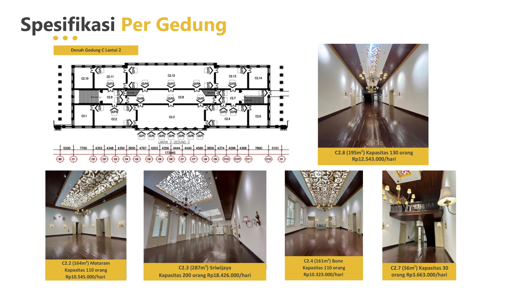
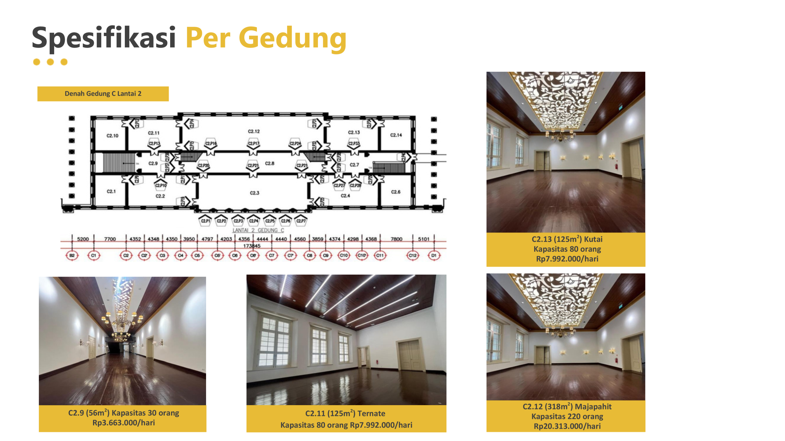

#### Rincian Ruangan Gedung C Lantai 2:
| Kode Ruangan | Nama Ruangan | Luas ($m^2$) | Kapasitas | Tarif Sewa / Hari | Halaman |
| :--- | :--- | :---: | :---: | :---: | :---: |
| **C2.2** | **Mataram** | $164\text{ m}^2$ | 110 orang | **Rp 10.545.000** | Hal. 12 |
| **C2.3** | **Sriwijaya** | $287\text{ m}^2$ | 200 orang | **Rp 18.426.000** | Hal. 12 |
| **C2.4** | **Bone** | $161\text{ m}^2$ | 110 orang | **Rp 10.323.000** | Hal. 12 |
| **C2.7** | *-* | $56\text{ m}^2$ | 30 orang | **Rp 3.663.000** | Hal. 12 |
| **C2.8** | *-* | $195\text{ m}^2$ | 130 orang | **Rp 12.543.000** | Hal. 12 |
| **C2.9** | *-* | $56\text{ m}^2$ | 30 orang | **Rp 3.663.000** | Hal. 13 |
| **C2.11** | **Ternate** | $125\text{ m}^2$ | 80 orang | **Rp 7.992.000** | Hal. 13 |
| **C2.12** | **Majapahit** | $318\text{ m}^2$ | 220 orang | **Rp 20.313.000** | Hal. 13 |
| **C2.13** | **Kutai** | $125\text{ m}^2$ | 80 orang | **Rp 7.992.000** | Hal. 13 |

---

### Gedung A – Lantai 3

Ruang pertemuan lantai 3 Gedung A dengan suasana tenang dan fasilitas lengkap, cocok untuk seminar, lokakarya, atau rapat kerja.

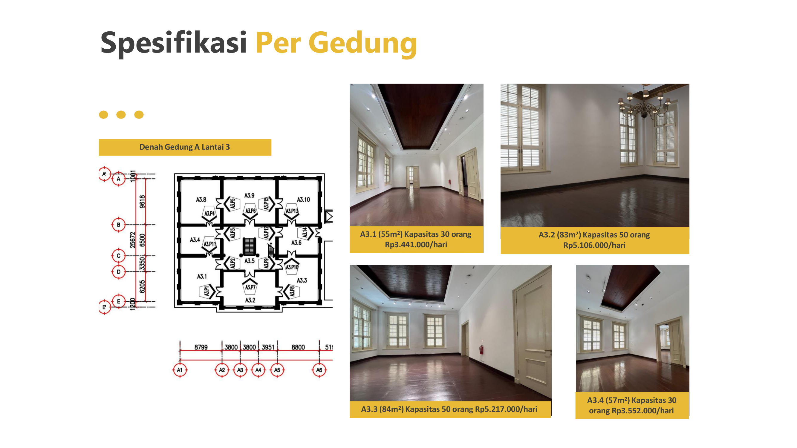
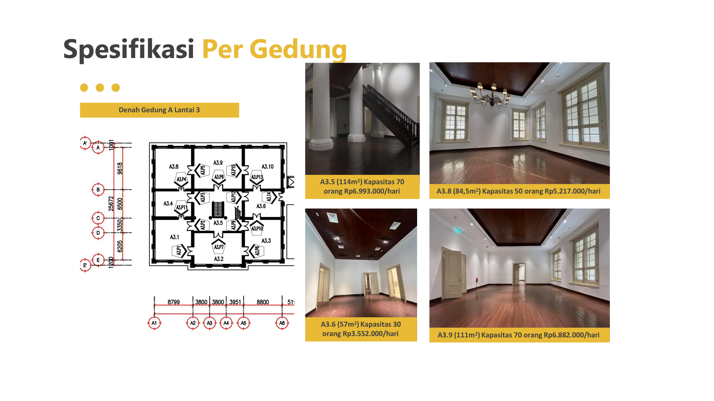

#### Rincian Ruangan Gedung A Lantai 3:
| Kode Ruangan | Luas ($m^2$) | Kapasitas | Tarif Sewa / Hari | Halaman |
| :--- | :---: | :---: | :---: | :---: |
| **A3.1** | $55\text{ m}^2$ | 30 orang | **Rp 3.441.000** | Hal. 14 |
| **A3.2** | $83\text{ m}^2$ | 50 orang | **Rp 5.106.000** | Hal. 14 |
| **A3.3** | $84\text{ m}^2$ | 50 orang | **Rp 5.217.000** | Hal. 14 |
| **A3.4** | $57\text{ m}^2$ | 30 orang | **Rp 3.552.000** | Hal. 14 |
| **A3.5** | $114\text{ m}^2$ | 70 orang | **Rp 6.993.000** | Hal. 15 |
| **A3.6** | $57\text{ m}^2$ | 30 orang | **Rp 3.552.000** | Hal. 15 |
| **A3.8** | $84,5\text{ m}^2$ | 50 orang | **Rp 5.217.000** | Hal. 15 |
| **A3.9** | $111\text{ m}^2$ | 70 orang | **Rp 6.882.000** | Hal. 15 |

---

### Gedung C – Lantai 3

Ruang-ruang pertemuan skala medium dan aula besar berkapasitas hingga 340 orang pada Gedung C Lantai 3.

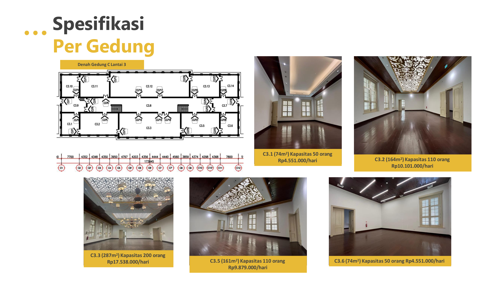
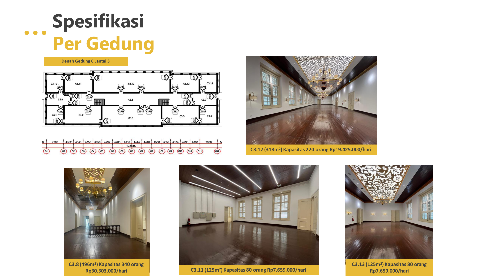

#### Rincian Ruangan Gedung C Lantai 3:
| Kode Ruangan | Luas ($m^2$) | Kapasitas | Tarif Sewa / Hari | Halaman |
| :--- | :---: | :---: | :---: | :---: |
| **C3.1** | $74\text{ m}^2$ | 50 orang | **Rp 4.551.000** | Hal. 16 |
| **C3.2** | $164\text{ m}^2$ | 110 orang | **Rp 10.101.000** | Hal. 16 |
| **C3.3** | $287\text{ m}^2$ | 200 orang | **Rp 17.538.000** | Hal. 16 |
| **C3.5** | $161\text{ m}^2$ | 110 orang | **Rp 9.879.000** | Hal. 16 |
| **C3.6** | $74\text{ m}^2$ | 50 orang | **Rp 4.551.000** | Hal. 16 |
| **C3.8** | $496\text{ m}^2$ | 340 orang | **Rp 30.303.000** | Hal. 17 |
| **C3.11** | $125\text{ m}^2$ | 80 orang | **Rp 7.659.000** | Hal. 17 |
| **C3.12** | $318\text{ m}^2$ | 220 orang | **Rp 19.425.000** | Hal. 17 |
| **C3.13** | $125\text{ m}^2$ | 80 orang | **Rp 7.659.000** | Hal. 17 |

---

## 5. Tabel Rekapitulasi Lengkap Ruangan & Tarif

Dokumen CSV lengkap dapat diakses pada file: [`daftar_ruangan.csv`](daftar_ruangan.csv).

| No | Kode Ruangan | Nama Ruangan | Blok Gedung | Lantai | Luas Area | Kapasitas | Tarif Sewa / Hari (IDR) | Skema Sewa |
| :---: | :--- | :--- | :--- | :---: | :---: | :---: | :---: | :--- |
| 1 | **C1.2** | - | Gedung C | 1 | $84\text{ m}^2$ | 50 orang | Rp 125.000.000 | Paket Lantai 1 |
| 2 | **C1.3** | - | Gedung C | 1 | $80\text{ m}^2$ | 50 orang | Rp 125.000.000 | Paket Lantai 1 |
| 3 | **C1.4** | - | Gedung C | 1 | $287\text{ m}^2$ | 200 orang | Rp 125.000.000 | Paket Lantai 1 |
| 4 | **C1.5** | - | Gedung C | 1 | $78\text{ m}^2$ | 50 orang | Rp 125.000.000 | Paket Lantai 1 |
| 5 | **C1.6** | - | Gedung C | 1 | $83\text{ m}^2$ | 50 orang | Rp 125.000.000 | Paket Lantai 1 |
| 6 | **C1.8** | - | Gedung C | 1 | $56\text{ m}^2$ | 30 orang | Rp 125.000.000 | Paket Lantai 1 |
| 7 | **C1.9** | - | Gedung C | 1 | $195\text{ m}^2$ | 130 orang | Rp 125.000.000 | Paket Lantai 1 |
| 8 | **C1.10** | - | Gedung C | 1 | $56\text{ m}^2$ | 30 orang | Rp 125.000.000 | Paket Lantai 1 |
| 9 | **C1.12** | - | Gedung C | 1 | $125\text{ m}^2$ | 80 orang | Rp 125.000.000 | Paket Lantai 1 |
| 10 | **C1.13** | - | Gedung C | 1 | $38\text{ m}^2$ | 20 orang | Rp 125.000.000 | Paket Lantai 1 |
| 11 | **C1.14** | - | Gedung C | 1 | $87\text{ m}^2$ | 60 orang | Rp 125.000.000 | Paket Lantai 1 |
| 12 | **C1.15** | - | Gedung C | 1 | $85\text{ m}^2$ | 50 orang | Rp 125.000.000 | Paket Lantai 1 |
| 13 | **C1.16** | - | Gedung C | 1 | $87\text{ m}^2$ | 60 orang | Rp 125.000.000 | Paket Lantai 1 |
| 14 | **C1.17** | - | Gedung C | 1 | $37\text{ m}^2$ | 20 orang | Rp 125.000.000 | Paket Lantai 1 |
| 15 | **C1.18 & C1.19** | - | Gedung C | 1 | $125\text{ m}^2$ | 70 orang | Rp 125.000.000 | Paket Lantai 1 |
| 16 | **A2.1** | - | Gedung A | 2 | $55\text{ m}^2$ | 30 orang | Rp 3.552.000 | Satuan Ruangan |
| 17 | **A2.2** | - | Gedung A | 2 | $83\text{ m}^2$ | 50 orang | Rp 5.328.000 | Satuan Ruangan |
| 18 | **A2.3** | - | Gedung A | 2 | $55\text{ m}^2$ | 30 orang | Rp 3.552.000 | Satuan Ruangan |
| 19 | **A2.4** | - | Gedung A | 2 | $68\text{ m}^2$ | 40 orang | Rp 4.440.000 | Satuan Ruangan |
| 20 | **A2.6** | - | Gedung A | 2 | $57\text{ m}^2$ | 30 orang | Rp 3.663.000 | Satuan Ruangan |
| 21 | **A2.7** | - | Gedung A | 2 | $75\text{ m}^2$ | 50 orang | Rp 4.884.000 | Satuan Ruangan |
| 22 | **A2.9** | - | Gedung A | 2 | $85\text{ m}^2$ | 50 orang | Rp 5.439.000 | Satuan Ruangan |
| 23 | **A2.10** | - | Gedung A | 2 | $111\text{ m}^2$ | 70 orang | Rp 7.104.000 | Satuan Ruangan |
| 24 | **C2.2** | Mataram | Gedung C | 2 | $164\text{ m}^2$ | 110 orang | Rp 10.545.000 | Satuan Ruangan |
| 25 | **C2.3** | Sriwijaya | Gedung C | 2 | $287\text{ m}^2$ | 200 orang | Rp 18.426.000 | Satuan Ruangan |
| 26 | **C2.4** | Bone | Gedung C | 2 | $161\text{ m}^2$ | 110 orang | Rp 10.323.000 | Satuan Ruangan |
| 27 | **C2.7** | - | Gedung C | 2 | $56\text{ m}^2$ | 30 orang | Rp 3.663.000 | Satuan Ruangan |
| 28 | **C2.8** | - | Gedung C | 2 | $195\text{ m}^2$ | 130 orang | Rp 12.543.000 | Satuan Ruangan |
| 29 | **C2.9** | - | Gedung C | 2 | $56\text{ m}^2$ | 30 orang | Rp 3.663.000 | Satuan Ruangan |
| 30 | **C2.11** | Ternate | Gedung C | 2 | $125\text{ m}^2$ | 80 orang | Rp 7.992.000 | Satuan Ruangan |
| 31 | **C2.12** | Majapahit | Gedung C | 2 | $318\text{ m}^2$ | 220 orang | Rp 20.313.000 | Satuan Ruangan |
| 32 | **C2.13** | Kutai | Gedung C | 2 | $125\text{ m}^2$ | 80 orang | Rp 7.992.000 | Satuan Ruangan |
| 33 | **A3.1** | - | Gedung A | 3 | $55\text{ m}^2$ | 30 orang | Rp 3.441.000 | Satuan Ruangan |
| 34 | **A3.2** | - | Gedung A | 3 | $83\text{ m}^2$ | 50 orang | Rp 5.106.000 | Satuan Ruangan |
| 35 | **A3.3** | - | Gedung A | 3 | $84\text{ m}^2$ | 50 orang | Rp 5.217.000 | Satuan Ruangan |
| 36 | **A3.4** | - | Gedung A | 3 | $57\text{ m}^2$ | 30 orang | Rp 3.552.000 | Satuan Ruangan |
| 37 | **A3.5** | - | Gedung A | 3 | $114\text{ m}^2$ | 70 orang | Rp 6.993.000 | Satuan Ruangan |
| 38 | **A3.6** | - | Gedung A | 3 | $57\text{ m}^2$ | 30 orang | Rp 3.552.000 | Satuan Ruangan |
| 39 | **A3.8** | - | Gedung A | 3 | $84,5\text{ m}^2$ | 50 orang | Rp 5.217.000 | Satuan Ruangan |
| 40 | **A3.9** | - | Gedung A | 3 | $111\text{ m}^2$ | 70 orang | Rp 6.882.000 | Satuan Ruangan |
| 41 | **C3.1** | - | Gedung C | 3 | $74\text{ m}^2$ | 50 orang | Rp 4.551.000 | Satuan Ruangan |
| 42 | **C3.2** | - | Gedung C | 3 | $164\text{ m}^2$ | 110 orang | Rp 10.101.000 | Satuan Ruangan |
| 43 | **C3.3** | - | Gedung C | 3 | $287\text{ m}^2$ | 200 orang | Rp 17.538.000 | Satuan Ruangan |
| 44 | **C3.5** | - | Gedung C | 3 | $161\text{ m}^2$ | 110 orang | Rp 9.879.000 | Satuan Ruangan |
| 45 | **C3.6** | - | Gedung C | 3 | $74\text{ m}^2$ | 50 orang | Rp 4.551.000 | Satuan Ruangan |
| 46 | **C3.8** | - | Gedung C | 3 | $496\text{ m}^2$ | 340 orang | Rp 30.303.000 | Satuan Ruangan |
| 47 | **C3.11** | - | Gedung C | 3 | $125\text{ m}^2$ | 80 orang | Rp 7.659.000 | Satuan Ruangan |
| 48 | **C3.12** | - | Gedung C | 3 | $318\text{ m}^2$ | 220 orang | Rp 19.425.000 | Satuan Ruangan |
| 49 | **C3.13** | - | Gedung C | 3 | $125\text{ m}^2$ | 80 orang | Rp 7.659.000 | Satuan Ruangan |

---

## 6. House Rules / Tata Tertib

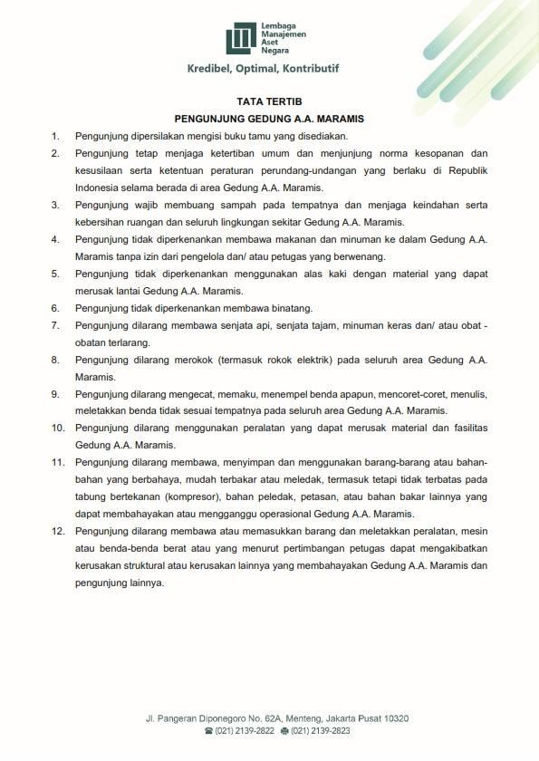

### Tata Tertib Pengunjung Gedung A.A. Maramis

1. Pengunjung dipersilakan mengisi buku tamu yang disediakan.
2. Pengunjung tetap menjaga ketertiban umum dan menjunjung norma kesopanan dan kesusilaan serta ketentuan peraturan perundang-undangan yang berlaku di Republik Indonesia selama berada di area Gedung A.A. Maramis.
3. Pengunjung wajib membuang sampah pada tempatnya dan menjaga keindahan serta kebersihan ruangan dan seluruh lingkungan sekitar Gedung A.A. Maramis.
4. Pengunjung tidak diperkenankan membawa makanan dan minuman ke dalam Gedung A.A. Maramis tanpa izin dari pengelola dan/atau petugas yang berwenang.
5. Pengunjung tidak diperkenankan menggunakan alas kaki dengan material yang dapat merusak lantai Gedung A.A. Maramis.
6. Pengunjung tidak diperkenankan membawa binatang.
7. Pengunjung dilarang membawa senjata api, senjata tajam, minuman keras dan/atau obat-obatan terlarang.
8. Pengunjung dilarang merokok (termasuk rokok elektrik) pada seluruh area Gedung A.A. Maramis.
9. Pengunjung dilarang mengecat, memaku, menempel benda apapun, mencoret-coret, menulis, meletakkan benda tidak sesuai tempatnya pada seluruh area Gedung A.A. Maramis.
10. Pengunjung dilarang menggunakan peralatan yang dapat merusak material dan fasilitas Gedung A.A. Maramis.
11. Pengunjung dilarang membawa, menyimpan dan menggunakan barang-barang atau bahan-bahan yang berbahaya, mudah terbakar atau meledak, termasuk tetapi tidak terbatas pada tabung bertekanan (kompresor), bahan peledak, petasan, atau bahan bakar lainnya yang dapat membahayakan atau mengganggu operasional Gedung A.A. Maramis.
12. Pengunjung dilarang membawa atau memasukkan barang dan meletakkan peralatan, mesin atau benda-benda berat atau yang menurut pertimbangan petugas dapat mengakibatkan kerusakan struktural atau kerusakan lainnya yang membahayakan Gedung A.A. Maramis dan pengunjung lainnya.

---

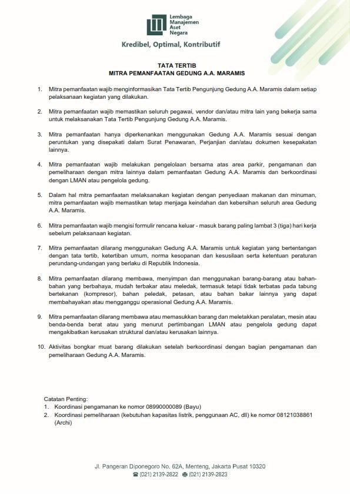

### Tata Tertib Mitra Pemanfaatan Gedung A.A. Maramis

1. Mitra pemanfaatan wajib menginformasikan Tata Tertib Pengunjung Gedung A.A. Maramis dalam setiap pelaksanaan kegiatan yang dilakukan.
2. Mitra pemanfaatan wajib memastikan seluruh pegawai, vendor dan/atau mitra lain yang bekerja sama untuk melaksanakan Tata Tertib Pengunjung Gedung A.A. Maramis.
3. Mitra pemanfaatan hanya diperkenankan menggunakan Gedung A.A. Maramis sesuai dengan peruntukan yang disepakati dalam Surat Penawaran, Perjanjian dan/atau dokumen kesepakatan lainnya.
4. Mitra pemanfaatan wajib melakukan pengelolaan bersama atas area parkir, pengamanan dan pemeliharaan dengan mitra lainnya dalam pemanfaatan Gedung A.A. Maramis dan berkoordinasi dengan LMAN atau pengelola gedung.
5. Dalam hal mitra pemanfaatan melaksanakan kegiatan dengan penyediaan makanan dan minuman, mitra pemanfaatan wajib memastikan tetap menjaga keindahan dan kebersihan seluruh area Gedung A.A. Maramis.
6. Mitra pemanfaatan wajib mengisi formulir rencana keluar - masuk barang paling lambat 3 (tiga) hari kerja sebelum pelaksanaan kegiatan.
7. Mitra pemanfaatan dilarang menggunakan Gedung A.A. Maramis untuk kegiatan yang bertentangan dengan tata tertib, ketertiban umum, norma kesopanan dan kesusilaan serta ketentuan peraturan perundang-undangan yang berlaku di Republik Indonesia.
8. Mitra pemanfaatan dilarang membawa, menyimpan dan menggunakan barang-barang atau bahan-bahan yang berbahaya, mudah terbakar atau meledak, termasuk tetapi tidak terbatas pada tabung bertekanan (kompresor), bahan peledak, petasan, atau bahan bakar lainnya yang dapat membahayakan atau mengganggu operasional Gedung A.A. Maramis.
9. Mitra pemanfaatan dilarang membawa atau memasukkan barang dan meletakkan peralatan, mesin atau benda-benda berat atau yang menurut pertimbangan LMAN atau pengelola gedung dapat mengakibatkan kerusakan struktural dan/atau kerusakan lainnya.
10. Aktivitas bongkar muat barang dilakukan setelah berkoordinasi dengan bagian pengamanan dan pemeliharaan Gedung A.A. Maramis.

### Kontak Koordinasi Operasional & Teknis

* **Koordinasi Pengamanan:**  
  `0899-0000-089` (Bayu)
* **Koordinasi Pemeliharaan** (kebutuhan kapasitas listrik, pendingin udara/AC, utilitas teknis):  
  `0812-1038-861` (Archi)

---

## 7. Kontak & Informasi Kolaborasi

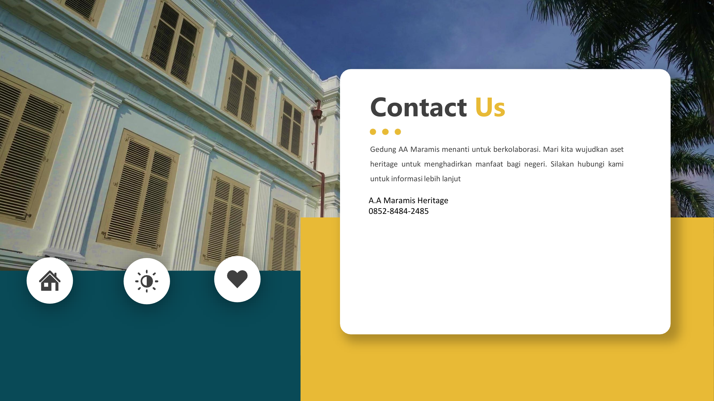

> *"Gedung A.A. Maramis menanti untuk berkolaborasi. Mari kita wujudkan aset heritage untuk menghadirkan manfaat bagi negeri. Silakan hubungi kami untuk informasi lebih lanjut."*

### Saluran Komunikasi & Pemasaran:
* **WhatsApp / Telepon:**  
  * `0821-7305-0353`  
  * `0852-8484-2485`  
* **Identitas Aset:** A.A Maramis Heritage  

### Kantor Pengelola (Lembaga Manajemen Aset Negara - LMAN):
* **Alamat:** Jl. Pangeran Diponegoro No. 62A, Menteng, Jakarta Pusat 10320  
* **Telepon:** (021) 2139-2822  
* **Faksimili:** (021) 2139-2823  
* **Instansi Induk:** Kementerian Keuangan Republik Indonesia  
* **Nilai Budaya:** *Kredibel, Optimal, Kontributif*  

---
*Catatan Dokumen: Dokumen ini disusun berdasarkan Booklet Gedung A.A. Maramis versi Updated September 2026.*
