# Laporan Final: Analisis Penggunaan Tertinggi dan Terbaik (Highest and Best Use / HBU) Aset Bangunan Cagar Budaya Gedung A.A. Maramis

> **Dokumen Sumber:** `0 - source/Laporan Final - Analisis Penggunaan Tertinggi dan Terbaik Aset Bangunan Cagar Budaya AA Maramis_151223.pdf`  
> **Klien / Pemilik Aset:** Lembaga Manajemen Aset Negara (LMAN) – Kementerian Keuangan Republik Indonesia  
> **Konsultan Penyusun:** Colliers International Indonesia – Advisory Services  
> **Tanggal Dokumen:** 15 Desember 2023  
> **Status Bangunan:** Bangunan Cagar Budaya Peringkat Nasional (Kepmendikbud No. 210/M/2015)  
> **Status Laporan:** Laporan Final (Private & Confidential)  
> **Format Dokumen:** Single Comprehensive Ingested Markdown Document  

---

<!-- BEGIN COMPLETE PAGE RENDERS: OPENING -->
## Halaman Pembuka Asli

Visual berikut mempertahankan seluruh tata letak, foto, diagram, grafik, legenda, anotasi, dan teks yang menjadi bagian dari halaman asli PDF.

### Slide 1: Sampul

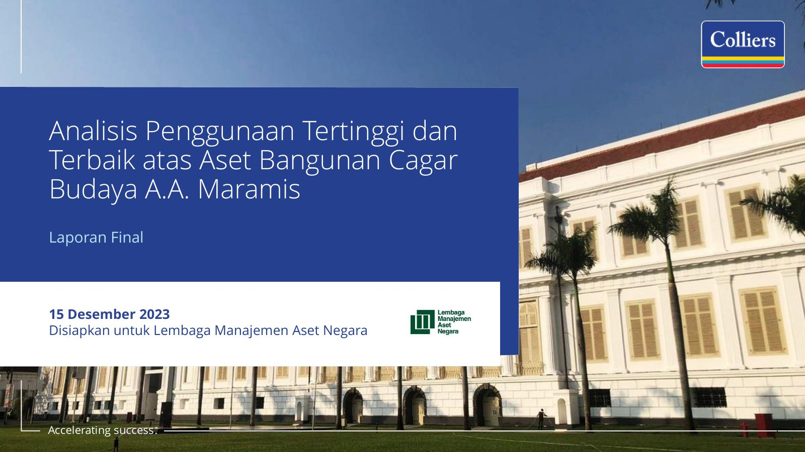

### Slide 2: Daftar Isi

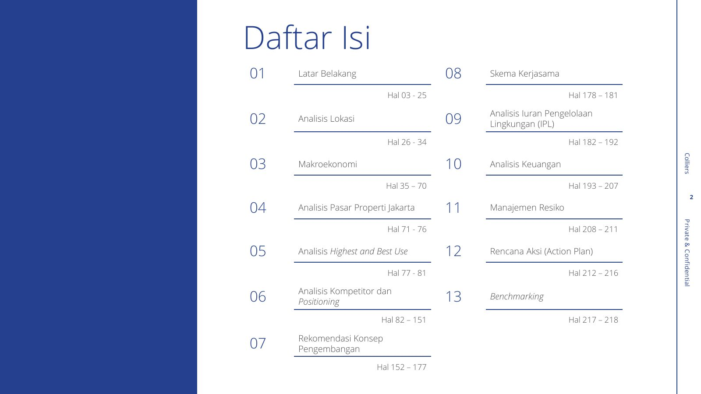
<!-- END COMPLETE PAGE RENDERS: OPENING -->

## Ringkasan Eksekutif (Executive Summary)

Dokumen ini memuat **Laporan Final Kajian Analisis Penggunaan Tertinggi dan Terbaik (*Highest and Best Use* / HBU)** atas aset **Bangunan Cagar Budaya Gedung A.A. Maramis** (eks *Het Groote Huis* / Istana Daendels di Weltevreden) yang disusun oleh **Colliers International Indonesia – Advisory Services** untuk **Lembaga Manajemen Aset Negara (LMAN)** pada 15 Desember 2023.

Kajian ini mengevaluasi potensi pemanfaatan komersial dan kultural gedung bersejarah seluas total *saleable area* **8.328 m²** (dengan alokasi NLA efektif tahap awal **7.442,60 m²**) pasca-revitalisasi cagar budaya yang tuntas pada akhir 2022. Kajian berlandaskan 4 pilar HBU: **Kelayakan Legal/Regulasi**, **Kelayakan Fisik/Arsitektural Cagar Budaya**, **Kelayakan Finansial**, dan **Produktivitas Maksimal**.

### Temuan Kunci dan Rekomendasi Utama:
1. **Kesesuaian Regulasi & Koridor Cagar Budaya:** Berdasarkan UU No. 11/2010, PP No. 1/2022, Permen PUPR No. 19/2021, dan RDTR DKI Jakarta 2022 (Sub-Zona Perkantoran KT, KDB 60%, KLB 6,00), fungsi komersial adaptif (MICE, ritel tematik, F&B, dan galeri/museum) diizinkan penuh dengan syarat mutlak tidak merusak elemen arsitektur cagar budaya asli.
2. **Hasil Matriks Kuadran HBU:**
   - **Kuadran I (Prioritas Utama – Kelayakan Fisik/Lokasi Tinggi & Potensi Pasar Tinggi):** Gedung Serbaguna/MICE, Restoran Fine Dining, dan Ritel Tematik Heritage.
   - **Kuadran II (Prioritas Pendukung – Nilai Kultural & Komplementer):** Co-Working Space dan Museum / Galeri Seni Interaktif.
   - **Ditolak (Kuadran III & IV):** Hotel, Apartemen, Pusat Perbelanjaan Massal, Rumah Sakit, dan Universitas dinilai tidak layak secara fisik/zonasi cagar budaya.
3. **Skenario Pentahapan Pengembangan:**
   - **Jangka Pendek (2024–2027) – *Heritage Evolved*:** Pemanfaatan ruang berfokus pada aktivasi MICE (Grand Ballroom, meeting rooms), *Experimental Coffee Shop*, Area Event Temporer, Galeri/Museum Keuangan Negara, Media Center, dan Co-working terbatas.
   - **Jangka Menengah/Panjang (2028–2053) – *Heritage Evolved, Even Further*:** Peningkatan maturitas fungsi dengan menghadirkan Restoran Fine Dining permanen (526,1 m² di Lantai 1) dan ekspansi Ritel Tematik terkurasi di Lantai 2 (535,9 m²) dan Lantai 3 (629,9 m²).
4. **Skema Kerja Sama Optimal:**
   - **Skenario 1 (Sewa Guna / PMK 144/2020):** Direkomendasikan untuk penyewa MICE, Ritel Tematik, dan Co-Working dengan tarif sewa tetap (*fixed lease*), sementara Museum menerapkan skema *Revenue Sharing*.
   - **Skenario 2 (Kerja Sama Manajemen / KSM):** Alternatif pengelolaan terintegrasi melalui *master operator* properti komersial heritage.
5. **Beban Pengelolaan Lingkungan (IPL / Service Charge):** Total estimasi biaya operasional pengelolaan *public area* mencapai **Rp 10.869.327.387 per tahun** (setara **Rp 905.777.282 per bulan**), didominasi oleh utilitas listrik/air (19%), building management (18%), security (18%), dan engineering (17%).
6. **Kelayakan Finansial (Financial Feasibility):**
   - **Discount Rate / WACC:** **9,85%** (Cost of Equity 4,78%, Cost of Debt 5,07%, Tax 22%, Debt Ratio 65%).
   - **Total Belanja Modal (Capex Fit-out di luar tanah):** **Rp 92.595 Juta (~Rp 92,60 Miliar)**.
   - **Total Proyeksi Pendapatan (2024–2053):** **Rp 955.668 Juta (~Rp 955,67 Miliar)** dengan GOP Rp 500.042 Juta (52,32%).
   - **Net Present Value (NPV):** **Rp 47.494 Juta (~Rp 47,49 Miliar)**.
   - **Internal Rate of Return (IRR):** **14,24%** (jauh melampaui *hurdle rate* WACC 9,85%).
   - **Payback Period:** **9 Tahun** sejak 2024.
   - **Kesimpulan Investasi:** **LAYAK SECARA KEUANGAN (*FINANCIALLY FEASIBLE*)**.

---

## Daftar Isi & Navigasi Dokumen

| Bagian | Judul Bab / Konten | Halaman Asli | Tautan Langsung |
| :---: | :--- | :---: | :--- |
| **Ringkasan** | Ringkasan Eksekutif (*Executive Summary*) | Hal. i | [Buka Ringkasan](#ringkasan-eksekutif-executive-summary) |
| **Bab 01** | **Latar Belakang & Kajian Regulasi** | Hal. 3–25 | [Buka Bab 01](#bab-01-latar-belakang--kajian-regulasi) |
| **Bab 02** | **Analisis Lokasi & SWOT Kawasan** | Hal. 26–34 | [Buka Bab 02](#bab-02-analisis-lokasi--swot-kawasan) |
| **Bab 03** | **Makroekonomi & Demografi** | Hal. 35–70 | [Buka Bab 03](#bab-03-makroekonomi--demografi) |
| **Bab 04** | **Analisis Pasar Properti Jakarta** | Hal. 71–76 | [Buka Bab 04](#bab-04-analisis-pasar-properti-jakarta) |
| **Bab 05** | **Analisis Highest and Best Use (HBU)** | Hal. 77–81 | [Buka Bab 05](#bab-05-analisis-highest-and-best-use-hbu) |
| **Bab 06** | **Analisis Kompetitor & Positioning** | Hal. 82–151 | [Buka Bab 06](#bab-06-analisis-kompetitor--positioning) |
| | ├─ 6.1 Analisis Gedung Serbaguna / MICE | Hal. 83–95 | [Buka 6.1](#61-analisis-gedung-serbaguna--mice) |
| | ├─ 6.2 Analisis Restoran Fine Dining & Heritage F&B | Hal. 96–111 | [Buka 6.2](#62-analisis-restoran-fine-dining--heritage-fb) |
| | ├─ 6.3 Analisis Ritel Tematik | Hal. 112–131 | [Buka 6.3](#63-analisis-ritel-tematik) |
| | ├─ 6.4 Analisis Co-Working Space | Hal. 132–143 | [Buka 6.4](#64-analisis-co-working-space) |
| | └─ 6.5 Analisis Museum & Galeri Seni | Hal. 144–151 | [Buka 6.5](#65-analisis-museum--galeri-seni) |
| **Bab 07** | **Rekomendasi Konsep Pengembangan** | Hal. 152–177 | [Buka Bab 07](#bab-07-rekomendasi-konsep-pengembangan) |
| | ├─ 7.1 Visi & Konektivitas Kawasan | Hal. 153–157 | [Buka 7.1](#71-visi-tagline--konektivitas-kawasan) |
| | ├─ 7.2 Skenario Jangka Pendek (2024–2027) | Hal. 158–164 | [Buka 7.2](#72-skenario-jangka-pendek-20242027--heritage-evolved) |
| | ├─ 7.3 Skenario Jangka Menengah (2028–2053) | Hal. 165–170 | [Buka 7.3](#73-skenario-jangka-menengah-20282053--heritage-evolved-even-further) |
| | ├─ 7.4 Skenario Jangka Panjang (Edukasi Keuangan) | Hal. 171–172 | [Buka 7.4](#74-skenario-jangka-panjang-pusat-edukasi--diplomasi-keuangan) |
| | ├─ 7.5 Sirkulasi, Pedestrian & Parkir | Hal. 173–174 | [Buka 7.5](#75-skenario-sirkulasi-pedestrian--parkir) |
| | └─ 7.6 Pentahapan Pengembangan (Phasing) | Hal. 175–177 | [Buka 7.6](#76-skenario-pentahapan-pengembangan-phasing) |
| **Bab 08** | **Skema Kerja Sama** | Hal. 178–181 | [Buka Bab 08](#bab-08-skema-kerja-sama) |
| **Bab 09** | **Analisis Iuran Pengelolaan Lingkungan (IPL)** | Hal. 182–192 | [Buka Bab 09](#bab-09-analisis-iuran-pengelolaan-lingkungan-ipl) |
| **Bab 10** | **Analisis Keuangan & Kelayakan Investasi** | Hal. 193–207 | [Buka Bab 10](#bab-10-analisis-keuangan--kelayakan-investasi) |
| | ├─ 10.1 Parameter Modal (WACC) & Timeline NLA | Hal. 194–195 | [Buka 10.1](#101-parameter-modal-wacc--timeline-alokasi-ruang) |
| | ├─ 10.2 Asumsi Proyeksi Pendapatan | Hal. 196–201 | [Buka 10.2](#102-asumsi-proyeksi-pendapatan-mice-ritel-restoran-museum) |
| | ├─ 10.3 Asumsi Biaya Capex & Opex | Hal. 202–205 | [Buka 10.3](#103-asumsi-biaya-capex--biaya-operasional-opex) |
| | └─ 10.4 Proyeksi Laba Rugi, Arus Kas & Kelayakan | Hal. 206–207 | [Buka 10.4](#104-proyeksi-laba-rugi-arus-kas--kelayakan-finansial) |
| **Bab 11** | **Manajemen Risiko** | Hal. 208–211 | [Buka Bab 11](#bab-11-manajemen-risiko) |
| **Bab 12** | **Rencana Aksi (Action Plan)** | Hal. 212–216 | [Buka Bab 12](#bab-12-rencana-aksi-action-plan) |
| **Bab 13** | **Benchmarking Internasional & Penutup** | Hal. 217–219 | [Buka Bab 13](#bab-13-benchmarking-internasional--penutup) |

---

## Bab 01: Latar Belakang & Kajian Regulasi

> [!NOTE]
> Bab ini menguraikan latar belakang sejarah, proses revitalisasi cagar budaya, arahan Presiden dan Menteri Keuangan, konstelasi kawasan Lapangan Banteng, serta kerangka regulasi pelestarian cagar budaya dan perizinan zonasi RDTR DKI Jakarta 2022.

#### Slide 3: 01 Latar Belakang

<!-- BEGIN COMPLETE PAGE RENDER: SLIDE 3 -->
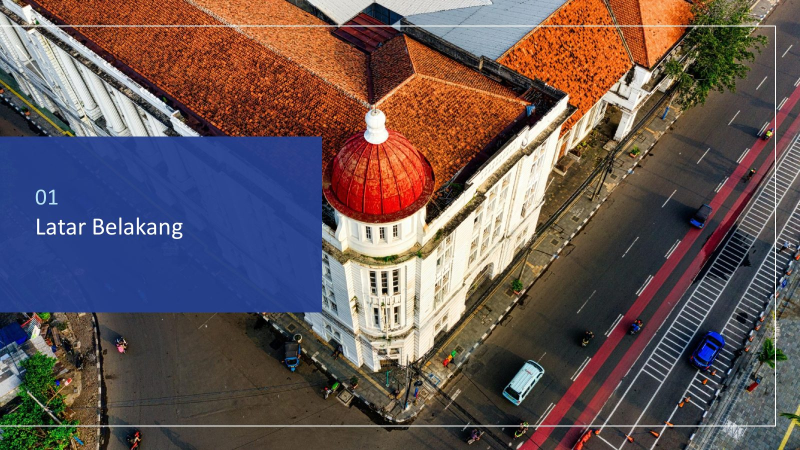
<!-- END COMPLETE PAGE RENDER: SLIDE 3 -->

---

#### Slide 4: Latar Belakang – Sejarah Sejarah – Sepanjang pembangunan dan penggunaannya gedung ini memiliki  berbagai nama, mulai dari Istana Daendels (pencetus pembangunannya),  Paleis Weltevreden, Het Groote Huis (Rumah Besar), dan Het Witte Huis  (Gedung Putih), serta sekarang Gedung A.A. Maramis. Gedung ini adalah  bangunan  Cagar  Budaya  peringkat  Nasional  dalam  Kompleks  Kementerian Keuangan Republik Indonesia, yang erat kaitannya dengan  Lapangan Banteng, Jakarta. Keduanya menjadi penanda perpindahan  pusat kota Batavia di muara Sungai Ciliwung ke area selatannya di  Weltevreden pada abad ke-19.

<!-- BEGIN COMPLETE PAGE RENDER: SLIDE 4 -->
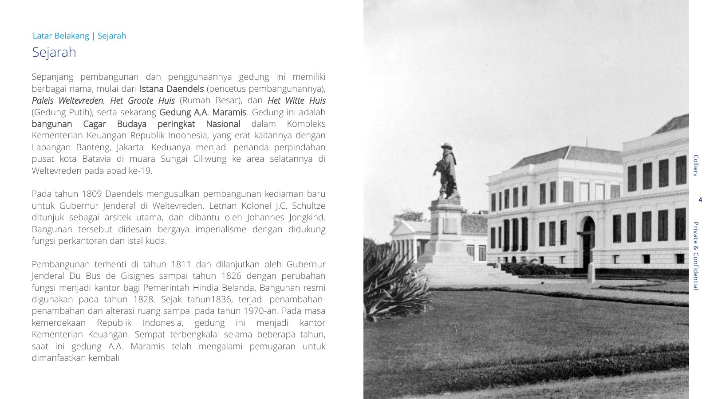
<!-- END COMPLETE PAGE RENDER: SLIDE 4 -->

Pada tahun 1809 Daendels mengusulkan pembangunan kediaman baru untuk Gubernur Jenderal di Weltevreden. Letnan Kolonel J.C. Schultze ditunjuk sebagai arsitek utama, dan dibantu oleh Johannes Jongkind. Bangunan tersebut didesain bergaya imperialisme dengan didukung fungsi perkantoran dan istal kuda.

Pembangunan terhenti di tahun 1811 dan dilanjutkan oleh Gubernur Jenderal Du Bus de Gisignes sampai tahun 1826 dengan perubahan fungsi menjadi kantor bagi Pemerintah Hindia Belanda. Bangunan resmi digunakan pada tahun 1828. Sejak tahun1836, terjadi penambahan- penambahan dan alterasi ruang sampai pada tahun 1970-an. Pada masa kemerdekaan Republik Indonesia, gedung ini menjadi kantor Kementerian Keuangan. Sempat terbengkalai selama beberapa tahun, saat ini gedung A.A. Maramis telah mengalami pemugaran untuk dimanfaatkan kembali

---

#### Slide 5: Latar Belakang – Gedung A.A. Maramis  Timeline Perkembangan Gedung A.A. Maramis dari Waktu ke Waktu

<!-- BEGIN COMPLETE PAGE RENDER: SLIDE 5 -->
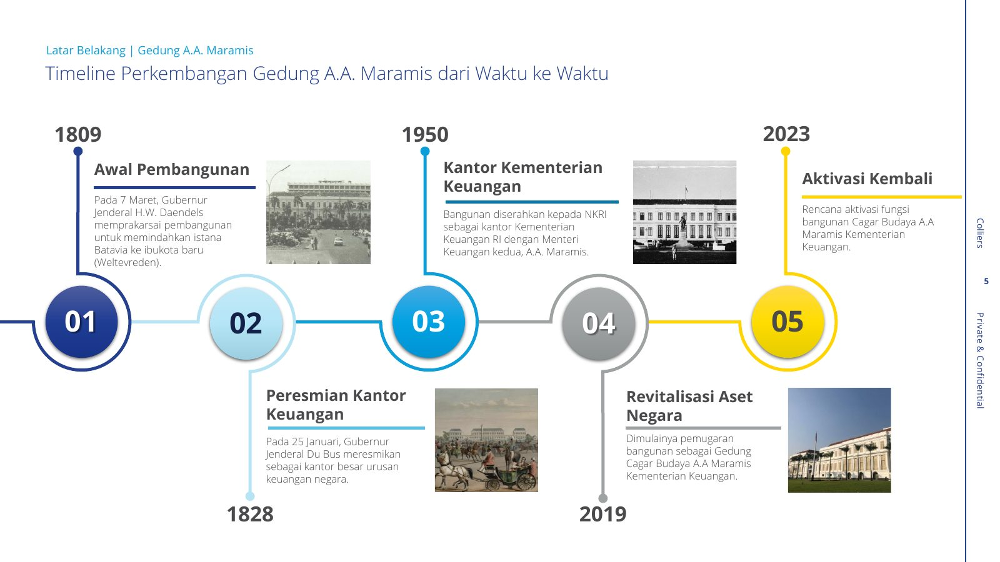
<!-- END COMPLETE PAGE RENDER: SLIDE 5 -->

05 04 03 02 01

1809

1828

1950

2019

Awal Pembangunan

Pada 7 Maret, Gubernur Jenderal H.W. Daendels memprakarsai pembangunan untuk memindahkan istana Batavia ke ibukota baru (Weltevreden).

Peresmian Kantor Keuangan

Pada 25 Januari, Gubernur Jenderal Du Bus meresmikan sebagai kantor besar urusan keuangan negara.

Kantor Kementerian Keuangan

Bangunan diserahkan kepada NKRI sebagai kantor Kementerian Keuangan RI dengan Menteri Keuangan kedua, A.A. Maramis.

Revitalisasi Aset Negara

Dimulainya pemugaran bangunan sebagai Gedung Cagar Budaya A.A Maramis Kementerian Keuangan.

Aktivasi Kembali

Rencana aktivasi fungsi bangunan Cagar Budaya A.A Maramis Kementerian Keuangan.

2023

---

#### Slide 6: Latar Belakang – Gedung A.A. Maramis  Timeline Proses Pemugaran Bangunan Cagar Budaya A.A. Maramis

<!-- BEGIN COMPLETE PAGE RENDER: SLIDE 6 -->
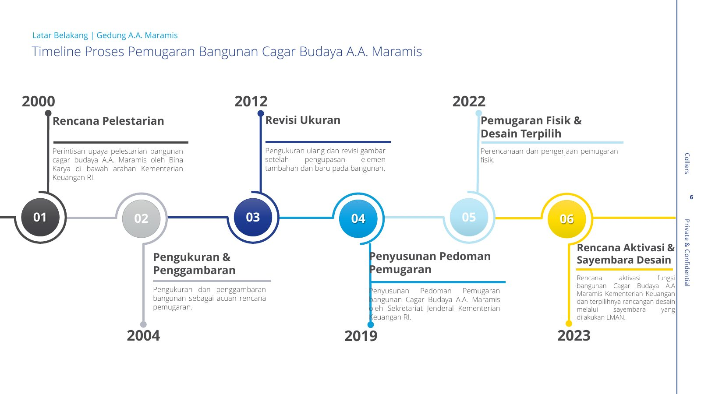
<!-- END COMPLETE PAGE RENDER: SLIDE 6 -->

05 04 03 02 01

2000

Pemugaran Fisik & Desain Terpilih

Perencanaan dan pengerjaan pemugaran fisik.

2012 2022

2004 2019 2023

Revisi Ukuran

Pengukuran ulang dan revisi gambar setelah pengupasan elemen tambahan dan baru pada bangunan.

Rencana Pelestarian

Perintisan upaya pelestarian bangunan cagar budaya A.A. Maramis oleh Bina Karya di bawah arahan Kementerian Keuangan RI.

Rencana Aktivasi & Sayembara Desain

Rencana aktivasi fungsi bangunan Cagar Budaya A.A Maramis Kementerian Keuangan dan terpilihnya rancangan desain melalui sayembara yang dilakukan LMAN.

Penyusunan Pedoman Pemugaran

Penyusunan Pedoman Pemugaran bangunan Cagar Budaya A.A. Maramis oleh Sekretariat Jenderal Kementerian Keuangan RI.

Pengukuran & Penggambaran

Pengukuran dan penggambaran bangunan sebagai acuan rencana pemugaran.

---

#### Slide 7: Latar Belakang – Gedung A.A. Maramis  Arahan Presiden dan Menteri Keuangan Republik Indonesia

<!-- BEGIN COMPLETE PAGE RENDER: SLIDE 7 -->
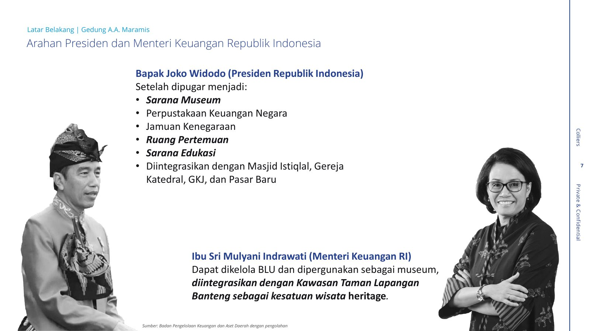
<!-- END COMPLETE PAGE RENDER: SLIDE 7 -->

  Bapak Joko Widodo (Presiden Republik Indonesia)
  Setelah dipugar menjadi:
- Sarana Museum
- Perpustakaan Keuangan Negara
- Jamuan Kenegaraan
- Ruang Pertemuan
- Sarana Edukasi
- Diintegrasikan dengan Masjid Istiqlal, Gereja
  Katedral, GKJ, dan Pasar Baru

Ibu Sri Mulyani Indrawati (Menteri Keuangan RI) Dapat dikelola BLU dan dipergunakan sebagai museum, diintegrasikan dengan Kawasan Taman Lapangan Banteng sebagai kesatuan wisata heritage.

> **Sumber: Badan Pengelolaan Keuangan dan Aset Daerah dengan pengolahan**

---

#### Slide 8: Latar Belakang – Gedung A.A. Maramis  Bangunan Bersejarah di Sekitar A.A. Maramis

<!-- BEGIN COMPLETE PAGE RENDER: SLIDE 8 -->
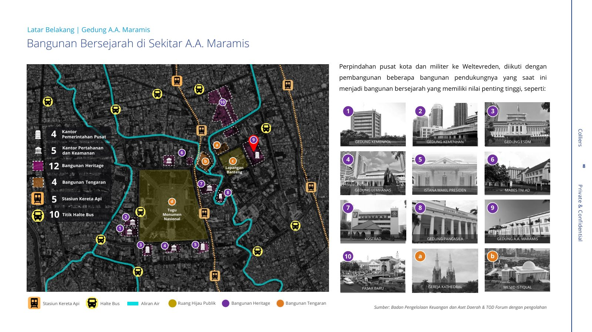
<!-- END COMPLETE PAGE RENDER: SLIDE 8 -->

Perpindahan pusat kota dan militer ke Weltevreden, diikuti dengan

pembangunan beberapa bangunan pendukungnya yang saat ini

menjadi bangunan bersejarah yang memiliki nilai penting tinggi, seperti:

> **Sumber: Badan Pengelolaan Keuangan dan Aset Daerah & TOD Forum dengan pengolahan Stasiun Kereta Api Ruang Hijau Publik Aliran Air Halte Bus Bangunan Heritage Bangunan Tengaran**

1

2

3 4 5

6

7

b

a

1

GEDUNG KEMENPOL

2

GEDUNG KEMENHAN

3

GEDUNG ESDM

4

GEDUNG LEMHANAS

5

ISTANA WAKIL PRESIDEN

6

MABES TNI AD

7

KOSTRAD

GEDUNG PANCASILA

9

GEDUNG A.A. MARAMIS

a

GEREJA KATHEDRAL

b

MESJID ISTIQLAL

Tugu Monumen

Nasional

10

Lapangan

Banteng

PASAR BARU

10

9

c

d

Kantor Pertahanan dan Keamanan

Kantor Pemerintahan Pusat

Bangunan Tengaran

Bangunan Heritage

Stasiun Kereta Api

Titik Halte Bus

5

4

12

4

5

10

---

#### Slide 9: Aksis Monumental pada Bangunan Bernilai Sejarah – Latar Belakang – Gedung A.A. Maramis

<!-- BEGIN COMPLETE PAGE RENDER: SLIDE 9 -->
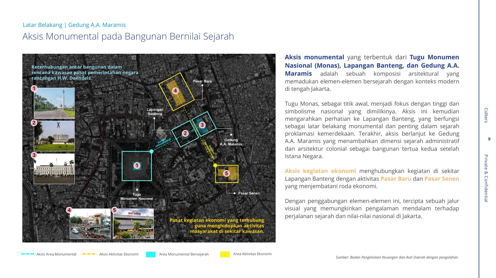
<!-- END COMPLETE PAGE RENDER: SLIDE 9 -->

Aksis monumental yang terbentuk dari Tugu Monumen Nasional (Monas), Lapangan Banteng, dan Gedung A.A. Maramis adalah sebuah komposisi arsitektural yang memadukan elemen-elemen bersejarah dengan konteks modern di tengah Jakarta.

Tugu Monas, sebagai titik awal, menjadi fokus dengan tinggi dan simbolisme nasional yang dimilikinya. Aksis ini kemudian mengarahkan perhatian ke Lapangan Banteng, yang berfungsi sebagai latar belakang monumental dan penting dalam sejarah proklamasi kemerdekaan. Terakhir, aksis berlanjut ke Gedung A.A. Maramis yang menambahkan dimensi sejarah administratif dan arsitektur colonial sebagai bangunan tertua kedua setelah Istana Negara.

Aksis kegiatan ekonomi menghubungkan kegiatan di sekitar Lapangan Banteng dengan aktivitas Pasar Baru dan Pasar Senen yang menjembatani roda ekonomi.

Dengan penggabungan elemen-elemen ini, tercipta sebuah jalur visual yang memungkinkan pengalaman mendalam terhadap perjalanan sejarah dan nilai-nilai nasional di Jakarta.

> **Sumber: Badan Pengelolaan Keuangan dan Aset Daerah dengan pengolahan**

Aksis Area Monumental Area Monumental Bersejarah Aksis Aktivitas Ekonomi Area Aktivitas Ekonomi

Keterhubungan antar bangunan dalam rencana kawasan pusat pemerintahan negara rancangan H.W. Daendels.

Pusat kegiatan ekonomi yang terhubung

guna menghidupkan aktivitas masyarakat di sekitar kawasan.

1

2

3

4

5

1

2

3

4 5

---

#### Slide 10: Latar Belakang – Gedung A.A. Maramis  Lapangan Banteng sebagai Kawasan Kantor Pemerintahan

<!-- BEGIN COMPLETE PAGE RENDER: SLIDE 10 -->
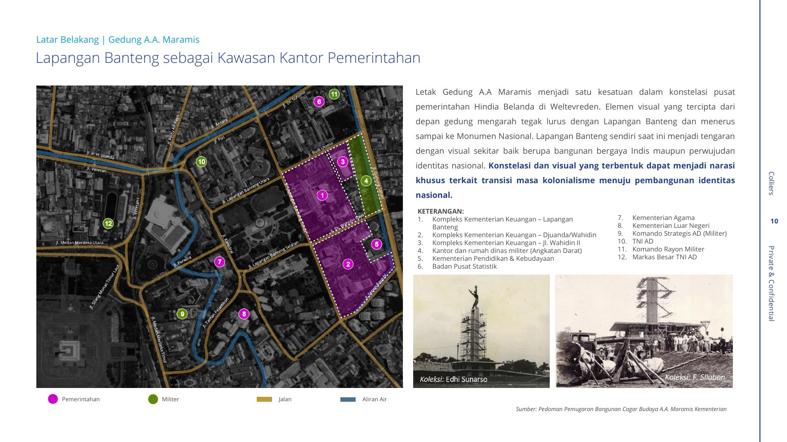
<!-- END COMPLETE PAGE RENDER: SLIDE 10 -->

Jl. Medan Merdeka Utara

Pemerintahan Militer

  KETERANGAN:
- **1.** 
  Kompleks Kementerian Keuangan – Lapangan
  Banteng
- **2.** 
  Kompleks Kementerian Keuangan – Djuanda/Wahidin
- **3.** 
  Kompleks Kementerian Keuangan – Jl. Wahidin II
- **4.** 
  Kantor dan rumah dinas militer (Angkatan Darat)
- **5.** 
  Kementerian Pendidikan & Kebudayaan
- **6.** 
  Badan Pusat Statistik

Jalan Aliran Air

> **Sumber: Pedoman Pemugaran Bangunan Cagar Budaya A.A. Maramis Kementerian**

Letak Gedung A.A Maramis menjadi satu kesatuan dalam konstelasi pusat

pemerintahan Hindia Belanda di Weltevreden. Elemen visual yang tercipta dari

depan gedung mengarah tegak lurus dengan Lapangan Banteng dan menerus

sampai ke Monumen Nasional. Lapangan Banteng sendiri saat ini menjadi tengaran

dengan visual sekitar baik berupa bangunan bergaya Indis maupun perwujudan

identitas nasional. Konstelasi dan visual yang terbentuk dapat menjadi narasi

khusus terkait transisi masa kolonialisme menuju pembangunan identitas

nasional.

- **7.** 
  Kementerian Agama
- **8.** 
  Kementerian Luar Negeri
- **9.** 
  Komando Strategis AD (Militer)
- **10.** 
  TNI AD
- **11.** 
  Komando Rayon Militer
- **12.** 
  Markas Besar TNI AD

---

#### Slide 11: Persebaran Bangunan Objek dan Potensi Cagar Budaya di Area – Latar Belakang – Gedung A.A. Maramis

<!-- BEGIN COMPLETE PAGE RENDER: SLIDE 11 -->
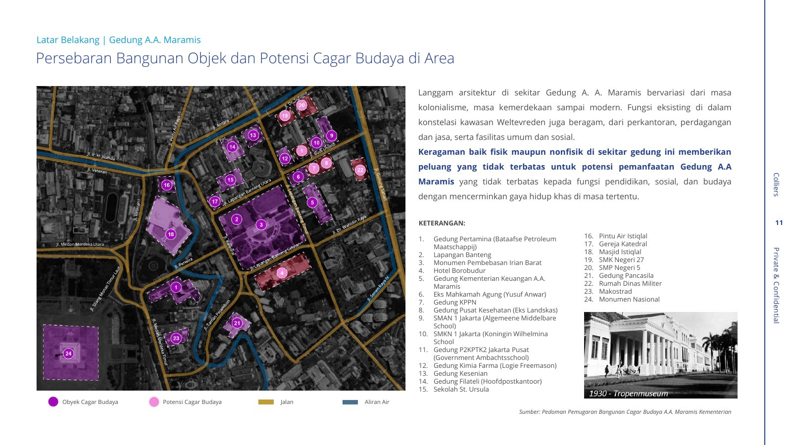
<!-- END COMPLETE PAGE RENDER: SLIDE 11 -->

Jl. Medan Merdeka Utara

Obyek Cagar Budaya Potensi Cagar Budaya Jalan Aliran Air

KETERANGAN:

- **1.** 
  Gedung Pertamina (Bataafse Petroleum
  Maatschappij)
- **2.** 
  Lapangan Banteng
- **3.** 
  Monumen Pembebasan Irian Barat
- **4.** 
  Hotel Borobudur
- **5.** 
  Gedung Kementerian Keuangan A.A.
  Maramis
- **6.** 
  Eks Mahkamah Agung (Yusuf Anwar)
- **7.** 
  Gedung KPPN
- **8.** 
  Gedung Pusat Kesehatan (Eks Landskas)
- **9.** 
  SMAN 1 Jakarta (Algemeene Middelbare
  School)
- **10.** 
  SMKN 1 Jakarta (Koningin Wilhelmina
  School
- **11.** 
  Gedung P2KPTK2 Jakarta Pusat
  (Government Ambachtsschool)
- **12.** 
  Gedung Kimia Farma (Logie Freemason)
- **13.** 
  Gedung Kesenian
- **14.** 
  Gedung Filateli (Hoofdpostkantoor)
- **15.** 
  Sekolah St. Ursula

> **Sumber: Pedoman Pemugaran Bangunan Cagar Budaya A.A. Maramis Kementerian**

Langgam arsitektur di sekitar Gedung A. A. Maramis bervariasi dari masa

kolonialisme, masa kemerdekaan sampai modern. Fungsi eksisting di dalam

konstelasi kawasan Weltevreden juga beragam, dari perkantoran, perdagangan

dan jasa, serta fasilitas umum dan sosial.

Keragaman baik fisik maupun nonfisik di sekitar gedung ini memberikan

peluang yang tidak terbatas untuk potensi pemanfaatan Gedung A.A

Maramis yang tidak terbatas kepada fungsi pendidikan, sosial, dan budaya

dengan mencerminkan gaya hidup khas di masa tertentu.

16. Pintu Air Istiqlal 17. Gereja Katedral 18. Masjid Istiqlal 19. SMK Negeri 27 20. SMP Negeri 5 21. Gedung Pancasila 22. Rumah Dinas Militer 23. Makostrad 24. Monumen Nasional

---

#### Slide 12: Latar Belakang – Gedung A.A. Maramis – Signifikansi Kawasan – Signifikansi gedung A.A. Maramis dalam konstelasi kawasan yang dahulu dikenal  sebagai Weltevreden atau pusat kota baru setelah Batavia dapat disimpulkan  menjadi  beberapa  pernyataan  signifikansi  sebagai  berikut:

<!-- BEGIN COMPLETE PAGE RENDER: SLIDE 12 -->
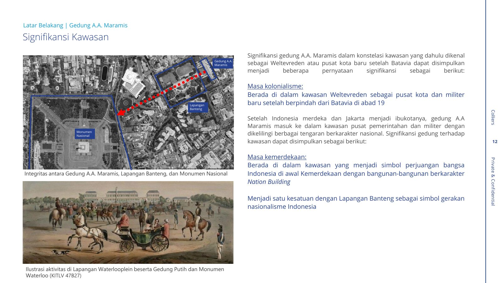
<!-- END COMPLETE PAGE RENDER: SLIDE 12 -->

Ilustrasi aktivitas di Lapangan Waterlooplein beserta Gedung Putih dan Monumen Waterloo (KITLV 47B27)

Integritas antara Gedung A.A. Maramis, Lapangan Banteng, dan Monumen Nasional

Gedung A.A. Maramis

Lapangan Banteng

Monumen Nasional

Masa kolonialisme: Berada di dalam kawasan Weltevreden sebagai pusat kota dan militer baru setelah berpindah dari Batavia di abad 19

Setelah Indonesia merdeka dan Jakarta menjadi ibukotanya, gedung A.A Maramis masuk ke dalam kawasan pusat pemerintahan dan militer dengan dikelilingi berbagai tengaran berkarakter nasional. Signifikansi gedung terhadap kawasan dapat disimpulkan sebagai berikut:

Masa kemerdekaan: Berada di dalam kawasan yang menjadi simbol perjuangan bangsa Indonesia di awal Kemerdekaan dengan bangunan-bangunan berkarakter Nation Building

Menjadi satu kesatuan dengan Lapangan Banteng sebagai simbol gerakan nasionalisme Indonesia

---

#### Slide 13: Latar Belakang – Gedung A.A. Maramis  Signifikansi Kawasan – Integritas struktur dan bangunan di sekitar gedung A.A. Maramis sudah terbangun

<!-- BEGIN COMPLETE PAGE RENDER: SLIDE 13 -->
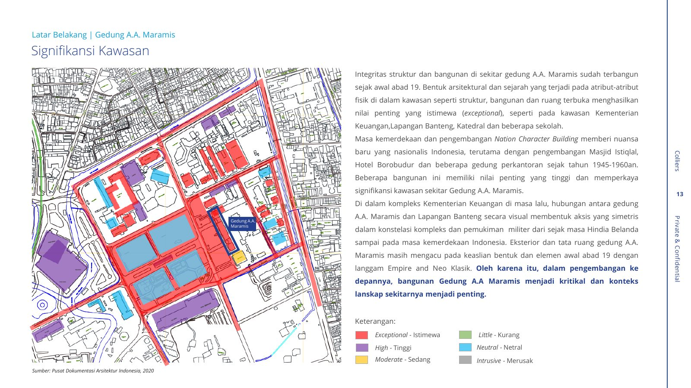
<!-- END COMPLETE PAGE RENDER: SLIDE 13 -->

> **Sumber: Pusat Dokumentasi Arsitektur Indonesia, 2020**

Exceptional - Istimewa

Keterangan:

High - Tinggi

Moderate - Sedang

Little - Kurang

Neutral - Netral

Intrusive - Merusak

Gedung A.A. Maramis

sejak awal abad 19. Bentuk arsitektural dan sejarah yang terjadi pada atribut-atribut

fisik di dalam kawasan seperti struktur, bangunan dan ruang terbuka menghasilkan

nilai penting yang istimewa (exceptional), seperti pada kawasan Kementerian

Keuangan,Lapangan Banteng, Katedral dan beberapa sekolah.

Masa kemerdekaan dan pengembangan Nation Character Building memberi nuansa

baru yang nasionalis Indonesia, terutama dengan pengembangan Masjid Istiqlal,

Hotel Borobudur dan beberapa gedung perkantoran sejak tahun 1945-1960an.

Beberapa bangunan ini memiliki nilai penting yang tinggi dan memperkaya

signifikansi kawasan sekitar Gedung A.A. Maramis.

Di dalam kompleks Kementerian Keuangan di masa lalu, hubungan antara gedung

A.A. Maramis dan Lapangan Banteng secara visual membentuk aksis yang simetris

dalam konstelasi kompleks dan pemukiman  militer dari sejak masa Hindia Belanda

sampai pada masa kemerdekaan Indonesia. Eksterior dan tata ruang gedung A.A.

Maramis masih mengacu pada keaslian bentuk dan elemen awal abad 19 dengan

langgam Empire and Neo Klasik. Oleh karena itu, dalam pengembangan ke

depannya, bangunan Gedung A.A Maramis menjadi kritikal dan konteks

lanskap sekitarnya menjadi penting.

---

#### Slide 14: Latar Belakang – Gedung A.A. Maramis  Signifikansi Kompleks Kementerian Keuangan

<!-- BEGIN COMPLETE PAGE RENDER: SLIDE 14 -->
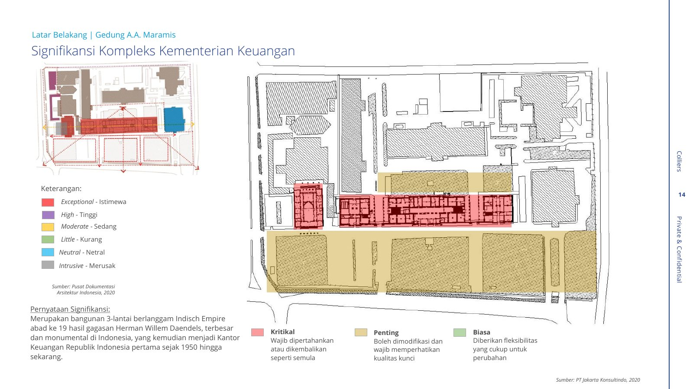
<!-- END COMPLETE PAGE RENDER: SLIDE 14 -->

Exceptional - Istimewa

Keterangan:

High - Tinggi

Moderate - Sedang

Little - Kurang

Neutral - Netral

Intrusive - Merusak

> **Sumber: Pusat Dokumentasi**

Arsitektur Indonesia, 2020

Kritikal Wajib dipertahankan atau dikembalikan seperti semula

Penting Boleh dimodifikasi dan wajib memperhatikan kualitas kunci

Biasa Diberikan fleksibilitas yang cukup untuk perubahan

> **Sumber: PT Jakarta Konsultindo, 2020**

Pernyataan Signifikansi: Merupakan bangunan 3-lantai berlanggam Indisch Empire abad ke 19 hasil gagasan Herman Willem Daendels, terbesar dan monumental di Indonesia, yang kemudian menjadi Kantor Keuangan Republik Indonesia pertama sejak 1950 hingga sekarang.

---

#### Slide 15: Latar Belakang – Gedung A.A. Maramis  Signifikansi Bangunan

<!-- BEGIN COMPLETE PAGE RENDER: SLIDE 15 -->
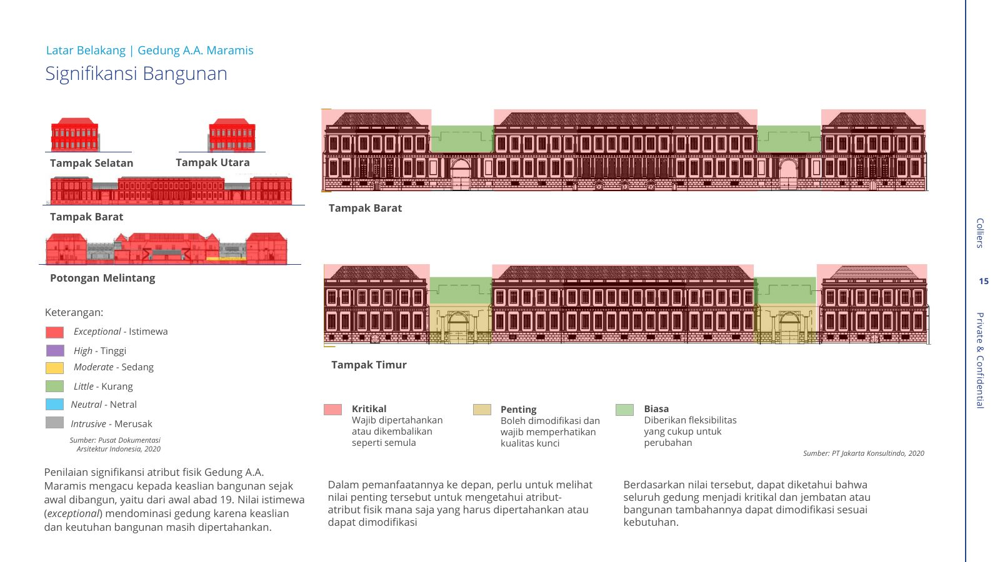
<!-- END COMPLETE PAGE RENDER: SLIDE 15 -->

Tampak Selatan Tampak Utara

Tampak Barat

Potongan Melintang

Exceptional - Istimewa

Keterangan:

High - Tinggi

Moderate - Sedang

Little - Kurang

Neutral - Netral

Intrusive - Merusak

> **Sumber: Pusat Dokumentasi**

Arsitektur Indonesia, 2020

Kritikal Wajib dipertahankan atau dikembalikan seperti semula

Penting Boleh dimodifikasi dan wajib memperhatikan kualitas kunci

Biasa Diberikan fleksibilitas yang cukup untuk perubahan

> **Sumber: PT Jakarta Konsultindo, 2020**

Tampak Barat

Tampak Timur

Dalam pemanfaatannya ke depan, perlu untuk melihat nilai penting tersebut untuk mengetahui atribut- atribut fisik mana saja yang harus dipertahankan atau dapat dimodifikasi

Berdasarkan nilai tersebut, dapat diketahui bahwa seluruh gedung menjadi kritikal dan jembatan atau bangunan tambahannya dapat dimodifikasi sesuai kebutuhan.

Penilaian signifikansi atribut fisik Gedung A.A. Maramis mengacu kepada keaslian bangunan sejak awal dibangun, yaitu dari awal abad 19. Nilai istimewa (exceptional) mendominasi gedung karena keaslian dan keutuhan bangunan masih dipertahankan.

---

#### Slide 16: Latar Belakang – Gedung A.A. Maramis  Signifikansi Bangunan

<!-- BEGIN COMPLETE PAGE RENDER: SLIDE 16 -->
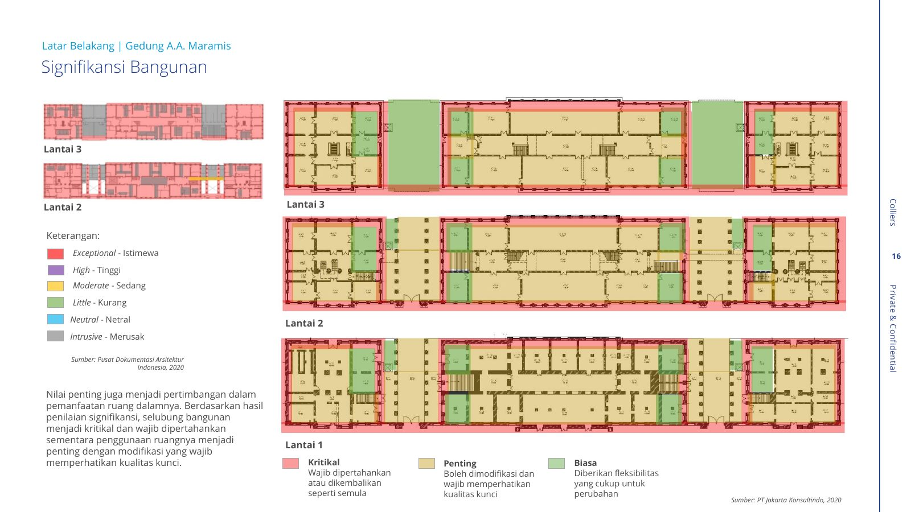
<!-- END COMPLETE PAGE RENDER: SLIDE 16 -->

> **Sumber: Pusat Dokumentasi Arsitektur**

Indonesia, 2020

Lantai 2

Lantai 3

Exceptional - Istimewa

Keterangan:

High - Tinggi

Moderate - Sedang

Little - Kurang

Neutral - Netral

Intrusive - Merusak

Lantai 3

Lantai 2

Lantai 1

Kritikal Wajib dipertahankan atau dikembalikan seperti semula

Penting Boleh dimodifikasi dan wajib memperhatikan kualitas kunci

Biasa Diberikan fleksibilitas yang cukup untuk perubahan

> **Sumber: PT Jakarta Konsultindo, 2020**

Nilai penting juga menjadi pertimbangan dalam pemanfaatan ruang dalamnya. Berdasarkan hasil penilaian signifikansi, selubung bangunan menjadi kritikal dan wajib dipertahankan sementara penggunaan ruangnya menjadi penting dengan modifikasi yang wajib memperhatikan kualitas kunci.

---

#### Slide 17: Kajian Peraturan – Latar Belakang – Gedung A.A. Maramis

<!-- BEGIN COMPLETE PAGE RENDER: SLIDE 17 -->
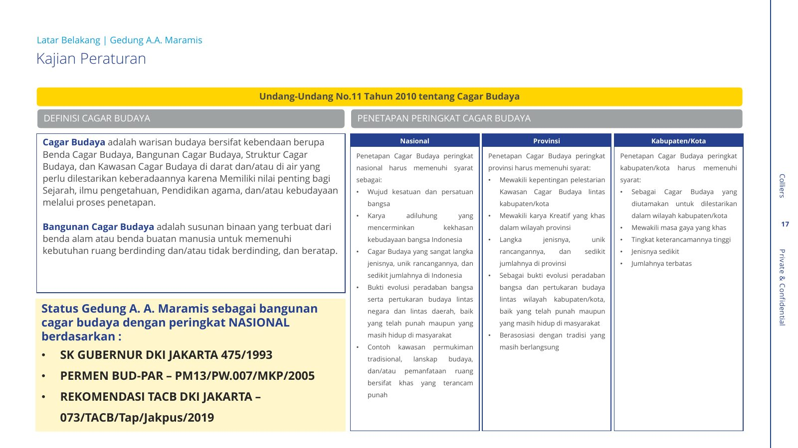
<!-- END COMPLETE PAGE RENDER: SLIDE 17 -->

Undang-Undang No.11 Tahun 2010 tentang Cagar Budaya

DEFINISI CAGAR BUDAYA PENETAPAN PERINGKAT CAGAR BUDAYA

Cagar Budaya adalah warisan budaya bersifat kebendaan berupa Benda Cagar Budaya, Bangunan Cagar Budaya, Struktur Cagar Budaya, dan Kawasan Cagar Budaya di darat dan/atau di air yang perlu dilestarikan keberadaannya karena Memiliki nilai penting bagi Sejarah, ilmu pengetahuan, Pendidikan agama, dan/atau kebudayaan melalui proses penetapan.

Bangunan Cagar Budaya adalah susunan binaan yang terbuat dari benda alam atau benda buatan manusia untuk memenuhi kebutuhan ruang berdinding dan/atau tidak berdinding, dan beratap.

Penetapan Cagar Budaya peringkat

nasional harus memenuhi syarat

sebagai:

- 
  Wujud kesatuan dan persatuan

bangsa

- 
  Karya
  adiluhung
  yang

mencerminkan kekhasan

kebudayaan bangsa Indonesia

- 
  Cagar Budaya yang sangat langka

jenisnya, unik rancangannya, dan

sedikit jumlahnya di Indonesia

- 
  Bukti evolusi peradaban bangsa

serta pertukaran budaya lintas

negara dan lintas daerah, baik

yang telah punah maupun yang

masih hidup di masyarakat

- 
  Contoh
  kawasan
  permukiman

tradisional, lanskap budaya,

dan/atau pemanfataan ruang

bersifat khas yang terancam

punah

Penetapan Cagar Budaya peringkat

provinsi harus memenuhi syarat:

- 
  Mewakili kepentingan pelestarian

Kawasan Cagar Budaya lintas

kabupaten/kota

- 
  Mewakili karya Kreatif yang khas

dalam wilayah provinsi

- 
  Langka
  jenisnya,
  unik

rancangannya, dan sedikit

jumlahnya di provinsi

- 
  Sebagai bukti evolusi peradaban

bangsa dan pertukaran budaya

lintas wilayah kabupaten/kota,

baik yang telah punah maupun

yang masih hidup di masyarakat

- 
  Berasosiasi dengan tradisi yang

masih berlangsung

Penetapan Cagar Budaya peringkat

kabupaten/kota harus memenuhi

syarat:

- 
  Sebagai
  Cagar
  Budaya
  yang

diutamakan untuk dilestarikan

dalam wilayah kabupaten/kota

- 
  Mewakili masa gaya yang khas

- 
  Tingkat keterancamannya tinggi

- 
  Jenisnya sedikit

- 
  Jumlahnya terbatas

Nasional Provinsi Kabupaten/Kota

Status Gedung A. A. Maramis sebagai bangunan cagar budaya dengan peringkat NASIONAL berdasarkan :

- 
  SK GUBERNUR DKI JAKARTA 475/1993

- 
  PERMEN BUD-PAR – PM13/PW.007/MKP/2005

- 
  REKOMENDASI TACB DKI JAKARTA –

073/TACB/Tap/Jakpus/2019

---

#### Slide 18: Kajian Peraturan – Latar Belakang – Gedung A.A. Maramis

<!-- BEGIN COMPLETE PAGE RENDER: SLIDE 18 -->
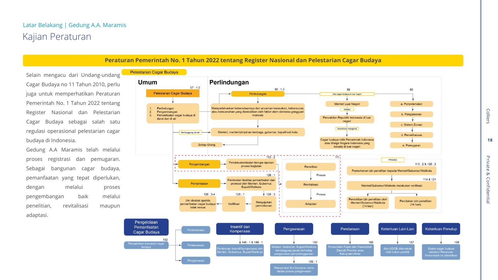
<!-- END COMPLETE PAGE RENDER: SLIDE 18 -->

Peraturan Pemerintah No. 1 Tahun 2022 tentang Register Nasional dan Pelestarian Cagar Budaya

Selain mengacu dari Undang-undang

Cagar Budaya no 11 Tahun 2010, perlu

juga untuk memperhatikan Peraturan

Pemerintah No. 1 Tahun 2022 tentang

Register Nasional dan Pelestarian

Cagar Budaya sebagai salah satu

regulasi operasional pelestarian cagar

budaya di Indonesia.

Gedung A.A Maramis telah melalui

proses registrasi dan pemugaran.

Sebagai bangunan cagar budaya,

pemanfaatan yang tepat diperlukan,

dengan melalui proses

pengembangan baik melalui

penelitian, revitalisasi maupun

adaptasi.

---

#### Slide 19: Kajian Peraturan – Latar Belakang – Gedung A.A. Maramis

<!-- BEGIN COMPLETE PAGE RENDER: SLIDE 19 -->
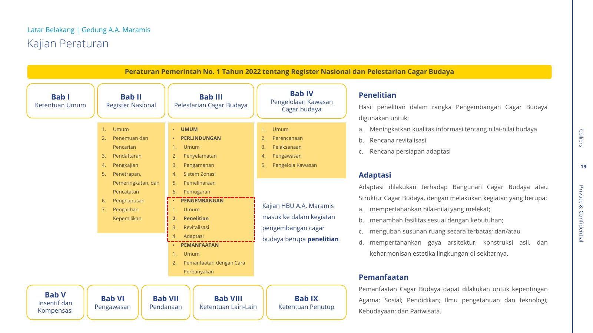
<!-- END COMPLETE PAGE RENDER: SLIDE 19 -->

Peraturan Pemerintah No. 1 Tahun 2022 tentang Register Nasional dan Pelestarian Cagar Budaya

Bab I Ketentuan Umum

Bab II Register Nasional

Bab III Pelestarian Cagar Budaya

Penelitian

Hasil penelitian dalam rangka Pengembangan Cagar Budaya

digunakan untuk:

- **a.** 
  Meningkatkan kualitas informasi tentang nilai-nilai budaya

- **b.** 
  Rencana revitalisasi

- **c.** 
  Rencana persiapan adaptasi

Adaptasi

Adaptasi dilakukan terhadap Bangunan Cagar Budaya atau

Struktur Cagar Budaya, dengan melakukan kegiatan yang berupa:

- **a.** 
  mempertahankan nilai-nilai yang melekat;

- **b.** 
  menambah fasilitas sesuai dengan kebutuhan;

- **c.** 
  mengubah susunan ruang secara terbatas; dan/atau

- **d.** 
  mempertahankan gaya arsitektur, konstruksi asli, dan

keharmonisan estetika lingkungan di sekitarnya.

Pemanfaatan

Pemanfaatan Cagar Budaya dapat dilakukan untuk kepentingan

Agama; Sosial; Pendidikan; Ilmu pengetahuan dan teknologi;

Kebudayaan; dan Pariwisata.

Bab IV Pengelolaan Kawasan

Cagar budaya

- **1.** 
  Umum

- **2.** 
  Penemuan dan

Pencarian

- **3.** 
  Pendaftaran

- **4.** 
  Pengkajian

- **5.** 
  Penetrapan,

Pemeringkatan, dan

Pencatatan

- **6.** 
  Penghapusan

- **7.** 
  Pengalihan

Kepemilikan

Bab V Insentif dan Kompensasi

Bab VI Pengawasan

Bab VII Pendanaan

Bab VIII Ketentuan Lain-Lain

Bab IX Ketentuan Penutup

- 
  UMUM

- 
  PERLINDUNGAN

- **1.** 
  Umum

- **2.** 
  Penyelamatan

- **3.** 
  Pengamanan

- **4.** 
  Sistem Zonasi

- **5.** 
  Pemeliharaan

- **6.** 
  Pemugaran

- 
  PENGEMBANGAN

- **1.** 
  Umum

- **2.** 
  Penelitian

- **3.** 
  Revitalisasi

- **4.** 
  Adaptasi

- 
  PEMANFAATAN

- **1.** 
  Umum

- **2.** 
  Pemanfaatan dengan Cara

Perbanyakan

- **1.** 
  Umum

- **2.** 
  Perencanaan

- **3.** 
  Pelaksanaan

- **4.** 
  Pengawasan

- **5.** 
  Pengelola Kawasan

Kajian HBU A.A. Maramis

masuk ke dalam kegiatan

pengembangan cagar

budaya berupa penelitian

---

#### Slide 20: Kajian Peraturan – Latar Belakang – Gedung A.A. Maramis

<!-- BEGIN COMPLETE PAGE RENDER: SLIDE 20 -->
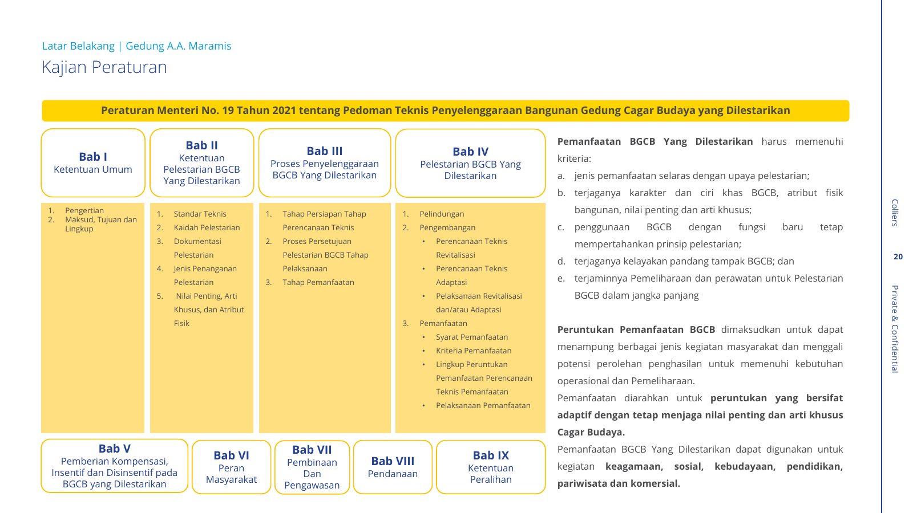
<!-- END COMPLETE PAGE RENDER: SLIDE 20 -->

Peraturan Menteri No. 19 Tahun 2021 tentang Pedoman Teknis Penyelenggaraan Bangunan Gedung Cagar Budaya yang Dilestarikan

Bab I Ketentuan Umum

Bab II Ketentuan Pelestarian BGCB Yang Dilestarikan

Bab III Proses Penyelenggaraan

BGCB Yang Dilestarikan

Bab IV Pelestarian BGCB Yang

Dilestarikan

- **1.** 
  Standar Teknis

- **2.** 
  Kaidah Pelestarian

- **3.** 
  Dokumentasi

Pelestarian

- **4.** 
  Jenis Penanganan

Pelestarian

- **5.** 
  Nilai Penting, Arti

Khusus, dan Atribut

Fisik

Bab V Pemberian Kompensasi, Insentif dan Disinsentif pada

BGCB yang Dilestarikan

Bab VI

Peran Masyarakat

Bab VII Pembinaan

Dan Pengawasan

Bab VIII Pendanaan

Bab IX Ketentuan

Peralihan

- **1.** 
  Tahap Persiapan Tahap

Perencanaan Teknis

- **2.** 
  Proses Persetujuan

Pelestarian BGCB Tahap

Pelaksanaan

- **3.** 
  Tahap Pemanfaatan

- **1.** 
  Pelindungan

- **2.** 
  Pengembangan

- 
  Perencanaan Teknis

Revitalisasi

- 
  Perencanaan Teknis

Adaptasi

- 
  Pelaksanaan Revitalisasi

dan/atau Adaptasi

- **3.** 
  Pemanfaatan

- 
  Syarat Pemanfaatan

- 
  Kriteria Pemanfaatan

- 
  Lingkup Peruntukan

Pemanfaatan Perencanaan

Teknis Pemanfaatan

- 
  Pelaksanaan Pemanfaatan

- **1.** 
  Pengertian
- **2.** 
  Maksud, Tujuan dan
  Lingkup

Pemanfaatan BGCB Yang Dilestarikan harus memenuhi

kriteria:

- **a.** 
  jenis pemanfaatan selaras dengan upaya pelestarian;

- **b.** 
  terjaganya karakter dan ciri khas BGCB, atribut fisik

bangunan, nilai penting dan arti khusus;

- **c.** 
  penggunaan
  BGCB
  dengan
  fungsi
  baru
  tetap

mempertahankan prinsip pelestarian;

- **d.** 
  terjaganya kelayakan pandang tampak BGCB; dan

- **e.** 
  terjaminnya Pemeliharaan dan perawatan untuk Pelestarian

BGCB dalam jangka panjang

Peruntukan Pemanfaatan BGCB dimaksudkan untuk dapat

menampung berbagai jenis kegiatan masyarakat dan menggali

potensi perolehan penghasilan untuk memenuhi kebutuhan

operasional dan Pemeliharaan.

Pemanfaatan diarahkan untuk peruntukan yang bersifat

adaptif dengan tetap menjaga nilai penting dan arti khusus

Cagar Budaya.

Pemanfaatan BGCB Yang Dilestarikan dapat digunakan untuk

kegiatan keagamaan, sosial, kebudayaan, pendidikan,

pariwisata dan komersial.

---

#### Slide 21: Kajian Peraturan – Latar Belakang – Gedung A.A. Maramis

<!-- BEGIN COMPLETE PAGE RENDER: SLIDE 21 -->
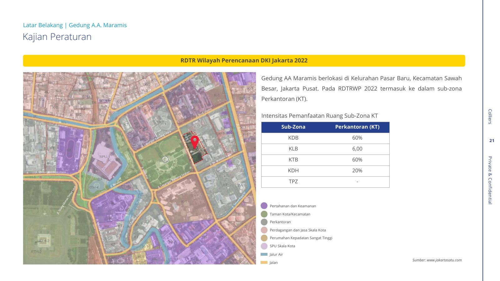
<!-- END COMPLETE PAGE RENDER: SLIDE 21 -->

| Sub-Zona | Perkantoran(KT) |
| :--- | :--- |
| KDB 60% |  |
| KLB 6,00 |  |
| KTB 60% |  |
| KDH 20% |  |
| TPZ - |  |

RDTR Wilayah Perencanaan DKI Jakarta 2022

Gedung AA Maramis berlokasi di Kelurahan Pasar Baru, Kecamatan Sawah

Besar, Jakarta Pusat. Pada RDTRWP 2022 termasuk ke dalam sub-zona

Perkantoran (KT).

Intensitas Pemanfaatan Ruang Sub-Zona KT

Sub-Zona Perkantoran (KT)

KDB 60%

KLB 6,00

KTB 60%

KDH 20%

  TPZ
- 

Jl. Medan Merdeka Utara

Pertahanan dan Keamanan

Taman Kota/Kecamatan

Perkantoran

Perdagangan dan Jasa Skala Kota

Perumahan Kepadatan Sangat Tinggi

SPU Skala Kota

Jalur Air

Jalan Sumber: www.jakartasatu.com

---

#### Slide 22: Kajian Peraturan – Latar Belakang – Gedung A.A. Maramis

<!-- BEGIN COMPLETE PAGE RENDER: SLIDE 22 -->
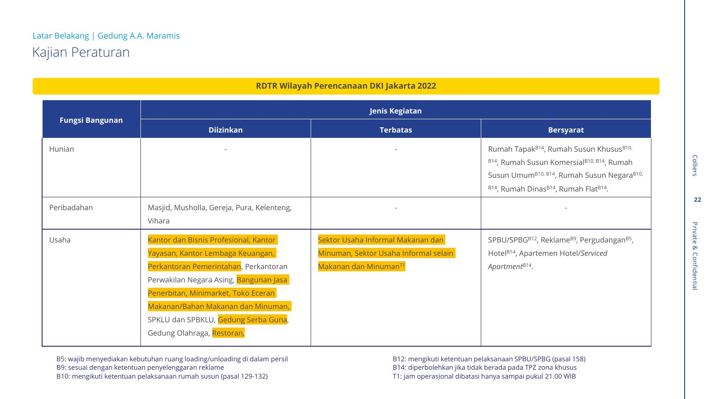
<!-- END COMPLETE PAGE RENDER: SLIDE 22 -->

| FungsiBangunan | JenisKegiatan | Kolom 3 | Kolom 4 |
| :--- | :--- | :--- | :--- |
|  | Diizinkan | Terbatas | Bersyarat |
| Hunian | - | - | RumahTapakB14, RumahSusunKhususB10, B14, RumahSusunKomersialB10, B14, Rumah SusunUmumB10, B14, RumahSusunNegaraB10, B14, RumahDinasB14, RumahFlatB14. |
| Peribadahan | Masjid, Musholla, Gereja, Pura, Kelenteng, Vihara | - | - |
| Usaha | Kantor dan BisnisProfesional, Kantor Yayasan, Kantor Lembaga Keuangan, PerkantoranPemerintahan, Perkantoran PerwakilanNegara Asing, BangunanJasa Penerbitan, Minimarket, TokoEceran Makanan/Bahan Makanandan Minuman, SPKLU dan SPBKLU, Gedung SerbaGuna, Gedung Olahraga, Restoran, | Sektor Usaha Informal Makanandan Minuman, Sektor Usaha Informal selain Makanandan MinumanT1 | SPBU/SPBGB12, ReklameB9, PergudanganB5, HotelB14, ApartemenHotel/Serviced ApartmentB14. |

RDTR Wilayah Perencanaan DKI Jakarta 2022

Fungsi Bangunan

Jenis Kegiatan

Diizinkan Terbatas Bersyarat

  Hunian
- 
- 
  Rumah TapakB14, Rumah Susun KhususB10,

B14, Rumah Susun KomersialB10, B14, Rumah

Susun UmumB10, B14, Rumah Susun NegaraB10,

B14, Rumah DinasB14, Rumah FlatB14.

Vihara

- 
- 

Usaha Kantor dan Bisnis Profesional, Kantor

Yayasan, Kantor Lembaga Keuangan,

Perkantoran Pemerintahan, Perkantoran

Perwakilan Negara Asing, Bangunan Jasa

Penerbitan, Minimarket, Toko Eceran

SPKLU dan SPBKLU, Gedung Serba Guna,

Gedung Olahraga, Restoran,

Makanan dan MinumanT1

SPBU/SPBGB12, ReklameB9, PergudanganB5,

HotelB14, Apartemen Hotel/Serviced

ApartmentB14.

B12: mengikuti ketentuan pelaksanaan SPBU/SPBG (pasal 158) B14: diperbolehkan jika tidak berada pada TPZ zona khusus T1: jam operasional dibatasi hanya sampai pukul 21.00 WIB

B5: wajib menyediakan kebutuhan ruang loading/unloading di dalam persil B9: sesuai dengan ketentuan penyelenggaran reklame B10: mengikuti ketentuan pelaksanaan rumah susun (pasal 129-132)

---

#### Slide 23: Kajian Peraturan – Latar Belakang – Gedung A.A. Maramis

<!-- BEGIN COMPLETE PAGE RENDER: SLIDE 23 -->
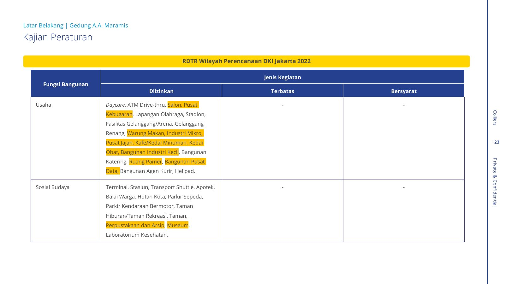
<!-- END COMPLETE PAGE RENDER: SLIDE 23 -->

| FungsiBangunan | JenisKegiatan | Kolom 3 | Kolom 4 |
| :--- | :--- | :--- | :--- |
|  | Diizinkan | Terbatas | Bersyarat |
| Usaha | Daycare, ATM Drive-thru, Salon, Pusat Kebugaran, LapanganOlahraga, Stadion, FasilitasGelanggang/Arena, Gelanggang Renang, WarungMakan, IndustriMikro, Pusat Jajan, Kafe/KedaiMinuman, Kedai Obat, BangunanIndustriKecil, Bangunan Katering, Ruang Pamer, BangunanPusat Data, BangunanAgenKurir, Helipad. | - | - |
| SosialBudaya | Terminal, Stasiun, Transport Shuttle, Apotek, Balai Warga, HutanKota, ParkirSepeda, ParkirKendaraanBermotor, Taman Hiburan/Taman Rekreasi, Taman, Perpustakaandan Arsip, Museum, LaboratoriumKesehatan, | - | - |

RDTR Wilayah Perencanaan DKI Jakarta 2022

Fungsi Bangunan

Jenis Kegiatan

Diizinkan Terbatas Bersyarat

Kebugaran, Lapangan Olahraga, Stadion,

Fasilitas Gelanggang/Arena, Gelanggang

Renang, Warung Makan, Industri Mikro,

Obat, Bangunan Industri Kecil, Bangunan

Data, Bangunan Agen Kurir, Helipad.

- 
- 

Sosial Budaya Terminal, Stasiun, Transport Shuttle, Apotek,

Balai Warga, Hutan Kota, Parkir Sepeda,

Parkir Kendaraan Bermotor, Taman

Hiburan/Taman Rekreasi, Taman,

Perpustakaan dan Arsip, Museum,

Laboratorium Kesehatan,

- 
- 

---

#### Slide 24: Kajian Peraturan – Latar Belakang – Gedung A.A. Maramis

<!-- BEGIN COMPLETE PAGE RENDER: SLIDE 24 -->
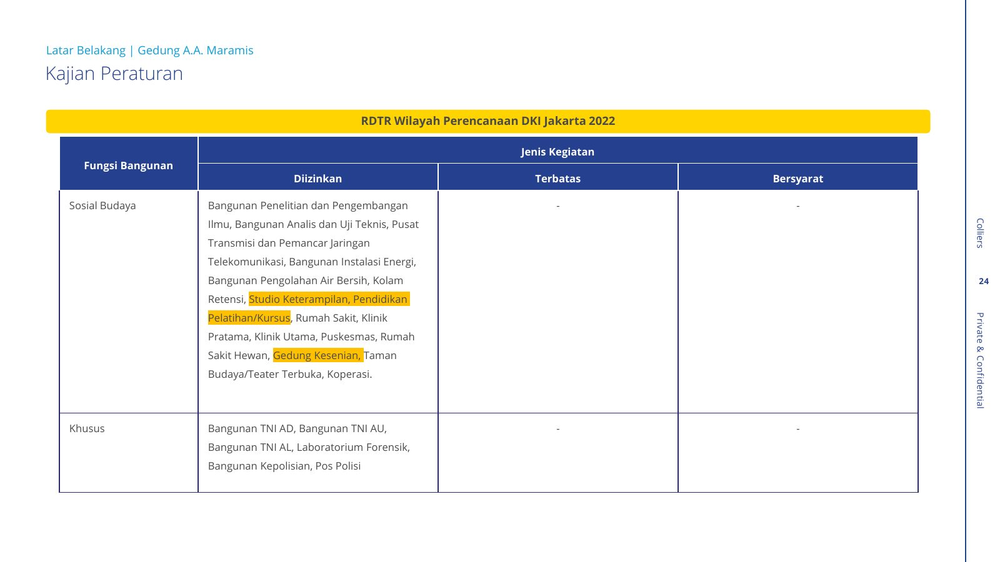
<!-- END COMPLETE PAGE RENDER: SLIDE 24 -->

| FungsiBangunan | JenisKegiatan | Kolom 3 | Kolom 4 |
| :--- | :--- | :--- | :--- |
|  | Diizinkan | Terbatas | Bersyarat |
| SosialBudaya | BangunanPenelitiandan Pengembangan Ilmu, BangunanAnalisdan Uji Teknis, Pusat Transmisidan PemancarJaringan Telekomunikasi, BangunanInstalasiEnergi, BangunanPengolahanAir Bersih, Kolam Retensi, Studio Keterampilan, Pendidikan Pelatihan/Kursus, RumahSakit, Klinik Pratama, KlinikUtama, Puskesmas, Rumah SakitHewan, Gedung Kesenian, Taman Budaya/TeaterTerbuka, Koperasi. | - | - |
| Khusus | BangunanTNI AD, BangunanTNI AU, BangunanTNI AL, LaboratoriumForensik, BangunanKepolisian, Pos Polisi | - | - |

Fungsi Bangunan

Jenis Kegiatan

Diizinkan Terbatas Bersyarat

Sosial Budaya Bangunan Penelitian dan Pengembangan

Ilmu, Bangunan Analis dan Uji Teknis, Pusat

Transmisi dan Pemancar Jaringan

Telekomunikasi, Bangunan Instalasi Energi,

Bangunan Pengolahan Air Bersih, Kolam

Retensi, Studio Keterampilan, Pendidikan

Pelatihan/Kursus, Rumah Sakit, Klinik

Pratama, Klinik Utama, Puskesmas, Rumah

Sakit Hewan, Gedung Kesenian, Taman

Budaya/Teater Terbuka, Koperasi.

- 
- 

Khusus Bangunan TNI AD, Bangunan TNI AU,

Bangunan TNI AL, Laboratorium Forensik,

Bangunan Kepolisian, Pos Polisi

- 
- 

RDTR Wilayah Perencanaan DKI Jakarta 2022

---

#### Slide 25: Kajian Peraturan – Latar Belakang – Gedung A.A. Maramis

<!-- BEGIN COMPLETE PAGE RENDER: SLIDE 25 -->
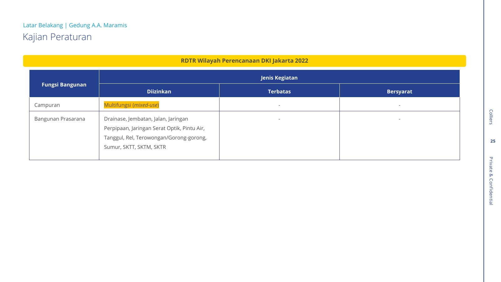
<!-- END COMPLETE PAGE RENDER: SLIDE 25 -->

| FungsiBangunan | JenisKegiatan | Kolom 3 | Kolom 4 |
| :--- | :--- | :--- | :--- |
|  | Diizinkan | Terbatas | Bersyarat |
| Campuran | Multifungsi(mixed-use) | - | - |
| Bangunan Prasarana | Drainase, Jembatan, Jalan, Jaringan Perpipaan, JaringanSeratOptik, PintuAir, Tanggul, Rel, Terowongan/Gorong-gorong, Sumur, SKTT, SKTM, SKTR | - | - |

RDTR Wilayah Perencanaan DKI Jakarta 2022

Fungsi Bangunan

Jenis Kegiatan

Diizinkan Terbatas Bersyarat

  Campuran
  Multifungsi (mixed-use)
- 
- 

Perpipaan, Jaringan Serat Optik, Pintu Air,

Sumur, SKTT, SKTM, SKTR

- 
- 

---

## Bab 02: Analisis Lokasi & SWOT Kawasan

> [!NOTE]
> Bab ini menganalisis kekuatan dan kelemahan lokasi Gedung A.A. Maramis dalam pola konsentrik Lapangan Banteng, sistem transportasi publik pendukung, serta strategi skala kawasan dan arsitektural.

#### Slide 26: 

<!-- BEGIN COMPLETE PAGE RENDER: SLIDE 26 -->
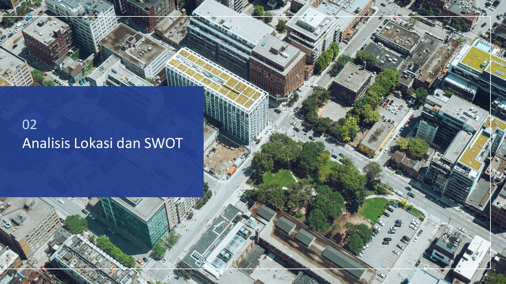
<!-- END COMPLETE PAGE RENDER: SLIDE 26 -->

---

#### Slide 27: MENGAPA PENTING  MENJAGA SIGNIFIKANSI  GEDUNG A.A. MARAMIS?

<!-- BEGIN COMPLETE PAGE RENDER: SLIDE 27 -->
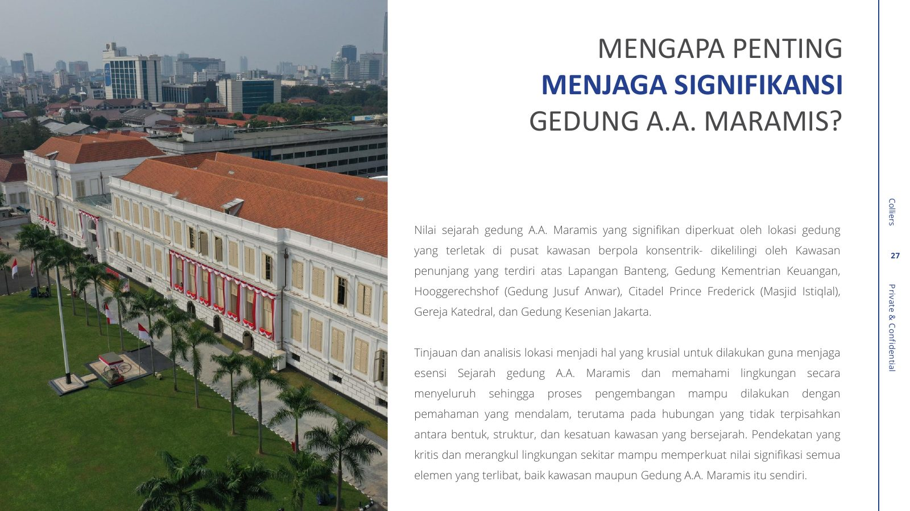
<!-- END COMPLETE PAGE RENDER: SLIDE 27 -->

Nilai sejarah gedung A.A. Maramis yang signifikan diperkuat oleh lokasi gedung

yang terletak di pusat kawasan berpola konsentrik- dikelilingi oleh Kawasan

penunjang yang terdiri atas Lapangan Banteng, Gedung Kementrian Keuangan,

Hooggerechshof (Gedung Jusuf Anwar), Citadel Prince Frederick (Masjid Istiqlal),

Gereja Katedral, dan Gedung Kesenian Jakarta.

Tinjauan dan analisis lokasi menjadi hal yang krusial untuk dilakukan guna menjaga

esensi Sejarah gedung A.A. Maramis dan memahami lingkungan secara

menyeluruh sehingga proses pengembangan mampu dilakukan dengan

pemahaman yang mendalam, terutama pada hubungan yang tidak terpisahkan

antara bentuk, struktur, dan kesatuan kawasan yang bersejarah. Pendekatan yang

kritis dan merangkul lingkungan sekitar mampu memperkuat nilai signifikasi semua

elemen yang terlibat, baik kawasan maupun Gedung A.A. Maramis itu sendiri.

---

#### Slide 28: Analisis Lokasi – Gedung AA Maramis Signifikansi Persebaran Bangunan pada Area

<!-- BEGIN COMPLETE PAGE RENDER: SLIDE 28 -->
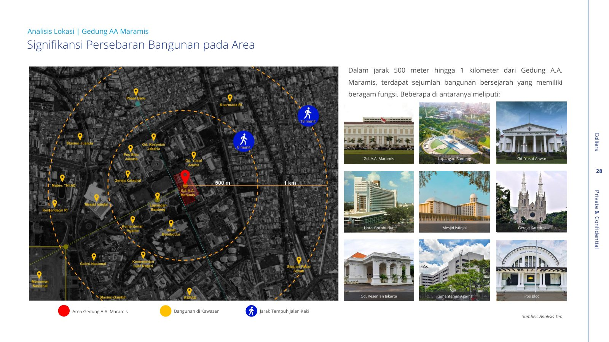
<!-- END COMPLETE PAGE RENDER: SLIDE 28 -->

Gd. A.A. Maramis Lapangan Banteng Gd. Yusuf Anwar

Hotel Borobudur Mesjid Istiqlal Gereja Katedral

Gd. Kesenian Jakarta Kementerian Agama Pos Bloc

Area Gedung A.A. Maramis Bangunan di Kawasan Jarak Tempuh Jalan Kaki

Dalam jarak 500 meter hingga 1 kilometer dari Gedung A.A.

Maramis, terdapat sejumlah bangunan bersejarah yang memiliki

beragam fungsi. Beberapa di antaranya meliputi:

> **Sumber: Analisis Tim**

---

#### Slide 29: Konektivitas dan Sistem Transportasi – Analisis Lokasi – Gedung AA Maramis

<!-- BEGIN COMPLETE PAGE RENDER: SLIDE 29 -->
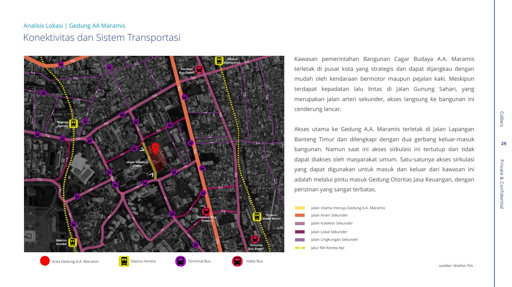
<!-- END COMPLETE PAGE RENDER: SLIDE 29 -->

Stasiun Kereta Terminal Bus

Jalur Rel Kereta Api

Halte Bus

Jalan Arteri Sekunder

> **sumber: Analisis Tim**

Kawasan pemerintahan Bangunan Cagar Budaya A.A. Maramis

terletak di pusat kota yang strategis dan dapat dijangkau dengan

mudah oleh kendaraan bermotor maupun pejalan kaki. Meskipun

terdapat kepadatan lalu lintas di Jalan Gunung Sahari, yang

merupakan jalan arteri sekunder, akses langsung ke bangunan ini

cenderung lancar.

Akses utama ke Gedung A.A. Maramis terletak di Jalan Lapangan

Banteng Timur dan dilengkapi dengan dua gerbang keluar-masuk

bangunan. Namun saat ini akses sirkulasi ini tertutup dan tidak

dapat diakses oleh masyarakat umum. Satu-satunya akses sirkulasi

yang dapat digunakan untuk masuk dan keluar dari kawasan ini

adalah melalui pintu masuk Gedung Otoritas Jasa Keuangan, dengan

perizinan yang sangat terbatas.

Jalan Kolektor Sekunder

Jalan Lokal Sekunder

Jalan Lingkungan Sekunder

Jalan Utama menuju Gedung A.A. Maramis

Area Gedung A.A. Maramis

---

#### Slide 30: Analisis Lokasi – Gedung AA Maramis Batas Wilayah Perencanaan Pelestarian

<!-- BEGIN COMPLETE PAGE RENDER: SLIDE 30 -->
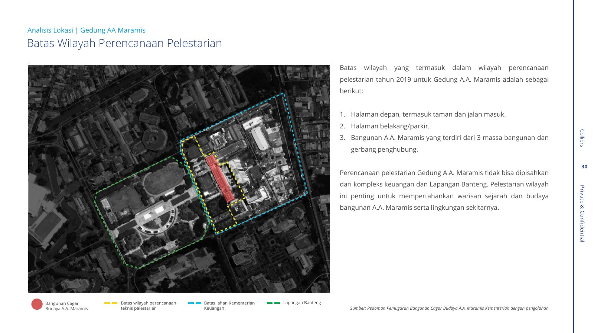
<!-- END COMPLETE PAGE RENDER: SLIDE 30 -->

Bangunan Cagar Budaya A.A. Maramis

Batas lahan Kementerian Keuangan Batas wilayah perencanaan teknis pelestarian Sumber: Pedoman Pemugaran Bangunan Cagar Budaya A.A. Maramis Kementerian dengan pengolahan

Batas wilayah yang termasuk dalam wilayah perencanaan

pelestarian tahun 2019 untuk Gedung A.A. Maramis adalah sebagai

berikut:

- **1.** 
  Halaman depan, termasuk taman dan jalan masuk.

- **2.** 
  Halaman belakang/parkir.

- **3.** 
  Bangunan A.A. Maramis yang terdiri dari 3 massa bangunan dan

gerbang penghubung.

Perencanaan pelestarian Gedung A.A. Maramis tidak bisa dipisahkan

dari kompleks keuangan dan Lapangan Banteng. Pelestarian wilayah

ini penting untuk mempertahankan warisan sejarah dan budaya

bangunan A.A. Maramis serta lingkungan sekitarnya.

Lapangan Banteng

---

#### Slide 31: Analisis Lokasi – Gedung AA Maramis Bangunan dan Lingkungan Sekitar

<!-- BEGIN COMPLETE PAGE RENDER: SLIDE 31 -->
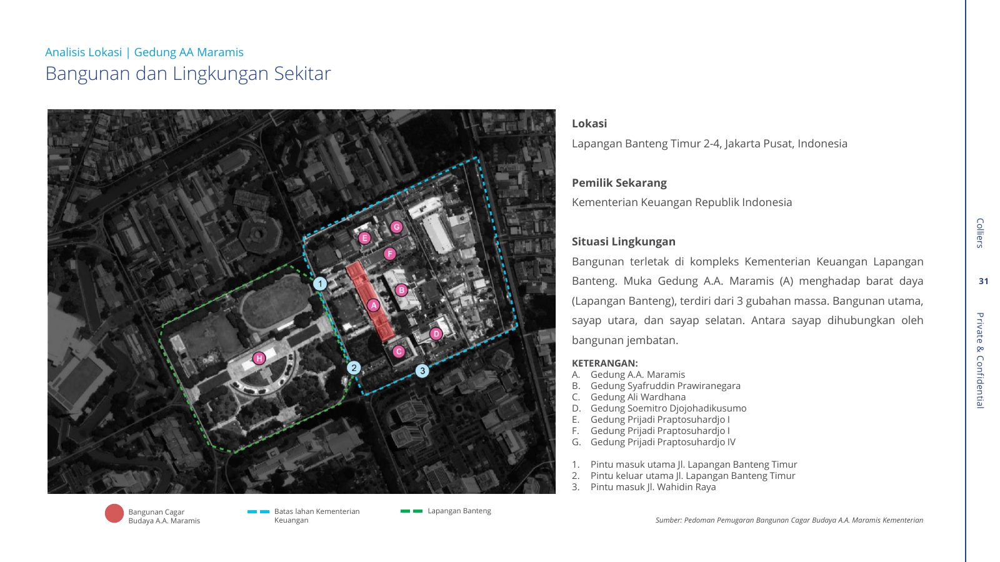
<!-- END COMPLETE PAGE RENDER: SLIDE 31 -->

> **Sumber: Pedoman Pemugaran Bangunan Cagar Budaya A.A. Maramis Kementerian**

Lokasi

Lapangan Banteng Timur 2-4, Jakarta Pusat, Indonesia

Pemilik Sekarang

Kementerian Keuangan Republik Indonesia

Situasi Lingkungan

Bangunan terletak di kompleks Kementerian Keuangan Lapangan

Banteng. Muka Gedung A.A. Maramis (A) menghadap barat daya

(Lapangan Banteng), terdiri dari 3 gubahan massa. Bangunan utama,

sayap utara, dan sayap selatan. Antara sayap dihubungkan oleh

bangunan jembatan.

KETERANGAN: A. Gedung A.A. Maramis B. Gedung Syafruddin Prawiranegara C. Gedung Ali Wardhana D. Gedung Soemitro Djojohadikusumo E. Gedung Prijadi Praptosuhardjo I F. Gedung Prijadi Praptosuhardjo I G. Gedung Prijadi Praptosuhardjo IV

- **1.** 
  Pintu masuk utama Jl. Lapangan Banteng Timur
- **2.** 
  Pintu keluar utama Jl. Lapangan Banteng Timur
- **3.** 
  Pintu masuk Jl. Wahidin Raya

Bangunan Cagar Budaya A.A. Maramis

Batas lahan Kementerian Keuangan

Lapangan Banteng

---

#### Slide 32: Analisis SWOT – Gedung AA Maramis – GKJ – SMK 27 – SMK 1

<!-- BEGIN COMPLETE PAGE RENDER: SLIDE 32 -->
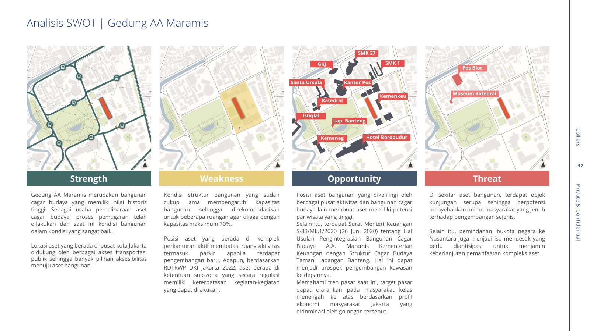
<!-- END COMPLETE PAGE RENDER: SLIDE 32 -->

Strength Weakness Opportunity Threat

Kemenkeu

Kantor Pos Santa Ursula

Hotel Borobudur

Katedral

Kemenag

Istiqlal

Lap. Banteng

Pos Bloc

Museum Katedral

Gedung AA Maramis merupakan bangunan cagar budaya yang memiliki nilai historis tinggi. Sebagai usaha pemeliharaan aset cagar budaya, proses pemugaran telah dilakukan dan saat ini kondisi bangunan dalam kondisi yang sangat baik.

Lokasi aset yang berada di pusat kota Jakarta didukung oleh berbagai akses transportasi publik sehingga banyak pilihan aksesibilitas menuju aset bangunan.

Kondisi struktur bangunan yang sudah cukup lama mempengaruhi kapasitas bangunan sehingga direkomendasikan untuk beberapa ruangan agar dijaga dengan kapasitas maksimum 70%.

Posisi aset yang berada di komplek perkantoran aktif membatasi ruang aktivitas termasuk parkir apabila terdapat pengembangan baru. Adapun, berdasarkan RDTRWP DKI Jakarta 2022, aset berada di ketentuan sub-zona yang secara regulasi memiliki keterbatasan kegiatan-kegiatan yang dapat dilakukan.

Posisi aset bangunan yang dikelilingi oleh berbagai pusat aktivitas dan bangunan cagar budaya lain membuat aset memiliki potensi pariwisata yang tinggi. Selain itu, terdapat Surat Menteri Keuangan S-83/Mk.1/2020 (26 Juni 2020) tentang Hal Usulan Pengintegrasian Bangunan Cagar Budaya A.A. Maramis Kementerian Keuangan dengan Struktur Cagar Budaya Taman Lapangan Banteng. Hal ini dapat menjadi prospek pengembangan kawasan ke depannya. Memahami tren pasar saat ini, target pasar dapat diarahkan pada masyarakat kelas menengah ke atas berdasarkan profil ekonomi masyarakat Jakarta yang didominasi oleh golongan tersebut.

Di sekitar aset bangunan, terdapat objek kunjungan serupa sehingga berpotensi menyebabkan animo masyarakat yang jenuh terhadap pengembangan sejenis.

Selain itu, pemindahan ibukota negara ke Nusantara juga menjadi isu mendesak yang perlu diantisipasi untuk menjamin keberlanjutan pemanfaatan kompleks aset.

---

#### Slide 33: Strategi – Gedung AA Maramis – Secara kawasan, strategi yang diusulkan untuk HBU AA Maramis adalah reaktivasi – dan adaptive reuse Gedung AA Maramis menjadi salah satu nodes dalam kawasan – Integrasi aset dengan pusat  kegiatan sekitarnya sebagai  salah satu node kegiatan pusat  dan heritage walk di Jakarta.

<!-- BEGIN COMPLETE PAGE RENDER: SLIDE 33 -->
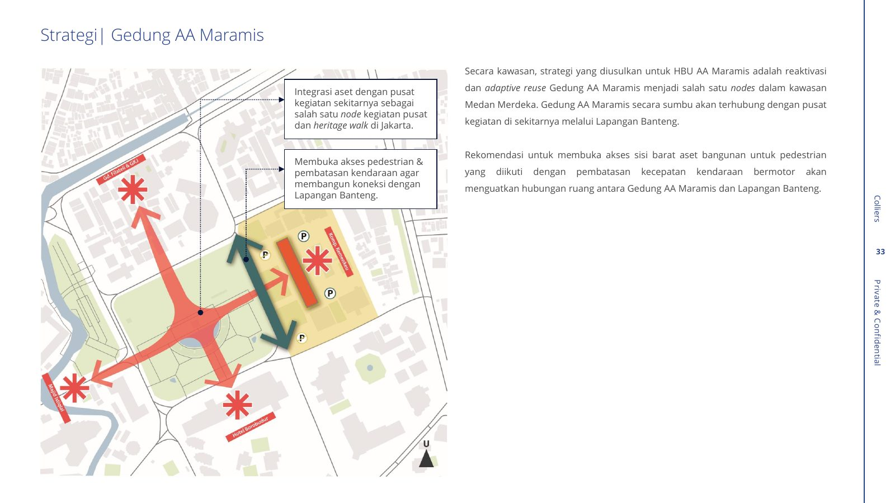
<!-- END COMPLETE PAGE RENDER: SLIDE 33 -->

Medan Merdeka. Gedung AA Maramis secara sumbu akan terhubung dengan pusat

kegiatan di sekitarnya melalui Lapangan Banteng.

Rekomendasi untuk membuka akses sisi barat aset bangunan untuk pedestrian

yang diikuti dengan pembatasan kecepatan kendaraan bermotor akan

menguatkan hubungan ruang antara Gedung AA Maramis dan Lapangan Banteng.

Membuka akses pedestrian & pembatasan kendaraan agar membangun koneksi dengan Lapangan Banteng.

---

#### Slide 34: Selain strategi kawasan, usulan strategi skala arsitektural yang

<!-- BEGIN COMPLETE PAGE RENDER: SLIDE 34 -->
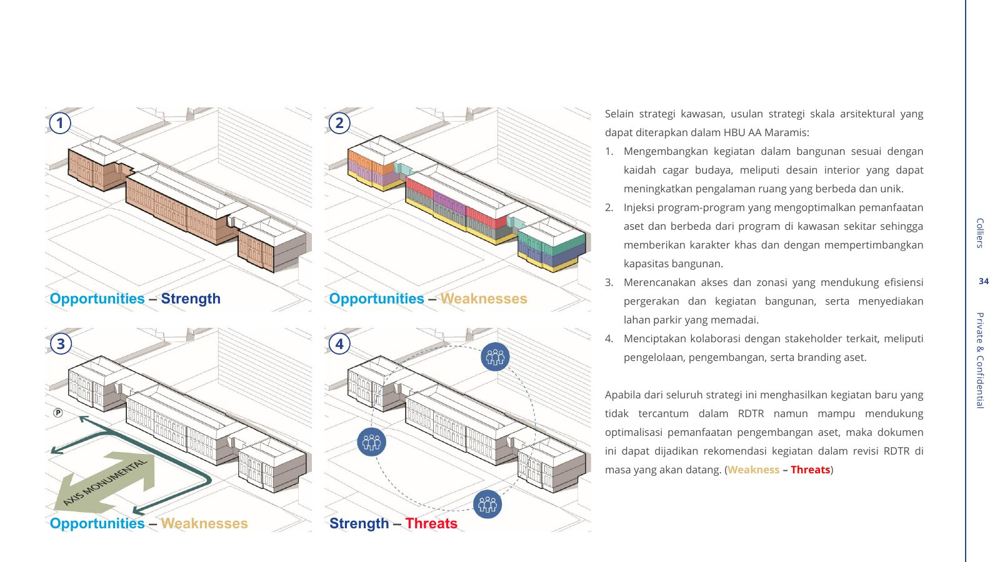
<!-- END COMPLETE PAGE RENDER: SLIDE 34 -->

dapat diterapkan dalam HBU AA Maramis:

- **1.** 
  Mengembangkan kegiatan dalam bangunan sesuai dengan

kaidah cagar budaya, meliputi desain interior yang dapat

meningkatkan pengalaman ruang yang berbeda dan unik.

- **2.** 
  Injeksi program-program yang mengoptimalkan pemanfaatan

aset dan berbeda dari program di kawasan sekitar sehingga

memberikan karakter khas dan dengan mempertimbangkan

kapasitas bangunan.

- **3.** 
  Merencanakan akses dan zonasi yang mendukung efisiensi

pergerakan dan kegiatan bangunan, serta menyediakan

lahan parkir yang memadai.

- **4.** 
  Menciptakan kolaborasi dengan stakeholder terkait, meliputi

pengelolaan, pengembangan, serta branding aset.

Apabila dari seluruh strategi ini menghasilkan kegiatan baru yang

tidak tercantum dalam RDTR namun mampu mendukung

optimalisasi pemanfaatan pengembangan aset, maka dokumen

ini dapat dijadikan rekomendasi kegiatan dalam revisi RDTR di

masa yang akan datang. (Weakness – Threats)

1 2

3 4

Opportunities – Weaknesses Opportunities – Strength

Opportunities – Weaknesses Strength – Threats

---

## Bab 03: Makroekonomi & Demografi

> [!NOTE]
> Bab ini menyajikan telaah makroekonomi nasional, demografi dan daya beli DKI Jakarta serta Jakarta Pusat, serta jaringan infrastruktur transportasi massal (KRL, MRT, LRT, Jalan Tol).

#### Slide 35: 03 Makroekonomi

<!-- BEGIN COMPLETE PAGE RENDER: SLIDE 35 -->

<!-- END COMPLETE PAGE RENDER: SLIDE 35 -->

---

### 3.1 Makroekonomi Nasional (Indonesia)

#### Slide 36: Indonesia

<!-- BEGIN COMPLETE PAGE RENDER: SLIDE 36 -->

<!-- END COMPLETE PAGE RENDER: SLIDE 36 -->

3.1

---

#### Slide 37: Di tengah pertumbuhan ekonomi dunia sebesar 3%, setiap pulau di Indonesia umumnya mencatat  pertumbuhan ekonomi yang tinggi di 5% - 6% pada tahun 2023 – Indonesia – Peta Produk Domestik Bruto (PDB) Indonesia

<!-- BEGIN COMPLETE PAGE RENDER: SLIDE 37 -->
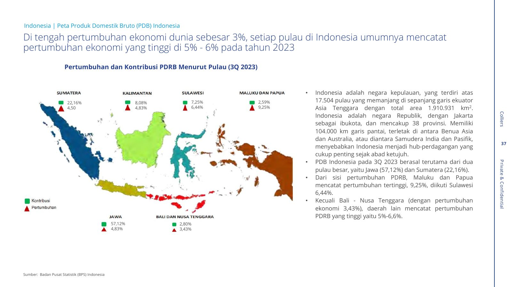
<!-- END COMPLETE PAGE RENDER: SLIDE 37 -->

22,16% 4,50 8,08% 4,83%

57,12% 4,83%

7,25% 6,44%

2,80% 3,43%

2,59% 9,25%

> **Sumber:  Badan Pusat Statistik (BPS) Indonesia**

Pertumbuhan dan Kontribusi PDRB Menurut Pulau (3Q 2023)

- 
  Indonesia adalah negara kepulauan, yang terdiri atas
- **17.** 504 pulau yang memanjang di sepanjang garis ekuator
  Asia Tenggara dengan total area 1.910.931 km2.
  Indonesia adalah negara Republik, dengan Jakarta
  sebagai ibukota, dan mencakup 38 provinsi. Memiliki
- **104.** 000 km garis pantai, terletak di antara Benua Asia
  dan Australia, atau diantara Samudera India dan Pasifik,
  menyebabkan Indonesia menjadi hub-perdagangan yang
  cukup penting sejak abad ketujuh.
- 
  PDB Indonesia pada 3Q 2023 berasal terutama dari dua
  pulau besar, yaitu Jawa (57,12%) dan Sumatera (22,16%).
- 
  Dari sisi pertumbuhan PDRB, Maluku dan Papua
  mencatat pertumbuhan tertinggi, 9,25%, diikuti Sulawesi
  6,44%.
- 
  Kecuali Bali - Nusa Tenggara (dengan pertumbuhan
  ekonomi 3,43%), daerah lain mencatat pertumbuhan
  PDRB yang tinggi yaitu 5%-6,6%.

---

#### Slide 38: Pandemi hanya menimbulkan efek jangka pendek pada perekonomian Indonesia, pada 1Q 2022  Indonesia memiliki pertumbuhan ekonomi di level 5% – Indonesia – Indikator Ekonomi

<!-- BEGIN COMPLETE PAGE RENDER: SLIDE 38 -->
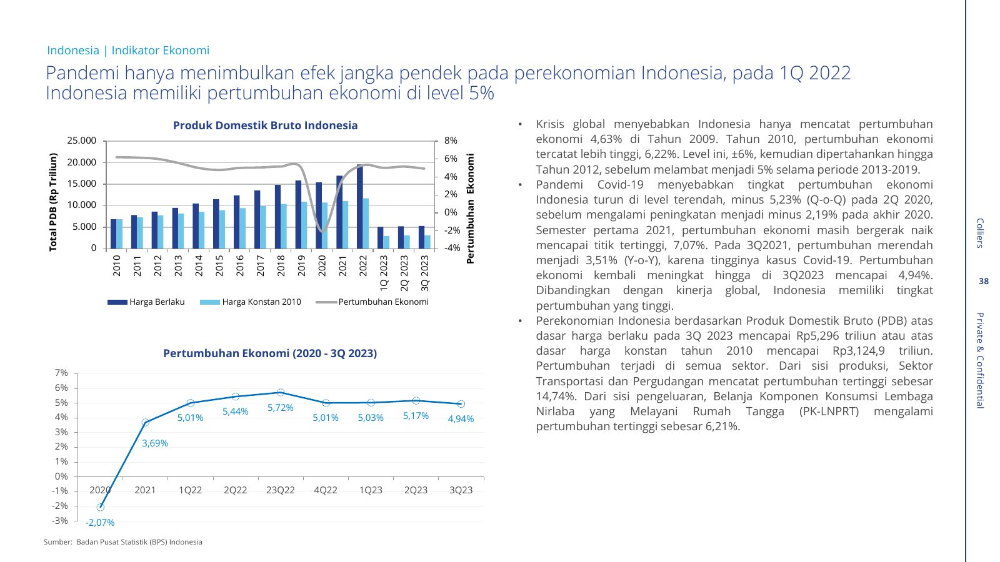
<!-- END COMPLETE PAGE RENDER: SLIDE 38 -->

> **Sumber:  Badan Pusat Statistik (BPS) Indonesia**

- 
  Krisis global menyebabkan Indonesia hanya mencatat pertumbuhan
  ekonomi 4,63% di Tahun 2009. Tahun 2010, pertumbuhan ekonomi
  tercatat lebih tinggi, 6,22%. Level ini, ±6%, kemudian dipertahankan hingga
  Tahun 2012, sebelum melambat menjadi 5% selama periode 2013-2019.
- 
  Pandemi
  Covid-19
  menyebabkan
  tingkat
  pertumbuhan
  ekonomi
  Indonesia turun di level terendah, minus 5,23% (Q-o-Q) pada 2Q 2020,
  sebelum mengalami peningkatan menjadi minus 2,19% pada akhir 2020.
  Semester pertama 2021, pertumbuhan ekonomi masih bergerak naik
  mencapai titik tertinggi, 7,07%. Pada 3Q2021, pertumbuhan merendah
  menjadi 3,51% (Y-o-Y), karena tingginya kasus Covid-19. Pertumbuhan
  ekonomi kembali meningkat hingga di 3Q2023 mencapai 4,94%.
  Dibandingkan
  dengan
  kinerja
  global,
  Indonesia
  memiliki
  tingkat
  pertumbuhan yang tinggi.
- 
  Perekonomian Indonesia berdasarkan Produk Domestik Bruto (PDB) atas
  dasar harga berlaku pada 3Q 2023 mencapai Rp5,296 triliun atau atas
  dasar
  harga
  konstan
  tahun
  2010
  mencapai
  Rp3,124,9
- **triliun.** 
  Pertumbuhan
  terjadi
  di
  semua
- **sektor.** 
  Dari
  sisi
  produksi,
  Sektor
  Transportasi dan Pergudangan mencatat pertumbuhan tertinggi sebesar
  14,74%. Dari sisi pengeluaran, Belanja Komponen Konsumsi Lembaga
  Nirlaba
  yang
  Melayani
  Rumah
  Tangga
  (PK-LNPRT)
  mengalami
  pertumbuhan tertinggi sebesar 6,21%.

-4%

-2%

0%

2%

4%

6%

8%

0

5.000

10.000

15.000

20.000

25.000

2010

2011

2012

2013

2014

2015

2016

2017

2018

2019

2020

2021

2022

1Q 2023

2Q 2023

3Q 2023

Pertumbuhan  Ekonomi

Total PDB (Rp Triliun)

Produk Domestik Bruto Indonesia

Harga Berlaku Harga Konstan 2010 Pertumbuhan Ekonomi

-2,07%

3,69%

5,01% 5,44% 5,72% 5,01% 5,03% 5,17% 4,94%

-3%

-2%

-1%

0%

1%

2%

3%

4%

5%

6%

7%

2020 2021 1Q22 2Q22 23Q22 4Q22 1Q23 2Q23 3Q23

Pertumbuhan Ekonomi (2020 - 3Q 2023)

---

#### Slide 39: Industri Pengolahan, Pertanian, dan Perdagangan merupakan sektor ekonomi utama Indonesia pada  2022 dan 3Q 2023 – Indonesia – Produk Domestik Bruto (Harga Berlaku)

<!-- BEGIN COMPLETE PAGE RENDER: SLIDE 39 -->
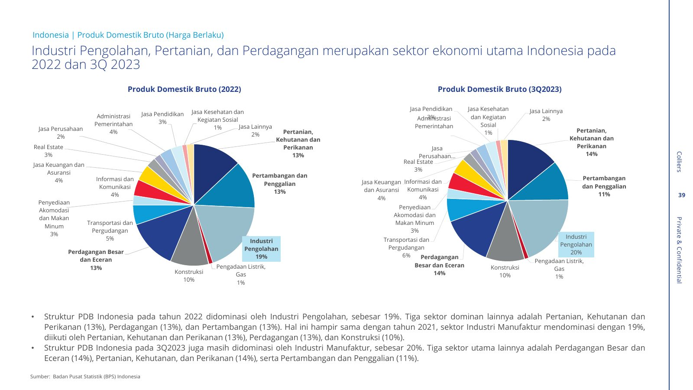
<!-- END COMPLETE PAGE RENDER: SLIDE 39 -->

> **Sumber:  Badan Pusat Statistik (BPS) Indonesia**

Pertanian, Kehutanan dan

Perikanan

14%

Pertambangan dan Penggalian

11%

Industri Pengolahan

20% Pengadaan Listrik,

Gas

1%

Konstruksi

10%

Perdagangan Besar dan Eceran

14%

Transportasi dan

Pergudangan

6%

Penyediaan Akomodasi dan

Makan Minum

3%

Informasi dan

Komunikasi

4%

Jasa Keuangan

dan Asuransi

4%

Real Estate

3%

Jasa Perusahaan…

Administrasi Pemerintahan

Jasa Pendidikan

3% Jasa Kesehatan

dan Kegiatan

Sosial

1%

Jasa Lainnya

2%

Pertanian, Kehutanan dan

Perikanan

13%

Pertambangan dan

Penggalian

13%

Industri Pengolahan

19%

Pengadaan Listrik,

Gas

1%

Konstruksi

10%

Perdagangan Besar

dan Eceran

13%

Transportasi dan

Pergudangan

5%

Penyediaan

Akomodasi dan Makan

Minum

3%

Informasi dan

Komunikasi

4%

Jasa Keuangan dan

Asuransi

4%

Real Estate

3%

Jasa Perusahaan

2%

Administrasi Pemerintahan

4%

Jasa Pendidikan

3%

Jasa Kesehatan dan

Kegiatan Sosial

1% Jasa Lainnya

2%

- 
  Struktur PDB Indonesia pada tahun 2022 didominasi oleh Industri Pengolahan, sebesar 19%. Tiga sektor dominan lainnya adalah Pertanian, Kehutanan dan
  Perikanan (13%), Perdagangan (13%), dan Pertambangan (13%). Hal ini hampir sama dengan tahun 2021, sektor Industri Manufaktur mendominasi dengan 19%,
  diikuti oleh Pertanian, Kehutanan dan Perikanan (13%), Perdagangan (13%), dan Konstruksi (10%).
- 
  Struktur PDB Indonesia pada 3Q2023 juga masih didominasi oleh Industri Manufaktur, sebesar 20%. Tiga sektor utama lainnya adalah Perdagangan Besar dan
  Eceran (14%), Pertanian, Kehutanan, dan Perikanan (14%), serta Pertambangan dan Penggalian (11%).

Produk Domestik Bruto (2022) Produk Domestik Bruto (3Q2023)

---

#### Slide 40: Tingkat pengangguran pada tahun 2023 mencapai 5,3%, hampir sama dengan tingkat terendah di tahun  2019, 5,2% – Indonesia – Tingkat Pengangguran

<!-- BEGIN COMPLETE PAGE RENDER: SLIDE 40 -->
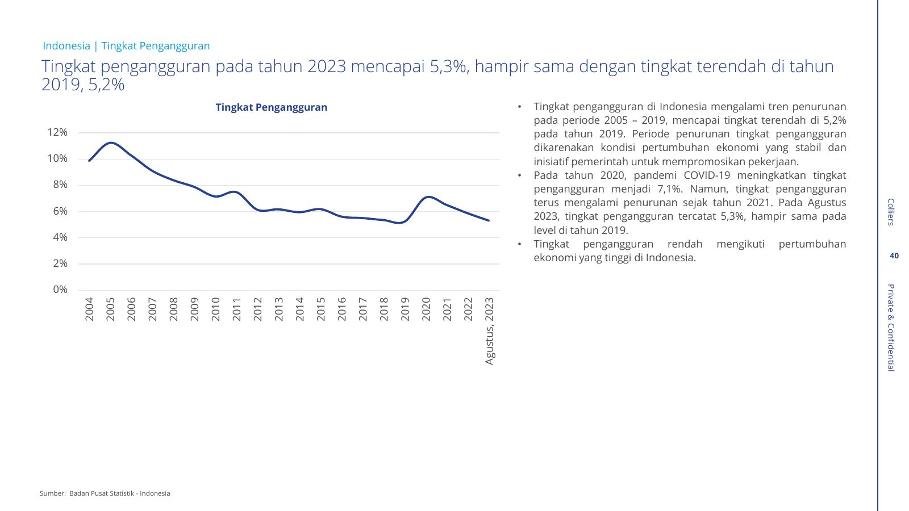
<!-- END COMPLETE PAGE RENDER: SLIDE 40 -->

> **Sumber:  Badan Pusat Statistik - Indonesia**

- 
  Tingkat pengangguran di Indonesia mengalami tren penurunan
  pada periode 2005 – 2019, mencapai tingkat terendah di 5,2%
  pada tahun 2019. Periode penurunan tingkat pengangguran
  dikarenakan kondisi pertumbuhan ekonomi yang stabil dan
  inisiatif pemerintah untuk mempromosikan pekerjaan.
- 
  Pada tahun 2020, pandemi COVID-19 meningkatkan tingkat
  pengangguran menjadi 7,1%. Namun, tingkat pengangguran
  terus mengalami penurunan sejak tahun 2021. Pada Agustus
  2023, tingkat pengangguran tercatat 5,3%, hampir sama pada
  level di tahun 2019.
- 
  Tingkat
  pengangguran
  rendah
  mengikuti
  pertumbuhan
  ekonomi yang tinggi di Indonesia.

0%

2%

4%

6%

8%

10%

12%

2004

2005

2006

2007

2008

2009

2010

2011

2012

2013

2014

2015

2016

2017

2018

2019

2020

2021

2022

Agustus, 2023

Tingkat Pengangguran

---

#### Slide 41: Inflasi terjaga di level <5%, sementara nilai Rupiah terhadap USD cenderung stabil antara Rp 14.000/USD  dan Rp 15.000/USD – Indonesia – Tingkat Inflasi dan Nilai Tukar

<!-- BEGIN COMPLETE PAGE RENDER: SLIDE 41 -->
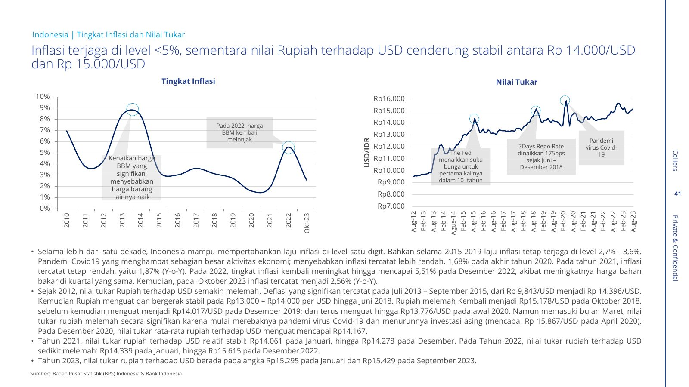
<!-- END COMPLETE PAGE RENDER: SLIDE 41 -->

| Kolom 1 | Kolom 2 | Kolom 3 | Kolom 4 | Pandemi |
| :--- | :--- | :--- | :--- | :--- |
| The Fed |  | dinaikkan 175bps |  | virus Covid- 19 |
| menaikkan suku bunga untuk |  | sejak Juni – Desember 2018 |  |  |
| pertama kalinya dalam 10 tahun |  |  |  |  |

| Kolom 1 | BBM yang signifikan, |
| :--- | :--- |
|  | menyebabkan |
|  | harga barang |
|  | lainnya naik |

> **Sumber:  Badan Pusat Statistik (BPS) Indonesia & Bank Indonesia**

0%

1%

2%

3%

4%

5%

6%

7%

8%

9%

10%

2010

2011

2012

2013

2014

2015

2016

2017

2018

2019

2020

2021

2022

Okt-23

Rp7.000

Rp8.000

Rp9.000

Rp10.000

Rp11.000

Rp12.000

Rp13.000

Rp14.000

Rp15.000

Rp16.000

Aug-12

Feb-13

Aug-13

Feb-14

Agus-14

Feb-15

Aug-15

Feb-16

Aug-16

Feb-17

Aug-17

Feb-18

Aug-18

Feb-19

Aug-19

Feb-20

Aug-20

Feb-21

Aug-21

Feb-22

Aug-22

Feb-23

Aug-23

USD/IDR

Tingkat Inflasi Nilai Tukar

Kenaikan harga

BBM yang signifikan, menyebabkan

harga barang

lainnya naik

- Selama lebih dari satu dekade, Indonesia mampu mempertahankan laju inflasi di level satu digit. Bahkan selama 2015-2019 laju inflasi tetap terjaga di level 2,7% - 3,6%.
  Pandemi Covid19 yang menghambat sebagian besar aktivitas ekonomi; menyebabkan inflasi tercatat lebih rendah, 1,68% pada akhir tahun 2020. Pada tahun 2021, inflasi
  tercatat tetap rendah, yaitu 1,87% (Y-o-Y). Pada 2022, tingkat inflasi kembali meningkat hingga mencapai 5,51% pada Desember 2022, akibat meningkatnya harga bahan
  bakar di kuartal yang sama. Kemudian, pada  Oktober 2023 inflasi tercatat menjadi 2,56% (Y-o-Y).
- Sejak 2012, nilai tukar Rupiah terhadap USD semakin melemah. Deflasi yang signifikan tercatat pada Juli 2013 – September 2015, dari Rp 9,843/USD menjadi Rp 14.396/USD.
  Kemudian Rupiah menguat dan bergerak stabil pada Rp13.000 – Rp14.000 per USD hingga Juni 2018. Rupiah melemah Kembali menjadi Rp15.178/USD pada Oktober 2018,
  sebelum kemudian menguat menjadi Rp14.017/USD pada Desember 2019; dan terus menguat hingga Rp13,776/USD pada awal 2020. Namun memasuki bulan Maret, nilai
  tukar rupiah melemah secara signifikan karena mulai merebaknya pandemi virus Covid-19 dan menurunnya investasi asing (mencapai Rp 15.867/USD pada April 2020).
  Pada Desember 2020, nilai tukar rata-rata rupiah terhadap USD menguat mencapai Rp14.167.
- Tahun 2021, nilai tukar rupiah terhadap USD relatif stabil: Rp14.061 pada Januari, hingga Rp14.278 pada Desember. Pada Tahun 2022, nilai tukar rupiah terhadap USD
  sedikit melemah: Rp14.339 pada Januari, hingga Rp15.615 pada Desember 2022.
- Tahun 2023, nilai tukar rupiah terhadap USD berada pada angka Rp15.295 pada Januari dan Rp15.429 pada September 2023.

The Fed menaikkan suku

7Days Repo Rate dinaikkan 175bps

sejak Juni – Desember 2018

Pandemi virus Covid-

19

Pada 2022, harga

BBM kembali

melonjak

---

#### Slide 42: Bank Indonesia melakukan pendekatan dinamis untuk menyesuaikan tingkat diskonto, mengatasi  ekonomi yang terus berubah dengan menyeimbangkan pertumbuhan – Indonesia – Tingkat Diskonto (Discount Rate) Bank Sentral

<!-- BEGIN COMPLETE PAGE RENDER: SLIDE 42 -->
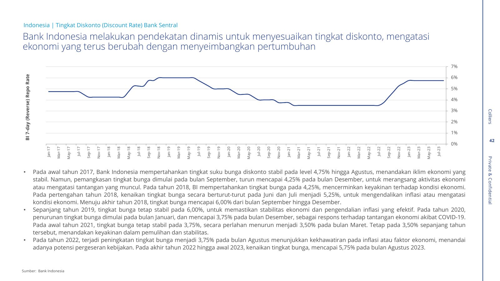
<!-- END COMPLETE PAGE RENDER: SLIDE 42 -->

> **Sumber:  Bank Indonesia**

- 
  Pada awal tahun 2017, Bank Indonesia mempertahankan tingkat suku bunga diskonto stabil pada level 4,75% hingga Agustus, menandakan iklim ekonomi yang
- **stabil.** Namun, pemangkasan tingkat bunga dimulai pada bulan September, turun mencapai 4,25% pada bulan Desember, untuk merangsang aktivitas ekonomi
  atau mengatasi tantangan yang muncul. Pada tahun 2018, BI mempertahankan tingkat bunga pada 4,25%, mencerminkan keyakinan terhadap kondisi ekonomi.
  Pada pertengahan tahun 2018, kenaikan tingkat bunga secara berturut-turut pada Juni dan Juli menjadi 5,25%, untuk mengendalikan inflasi atau mengatasi
  kondisi ekonomi. Menuju akhir tahun 2018, tingkat bunga mencapai 6,00% dari bulan September hingga Desember.
- 
  Sepanjang tahun 2019, tingkat bunga tetap stabil pada 6,00%, untuk memastikan stabilitas ekonomi dan pengendalian inflasi yang efektif. Pada tahun 2020,
  penurunan tingkat bunga dimulai pada bulan Januari, dan mencapai 3,75% pada bulan Desember, sebagai respons terhadap tantangan ekonomi akibat COVID-19.
  Pada awal tahun 2021, tingkat bunga tetap stabil pada 3,75%, secara perlahan menurun menjadi 3,50% pada bulan Maret. Tetap pada 3,50% sepanjang tahun
  tersebut, menandakan keyakinan dalam pemulihan dan stabilitas.
- 
  Pada tahun 2022, terjadi peningkatan tingkat bunga menjadi 3,75% pada bulan Agustus menunjukkan kekhawatiran pada inflasi atau faktor ekonomi, menandai
  adanya potensi pergeseran kebijakan. Pada akhir tahun 2022 hingga awal 2023, kenaikan tingkat bunga, mencapai 5,75% pada bulan Agustus 2023.

0%

1%

2%

3%

4%

5%

6%

7%

Jan-17

Mar-17

May-17

Jul-17

Sep-17

Nov-17

Jan-18

Mar-18

May-18

Jul-18

Sep-18

Nov-18

Jan-19

Mar-19

May-19

Jul-19

Sep-19

Nov-19

Jan-20

Mar-20

May-20

Jul-20

Sep-20

Nov-20

Jan-21

Mar-21

May-21

Jul-21

Sep-21

Nov-21

Jan-22

Mar-22

May-22

Jul-22

Sep-22

Nov-22

Jan-23

Mar-23

May-23

Jul-23

BI 7-day (Reverse) Repo Rate

---

#### Slide 43: Trend yang berlaku saat ini terkait penurunan tingkat bunga mencerminkan kebijakan Pemerintah dalam  mendorong pertumbuhan ekonomi – Indonesia – Suku Bunga Pinjaman berdasarkan Bank

<!-- BEGIN COMPLETE PAGE RENDER: SLIDE 43 -->
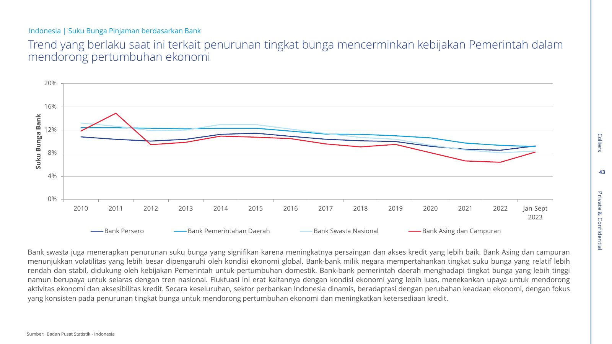
<!-- END COMPLETE PAGE RENDER: SLIDE 43 -->

> **Sumber:  Badan Pusat Statistik - Indonesia**

Bank swasta juga menerapkan penurunan suku bunga yang signifikan karena meningkatnya persaingan dan akses kredit yang lebih baik. Bank Asing dan campuran menunjukkan volatilitas yang lebih besar dipengaruhi oleh kondisi ekonomi global. Bank-bank milik negara mempertahankan tingkat suku bunga yang relatif lebih rendah dan stabil, didukung oleh kebijakan Pemerintah untuk pertumbuhan domestik. Bank-bank pemerintah daerah menghadapi tingkat bunga yang lebih tinggi namun berupaya untuk selaras dengan tren nasional. Fluktuasi ini erat kaitannya dengan kondisi ekonomi yang lebih luas, menekankan upaya untuk mendorong aktivitas ekonomi dan aksesibilitas kredit. Secara keseluruhan, sektor perbankan Indonesia dinamis, beradaptasi dengan perubahan keadaan ekonomi, dengan fokus yang konsisten pada penurunan tingkat bunga untuk mendorong pertumbuhan ekonomi dan meningkatkan ketersediaan kredit.

0%

4%

8%

12%

16%

20%

2010 2011 2012 2013 2014 2015 2016 2017 2018 2019 2020 2021 2022 Jan-Sept

2023

Suku Bunga Bank

Bank Persero Bank Pemerintahan Daerah Bank Swasta Nasional Bank Asing dan Campuran

---

#### Slide 44: Nilai investasi di Tahun 2022, baik PMDN maupun PMA, adalah yang tertinggi dalam 10 tahun terakhir – Indonesia – Investasi Domestik & Investasi Asing

<!-- BEGIN COMPLETE PAGE RENDER: SLIDE 44 -->
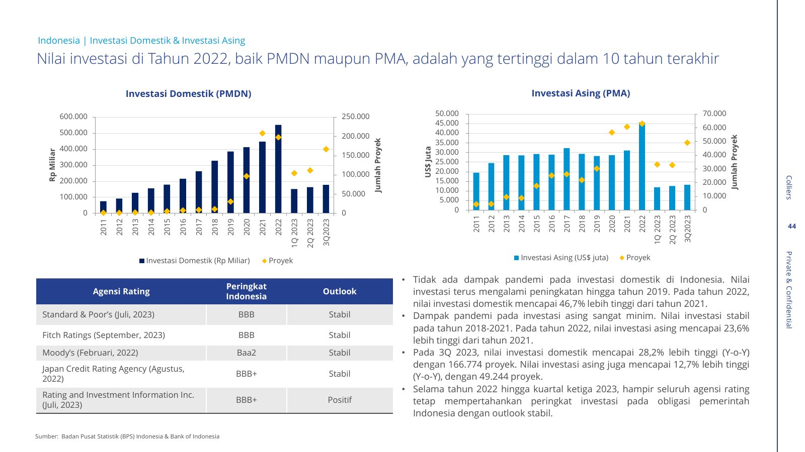
<!-- END COMPLETE PAGE RENDER: SLIDE 44 -->

| AgensiRating | Peringkat Indonesia | ​Outlook |
| :--- | :--- | :--- |
| ​S d d & Poo ’ (Juli, 2023) | ​BBB | Stabil |
| ​F h R (S p mb , 2023) | ​BBB | Stabil |
| ​Moody’ (Februari, 2022) | ​B 2 | Stabil |
| ​J p C d R y (Agustus, 2022) | ​BBB+ | Stabil |
| ​R d I v m I fo m o I (Juli, 2023) | ​BBB+ | Positif |

> **Sumber:  Badan Pusat Statistik (BPS) Indonesia & Bank of Indonesia**

Agensi Rating Peringkat Indonesia ​Outlook

Investasi Domestik (PMDN) Investasi Asing (PMA)

- 
  Tidak ada dampak pandemi pada investasi domestik di Indonesia. Nilai
  investasi terus mengalami peningkatan hingga tahun 2019. Pada tahun 2022,
  nilai investasi domestik mencapai 46,7% lebih tinggi dari tahun 2021.
- 
  Dampak pandemi pada investasi asing sangat minim. Nilai investasi stabil
  pada tahun 2018-2021. Pada tahun 2022, nilai investasi asing mencapai 23,6%
  lebih tinggi dari tahun 2021.
- 
  Pada 3Q 2023, nilai investasi domestik mencapai 28,2% lebih tinggi (Y-o-Y)
  dengan 166.774 proyek. Nilai investasi asing juga mencapai 12,7% lebih tinggi
  (Y-o-Y), dengan 49.244 proyek.
- 
  Selama tahun 2022 hingga kuartal ketiga 2023, hampir seluruh agensi rating
  tetap mempertahankan peringkat investasi pada obligasi pemerintah
  Indonesia dengan outlook stabil.

0

50.000

100.000

150.000

200.000

250.000

0

100.000

200.000

300.000

400.000

500.000

600.000

2011

2012

2013

2014

2015

2016

2017

2018

2019

2020

2021

2022

1Q 2023

2Q 2023

3Q2023

Jumlah Proyek

Rp Miliar

Investasi Domestik (Rp Miliar) Proyek

0

10.000

20.000

30.000

40.000

50.000

60.000

70.000

  0
- **5.** 000
- **10.** 000
- **15.** 000
- **20.** 000
- **25.** 000
- **30.** 000
- **35.** 000
- **40.** 000
- **45.** 000
- **50.** 000

2011

2012

2013

2014

2015

2016

2017

2018

2019

2020

2021

2022

1Q 2023

2Q 2023

3Q2023

Jumlah Proyek

US$ Juta

Investasi Asing (US$ juta) Proyek

---

#### Slide 45: Sejak Tahun 2019, rasio antara investasi asing dan domestik di Indonesia relatif berimbang – Indonesia – Perbandingan Investasi Domestik & Investasi Asing

<!-- BEGIN COMPLETE PAGE RENDER: SLIDE 45 -->
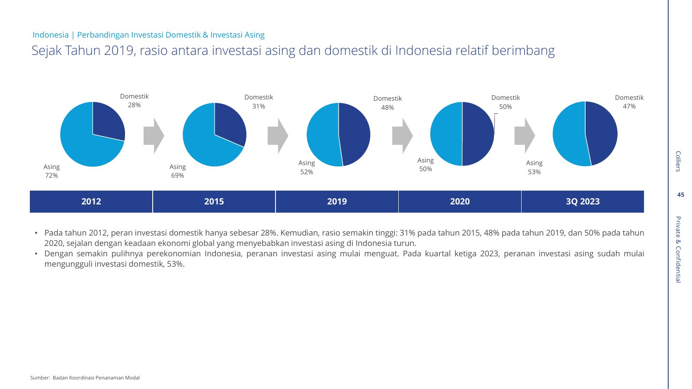
<!-- END COMPLETE PAGE RENDER: SLIDE 45 -->

> **Sumber: Badan Koordinasi Penanaman Modal**

- 
  Pada tahun 2012, peran investasi domestik hanya sebesar 28%. Kemudian, rasio semakin tinggi: 31% pada tahun 2015, 48% pada tahun 2019, dan 50% pada tahun
  2020, sejalan dengan keadaan ekonomi global yang menyebabkan investasi asing di Indonesia turun.
- 
  Dengan semakin pulihnya perekonomian Indonesia, peranan investasi asing mulai menguat. Pada kuartal ketiga 2023, peranan investasi asing sudah mulai
  mengungguli investasi domestik, 53%.

Domestik

28%

Asing

72%

Domestik

31%

Asing

69%

Domestik

48%

Asing

52%

Domestik

50%

Asing

50%

Domestik

47%

Asing

53%

---

#### Slide 46: Jakarta berkonstribusi 19% dari nilai investasi domestik dan 9% dari nilai investasi asing – Indonesia – Distribusi Investasi Berdasarkan Lokasi (3Q2023)

<!-- BEGIN COMPLETE PAGE RENDER: SLIDE 46 -->
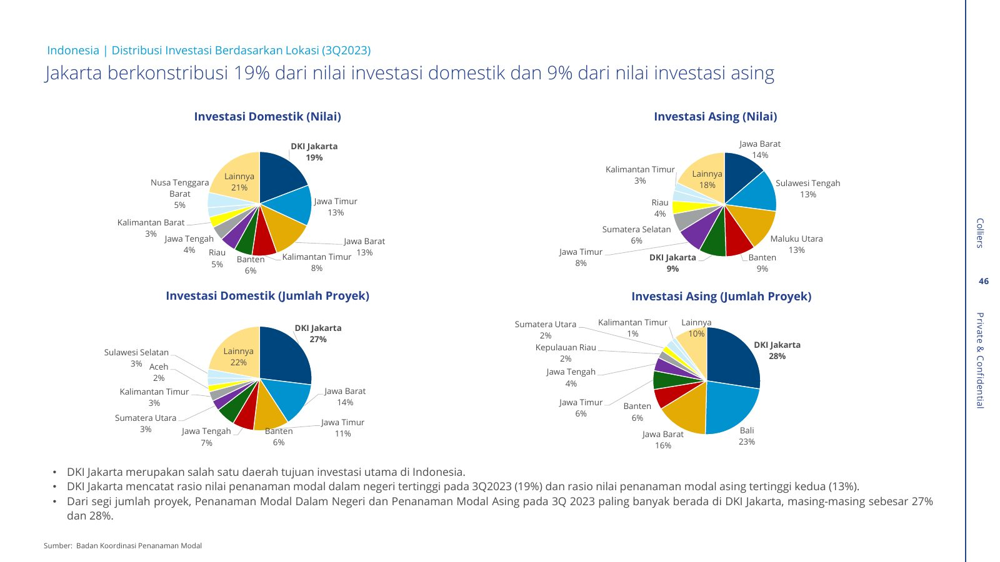
<!-- END COMPLETE PAGE RENDER: SLIDE 46 -->

> **Sumber: Badan Koordinasi Penanaman Modal**

Investasi Domestik (Nilai)

Investasi Domestik (Jumlah Proyek)

Investasi Asing (Nilai)

Investasi Asing (Jumlah Proyek)

DKI Jakarta

19%

Jawa Timur

13%

Jawa Barat

13% Kalimantan Timur

8% Banten

6%

Riau

5%

Jawa Tengah

4%

Kalimantan Barat

3%

Nusa Tenggara

Barat

5%

Lainnya

21%

Jawa Barat

14%

Sulawesi Tengah

13%

Maluku Utara

13% Banten

9% DKI Jakarta

9%

Jawa Timur

8%

Sumatera Selatan

6%

Riau

4%

Kalimantan Timur

3% Lainnya

18%

DKI Jakarta

27%

Jawa Barat

14%

Jawa Timur

11% Jawa Tengah

7% Banten

6%

Sumatera Utara

3%

Kalimantan Timur

3%

Aceh

2%

Sulawesi Selatan

3%

Lainnya

22%

DKI Jakarta

28%

Bali 23% Jawa Barat

16%

Banten

6%

Jawa Timur

6%

Jawa Tengah

4%

Kepulauan Riau

2%

Sumatera Utara

2%

Kalimantan Timur

1% Lainnya

10%

- 
  DKI Jakarta merupakan salah satu daerah tujuan investasi utama di Indonesia.
- 
  DKI Jakarta mencatat rasio nilai penanaman modal dalam negeri tertinggi pada 3Q2023 (19%) dan rasio nilai penanaman modal asing tertinggi kedua (13%).
- 
  Dari segi jumlah proyek, Penanaman Modal Dalam Negeri dan Penanaman Modal Asing pada 3Q 2023 paling banyak berada di DKI Jakarta, masing-masing sebesar 27%
  dan 28%.

---

#### Slide 47: Perbandingan rasio investasi domestik pada sektor perumahan, Kawasan industri, dan perkantoran lebih  tinggi daripada investasi asing – Indonesia – Distribusi Investasi Berdasarkan Sektor (3Q 2023)

<!-- BEGIN COMPLETE PAGE RENDER: SLIDE 47 -->
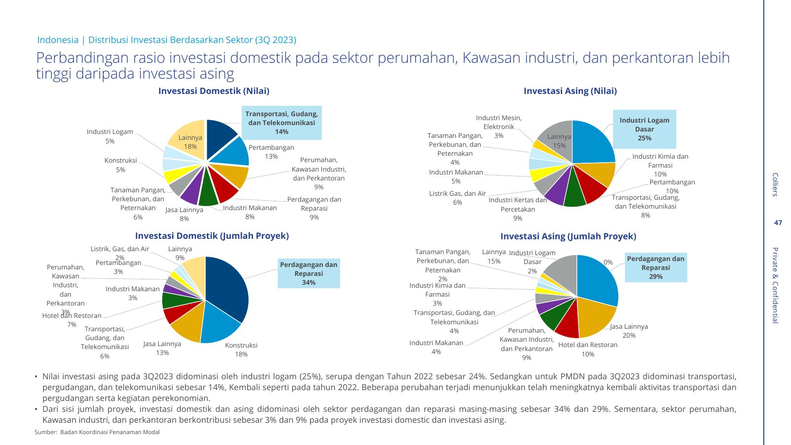
<!-- END COMPLETE PAGE RENDER: SLIDE 47 -->

> **Sumber: Badan Koordinasi Penanaman Modal**

- Nilai investasi asing pada 3Q2023 didominasi oleh industri logam (25%), serupa dengan Tahun 2022 sebesar 24%. Sedangkan untuk PMDN pada 3Q2023 didominasi transportasi,
  pergudangan, dan telekomunikasi sebesar 14%, Kembali seperti pada tahun 2022. Beberapa perubahan terjadi menunjukkan telah meningkatnya kembali aktivitas transportasi dan
  pergudangan serta kegiatan perekonomian.
- Dari sisi jumlah proyek, investasi domestik dan asing didominasi oleh sektor perdagangan dan reparasi masing-masing sebesar 34% dan 29%. Sementara, sektor perumahan,
  Kawasan industri, dan perkantoran berkontribusi sebesar 3% dan 9% pada proyek investasi domestic dan investasi asing.

Investasi Domestik (Nilai)

Investasi Domestik (Jumlah Proyek)

Investasi Asing (Nilai)

Investasi Asing (Jumlah Proyek)

Transportasi, Gudang,

dan Telekomunikasi

14%

Pertambangan

13% Perumahan, Kawasan Industri,

dan Perkantoran

9%

Perdagangan dan

Reparasi

9% Industri Makanan

8% Jasa Lainnya

8%

Tanaman Pangan,

Perkebunan, dan

Peternakan

6%

Konstruksi

5%

Industri Logam

5% Lainnya

18%

Perdagangan dan

Reparasi

34%

Konstruksi

18%

Jasa Lainnya

13%

Transportasi,

Gudang, dan Telekomunikasi

6%

Hotel dan Restoran

7%

Industri Makanan

3%

Perumahan,

Kawasan

Industri,

dan Perkantoran

3%

Pertambangan

3%

Listrik, Gas, dan Air

2% Lainnya

9% 0% Perdagangan dan

Reparasi

29%

Jasa Lainnya

20% Hotel dan Restoran

10%

Perumahan, Kawasan Industri,

dan Perkantoran

9%

Industri Makanan

4%

Transportasi, Gudang, dan

Telekomunikasi

4%

Industri Kimia dan

Farmasi

3%

Tanaman Pangan,

Perkebunan, dan

Peternakan

2%

Industri Logam

Dasar

2%

Lainnya

15%

Industri Logam

Dasar

25%

Industri Kimia dan

Farmasi

10% Pertambangan

10% Industri Kertas dan

Percetakan

9%

Transportasi, Gudang,

dan Telekomunikasi

8%

Listrik Gas, dan Air

6%

Industri Makanan

5%

Tanaman Pangan,

Perkebunan, dan

Peternakan

4%

Industri Mesin,

Elektronik

3% Lainnya

15%

---

#### Slide 48: Populasi Indonesia sebesar 270 juta didominasi oleh usia muda dan produktif – Indonesia – Kependudukan (2020)

<!-- BEGIN COMPLETE PAGE RENDER: SLIDE 48 -->
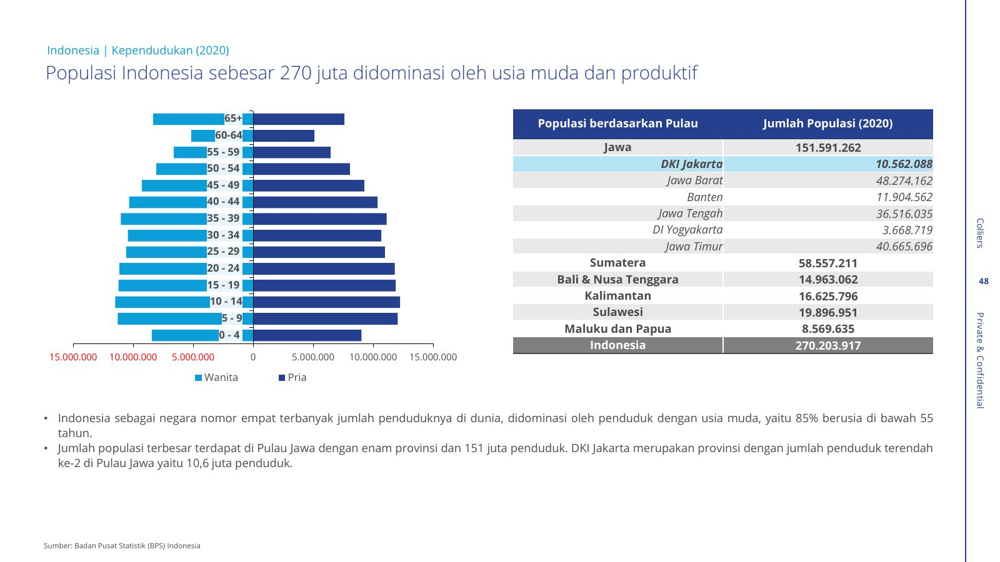
<!-- END COMPLETE PAGE RENDER: SLIDE 48 -->

| Kolom 1 | Kolom 2 | Kolom 3 | Kolom 4 | Kolom 5 | Kolom 6 | 65+ | Kolom 8 | Kolom 9 |
| :--- | :--- | :--- | :--- | :--- | :--- | :--- | :--- | :--- |
|  |  |  |  |  | 60-64 |  |  |  |
|  |  |  |  | 55 - 59 |  |  |  |  |
|  |  |  |  | 50 - 54 |  |  |  |  |
|  |  |  |  | 45 - 49 |  |  |  |  |
|  |  |  |  | 40 - 44 |  |  |  |  |
|  |  |  |  | 35 - 39 |  |  |  |  |
|  |  |  |  | 30 - 34 |  |  |  |  |
|  |  |  |  | 25 - 29 |  |  |  |  |
|  |  |  |  | 20 - 24 |  |  |  |  |
|  |  |  |  | 15 - 19 |  |  |  |  |
|  |  |  |  | 10 - 14 |  |  |  |  |
|  |  |  |  |  |  | 5 - 9 |  |  |
|  |  |  |  |  |  | 0 - 4 |  |  |

| PopulasiberdasarkanPulau | JumlahPopulasi(2020) |
| :--- | :--- |
| Jawa | 151.591.262 |
| DKI Jakarta | 10.562.088 |
| JawaBarat | 48.274.162 |
| Banten | 11.904.562 |
| JawaTengah | 36.516.035 |
| DI Yogyakarta | 3.668.719 |
| JawaTimur | 40.665.696 |
| Sumatera | 58.557.211 |
| Bali & NusaTenggara | 14.963.062 |
| Kalimantan | 16.625.796 |
| Sulawesi | 19.896.951 |
| Maluku danPapua | 8.569.635 |
| Indonesia | 270.203.917 |

> **Sumber: Badan Pusat Statistik (BPS) Indonesia**

Populasi berdasarkan Pulau Jumlah Populasi (2020)

- **15.** 000.000
- **10.** 000.000
- **5.** 000.000
  0
- **5.** 000.000
- **10.** 000.000
- **15.** 000.000

0 - 4

5 - 9

10 - 14

15 - 19

20 - 24

25 - 29

30 - 34

35 - 39

40 - 44

45 - 49

50 - 54

55 - 59

60-64

65+

Wanita Pria

- 
  Indonesia sebagai negara nomor empat terbanyak jumlah penduduknya di dunia, didominasi oleh penduduk dengan usia muda, yaitu 85% berusia di bawah 55
- **tahun.** 
- 
  Jumlah populasi terbesar terdapat di Pulau Jawa dengan enam provinsi dan 151 juta penduduk. DKI Jakarta merupakan provinsi dengan jumlah penduduk terendah
  ke-2 di Pulau Jawa yaitu 10,6 juta penduduk.

---

### 3.2 Makroekonomi & Sosio-Demografi DKI Jakarta

#### Slide 49: DKI Jakarta

<!-- BEGIN COMPLETE PAGE RENDER: SLIDE 49 -->
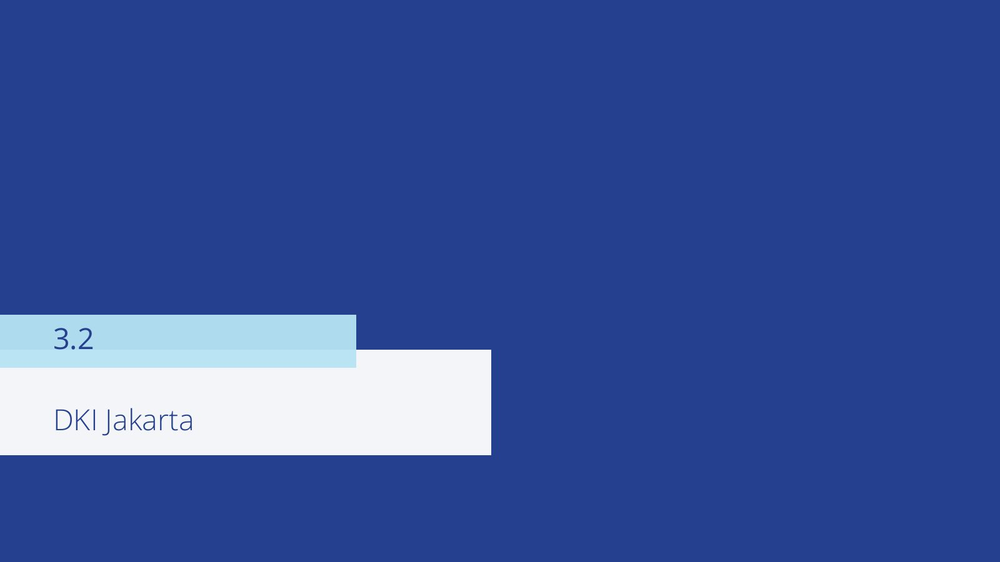
<!-- END COMPLETE PAGE RENDER: SLIDE 49 -->

3.2

---

#### Slide 50: DKI Jakarta – Indikator Eknomi – Sebagai ibukota negara, DKI Jakarta merupakan daerah dengan basis industri jasa

<!-- BEGIN COMPLETE PAGE RENDER: SLIDE 50 -->
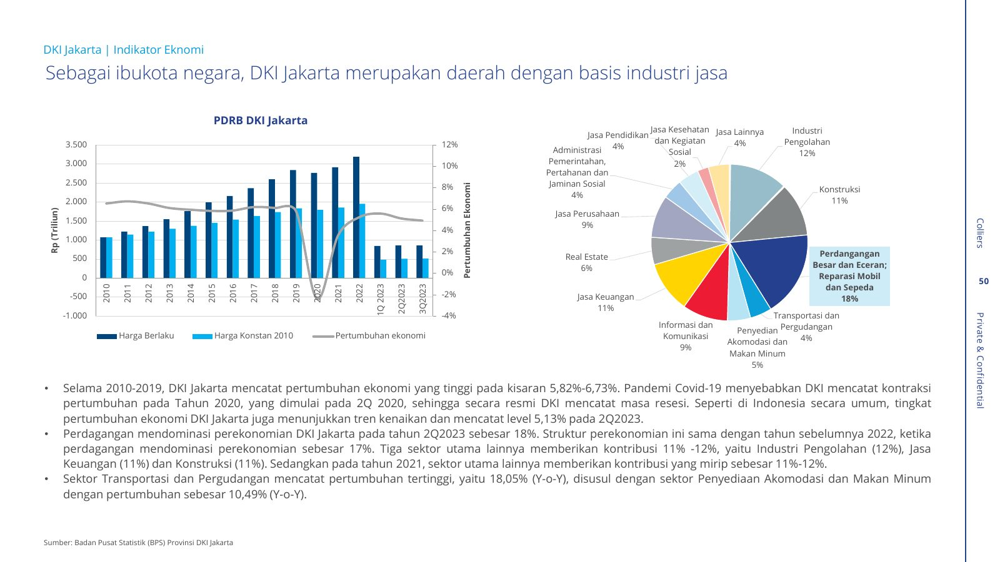
<!-- END COMPLETE PAGE RENDER: SLIDE 50 -->

> **Sumber: Badan Pusat Statistik (BPS) Provinsi DKI Jakarta**

- 
  Selama 2010-2019, DKI Jakarta mencatat pertumbuhan ekonomi yang tinggi pada kisaran 5,82%-6,73%. Pandemi Covid-19 menyebabkan DKI mencatat kontraksi
  pertumbuhan pada Tahun 2020, yang dimulai pada 2Q 2020, sehingga secara resmi DKI mencatat masa resesi. Seperti di Indonesia secara umum, tingkat
  pertumbuhan ekonomi DKI Jakarta juga menunjukkan tren kenaikan dan mencatat level 5,13% pada 2Q2023.
- 
  Perdagangan mendominasi perekonomian DKI Jakarta pada tahun 2Q2023 sebesar 18%. Struktur perekonomian ini sama dengan tahun sebelumnya 2022, ketika
  perdagangan mendominasi perekonomian sebesar 17%. Tiga sektor utama lainnya memberikan kontribusi 11% -12%, yaitu Industri Pengolahan (12%), Jasa
  Keuangan (11%) dan Konstruksi (11%). Sedangkan pada tahun 2021, sektor utama lainnya memberikan kontribusi yang mirip sebesar 11%-12%.
- 
  Sektor Transportasi dan Pergudangan mencatat pertumbuhan tertinggi, yaitu 18,05% (Y-o-Y), disusul dengan sektor Penyediaan Akomodasi dan Makan Minum
  dengan pertumbuhan sebesar 10,49% (Y-o-Y).

-4%

-2%

0%

2%

4%

6%

8%

10%

12%

-1.000

-500

0

500

1.000

1.500

2.000

2.500

3.000

3.500

2010

2011

2012

2013

2014

2015

2016

2017

2018

2019

2020

2021

2022

1Q 2023

2Q2023

3Q2023

Pertumbuhan Ekonomi

Rp (Triliun)

PDRB DKI Jakarta

Harga Berlaku Harga Konstan 2010 Pertumbuhan ekonomi

Industri Pengolahan

12%

Konstruksi

11%

Perdangangan Besar dan Eceran;

Reparasi Mobil

dan Sepeda

18%

Transportasi dan

Pergudangan

4% Penyedian Akomodasi dan

Makan Minum

5%

Informasi dan

Komunikasi

9%

Jasa Keuangan

11%

Real Estate

6%

Jasa Perusahaan

9%

Administrasi Pemerintahan, Pertahanan dan

Jaminan Sosial

4%

Jasa Pendidikan

4%

Jasa Kesehatan

dan Kegiatan

Sosial

2%

Jasa Lainnya

4%

---

#### Slide 51: DKI Jakarta – Investasi Domestik & Investasi Asing – Jumlah proyek penanaman modal dalam dan luar negeri mengalami tren peningkatan

<!-- BEGIN COMPLETE PAGE RENDER: SLIDE 51 -->
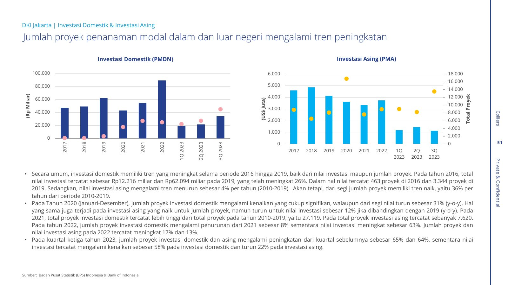
<!-- END COMPLETE PAGE RENDER: SLIDE 51 -->

> **Sumber:  Badan Pusat Statistik (BPS) Indonesia & Bank of Indonesia**

Investasi Domestik (PMDN) Investasi Asing (PMA)

- 
  Secara umum, investasi domestik memiliki tren yang meningkat selama periode 2016 hingga 2019, baik dari nilai investasi maupun jumlah proyek. Pada tahun 2016, total
  nilai investasi tercatat sebesar Rp12.216 miliar dan Rp62.094 miliar pada 2019, yang telah meningkat 26%. Dalam hal nilai tercatat 463 proyek di 2016 dan 3.344 proyek di
- **2019.** Sedangkan, nilai investasi asing mengalami tren menurun sebesar 4% per tahun (2010-2019).  Akan tetapi, dari segi jumlah proyek memiliki tren naik, yaitu 36% per
  tahun dari periode 2010-2019.
- 
  Pada Tahun 2020 (Januari-Desember), jumlah proyek investasi domestik mengalami kenaikan yang cukup signifikan, walaupun dari segi nilai turun sebesar 31% (y-o-y). Hal
  yang sama juga terjadi pada investasi asing yang naik untuk jumlah proyek, namun turun untuk nilai investasi sebesar 12% jika dibandingkan dengan 2019 (y-o-y). Pada
  2021, total proyek investasi domestik tercatat lebih tinggi dari total proyek pada tahun 2010-2019, yaitu 27.119. Pada total proyek investasi asing tercatat sebanyak 7.620.
  Pada tahun 2022, jumlah proyek investasi domestik mengalami penurunan dari 2021 sebesar 8% sementara nilai investasi meningkat sebesar 63%. Jumlah proyek dan
  nilai investasi asing pada 2022 tercatat meningkat 17% dan 13%.
- 
  Pada kuartal ketiga tahun 2023, jumlah proyek investasi domestik dan asing mengalami peningkatan dari kuartal sebelumnya sebesar 65% dan 64%, sementara nilai
  investasi tercatat mengalami kenaikan sebesar 58% pada investasi domestik dan turun 22% pada investasi asing.

0

2.000

4.000

6.000

8.000

10.000

12.000

14.000

16.000

18.000

0

1.000

2.000

3.000

4.000

5.000

6.000

2017 2018 2019 2020 2021 2022 1Q 2023 2Q 2023 3Q 2023

Total Proyek

(US$ Juta)

0

20.000

40.000

60.000

80.000

100.000

2017

2018

2019

2020

2021

2022

1Q 2023

2Q 2023

3Q 2023

(Rp Miliar)

---

#### Slide 52: DKI Jakarta – Kependudukan (2020) – Penduduk DKI Jakarta didominasi oleh usia produktif (15-64 tahun)

<!-- BEGIN COMPLETE PAGE RENDER: SLIDE 52 -->
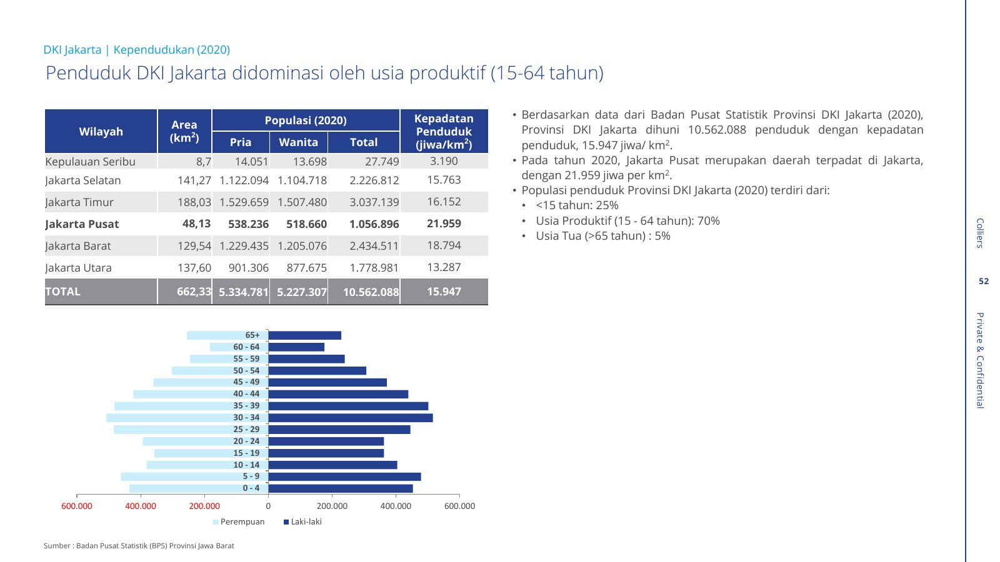
<!-- END COMPLETE PAGE RENDER: SLIDE 52 -->

| Wilayah | Area (km2) | Populasi(2020) | Kolom 4 | Kolom 5 | Kepadatan Penduduk (jiwa/km2) |
| :--- | :--- | :--- | :--- | :--- | :--- |
|  |  | Pria | Wanita | Total |  |
| KepulauanSeribu | 8,7 | 14.051 | 13.698 | 27.749 | 3.190 |
| Jakarta Selatan | 141,27 | 1.122.094 | 1.104.718 | 2.226.812 | 15.763 |
| Jakarta Timur | 188,03 | 1.529.659 | 1.507.480 | 3.037.139 | 16.152 |
| Jakarta Pusat | 48,13 | 538.236 | 518.660 | 1.056.896 | 21.959 |
| Jakarta Barat | 129,54 | 1.229.435 | 1.205.076 | 2.434.511 | 18.794 |
| Jakarta Utara | 137,60 | 901.306 | 877.675 | 1.778.981 | 13.287 |
| TOTAL | 662,33 | 5.334.781 | 5.227.307 | 10.562.088 | 15.947 |

| Kolom 1 | Kolom 2 | Kolom 3 | Kolom 4 | Kolom 5 | Kolom 6 | Kolom 7 | Kolom 8 | Kolom 9 | 65+ | Kolom 11 | Kolom 12 |
| :--- | :--- | :--- | :--- | :--- | :--- | :--- | :--- | :--- | :--- | :--- | :--- |
|  |  |  |  |  |  |  |  |  |  | 60 - 64 |  |
|  |  |  |  |  |  |  |  |  | 55 - 59 |  |  |
|  |  |  |  |  |  |  |  | 50 - 54 |  |  |  |
|  |  |  |  |  |  |  | 45 - 49 |  |  |  |  |
|  |  |  |  | 40 - 44 |  |  |  |  |  |  |  |
|  | 35 - 39 |  |  |  |  |  |  |  |  |  |  |
| 30 - 34 |  |  |  |  |  |  |  |  |  |  |  |
|  | 25 - 29 |  |  |  |  |  |  |  |  |  |  |
|  |  |  |  |  | 20 - 24 |  |  |  |  |  |  |
|  |  |  |  |  |  |  | 15 - 19 |  |  |  |  |
|  |  |  |  |  |  | 10 - 14 |  |  |  |  |  |
|  |  | 5 - 9 |  |  |  |  |  |  |  |  |  |
|  |  |  | 0 - 4 |  |  |  |  |  |  |  |  |

Sumber : Badan Pusat Statistik (BPS) Provinsi Jawa Barat

Wilayah Area (km2)

Populasi (2020) Kepadatan

- Berdasarkan data dari Badan Pusat Statistik Provinsi DKI Jakarta (2020),
  Provinsi DKI Jakarta dihuni 10.562.088 penduduk dengan kepadatan
  penduduk, 15.947 jiwa/ km2.
- Pada tahun 2020, Jakarta Pusat merupakan daerah terpadat di Jakarta,
  dengan 21.959 jiwa per km2.
- Populasi penduduk Provinsi DKI Jakarta (2020) terdiri dari:
- 
  <15 tahun: 25%
- 
  Usia Produktif (15 - 64 tahun): 70%
- 
  Usia Tua (>65 tahun) : 5%

600.000 400.000 200.000 0 200.000 400.000 600.000

Perempuan Laki-laki

---

#### Slide 53: DKI Jakarta – Pengeluaran Rumah Tangga (SES) – DKI Jakarta memiliki rumah tangga kelas menengah-atas dan atas yang cukup signifikan

<!-- BEGIN COMPLETE PAGE RENDER: SLIDE 53 -->
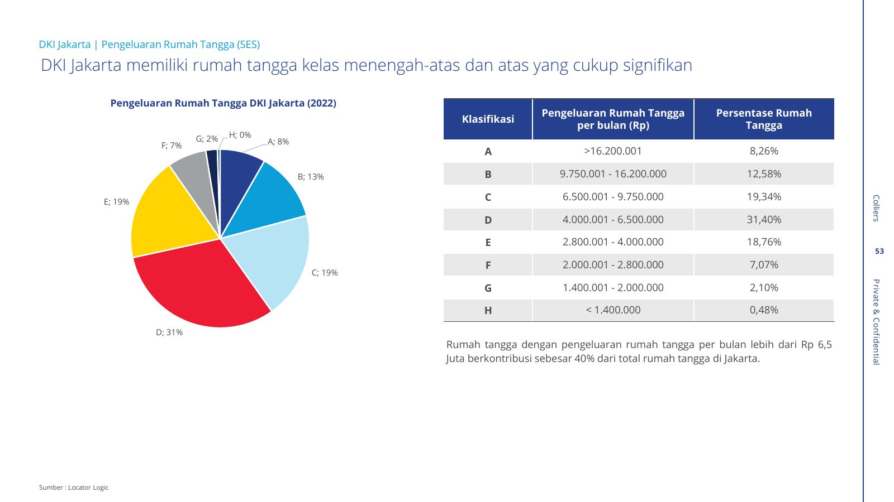
<!-- END COMPLETE PAGE RENDER: SLIDE 53 -->

| Klasifikasi | PengeluaranRumahTangga per bulan(Rp) | PersentaseRumah Tangga |
| :--- | :--- | :--- |
| A | >16.200.001 | 8,26% |
| B | 9.750.001 -16.200.000 | 12,58% |
| C | 6.500.001 -9.750.000 | 19,34% |
| D | 4.000.001 -6.500.000 | 31,40% |
| E | 2.800.001 -4.000.000 | 18,76% |
| F | 2.000.001 -2.800.000 | 7,07% |
| G | 1.400.001 -2.000.000 | 2,10% |
| H | < 1.400.000 | 0,48% |

Sumber : Locator Logic

A; 8%

B; 13%

C; 19%

D; 31%

E; 19%

Pengeluaran Rumah Tangga DKI Jakarta (2022)

Rumah tangga dengan pengeluaran rumah tangga per bulan lebih dari Rp 6,5 Juta berkontribusi sebesar 40% dari total rumah tangga di Jakarta.

Klasifikasi Pengeluaran Rumah Tangga

per bulan (Rp)

Persentase Rumah

Tangga

---

### 3.3 Profil Wilayah Jakarta Pusat

#### Slide 54: Jakarta Pusat

<!-- BEGIN COMPLETE PAGE RENDER: SLIDE 54 -->

<!-- END COMPLETE PAGE RENDER: SLIDE 54 -->

3.3

---

#### Slide 55: Jakarta Pusat – Produk Domestik Regional Bruto (PDRB) – Jakarta Pusat merupakan kotamadya berbasis jasa keuangan dan perdagangan

<!-- BEGIN COMPLETE PAGE RENDER: SLIDE 55 -->
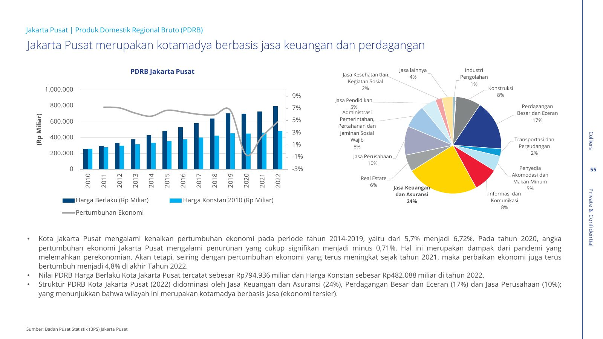
<!-- END COMPLETE PAGE RENDER: SLIDE 55 -->

> **Sumber: Badan Pusat Statistik (BPS) Jakarta Pusat**

- 
  Kota Jakarta Pusat mengalami kenaikan pertumbuhan ekonomi pada periode tahun 2014-2019, yaitu dari 5,7% menjadi 6,72%. Pada tahun 2020, angka
  pertumbuhan ekonomi Jakarta Pusat mengalami penurunan yang cukup signifikan menjadi minus 0,71%. Hal ini merupakan dampak dari pandemi yang
  melemahkan perekonomian. Akan tetapi, seiring dengan pertumbuhan ekonomi yang terus meningkat sejak tahun 2021, maka perbaikan ekonomi juga terus
  bertumbuh menjadi 4,8% di akhir Tahun 2022.
- 
  Nilai PDRB Harga Berlaku Kota Jakarta Pusat tercatat sebesar Rp794.936 miliar dan Harga Konstan sebesar Rp482.088 miliar di tahun 2022.
- 
  Struktur PDRB Kota Jakarta Pusat (2022) didominasi oleh Jasa Keuangan dan Asuransi (24%), Perdagangan Besar dan Eceran (17%) dan Jasa Perusahaan (10%);
  yang menunjukkan bahwa wilayah ini merupakan kotamadya berbasis jasa (ekonomi tersier).

-3%

-1%

1%

3%

5%

7%

9%

0

200.000

400.000

600.000

800.000

1.000.000

2010

2011

2012

2013

2014

2015

2016

2017

2018

2019

2020

2021

2022

(Rp Miliar)

PDRB Jakarta Pusat

Harga Berlaku (Rp Miliar) Harga Konstan 2010 (Rp Miliar)

Pertumbuhan Ekonomi

Industri Pengolahan

1% Konstruksi

8%

Perdagangan Besar dan Eceran

17%

Transportasi dan

Pergudangan

2%

Penyedia Akomodasi dan

Makan Minum

5% Informasi dan

Komunikasi

8%

Jasa Keuangan

dan Asuransi

24%

Real Estate

6%

Jasa Perusahaan

10%

Administrasi Pemerintahan, Pertahanan dan

Jaminan Sosial

Wajib

8%

Jasa Pendidikan

5%

Jasa Kesehatan dan

Kegiatan Sosial

2%

Jasa lainnya

4%

---

#### Slide 56: Jakarta Pusat – Demografi (2020) – Jakarta Pusat memiliki kepadatan penduduk 21.959 Jiwa/Km2

<!-- BEGIN COMPLETE PAGE RENDER: SLIDE 56 -->
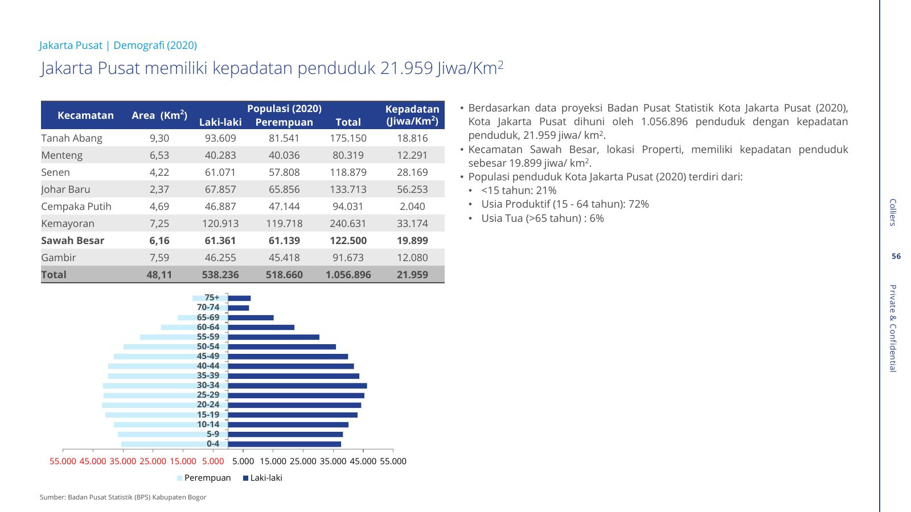
<!-- END COMPLETE PAGE RENDER: SLIDE 56 -->

| Kecamatan | Area (Km2) | Populasi(2020) | Kolom 4 | Kolom 5 | Kepadatan (Jiwa/Km2) |
| :--- | :--- | :--- | :--- | :--- | :--- |
|  |  | Laki-laki | Perempuan | Total |  |
| Tanah Abang | 9,30 | 93.609 | 81.541 | 175.150 | 18.816 |
| Menteng | 6,53 | 40.283 | 40.036 | 80.319 | 12.291 |
| Senen | 4,22 | 61.071 | 57.808 | 118.879 | 28.169 |
| Johar Baru | 2,37 | 67.857 | 65.856 | 133.713 | 56.253 |
| CempakaPutih | 4,69 | 46.887 | 47.144 | 94.031 | 2.040 |
| Kemayoran | 7,25 | 120.913 | 119.718 | 240.631 | 33.174 |
| Sawah Besar | 6,16 | 61.361 | 61.139 | 122.500 | 19.899 |
| Gambir | 7,59 | 46.255 | 45.418 | 91.673 | 12.080 |
| Total | 48,11 | 538.236 | 518.660 | 1.056.896 | 21.959 |
| 75+ 70-74 65-69 60-64 55-59 50-54 45-49 40-44 35-39 30-34 25-29 20-24 15-19 10-14 5-9 0-4 55.000 45.000 35.000 25.000 15.000 5.000 5.000 15.000 25.000 35.000 45.000 55.000 Perempuan Laki-laki |  |  |  |  |  |

| Kolom 1 | Kolom 2 | Kolom 3 | Kolom 4 | Kolom 5 | Kolom 6 | Kolom 7 | 75+ | Kolom 9 | Kolom 10 |
| :--- | :--- | :--- | :--- | :--- | :--- | :--- | :--- | :--- | :--- |
|  |  |  |  |  |  |  |  | 0-74 |  |
|  |  |  |  |  |  | 65-69 |  |  |  |
|  |  |  |  |  | 60-64 |  |  |  |  |
|  |  |  |  | 55-59 |  |  |  |  |  |
|  |  |  | 50-54 |  |  |  |  |  |  |
|  | 45-49 |  |  |  |  |  |  |  |  |
| 30-34 |  |  |  |  |  |  |  |  |  |
| 25-29 |  |  |  |  |  |  |  |  |  |
| 20-24 |  |  |  |  |  |  |  |  |  |
| 15-19 |  |  |  |  |  |  |  |  |  |
|  | 10-14 |  |  |  |  |  |  |  |  |
|  |  | 5-9 |  |  |  |  |  |  |  |
|  |  |  | 0-4 |  |  |  |  |  |  |

> **Sumber: Badan Pusat Statistik (BPS) Kabupaten Bogor**

- Berdasarkan data proyeksi Badan Pusat Statistik Kota Jakarta Pusat (2020),
  Kota Jakarta Pusat dihuni oleh 1.056.896 penduduk dengan kepadatan
  penduduk, 21.959 jiwa/ km2.
- Kecamatan Sawah Besar, lokasi Properti, memiliki kepadatan penduduk
  sebesar 19.899 jiwa/ km2.
- Populasi penduduk Kota Jakarta Pusat (2020) terdiri dari:
- 
  <15 tahun: 21%
- 
  Usia Produktif (15 - 64 tahun): 72%
- 
  Usia Tua (>65 tahun) : 6%

Perempuan Laki-laki

---

#### Slide 57: Jakarta Pusat – Pengeluaran Rumah Tangga per Bulan – Jakarta Pusat memiliki jumlah rumah tangga kelas A dan B cukup tinggi – Pengeluaran Rumah Tangga

<!-- BEGIN COMPLETE PAGE RENDER: SLIDE 57 -->
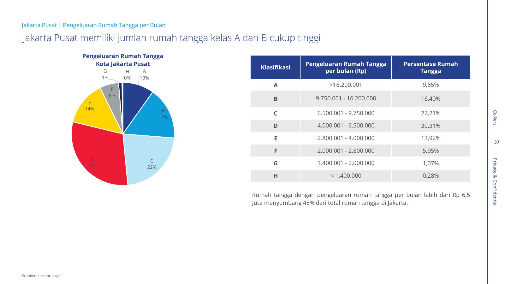
<!-- END COMPLETE PAGE RENDER: SLIDE 57 -->

| Klasifikasi | PengeluaranRumahTangga per bulan(Rp) | PersentaseRumah Tangga |
| :--- | :--- | :--- |
| A | >16.200.001 | 9,85% |
| B | 9.750.001 -16.200.000 | 16,40% |
| C | 6.500.001 -9.750.000 | 22,21% |
| D | 4.000.001 -6.500.000 | 30,31% |
| E | 2.800.001 -4.000.000 | 13,92% |
| F | 2.000.001 -2.800.000 | 5,95% |
| G | 1.400.001 -2.000.000 | 1,07% |
| H | < 1.400.000 | 0,28% |

> **Sumber: Locator Logic**

A 10%

B 17%

C 22%

D 30%

E 14%

F 6%

G 1% H 0%

Kota Jakarta Pusat

Rumah tangga dengan pengeluaran rumah tangga per bulan lebih dari Rp 6,5 Juta menyumbang 48% dari total rumah tangga di Jakarta.

Klasifikasi Pengeluaran Rumah Tangga

per bulan (Rp)

Persentase Rumah

Tangga

---

### 3.4 Infrastruktur Transportasi & Konektivitas Terintegrasi

#### Slide 58: Infrastruktur

<!-- BEGIN COMPLETE PAGE RENDER: SLIDE 58 -->

<!-- END COMPLETE PAGE RENDER: SLIDE 58 -->

3.4

---

#### Slide 59: Infrastruktur – Bandara Internasional Soekarno Hatta – Bandara Internasional Soekarno Hatta merupakan bandara utama di Jakarta

<!-- BEGIN COMPLETE PAGE RENDER: SLIDE 59 -->
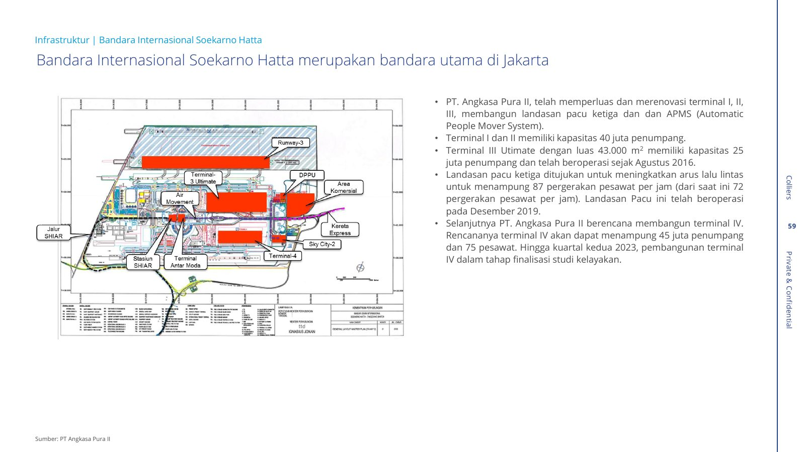
<!-- END COMPLETE PAGE RENDER: SLIDE 59 -->

> **Sumber: PT Angkasa Pura II**

- 
- **PT.** Angkasa Pura II, telah memperluas dan merenovasi terminal I, II,
  III, membangun landasan pacu ketiga dan dan APMS (Automatic
  People Mover System).
- 
  Terminal I dan II memiliki kapasitas 40 juta penumpang.
- 
  Terminal III Utimate dengan luas 43.000 m2 memiliki kapasitas 25
  juta penumpang dan telah beroperasi sejak Agustus 2016.
- 
  Landasan pacu ketiga ditujukan untuk meningkatkan arus lalu lintas
  untuk menampung 87 pergerakan pesawat per jam (dari saat ini 72
  pergerakan pesawat per jam). Landasan Pacu ini telah beroperasi
  pada Desember 2019.
- 
  Selanjutnya PT. Angkasa Pura II berencana membangun terminal IV.
  Rencananya terminal IV akan dapat menampung 45 juta penumpang
  dan 75 pesawat. Hingga kuartal kedua 2023, pembangunan terminal
  IV dalam tahap finalisasi studi kelayakan.

---

#### Slide 60: Infrastruktur – Jaringan Jalan Tol (1) – Tol yang menghubungkan Provinsi Banten, DKI Jakarta dan Jawa Barat

<!-- BEGIN COMPLETE PAGE RENDER: SLIDE 60 -->
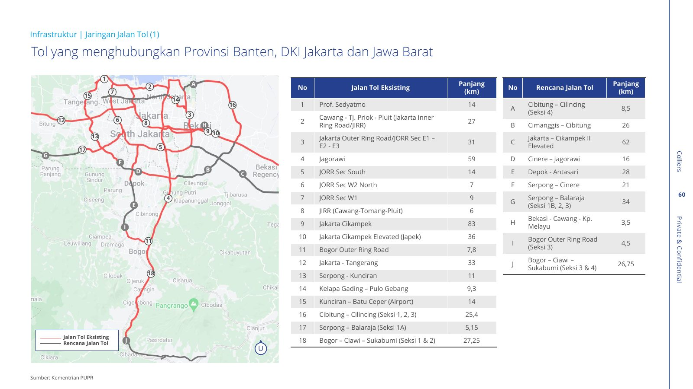
<!-- END COMPLETE PAGE RENDER: SLIDE 60 -->

| No | Jalan Tol Eksisting | Panjang (km) |
| :--- | :--- | :--- |
| 1 | Prof. Sedyatmo | 14 |
| 2 | Cawang -Tj. Priok -Pluit (Jakarta Inner RingRoad/JIRR) | 27 |
| 3 | Jakarta OuterRing Road/JORR Sec E1 – E2 -E3 | 31 |
| 4 | Jagorawi | 59 |
| 5 | JORR Sec South | 14 |
| 6 | JORR Sec W2 North | 7 |
| 7 | JORR SecW1 | 9 |
| 8 | JIRR (Cawang-Tomang-Pluit) | 6 |
| 9 | Jakarta Cikampek | 83 |
| 10 | Jakarta Cikampek Elevated (Japek) | 36 |
| 11 | Bogor Outer Ring Road | 7,8 |
| 12 | Jakarta -Tangerang | 33 |
| 13 | Serpong-Kunciran | 11 |
| 14 | KelapaGading–PuloGebang | 9,3 |
| 15 | Kunciran–Batu Ceper(Airport) | 14 |
| 16 | Cibitung–Cilincing(Seksi1, 2, 3) | 25,4 |
| 17 | Serpong–Balaraja(Seksi1A) | 5,15 |
| 18 | Bogor –Ciawi–Sukabumi(Seksi1 & 2) | 27,25 |

| No | Rencana Jalan Tol | Panjang (km) |
| :--- | :--- | :--- |
| A | Cibitung–Cilincing (Seksi4) | 8,5 |
| B | Cimanggis –Cibitung | 26 |
| C | Jakarta–Cikampek II Elevated | 62 |
| D | Cinere –Jagorawi | 16 |
| E | Depok -Antasari | 28 |
| F | Serpong –Cinere | 21 |
| G | Serpong–Balaraja (Seksi1B, 2, 3) | 34 |
| H | Bekasi -Cawang-Kp. Melayu | 3,5 |
| I | Bogor Outer Ring Road (Seksi3) | 4,5 |
| J | Bogor –Ciawi– Sukabumi(Seksi3 & 4) | 26,75 |

> **Sumber: Kementrian PUPR**

(km)

1 Prof. Sedyatmo 14

4 Jagorawi 59

7 JORR Sec W1 9

9 Jakarta Cikampek 83

12 Jakarta - Tangerang 33

13 Serpong - Kunciran 11

14 Kelapa Gading – Pulo Gebang 9,3

17 Serpong – Balaraja (Seksi 1A) 5,15

14

3

2 1

7

6

13

12

17

11

9 10

16

4

18

5

8

15

A

B C D

E

F G

H

I

U

(km)

B Cimanggis – Cibitung 26

D Cinere – Jagorawi 16

E Depok - Antasari 28

F Serpong – Cinere 21

G Serpong – Balaraja (Seksi 1B, 2, 3) 34

---

#### Slide 61: Infrastruktur – Jaringan Jalan Tol (2) – Mayoritas jalan tol direncanakan beroperasi pada Tahun 2023 dan 2024

<!-- BEGIN COMPLETE PAGE RENDER: SLIDE 61 -->
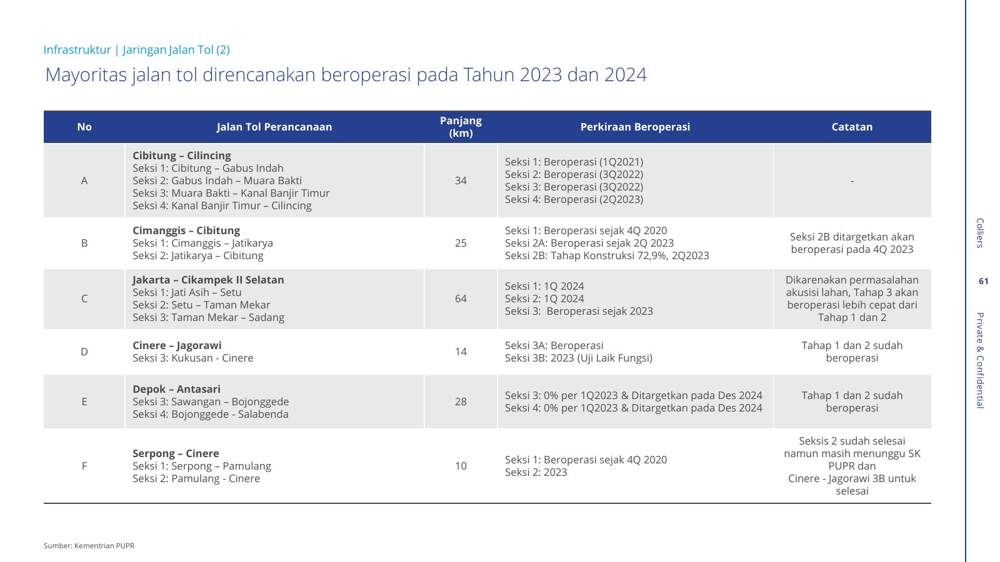
<!-- END COMPLETE PAGE RENDER: SLIDE 61 -->

| No | JalanTolPerancanaan | Panjang (km) | PerkiraanBeroperasi | Catatan |
| :--- | :--- | :--- | :--- | :--- |
| A | Cibitung–Cilincing Seksi1: Cibitung–GabusIndah Seksi2: GabusIndah –Muara Bakti Seksi3: Muara Bakti–KanalBanjirTimur Seksi4: KanalBanjirTimur –Cilincing | 34 | Seksi1: Beroperasi(1Q2021) Seksi2: Beroperasi(3Q2022) Seksi3: Beroperasi(3Q2022) Seksi4: Beroperasi(2Q2023) | - |
| B | Cimanggis–Cibitung Seksi1: Cimanggis–Jatikarya Seksi2: Jatikarya–Cibitung | 25 | Seksi1:Beroperasisejak4Q 2020 Seksi2A: Beroperasisejak2Q 2023 Seksi2B: TahapKonstruksi72,9%, 2Q2023 | Seksi2B ditargetkanakan beroperasipada 4Q 2023 |
| C | Jakarta–CikampekII Selatan Seksi1: Jati Asih–Setu Seksi2: Setu–Taman Mekar Seksi3: Taman Mekar–Sadang | 64 | Seksi1: 1Q 2024 Seksi2: 1Q 2024 Seksi3: Beroperasisejak2023 | Dikarenakanpermasalahan akusisilahan,Tahap3 akan beroperasilebihcepatdari Tahap1 dan2 |
| D | Cinere–Jagorawi Seksi3: Kukusan-Cinere | 14 | Seksi3A: Beroperasi Seksi3B: 2023 (Uji LaikFungsi) |  |
| E | Depok –Antasari Seksi3: Sawangan–Bojonggede Seksi4: Bojonggede-Salabenda | 28 | Seksi3: 0% per 1Q2023 & Ditargetkanpada Des 2024 Seksi4: 0% per 1Q2023 & Ditargetkanpada Des 2024 | Tahap1dan2 sudah beroperasi |
| F | Serpong–Cinere Seksi1: Serpong–Pamulang Seksi2: Pamulang-Cinere | 10 | Seksi1: Beroperasisejak4Q 2020 Seksi2: 2023 | Seksis2 sudahselesai namunmasihmenungguSK PUPR dan Cinere-Jagorawi3B untuk selesai |

> **Sumber: Kementrian PUPR**

No Jalan Tol Perancanaan Panjang

(km) Perkiraan Beroperasi Catatan

A

Cibitung – Cilincing Seksi 1: Cibitung – Gabus Indah Seksi 2: Gabus Indah – Muara Bakti Seksi 3: Muara Bakti – Kanal Banjir Timur Seksi 4: Kanal Banjir Timur – Cilincing

34

Seksi 1: Beroperasi (1Q2021) Seksi 2: Beroperasi (3Q2022) Seksi 3: Beroperasi (3Q2022) Seksi 4: Beroperasi (2Q2023)

-

B

Cimanggis – Cibitung Seksi 1: Cimanggis – Jatikarya Seksi 2: Jatikarya – Cibitung

25 Seksi 1: Beroperasi sejak 4Q 2020 Seksi 2A: Beroperasi sejak 2Q 2023 Seksi 2B: Tahap Konstruksi 72,9%, 2Q2023

Seksi 2B ditargetkan akan

beroperasi pada 4Q 2023

C

Jakarta – Cikampek II Selatan Seksi 1: Jati Asih – Setu Seksi 2: Setu – Taman Mekar Seksi 3: Taman Mekar – Sadang

64 Seksi 1: 1Q 2024 Seksi 2: 1Q 2024 Seksi 3: Beroperasi sejak 2023

Dikarenakan permasalahan akusisi lahan, Tahap 3 akan

beroperasi lebih cepat dari

Tahap 1 dan 2

D Cinere – Jagorawi Seksi 3: Kukusan - Cinere 14 Seksi 3A: Beroperasi Seksi 3B: 2023 (Uji Laik Fungsi)

Tahap 1 dan 2 sudah

beroperasi

E

Depok – Antasari Seksi 3: Sawangan – Bojonggede Seksi 4: Bojonggede - Salabenda

28 Seksi 3: 0% per 1Q2023 & Ditargetkan pada Des 2024 Seksi 4: 0% per 1Q2023 & Ditargetkan pada Des 2024

Tahap 1 dan 2 sudah

beroperasi

F

Serpong – Cinere Seksi 1: Serpong – Pamulang Seksi 2: Pamulang - Cinere

10 Seksi 1: Beroperasi sejak 4Q 2020 Seksi 2: 2023

Seksis 2 sudah selesai namun masih menunggu SK

selesai

---

#### Slide 62: Infrastruktur – Jaringan Jalan Tol (3) – Mayoritas jalan tol direncanakan beroperasi pada Tahun 2023 dan 2024

<!-- BEGIN COMPLETE PAGE RENDER: SLIDE 62 -->
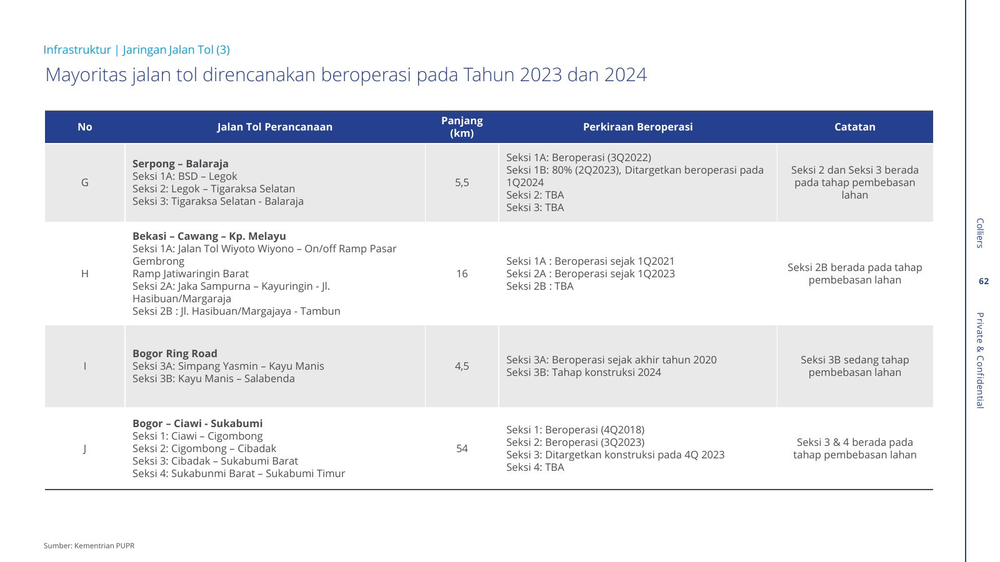
<!-- END COMPLETE PAGE RENDER: SLIDE 62 -->

| No | JalanTolPerancanaan | Panjang (km) | PerkiraanBeroperasi | Catatan |
| :--- | :--- | :--- | :--- | :--- |
| G | Serpong–Balaraja Seksi1A: BSD –Legok Seksi2: Legok–TigaraksaSelatan Seksi3: TigaraksaSelatan -Balaraja | 5,5 | Seksi1A: Beroperasi(3Q2022) Seksi1B: 80% (2Q2023), Ditargetkanberoperasipada 1Q2024 Seksi2: TBA Seksi3: TBA | Seksi2 dan Seksi3 berada pada tahappembebasan lahan |
| H | Bekasi–Cawang –Kp. Melayu Seksi1A: Jalan Tol WiyotoWiyono–On/off Ramp Pasar Gembrong Ramp Jatiwaringin Barat Seksi2A: Jaka Sampurna –Kayuringin -Jl. Hasibuan/Margaraja Seksi2B : Jl. Hasibuan/Margajaya-Tambun | 16 | Seksi1A : Beroperasisejak1Q2021 Seksi2A : Beroperasisejak1Q2023 Seksi2B : TBA | Seksi2B beradapada tahap pembebasanlahan |
| I | Bogor Ring Road Seksi3A: Simpang Yasmin –Kayu Manis Seksi3B: Kayu Manis –Salabenda | 4,5 | Seksi3A: Beroperasisejakakhirtahun 2020 Seksi3B: Tahapkonstruksi2024 | Seksi3B sedang tahap pembebasanlahan |
| J | Bogor –Ciawi-Sukabumi Seksi1: Ciawi–Cigombong Seksi2: Cigombong–Cibadak Seksi3: Cibadak–SukabumiBarat Seksi4: SukabunmiBarat –SukabumiTimur | 54 | Seksi1: Beroperasi(4Q2018) Seksi2: Beroperasi(3Q2023) Seksi3: Ditargetkankonstruksipada 4Q 2023 Seksi4: TBA | Seksi3 & 4 beradapada tahappembebasanlahan |

> **Sumber: Kementrian PUPR**

No Jalan Tol Perancanaan Panjang

(km) Perkiraan Beroperasi Catatan

G

Serpong – Balaraja Seksi 1A: BSD – Legok Seksi 2: Legok – Tigaraksa Selatan Seksi 3: Tigaraksa Selatan - Balaraja

5,5

Seksi 1A: Beroperasi (3Q2022) Seksi 1B: 80% (2Q2023), Ditargetkan beroperasi pada 1Q2024 Seksi 2: TBA Seksi 3: TBA

Seksi 2 dan Seksi 3 berada

pada tahap pembebasan

lahan

H

Bekasi – Cawang – Kp. Melayu Seksi 1A: Jalan Tol Wiyoto Wiyono – On/off Ramp Pasar Gembrong Ramp Jatiwaringin Barat Seksi 2A: Jaka Sampurna – Kayuringin - Jl. Hasibuan/Margaraja Seksi 2B : Jl. Hasibuan/Margajaya - Tambun

16 Seksi 1A : Beroperasi sejak 1Q2021 Seksi 2A : Beroperasi sejak 1Q2023 Seksi 2B : TBA

Seksi 2B berada pada tahap

pembebasan lahan

I

Bogor Ring Road Seksi 3A: Simpang Yasmin – Kayu Manis Seksi 3B: Kayu Manis – Salabenda

4,5 Seksi 3A: Beroperasi sejak akhir tahun 2020 Seksi 3B: Tahap konstruksi 2024

Seksi 3B sedang tahap

pembebasan lahan

J

Bogor – Ciawi - Sukabumi Seksi 1: Ciawi – Cigombong Seksi 2: Cigombong – Cibadak Seksi 3: Cibadak – Sukabumi Barat Seksi 4: Sukabunmi Barat – Sukabumi Timur

54

Seksi 1: Beroperasi (4Q2018) Seksi 2: Beroperasi (3Q2023) Seksi 3: Ditargetkan konstruksi pada 4Q 2023 Seksi 4: TBA

Seksi 3 & 4 berada pada tahap pembebasan lahan

---

#### Slide 63: Infrastruktur – Light Rapid Transit (LRT) – KRL menghubungkan Jakarta, Bogor, Depok, Tangerang dan Bekasi

<!-- BEGIN COMPLETE PAGE RENDER: SLIDE 63 -->
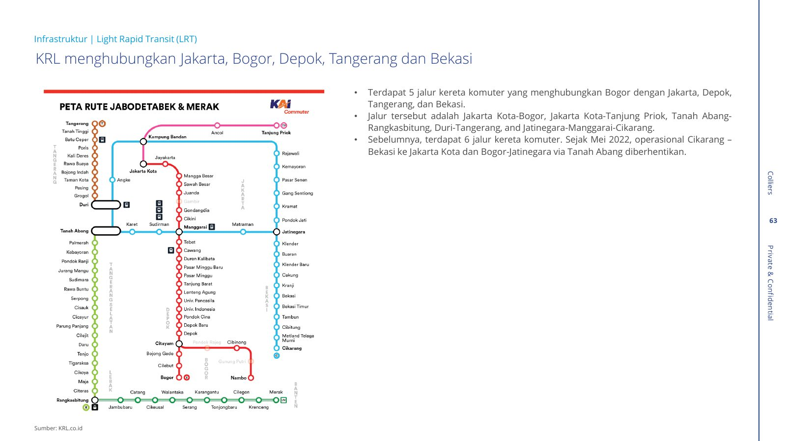
<!-- END COMPLETE PAGE RENDER: SLIDE 63 -->

> **Sumber: KRL.co.id**

- 
  Terdapat 5 jalur kereta komuter yang menghubungkan Bogor dengan Jakarta, Depok,
  Tangerang, dan Bekasi.
- 
  Jalur tersebut adalah Jakarta Kota-Bogor, Jakarta Kota-Tanjung Priok, Tanah Abang-
  Rangkasbitung, Duri-Tangerang, and Jatinegara-Manggarai-Cikarang.
- 
  Sebelumnya, terdapat 6 jalur kereta komuter. Sejak Mei 2022, operasional Cikarang –
  Bekasi ke Jakarta Kota dan Bogor-Jatinegara via Tanah Abang diberhentikan.

---

#### Slide 64: Infrastruktur – Soekarno-Hatta International Ariport Rail Link (SHIARL) – Soekarno Hatta Rail Link mempermudah akses ke Bandara Udara Soekarno Hatta

<!-- BEGIN COMPLETE PAGE RENDER: SLIDE 64 -->
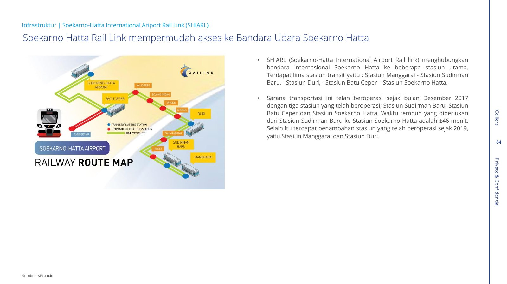
<!-- END COMPLETE PAGE RENDER: SLIDE 64 -->

> **Sumber: KRL.co.id**

- 
  SHIARL (Soekarno-Hatta International Airport Rail link) menghubungkan
  bandara Internasional Soekarno Hatta ke beberapa stasiun utama.
  Terdapat lima stasiun transit yaitu : Stasiun Manggarai - Stasiun Sudirman
  Baru, - Stasiun Duri, - Stasiun Batu Ceper – Stasiun Soekarno Hatta.

- 
  Sarana transportasi ini telah beroperasi sejak bulan Desember 2017
  dengan tiga stasiun yang telah beroperasi; Stasiun Sudirman Baru, Stasiun
  Batu Ceper dan Stasiun Soekarno Hatta. Waktu tempuh yang diperlukan
  dari Stasiun Sudirman Baru ke Stasiun Soekarno Hatta adalah ±46 menit.
  Selain itu terdapat penambahan stasiun yang telah beroperasi sejak 2019,
  yaitu Stasiun Manggarai dan Stasiun Duri.

---

#### Slide 65: Infrastruktur – Jakarta Mass Rapid Transit (Jakarta MRT) – MRT menghubungkan DKI Jakarta (Jalur Utara-Selatan) dan Tangerang (Jalur Timur – Barat) pada  perencanaan berdasarkan RITJ

<!-- BEGIN COMPLETE PAGE RENDER: SLIDE 65 -->
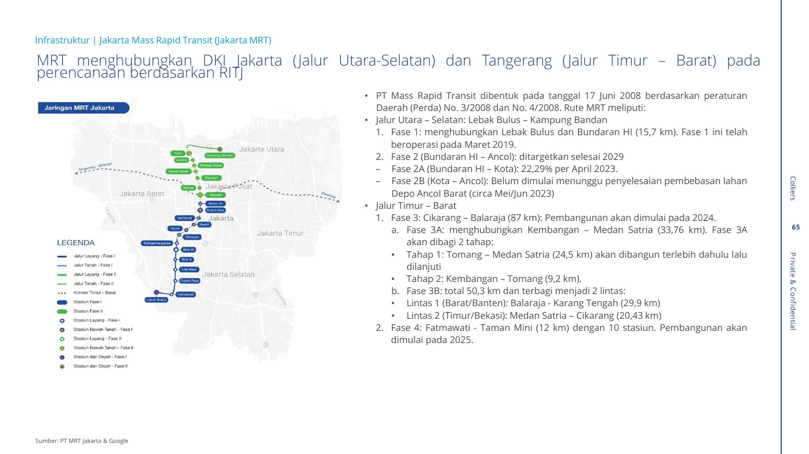
<!-- END COMPLETE PAGE RENDER: SLIDE 65 -->

> **Sumber: PT MRT Jakarta & Google**

- 
  PT Mass Rapid Transit dibentuk pada tanggal 17 Juni 2008 berdasarkan peraturan
  Daerah (Perda) No. 3/2008 dan No. 4/2008. Rute MRT meliputi:
- 
  Jalur Utara – Selatan: Lebak Bulus – Kampung Bandan
- **1.** Fase 1: menghubungkan Lebak Bulus dan Bundaran HI (15,7 km). Fase 1 ini telah
  beroperasi pada Maret 2019.
- **2.** Fase 2 (Bundaran HI – Ancol): ditargetkan selesai 2029
- 
  Fase 2A (Bundaran HI – Kota): 22,29% per April 2023.
- 
  Fase 2B (Kota – Ancol): Belum dimulai menunggu penyelesaian pembebasan lahan
  Depo Ancol Barat (circa Mei/Jun 2023)
- 
  Jalur Timur – Barat
- **1.** Fase 3: Cikarang – Balaraja (87 km): Pembangunan akan dimulai pada 2024.
- **a.** 
  Fase 3A: menghubungkan Kembangan – Medan Satria (33,76 km). Fase 3A
  akan dibagi 2 tahap:
- 
  Tahap 1: Tomang – Medan Satria (24,5 km) akan dibangun terlebih dahulu lalu
  dilanjuti
- 
  Tahap 2: Kembangan – Tomang (9,2 km).
- **b.** Fase 3B: total 50,3 km dan terbagi menjadi 2 lintas:
- 
  Lintas 1 (Barat/Banten): Balaraja - Karang Tengah (29,9 km)
- 
  Lintas 2 (Timur/Bekasi): Medan Satria – Cikarang (20,43 km)
- **2.** Fase 4: Fatmawati - Taman Mini (12 km) dengan 10 stasiun. Pembangunan akan
  dimulai pada 2025.

---

#### Slide 66: Infrastruktur – Light Rapid Transit (LRT) – LRT Jabodebek sudah mulai beroperasi sejak Agustus 2023

<!-- BEGIN COMPLETE PAGE RENDER: SLIDE 66 -->
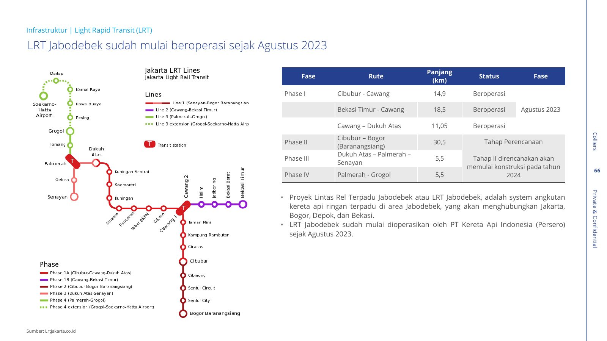
<!-- END COMPLETE PAGE RENDER: SLIDE 66 -->

| Fase | Rute | Panjang (km) | Status | Fase |
| :--- | :--- | :--- | :--- | :--- |
| Phase I | Cibubur-Cawang | 14,9 | Beroperasi | Agustus 2023 |
|  | Bekasi Timur -Cawang | 18,5 | Beroperasi |  |
|  | Cawang –Dukuh Atas | 11,05 | Beroperasi |  |
| Phase II | Cibubur–Bogor (Baranangsiang) | 30,5 | TahapPerencanaan TahapII direncanakanakan memulaikonstruksipada tahun 2024 |  |
| Phase III | DukuhAtas –Palmerah – Senayan | 5,5 |  |  |
| Phase IV | Palmerah-Grogol | 5,5 |  |  |

> **Sumber: Lrtjakarta.co.id**

- 
  Proyek Lintas Rel Terpadu Jabodebek atau LRT Jabodebek, adalah system angkutan
  kereta api ringan terpadu di area Jabodebek, yang akan menghubungkan Jakarta,
  Bogor, Depok, dan Bekasi.
- 
  LRT Jabodebek sudah mulai dioperasikan oleh PT Kereta Api Indonesia (Persero)
  sejak Agustus 2023.

Fase Rute Panjang

(km) Status Fase

Phase II Cibubur – Bogor (Baranangsiang) 30,5 Tahap Perencanaan

Tahap II direncanakan akan memulai konstruksi pada tahun

2024

---

#### Slide 67: Infrastruktur – Light Rapid Transit (LRT) – LRT Jakarta akan melayani daerah Jakarta Utara dan Timur

<!-- BEGIN COMPLETE PAGE RENDER: SLIDE 67 -->
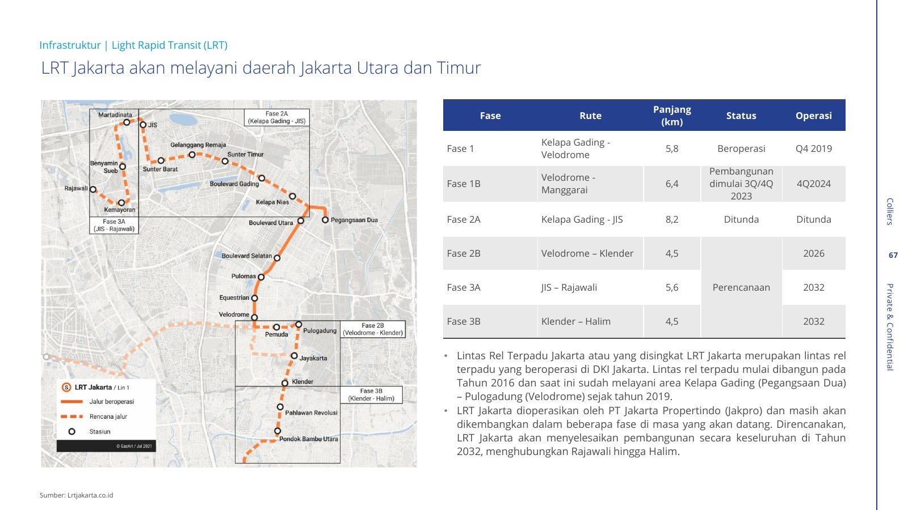
<!-- END COMPLETE PAGE RENDER: SLIDE 67 -->

| Fase | Rute | Panjang (km) | Status | Operasi |
| :--- | :--- | :--- | :--- | :--- |
| Fase1 | KelapaGading- Velodrome | 5,8 | Beroperasi | Q4 2019 |
| Fase1B | Velodrome- Manggarai | 6,4 | Pembangunan dimulai3Q/4Q 2023 | 4Q2024 |
| Fase2A | KelapaGading-JIS | 8,2 | Ditunda | Ditunda |
| Fase2B | Velodrome –Klender | 4,5 | Perencanaan | 2026 |
| Fase3A | JIS –Rajawali | 5,6 |  | 2032 |
| Fase3B | Klender–Halim | 4,5 |  | 2032 |

> **Sumber: Lrtjakarta.co.id**

- 
  Lintas Rel Terpadu Jakarta atau yang disingkat LRT Jakarta merupakan lintas rel
  terpadu yang beroperasi di DKI Jakarta. Lintas rel terpadu mulai dibangun pada
  Tahun 2016 dan saat ini sudah melayani area Kelapa Gading (Pegangsaan Dua)
- Pulogadung (Velodrome) sejak tahun 2019.
- 
  LRT Jakarta dioperasikan oleh PT Jakarta Propertindo (Jakpro) dan masih akan
  dikembangkan dalam beberapa fase di masa yang akan datang. Direncanakan,
  LRT Jakarta akan menyelesaikan pembangunan secara keseluruhan di Tahun
  2032, menghubungkan Rajawali hingga Halim.

Fase Rute Panjang

(km) Status Operasi

Fase 1 Kelapa Gading - Velodrome 5,8 Beroperasi Q4 2019

Fase 1B Velodrome - Manggarai 6,4 Pembangunan dimulai 3Q/4Q

2023 4Q2024

Fase 2A Kelapa Gading - JIS 8,2 Ditunda Ditunda

Perencanaan

2026

---

### 3.5 Kesimpulan Makroekonomi & Rekomendasi Pasar

#### Slide 68: Kesimpulan

<!-- BEGIN COMPLETE PAGE RENDER: SLIDE 68 -->

<!-- END COMPLETE PAGE RENDER: SLIDE 68 -->

3.5

---

#### Slide 69: Kesimpulan – Indonesia – Indonesia menunjukkan kemampuannya untuk bangkit dari kondisi pandemi

<!-- BEGIN COMPLETE PAGE RENDER: SLIDE 69 -->
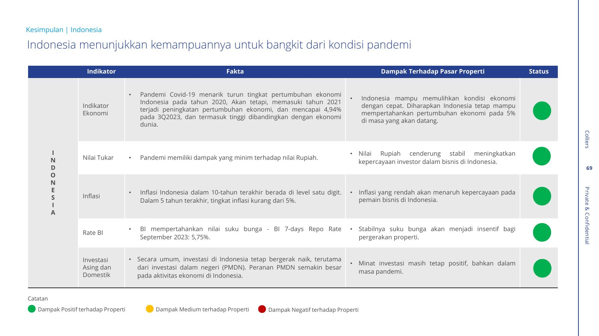
<!-- END COMPLETE PAGE RENDER: SLIDE 69 -->

| Kolom 1 | Indikator | Fakta | DampakTerhadapPasarProperti | Status |
| :--- | :--- | :--- | :--- | :--- |
| I N D O N E S I A | Indikator Ekonomi | • Pandemi Covid-19 menarik turun tingkat pertumbuhan ekonomi Indonesia pada tahun 2020, Akan tetapi, memasuki tahun 2021 terjadi peningkatan pertumbuhan ekonomi, dan mencapai 4,94% pada 3Q2023, dan termasuk tinggi dibandingkan dengan ekonomi dunia. | • Indonesia mampu memulihkan kondisi ekonomi dengan cepat. Diharapkan Indonesia tetap mampu mempertahankan pertumbuhan ekonomi pada 5% dimasayangakandatang. |  |
|  | NilaiTukar | • PandemimemilikidampakyangminimterhadapnilaiRupiah. | • Nilai Rupiah cenderung stabil meningkatkan kepercayaaninvestordalambisnisdiIndonesia. |  |
|  | Inflasi | • Inflasi Indonesia dalam 10-tahun terakhir berada di level satu digit. Dalam5tahunterakhir,tingkatinflasikurangdari5%. | • Inflasi yang rendah akan menaruh kepercayaan pada pemainbisnisdiIndonesia. |  |
|  | Rate BI | • BI mempertahankan nilai suku bunga - BI 7-days Repo Rate September2023:5,75%. | • Stabilnya suku bunga akan menjadi insentif bagi pergerakanproperti. |  |
|  | Investasi Asingdan Domestik | • Secara umum, investasi di Indonesia tetap bergerak naik, terutama dari investasi dalam negeri (PMDN). Peranan PMDN semakin besar padaaktivitasekonomidiIndonesia. | • Minat investasi masih tetap positif, bahkan dalam masapandemi. |  |

Dampak Positif terhadap Properti Dampak Medium terhadap Properti Dampak Negatif terhadap Properti

Catatan

Indikator Fakta Dampak Terhadap Pasar Properti Status

E S

I A

Indikator Ekonomi

  Nilai Tukar
- 
  Pandemi memiliki dampak yang minim terhadap nilai Rupiah.
- 
  Nilai
  Rupiah
  cenderung
  stabil
  meningkatkan
  kepercayaan investor dalam bisnis di Indonesia.

- 
  Stabilnya suku bunga akan menjadi insentif bagi
  pergerakan properti.

Investasi Asing dan Domestik

---

#### Slide 70: Kesimpulan – Makroekonomi Perekonomian di Indonesia, khususnya DKI Jakarta mulai membaik pasca pandemi

<!-- BEGIN COMPLETE PAGE RENDER: SLIDE 70 -->
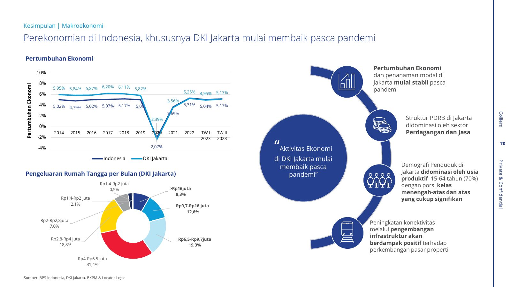
<!-- END COMPLETE PAGE RENDER: SLIDE 70 -->

Pertumbuhan Ekonomi

“Aktivitas Ekonomi

di DKI Jakarta mulai

membaik pasca

pandemi”

Pertumbuhan Ekonomi dan penanaman modal di Jakarta mulai stabil pasca pandemi

Struktur PDRB di Jakarta didominasi oleh sektor Perdagangan dan Jasa

Demografi Penduduk di Jakarta didominasi oleh usia produktif 15-64 tahun (70%) dengan porsi kelas menengah-atas dan atas yang cukup signifikan

Peningkatan konektivitas melalui pengembangan infrastruktur akan berdampak positif terhadap perkembangan pasar properti

5,02% 4,79% 5,02% 5,07% 5,17% 5,0%

-2,07%

3,69%

5,31% 5,04% 5,17%

5,95% 5,84% 5,87% 6,20% 6,11% 5,82%

-2,39%

3,56%

5,25% 4,95% 5,13%

-4%

-2%

0%

2%

4%

6%

8%

10%

2014 2015 2016 2017 2018 2019 2020 2021 2022 TW I 2023 TW II 2023

Pertumbuhan Ekonomi

Indonesia DKI Jakarta

Pengeluaran Rumah Tangga per Bulan (DKI Jakarta)

> **Sumber: BPS Indonesia, DKI Jakarta, BKPM & Locator Logic**

>Rp16juta

8,3%

Rp9,7-Rp16 juta

12,6%

Rp6,5-Rp9,7juta

19,3%

Rp4-Rp6,5 juta

31,4%

Rp2,8-Rp4 juta

18,8%

Rp2-Rp2,8juta

7,0%

Rp1,4-Rp2 juta

2,1%

Rp1,4-Rp2 juta

0,5%

---

## Bab 04: Analisis Pasar Properti Jakarta

> [!NOTE]
> Bab ini menganalisis kondisi pasar properti komersial di DKI Jakarta mencakup perkantoran, ritel/mall, perhotelan, apartemen, dan posisi siklus properti (*Property Clock*).

#### Slide 71: 

<!-- BEGIN COMPLETE PAGE RENDER: SLIDE 71 -->
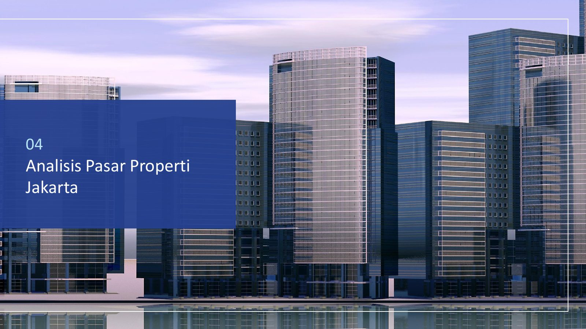
<!-- END COMPLETE PAGE RENDER: SLIDE 71 -->

---

#### Slide 72: Analisis Pasar Properti – Gedung Kantor Kinerja pasar ruang kantor di non-CBD mengalami perlambatan bahkan sebelum pandemi. Tahun 2023  mulai menandai proses pemulihan, baik untuk ruang sewa maupun strata-title

<!-- BEGIN COMPLETE PAGE RENDER: SLIDE 72 -->
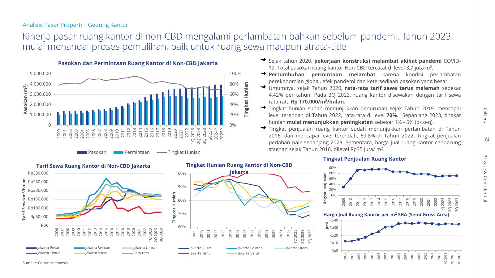
<!-- END COMPLETE PAGE RENDER: SLIDE 72 -->

0%

20%

40%

60%

80%

100%

2009

2010

2011

2012

2013

2014

2015

2016

2017

2018

2019

2020

2021

2022

1Q 2023

2Q 2023

3Q 2023

Tingkat Penjualan

Sejak tahun 2020, pekerjaan konstruksi melambat akibat pandemi COVID- 19. Total pasokan ruang kantor Non-CBD tercatat di level 3,7 juta m2. Pertumbuhan permintaan melambat karena kondisi perlambatan perekonomian global, efek pandemi dan ketersediaan pasokan yang besar. Umumnya, sejak Tahun 2020, rata-rata tarif sewa terus melemah sebesar 4,42% per tahun. Pada 3Q 2023, ruang kantor disewakan dengan tarif sewa rata-rata Rp 170.000/m2/bulan. Tingkat hunian sudah menunjukkan penurunan sejak Tahun 2019, mencapai level terendah di Tahun 2022, rata-rata di level 70%. Sepanjang 2023, tingkat hunian mulai menunjukkan peningkatan sebesar 1% - 5% (q-to-q). Tingkat penjualan ruang kantor sudah menunjukkan perlambatan di Tahun 2016, dan mencapai level terendah, 69,8% di Tahun 2022. Tingkat penjualan perlahan naik sepanjang 2023. Sementara, harga jual ruang kantor cenderung stagnan sejak Tahun 2016, dilevel Rp35 juta/ m2.

> **Sumber: Colliers Indonesia**

0%

20%

40%

60%

80%

100%

0

1.000.000

2.000.000

3.000.000

4.000.000

5.000.000

2000 2001 2002 2003 2004 2005 2006 2007 2008 2009 2010 2011 2012 2013 2014 2015 2016 2017 2018 2019 2020 2021 2022 1Q 2023 2Q 2023 3Q 2023 2023P 2024P 2025P

Tingkat Hunian

Pasokan (m2)

Pasokan dan Permintaan Ruang Kantor di Non-CBD Jakarta

Pasokan Permintaan Tingkat Hunian

Rp0

Rp50.000

Rp100.000

Rp150.000

Rp200.000

Rp250.000

Rp300.000

2006

2007

2008

2009

2010

2011

2012

2013

2014

2015

2016

2017

2018

2019

2020

2021

2022

1Q 2023

2Q 2023

3Q 2023

Tarif Sewa/m2/bulan

Tarif Sewa Ruang Kantor di Non-CBD Jakarta

Jakarta Pusat Jakarta Selatan Jakarta Utara Jakarta Timur Jakarta Barat Rata-rata

60%

70%

80%

90%

100%

2009

2010

2011

2012

2013

2014

2015

2016

2017

2018

2019

2020

2021

2022

1Q 2023

2Q 2023

3Q 2023

Tingkat Hunian

Tingkat Hunian Ruang Kantor di Non-CBD

Jakarta

Jakarta Pusat Jakarta Selatan Jakarta Utara Jakarta Timur Jakarta Barat

Harga Jual Ruang Kantor per m2 SGA (Semi Gross Area)

Tingkat Penjualan Ruang Kantor

Rp0

Rp10

Rp20

Rp30

Rp40

2008

2009

2010

2011

2012

2013

2014

2015

2016

2017

2018

2019

2020

2021

2022

1Q 2023

2Q 2023

3Q 2023

Juta

---

#### Slide 73: Analisis Pasar Properti – Hotel Kinerja Hotel di Jakarta menunjukkan pemulihan yang cukup signifikan

<!-- BEGIN COMPLETE PAGE RENDER: SLIDE 73 -->
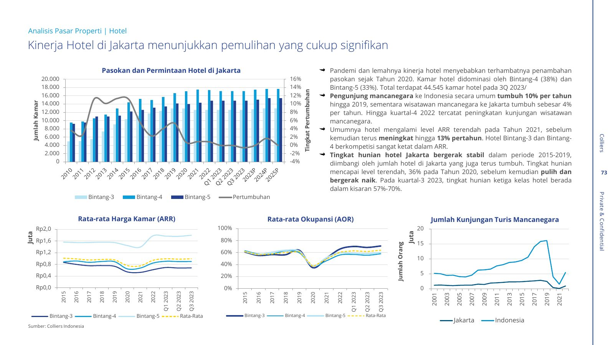
<!-- END COMPLETE PAGE RENDER: SLIDE 73 -->

0

5

10

15

20

2001

2003

2005

2007

2009

2011

2013

2015

2017

2019

2021

Jumlah Orang

Juta

Jakarta Indonesia

- 4%
- 2%
  0%
  2%
  4%
  6%
  8%
  10%
  12%
  14%
  16%

  0
- **2.** 000
- **4.** 000
- **6.** 000
- **8.** 000
- **10.** 000
- **12.** 000
- **14.** 000
- **16.** 000
- **18.** 000
- **20.** 000

Tingkat Pertumbuhan

Jumlah Kamar

Bintang-3 Bintang-4 Bintang-5 Pertumbuhan

Rp0,0

Rp0,4

Rp0,8

Rp1,2

Rp1,6

Rp2,0

2015

2016

2017

2018

2019

2020

2021

2022

Q1 2023

Q2 2023

Q3 2023

Juta

Bintang-3 Bintang-4 Bintang-5 Rata-Rata

0%

20%

40%

60%

80%

100%

2015

2016

2017

2018

2019

2020

2021

2022

Q1 2023

Q2 2023

Q3 2023

Bintang-3 Bintang-4 Bintang-5 Rata-Rata

Pandemi dan lemahnya kinerja hotel menyebabkan terhambatnya penambahan pasokan sejak Tahun 2020. Kamar hotel didominasi oleh Bintang-4 (38%) dan Bintang-5 (33%). Total terdapat 44.545 kamar hotel pada 3Q 2023/ Pengunjung mancanegara ke Indonesia secara umum tumbuh 10% per tahun hingga 2019, sementara wisatawan mancanegara ke Jakarta tumbuh sebesar 4% per tahun. Hingga kuartal-4 2022 tercatat peningkatan kunjungan wisatawan mancanegara. Umumnya hotel mengalami level ARR terendah pada Tahun 2021, sebelum kemudian terus meningkat hingga 13% pertahun. Hotel Bintang-3 dan Bintang- 4 berkompetisi sangat ketat dalam ARR. Tingkat hunian hotel Jakarta bergerak stabil dalam periode 2015-2019, diimbangi oleh jumlah hotel di Jakarta yang juga terus tumbuh. Tingkat hunian mencapai level terendah, 36% pada Tahun 2020, sebelum kemudian pulih dan bergerak naik. Pada kuartal-3 2023, tingkat hunian ketiga kelas hotel berada dalam kisaran 57%-70%.

Rata-rata Okupansi (AOR) Rata-rata Harga Kamar (ARR) Jumlah Kunjungan Turis Mancanegara

> **Sumber: Colliers Indonesia**

Pasokan dan Permintaan Hotel di Jakarta

---

#### Slide 74: Analisis Pasar Properti – Ritel Kinerja pasar ruang ritel belum menunjukkan pemulihan yang berarti

<!-- BEGIN COMPLETE PAGE RENDER: SLIDE 74 -->
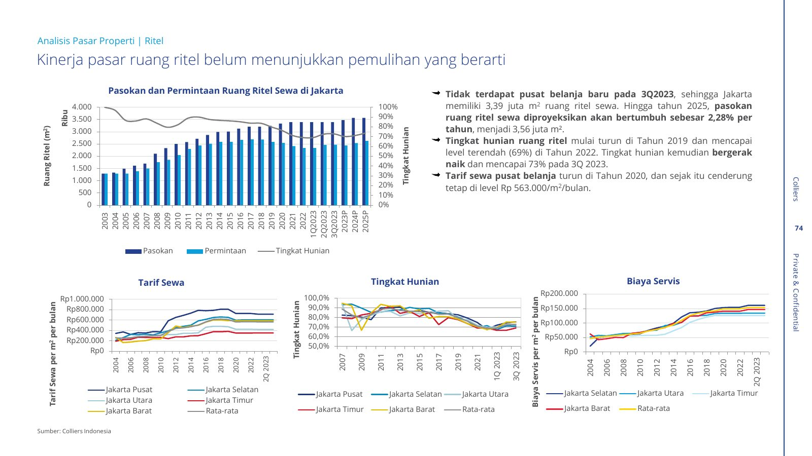
<!-- END COMPLETE PAGE RENDER: SLIDE 74 -->

Tidak terdapat pusat belanja baru pada 3Q2023, sehingga Jakarta memiliki 3,39 juta m2 ruang ritel sewa. Hingga tahun 2025, pasokan ruang ritel sewa diproyeksikan akan bertumbuh sebesar 2,28% per tahun, menjadi 3,56 juta m². Tingkat hunian ruang ritel mulai turun di Tahun 2019 dan mencapai level terendah (69%) di Tahun 2022. Tingkat hunian kemudian bergerak naik dan mencapai 73% pada 3Q 2023. Tarif sewa pusat belanja turun di Tahun 2020, dan sejak itu cenderung tetap di level Rp 563.000/m2/bulan.

0% 10% 20% 30% 40% 50% 60% 70% 80% 90% 100%

0

500

1.000

1.500

2.000

2.500

3.000

3.500

4.000

2003 2004 2005 2006 2007 2008 2009 2010 2011 2012 2013 2014 2015 2016 2017 2018 2019 2020 2021 2022 1Q2023 2Q2023 3Q2023 2023P 2024P 2025P

Tingkat Hunian

Ruang Ritel (m2)

Ribu

Pasokan dan Permintaan Ruang Ritel Sewa di Jakarta

Pasokan Permintaan Tingkat Hunian

Rp0 Rp200.000 Rp400.000 Rp600.000 Rp800.000 Rp1.000.000

2004

2006

2008

2010

2012

2014

2016

2018

2020

2022

2Q 2023

Tarif Sewa per m2 per bulan

Tarif Sewa

Jakarta Pusat Jakarta Selatan Jakarta Utara Jakarta Timur Jakarta Barat Rata-rata

50,0% 60,0% 70,0% 80,0% 90,0% 100,0%

2007

2009

2011

2013

2015

2017

2019

2021

1Q 2023

3Q 2023

Tingkat Hunian

Tingkat Hunian

Jakarta Pusat Jakarta Selatan Jakarta Utara

Jakarta Timur Jakarta Barat Rata-rata

Rp0

Rp50.000

Rp100.000

Rp150.000

Rp200.000

2004

2006

2008

2010

2012

2014

2016

2018

2020

2022

2Q 2023

Biaya Servis per m2 per bulan

Biaya Servis

Jakarta Selatan Jakarta Utara Jakarta Timur

Jakarta Barat Rata-rata

> **Sumber: Colliers Indonesia**

---

#### Slide 75: Analisis Pasar Properti – Apartemen Kinerja pasar apartemen di Jakarta cenderung melambat

<!-- BEGIN COMPLETE PAGE RENDER: SLIDE 75 -->
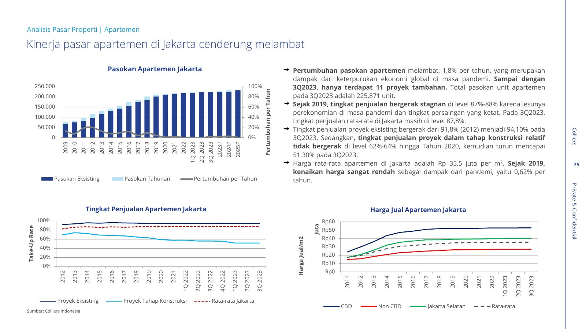
<!-- END COMPLETE PAGE RENDER: SLIDE 75 -->

Pertumbuhan pasokan apartemen melambat, 1,8% per tahun, yang merupakan dampak dari keterpurukan ekonomi global di masa pandemi. Sampai dengan 3Q2023, hanya terdapat 11 proyek tambahan. Total pasokan unit apartemen pada 3Q2023 adalah 225.871 unit. Sejak 2019, tingkat penjualan bergerak stagnan di level 87%-88% karena lesunya perekonomian di masa pandemi dan tingkat persaingan yang ketat. Pada 3Q2023, tingkat penjualan rata-rata di Jakarta masih di level 87,8%. Tingkat penjualan proyek eksisting bergerak dari 91,8% (2012) menjadi 94,10% pada 3Q2023. Sedangkan, tingkat penjualan proyek dalam tahap konstruksi relatif tidak bergerak di level 62%-64% hingga Tahun 2020, kemudian turun mencapai 51,30% pada 3Q2023. Harga rata-rata apartemen di Jakarta adalah Rp 35,5 juta per m2. Sejak 2019, kenaikan harga sangat rendah sebagai dampak dari pandemi, yaitu 0,62% per tahun.

> **Sumber: Colliers Indonesia**

0%

20%

40%

60%

80%

100%

0

50.000

100.000

150.000

200.000

250.000

2009

2010

2011

2012

2013

2014

2015

2016

2017

2018

2019

2020

2021

2022

1Q 2023

2Q 2023

3Q 2023

2023P

2024P

2025P

Pertumbuhan per Tahun

Pasokan Apartemen Jakarta

Pasokan Eksisting Pasokan Tahunan Pertumbuhan per Tahun

0%

20%

40%

60%

80%

100%

2012

2013

2014

2015

2016

2017

2018

2019

2020

2021

1Q 2022

2Q 2022

3Q 2022

4Q 2022

1Q 2023

2Q 2023

3Q 2023

Take-Up Rate

Tingkat Penjualan Apartemen Jakarta

Proyek Eksisting Proyek Tahap Konstruksi Rata-rata Jakarta

Rp0

Rp10

Rp20

Rp30

Rp40

Rp50

Rp60

2011

2012

2013

2014

2015

2016

2017

2018

2019

2020

2021

2022

1Q 2023

2Q 2023

3Q 2023

Harga Jual/m2

Juta

Harga Jual Apartemen Jakarta

CBD Non CBD Jakarta Selatan Rata-rata

---

#### Slide 76: 12 – Analisis Pasar Properti – Kesimpulan Kinerja Pasar Properti di Jakarta memasuki tahap Pemulihan

<!-- BEGIN COMPLETE PAGE RENDER: SLIDE 76 -->
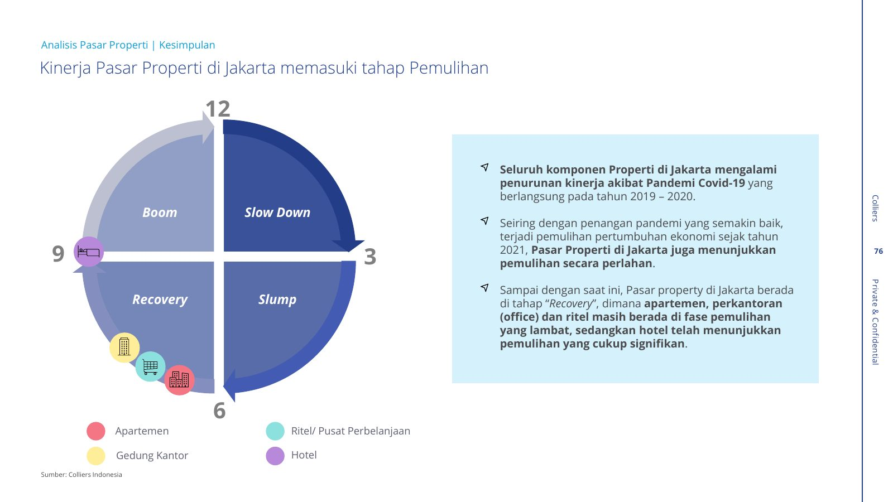
<!-- END COMPLETE PAGE RENDER: SLIDE 76 -->

Slow Down

Slump Recovery

Boom

6

9 3

Apartemen

Gedung Kantor

Ritel/ Pusat Perbelanjaan

Hotel

> **Sumber: Colliers Indonesia**

Seluruh komponen Properti di Jakarta mengalami penurunan kinerja akibat Pandemi Covid-19 yang berlangsung pada tahun 2019 – 2020.

Seiring dengan penangan pandemi yang semakin baik, terjadi pemulihan pertumbuhan ekonomi sejak tahun 2021, Pasar Properti di Jakarta juga menunjukkan pemulihan secara perlahan.

Sampai dengan saat ini, Pasar property di Jakarta berada di tahap “Recovery”, dimana apartemen, perkantoran (office) dan ritel masih berada di fase pemulihan yang lambat, sedangkan hotel telah menunjukkan pemulihan yang cukup signifikan.

---

## Bab 05: Analisis Highest and Best Use (HBU)

> [!IMPORTANT]
> Bab ini merumuskan metodologi penapisan 4 pilar *Highest and Best Use* (Legal, Fisik, Finansial, Maksimal Produktif) serta menetapkan matriks kuadran kelayakan 11 komponen properti.

#### Slide 77: 

<!-- BEGIN COMPLETE PAGE RENDER: SLIDE 77 -->
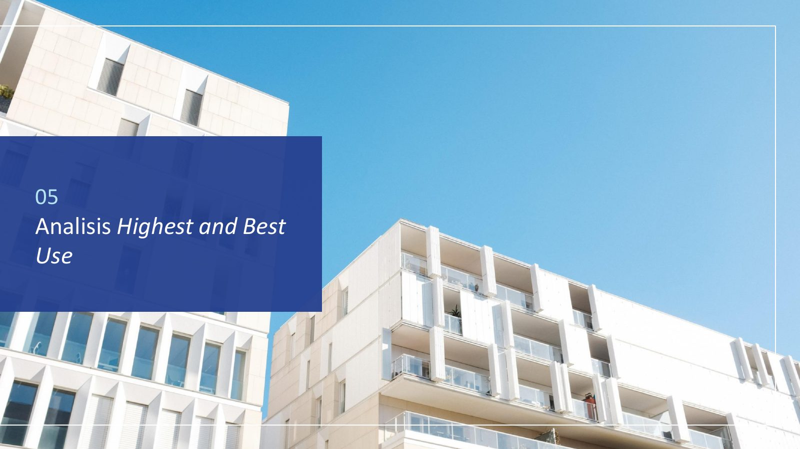
<!-- END COMPLETE PAGE RENDER: SLIDE 77 -->

---

#### Slide 78: Analisis Highest and Best Use – Rekomendasi Komponen Pengembangan Kriteria Skoring Pemetaan

<!-- BEGIN COMPLETE PAGE RENDER: SLIDE 78 -->
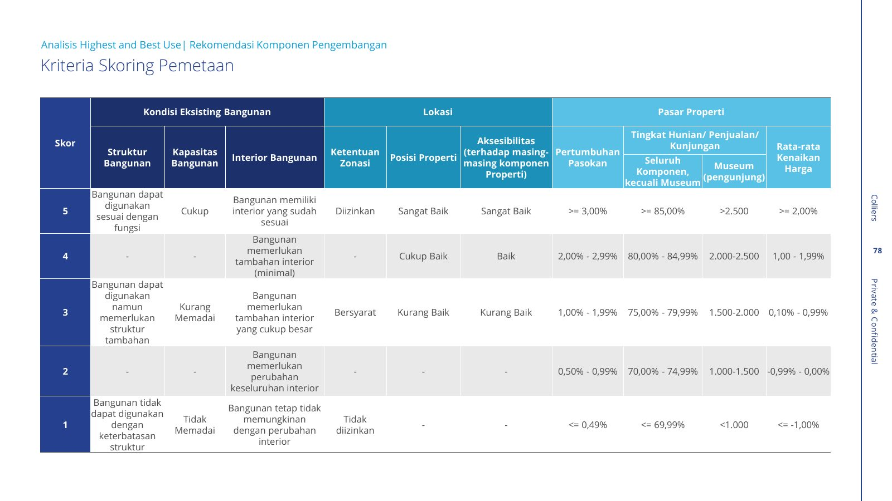
<!-- END COMPLETE PAGE RENDER: SLIDE 78 -->

| Skor | KondisiEksisting Bangunan | Kolom 3 | Kolom 4 | Lokasi | Kolom 6 | Kolom 7 | Pasar Properti | Kolom 9 | Kolom 10 | Kolom 11 |
| :--- | :--- | :--- | :--- | :--- | :--- | :--- | :--- | :--- | :--- | :--- |
|  | Struktur Bangunan | Kapasitas Bangunan | Interior Bangunan | Ketentuan Zonasi | PosisiProperti | Aksesibilitas (terhadapmasing- masing komponen Properti) | Pertumbuhan Pasokan | Tingkat Hunian/ Penjualan/ Kunjungan |  | Rata-rata Kenaikan Harga |
|  |  |  |  |  |  |  |  | Seluruh Komponen, kecualiMuseum | Museum (pengunjung) |  |
| 5 | Bangunandapat digunakan sesuaidengan fungsi | Cukup | Bangunan memiliki interior yang sudah sesuai | Diizinkan | Sangat Baik | Sangat Baik | >= 3,00% | >= 85,00% | >2.500 | >= 2,00% |
| 4 | - | - | Bangunan memerlukan tambahan interior (minimal) | - | Cukup Baik | Baik | 2,00% -2,99% | 80,00% -84,99% | 2.000-2.500 | 1,00 -1,99% |
| 3 | Bangunan dapat digunakan namun memerlukan struktur tambahan | Kurang Memadai | Bangunan memerlukan tambahaninterior yang cukupbesar | Bersyarat | Kurang Baik | Kurang Baik | 1,00% -1,99% | 75,00% -79,99% | 1.500-2.000 | 0,10% -0,99% |
| 2 | - | - | Bangunan memerlukan perubahan keseluruhaninterior | - | - | - | 0,50% -0,99% | 70,00% -74,99% | 1.000-1.500 | -0,99% -0,00% |
| 1 | Bangunantidak dapatdigunakan dengan keterbatasan struktur | Tidak Memadai | Bangunantetaptidak memungkinan denganperubahan interior | Tidak diizinkan | - | - | <= 0,49% | <= 69,99% | <1.000 | <= -1,00% |

Skor

Kondisi Eksisting Bangunan Lokasi Pasar Properti

Struktur Bangunan

Zonasi Posisi Properti

Aksesibilitas (terhadap masing- masing komponen

Properti)

Pertumbuhan

Pasokan

Tingkat Hunian/ Penjualan/

Kunjungan Rata-rata Kenaikan

Harga Seluruh Komponen, kecuali Museum

Museum (pengunjung)

5

Bangunan dapat

digunakan sesuai dengan

fungsi

Cukup

sesuai

  4
- 
- 

Bangunan memerlukan tambahan interior

(minimal)

3

Bangunan dapat

digunakan

namun memerlukan

struktur tambahan

Kurang Memadai

Bangunan memerlukan tambahan interior

yang cukup besar

  2
- 
- 

Bangunan memerlukan

perubahan keseluruhan interior

1

Bangunan tidak dapat digunakan

dengan keterbatasan

struktur

Tidak Memadai

Bangunan tetap tidak

memungkinan dengan perubahan

interior

---

#### Slide 79: Analisis Highest and Best Use – Rekomendasi Komponen Pengembangan Hasil Skoring Pemetaan – Skoring berdasarkan Kondisi Eksisting Bangunan dan Lokasi

<!-- BEGIN COMPLETE PAGE RENDER: SLIDE 79 -->
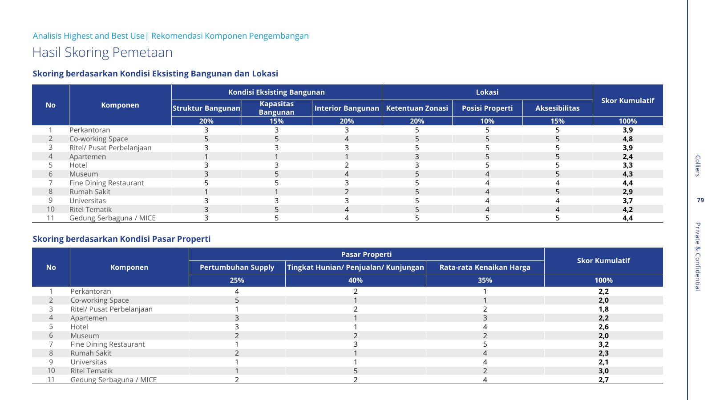
<!-- END COMPLETE PAGE RENDER: SLIDE 79 -->

| No | Komponen | KondisiEksistingBangunan | Kolom 4 | Kolom 5 | Lokasi | Kolom 7 | Kolom 8 | Skor Kumulatif |
| :--- | :--- | :--- | :--- | :--- | :--- | :--- | :--- | :--- |
|  |  | StrukturBangunan | Kapasitas Bangunan | Interior Bangunan | KetentuanZonasi | PosisiProperti | Aksesibilitas |  |
|  |  | 20% | 15% | 20% | 20% | 10% | 15% | 100% |
| 1 | Perkantoran | 3 | 3 | 3 | 5 | 5 | 5 | 3,9 |
| 2 | Co-working Space | 5 | 5 | 4 | 5 | 5 | 5 | 4,8 |
| 3 | Ritel/ Pusat Perbelanjaan | 3 | 3 | 3 | 5 | 5 | 5 | 3,9 |
| 4 | Apartemen | 1 | 1 | 1 | 3 | 5 | 5 | 2,4 |
| 5 | Hotel | 3 | 3 | 2 | 3 | 5 | 5 | 3,3 |
| 6 | Museum | 3 | 5 | 4 | 5 | 4 | 5 | 4,3 |
| 7 | Fine Dining Restaurant | 5 | 5 | 3 | 5 | 4 | 4 | 4,4 |
| 8 | RumahSakit | 1 | 1 | 2 | 5 | 4 | 5 | 2,9 |
| 9 | Universitas | 3 | 3 | 3 | 5 | 4 | 4 | 3,7 |
| 10 | RitelTematik | 3 | 5 | 4 | 5 | 4 | 4 | 4,2 |
| 11 | Gedung Serbaguna / MICE | 3 | 5 | 4 | 5 | 5 | 5 | 4,4 |

| No | Komponen | Pasar Properti | Kolom 4 | Kolom 5 | Skor Kumulatif |
| :--- | :--- | :--- | :--- | :--- | :--- |
|  |  | PertumbuhanSupply | Tingkat Hunian/ Penjualan/ Kunjungan | Rata-rata KenaikanHarga |  |
|  |  | 25% | 40% | 35% | 100% |
| 1 | Perkantoran | 4 | 2 | 1 | 2,2 |
| 2 | Co-working Space | 5 | 1 | 1 | 2,0 |
| 3 | Ritel/ Pusat Perbelanjaan | 1 | 2 | 2 | 1,8 |
| 4 | Apartemen | 3 | 1 | 3 | 2,2 |
| 5 | Hotel | 3 | 1 | 4 | 2,6 |
| 6 | Museum | 2 | 2 | 2 | 2,0 |
| 7 | Fine Dining Restaurant | 1 | 3 | 5 | 3,2 |
| 8 | RumahSakit | 2 | 1 | 4 | 2,3 |
| 9 | Universitas | 1 | 1 | 4 | 2,1 |
| 10 | RitelTematik | 1 | 5 | 2 | 3,0 |
| 11 | Gedung Serbaguna / MICE | 2 | 2 | 4 | 2,7 |

No Komponen

Kondisi Eksisting Bangunan Lokasi

Skor Kumulatif Struktur Bangunan Kapasitas Bangunan Interior Bangunan Ketentuan Zonasi Posisi Properti Aksesibilitas

No Komponen

Pasar Properti

Skor Kumulatif Pertumbuhan Supply Tingkat Hunian/ Penjualan/ Kunjungan Rata-rata Kenaikan Harga

25% 40% 35% 100%

Skoring berdasarkan Kondisi Pasar Properti

---

#### Slide 80: Analisis Highest and Best Use – Rekomendasi Komponen Pengembangan Hasil Pemetaan Kuadran

<!-- BEGIN COMPLETE PAGE RENDER: SLIDE 80 -->
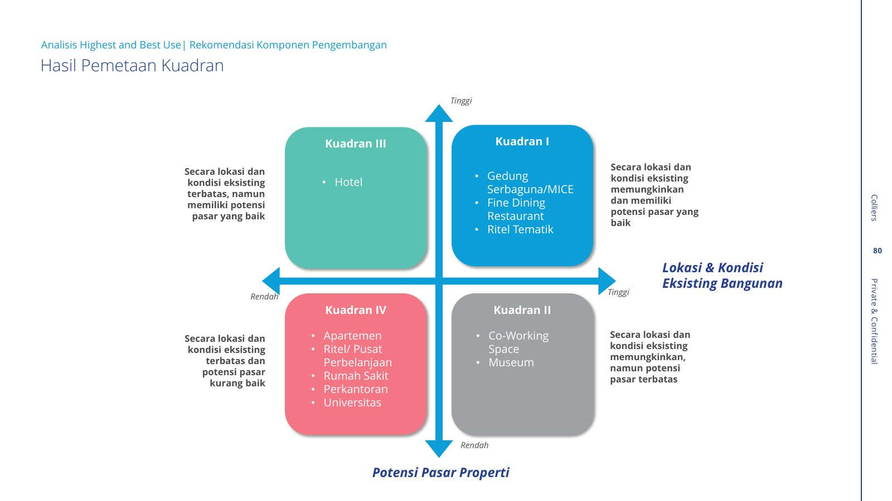
<!-- END COMPLETE PAGE RENDER: SLIDE 80 -->

```mermaid
quadrantChart
    title Matriks Evaluasi Highest and Best Use (HBU) Gedung A.A. Maramis
    x-axis Potensi Pasar Rendah --> Potensi Pasar Tinggi
    y-axis Fisik & Lokasi Terbatas --> Fisik & Lokasi Memungkinkan
    quadrant-1 Kuadran I (Prioritas Pengembangan)
    quadrant-2 Kuadran II (Komplementer / Kultural)
    quadrant-3 Kuadran IV (Tidak Sesuai Karakter Cagar Budaya)
    quadrant-4 Kuadran III (Kendala Fisik & Regulasi)
    "Gedung Serbaguna / MICE": [0.85, 0.88]
    "Fine Dining Restaurant": [0.90, 0.88]
    "Ritel Tematik": [0.85, 0.84]
    "Co-Working Space": [0.35, 0.96]
    "Museum": [0.35, 0.86]
    "Hotel": [0.75, 0.35]
    "Apartemen": [0.70, 0.20]
    "Pusat Perbelanjaan": [0.60, 0.35]
    "Perkantoran": [0.40, 0.40]
    "Rumah Sakit": [0.45, 0.25]
    "Universitas": [0.40, 0.35]
```

| Kuadran | Kategori Evaluasi | Karakteristik Komponen | Komponen Properti | Rekomendasi Tindak Lanjut |
| :---: | :--- | :--- | :--- | :--- |
| **Kuadran I** | **Fisik/Lokasi Tinggi, Pasar Tinggi** | Secara lokasi dan kondisi eksisting memungkinkan dan memiliki potensi pasar yang kuat. | • Gedung Serbaguna / MICE • Fine Dining Restaurant • Ritel Tematik Heritage | **Direkomendasikan sebagai Program Utama Komersial.** |
| **Kuadran II** | **Fisik/Lokasi Tinggi, Pasar Terbatas** | Secara lokasi dan fisik cagar budaya sangat sesuai, namun potensi pasar komersial terbatas. | • Co-Working Space • Museum / Galeri Seni | **Direkomendasikan sebagai Program Pendukung & Edukasi Budaya.** |
| **Kuadran III** | **Fisik/Lokasi Terbatas, Pasar Baik** | Potensi pasar tinggi di luar kawasan, namun fisik cagar budaya membatasi modifikasi ruang. | • Hotel • Apartemen • Ritel / Mall Konvensional | **Tidak Direkomendasikan.** |
| **Kuadran IV** | **Fisik/Lokasi Terbatas, Pasar Terbatas** | Lokasi dan kondisi eksisting terbatas serta potensi serapan pasar kurang baik. | • Perkantoran Konvensional • Rumah Sakit • Universitas | **Dieliminasi dari Opsi Pengembangan.** |

Kuadran III Kuadran I

Kuadran IV Kuadran II

Lokasi & Kondisi Eksisting Bangunan

Potensi Pasar Properti

Tinggi

Rendah

Rendah Tinggi

Secara lokasi dan

kondisi eksisting terbatas, namun memiliki potensi

pasar yang baik

- Gedung
  Serbaguna/MICE
- Fine Dining
  Restaurant
- Ritel Tematik

• Hotel

- Co-Working
  Space
- Museum

- Apartemen
- Ritel/ Pusat
  Perbelanjaan
- Rumah Sakit
- Perkantoran
- Universitas

Secara lokasi dan

kondisi eksisting

terbatas dan potensi pasar

kurang baik

Secara lokasi dan kondisi eksisting memungkinkan dan memiliki potensi pasar yang baik

Secara lokasi dan kondisi eksisting memungkinkan, namun potensi pasar terbatas

---

#### Slide 81: Analisis Highest and Best Use – Rekomendasi Komponen Pengembangan Rekomendasi Pengembangan

<!-- BEGIN COMPLETE PAGE RENDER: SLIDE 81 -->
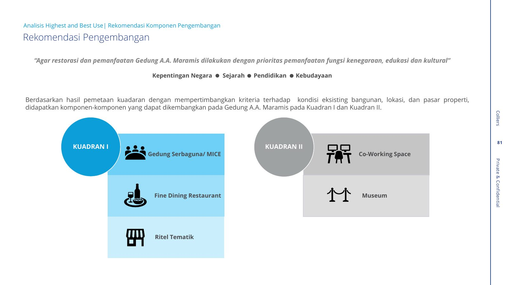
<!-- END COMPLETE PAGE RENDER: SLIDE 81 -->

“Agar restorasi dan pemanfaatan Gedung A.A. Maramis dilakukan dengan prioritas pemanfaatan fungsi kenegaraan, edukasi dan kultural”

Kepentingan Negara       Sejarah      Pendidikan      Kebudayaan

Berdasarkan hasil pemetaan kuadaran dengan mempertimbangkan kriteria terhadap  kondisi eksisting bangunan, lokasi, dan pasar properti, didapatkan komponen-komponen yang dapat dikembangkan pada Gedung A.A. Maramis pada Kuadran I dan Kuadran II.

Gedung Serbaguna/ MICE

Fine Dining Restaurant

Ritel Tematik

KUADRAN I

Co-Working Space

Museum

KUADRAN II

---

## Bab 06: Analisis Kompetitor & Positioning

> [!NOTE]
> Bab ini menyajikan riset komparatif dan analisis kompetitor komprehensif terhadap 5 fungsi terpilih: MICE, Restoran Fine Dining, Ritel Tematik, Co-Working Space, dan Museum/Galeri Seni.

#### Slide 82: 06 Analisis Kompetitor &  Positioning

<!-- BEGIN COMPLETE PAGE RENDER: SLIDE 82 -->
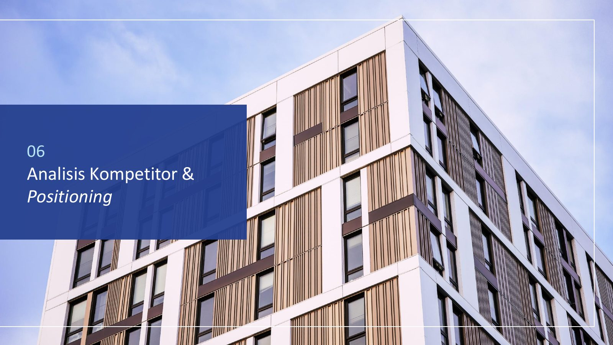
<!-- END COMPLETE PAGE RENDER: SLIDE 82 -->

---

### 6.1 Analisis Gedung Serbaguna / MICE

#### Slide 83: Gedung Serbaguna/ MICE

<!-- BEGIN COMPLETE PAGE RENDER: SLIDE 83 -->

<!-- END COMPLETE PAGE RENDER: SLIDE 83 -->

6.1

---

#### Slide 84: Analisis MICE – Kriteria Seleksi – Analisis fasilitas MICE dilakukan pada area Jakarta Pusat dan Jakarta Selatan

<!-- BEGIN COMPLETE PAGE RENDER: SLIDE 84 -->
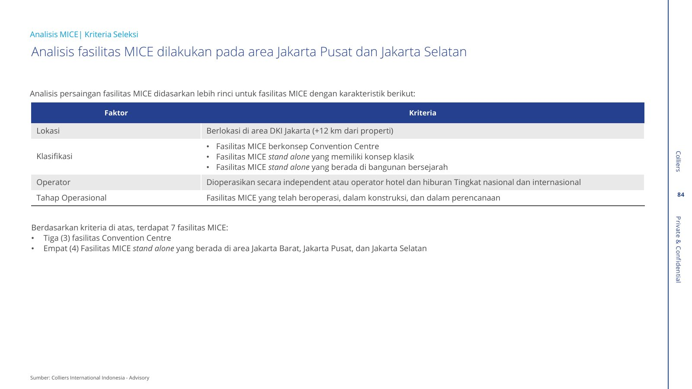
<!-- END COMPLETE PAGE RENDER: SLIDE 84 -->

| Faktor | Kriteria |
| :--- | :--- |
| Lokasi | Berlokasidi area DKI Jakarta (+12 km dariproperti) |
| Klasifikasi | • FasilitasMICEberkonsepConventionCentre • FasilitasMICEstand aloneyangmemilikikonsepklasik • FasilitasMICEstand aloneyangberadadibangunan bersejarah |
| Operator | DioperasikansecaraindependentatauoperatorhoteldanhiburanTingkatnasionaldaninternasional |
| TahapOperasional | FasilitasMICEyangtelahberoperasi,dalamkonstruksi,dandalamperencanaan |

> **Sumber: Colliers International Indonesia - Advisory**

Faktor Kriteria

Lokasi Berlokasi di area DKI Jakarta (+12 km dari properti)

Klasifikasi

- 
  Fasilitas MICE berkonsep Convention Centre
- 
  Fasilitas MICE stand alone yang memiliki konsep klasik
- 
  Fasilitas MICE stand alone yang berada di bangunan bersejarah

Operator Dioperasikan secara independent atau operator hotel dan hiburan Tingkat nasional dan internasional

Tahap Operasional Fasilitas MICE yang telah beroperasi, dalam konstruksi, dan dalam perencanaan

Analisis persaingan fasilitas MICE didasarkan lebih rinci untuk fasilitas MICE dengan karakteristik berikut:

  Berdasarkan kriteria di atas, terdapat 7 fasilitas MICE:
- 
  Tiga (3) fasilitas Convention Centre
- 
  Empat (4) Fasilitas MICE stand alone yang berada di area Jakarta Barat, Jakarta Pusat, dan Jakarta Selatan

---

#### Slide 85: Analisis MICE – Peta Kompetitor Terdapat 7 fasilitas MICE yang akan di analisis: 3 convention center, 4 stand-alone/ boutique multifunction  hall

<!-- BEGIN COMPLETE PAGE RENDER: SLIDE 85 -->
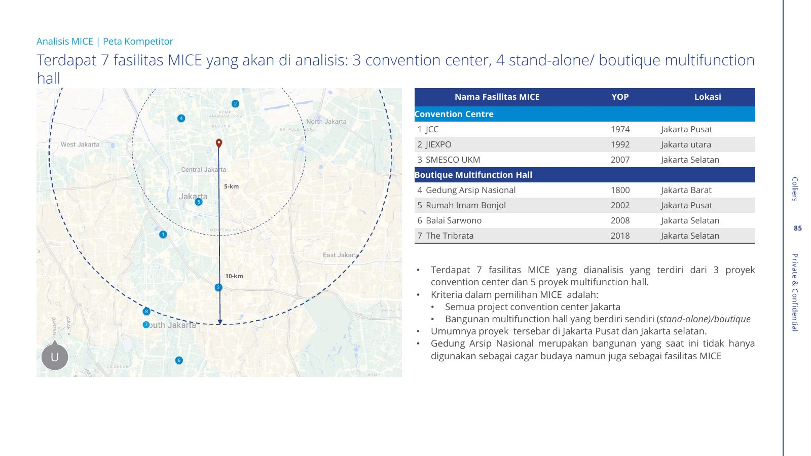
<!-- END COMPLETE PAGE RENDER: SLIDE 85 -->

| NamaFasilitasMICE | Kolom 2 | YOP | Lokasi |
| :--- | :--- | :--- | :--- |
| Convention Centre |  |  |  |
| 1 | JCC | 1974 | Jakarta Pusat |
| 2 | JIEXPO | 1992 | Jakarta utara |
| 3 | SMESCOUKM | 2007 | Jakarta Selatan |
| BoutiqueMultifunction Hall |  |  |  |
| 4 | GedungArsipNasional | 1800 | Jakarta Barat |
| 5 | RumahImam Bonjol | 2002 | Jakarta Pusat |
| 6 | BalaiSarwono | 2008 | Jakarta Selatan |
| 7 | The Tribrata | 2018 | Jakarta Selatan |

U

5-km

10-km

U

- 
  Terdapat 7 fasilitas MICE yang dianalisis yang terdiri dari 3 proyek
  convention center dan 5 proyek multifunction hall.
- 
  Kriteria dalam pemilihan MICE  adalah:
- 
  Semua project convention center Jakarta
- 
  Bangunan multifunction hall yang berdiri sendiri (stand-alone)/boutique
- 
  Umumnya proyek  tersebar di Jakarta Pusat dan Jakarta selatan.
- 
  Gedung Arsip Nasional merupakan bangunan yang saat ini tidak hanya
  digunakan sebagai cagar budaya namun juga sebagai fasilitas MICE

Nama Fasilitas MICE YOP Lokasi

Convention Centre

3 SMESCO UKM 2007 Jakarta Selatan

Boutique Multifunction Hall

4 Gedung Arsip Nasional 1800 Jakarta Barat

5 Rumah Imam Bonjol 2002 Jakarta Pusat

6 Balai Sarwono 2008 Jakarta Selatan

7

---

#### Slide 86: Analisis MICE – Informasi Umum – Fasilitas MICE pesaing umumnya memiliki luasan NLA 3.153 m2 hingga 50.000 m2 dan sudah beroperasi  selama 5 – 49 tahun

<!-- BEGIN COMPLETE PAGE RENDER: SLIDE 86 -->
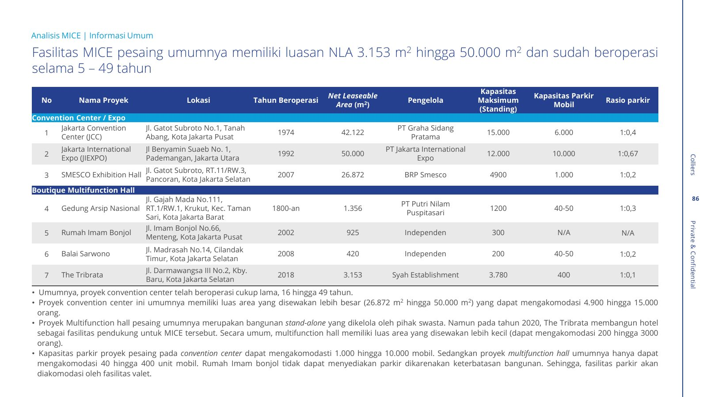
<!-- END COMPLETE PAGE RENDER: SLIDE 86 -->

| No | Nama Proyek | Lokasi | TahunBeroperasi | Net Leaseable Area(m2) | Pengelola | Kapasitas Maksimum (Standing) | KapasitasParkir Mobil | Rasioparkir |
| :--- | :--- | :--- | :--- | :--- | :--- | :--- | :--- | :--- |
| Convention Center / Expo |  |  |  |  |  |  |  |  |
| 1 | Jakarta Convention Center (JCC) | Jl. GatotSubrotoNo.1, Tanah Abang, Kota Jakarta Pusat | 1974 | 42.122 | PT GrahaSidang Pratama | 15.000 | 6.000 | 1:0,4 |
| 2 | Jakarta International Expo (JIEXPO) | Jl Benyamin Suaeb No. 1, Pademangan, JakartaUtara | 1992 | 50.000 | PT Jakarta International Expo | 12.000 | 10.000 | 1:0,67 |
| 3 | SMESCO Exhibition Hall | Jl. GatotSubroto, RT.11/RW.3, Pancoran, Kota Jakarta Selatan | 2007 | 26.872 | BRP Smesco | 4900 | 1.000 | 1:0,2 |
| BoutiqueMultifunction Hall |  |  |  |  |  |  |  |  |
| 4 | GedungArsipNasional | Jl. Gajah Mada No.111, RT.1/RW.1, Krukut, Kec. Taman Sari, Kota Jakarta Barat | 1800-an | 1.356 | PT PutriNilam Puspitasari | 1200 | 40-50 | 1:0,3 |
| 5 | RumahImamBonjol | Jl. Imam BonjolNo.66, Menteng, Kota Jakarta Pusat | 2002 | 925 | Independen | 300 | N/A | N/A |
| 6 | BalaiSarwono | Jl. Madrasah No.14,Cilandak Timur, Kota Jakarta Selatan | 2008 | 420 | Independen | 200 | 40-50 | 1:0,2 |
| 7 | TheTribrata | Jl. DarmawangsaIII No.2,Kby. Baru, Kota Jakarta Selatan | 2018 | 3.153 | SyahEstablishment | 3.780 | 400 | 1:0,1 |

- Umumnya, proyek convention center telah beroperasi cukup lama, 16 hingga 49 tahun.
- Proyek convention center ini umumnya memiliki luas area yang disewakan lebih besar (26.872 m2 hingga 50.000 m2) yang dapat mengakomodasi 4.900 hingga 15.000
- **orang.** 
- Proyek Multifunction hall pesaing umumnya merupakan bangunan stand-alone yang dikelola oleh pihak swasta. Namun pada tahun 2020, The Tribrata membangun hotel
  sebagai fasilitas pendukung untuk MICE tersebut. Secara umum, multifunction hall memiliki luas area yang disewakan lebih kecil (dapat mengakomodasi 200 hingga 3000
  orang).
- Kapasitas parkir proyek pesaing pada convention center dapat mengakomodasti 1.000 hingga 10.000 mobil. Sedangkan proyek multifunction hall umumnya hanya dapat
  mengakomodasi 40 hingga 400 unit mobil. Rumah Imam bonjol tidak dapat menyediakan parkir dikarenakan keterbatasan bangunan. Sehingga, fasilitas parkir akan
  diakomodasi oleh fasilitas valet.

No Nama Proyek Lokasi Tahun Beroperasi Net Leaseable

Area (m2) Pengelola

Kapasitas Maksimum

(Standing)

Kapasitas Parkir

Mobil Rasio parkir

Convention Center / Expo

Jl. Gatot Subroto No.1, Tanah Abang, Kota Jakarta Pusat 1974 42.122 PT Graha Sidang

Boutique Multifunction Hall

4 Gedung Arsip Nasional

  1800-an
- **1.** 356
  PT Putri Nilam

  7
  The Tribrata
- **Jl.** Darmawangsa III No.2, Kby.
  Baru, Kota Jakarta Selatan
  2018
- **3.** 153
  Syah Establishment
- **3.** 780
  400
  1:0,1

---

#### Slide 87: Analisis MICE – Fasilitas Gambaran Convention Centre

<!-- BEGIN COMPLETE PAGE RENDER: SLIDE 87 -->
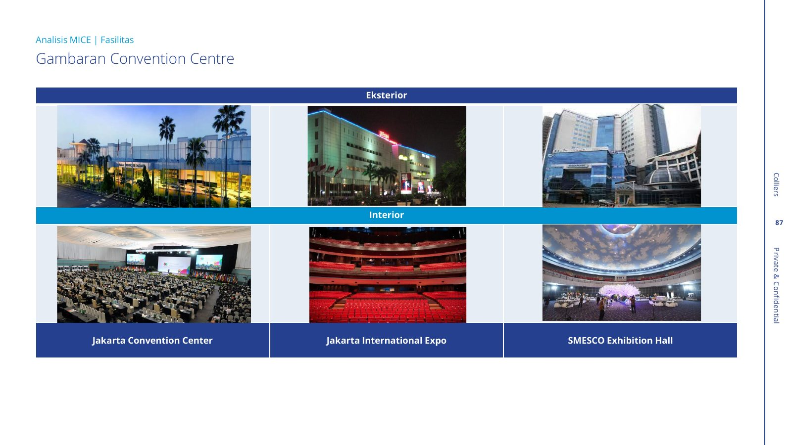
<!-- END COMPLETE PAGE RENDER: SLIDE 87 -->

| Eksterior | Kolom 2 | Kolom 3 |
| :--- | :--- | :--- |
| Interior |  |  |
| Jakarta Convention Center | Jakarta International Expo | SMESCO Exhibition Hall |

Eksterior

Interior

---

#### Slide 88: Analisis MICE – Fasilitas Gambaran Boutique Multifunction Hall

<!-- BEGIN COMPLETE PAGE RENDER: SLIDE 88 -->
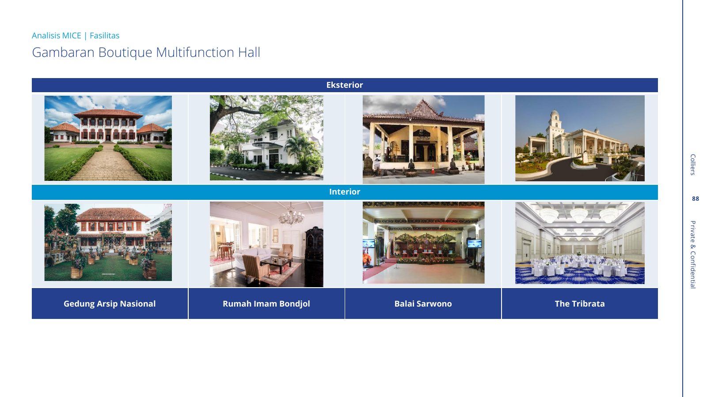
<!-- END COMPLETE PAGE RENDER: SLIDE 88 -->

| Eksterior | Kolom 2 | Kolom 3 | Kolom 4 |
| :--- | :--- | :--- | :--- |
| Interior |  |  |  |
| Gedung ArsipNasional | RumahImam Bondjol | BalaiSarwono | The Tribrata |

Eksterior

Interior

Gedung Arsip Nasional Rumah Imam Bondjol Balai Sarwono The Tribrata

---

#### Slide 89: Analisis MICE – Konfigurasi Ruangan Convention Center memiliki luas ruangan 77 hingga 8.295 m2, sedangkan Multifunction Hall 26 hingga  1.536 m2

<!-- BEGIN COMPLETE PAGE RENDER: SLIDE 89 -->
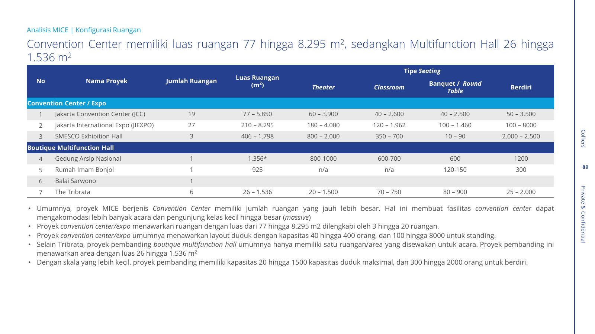
<!-- END COMPLETE PAGE RENDER: SLIDE 89 -->

| No | Nama Proyek | JumlahRuangan | Luas Ruangan (m2) | TipeSeating | Kolom 6 | Kolom 7 | Kolom 8 |
| :--- | :--- | :--- | :--- | :--- | :--- | :--- | :--- |
|  |  |  |  | Theater | Classroom | Banquet / Round Table | Berdiri |
| Convention Center / Expo |  |  |  |  |  |  |  |
| 1 | Jakarta Convention Center (JCC) | 19 | 77 –5.850 | 60 –3.900 | 40 –2.600 | 40 –2.500 | 50 –3.500 |
| 2 | Jakarta International Expo (JIEXPO) | 27 | 210 –8.295 | 180 –4.000 | 120 –1.962 | 100 –1.460 | 100 –8000 |
| 3 | SMESCO Exhibition Hall | 3 | 406 –1.798 | 800 –2.000 | 350 –700 | 10 –90 | 2.000–2.500 |
| BoutiqueMultifunction Hall |  |  |  |  |  |  |  |
| 4 | GedungArsipNasional | 1 | 1.356* | 800-1000 | 600-700 | 600 | 1200 |
| 5 | RumahImamBonjol | 1 | 925 | n/a | n/a | 120-150 | 300 |
| 6 | BalaiSarwono | 1 |  |  |  |  |  |
| 7 | TheTribrata | 6 | 26 –1.536 | 20 –1.500 | 70 –750 | 80 –900 | 25 –2.000 |

- 
  Umumnya, proyek MICE berjenis Convention Center memiliki jumlah ruangan yang jauh lebih besar. Hal ini membuat fasilitas convention center dapat
  mengakomodasi lebih banyak acara dan pengunjung kelas kecil hingga besar (massive)
- 
  Proyek convention center/expo menawarkan ruangan dengan luas dari 77 hingga 8.295 m2 dilengkapi oleh 3 hingga 20 ruangan.
- 
  Proyek convention center/expo umumnya menawarkan layout duduk dengan kapasitas 40 hingga 400 orang, dan 100 hingga 8000 untuk standing.
- 
  Selain Tribrata, proyek pembanding boutique multifunction hall umumnya hanya memiliki satu ruangan/area yang disewakan untuk acara. Proyek pembanding ini
  menawarkan area dengan luas 26 hingga 1.536 m2

- 
  Dengan skala yang lebih kecil, proyek pembanding memiliki kapasitas 20 hingga 1500 kapasitas duduk maksimal, dan 300 hingga 2000 orang untuk berdiri.

(m2)

Tipe Seating

Theater Classroom Banquet / Round

Table Berdiri

Convention Center / Expo

Boutique Multifunction Hall

  4
  Gedung Arsip Nasional
  1
- **1.** 356*
  800-1000
  600-700
  600
  1200

5 Rumah Imam Bonjol 1 925 n/a n/a 120-150 300

6 Balai Sarwono 1

---

#### Slide 90: Analisis MICE – Segmentasi Pasar Pernikahan merupakan acara yang umum diselenggarakan di hampir semua proyek pesaing

<!-- BEGIN COMPLETE PAGE RENDER: SLIDE 90 -->
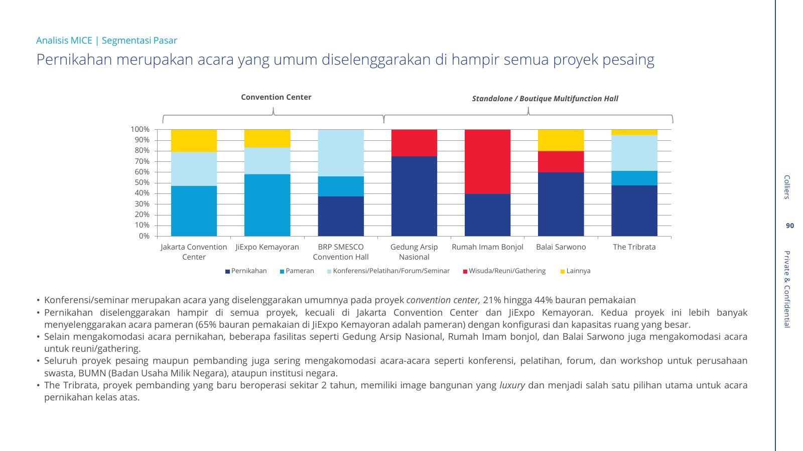
<!-- END COMPLETE PAGE RENDER: SLIDE 90 -->

- Konferensi/seminar merupakan acara yang diselenggarakan umumnya pada proyek convention center, 21% hingga 44% bauran pemakaian
- Pernikahan diselenggarakan hampir di semua proyek, kecuali di Jakarta Convention Center dan JiExpo Kemayoran. Kedua proyek ini lebih banyak
  menyelenggarakan acara pameran (65% bauran pemakaian di JiExpo Kemayoran adalah pameran) dengan konfigurasi dan kapasitas ruang yang besar.
- Selain mengakomodasi acara pernikahan, beberapa fasilitas seperti Gedung Arsip Nasional, Rumah Imam bonjol, dan Balai Sarwono juga mengakomodasi acara
  untuk reuni/gathering.
- Seluruh proyek pesaing maupun pembanding juga sering mengakomodasi acara-acara seperti konferensi, pelatihan, forum, dan workshop untuk perusahaan
  swasta, BUMN (Badan Usaha Milik Negara), ataupun institusi negara.
- The Tribrata, proyek pembanding yang baru beroperasi sekitar 2 tahun, memiliki image bangunan yang luxury dan menjadi salah satu pilihan utama untuk acara
  pernikahan kelas atas.

Convention Center Standalone / Boutique Multifunction Hall

0% 10% 20% 30% 40% 50% 60% 70% 80% 90% 100%

Jakarta Convention

Center

JiExpo Kemayoran BRP SMESCO Convention Hall

Gedung Arsip

Nasional

Rumah Imam Bonjol Balai Sarwono The Tribrata

Pernikahan Pameran Konferensi/Pelatihan/Forum/Seminar Wisuda/Reuni/Gathering Lainnya

---

#### Slide 91: Analisis MICE – Fasilitas Umumnya fasilitas yang ditawarkan boutique multifunction hall dan convention center/expo relative sama

<!-- BEGIN COMPLETE PAGE RENDER: SLIDE 91 -->
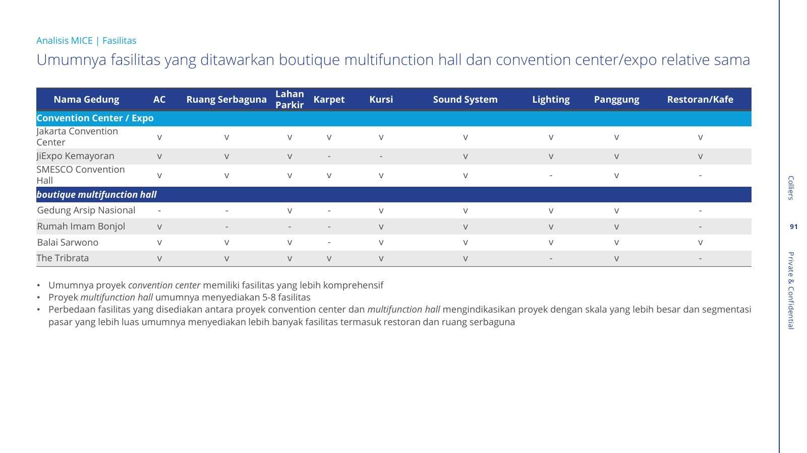
<!-- END COMPLETE PAGE RENDER: SLIDE 91 -->

| Nama Gedung | AC | Ruang Serbaguna | Lahan Parkir | Karpet | Kursi | Sound System | Lighting | Panggung | Restoran/Kafe |
| :--- | :--- | :--- | :--- | :--- | :--- | :--- | :--- | :--- | :--- |
| ConventionCenter / Expo |  |  |  |  |  |  |  |  |  |
| Jakarta Convention Center | v | v | v | v | v | v | v | v | v |
| JiExpoKemayoran | v | v | v | - | - | v | v | v | v |
| SMESCO Convention Hall | v | v | v | v | v | v | - | v | - |
| boutique multifunction hall |  |  |  |  |  |  |  |  |  |
| GedungArsipNasional | - | - | v | - | v | v | v | v | - |
| RumahImamBonjol | v | - | - | - | v | v | v | v | - |
| BalaiSarwono | v | v | v | - | v | v | v | v | v |
| The Tribrata | v | v | v | v | v | v | - | v | - |

- 
  Umumnya proyek convention center memiliki fasilitas yang lebih komprehensif
- 
  Proyek multifunction hall umumnya menyediakan 5-8 fasilitas
- 
  Perbedaan fasilitas yang disediakan antara proyek convention center dan multifunction hall mengindikasikan proyek dengan skala yang lebih besar dan segmentasi
  pasar yang lebih luas umumnya menyediakan lebih banyak fasilitas termasuk restoran dan ruang serbaguna

boutique multifunction hall

  Gedung Arsip Nasional
- 
- 
  v
- 
  v
  v
  v
  v
- 

  Rumah Imam Bonjol
  v
- 
- 
- 
  v
  v
  v
  v
- 

  Balai Sarwono
  v
  v
  v
- 
  v
  v
  v
  v
  v

---

#### Slide 92: Analisis MICE – Kinerja Harga Fasilitas MICE menerapkan dua tipe sewa: sewa hanya ruang; dan sewa ruang termasuk paket makanan

<!-- BEGIN COMPLETE PAGE RENDER: SLIDE 92 -->
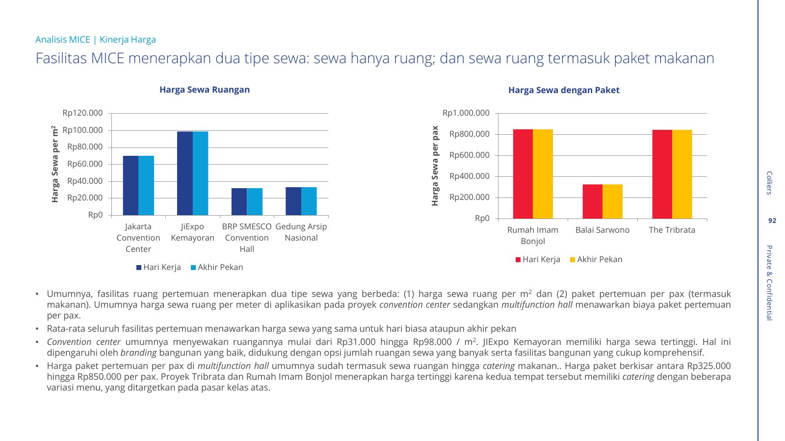
<!-- END COMPLETE PAGE RENDER: SLIDE 92 -->

- 
  Umumnya, fasilitas ruang pertemuan menerapkan dua tipe sewa yang berbeda: (1) harga sewa ruang per m2 dan (2) paket pertemuan per pax (termasuk
  makanan). Umumnya harga sewa ruang per meter di aplikasikan pada proyek convention center sedangkan multifunction hall menawarkan biaya paket pertemuan
  per pax.
- 
  Rata-rata seluruh fasilitas pertemuan menawarkan harga sewa yang sama untuk hari biasa ataupun akhir pekan
- 
  Convention center umumnya menyewakan ruangannya mulai dari Rp31.000 hingga Rp98.000 / m2. JIExpo Kemayoran memiliki harga sewa tertinggi. Hal ini
  dipengaruhi oleh branding bangunan yang baik, didukung dengan opsi jumlah ruangan sewa yang banyak serta fasilitas bangunan yang cukup komprehensif.
- 
  Harga paket pertemuan per pax di multifunction hall umumnya sudah termasuk sewa ruangan hingga catering makanan.. Harga paket berkisar antara Rp325.000
  hingga Rp850.000 per pax. Proyek Tribrata dan Rumah Imam Bonjol menerapkan harga tertinggi karena kedua tempat tersebut memiliki catering dengan beberapa
  variasi menu, yang ditargetkan pada pasar kelas atas.

Harga Sewa Ruangan Harga Sewa dengan Paket

Rp0

Rp20.000

Rp40.000

Rp60.000

Rp80.000

Rp100.000

Rp120.000

Jakarta Convention

Center

JiExpo Kemayoran

BRP SMESCO

Convention

Hall

Gedung Arsip

Nasional

Harga Sewa per m2

Hari Kerja Akhir Pekan

Rp0

Rp200.000

Rp400.000

Rp600.000

Rp800.000

Rp1.000.000

Rumah Imam

Bonjol

Balai Sarwono The Tribrata

Harga Sewa per pax

Hari Kerja Akhir Pekan

---

#### Slide 93: Analisis MICE – Potensi Pasar Potensi Pasar MICE – Bauran Pasar

<!-- BEGIN COMPLETE PAGE RENDER: SLIDE 93 -->
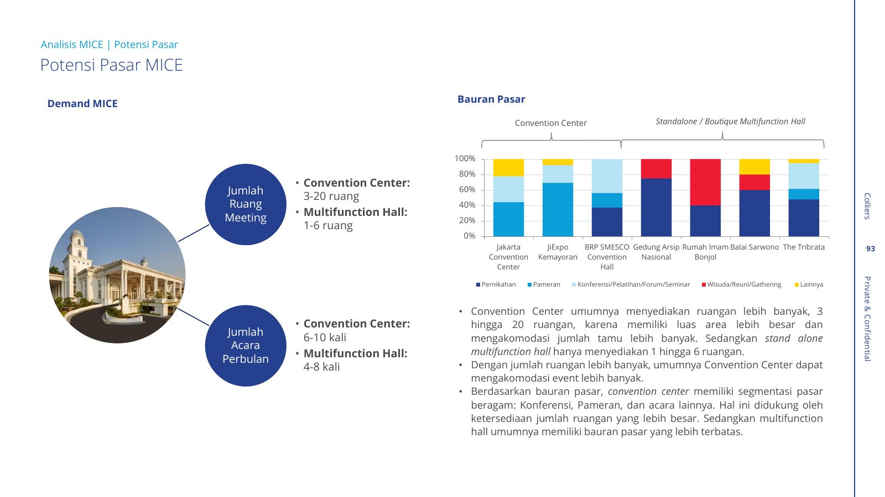
<!-- END COMPLETE PAGE RENDER: SLIDE 93 -->

Demand MICE

- 
  Convention Center umumnya menyediakan ruangan lebih banyak, 3
  hingga 20 ruangan, karena memiliki luas area lebih besar dan
  mengakomodasi jumlah tamu lebih banyak. Sedangkan stand alone
  multifunction hall hanya menyediakan 1 hingga 6 ruangan.
- 
  Dengan jumlah ruangan lebih banyak, umumnya Convention Center dapat
  mengakomodasi event lebih banyak.
- 
  Berdasarkan bauran pasar, convention center memiliki segmentasi pasar
  beragam: Konferensi, Pameran, dan acara lainnya. Hal ini didukung oleh
  ketersediaan jumlah ruangan yang lebih besar. Sedangkan multifunction
  hall umumnya memiliki bauran pasar yang lebih terbatas.

Jumlah

Ruang Meeting

- Convention Center:
  3-20 ruang
- Multifunction Hall:
  1-6 ruang

Jumlah

Acara Perbulan

- Convention Center:
  6-10 kali
- Multifunction Hall:
  4-8 kali

0%

20%

40%

60%

80%

100%

Jakarta Convention

Center

JiExpo Kemayoran

BRP SMESCO

Convention

Hall

Gedung Arsip

Nasional

Rumah Imam

Bonjol

Balai Sarwono The Tribrata

Pernikahan Pameran Konferensi/Pelatihan/Forum/Seminar Wisuda/Reuni/Gathering Lainnya

Convention Center Standalone / Boutique Multifunction Hall

---

#### Slide 94: Analisis MICE – Penilaian dan Rekomendasi Terdapat enam kriteria skoring untuk menentukan tarif sewa MICE jika dikembangkan di Properti

<!-- BEGIN COMPLETE PAGE RENDER: SLIDE 94 -->
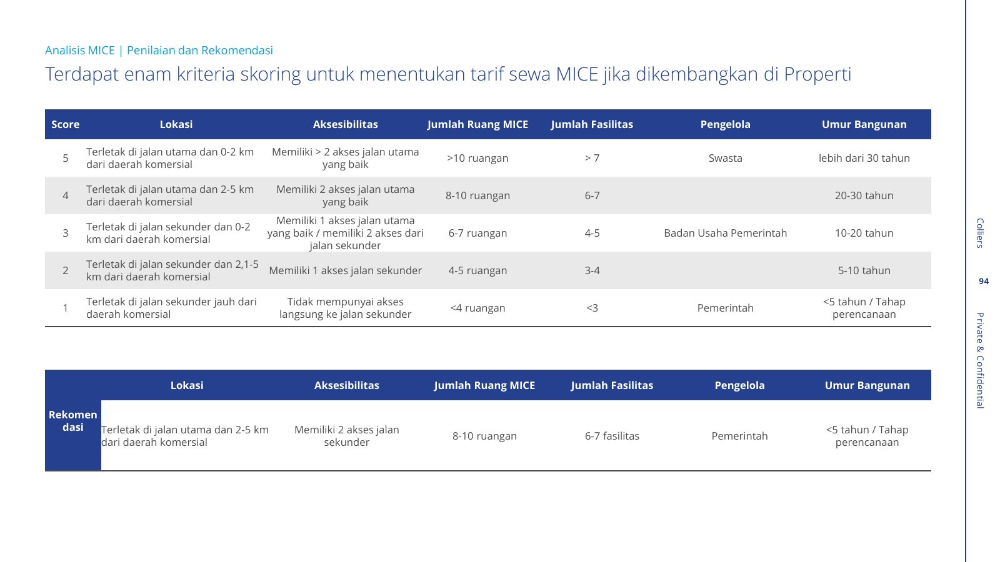
<!-- END COMPLETE PAGE RENDER: SLIDE 94 -->

| Score | Lokasi | Aksesibilitas | JumlahRuangMICE | JumlahFasilitas | Pengelola | UmurBangunan |
| :--- | :--- | :--- | :--- | :--- | :--- | :--- |
| 5 | Terletak di jalan utama dan 0-2 km dari daerah komersial | Memiliki > 2 akses jalan utama yang baik | >10 ruangan | > 7 | Swasta | lebih dari 30 tahun |
| 4 | Terletak di jalan utama dan 2-5 km dari daerah komersial | Memiliki 2 akses jalan utama yang baik | 8-10 ruangan | 6-7 |  | 20-30 tahun |
| 3 | Terletakdi jalansekunderdan 0-2 km daridaerahkomersial | Memiliki 1 akses jalan utama yang baik / memiliki2 akses dari jalan sekunder | 6-7 ruangan | 4-5 | BadanUsaha Pemerintah | 10-20 tahun |
| 2 | Terletakdi jalansekunderdan2,1-5 km daridaerahkomersial | Memiliki 1 akses jalan sekunder | 4-5 ruangan | 3-4 |  | 5-10 tahun |
| 1 | Terletakdi jalansekunderjauhdari daerahkomersial | Tidakmempunyaiakses langsungkejalansekunder | <4 ruangan | <3 | Pemerintah | <5 tahun/ Tahap perencanaan |

| Rekomen dasi | Lokasi | Aksesibilitas | JumlahRuangMICE | JumlahFasilitas | Pengelola | UmurBangunan |
| :--- | :--- | :--- | :--- | :--- | :--- | :--- |
|  | Terletak di jalan utama dan 2-5 km dari daerah komersial | Memiliki 2 akses jalan sekunder | 8-10 ruangan | 6-7 fasilitas | Pemerintah | <5 tahun/ Tahap perencanaan |

Score Lokasi Aksesibilitas Jumlah Ruang MICE Jumlah Fasilitas Pengelola Umur Bangunan

jalan sekunder

Tidak mempunyai akses langsung ke jalan sekunder <4 ruangan <3 Pemerintah <5 tahun / Tahap

perencanaan

Rekomen

dasi

Lokasi Aksesibilitas Jumlah Ruang MICE Jumlah Fasilitas Pengelola Umur Bangunan

Memiliki 2 akses jalan

perencanaan

---

#### Slide 95: Analisis MICE – Penilaian dan Rekomendasi Dengan skor, 3,0 dan 3,8, MICE di properti direkomendasikan untuk disewakan dengan harga sewa ruang  Rp47.693 – Rp65.817 per m2

<!-- BEGIN COMPLETE PAGE RENDER: SLIDE 95 -->
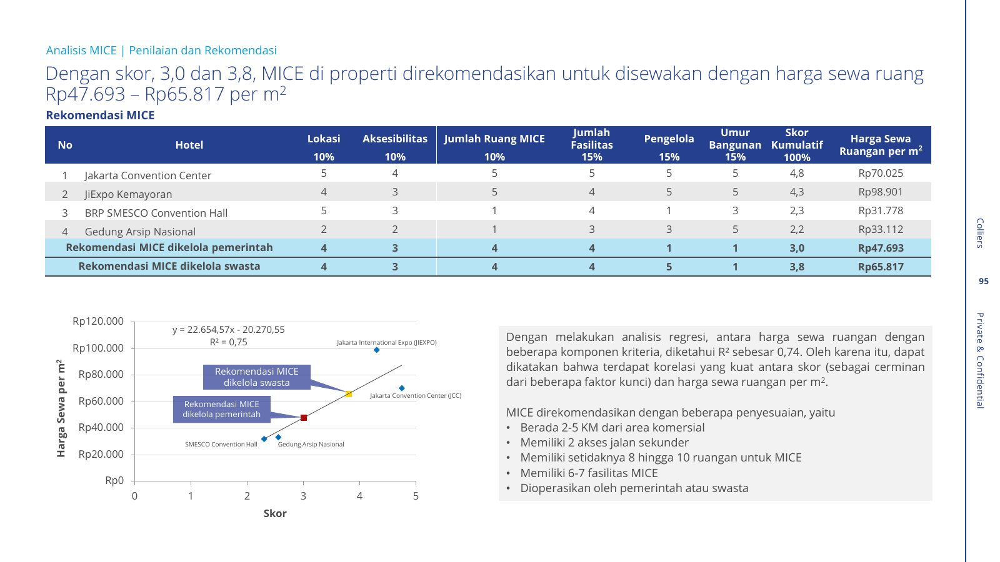
<!-- END COMPLETE PAGE RENDER: SLIDE 95 -->

| No | Hotel | Lokasi | Aksesibilitas | JumlahRuangMICE | Jumlah Fasilitas | Pengelola | Umur Bangunan | Skor Kumulatif | Harga Sewa Ruanganper m2 |
| :--- | :--- | :--- | :--- | :--- | :--- | :--- | :--- | :--- | :--- |
|  |  | 10% | 10% | 10% | 15% | 15% | 15% | 100% |  |
| 1 | Jakarta Convention Center | 5 | 4 | 5 | 5 | 5 | 5 | 4,8 | Rp70.025 |
| 2 | JiExpoKemayoran | 4 | 3 | 5 | 4 | 5 | 5 | 4,3 | Rp98.901 |
| 3 | BRP SMESCO Convention Hall | 5 | 3 | 1 | 4 | 1 | 3 | 2,3 | Rp31.778 |
| 4 | GedungArsipNasional | 2 | 2 | 1 | 3 | 3 | 5 | 2,2 | Rp33.112 |
| Rekomendasi MICEdikelolapemerintah |  | 4 | 3 | 4 | 4 | 1 | 1 | 3,0 | Rp47.693 |
| Rekomendasi MICE dikelolaswasta |  | 4 | 3 | 4 | 4 | 5 | 1 | 3,8 | Rp65.817 |

Rekomendasi MICE

y = 22.654,57x - 20.270,55

R² = 0,75

Rp0

Rp20.000

Rp40.000

Rp60.000

Rp80.000

Rp100.000

Rp120.000

Harga Sewa per m2

Skor

Rekomendasi MICE dikelola pemerintah

Rekomendasi MICE

dikelola swasta

Gedung Arsip Nasional SMESCO Convention Hall

Jakarta Convention Center (JCC)

Jakarta International Expo (JIEXPO) Dengan melakukan analisis regresi, antara harga sewa ruangan dengan beberapa komponen kriteria, diketahui R² sebesar 0,74. Oleh karena itu, dapat dikatakan bahwa terdapat korelasi yang kuat antara skor (sebagai cerminan dari beberapa faktor kunci) dan harga sewa ruangan per m2.

  MICE direkomendasikan dengan beberapa penyesuaian, yaitu
- 
  Berada 2-5 KM dari area komersial
- 
  Memiliki 2 akses jalan sekunder
- 
  Memiliki setidaknya 8 hingga 10 ruangan untuk MICE
- 
  Memiliki 6-7 fasilitas MICE
- 
  Dioperasikan oleh pemerintah atau swasta

4 Gedung Arsip Nasional 2 2 1 3 3 5 2,2 Rp33.112

---

### 6.2 Analisis Restoran Fine Dining & Heritage F&B

#### Slide 96: Fine-Dining Restaurant

<!-- BEGIN COMPLETE PAGE RENDER: SLIDE 96 -->

<!-- END COMPLETE PAGE RENDER: SLIDE 96 -->

6.2

---

#### Slide 97: Analisis Restoran – Kriteria Seleksi – Analisis restoran fine dining dilakukan pada area Jakarta Pusat dan Jakarta Selatan

<!-- BEGIN COMPLETE PAGE RENDER: SLIDE 97 -->
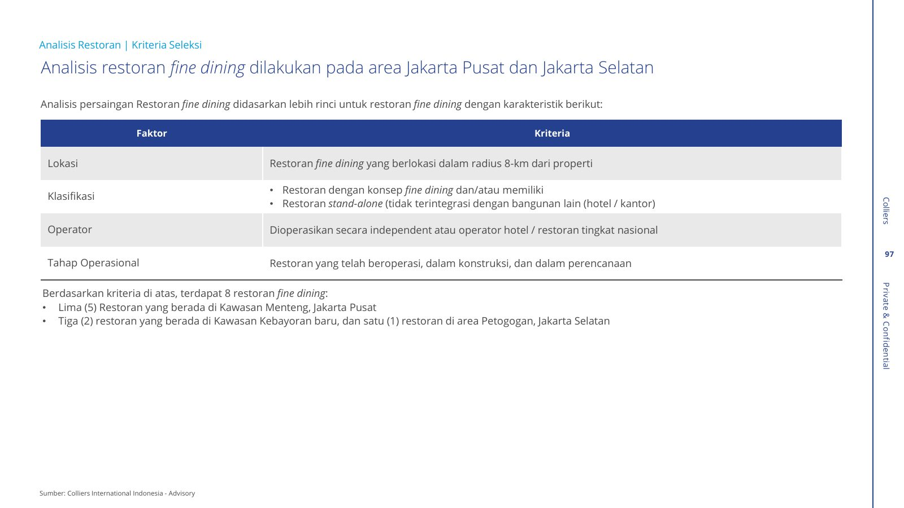
<!-- END COMPLETE PAGE RENDER: SLIDE 97 -->

| Faktor | Kriteria |
| :--- | :--- |
| Lokasi | Restoranfine diningyang berlokasidalamradius 8-km dariproperti |
| Klasifikasi | • Restorandengankonsepfinediningdan/ataumemiliki • Restoranstand-alone(tidakterintegrasidenganbangunan lain(hotel/kantor) |
| Operator | Dioperasikansecaraindependentatauoperatorhotel/restorantingkatnasional |
| TahapOperasional | Restoranyangtelahberoperasi,dalamkonstruksi,dandalamperencanaan |

> **Sumber: Colliers International Indonesia - Advisory**

Faktor Kriteria

Lokasi Restoran fine dining yang berlokasi dalam radius 8-km dari properti

  Klasifikasi
- 
  Restoran dengan konsep fine dining dan/atau memiliki
- 
  Restoran stand-alone (tidak terintegrasi dengan bangunan lain (hotel / kantor)

Operator Dioperasikan secara independent atau operator hotel / restoran tingkat nasional

Tahap Operasional Restoran yang telah beroperasi, dalam konstruksi, dan dalam perencanaan

Analisis persaingan Restoran fine dining didasarkan lebih rinci untuk restoran fine dining dengan karakteristik berikut:

  Berdasarkan kriteria di atas, terdapat 8 restoran fine dining:
- 
  Lima (5) Restoran yang berada di Kawasan Menteng, Jakarta Pusat
- 
  Tiga (2) restoran yang berada di Kawasan Kebayoran baru, dan satu (1) restoran di area Petogogan, Jakarta Selatan

---

#### Slide 98: Analisis Restoran – Peta Lokasi Terdapat delapan restoran fine-dining di Jakarta Selatan dan Jakarta Pusat

<!-- BEGIN COMPLETE PAGE RENDER: SLIDE 98 -->
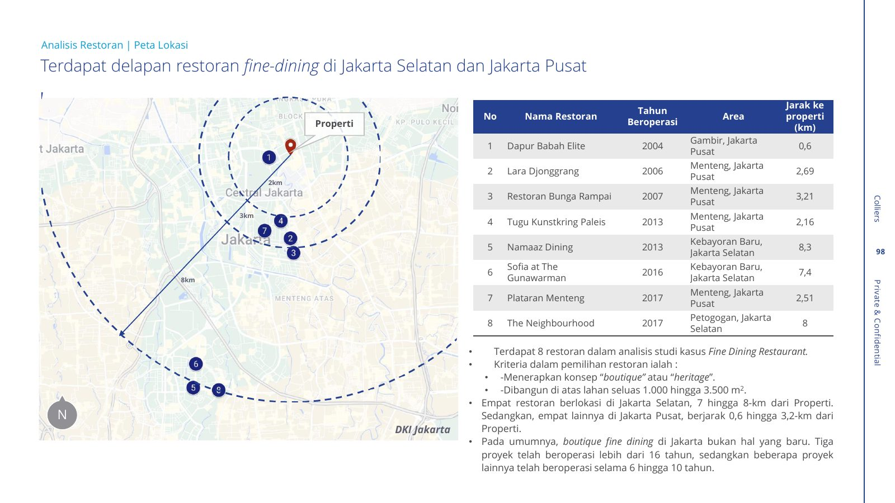
<!-- END COMPLETE PAGE RENDER: SLIDE 98 -->

| No | Nama Restoran | Tahun Beroperasi | Area | Jarakke properti (km) |
| :--- | :--- | :--- | :--- | :--- |
| 1 | DapurBabahElite | 2004 | Gambir, Jakarta Pusat | 0,6 |
| 2 | Lara Djonggrang | 2006 | Menteng, Jakarta Pusat | 2,69 |
| 3 | RestoranBungaRampai | 2007 | Menteng, Jakarta Pusat | 3,21 |
| 4 | TuguKunstkringPaleis | 2013 | Menteng, Jakarta Pusat | 2,16 |
| 5 | NamaazDining | 2013 | KebayoranBaru, Jakarta Selatan | 8,3 |
| 6 | Sofia at The Gunawarman | 2016 | KebayoranBaru, Jakarta Selatan | 7,4 |
| 7 | PlataranMenteng | 2017 | Menteng, Jakarta Pusat | 2,51 |
| 8 | The Neighbourhood | 2017 | Petogogan, Jakarta Selatan | 8 |

2km

3km

8km

N

DKI Jakarta

Properti

- 
  Terdapat 8 restoran dalam analisis studi kasus Fine Dining Restaurant.
- 
  Kriteria dalam pemilihan restoran ialah :
- 
- Menerapkan konsep “boutique” atau “heritage”.
- 
- Dibangun di atas lahan seluas 1.000 hingga 3.500 m2.
- 
  Empat restoran berlokasi di Jakarta Selatan, 7 hingga 8-km dari Properti.
  Sedangkan, empat lainnya di Jakarta Pusat, berjarak 0,6 hingga 3,2-km dari
- **Properti.** 
- 
  Pada umumnya, boutique fine dining di Jakarta bukan hal yang baru. Tiga
  proyek telah beroperasi lebih dari 16 tahun, sedangkan beberapa proyek
  lainnya telah beroperasi selama 6 hingga 10 tahun.

Jarak ke properti

(km)

1 Dapur Babah Elite 2004 Gambir, Jakarta Pusat 0,6

3 Restoran Bunga Rampai 2007 Menteng, Jakarta Pusat 3,21

4 Tugu Kunstkring Paleis 2013 Menteng, Jakarta Pusat 2,16

5 Namaaz Dining 2013 Kebayoran Baru, Jakarta Selatan 8,3

---

#### Slide 99: Analisis Restoran – Profil Proyek Dibangun pada area preservasi, Dapur Babah Elite menawarkan konsep peranakan dan kolonial dengan  tingkat okupansi 60%-90% pada jam sibuk.

<!-- BEGIN COMPLETE PAGE RENDER: SLIDE 99 -->
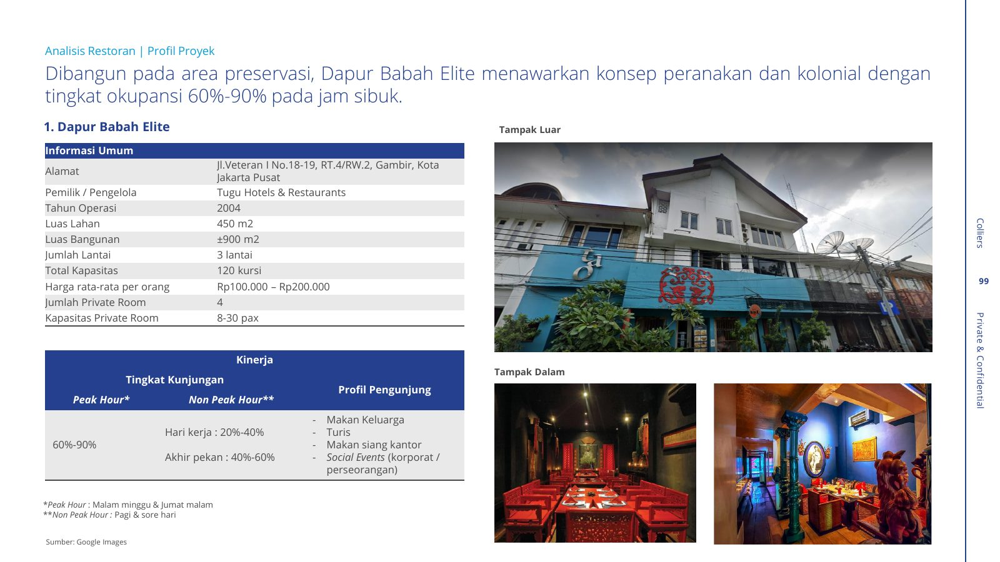
<!-- END COMPLETE PAGE RENDER: SLIDE 99 -->

| InformasiUmum | Kolom 2 |
| :--- | :--- |
| Alamat | Jl.VeteranI No.18-19, RT.4/RW.2, Gambir, Kota Jakarta Pusat |
| Pemilik/ Pengelola | TuguHotels & Restaurants |
| TahunOperasi | 2004 |
| Luas Lahan | 450 m2 |
| Luas Bangunan | ±900 m2 |
| JumlahLantai | 3 lantai |
| Total Kapasitas | 120 kursi |
| Hargarata-rata per orang | Rp100.000 –Rp200.000 |
| JumlahPrivate Room | 4 |
| KapasitasPrivate Room | 8-30 pax |

| Kinerja | Kolom 2 | Kolom 3 |
| :--- | :--- | :--- |
| Tingkat Kunjungan |  | ProfilPengunjung |
| Peak Hour* | Non Peak Hour** |  |
| 60%-90% | Hari kerja: 20%-40% Akhirpekan: 40%-60% | - MakanKeluarga - Turis - Makansiangkantor - Social Events(korporat/ perseorangan) |

1. Dapur Babah Elite

Informasi Umum

Alamat Jl.Veteran I No.18-19, RT.4/RW.2, Gambir, Kota Jakarta Pusat Pemilik / Pengelola Tugu Hotels & Restaurants

Tahun Operasi 2004

Luas Lahan 450 m2

Luas Bangunan ±900 m2

Jumlah Lantai 3 lantai

Total Kapasitas 120 kursi

Jumlah Private Room 4

Tampak Luar

Kinerja

Tingkat Kunjungan

Profil Pengunjung Peak Hour* Non Peak Hour**

Akhir pekan : 40%-60%

- 
  Makan Keluarga
- 
  Turis
- 
  Makan siang kantor
- 
  Social Events (korporat /
  perseorangan)

- Peak Hour : Malam minggu & Jumat malam
- Non Peak Hour : Pagi & sore hari

> **Sumber: Google Images**

Tampak Dalam

---

#### Slide 100: Analisis Restoran – Profil Proyek – Lara Djonggrang terinspirasi oleh budaya asli Indonesia, memiliki tingkat okupansi tinggi, 80%-100%

<!-- BEGIN COMPLETE PAGE RENDER: SLIDE 100 -->
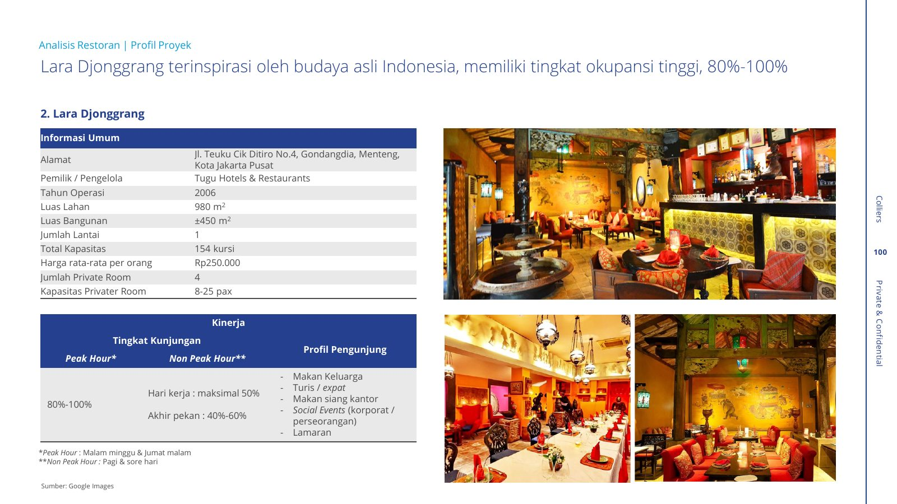
<!-- END COMPLETE PAGE RENDER: SLIDE 100 -->

| InformasiUmum | Kolom 2 |
| :--- | :--- |
| Alamat | Jl. TeukuCikDitiroNo.4, Gondangdia, Menteng, Kota Jakarta Pusat |
| Pemilik/ Pengelola | TuguHotels & Restaurants |
| TahunOperasi | 2006 |
| Luas Lahan | 980 m2 |
| Luas Bangunan | ±450 m2 |
| JumlahLantai | 1 |
| Total Kapasitas | 154 kursi |
| Hargarata-rata per orang | Rp250.000 |
| JumlahPrivate Room | 4 |
| KapasitasPrivaterRoom | 8-25 pax |

| Kinerja | Kolom 2 | Kolom 3 |
| :--- | :--- | :--- |
| Tingkat Kunjungan |  | ProfilPengunjung |
| Peak Hour* | Non Peak Hour** |  |
| 80%-100% | Hari kerja: maksimal50% Akhirpekan: 40%-60% | - MakanKeluarga - Turis/ expat - Makansiangkantor - Social Events(korporat/ perseorangan) - Lamaran |

2. Lara Djonggrang

Informasi Umum

Alamat Jl. Teuku Cik Ditiro No.4, Gondangdia, Menteng, Kota Jakarta Pusat Pemilik / Pengelola Tugu Hotels & Restaurants

Tahun Operasi 2006

Luas Lahan 980 m2

Luas Bangunan ±450 m2

Jumlah Lantai 1

Total Kapasitas 154 kursi

Jumlah Private Room 4

Kinerja

Tingkat Kunjungan

Profil Pengunjung Peak Hour* Non Peak Hour**

80%-100% Hari kerja : maksimal 50%

Akhir pekan : 40%-60%

- 
  Makan Keluarga
- 
  Turis / expat
- 
  Makan siang kantor
- 
  Social Events (korporat /
  perseorangan)
- 
  Lamaran

- Peak Hour : Malam minggu & Jumat malam
- Non Peak Hour : Pagi & sore hari

> **Sumber: Google Images**

---

#### Slide 101: Analisis Restoran – Profil Proyek – Bangunan bersejarah sejak tahun 1990 dimanfaatkan sebagai restoran Bunga Rampai dengan tingkat  kunjungan tinggi, 80%-100%.

<!-- BEGIN COMPLETE PAGE RENDER: SLIDE 101 -->
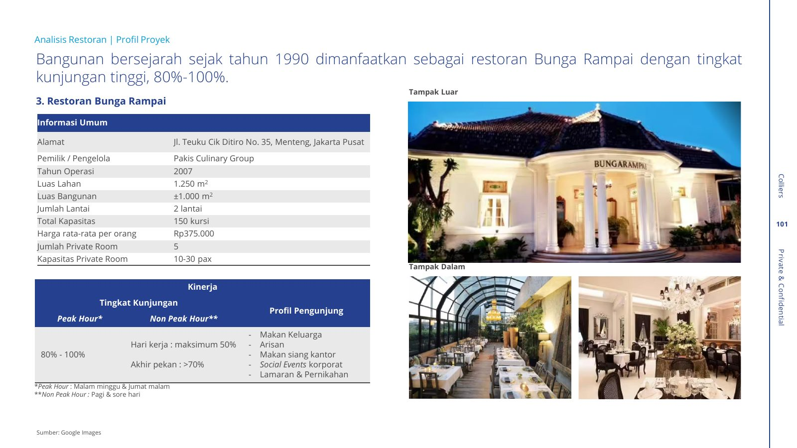
<!-- END COMPLETE PAGE RENDER: SLIDE 101 -->

| InformasiUmum | Kolom 2 |
| :--- | :--- |
| Alamat | Jl. TeukuCikDitiroNo. 35, Menteng, Jakarta Pusat |
| Pemilik/ Pengelola | PakisCulinary Group |
| TahunOperasi | 2007 |
| Luas Lahan | 1.250 m2 |
| Luas Bangunan | ±1.000 m2 |
| JumlahLantai | 2 lantai |
| Total Kapasitas | 150 kursi |
| Hargarata-rata per orang | Rp375.000 |
| JumlahPrivate Room | 5 |
| KapasitasPrivate Room | 10-30 pax |

| Kinerja | Kolom 2 | Kolom 3 |
| :--- | :--- | :--- |
| Tingkat Kunjungan |  | ProfilPengunjung |
| Peak Hour* | Non Peak Hour** |  |
| 80%-100% | Hari kerja: maksimum50% Akhirpekan: >70% | - MakanKeluarga - Arisan - Makansiangkantor - Social Events korporat - Lamaran& Pernikahan |

3. Restoran Bunga Rampai

Informasi Umum

Alamat Jl. Teuku Cik Ditiro No. 35, Menteng, Jakarta Pusat

Pemilik / Pengelola Pakis Culinary Group

Tahun Operasi 2007

Jumlah Lantai 2 lantai

Total Kapasitas 150 kursi

Jumlah Private Room 5

Kinerja

Tingkat Kunjungan

Profil Pengunjung Peak Hour* Non Peak Hour**

80% - 100% Hari kerja : maksimum 50%

Akhir pekan : >70%

- 
  Makan Keluarga
- 
  Arisan
- 
  Makan siang kantor
- 
  Social Events korporat
- 
  Lamaran & Pernikahan

- Peak Hour : Malam minggu & Jumat malam
- Non Peak Hour : Pagi & sore hari

> **Sumber: Google Images**

Tampak Luar

Tampak Dalam

---

#### Slide 102: Analisis Restoran – Profil Proyek – Tugu Kunstring Paleis merupakan bangunan yang berdiri sejak tahun 1914, kini berfungsi sebagai  restoran dan galeri dengan okupansi tinggi

<!-- BEGIN COMPLETE PAGE RENDER: SLIDE 102 -->
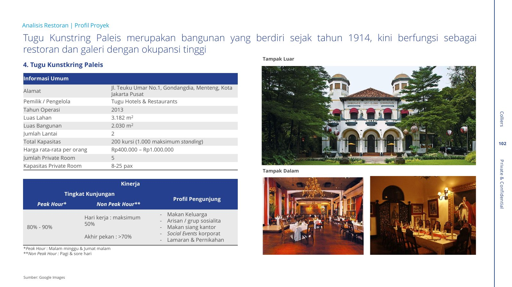
<!-- END COMPLETE PAGE RENDER: SLIDE 102 -->

| InformasiUmum | Kolom 2 |
| :--- | :--- |
| Alamat | Jl. TeukuUmar No.1, Gondangdia, Menteng, Kota Jakarta Pusat |
| Pemilik/ Pengelola | TuguHotels & Restaurants |
| TahunOperasi | 2013 |
| Luas Lahan | 3.182 m2 |
| Luas Bangunan | 2.030 m2 |
| JumlahLantai | 2 |
| Total Kapasitas | 200 kursi(1.000 maksimumstanding) |
| Hargarata-rata per orang | Rp400.000 –Rp1.000.000 |
| JumlahPrivate Room | 5 |
| KapasitasPrivate Room | 8-25 pax |

| Kinerja | Kolom 2 | Kolom 3 |
| :--- | :--- | :--- |
| Tingkat Kunjungan |  | ProfilPengunjung |
| Peak Hour* | Non Peak Hour** |  |
| 80%-90% | Hari kerja: maksimum 50% Akhirpekan: >70% | - MakanKeluarga - Arisan/ grupsosialita - Makansiangkantor - Social Events korporat - Lamaran& Pernikahan |

4. Tugu Kunstkring Paleis

Informasi Umum

Alamat Jl. Teuku Umar No.1, Gondangdia, Menteng, Kota Jakarta Pusat Pemilik / Pengelola Tugu Hotels & Restaurants

Tahun Operasi 2013

Jumlah Lantai 2

Jumlah Private Room 5

Kinerja

Tingkat Kunjungan

Profil Pengunjung Peak Hour* Non Peak Hour**

80% - 90%

Hari kerja : maksimum 50%

Akhir pekan : >70%

- 
  Makan Keluarga
- 
  Arisan / grup sosialita
- 
  Makan siang kantor
- 
  Social Events korporat
- 
  Lamaran & Pernikahan

- Peak Hour : Malam minggu & Jumat malam
- Non Peak Hour : Pagi & sore hari

> **Sumber: Google Images**

Tampak Luar

Tampak Dalam

---

#### Slide 103: Analisis Restoran – Profil Proyek – Dengan konsep fine dining yang modern, Namaaz Dining hanya dibuka pada jam makan malam dengan  kapasitas minimal untuk menjaga eksklusifitas restoran

<!-- BEGIN COMPLETE PAGE RENDER: SLIDE 103 -->
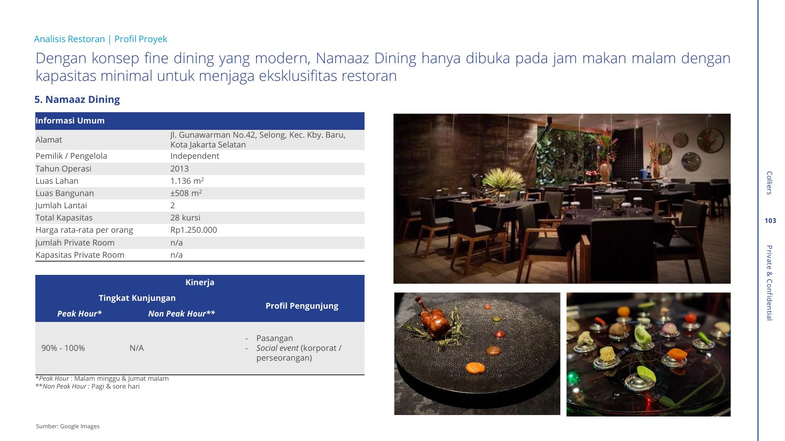
<!-- END COMPLETE PAGE RENDER: SLIDE 103 -->

| InformasiUmum | Kolom 2 |
| :--- | :--- |
| Alamat | Jl. GunawarmanNo.42, Selong, Kec. Kby. Baru, Kota Jakarta Selatan |
| Pemilik/ Pengelola | Independent |
| TahunOperasi | 2013 |
| Luas Lahan | 1.136 m2 |
| Luas Bangunan | ±508 m2 |
| JumlahLantai | 2 |
| Total Kapasitas | 28 kursi |
| Hargarata-rata per orang | Rp1.250.000 |
| JumlahPrivate Room | n/a |
| KapasitasPrivate Room | n/a |

| Kinerja | Kolom 2 | Kolom 3 |
| :--- | :--- | :--- |
| Tingkat Kunjungan |  | ProfilPengunjung |
| Peak Hour* | Non Peak Hour** |  |
| 90%-100% | N/A | - Pasangan - Socialevent (korporat/ perseorangan) |

5. Namaaz Dining

Informasi Umum

Tahun Operasi 2013

Luas Bangunan ±508 m2

Jumlah Lantai 2

Total Kapasitas 28 kursi

Jumlah Private Room n/a

Kapasitas Private Room n/a

Kinerja

Tingkat Kunjungan

Profil Pengunjung Peak Hour* Non Peak Hour**

90% - 100% N/A

- 
  Pasangan
- 
  Social event (korporat /
  perseorangan)

- Peak Hour : Malam minggu & Jumat malam
- Non Peak Hour : Pagi & sore hari

> **Sumber: Google Images**

---

#### Slide 104: Analisis Restoran – Profil Proyek – Sofia Restaurant yang terintegrasi dengan hotel butik The Gunawarman, mencatat tingkat kunjungan  tinggi, 80% - 90%

<!-- BEGIN COMPLETE PAGE RENDER: SLIDE 104 -->
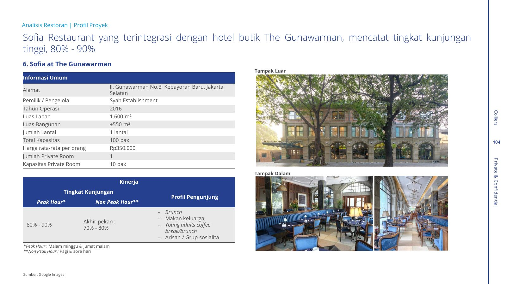
<!-- END COMPLETE PAGE RENDER: SLIDE 104 -->

| InformasiUmum | Kolom 2 |
| :--- | :--- |
| Alamat | Jl. GunawarmanNo.3, KebayoranBaru, Jakarta Selatan |
| Pemilik/ Pengelola | SyahEstablishment |
| TahunOperasi | 2016 |
| Luas Lahan | 1.600 m2 |
| Luas Bangunan | ±550 m2 |
| JumlahLantai | 1 lantai |
| Total Kapasitas | 100 pax |
| Hargarata-rata per orang | Rp350.000 |
| JumlahPrivate Room | 1 |
| KapasitasPrivate Room | 10pax |

| Kinerja | Kolom 2 | Kolom 3 |
| :--- | :--- | :--- |
| Tingkat Kunjungan |  | ProfilPengunjung |
| Peak Hour* | Non Peak Hour** |  |
| 80% -90% | Akhirpekan: 70% -80% | - Brunch - Makankeluarga - Young adults coffee break/brunch - Arisan/ Grupsosialita |

6. Sofia at The Gunawarman

Informasi Umum

Alamat Jl. Gunawarman No.3, Kebayoran Baru, Jakarta Selatan Pemilik / Pengelola Syah Establishment

Tahun Operasi 2016

Luas Bangunan ±550 m2

Jumlah Lantai 1 lantai

Total Kapasitas 100 pax

Jumlah Private Room 1

Kapasitas Private Room 10 pax

Kinerja

Tingkat Kunjungan

Profil Pengunjung Peak Hour* Non Peak Hour**

80% - 90% Akhir pekan : 70% - 80%

- 
  Brunch
- 
  Makan keluarga
- 
  Young adults coffee
  break/brunch
- 
  Arisan / Grup sosialita

- Peak Hour : Malam minggu & Jumat malam
- Non Peak Hour : Pagi & sore hari

Tampak Luar

Tampak Dalam

> **Sumber: Google Images**

---

#### Slide 105: Analisis Restoran – Profil Proyek – Plataran Menteng adalah bangunan di kawasan Menteng Jakarta Pusat yang dimanfaatkan menjadi  restoran 3-lantai dengan tingkat kunjungan tinggi, 80%-100%

<!-- BEGIN COMPLETE PAGE RENDER: SLIDE 105 -->
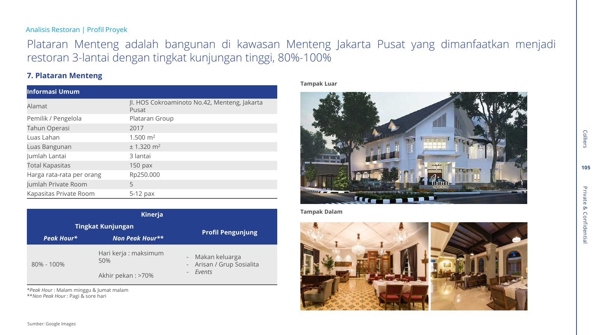
<!-- END COMPLETE PAGE RENDER: SLIDE 105 -->

| InformasiUmum | Kolom 2 |
| :--- | :--- |
| Alamat | Jl. HOS CokroaminotoNo.42, Menteng, Jakarta Pusat |
| Pemilik/ Pengelola | PlataranGroup |
| TahunOperasi | 2017 |
| Luas Lahan | 1.500 m2 |
| Luas Bangunan | ±1.320 m2 |
| JumlahLantai | 3 lantai |
| Total Kapasitas | 150 pax |
| Hargarata-rata per orang | Rp250.000 |
| JumlahPrivate Room | 5 |
| KapasitasPrivate Room | 5-12 pax |

| Kinerja | Kolom 2 | Kolom 3 |
| :--- | :--- | :--- |
| Tingkat Kunjungan |  | ProfilPengunjung |
| Peak Hour* | Non Peak Hour** |  |
| 80% -100% | Hari kerja: maksimum 50% Akhirpekan: >70% | - Makankeluarga - Arisan/ GrupSosialita - Events |

7. Plataran Menteng

Informasi Umum

Alamat Jl. HOS Cokroaminoto No.42, Menteng, Jakarta Pusat Pemilik / Pengelola Plataran Group

Tahun Operasi 2017

Jumlah Lantai 3 lantai

Total Kapasitas 150 pax

Jumlah Private Room 5

Kinerja

Tingkat Kunjungan

Profil Pengunjung Peak Hour* Non Peak Hour**

80% - 100%

Hari kerja : maksimum 50%

Akhir pekan : >70%

- 
  Makan keluarga
- 
  Arisan / Grup Sosialita
- 
  Events

- Peak Hour : Malam minggu & Jumat malam
- Non Peak Hour : Pagi & sore hari

Tampak Luar

Tampak Dalam

> **Sumber: Google Images**

---

#### Slide 106: Analisis Restoran – Profil Proyek – The Neighbourhood menerapkan konsep Indonesian Heritage Culinary dengan tingkan kunjungan sangat  tinggi, 90%-100%

<!-- BEGIN COMPLETE PAGE RENDER: SLIDE 106 -->
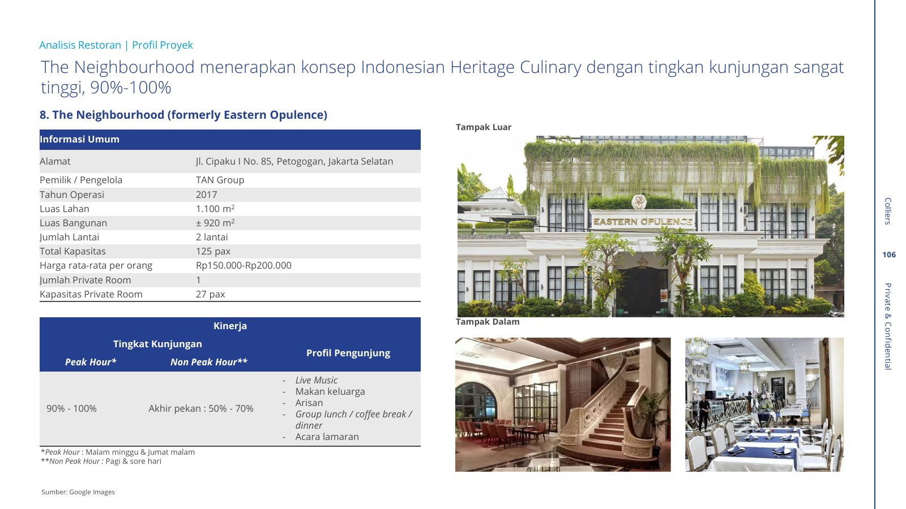
<!-- END COMPLETE PAGE RENDER: SLIDE 106 -->

| InformasiUmum | Kolom 2 |
| :--- | :--- |
| Alamat | Jl. CipakuI No. 85, Petogogan, Jakarta Selatan |
| Pemilik/ Pengelola | TAN Group |
| TahunOperasi | 2017 |
| Luas Lahan | 1.100 m2 |
| Luas Bangunan | ±920 m2 |
| JumlahLantai | 2 lantai |
| Total Kapasitas | 125 pax |
| Hargarata-rata per orang | Rp150.000-Rp200.000 |
| JumlahPrivate Room | 1 |
| KapasitasPrivate Room | 27 pax |

| Kinerja | Kolom 2 | Kolom 3 |
| :--- | :--- | :--- |
| Tingkat Kunjungan |  | ProfilPengunjung |
| Peak Hour* | Non Peak Hour** |  |
| 90% -100% | Akhirpekan: 50% -70% | - Live Music - Makankeluarga - Arisan - Group lunch / coffee break / dinner - Acara lamaran |

8. The Neighbourhood (formerly Eastern Opulence)

Informasi Umum

Alamat Jl. Cipaku I No. 85, Petogogan, Jakarta Selatan

Pemilik / Pengelola TAN Group

Tahun Operasi 2017

Luas Bangunan ± 920 m2

Jumlah Lantai 2 lantai

Total Kapasitas 125 pax

Jumlah Private Room 1

Kapasitas Private Room 27 pax

Kinerja

Tingkat Kunjungan

Profil Pengunjung Peak Hour* Non Peak Hour**

90% - 100% Akhir pekan : 50% - 70%

- Peak Hour : Malam minggu & Jumat malam
- Non Peak Hour : Pagi & sore hari

Tampak Luar

Tampak Dalam

> **Sumber: Google Images**

---

#### Slide 107: Analisis Restoran – Konsep dan Kinerja – Ke-delapan restoran fine dining mencatat tingkat kunjungan sangat baik

<!-- BEGIN COMPLETE PAGE RENDER: SLIDE 107 -->
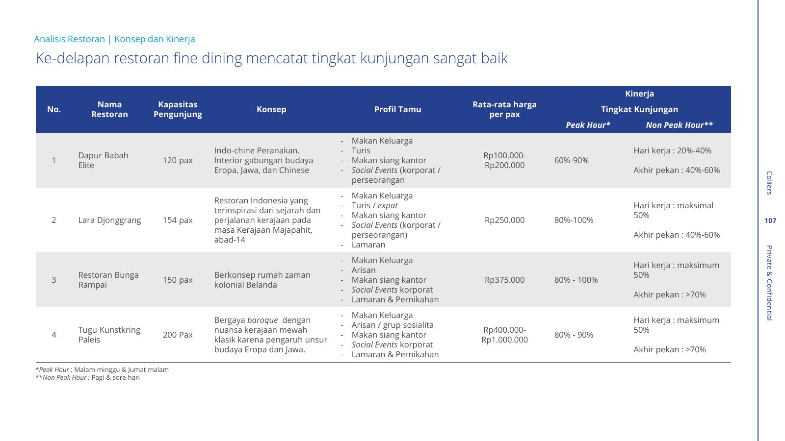
<!-- END COMPLETE PAGE RENDER: SLIDE 107 -->

| No. | Nama Restoran | Kapasitas Pengunjung | Konsep | ProfilTamu | Rata-rataharga per pax | Kinerja | Kolom 8 |
| :--- | :--- | :--- | :--- | :--- | :--- | :--- | :--- |
|  |  |  |  |  |  | Tingkat Kunjungan |  |
|  |  |  |  |  |  | Peak Hour* | Non Peak Hour** |
| 1 | DapurBabah Elite | 120 pax | Indo-chine Peranakan. Interior gabunganbudaya Eropa, Jawa, danChinese | - MakanKeluarga - Turis - Makansiangkantor - Social Events(korporat/ perseorangan | Rp100.000- Rp200.000 | 60%-90% | Hari kerja: 20%-40% Akhirpekan: 40%-60% |
| 2 | Lara Djonggrang | 154 pax | RestoranIndonesia yang terinspirasidarisejarahdan perjalanankerajaanpada masa Kerajaan Majapahit, abad-14 | - MakanKeluarga - Turis/ expat - Makansiangkantor - Social Events(korporat/ perseorangan) - Lamaran | Rp250.000 | 80%-100% | Hari kerja: maksimal 50% Akhirpekan: 40%-60% |
| 3 | RestoranBunga Rampai | 150 pax | Berkonseprumahzaman kolonialBelanda | - MakanKeluarga - Arisan - Makansiangkantor - Social Events korporat - Lamaran& Pernikahan | Rp375.000 | 80%-100% | Hari kerja: maksimum 50% Akhirpekan: >70% |
| 4 | TuguKunstkring Paleis | 200 Pax | Bergayabaroque dengan nuansakerajaanmewah klasikkarenapengaruhunsur budayaEropadanJawa. | - MakanKeluarga - Arisan/ grupsosialita - Makansiangkantor - Social Events korporat - Lamaran& Pernikahan | Rp400.000- Rp1.000.000 | 80%-90% | Hari kerja: maksimum 50% Akhirpekan: >70% |

- Peak Hour : Malam minggu & Jumat malam
- Non Peak Hour : Pagi & sore hari

No. Nama Restoran

Kapasitas Pengunjung Konsep Profil Tamu Rata-rata harga

per pax

Kinerja

Tingkat Kunjungan

1 Dapur Babah Elite 120 pax Indo-chine Peranakan. Interior gabungan budaya Eropa, Jawa, dan Chinese

- 
  Makan Keluarga
- 
  Turis
- 
  Makan siang kantor
- 
  Social Events (korporat /
  perseorangan

Rp100.000-

Akhir pekan : 40%-60%

Restoran Indonesia yang terinspirasi dari sejarah dan perjalanan kerajaan pada masa Kerajaan Majapahit, abad-14

- 
  Makan Keluarga
- 
  Turis / expat
- 
  Makan siang kantor
- 
  Social Events (korporat /
  perseorangan)
- 
  Lamaran

Rp250.000 80%-100%

Hari kerja : maksimal 50%

Akhir pekan : 40%-60%

3 Restoran Bunga Rampai 150 pax Berkonsep rumah zaman kolonial Belanda

- 
  Makan Keluarga
- 
  Arisan
- 
  Makan siang kantor
- 
  Social Events korporat
- 
  Lamaran & Pernikahan

Rp375.000 80% - 100%

Hari kerja : maksimum 50%

Akhir pekan : >70%

4 Tugu Kunstkring Paleis 200 Pax

Bergaya baroque dengan nuansa kerajaan mewah klasik karena pengaruh unsur budaya Eropa dan Jawa.

- 
  Makan Keluarga
- 
  Arisan / grup sosialita
- 
  Makan siang kantor
- 
  Social Events korporat
- 
  Lamaran & Pernikahan

Hari kerja : maksimum 50%

Akhir pekan : >70%

---

#### Slide 108: Analisis Restoran – Konsep dan Kinerja – Ke-delapan restoran fine dining mencatat tingkat kunjungan sangat baik

<!-- BEGIN COMPLETE PAGE RENDER: SLIDE 108 -->
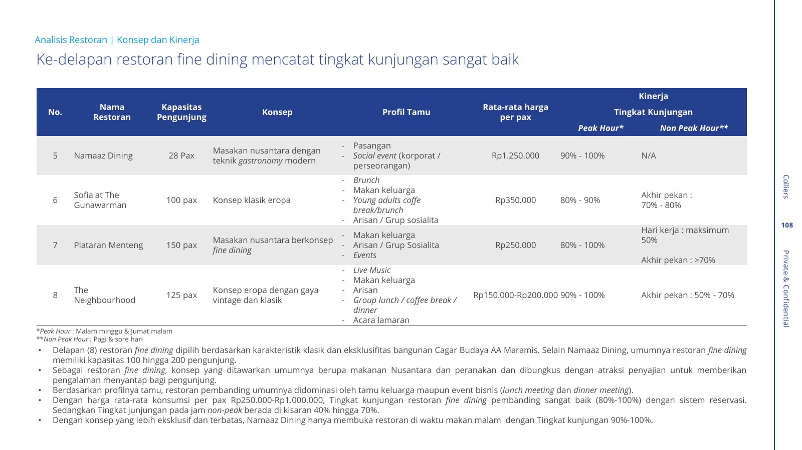
<!-- END COMPLETE PAGE RENDER: SLIDE 108 -->

| No. | Nama Restoran | Kapasitas Pengunjung | Konsep | ProfilTamu | Rata-rataharga per pax | Kinerja | Kolom 8 |
| :--- | :--- | :--- | :--- | :--- | :--- | :--- | :--- |
|  |  |  |  |  |  | Tingkat Kunjungan |  |
|  |  |  |  |  |  | Peak Hour* | Non Peak Hour** |
| 5 | NamaazDining | 28 Pax | Masakannusantaradengan teknikgastronomymodern | - Pasangan - Socialevent (korporat/ perseorangan) | Rp1.250.000 | 90%-100% | N/A |
| 6 | Sofia at The Gunawarman | 100 pax | Konsepklasikeropa | - Brunch - Makankeluarga - Young adults coffe break/brunch - Arisan/ Grupsosialita | Rp350.000 | 80% -90% | Akhirpekan: 70% -80% |
| 7 | PlataranMenteng | 150 pax | Masakannusantaraberkonsep fine dining | - Makankeluarga - Arisan/ GrupSosialita - Events | Rp250.000 | 80% -100% | Hari kerja: maksimum 50% Akhirpekan: >70% |
| 8 | The Neighbourhood | 125 pax | Konseperopadengangaya vintage danklasik | - Live Music - Makankeluarga - Arisan - Group lunch / coffee break / dinner - Acara lamaran | Rp150.000-Rp200.000 | 90% -100% | Akhirpekan: 50% -70% |

- Peak Hour : Malam minggu & Jumat malam
- Non Peak Hour : Pagi & sore hari

No. Nama Restoran

Kapasitas Pengunjung Konsep Profil Tamu Rata-rata harga

per pax

Kinerja

Tingkat Kunjungan

5 Namaaz Dining 28 Pax Masakan nusantara dengan teknik gastronomy modern

- 
  Pasangan
- 
  Social event (korporat /
  perseorangan)

6 Sofia at The Gunawarman 100 pax Konsep klasik eropa

- 
  Brunch
- 
  Makan keluarga
- 
  Young adults coffe
  break/brunch
- 
  Arisan / Grup sosialita

Rp350.000 80% - 90% Akhir pekan : 70% - 80%

7 Plataran Menteng 150 pax Masakan nusantara berkonsep fine dining

- 
  Makan keluarga
- 
  Arisan / Grup Sosialita
- 
  Events

Rp250.000 80% - 100%

Hari kerja : maksimum 50%

Akhir pekan : >70%

8 The Neighbourhood 125 pax Konsep eropa dengan gaya vintage dan klasik

Rp150.000-Rp200.000 90% - 100% Akhir pekan : 50% - 70%

- 
  Delapan (8) restoran fine dining dipilih berdasarkan karakteristik klasik dan eksklusifitas bangunan Cagar Budaya AA Maramis. Selain Namaaz Dining, umumnya restoran fine dining
  memiliki kapasitas 100 hingga 200 pengunjung.
- 
  Sebagai restoran fine dining, konsep yang ditawarkan umumnya berupa makanan Nusantara dan peranakan dan dibungkus dengan atraksi penyajian untuk memberikan
  pengalaman menyantap bagi pengunjung.
- 
  Berdasarkan profilnya tamu, restoran pembanding umumnya didominasi oleh tamu keluarga maupun event bisnis (lunch meeting dan dinner meeting).
- 
  Dengan harga rata-rata konsumsi per pax Rp250.000-Rp1.000.000, Tingkat kunjungan restoran fine dining pembanding sangat baik (80%-100%) dengan sistem reservasi.
  Sedangkan Tingkat junjungan pada jam non-peak berada di kisaran 40% hingga 70%.
- 
  Dengan konsep yang lebih eksklusif dan terbatas, Namaaz Dining hanya membuka restoran di waktu makan malam  dengan Tingkat kunjungan 90%-100%.

---

#### Slide 109: Analisis Potensi Pasar – Restoran Potensi pengembangan restaurant didukung meningkatnya sektor industri penyediaan akomodasi makanan  dan minuman

<!-- BEGIN COMPLETE PAGE RENDER: SLIDE 109 -->
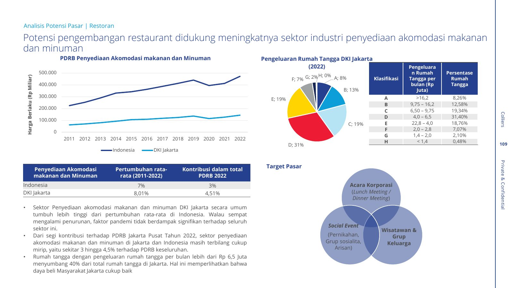
<!-- END COMPLETE PAGE RENDER: SLIDE 109 -->

| Klasifika | si | Pengeluara nRumah Tanggaper bulan(Rp Juta) | Persentase Rumah Tangga |
| :--- | :--- | :--- | :--- |
| A |  | >16,2 | 8,26% |
| B |  | 9,75 –16,2 | 12,58% |
| C |  | 6,50 –9,75 | 19,34% |
| D |  | 4,0 –6,5 | 31,40% |
| E |  | 22,8 –4,0 | 18,76% |
| F |  | 2,0 –2,8 | 7,07% |
| G |  | 1,4 –2,0 | 2,10% |
| H |  | < 1,4 | 0,48% |

| Penyediaan Akomodasi makanan dan Minuman | Pertumbuhanrata- rata (2011-2022) | Kontribusidalamtotal PDRB 2022 |
| :--- | :--- | :--- |
| Indonesia | 7% | 3% |
| DKI Jakarta | 8,01% | 4,51% |

- 
  Sektor Penyediaan akomodasi makanan dan minuman DKI Jakarta secara umum
  tumbuh lebih tinggi dari pertumbuhan rata-rata di Indonesia. Walau sempat
  mengalami penurunan, faktor pandemi tidak berdampak signifikan terhadap seluruh
  sektor ini.
- 
  Dari segi kontribusi terhadap PDRB Jakarta Pusat Tahun 2022, sektor penyediaan
  akomodasi makanan dan minuman di Jakarta dan Indonesia masih terbilang cukup
  mirip, yaitu sekitar 3 hingga 4,5% terhadap PDRB keseluruhan.
- 
  Rumah tangga dengan pengeluaran rumah tangga per bulan lebih dari Rp 6,5 Juta
  menyumbang 40% dari total rumah tangga di Jakarta. Hal ini memperlihatkan bahwa
  daya beli Masyarakat Jakarta cukup baik

Pertumbuhan rata-

rata (2011-2022)

Kontribusi dalam total

PDRB 2022

Acara Korporasi

(Lunch Meeting /

Dinner Meeting)

Wisatawan &

Grup Keluarga

Social Event

(Pernikahan, Grup sosialita,

Arisan)

A; 8%

B; 13%

C; 19%

D; 31%

E; 19%

(2022)

Klasifikasi

Pengeluara

n Rumah Tangga per

bulan (Rp

Juta)

Persentase

Rumah Tangga

0

100.000

200.000

300.000

400.000

500.000

Harga Berlaku (Rp Miliar)

Indonesia DKI Jakarta

Target Pasar

---

#### Slide 110: Analisis Restoran – Penilaian dan Rekomendasi – Terdapat delapan kriteria skoring untuk menentukan harga cover per-orang

<!-- BEGIN COMPLETE PAGE RENDER: SLIDE 110 -->
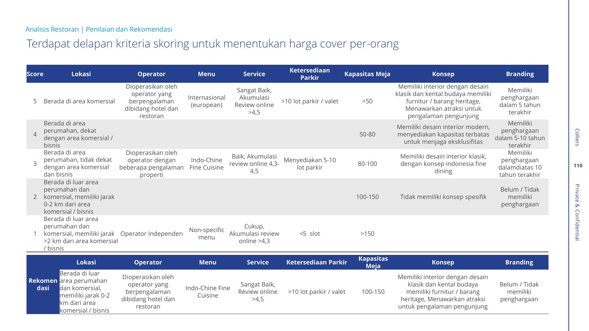
<!-- END COMPLETE PAGE RENDER: SLIDE 110 -->

| Score | Lokasi | Operator | Menu | Service | Ketersediaan Parkir | KapasitasMeja | Konsep | Branding |
| :--- | :--- | :--- | :--- | :--- | :--- | :--- | :--- | :--- |
| 5 | Beradadi area komersial | Dioperasikanoleh operator yang berpengalaman dibidanghotel dan restoran | Internasional (european) | SangatBaik, Akumulasi Review online >4,5 | >10 lot parkir/ valet | <50 | Memilikiinterior dengandesain klasikdankentalbudayamemiliki furnitur/ barangheritage, Menawarkanatraksiuntuk pengalamanpengunjung | Memiliki penghargaan dalam 5 tahun terakhir |
| 4 | Beradadi area perumahan, dekat denganarea komersial/ bisnis |  |  |  |  | 50-80 | Memilikidesaininterior modern, menyediakankapasitasterbatas untukmenjagaeksklusifitas | Memiliki penghargaan dalam 5-10 tahun terakhir |
| 3 | Berada di area perumahan, tidak dekat dengan area komersial dan bisnis | Dioperasikanoleh operator dengan beberapapengalaman properti | Indo-Chine Fine Cuisine | Baik, Akumulasi review online 4,3- 4,5 | Menyediakan5-10 lot parkir | 80-100 | Memilikidesaininterior klasik, dengankonsepindonesiafine dining | Memiliki penghargaan dalamdiatas 10 tahun terakhir |
| 2 | Beradadi luararea perumahandan komersial, memilikijarak 0-2 km dariarea komersial/ bisnis |  |  |  |  | 100-150 | Tidakmemilikikonsepspesifik | Belum/ Tidak memiliki penghargaan |
| 1 | Beradadi luararea perumahandan komersial, memilikijarak >2 km dariarea komersial / bisnis | Operator Independen | Non-specific menu | Cukup, Akumulasireview online >4,3 | <5 slot | >150 |  |  |

| Rekomen dasi | Lokasi | Operator | Menu | Service | Ketersediaan Parkir | Kapasitas Meja | Konsep | Branding |
| :--- | :--- | :--- | :--- | :--- | :--- | :--- | :--- | :--- |
|  | Beradadi luar area perumahan dankomersial, memilikijarak0-2 km dariarea komersial/ bisnis | Dioperasikanoleh operator yang berpengalaman dibidanghotel dan restoran | Indo-Chine Fine Cuisine | SangatBaik, Review online >4,5 | >10 lot parkir/ valet | 100-150 | Memilikiinterior dengandesain klasikdankentalbudaya memilikifurnitur/ barang heritage, Menawarkanatraksi untukpengalamanpengunjung | Belum/ Tidak memiliki penghargaan |

Dioperasikan oleh

operator yang berpengalaman dibidang hotel dan

restoran

Internasional

(european)

Sangat Baik,

Akumulasi Review online

>4,5

Memiliki interior dengan desain klasik dan kental budaya memiliki

furnitur / barang heritage, Menawarkan atraksi untuk

pengalaman pengunjung

terakhir

4

50-80 Memiliki desain interior modern,

menyediakan kapasitas terbatas

untuk menjaga eksklusifitas

terakhir

3

Dioperasikan oleh

operator dengan beberapa pengalaman

properti

Indo-Chine Fine Cuisine

4,5

Menyediakan 5-10

lot parkir 80-100 Memiliki desain interior klasik, dengan konsep indonesia fine

dining

Memiliki penghargaan dalamdiatas 10

tahun terakhir

2

Belum / Tidak

memiliki penghargaan

1

Operator Independen Non-specific

menu

Cukup, Akumulasi review

online >4,3

<5  slot >150

Rekomen

dasi

Meja Konsep Branding

Dioperasikan oleh

operator yang berpengalaman dibidang hotel dan

restoran

Indo-Chine Fine

Cuisine

Sangat Baik, Review online

>4,5

Memiliki interior dengan desain

klasik dan kental budaya memiliki furnitur / barang heritage, Menawarkan atraksi untuk pengalaman pengunjung

Belum / Tidak

memiliki penghargaan

---

#### Slide 111: Analisis Restoran – Penilaian dan Rekomendasi – Dengan skor, 3,2, diproyeksikan rata-rata konsumsi pelanggan di restoran yang akan dikembangkan di  Properti adalah Rp369.551 per orang

<!-- BEGIN COMPLETE PAGE RENDER: SLIDE 111 -->
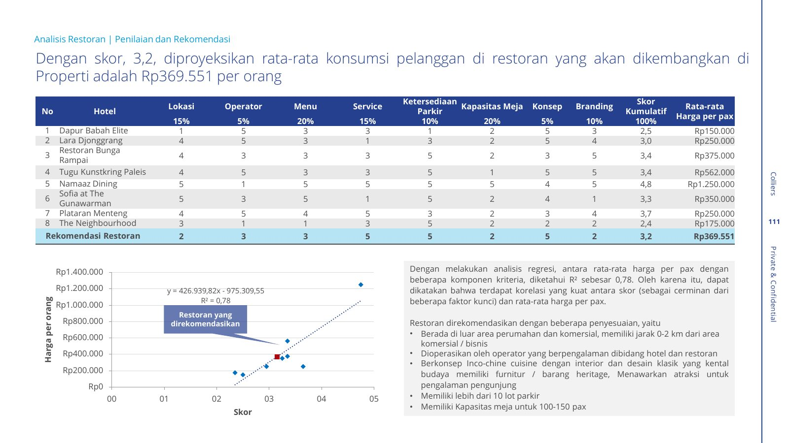
<!-- END COMPLETE PAGE RENDER: SLIDE 111 -->

| No | Hotel | Lokasi | Operator | Menu | Service | Ketersediaan Parkir | KapasitasMeja | Konsep | Branding | Skor Kumulatif | Rata-rata Harga per pax |
| :--- | :--- | :--- | :--- | :--- | :--- | :--- | :--- | :--- | :--- | :--- | :--- |
|  |  | 15% | 5% | 20% | 15% | 10% | 20% | 5% | 10% | 100% |  |
| 1 | Dapur Babah Elite | 1 | 5 | 3 | 3 | 1 | 2 | 5 | 3 | 2,5 | Rp150.000 |
| 2 | Lara Djonggrang | 4 | 5 | 3 | 1 | 3 | 2 | 5 | 4 | 3,0 | Rp250.000 |
| 3 | RestoranBunga Rampai | 4 | 3 | 3 | 3 | 5 | 2 | 3 | 5 | 3,4 | Rp375.000 |
| 4 | Tugu Kunstkring Paleis | 4 | 5 | 3 | 3 | 5 | 1 | 5 | 5 | 3,4 | Rp562.000 |
| 5 | Namaaz Dining | 5 | 1 | 5 | 5 | 5 | 5 | 4 | 5 | 4,8 | Rp1.250.000 |
| 6 | Sofia at The Gunawarman | 5 | 3 | 5 | 1 | 5 | 2 | 4 | 1 | 3,3 | Rp350.000 |
| 7 | Plataran Menteng | 4 | 5 | 4 | 5 | 3 | 2 | 3 | 4 | 3,7 | Rp250.000 |
| 8 | The Neighbourhood | 3 | 1 | 1 | 3 | 5 | 2 | 2 | 2 | 2,4 | Rp175.000 |
| Rekomendasi Restoran |  | 2 | 3 | 3 | 5 | 5 | 2 | 5 | 2 | 3,2 | Rp369.551 |

Dengan melakukan analisis regresi, antara rata-rata harga per pax dengan beberapa komponen kriteria, diketahui R² sebesar 0,78. Oleh karena itu, dapat dikatakan bahwa terdapat korelasi yang kuat antara skor (sebagai cerminan dari beberapa faktor kunci) dan rata-rata harga per pax.

  Restoran direkomendasikan dengan beberapa penyesuaian, yaitu
- 
  Berada di luar area perumahan dan komersial, memiliki jarak 0-2 km dari area
  komersial / bisnis
- 
  Dioperasikan oleh operator yang berpengalaman dibidang hotel dan restoran
- 
  Berkonsep Inco-chine cuisine dengan interior dan desain klasik yang kental
  budaya memiliki furnitur / barang heritage, Menawarkan atraksi untuk
  pengalaman pengunjung
- 
  Memiliki lebih dari 10 lot parkir
- 
  Memiliki Kapasitas meja untuk 100-150 pax

y = 426.939,82x - 975.309,55

R² = 0,78

Rp0

Rp200.000

Rp400.000

Rp600.000

Rp800.000

Rp1.000.000

Rp1.200.000

Rp1.400.000

00 01 02 03 04 05

Harga per orang

Skor

Restoran yang direkomendasikan

---

### 6.3 Analisis Ritel Tematik

#### Slide 112: Ritel Tematik

<!-- BEGIN COMPLETE PAGE RENDER: SLIDE 112 -->

<!-- END COMPLETE PAGE RENDER: SLIDE 112 -->

6.3

---

#### Slide 113: Analisis Ritel Tematik – Kriteria Seleksi Terdapat 3 ritel tematik yang dikembangkan pada bangunan cagar budaya di Jakarta

<!-- BEGIN COMPLETE PAGE RENDER: SLIDE 113 -->
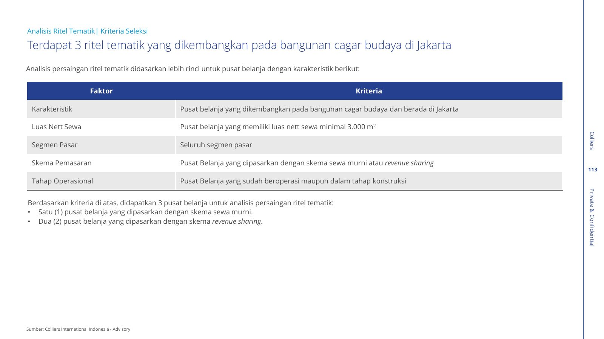
<!-- END COMPLETE PAGE RENDER: SLIDE 113 -->

| Faktor | Kriteria |
| :--- | :--- |
| Karakteristik | Pusat belanjayang dikembangkanpada bangunan cagarbudayadan beradadi Jakarta |
| Luas NettSewa | Pusatbelanjayangmemilikiluasnettsewaminimal3.000m2 |
| SegmenPasar | Seluruhsegmenpasar |
| SkemaPemasaran | PusatBelanjayangdipasarkandenganskemasewamurniataurevenuesharing |
| TahapOperasional | PusatBelanjayangsudahberoperasimaupundalamtahapkonstruksi |

> **Sumber: Colliers International Indonesia - Advisory**

Faktor Kriteria

Karakteristik Pusat belanja yang dikembangkan pada bangunan cagar budaya dan berada di Jakarta

Luas Nett Sewa Pusat belanja yang memiliki luas nett sewa minimal 3.000 m2

Segmen Pasar Seluruh segmen pasar

Skema Pemasaran Pusat Belanja yang dipasarkan dengan skema sewa murni atau revenue sharing

Tahap Operasional Pusat Belanja yang sudah beroperasi maupun dalam tahap konstruksi

Analisis persaingan ritel tematik didasarkan lebih rinci untuk pusat belanja dengan karakteristik berikut:

  Berdasarkan kriteria di atas, didapatkan 3 pusat belanja untuk analisis persaingan ritel tematik:
- 
  Satu (1) pusat belanja yang dipasarkan dengan skema sewa murni.
- 
  Dua (2) pusat belanja yang dipasarkan dengan skema revenue sharing.

---

#### Slide 114: Analisis Ritel Tematik – Peta Pesaing – Pos Bloc Jakarta merupakan pesaing ritel tematik terdekat dengan Properti

<!-- BEGIN COMPLETE PAGE RENDER: SLIDE 114 -->
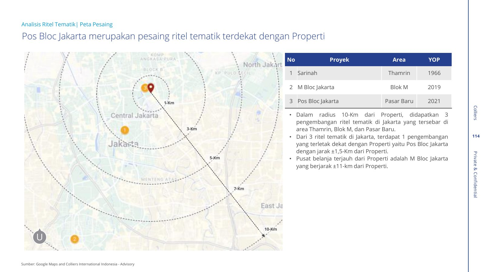
<!-- END COMPLETE PAGE RENDER: SLIDE 114 -->

| No | Proyek | Area | YOP |
| :--- | :--- | :--- | :--- |
| 1 | Sarinah | Thamrin | 1966 |
| 2 | M Bloc Jakarta | Blok M | 2019 |
| 3 | Pos Bloc Jakarta | Pasar Baru | 2021 |

> **Sumber: Google Maps and Colliers International Indonesia - Advisory**

- 
  Dalam
  radius
  10-Km
  dari
  Properti,
  didapatkan
  3
  pengembangan ritel tematik di Jakarta yang tersebar di
  area Thamrin, Blok M, dan Pasar Baru.
- 
  Dari 3 ritel tematik di Jakarta, terdapat 1 pengembangan
  yang terletak dekat dengan Properti yaitu Pos Bloc Jakarta
  dengan jarak ±1,5-Km dari Properti.
- 
  Pusat belanja terjauh dari Properti adalah M Bloc Jakarta
  yang berjarak ±11-km dari Properti.

No Proyek Area YOP

1 Sarinah Thamrin 1966

U

1-Km

3-Km

5-Km

7-Km

10-Km

---

#### Slide 115: Analisis Ritel Tematik – Informasi Umum Ritel tematik umumnya mengusung konsep sebagai ruang publik, tempat berkumpul, dan memasarkan  barang lokal

<!-- BEGIN COMPLETE PAGE RENDER: SLIDE 115 -->
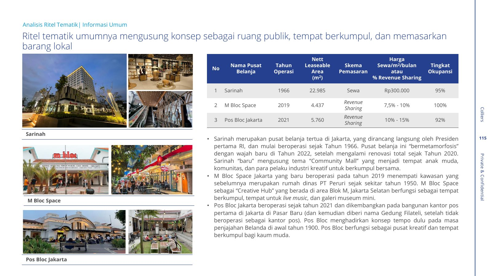
<!-- END COMPLETE PAGE RENDER: SLIDE 115 -->

| No | Nama Pusat Belanja | Tahun Operasi | Nett Leaseable Area (m2) | Skema Pemasaran | Harga Sewa/m2/bulan atau % Revenue Sharing | Tingkat Okupansi |
| :--- | :--- | :--- | :--- | :--- | :--- | :--- |
| 1 | Sarinah | 1966 | 22.985 | Sewa | Rp300.000 | 95% |
| 2 | M Bloc Space | 2019 | 4.437 | Revenue Sharing | 7,5% -10% | 100% |
| 3 | Pos Bloc Jakarta | 2021 | 5.760 | Revenue Sharing | 10% -15% | 92% |

Sarinah

M Bloc Space

Pos Bloc Jakarta

No Nama Pusat

Belanja

Tahun Operasi

Nett Leaseable

Area

(m2)

Skema Pemasaran

Harga Sewa/m2/bulan

atau % Revenue Sharing

Tingkat Okupansi

Sharing 10% - 15% 92%

- 
  Sarinah merupakan pusat belanja tertua di Jakarta, yang dirancang langsung oleh Presiden
  pertama RI, dan mulai beroperasi sejak Tahun 1966. Pusat belanja ini “bermetamorfosis”
  dengan wajah baru di Tahun 2022, setelah mengalami renovasi total sejak Tahun 2020.
  Sarinah “baru” mengusung tema “Comm    y M   ” yang menjadi tempat anak muda,
  komunitas, dan para pelaku industri kreatif untuk berkumpul bersama.
- 
  M Bloc Space Jakarta yang baru beroperasi pada tahun 2019 menempati kawasan yang
  sebelumnya merupakan rumah dinas PT Peruri sejak sekitar tahun 1950. M Bloc Space
  sebagai “C     v  H b” yang berada di area Blok M, Jakarta Selatan berfungsi sebagai tempat
  berkumpul, tempat untuk live music, dan galeri museum mini.
- 
  Pos Bloc Jakarta beroperasi sejak tahun 2021 dan dikembangkan pada bangunan kantor pos
  pertama di Jakarta di Pasar Baru (dan kemudian diberi nama Gedung Filateli, setelah tidak
  beroperasi sebagai kantor pos). Pos Bloc menghadirkan konsep tempo dulu pada masa
  penjajahan Belanda di awal tahun 1900. Pos Bloc berfungsi sebagai pusat kreatif dan tempat
  berkumpul bagi kaum muda.

---

#### Slide 116: Analisis Ritel Tematik – Biaya Servis  Umumnya, ritel tematik ini mengenakan biaya servis Rp75.000 hingga Rp100.000/m2/bulan

<!-- BEGIN COMPLETE PAGE RENDER: SLIDE 116 -->
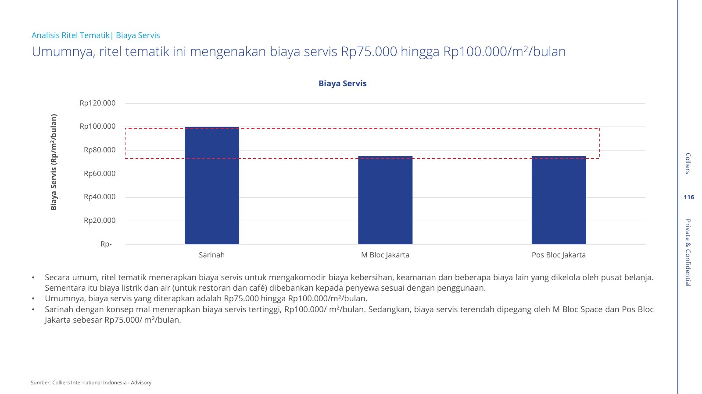
<!-- END COMPLETE PAGE RENDER: SLIDE 116 -->

Rp-

Rp20.000

Rp40.000

Rp60.000

Rp80.000

Rp100.000

Rp120.000

Sarinah M Bloc Jakarta Pos Bloc Jakarta

Biaya Servis (Rp/m2/bulan)

Biaya Servis

> **Sumber: Colliers International Indonesia - Advisory**

- 
  Secara umum, ritel tematik menerapkan biaya servis untuk mengakomodir biaya kebersihan, keamanan dan beberapa biaya lain yang dikelola oleh pusat belanja.
  Sementara itu biaya listrik dan air (untuk restoran dan café) dibebankan kepada penyewa sesuai dengan penggunaan.
- 
  Umumnya, biaya servis yang diterapkan adalah Rp75.000 hingga Rp100.000/m2/bulan.
- 
  Sarinah dengan konsep mal menerapkan biaya servis tertinggi, Rp100.000/ m2/bulan. Sedangkan, biaya servis terendah dipegang oleh M Bloc Space dan Pos Bloc
  Jakarta sebesar Rp75.000/ m2/bulan.

---

#### Slide 117: Analisis Ritel Tematik – Jumlah Pengunjung – Lokasi dan penyediaan ruang event merupakan faktor untuk meningkatkan tingkat kunjungan ke ritel  tematik

<!-- BEGIN COMPLETE PAGE RENDER: SLIDE 117 -->
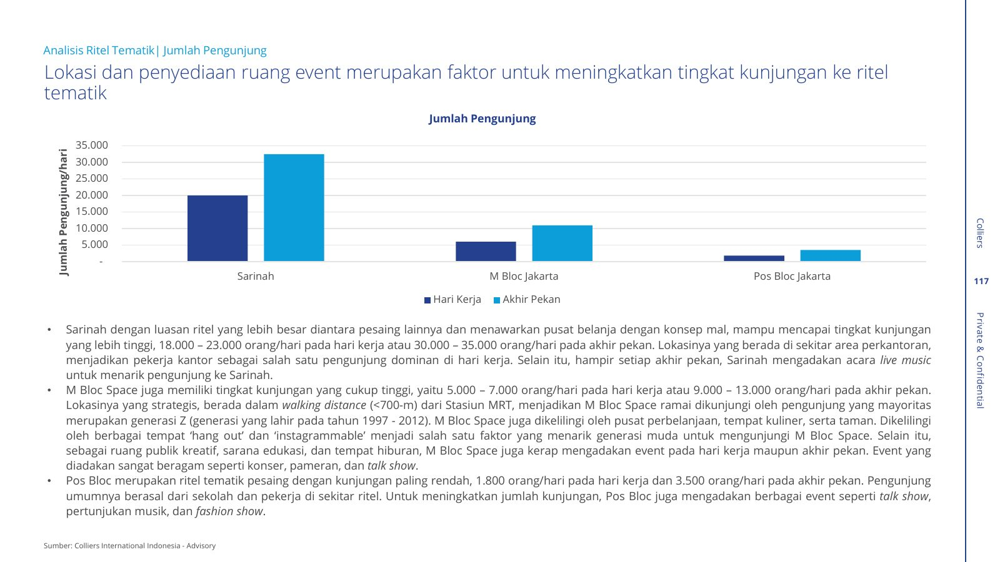
<!-- END COMPLETE PAGE RENDER: SLIDE 117 -->

- 
  Sarinah dengan luasan ritel yang lebih besar diantara pesaing lainnya dan menawarkan pusat belanja dengan konsep mal, mampu mencapai tingkat kunjungan
  yang lebih tinggi, 18.000 – 23.000 orang/hari pada hari kerja atau 30.000 – 35.000 orang/hari pada akhir pekan. Lokasinya yang berada di sekitar area perkantoran,
  menjadikan pekerja kantor sebagai salah satu pengunjung dominan di hari kerja. Selain itu, hampir setiap akhir pekan, Sarinah mengadakan acara live music
  untuk menarik pengunjung ke Sarinah.
- 
  M Bloc Space juga memiliki tingkat kunjungan yang cukup tinggi, yaitu 5.000 – 7.000 orang/hari pada hari kerja atau 9.000 – 13.000 orang/hari pada akhir pekan.
  Lokasinya yang strategis, berada dalam walking distance (<700-m) dari Stasiun MRT, menjadikan M Bloc Space ramai dikunjungi oleh pengunjung yang mayoritas
  merupakan generasi Z (generasi yang lahir pada tahun 1997 - 2012). M Bloc Space juga dikelilingi oleh pusat perbelanjaan, tempat kuliner, serta taman. Dikelilingi
  oleh berbagai tempat ‘h    o  ’ dan ‘instagrammable’ menjadi salah satu faktor yang menarik generasi muda untuk mengunjungi M Bloc Space. Selain itu,
  sebagai ruang publik kreatif, sarana edukasi, dan tempat hiburan, M Bloc Space juga kerap mengadakan event pada hari kerja maupun akhir pekan. Event yang
  diadakan sangat beragam seperti konser, pameran, dan talk show.
- 
  Pos Bloc merupakan ritel tematik pesaing dengan kunjungan paling rendah, 1.800 orang/hari pada hari kerja dan 3.500 orang/hari pada akhir pekan. Pengunjung
  umumnya berasal dari sekolah dan pekerja di sekitar ritel. Untuk meningkatkan jumlah kunjungan, Pos Bloc juga mengadakan berbagai event seperti talk show,
  pertunjukan musik, dan fashion show.

> **Sumber: Colliers International Indonesia - Advisory**

-

5.000

10.000

15.000

20.000

25.000

30.000

35.000

Sarinah M Bloc Jakarta Pos Bloc Jakarta

Jumlah Pengunjung/hari

Jumlah Pengunjung

Hari Kerja Akhir Pekan

---

#### Slide 118: Analisis Ritel Tematik – Bauran Pasar berdasarkan jenis tenant Seluruh ritel tematik menyediakan jenis tenant berupa supermarket/minimarket, restoran, dan busana &  aksesoris

<!-- BEGIN COMPLETE PAGE RENDER: SLIDE 118 -->
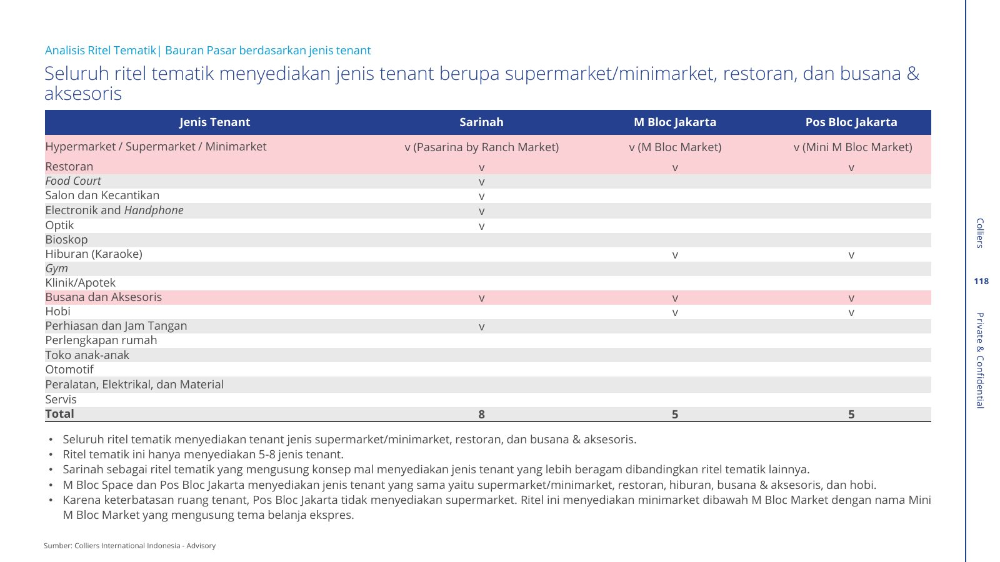
<!-- END COMPLETE PAGE RENDER: SLIDE 118 -->

| Jenis Tenant | Sarinah | M Bloc Jakarta | Pos Bloc Jakarta |
| :--- | :--- | :--- | :--- |
| Hypermarket / Supermarket / Minimarket | v (Pasarinaby Ranch Market) | v (M Bloc Market) | v (Mini M Bloc Market) |
| Restoran | v | v | v |
| Food Court | v |  |  |
| Salon dan Kecantikan | v |  |  |
| Electronikand Handphone | v |  |  |
| Optik | v |  |  |
| Bioskop |  |  |  |
| Hiburan(Karaoke) |  | v | v |
| Gym |  |  |  |
| Klinik/Apotek |  |  |  |
| Busanadan Aksesoris | v | v | v |
| Hobi |  | v | v |
| Perhiasandan Jam Tangan | v |  |  |
| Perlengkapanrumah |  |  |  |
| Tokoanak-anak |  |  |  |
| Otomotif |  |  |  |
| Peralatan, Elektrikal, dan Material |  |  |  |
| Servis |  |  |  |
| Total | 8 | 5 | 5 |

> **Sumber: Colliers International Indonesia - Advisory**

- 
  Seluruh ritel tematik menyediakan tenant jenis supermarket/minimarket, restoran, dan busana & aksesoris.
- 
  Ritel tematik ini hanya menyediakan 5-8 jenis tenant.
- 
  Sarinah sebagai ritel tematik yang mengusung konsep mal menyediakan jenis tenant yang lebih beragam dibandingkan ritel tematik lainnya.
- 
  M Bloc Space dan Pos Bloc Jakarta menyediakan jenis tenant yang sama yaitu supermarket/minimarket, restoran, hiburan, busana & aksesoris, dan hobi.
- 
  Karena keterbatasan ruang tenant, Pos Bloc Jakarta tidak menyediakan supermarket. Ritel ini menyediakan minimarket dibawah M Bloc Market dengan nama Mini
  M Bloc Market yang mengusung tema belanja ekspres.

---

#### Slide 119: Analisis Ritel Tematik – Bauran Pasar Makanan dan Minuman mendominasi bauran pasar di ritel tematik pesaing

<!-- BEGIN COMPLETE PAGE RENDER: SLIDE 119 -->
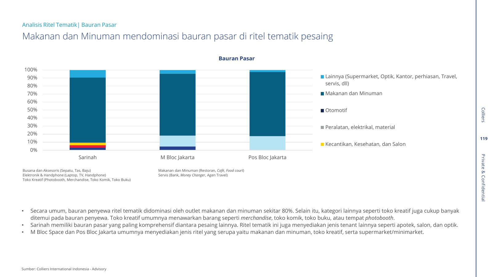
<!-- END COMPLETE PAGE RENDER: SLIDE 119 -->

0%

10%

20%

30%

40%

50%

60%

70%

80%

90%

100%

Sarinah M Bloc Jakarta Pos Bloc Jakarta

Bauran Pasar

Lainnya (Supermarket, Optik, Kantor, perhiasan, Travel, servis, dll)

Makanan dan Minuman

Otomotif

Peralatan, elektrikal, material

Kecantikan, Kesehatan, dan Salon

> **Sumber: Colliers International Indonesia - Advisory**

- 
  Secara umum, bauran penyewa ritel tematik didominasi oleh outlet makanan dan minuman sekitar 80%. Selain itu, kategori lainnya seperti toko kreatif juga cukup banyak
  ditemui pada bauran penyewa. Toko kreatif umumnya menawarkan barang seperti merchandise, toko komik, toko buku, atau tempat photobooth.
- 
  Sarinah memiliki bauran pasar yang paling komprehensif diantara pesaing lainnya. Ritel tematik ini juga menyediakan jenis tenant lainnya seperti apotek, salon, dan optik.
- 
  M Bloc Space dan Pos Bloc Jakarta umumnya menyediakan jenis ritel yang serupa yaitu makanan dan minuman, toko kreatif, serta supermarket/minimarket.

Busana dan Aksesoris (Sepatu, Tas, Baju) Makanan dan Minuman (Restoran, Café, Food court) Elektronik & Handphone (Laptop, TV, Handphone) Servis (Bank, Money Changer, Agen Travel) Toko Kreatif (Photobooth, Merchandise, Toko Komik, Toko Buku)

---

#### Slide 120: Analisis Ritel Tematik – Rata-rata Ukuran Ruang Ritel (1) – Anchor tenant dan specialty shop umumnya dibedakan berdasarkan ukuran ruang

<!-- BEGIN COMPLETE PAGE RENDER: SLIDE 120 -->
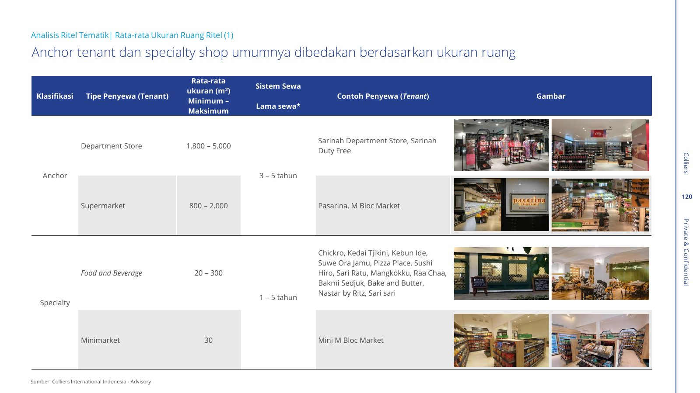
<!-- END COMPLETE PAGE RENDER: SLIDE 120 -->

| Klasifikasi | TipePenyewa(Tenant) | Rata-rata ukuran(m2) | SistemSewa | Contoh Penyewa(Tenant) | Gambar |
| :--- | :--- | :--- | :--- | :--- | :--- |
|  |  | Minimum – Maksimum | Lama sewa* |  |  |
| Anchor | Department Store | 1.800 –5.000 | 3 –5 tahun | Sarinah Department Store, Sarinah Duty Free |  |
|  | Supermarket | 800 –2.000 |  | Pasarina, M Bloc Market |  |
| Specialty | Food and Beverage | 20 –300 | 1 –5 tahun | Chickro, KedaiTjikini, KebunIde, SuweOra Jamu, Pizza Place, Sushi Hiro, Sari Ratu, Mangkokku, RaaChaa, Bakmi Sedjuk, Bake and Butter, Nastarby Ritz, Sari sari |  |
|  | Minimarket | 30 |  | Mini M Bloc Market |  |

> **Sumber: Colliers International Indonesia - Advisory**

Klasifikasi Tipe Penyewa (Tenant)

Anchor

3 – 5 tahun

Specialty

1 – 5 tahun

Chickro, Kedai Tjikini, Kebun Ide, Suwe Ora Jamu, Pizza Place, Sushi Hiro, Sari Ratu, Mangkokku, Raa Chaa, Bakmi Sedjuk, Bake and Butter, Nastar by Ritz, Sari sari

---

#### Slide 121: Analisis Ritel Tematik – Rata-rata Ukuran Ruang Ritel (2) Anchor tenant dan specialty shop umumnya dibedakan berdasarkan ukuran ruang

<!-- BEGIN COMPLETE PAGE RENDER: SLIDE 121 -->
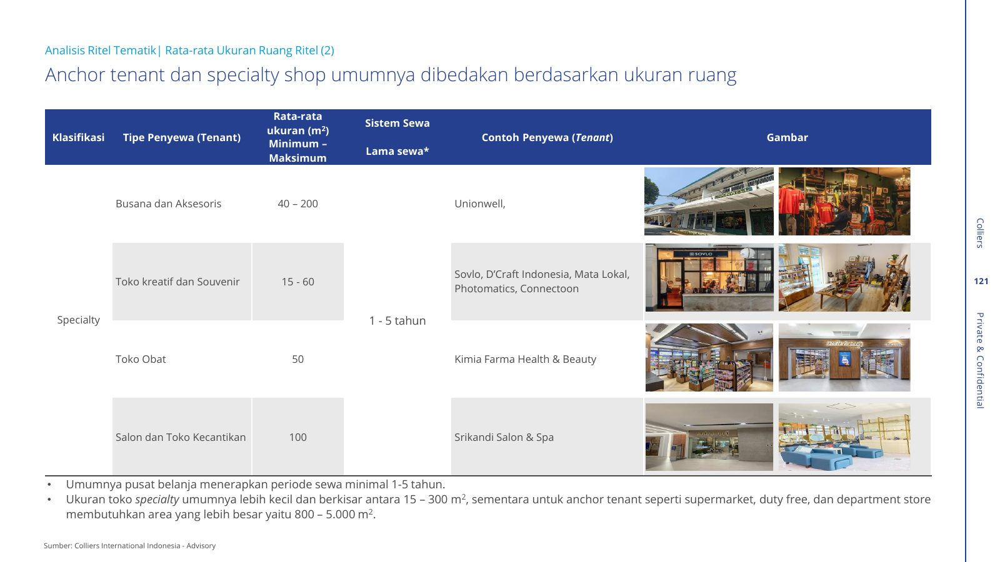
<!-- END COMPLETE PAGE RENDER: SLIDE 121 -->

| Klasifikasi | TipePenyewa(Tenant) | Rata-rata ukuran(m2) | SistemSewa | Contoh Penyewa(Tenant) | Gambar |
| :--- | :--- | :--- | :--- | :--- | :--- |
|  |  | Minimum – Maksimum | Lama sewa* |  |  |
| Specialty | BusanadanAksesoris | 40 –200 | 1 -5 tahun | Unionwell, |  |
|  | Toko kreatifdan Souvenir | 15 -60 |  | Sovlo, D’C f Indonesia, Mata Lokal, Photomatics, Connectoon |  |
|  | TokoObat | 50 |  | Kimia FarmaHealth & Beauty |  |
|  | Salon danTokoKecantikan | 100 |  | SrikandiSalon & Spa |  |

> **Sumber: Colliers International Indonesia - Advisory**

Klasifikasi Tipe Penyewa (Tenant)

Specialty

Busana dan Aksesoris 40 – 200

1 - 5 tahun

Unionwell,

Toko Obat 50 Kimia Farma Health & Beauty

Salon dan Toko Kecantikan 100 Srikandi Salon & Spa

- 
  Umumnya pusat belanja menerapkan periode sewa minimal 1-5 tahun.
- 
  Ukuran toko specialty umumnya lebih kecil dan berkisar antara 15 – 300 m2, sementara untuk anchor tenant seperti supermarket, duty free, dan department store
  membutuhkan area yang lebih besar yaitu 800 – 5.000 m2.

---

#### Slide 122: Analisis Ritel Tematik – Kesimpulan Ritel tematik pesaing memiliki tingkat persaingan yang cukup ketat

<!-- BEGIN COMPLETE PAGE RENDER: SLIDE 122 -->
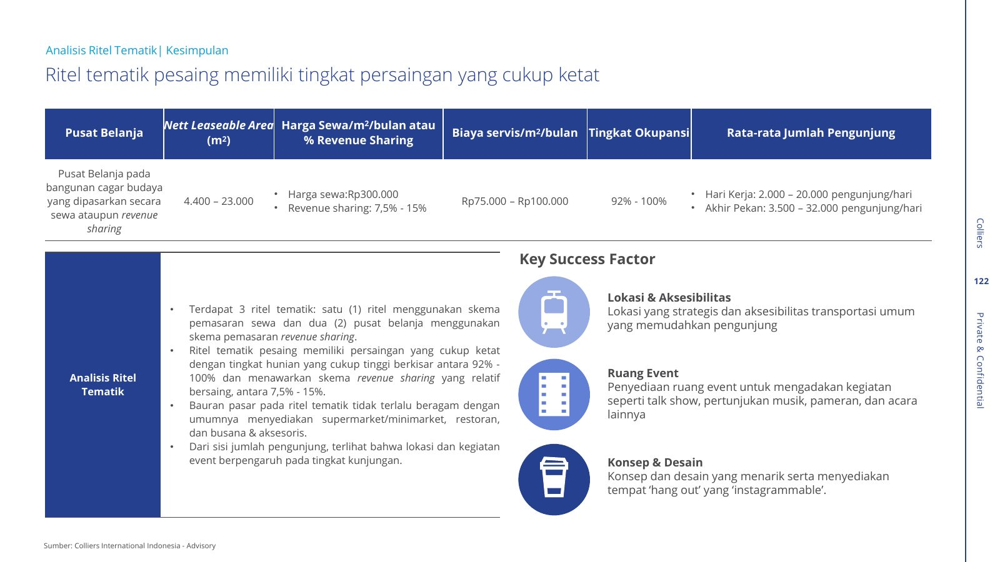
<!-- END COMPLETE PAGE RENDER: SLIDE 122 -->

| Pusat Belanja | NettLeaseableArea (m2) | Harga Sewa/m2/bulanatau % Revenue Sharing | Biayaservis/m2/bulan | Tingkat Okupansi | Rata-rata JumlahPengunjung |
| :--- | :--- | :--- | :--- | :--- | :--- |
| Pusat Belanjapada bangunan cagarbudaya yang dipasarkansecara sewa ataupunrevenue sharing | 4.400 –23.000 | • Harga sewa:Rp300.000 • Revenue sharing: 7,5% -15% | Rp75.000 –Rp100.000 | 92% -100% | • Hari Kerja: 2.000 –20.000 pengunjung/hari • Akhir Pekan: 3.500 –32.000 pengunjung/hari |

> **Sumber: Colliers International Indonesia - Advisory**

Analisis Ritel

Tematik

- 
  Terdapat 3 ritel tematik: satu (1) ritel menggunakan skema
  pemasaran sewa dan dua (2) pusat belanja menggunakan
  skema pemasaran revenue sharing.
- 
  Ritel tematik pesaing memiliki persaingan yang cukup ketat
  dengan tingkat hunian yang cukup tinggi berkisar antara 92% -
  100% dan menawarkan skema revenue sharing yang relatif
  bersaing, antara 7,5% - 15%.
- 
  Bauran pasar pada ritel tematik tidak terlalu beragam dengan
  umumnya
  menyediakan
  supermarket/minimarket,
  restoran,
  dan busana & aksesoris.
- 
  Dari sisi jumlah pengunjung, terlihat bahwa lokasi dan kegiatan
  event berpengaruh pada tingkat kunjungan.

Pusat Belanja Nett Leaseable Area

(m2)

Harga Sewa/m2/bulan atau

% Revenue Sharing Biaya servis/m2/bulan Tingkat Okupansi Rata-rata Jumlah Pengunjung

Pusat Belanja pada bangunan cagar budaya

yang dipasarkan secara

sewa ataupun revenue

sharing

Key Success Factor

Lokasi & Aksesibilitas Lokasi yang strategis dan aksesibilitas transportasi umum yang memudahkan pengunjung

Ruang Event Penyediaan ruang event untuk mengadakan kegiatan seperti talk show, pertunjukan musik, pameran, dan acara lainnya

Konsep & Desain Konsep dan desain yang menarik serta menyediakan mp   ‘h    o  ’ y    ‘instagrammable’

---

#### Slide 123: Analisis Ritel Tematik – Kelebihan, Potensi, Kekurangan dan Tantangan Pengembangan ritel di Properti berpotensi, dengan tantangan tertentu

<!-- BEGIN COMPLETE PAGE RENDER: SLIDE 123 -->
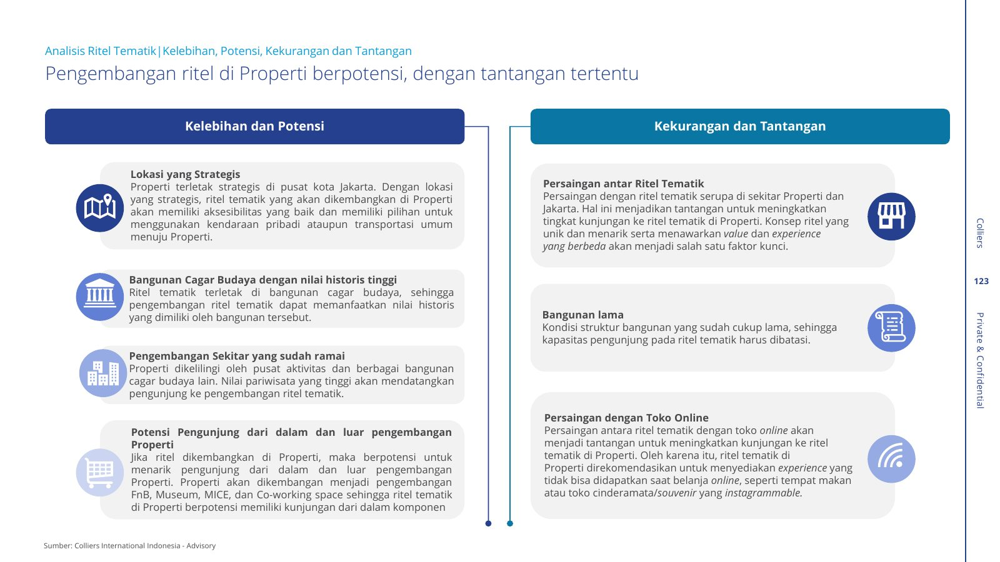
<!-- END COMPLETE PAGE RENDER: SLIDE 123 -->

> **Sumber: Colliers International Indonesia - Advisory**

Kelebihan dan Potensi Kekurangan dan Tantangan

Lokasi yang Strategis Properti terletak strategis di pusat kota Jakarta. Dengan lokasi yang strategis, ritel tematik yang akan dikembangkan di Properti akan memiliki aksesibilitas yang baik dan memiliki pilihan untuk menggunakan kendaraan pribadi ataupun transportasi umum menuju Properti.

Pengembangan Sekitar yang sudah ramai Properti dikelilingi oleh pusat aktivitas dan berbagai bangunan cagar budaya lain. Nilai pariwisata yang tinggi akan mendatangkan pengunjung ke pengembangan ritel tematik.

Potensi Pengunjung dari dalam dan luar pengembangan Properti Jika ritel dikembangkan di Properti, maka berpotensi untuk menarik pengunjung dari dalam dan luar pengembangan Properti. Properti akan dikembangan menjadi pengembangan FnB, Museum, MICE, dan Co-working space sehingga ritel tematik di Properti berpotensi memiliki kunjungan dari dalam komponen

Bangunan Cagar Budaya dengan nilai historis tinggi Ritel tematik terletak di bangunan cagar budaya, sehingga pengembangan ritel tematik dapat memanfaatkan nilai historis yang dimiliki oleh bangunan tersebut. Bangunan lama Kondisi struktur bangunan yang sudah cukup lama, sehingga kapasitas pengunjung pada ritel tematik harus dibatasi.

Persaingan dengan Toko Online Persaingan antara ritel tematik dengan toko online akan menjadi tantangan untuk meningkatkan kunjungan ke ritel tematik di Properti. Oleh karena itu, ritel tematik di Properti direkomendasikan untuk menyediakan experience yang tidak bisa didapatkan saat belanja online, seperti tempat makan atau toko cinderamata/souvenir yang instagrammable.

Persaingan antar Ritel Tematik Persaingan dengan ritel tematik serupa di sekitar Properti dan Jakarta. Hal ini menjadikan tantangan untuk meningkatkan tingkat kunjungan ke ritel tematik di Properti. Konsep ritel yang unik dan menarik serta menawarkan value dan experience yang berbeda akan menjadi salah satu faktor kunci.

---

#### Slide 124: Analisis Ritel Tematik – Mind Map Potensi pasar ritel tematik dapat dilihat dari dua sisi yaitu pengunjung dan penyewa (tenant)

<!-- BEGIN COMPLETE PAGE RENDER: SLIDE 124 -->
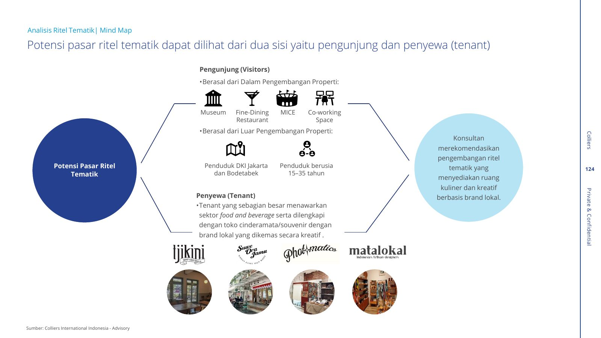
<!-- END COMPLETE PAGE RENDER: SLIDE 124 -->

Potensi Pasar Ritel

Tematik

Pengunjung (Visitors)

•Berasal dari Dalam Pengembangan Properti:

•Berasal dari Luar Pengembangan Properti:

  Penyewa (Tenant)
- Tenant yang sebagian besar menawarkan

sektor food and beverage serta dilengkapi dengan toko cinderamata/souvenir dengan brand lokal yang dikemas secara kreatif .

Konsultan merekomendasikan pengembangan ritel

tematik yang menyediakan ruang

kuliner dan kreatif berbasis brand lokal.

Museum Fine-Dining

Restaurant

MICE Co-working

Space

Penduduk DKI Jakarta

dan Bodetabek

Penduduk berusia

15–35 tahun

> **Sumber: Colliers International Indonesia - Advisory**

---

#### Slide 125: Analisis Ritel Tematik – Target Pengunjung dari Dalam Pengembangan Properti Target potensi kunjungan pada ritel tematik berasal dari dalam pengembangan Properti sebesar 1.674  orang per hari

<!-- BEGIN COMPLETE PAGE RENDER: SLIDE 125 -->
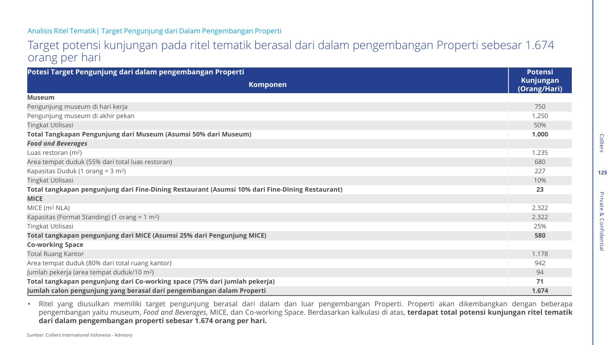
<!-- END COMPLETE PAGE RENDER: SLIDE 125 -->

| PotesiTarget Pengunjung daridalampengembanganProperti | Potensi Kunjungan (Orang/Hari) |
| :--- | :--- |
| Komponen |  |
| Museum |  |
| Pengunjung museum di hari kerja | 750 |
| Pengunjung museum di akhir pekan | 1.250 |
| Tingkat Utilisasi | 50% |
| Total Tangkapan Pengunjung dari Museum (Asumsi 50% dari Museum) | 1.000 |
| Food and Beverages |  |
| Luas restoran(m2) | 1.235 |
| Area tempat duduk (55% dari total luas restoran) | 680 |
| Kapasitas Duduk (1 orang = 3 m2) | 227 |
| Tingkat Utilisasi | 10% |
| Total tangkapanpengunjungdariFine-Dining Restaurant (Asumsi10% dariFine-Dining Restaurant) | 23 |
| MICE |  |
| MICE (m2NLA) | 2.322 |
| Kapasitas(Format Standing) (1 orang = 1 m2) | 2.322 |
| Tingkat Utilisasi | 25% |
| Total tangkapan pengunjung dari MICE (Asumsi 25% dari Pengunjung MICE) | 580 |
| Co-working Space |  |
| Total Ruang Kantor | 1.178 |
| Area tempat duduk (80% dari total ruang kantor) | 942 |
| Jumlah pekerja(area tempat duduk/10 m2) | 94 |
| Total tangkapan pengunjung dari Co-working space (75% dari jumlah pekerja) | 71 |
| Jumlahcalonpengunjungyang berasaldaripengembangandalamProperti | 1.674 |

> **Sumber: Colliers International Indonesia - Advisory**

Potesi Target Pengunjung dari dalam pengembangan Properti Potensi Kunjungan (Orang/Hari) Komponen

- 
  Ritel yang diusulkan memiliki target pengunjung berasal dari dalam dan luar pengembangan Properti. Properti akan dikembangkan dengan beberapa
  pengembangan yaitu museum, Food and Beverages, MICE, dan Co-working Space. Berdasarkan kalkulasi di atas, terdapat total potensi kunjungan ritel tematik
  dari dalam pengembangan properti sebesar 1.674 orang per hari.

---

#### Slide 126: Potensi Pasar Ritel – Target Pengunjung dari Luar Pengembangan Properti (1) Target potensi kunjungan di luar pengembangan Properti berasal dari DKI Jakarta dan Bodetabek

<!-- BEGIN COMPLETE PAGE RENDER: SLIDE 126 -->
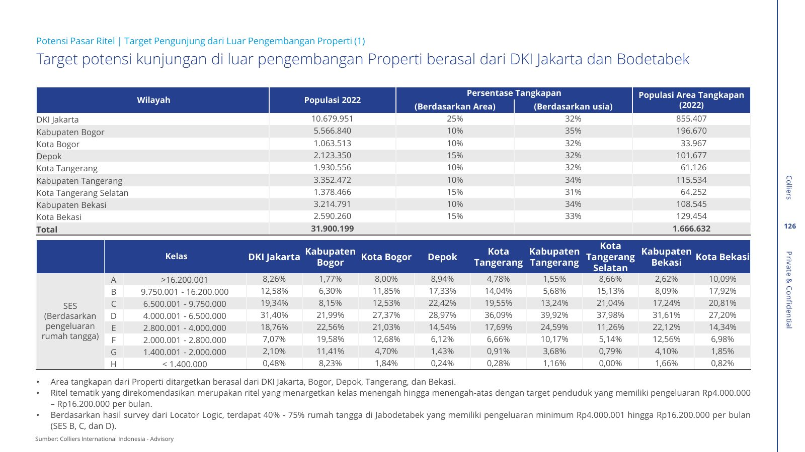
<!-- END COMPLETE PAGE RENDER: SLIDE 126 -->

| Wilayah | Populasi 2022 | PersentaseTangkapan | Kolom 4 | Populasi Area Tangkapan (2022) |
| :--- | :--- | :--- | :--- | :--- |
|  |  | (BerdasarkanArea) | (Berdasarkanusia) |  |
| DKI Jakarta | 10.679.951 | 25% | 32% | 855.407 |
| KabupatenBogor | 5.566.840 | 10% | 35% | 196.670 |
| Kota Bogor | 1.063.513 | 10% | 32% | 33.967 |
| Depok | 2.123.350 | 15% | 32% | 101.677 |
| Kota Tangerang | 1.930.556 | 10% | 32% | 61.126 |
| Kabupaten Tangerang | 3.352.472 | 10% | 34% | 115.534 |
| Kota Tangerang Selatan | 1.378.466 | 15% | 31% | 64.252 |
| Kabupaten Bekasi | 3.214.791 | 10% | 34% | 108.545 |
| Kota Bekasi | 2.590.260 | 15% | 33% | 129.454 |
| Total | 31.900.199 |  |  | 1.666.632 |

| Kolom 1 | Kelas | Kolom 3 | DKI Jakarta | Kabupaten Bogor | Kota Bogor | Depok | Kota Tangerang | Kabupaten Tangerang | Kota Tangerang Selatan | Kabupaten Bekasi | Kota Bekasi |
| :--- | :--- | :--- | :--- | :--- | :--- | :--- | :--- | :--- | :--- | :--- | :--- |
| SES (Berdasarkan pengeluaran rumahtangga) | A | >16.200.001 | 8,26% | 1,77% | 8,00% | 8,94% | 4,78% | 1,55% | 8,66% | 2,62% | 10,09% |
|  | B | 9.750.001 -16.200.000 | 12,58% | 6,30% | 11,85% | 17,33% | 14,04% | 5,68% | 15,13% | 8,09% | 17,92% |
|  | C | 6.500.001 -9.750.000 | 19,34% | 8,15% | 12,53% | 22,42% | 19,55% | 13,24% | 21,04% | 17,24% | 20,81% |
|  | D | 4.000.001 -6.500.000 | 31,40% | 21,99% | 27,37% | 28,97% | 36,09% | 39,92% | 37,98% | 31,61% | 27,20% |
|  | E | 2.800.001 -4.000.000 | 18,76% | 22,56% | 21,03% | 14,54% | 17,69% | 24,59% | 11,26% | 22,12% | 14,34% |
|  | F | 2.000.001 -2.800.000 | 7,07% | 19,58% | 12,68% | 6,12% | 6,66% | 10,17% | 5,14% | 12,56% | 6,98% |
|  | G | 1.400.001 -2.000.000 | 2,10% | 11,41% | 4,70% | 1,43% | 0,91% | 3,68% | 0,79% | 4,10% | 1,85% |
|  | H | < 1.400.000 | 0,48% | 8,23% | 1,84% | 0,24% | 0,28% | 1,16% | 0,00% | 1,66% | 0,82% |

> **Sumber: Colliers International Indonesia - Advisory**

Kelas DKI Jakarta Kabupaten

Kabupaten

Tangerang

Kota Tangerang

Selatan

Kabupaten

Bekasi Kota Bekasi

SES (Berdasarkan

pengeluaran rumah tangga)

- 
  Area tangkapan dari Properti ditargetkan berasal dari DKI Jakarta, Bogor, Depok, Tangerang, dan Bekasi.
- 
  Ritel tematik yang direkomendasikan merupakan ritel yang menargetkan kelas menengah hingga menengah-atas dengan target penduduk yang memiliki pengeluaran Rp4.000.000
- Rp16.200.000 per bulan.
- 
  Berdasarkan hasil survey dari Locator Logic, terdapat 40% - 75% rumah tangga di Jabodetabek yang memiliki pengeluaran minimum Rp4.000.001 hingga Rp16.200.000 per bulan
  (SES B, C, dan D).

Wilayah Populasi 2022

Persentase Tangkapan Populasi Area Tangkapan

(2022) (Berdasarkan Area) (Berdasarkan usia)

---

#### Slide 127: Analisis Ritel Tematik – Target Pengunjung dari Luar Pengembangan Properti (2) Target potensi kunjungan di luar pengembangan Properti berasal dari DKI Jakarta dan Bodetabek

<!-- BEGIN COMPLETE PAGE RENDER: SLIDE 127 -->
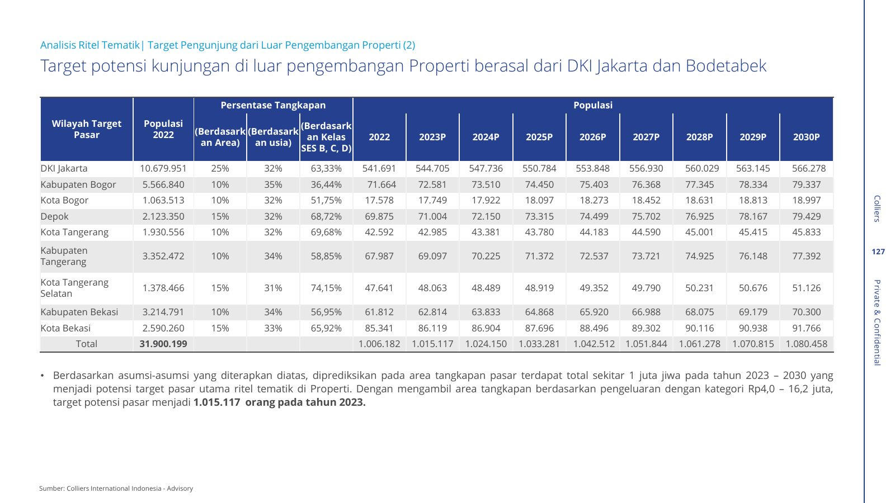
<!-- END COMPLETE PAGE RENDER: SLIDE 127 -->

| Wilayah Target Pasar | Populasi 2022 | PersentaseTangkapan | Kolom 4 | Kolom 5 | Populasi | Kolom 7 | Kolom 8 | Kolom 9 | Kolom 10 | Kolom 11 | Kolom 12 | Kolom 13 | Kolom 14 |
| :--- | :--- | :--- | :--- | :--- | :--- | :--- | :--- | :--- | :--- | :--- | :--- | :--- | :--- |
|  |  | (Berdasark anArea) | (Berdasark an usia) | (Berdasark anKelas SES B, C, D) | 2022 | 2023P | 2024P | 2025P | 2026P | 2027P | 2028P | 2029P | 2030P |
| DKI Jakarta | 10.679.951 | 25% | 32% | 63,33% | 541.691 | 544.705 | 547.736 | 550.784 | 553.848 | 556.930 | 560.029 | 563.145 | 566.278 |
| Kabupaten Bogor | 5.566.840 | 10% | 35% | 36,44% | 71.664 | 72.581 | 73.510 | 74.450 | 75.403 | 76.368 | 77.345 | 78.334 | 79.337 |
| Kota Bogor | 1.063.513 | 10% | 32% | 51,75% | 17.578 | 17.749 | 17.922 | 18.097 | 18.273 | 18.452 | 18.631 | 18.813 | 18.997 |
| Depok | 2.123.350 | 15% | 32% | 68,72% | 69.875 | 71.004 | 72.150 | 73.315 | 74.499 | 75.702 | 76.925 | 78.167 | 79.429 |
| Kota Tangerang | 1.930.556 | 10% | 32% | 69,68% | 42.592 | 42.985 | 43.381 | 43.780 | 44.183 | 44.590 | 45.001 | 45.415 | 45.833 |
| Kabupaten Tangerang | 3.352.472 | 10% | 34% | 58,85% | 67.987 | 69.097 | 70.225 | 71.372 | 72.537 | 73.721 | 74.925 | 76.148 | 77.392 |
| Kota Tangerang Selatan | 1.378.466 | 15% | 31% | 74,15% | 47.641 | 48.063 | 48.489 | 48.919 | 49.352 | 49.790 | 50.231 | 50.676 | 51.126 |
| KabupatenBekasi | 3.214.791 | 10% | 34% | 56,95% | 61.812 | 62.814 | 63.833 | 64.868 | 65.920 | 66.988 | 68.075 | 69.179 | 70.300 |
| Kota Bekasi | 2.590.260 | 15% | 33% | 65,92% | 85.341 | 86.119 | 86.904 | 87.696 | 88.496 | 89.302 | 90.116 | 90.938 | 91.766 |
| Total | 31.900.199 |  |  |  | 1.006.182 | 1.015.117 | 1.024.150 | 1.033.281 | 1.042.512 | 1.051.844 | 1.061.278 | 1.070.815 | 1.080.458 |

> **Sumber: Colliers International Indonesia - Advisory**

Wilayah Target

Pasar

Populasi

2022

Persentase Tangkapan Populasi

(Berdasark

an Area)

(Berdasark

an usia)

(Berdasark

- 
  Berdasarkan asumsi-asumsi yang diterapkan diatas, diprediksikan pada area tangkapan pasar terdapat total sekitar 1 juta jiwa pada tahun 2023 – 2030 yang
  menjadi potensi target pasar utama ritel tematik di Properti. Dengan mengambil area tangkapan berdasarkan pengeluaran dengan kategori Rp4,0 – 16,2 juta,
  target potensi pasar menjadi 1.015.117  orang pada tahun 2023.

---

#### Slide 128: Analisis Ritel Tematik – Target Pengunjung dari Luar Pengembangan Properti (3) Target potensi kunjungan pada ritel tematik yang berasal dari luar pengembangan Properti sebesar 7.463  orang per hari

<!-- BEGIN COMPLETE PAGE RENDER: SLIDE 128 -->
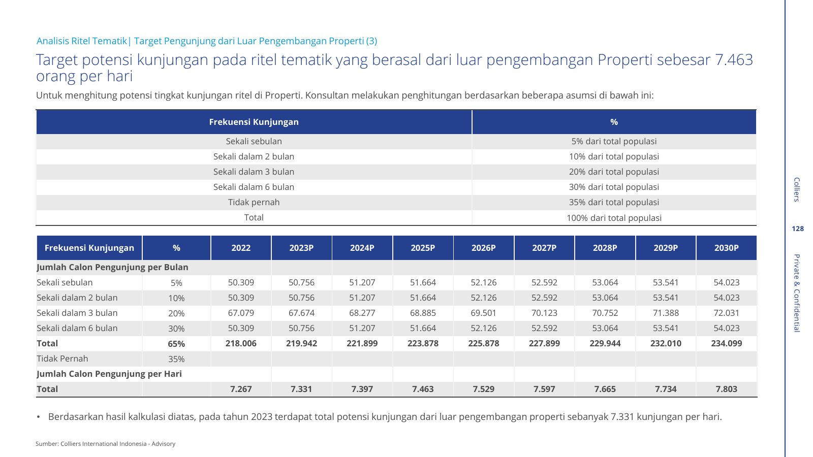
<!-- END COMPLETE PAGE RENDER: SLIDE 128 -->

| FrekuensiKunjungan | % |
| :--- | :--- |
| Sekali sebulan | 5% daritotal populasi |
| Sekali dalam 2 bulan | 10% daritotal populasi |
| Sekali dalam 3 bulan | 20% daritotal populasi |
| Sekali dalam 6 bulan | 30% dari total populasi |
| Tidak pernah | 35% daritotal populasi |
| Total | 100% daritotal populasi |

| FrekuensiKunjungan | % | 2022 | 2023P | 2024P | 2025P | 2026P | 2027P | 2028P | 2029P | 2030P |
| :--- | :--- | :--- | :--- | :--- | :--- | :--- | :--- | :--- | :--- | :--- |
| JumlahCalon Pengunjungper Bulan |  |  |  |  |  |  |  |  |  |  |
| Sekali sebulan | 5% | 50.309 | 50.756 | 51.207 | 51.664 | 52.126 | 52.592 | 53.064 | 53.541 | 54.023 |
| Sekali dalam 2 bulan | 10% | 50.309 | 50.756 | 51.207 | 51.664 | 52.126 | 52.592 | 53.064 | 53.541 | 54.023 |
| Sekali dalam 3 bulan | 20% | 67.079 | 67.674 | 68.277 | 68.885 | 69.501 | 70.123 | 70.752 | 71.388 | 72.031 |
| Sekali dalam 6 bulan | 30% | 50.309 | 50.756 | 51.207 | 51.664 | 52.126 | 52.592 | 53.064 | 53.541 | 54.023 |
| Total | 65% | 218.006 | 219.942 | 221.899 | 223.878 | 225.878 | 227.899 | 229.944 | 232.010 | 234.099 |
| TidakPernah | 35% |  |  |  |  |  |  |  |  |  |
| JumlahCalon Pengunjungper Hari |  |  |  |  |  |  |  |  |  |  |
| Total |  | 7.267 | 7.331 | 7.397 | 7.463 | 7.529 | 7.597 | 7.665 | 7.734 | 7.803 |

Jumlah Calon Pengunjung per Bulan

Tidak Pernah 35%

Jumlah Calon Pengunjung per Hari

> **Sumber: Colliers International Indonesia - Advisory**

Frekuensi Kunjungan %

- 
  Berdasarkan hasil kalkulasi diatas, pada tahun 2023 terdapat total potensi kunjungan dari luar pengembangan properti sebanyak 7.331 kunjungan per hari.

Untuk menghitung potensi tingkat kunjungan ritel di Properti. Konsultan melakukan penghitungan berdasarkan beberapa asumsi di bawah ini:

---

#### Slide 129: Analisis Ritel Tematik – Target Pengunjung Target potensi kunjungan pada ritel tematik di pengembangan Properti sebesar 9.005 orang per hari

<!-- BEGIN COMPLETE PAGE RENDER: SLIDE 129 -->
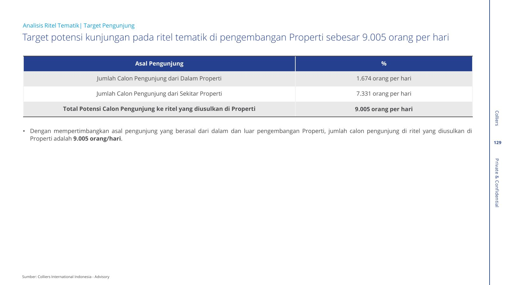
<!-- END COMPLETE PAGE RENDER: SLIDE 129 -->

| AsalPengunjung | % |
| :--- | :--- |
| Jumlah Calon Pengunjung dari Dalam Properti | 1.674 orang per hari |
| Jumlah Calon Pengunjung dari Sekitar Properti | 7.331 orang per hari |
| Total PotensiCalon Pengunjung keritelyang diusulkandi Properti | 9.005 orang per hari |

> **Sumber: Colliers International Indonesia - Advisory**

Asal Pengunjung %

  Total Potensi Calon Pengunjung ke ritel yang diusulkan di Properti
- **9.** 005 orang per hari

- 
  Dengan mempertimbangkan asal pengunjung yang berasal dari dalam dan luar pengembangan Properti, jumlah calon pengunjung di ritel yang diusulkan di
  Properti adalah 9.005 orang/hari.

---

#### Slide 130: Analisis Ritel Tematik – Rekomendasi Konsep Ritel di Proeprti – Rekomendasi konsep ritel di Properti berupa ritel tematik indoor dengan dominasi bauran pasar yang  berasal dari sektor food and beverage dan cinderamata/souvenir dengan brand lokal

<!-- BEGIN COMPLETE PAGE RENDER: SLIDE 130 -->
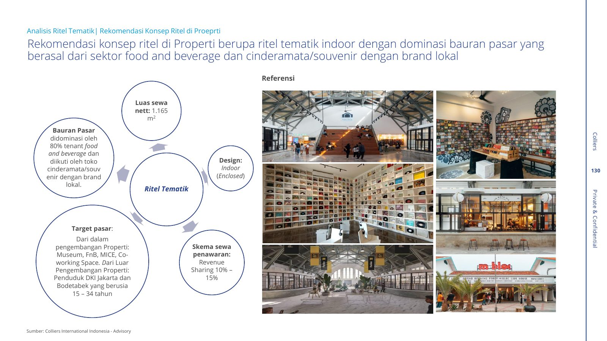
<!-- END COMPLETE PAGE RENDER: SLIDE 130 -->

> **Sumber: Colliers International Indonesia - Advisory**

Ritel Tematik

Luas sewa nett: 1.165

m2

Design:

Indoor (Enclosed)

Skema sewa

penawaran:

Revenue Sharing 10% –

15%

Target pasar:

Dari dalam pengembangan Properti:

Museum, FnB, MICE, Co- working Space. Dari Luar Pengembangan Properti: Penduduk DKI Jakarta dan

Bodetabek yang berusia

15 – 34 tahun

Bauran Pasar didominasi oleh 80% tenant food and beverage dan

diikuti oleh toko cinderamata/souv enir dengan brand

lokal.

Referensi

---

#### Slide 131: Analisis Ritel Tematik – Rekomendasi Konsep Ritel di Proeprti Ritel Tematik yang direkomendasikan menggunakan skema revenue sharing

<!-- BEGIN COMPLETE PAGE RENDER: SLIDE 131 -->
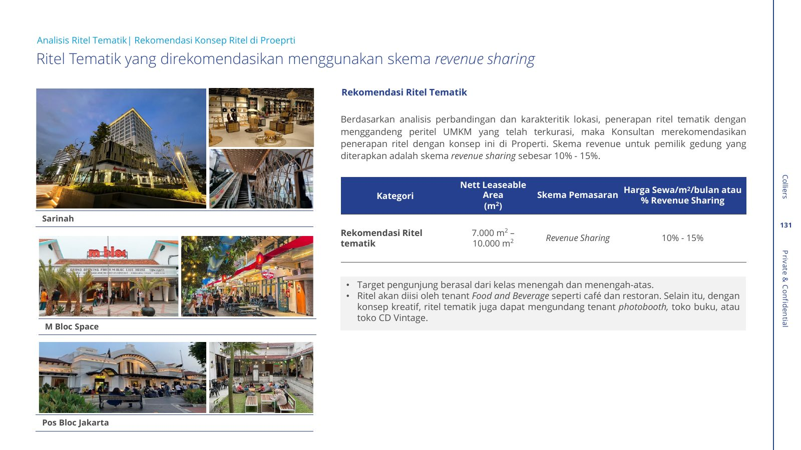
<!-- END COMPLETE PAGE RENDER: SLIDE 131 -->

| Kategori | NettLeaseable Area (m2) | Skema Pemasaran | Harga Sewa/m2/bulan atau % Revenue Sharing |
| :--- | :--- | :--- | :--- |
| RekomendasiRitel tematik | 7.000 m2– 10.000 m2 | Revenue Sharing | 10% -15% |

Sarinah

M Bloc Space

Pos Bloc Jakarta

- 
  Target pengunjung berasal dari kelas menengah dan menengah-atas.
- 
  Ritel akan diisi oleh tenant Food and Beverage seperti café dan restoran. Selain itu, dengan
  konsep kreatif, ritel tematik juga dapat mengundang tenant photobooth, toko buku, atau
  toko CD Vintage.

Kategori

Nett Leaseable

Area

(m2)

% Revenue Sharing

Rekomendasi Ritel tematik

Berdasarkan analisis perbandingan dan karakteritik lokasi, penerapan ritel tematik dengan menggandeng peritel UMKM yang telah terkurasi, maka Konsultan merekomendasikan penerapan ritel dengan konsep ini di Properti. Skema revenue untuk pemilik gedung yang diterapkan adalah skema revenue sharing sebesar 10% - 15%.

Rekomendasi Ritel Tematik

---

### 6.4 Analisis Co-Working Space

#### Slide 132: Co-Working Space

<!-- BEGIN COMPLETE PAGE RENDER: SLIDE 132 -->

<!-- END COMPLETE PAGE RENDER: SLIDE 132 -->

6.4

---

#### Slide 133: Analisis Co-Working Space – Kriteria Seleksi Terdapat sembilan (9) Co-Working Space yang terpilih sebagai pesaing

<!-- BEGIN COMPLETE PAGE RENDER: SLIDE 133 -->
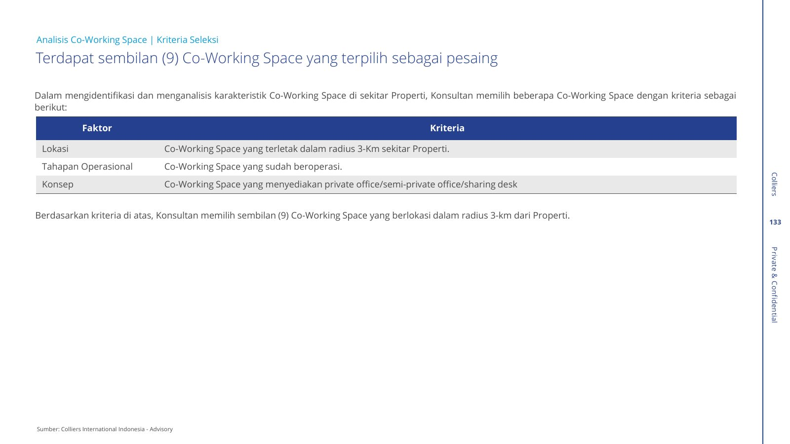
<!-- END COMPLETE PAGE RENDER: SLIDE 133 -->

| Faktor | Kriteria |
| :--- | :--- |
| Lokasi | Co-Working Space yang terletakdalamradius 3-Km sekitar Properti. |
| TahapanOperasional | Co-Working Space yang sudah beroperasi. |
| Konsep | Co-Working Space yang menyediakanprivate office/semi-private office/sharing desk |

Dalam mengidentifikasi dan menganalisis karakteristik Co-Working Space di sekitar Properti, Konsultan memilih beberapa Co-Working Space dengan kriteria sebagai berikut:

Faktor Kriteria

Lokasi Co-Working Space yang terletak dalam radius 3-Km sekitar Properti.

Tahapan Operasional Co-Working Space yang sudah beroperasi.

Berdasarkan kriteria di atas, Konsultan memilih sembilan (9) Co-Working Space yang berlokasi dalam radius 3-km dari Properti.

> **Sumber: Colliers International Indonesia - Advisory**

---

#### Slide 134: Analisis Co-Working Space – Peta Pesaing Sebagian besar Co-Working Space pesaing berlokasi di Jakarta Pusat, mengarah ke area CBD Jakarta

<!-- BEGIN COMPLETE PAGE RENDER: SLIDE 134 -->
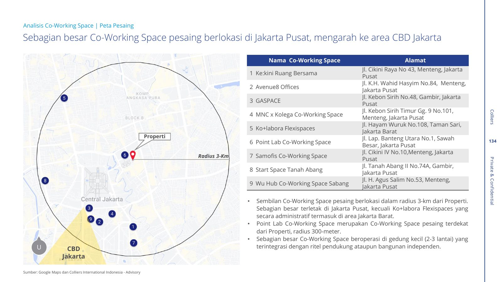
<!-- END COMPLETE PAGE RENDER: SLIDE 134 -->

| Nama Co-Working Space | Kolom 2 | Alamat |
| :--- | :--- | :--- |
| 1 | Ke:kiniRuang Bersama | Jl. CikiniRaya No 43, Menteng, Jakarta Pusat |
| 2 | Avenue8 Offices | Jl. K.H. Wahid Hasyim No.84, Menteng, Jakarta Pusat |
| 3 | GASPACE | Jl. Kebon Sirih No.48, Gambir, Jakarta Pusat |
| 4 | MNC x Kolega Co-Working Space | Jl. KebonSirihTimur Gg. 9 No.101, Menteng, Jakarta Pusat |
| 5 | Ko+labora Flexispaces | Jl. Hayam Wuruk No.108, Taman Sari, Jakarta Barat |
| 6 | Point Lab Co-Working Space | Jl. Lap. BantengUtara No.1, Sawah Besar, Jakarta Pusat |
| 7 | SamofisCo-Working Space | Jl. CikiniIV No.10,Menteng, Jakarta Pusat |
| 8 | Start Space Tanah Abang | Jl. Tanah AbangII No.74A, Gambir, Jakarta Pusat |
| 9 | Wu Hub Co-Working Space Sabang | Jl. H. Agus Salim No.53, Menteng, Jakarta Pusat |

Properti

U

Radius 3-Km

- 
  Sembilan Co-Working Space pesaing berlokasi dalam radius 3-km dari Properti.
  Sebagian besar terletak di Jakarta Pusat, kecuali Ko+labora Flexispaces yang
  secara administratif termasuk di area Jakarta Barat.
- 
  Point Lab Co-Working Space merupakan Co-Working Space pesaing terdekat
  dari Properti, radius 300-meter.
- 
  Sebagian besar Co-Working Space beroperasi di gedung kecil (2-3 lantai) yang
  terintegrasi dengan ritel pendukung ataupun bangunan independen.

1 Ke:kini Ruang Bersama Jl. Cikini Raya No 43, Menteng, Jakarta Pusat

7 Samofis Co-Working Space Jl. Cikini IV No.10,Menteng, Jakarta Pusat

CBD Jakarta

> **Sumber: Google Maps dan Colliers International Indonesia - Advisory**

---

#### Slide 135: Analisis Co-Working Space – Informasi Umum Seluruh Co-Working Space menyediakan sharing desk (mayoritas juga menyediakan private office) dan  baru beroperasi dalam 7 tahun terakhir

<!-- BEGIN COMPLETE PAGE RENDER: SLIDE 135 -->
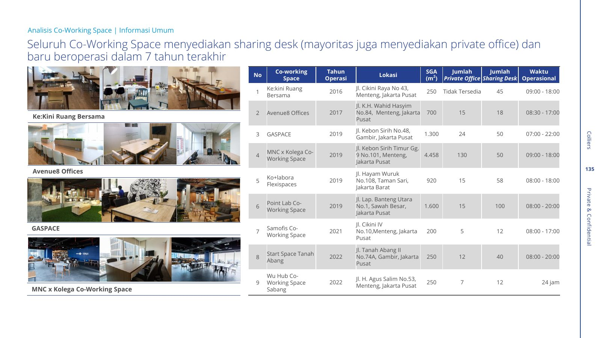
<!-- END COMPLETE PAGE RENDER: SLIDE 135 -->

| No | Co-working Space | Tahun Operasi | Lokasi | SGA (m2) | Jumlah Private Office | Jumlah Sharing Desk | Waktu Operasional |
| :--- | :--- | :--- | :--- | :--- | :--- | :--- | :--- |
| 1 | Ke:kiniRuang Bersama | 2016 | Jl. CikiniRaya No 43, Menteng, Jakarta Pusat | 250 | Tidak Tersedia | 45 | 09:00 -18:00 |
| 2 | Avenue8 Offices | 2017 | Jl. K.H. Wahid Hasyim No.84, Menteng, Jakarta Pusat | 700 | 15 | 18 | 08:30 -17:00 |
| 3 | GASPACE | 2019 | Jl. Kebon Sirih No.48, Gambir, Jakarta Pusat | 1.300 | 24 | 50 | 07:00 -22:00 |
| 4 | MNC x Kolega Co- Working Space | 2019 | Jl. Kebon Sirih Timur Gg. 9 No.101, Menteng, Jakarta Pusat | 4.458 | 130 | 50 | 09:00 -18:00 |
| 5 | Ko+labora Flexispaces | 2019 | Jl. Hayam Wuruk No.108, Taman Sari, Jakarta Barat | 920 | 15 | 58 | 08:00 -18:00 |
| 6 | Point Lab Co- Working Space | 2019 | Jl. Lap. Banteng Utara No.1, Sawah Besar, Jakarta Pusat | 1.600 | 15 | 100 | 08:00 -20:00 |
| 7 | Samofis Co- Working Space | 2021 | Jl. Cikini IV No.10,Menteng, Jakarta Pusat | 200 | 5 | 12 | 08:00 -17:00 |
| 8 | Start Space Tanah Abang | 2022 | Jl. Tanah AbangII No.74A, Gambir, Jakarta Pusat | 250 | 12 | 40 | 08:00 -20:00 |
| 9 | Wu Hub Co- Working Space Sabang | 2022 | Jl. H. Agus Salim No.53, Menteng, Jakarta Pusat | 250 | 7 | 12 | 24 jam |

No Co-working

Space

Jumlah Private Office

Jumlah Sharing Desk

Waktu Operasional

Ke:Kini Ruang Bersama

Avenue8 Offices

GASPACE

---

#### Slide 136: Analisis Co-Working Space – Informasi Umum Co-Working space umumnya menyediakan Private Office dengan kapasitas 2-10 orang dan 12-50 Sharing  Desk

<!-- BEGIN COMPLETE PAGE RENDER: SLIDE 136 -->
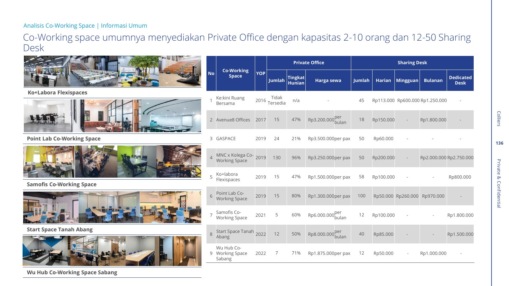
<!-- END COMPLETE PAGE RENDER: SLIDE 136 -->

| No | Co-Working Space | YOP | Private Office | Kolom 5 | Kolom 6 | Kolom 7 | Sharing Desk | Kolom 9 | Kolom 10 | Kolom 11 | Kolom 12 |
| :--- | :--- | :--- | :--- | :--- | :--- | :--- | :--- | :--- | :--- | :--- | :--- |
|  |  |  | Jumlah | Tingkat Hunian | Harga sewa |  | Jumlah | Harian | Mingguan | Bulanan | Dedicated Desk |
| 1 | Ke:kiniRuang Bersama | 2016 | Tidak Tersedia | n/a | - |  | 45 | Rp113.000 | Rp600.000 | Rp1.250.000 | - |
| 2 | Avenue8 Offices | 2017 | 15 | 47% | Rp3.200.000 | per bulan | 18 | Rp150.000 | - | Rp1.800.000 | - |
| 3 | GASPACE | 2019 | 24 | 21% | Rp3.500.000 | per pax | 50 | Rp60.000 | - | - | - |
| 4 | MNC x Kolega Co- Working Space | 2019 | 130 | 96% | Rp3.250.000 | per pax | 50 | Rp200.000 | - | Rp2.000.000 | Rp2.750.000 |
| 5 | Ko+labora Flexispaces | 2019 | 15 | 47% | Rp1.500.000 | per pax | 58 | Rp100.000 | - | - | Rp800.000 |
| 6 | Point Lab Co- Working Space | 2019 | 15 | 80% | Rp1.300.000 | per pax | 100 | Rp50.000 | Rp260.000 | Rp970.000 | - |
| 7 | SamofisCo- Working Space | 2021 | 5 | 60% | Rp6.000.000 | per bulan | 12 | Rp100.000 | - | - | Rp1.800.000 |
| 8 | Start Space Tanah Abang | 2022 | 12 | 50% | Rp8.000.000 | per bulan | 40 | Rp85.000 | - | - | Rp1.500.000 |
| 9 | Wu Hub Co- Working Space Sabang | 2022 | 7 | 71% | Rp1.875.000 | per pax | 12 | Rp50.000 | - | Rp1.000.000 | - |

Ko+Labora Flexispaces

Samofis Co-Working Space

Start Space Tanah Abang

No Co-Working

Space YOP

Private Office Sharing Desk

Jumlah Tingkat

Desk

---

#### Slide 137: Analisis Co-Working Space – Tingkat Hunian dan Jumlah Pengguna – Tingkat hunian private office sebesar 20% - 60% dan jumlah pengguna harian sharing desk sebanyak 5 – 40 orang

<!-- BEGIN COMPLETE PAGE RENDER: SLIDE 137 -->
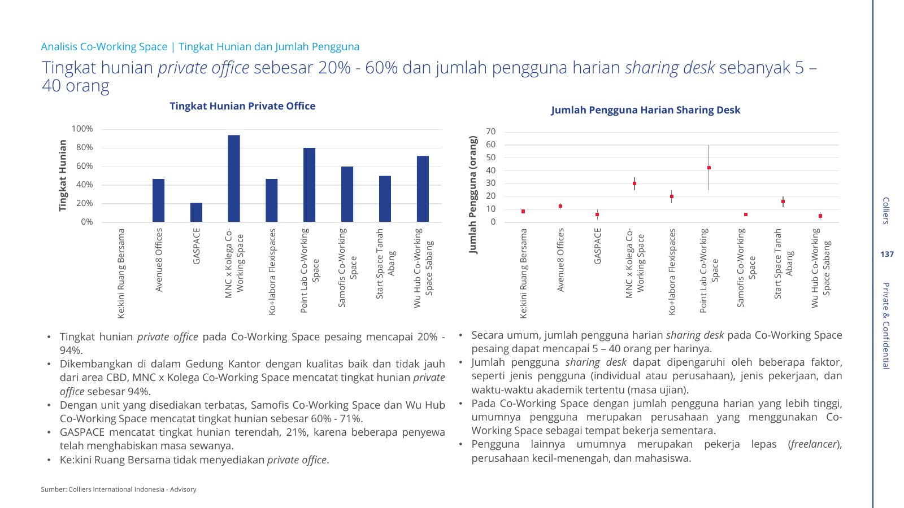
<!-- END COMPLETE PAGE RENDER: SLIDE 137 -->

- 
  Tingkat hunian private office pada Co-Working Space pesaing mencapai 20% -
  94%.
- 
  Dikembangkan di dalam Gedung Kantor dengan kualitas baik dan tidak jauh
  dari area CBD, MNC x Kolega Co-Working Space mencatat tingkat hunian private
  office sebesar 94%.
- 
  Dengan unit yang disediakan terbatas, Samofis Co-Working Space dan Wu Hub
  Co-Working Space mencatat tingkat hunian sebesar 60% - 71%.
- 
  GASPACE mencatat tingkat hunian terendah, 21%, karena beberapa penyewa
  telah menghabiskan masa sewanya.
- 
  Ke:kini Ruang Bersama tidak menyediakan private office.

0%

20%

40%

60%

80%

100%

Ke:kini Ruang Bersama

Avenue8 Offices

GASPACE

MNC x Kolega Co-

Working Space

Ko+labora Flexispaces

Point Lab Co-Working

Space

Samofis Co-Working

Space

Start Space Tanah

Abang

Wu Hub Co-Working

Space Sabang

Tingkat Hunian

Tingkat Hunian Private Office

0

10

20

30

40

50

60

70

Ke:kini Ruang Bersama

Avenue8 Offices

GASPACE

MNC x Kolega Co-

Working Space

Ko+labora Flexispaces

Point Lab Co-Working

Space

Samofis Co-Working

Space

Start Space Tanah

Abang

Wu Hub Co-Working

Space Sabang

Jumlah Pengguna (orang)

Jumlah Pengguna Harian Sharing Desk

- 
  Secara umum, jumlah pengguna harian sharing desk pada Co-Working Space
  pesaing dapat mencapai 5 – 40 orang per harinya.
- 
  Jumlah pengguna sharing desk dapat dipengaruhi oleh beberapa faktor,
  seperti jenis pengguna (individual atau perusahaan), jenis pekerjaan, dan
  waktu-waktu akademik tertentu (masa ujian).
- 
  Pada Co-Working Space dengan jumlah pengguna harian yang lebih tinggi,
  umumnya pengguna merupakan perusahaan yang menggunakan Co-
  Working Space sebagai tempat bekerja sementara.
- 
  Pengguna
  lainnya
  umumnya
  merupakan
  pekerja
  lepas
  (freelancer),
  perusahaan kecil-menengah, dan mahasiswa.

> **Sumber: Colliers International Indonesia - Advisory**

---

#### Slide 138: Analisis Co-Working Space – Fasilitas Fasilitas yang umum disediakan oleh Co-Working Space pesaing adalah ruang pertemuan, fasilitas print /  fotokopi, dan pantry

<!-- BEGIN COMPLETE PAGE RENDER: SLIDE 138 -->
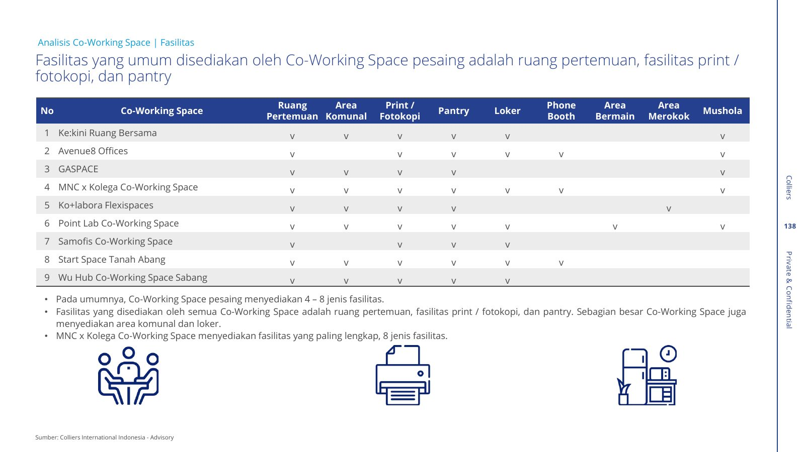
<!-- END COMPLETE PAGE RENDER: SLIDE 138 -->

| No | Co-Working Space | Ruang Pertemuan | Area Komunal | Print / Fotokopi | Pantry | Loker | Phone Booth | Area Bermain | Area Merokok | Mushola |
| :--- | :--- | :--- | :--- | :--- | :--- | :--- | :--- | :--- | :--- | :--- |
| 1 | Ke:kiniRuang Bersama | v | v | v | v | v |  |  |  | v |
| 2 | Avenue8 Offices | v |  | v | v | v | v |  |  | v |
| 3 | GASPACE | v | v | v | v |  |  |  |  | v |
| 4 | MNC x Kolega Co-Working Space | v | v | v | v | v | v |  |  | v |
| 5 | Ko+laboraFlexispaces | v | v | v | v |  |  |  | v |  |
| 6 | Point Lab Co-Working Space | v | v | v | v | v |  | v |  | v |
| 7 | SamofisCo-Working Space | v |  | v | v | v |  |  |  |  |
| 8 | Start Space Tanah Abang | v | v | v | v | v | v |  |  |  |
| 9 | Wu Hub Co-Working Space Sabang | v | v | v | v | v |  |  |  |  |

Area Komunal

Booth

Area Bermain

Area Merokok Mushola

5 Ko+labora Flexispaces v v v v v

- 
  Pada umumnya, Co-Working Space pesaing menyediakan 4 – 8 jenis fasilitas.
- 
  Fasilitas yang disediakan oleh semua Co-Working Space adalah ruang pertemuan, fasilitas print / fotokopi, dan pantry. Sebagian besar Co-Working Space juga
  menyediakan area komunal dan loker.
- 
  MNC x Kolega Co-Working Space menyediakan fasilitas yang paling lengkap, 8 jenis fasilitas.

> **Sumber: Colliers International Indonesia - Advisory**

---

#### Slide 139: Analisis Co-Working Space – Bauran Pasar Perusahaan yang bergerak di bidang teknologi komunikasi, jasa perusahaan, dan jasa lainnya memiliki kontribusi yang dominan sebagai penyewa Co-Working Space

<!-- BEGIN COMPLETE PAGE RENDER: SLIDE 139 -->
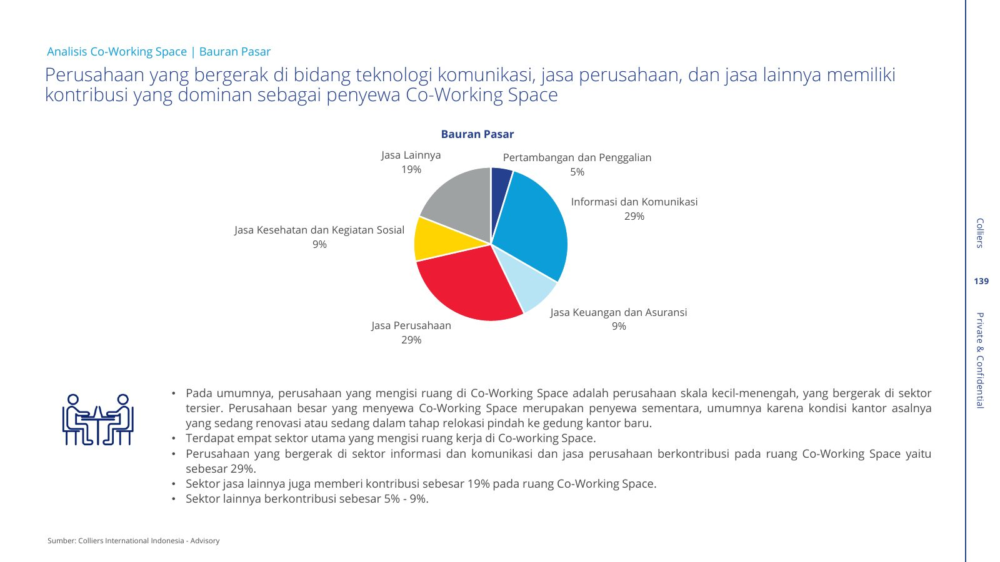
<!-- END COMPLETE PAGE RENDER: SLIDE 139 -->

Pertambangan dan Penggalian

5%

Informasi dan Komunikasi

29%

Jasa Keuangan dan Asuransi

9% Jasa Perusahaan

29%

Jasa Kesehatan dan Kegiatan Sosial

9%

Jasa Lainnya

19%

Bauran Pasar

- 
  Pada umumnya, perusahaan yang mengisi ruang di Co-Working Space adalah perusahaan skala kecil-menengah, yang bergerak di sektor
- **tersier.** Perusahaan besar yang menyewa Co-Working Space merupakan penyewa sementara, umumnya karena kondisi kantor asalnya
  yang sedang renovasi atau sedang dalam tahap relokasi pindah ke gedung kantor baru.
- 
  Terdapat empat sektor utama yang mengisi ruang kerja di Co-working Space.
- 
  Perusahaan yang bergerak di sektor informasi dan komunikasi dan jasa perusahaan berkontribusi pada ruang Co-Working Space yaitu
  sebesar 29%.
- 
  Sektor jasa lainnya juga memberi kontribusi sebesar 19% pada ruang Co-Working Space.
- 
  Sektor lainnya berkontribusi sebesar 5% - 9%.

> **Sumber: Colliers International Indonesia - Advisory**

---

#### Slide 140: Analisis Co-Working Space – Potensi Pasar Kontribusi 3 sektor pasar dominan di kawasan pesaing terhadap PDRB Jakarta Pusat Tahun 2022

<!-- BEGIN COMPLETE PAGE RENDER: SLIDE 140 -->
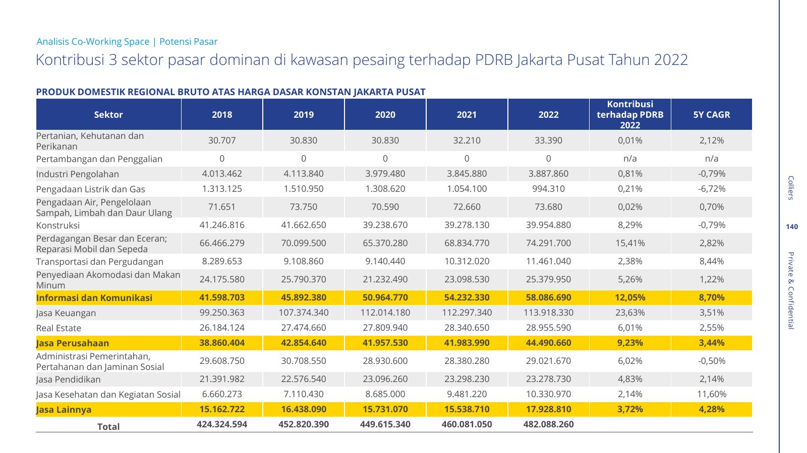
<!-- END COMPLETE PAGE RENDER: SLIDE 140 -->

| Sektor | 2018 | 2019 | 2020 | 2021 | 2022 | Kontribusi terhadapPDRB 2022 | 5Y CAGR |
| :--- | :--- | :--- | :--- | :--- | :--- | :--- | :--- |
| Pertanian, Kehutanandan Perikanan | 30.707 | 30.830 | 30.830 | 32.210 | 33.390 | 0,01% | 2,12% |
| Pertambangandan Penggalian | 0 | 0 | 0 | 0 | 0 | n/a | n/a |
| Industri Pengolahan | 4.013.462 | 4.113.840 | 3.979.480 | 3.845.880 | 3.887.860 | 0,81% | -0,79% |
| PengadaanListrik dan Gas | 1.313.125 | 1.510.950 | 1.308.620 | 1.054.100 | 994.310 | 0,21% | -6,72% |
| PengadaanAir, Pengelolaan Sampah, Limbahdan DaurUlang | 71.651 | 73.750 | 70.590 | 72.660 | 73.680 | 0,02% | 0,70% |
| Konstruksi | 41.246.816 | 41.662.650 | 39.238.670 | 39.278.130 | 39.954.880 | 8,29% | -0,79% |
| PerdaganganBesar dan Eceran; ReparasiMobil dan Sepeda | 66.466.279 | 70.099.500 | 65.370.280 | 68.834.770 | 74.291.700 | 15,41% | 2,82% |
| Transportasidan Pergudangan | 8.289.653 | 9.108.860 | 9.140.440 | 10.312.020 | 11.461.040 | 2,38% | 8,44% |
| Penyediaan Akomodasi dan Makan Minum | 24.175.580 | 25.790.370 | 21.232.490 | 23.098.530 | 25.379.950 | 5,26% | 1,22% |
| Informasidan Komunikasi | 41.598.703 | 45.892.380 | 50.964.770 | 54.232.330 | 58.086.690 | 12,05% | 8,70% |
| Jasa Keuangan | 99.250.363 | 107.374.340 | 112.014.180 | 112.297.340 | 113.918.330 | 23,63% | 3,51% |
| Real Estate | 26.184.124 | 27.474.660 | 27.809.940 | 28.340.650 | 28.955.590 | 6,01% | 2,55% |
| Jasa Perusahaan | 38.860.404 | 42.854.640 | 41.957.530 | 41.983.990 | 44.490.660 | 9,23% | 3,44% |
| Administrasi Pemerintahan, Pertahanan dan Jaminan Sosial | 29.608.750 | 30.708.550 | 28.930.600 | 28.380.280 | 29.021.670 | 6,02% | -0,50% |
| Jasa Pendidikan | 21.391.982 | 22.576.540 | 23.096.260 | 23.298.230 | 23.278.730 | 4,83% | 2,14% |
| Jasa Kesehatan dan Kegiatan Sosial | 6.660.273 | 7.110.430 | 8.685.000 | 9.481.220 | 10.330.970 | 2,14% | 11,60% |
| Jasa Lainnya | 15.162.722 | 16.438.090 | 15.731.070 | 15.538.710 | 17.928.810 | 3,72% | 4,28% |
| Total | 424.324.594 | 452.820.390 | 449.615.340 | 460.081.050 | 482.088.260 |  |  |

Sektor 2018 2019 2020 2021 2022 Kontribusi terhadap PDRB

2022 5Y CAGR

Pengadaan Air, Pengelolaan Sampah, Limbah dan Daur Ulang 71.651 73.750 70.590 72.660 73.680 0,02% 0,70%

PRODUK DOMESTIK REGIONAL BRUTO ATAS HARGA DASAR KONSTAN JAKARTA PUSAT

---

#### Slide 141: Analisis Co-Working Space – Potensi Pasar Sektor ekonomi penggerak permintaan akan ruang kantor (termasuk Co-Working Space) memiliki peran yang signifikan dalam aktivitas ekonomi di Jakarta Pusat

<!-- BEGIN COMPLETE PAGE RENDER: SLIDE 141 -->
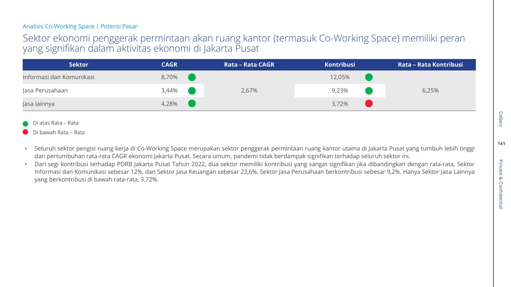
<!-- END COMPLETE PAGE RENDER: SLIDE 141 -->

| Sektor | CAGR | Rata –Rata CAGR | Kontribusi | Rata –Rata Kontribusi |
| :--- | :--- | :--- | :--- | :--- |
| Informasidan Komunikasi | 8,70% | 2,67% | 12,05% | 6,25% |
| Jasa Perusahaan | 3,44% |  | 9,23% |  |
| Jasa lainnya | 4,28% |  | 3,72% |  |

Informasi dan Komunikasi 8,70%

2,67%

12,05%

- 
  Seluruh sektor pengisi ruang kerja di Co-Working Space merupakan sektor penggerak permintaan ruang kantor utama di Jakarta Pusat yang tumbuh lebih tinggi
  dari pertumbuhan rata-rata CAGR ekonomi Jakarta Pusat. Secara umum, pandemi tidak berdampak signifikan terhadap seluruh sektor ini.
- 
  Dari segi kontribusi terhadap PDRB Jakarta Pusat Tahun 2022, dua sektor memiliki kontribusi yang sangat signifikan jika dibandingkan dengan rata-rata, Sektor
  Informasi dan Komunikasi sebesar 12%, dan Sektor Jasa Keuangan sebesar 23,6%. Sektor Jasa Perusahaan berkontribusi sebesar 9,2%. Hanya Sektor Jasa Lainnya
  yang berkontribusi di bawah rata-rata, 3,72%.

Di atas Rata – Rata

Di bawah Rata – Rata

---

#### Slide 142: Analisis Co-Working Space – Kriteria Skoring Rekomendasi Tarif Sewa Terdapat tujuh kriteria dalam melakukan penilaian untuk rekomendasi tarif sewa sharing desk di Properti

<!-- BEGIN COMPLETE PAGE RENDER: SLIDE 142 -->
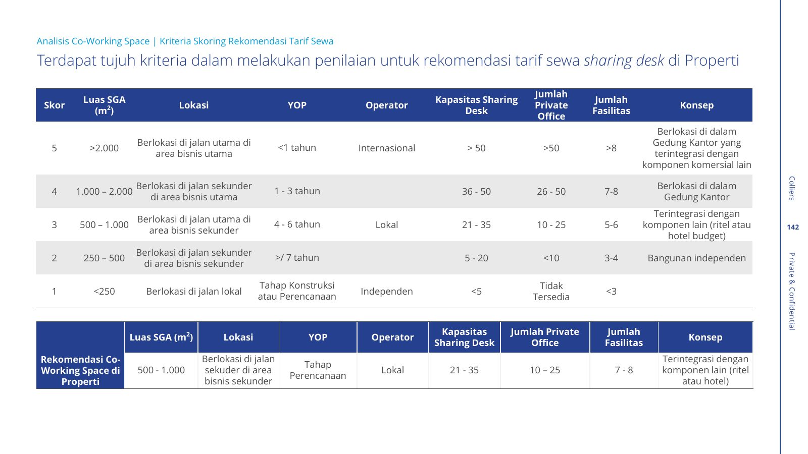
<!-- END COMPLETE PAGE RENDER: SLIDE 142 -->

Skor Luas SGA

Desk

Jumlah Private

Office

Jumlah Fasilitas Konsep

5 >2.000 Berlokasi di jalan utama di

area bisnis utama <1 tahun Internasional > 50 >50 >8

Berlokasi di dalam Gedung Kantor yang

terintegrasi dengan komponen komersial lain

  4
- **1.** 000 – 2.000 Berlokasi di jalan sekunder
  di area bisnis utama
  1 - 3 tahun
  36 - 50
  26 - 50
  7-8
  Berlokasi di dalam

Gedung Kantor

3 500 – 1.000 Berlokasi di jalan utama di

area bisnis sekunder 4 - 6 tahun Lokal 21 - 35 10 - 25 5-6 Terintegrasi dengan komponen lain (ritel atau

hotel budget)

2 250 – 500 Berlokasi di jalan sekunder

di area bisnis sekunder >/ 7 tahun 5 - 20 <10 3-4 Bangunan independen

1 <250 Berlokasi di jalan lokal Tahap Konstruksi atau Perencanaan Independen <5 Tidak Tersedia <3

Jumlah Private

Office

Jumlah Fasilitas Konsep

Rekomendasi Co- Working Space di

Properti

sekuder di area bisnis sekunder

Tahap Perencanaan Lokal 21 - 35 10 – 25 7 - 8 Terintegrasi dengan komponen lain (ritel

atau hotel)

---

#### Slide 143: Analisis Co-Working Space – Hasil Skoring Rekomendasi Tarif Sewa – Tarif sewa harian sharing desk yang direkomendasikan untuk Co-Working Space pada Properti adalah sebesar Rp105.822 per orang per hari

<!-- BEGIN COMPLETE PAGE RENDER: SLIDE 143 -->
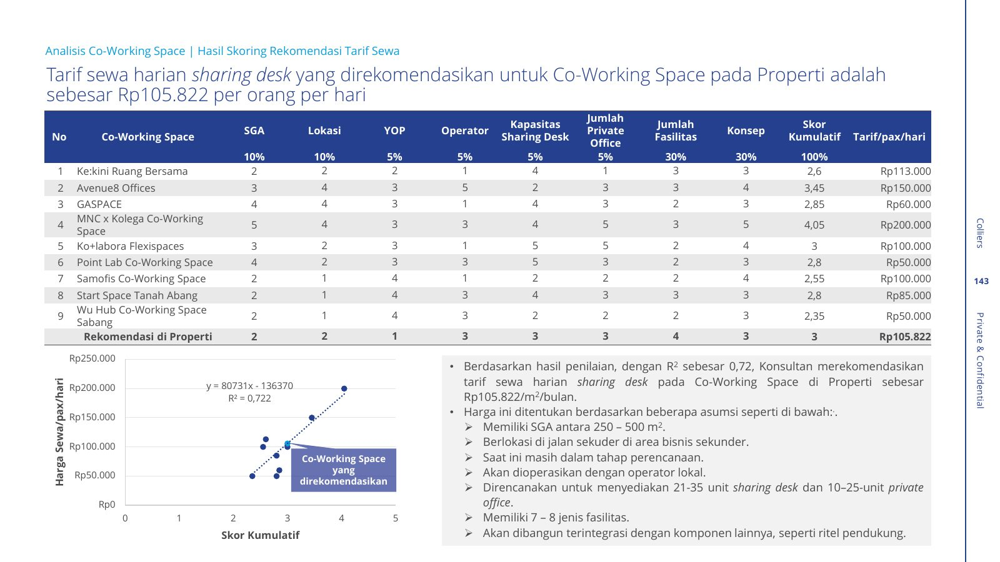
<!-- END COMPLETE PAGE RENDER: SLIDE 143 -->

| No | Co-Working Space | SGA | Lokasi | YOP | Operator | Kapasitas Sharing Desk | Jumlah Private Office | Jumlah Fasilitas | Konsep | Skor Kumulatif | Tarif/pax/hari |
| :--- | :--- | :--- | :--- | :--- | :--- | :--- | :--- | :--- | :--- | :--- | :--- |
|  |  | 10% | 10% | 5% | 5% | 5% | 5% | 30% | 30% | 100% |  |

y = 80731x - 136370

R² = 0,722

Rp0

Rp50.000

Rp100.000

Rp150.000

Rp200.000

Rp250.000

0 1 2 3 4 5

Harga Sewa/pax/hari

Skor Kumulatif

Jumlah Private

Office

10% 10% 5% 5% 5% 5% 30% 30% 100% 1 Ke:kini Ruang Bersama 2 2 2 1 4 1 3 3 2,6 Rp113.000

2 Avenue8 Offices 3 4 3 5 2 3 3 4 3,45 Rp150.000

3 GASPACE 4 4 3 1 4 3 2 3 2,85 Rp60.000

4 MNC x Kolega Co-Working Space 5 4 3 3 4 5 3 5 4,05 Rp200.000

5 Ko+labora Flexispaces 3 2 3 1 5 5 2 4 3 Rp100.000

6 Point Lab Co-Working Space 4 2 3 3 5 3 2 3 2,8 Rp50.000

7 Samofis Co-Working Space 2 1 4 1 2 2 2 4 2,55 Rp100.000

8 Start Space Tanah Abang 2 1 4 3 4 3 3 3 2,8 Rp85.000

9 Wu Hub Co-Working Space Sabang 2 1 4 3 2 2 2 3 2,35 Rp50.000

Rekomendasi di Properti 2 2 1 3 3 3 4 3 3 Rp105.822

- 
  Berdasarkan hasil penilaian, dengan R2 sebesar 0,72, Konsultan merekomendasikan
  tarif sewa harian sharing desk pada Co-Working Space di Properti sebesar
- **Rp105.** 822/m2/bulan.
- 
  Harga ini ditentukan berdasarkan beberapa asumsi seperti di bawah:..
  ➢
  Memiliki SGA antara 250 – 500 m2.
  ➢
  Berlokasi di jalan sekuder di area bisnis sekunder.
  ➢
  Saat ini masih dalam tahap perencanaan.
  ➢
  Akan dioperasikan dengan operator lokal.
  ➢
  Direncanakan untuk menyediakan 21-35 unit sharing desk dan 10–25-unit private
- **office.** 
  ➢
  Memiliki 7 – 8 jenis fasilitas.
  ➢
  Akan dibangun terintegrasi dengan komponen lainnya, seperti ritel pendukung.

Co-Working Space

yang direkomendasikan

---

### 6.5 Analisis Museum & Galeri Seni

#### Slide 144: Museum

<!-- BEGIN COMPLETE PAGE RENDER: SLIDE 144 -->

<!-- END COMPLETE PAGE RENDER: SLIDE 144 -->

6.5

---

#### Slide 145: Analisis Museum – Kriteria Pesaing Terdapat 6 museum yang terpilih untuk dianalisis lebih lanjut

<!-- BEGIN COMPLETE PAGE RENDER: SLIDE 145 -->
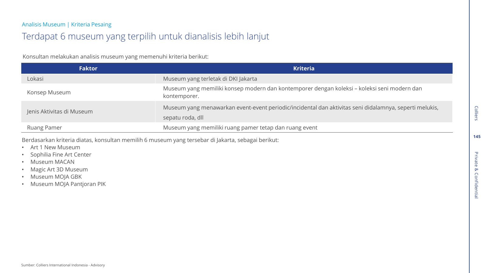
<!-- END COMPLETE PAGE RENDER: SLIDE 145 -->

| Faktor | Kriteria |
| :--- | :--- |
| Lokasi | Museum yang terletakdi DKI Jakarta |
| KonsepMuseum | Museum yang memilikikonsepmodern dan kontemporerdengankoleksi–koleksisenimodern dan kontemporer. |
| JenisAktivitasdi Museum | Museum yang menawarkanevent-event periodic/incidental dan aktivitassenididalamnya, sepertimelukis, sepaturoda, dll |
| Ruang Pamer | Museum yang memilikiruangpamertetapdan ruangevent |

> **Sumber: Colliers International Indonesia - Advisory**

Faktor Kriteria

Lokasi Museum yang terletak di DKI Jakarta

Konsep Museum Museum yang memiliki konsep modern dan kontemporer dengan koleksi – koleksi seni modern dan kontemporer.

Jenis Aktivitas di Museum Museum yang menawarkan event-event periodic/incidental dan aktivitas seni didalamnya, seperti melukis,

sepatu roda, dll

  Berdasarkan kriteria diatas, konsultan memilih 6 museum yang tersebar di Jakarta, sebagai berikut:
- 
  Art 1 New Museum
- 
  Sophilia Fine Art Center
- 
  Museum MACAN
- 
  Magic Art 3D Museum
- 
  Museum MOJA GBK
- 
  Museum MOJA Pantjoran PIK

Konsultan melakukan analisis museum yang memenuhi kriteria berikut:

---

#### Slide 146: Analisis Museum – Peta Pesaing – Ke-enam museum tersebar di seluruh wilayah di Jakarta

<!-- BEGIN COMPLETE PAGE RENDER: SLIDE 146 -->
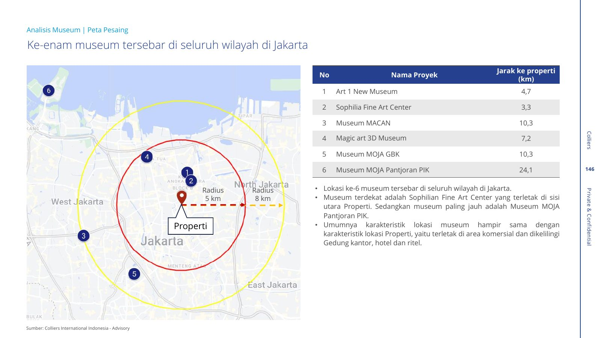
<!-- END COMPLETE PAGE RENDER: SLIDE 146 -->

| No | Nama Proyek | Jarak keproperti (km) |
| :--- | :--- | :--- |
| 1 | Art 1 New Museum | 4,7 |
| 2 | SophiliaFine Art Center | 3,3 |
| 3 | Museum MACAN | 10,3 |
| 4 | Magic art 3D Museum | 7,2 |
| 5 | Museum MOJA GBK | 10,3 |
| 6 | Museum MOJA PantjoranPIK | 24,1 |

> **Sumber: Colliers International Indonesia - Advisory**

No Nama Proyek Jarak ke properti

(km)

2 Sophilia Fine Art Center 3,3

6 Museum MOJA Pantjoran PIK 24,1

- 
  Lokasi ke-6 museum tersebar di seluruh wilayah di Jakarta.
- 
  Museum terdekat adalah Sophilian Fine Art Center yang terletak di sisi
  utara Properti. Sedangkan museum paling jauh adalah Museum MOJA
  Pantjoran PIK.
- 
  Umumnya
  karakteristik
  lokasi
  museum
  hampir
  sama
  dengan
  karakteristik lokasi Properti, yaitu terletak di area komersial dan dikelilingi
  Gedung kantor, hotel dan ritel.

Radius

5 km Radius

8 km

Properti

---

#### Slide 147: Analisis Museum – Informasi Umum Ke-enam museum merupakan museum modern dan kontemporer

<!-- BEGIN COMPLETE PAGE RENDER: SLIDE 147 -->
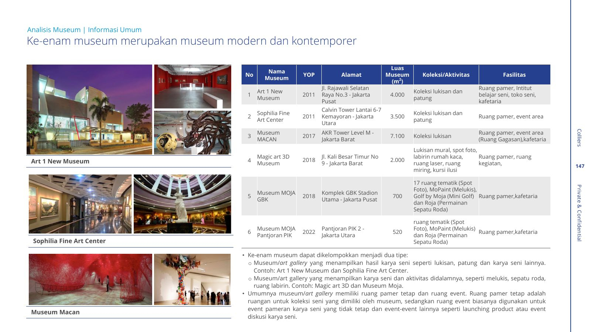
<!-- END COMPLETE PAGE RENDER: SLIDE 147 -->

| No | Nama Museum | YOP | Alamat | Luas Museum (m2) | Koleksi/Aktivitas | Fasilitas |
| :--- | :--- | :--- | :--- | :--- | :--- | :--- |
| 1 | Art 1 New Museum | 2011 | Jl. Rajawali Selatan Raya No.3 -Jakarta Pusat | 4.000 | Koleksilukisandan patung | Ruang pamer, Intitut belajarseni, tokoseni, kafetaria |
| 2 | SophiliaFine Art Center | 2011 | Calvin Tower Lantai 6-7 Kemayoran -Jakarta Utara | 3.500 | Koleksi lukisan dan patung | Ruang pamer, event area |
| 3 | Museum MACAN | 2017 | AKR Tower Level M - Jakarta Barat | 7.100 | Koleksi lukisan | Ruang pamer, event area (Ruang Gagasan),kafetaria |
| 4 | Magic art 3D Museum | 2018 | Jl. Kali BesarTimur No 9 -Jakarta Barat | 2.000 | Lukisan mural, spot foto, labirin rumah kaca, ruang laser, ruang miring, kursi ilusi | Ruang pamer, ruang kegiatan, |
| 5 | Museum MOJA GBK | 2018 | KomplekGBK Stadion Utama -Jakarta Pusat | 700 | 17 ruang tematik (Spot Foto), MoPaint (Melukis), Golf by Moja (Mini Golf) dan Roja (Permainan Sepatu Roda) | Ruang pamer,kafetaria |
| 6 | Museum MOJA PantjoranPIK | 2022 | Pantjoran PIK 2 - Jakarta Utara | 520 | ruang tematik (Spot Foto), MoPaint (Melukis) dan Roja (Permainan Sepatu Roda) | Ruang pamer,kafetaria |

Luas Museum

(m2)

Koleksi/Aktivitas Fasilitas

Ruang pamer, Intitut belajar seni, toko seni, kafetaria

Ruang pamer, ruang kegiatan,

Ruang pamer,kafetaria

Ruang pamer,kafetaria

Art 1 New Museum

Sophilia Fine Art Center

Museum Macan

- Ke-enam museum dapat dikelompokkan menjadi dua tipe:
  o Museum/art gallery yang menampilkan hasil karya seni seperti lukisan, patung dan karya seni lainnya.

Contoh: Art 1 New Museum dan Sophilia Fine Art Center. o Museum/art gallery yang menampilkan karya seni dan aktivitas didalamnya, seperti melukis, sepatu roda,

  ruang labirin. Contoh: Magic art 3D dan Museum Moja.
- Umumnya museum/art gallery memiliki ruang pamer tetap dan ruang event. Ruang pamer tetap adalah
  ruangan untuk koleksi seni yang dimiliki oleh museum, sedangkan ruang event biasanya digunakan untuk
  event pameran karya seni yang tidak tetap dan event-event lainnya seperti launching product atau event
  diskusi karya seni.

---

#### Slide 148: Analisis Museum – Informasi Umum Museum yang menyediakan beragam event juga memiliki tingkat kunjungan yang tinggi

<!-- BEGIN COMPLETE PAGE RENDER: SLIDE 148 -->
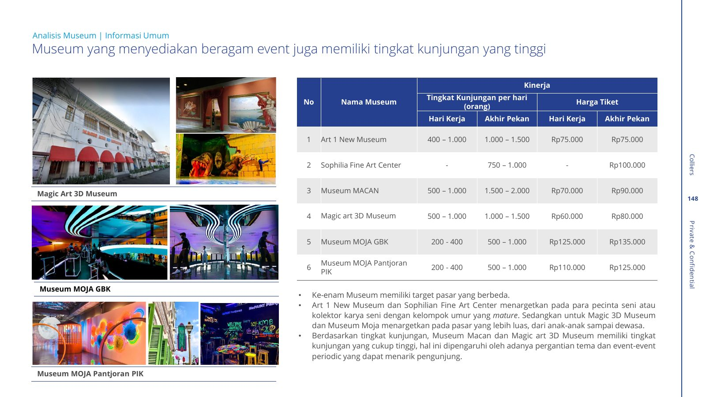
<!-- END COMPLETE PAGE RENDER: SLIDE 148 -->

| No | Nama Museum | Kinerja | Kolom 4 | Kolom 5 | Kolom 6 |
| :--- | :--- | :--- | :--- | :--- | :--- |
|  |  | Tingkat Kunjunganper hari (orang) |  | Harga Tiket |  |
|  |  | Hari Kerja | Akhir Pekan | Hari Kerja | Akhir Pekan |
| 1 | Art 1 New Museum | 400 –1.000 | 1.000 –1.500 | Rp75.000 | Rp75.000 |
| 2 | SophiliaFine Art Center | - | 750 –1.000 | - | Rp100.000 |
| 3 | Museum MACAN | 500 –1.000 | 1.500 –2.000 | Rp70.000 | Rp90.000 |
| 4 | Magic art 3D Museum | 500 –1.000 | 1.000 –1.500 | Rp60.000 | Rp80.000 |
| 5 | Museum MOJA GBK | 200 -400 | 500 –1.000 | Rp125.000 | Rp135.000 |
| 6 | Museum MOJA Pantjoran PIK | 200 -400 | 500 –1.000 | Rp110.000 | Rp125.000 |

No Nama Museum

Kinerja

Tingkat Kunjungan per hari

(orang) Harga Tiket

  2
  Sophilia Fine Art Center
- 
  750 – 1.000
- 
- **Rp100.** 000

Magic Art 3D Museum

Museum MOJA GBK

Museum MOJA Pantjoran PIK

- 
  Ke-enam Museum memiliki target pasar yang berbeda.
- 
  Art 1 New Museum dan Sophilian Fine Art Center menargetkan pada para pecinta seni atau
  kolektor karya seni dengan kelompok umur yang mature. Sedangkan untuk Magic 3D Museum
  dan Museum Moja menargetkan pada pasar yang lebih luas, dari anak-anak sampai dewasa.
- 
  Berdasarkan tingkat kunjungan, Museum Macan dan Magic art 3D Museum memiliki tingkat
  kunjungan yang cukup tinggi, hal ini dipengaruhi oleh adanya pergantian tema dan event-event
  periodic yang dapat menarik pengunjung.

---

#### Slide 149: Analisis Museum – Potensi Pasar Potensi Pasar Museum – Event Tetap

<!-- BEGIN COMPLETE PAGE RENDER: SLIDE 149 -->
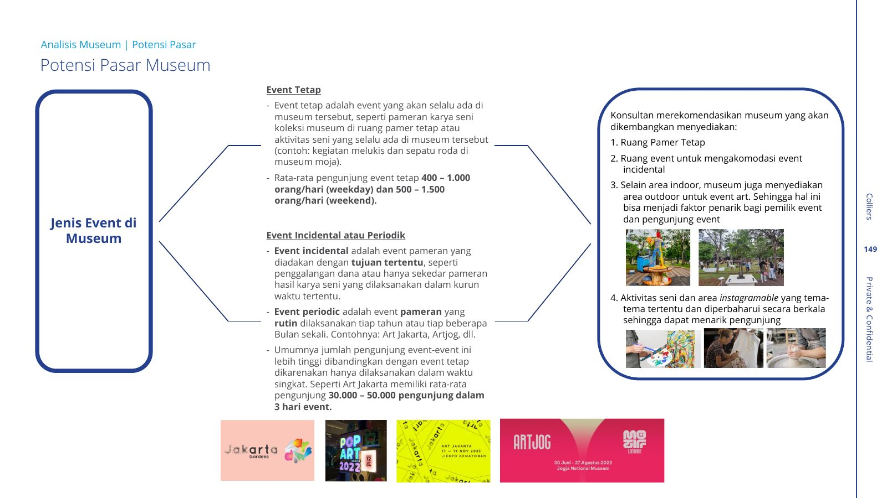
<!-- END COMPLETE PAGE RENDER: SLIDE 149 -->

Jenis Event di

Museum

- Event tetap adalah event yang akan selalu ada di

museum tersebut, seperti pameran karya seni koleksi museum di ruang pamer tetap atau aktivitas seni yang selalu ada di museum tersebut (contoh: kegiatan melukis dan sepatu roda di museum moja).

- Rata-rata pengunjung event tetap 400 – 1.000

orang/hari (weekday) dan 500 – 1.500 orang/hari (weekend).

Event Incidental atau Periodik

- Event incidental adalah event pameran yang

diadakan dengan tujuan tertentu, seperti penggalangan dana atau hanya sekedar pameran hasil karya seni yang dilaksanakan dalam kurun waktu tertentu.

- Event periodic adalah event pameran yang

rutin dilaksanakan tiap tahun atau tiap beberapa Bulan sekali. Contohnya: Art Jakarta, Artjog, dll.

- Umumnya jumlah pengunjung event-event ini

lebih tinggi dibandingkan dengan event tetap dikarenakan hanya dilaksanakan dalam waktu singkat. Seperti Art Jakarta memiliki rata-rata pengunjung 30.000 – 50.000 pengunjung dalam 3 hari event.

Konsultan merekomendasikan museum yang akan dikembangkan menyediakan:

1. Ruang Pamer Tetap

- **2.** Ruang event untuk mengakomodasi event
  incidental

- **3.** Selain area indoor, museum juga menyediakan
  area outdoor untuk event art. Sehingga hal ini
  bisa menjadi faktor penarik bagi pemilik event
  dan pengunjung event

- **4.** Aktivitas seni dan area instagramable yang tema-
  tema tertentu dan diperbaharui secara berkala
  sehingga dapat menarik pengunjung

---

#### Slide 150: Analisis Museum – Rekomendasi Properti Terdapat 7 kriteria untuk penentuan skoring harga tiket museum yang direkomendasikan

<!-- BEGIN COMPLETE PAGE RENDER: SLIDE 150 -->
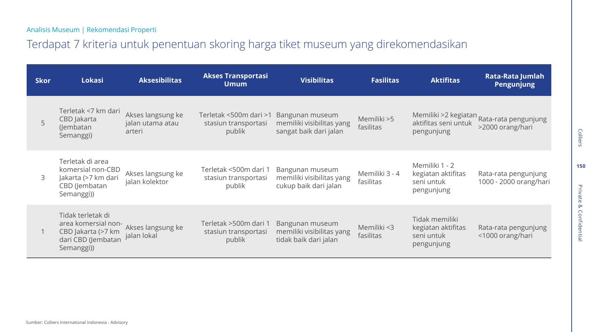
<!-- END COMPLETE PAGE RENDER: SLIDE 150 -->

| Skor | Lokasi | Aksesibilitas | Akses Transportasi Umum | Visibilitas | Fasilitas | Aktifitas | Rata-Rata Jumlah Pengunjung |
| :--- | :--- | :--- | :--- | :--- | :--- | :--- | :--- |
| 5 | Terletak <7 km dari CBD Jakarta (Jembatan Semanggi) | Akseslangsungke jalanutamaatau arteri | Terletak <500m dari >1 stasiun transportasi publik | Bangunan museum memiliki visibilitas yang sangat baik dari jalan | Memiliki >5 fasilitas | Memiliki >2 kegiatan aktifitas seni untuk pengunjung | Rata-rata pengunjung >2000 orang/hari |
| 3 | Terletak di area komersial non-CBD Jakarta (>7 km dari CBD (Jembatan Semanggi)) | Akses langsung ke jalan kolektor | Terletak <500m dari 1 stasiun transportasi publik | Bangunanmuseum memilikivisibilitasyang cukupbaikdarijalan | Memiliki3 -4 fasilitas | Memiliki 1 -2 kegiatan aktifitas seni untuk pengunjung | Rata-rata pengunjung 1000 -2000 orang/hari |
| 1 | Tidak terletak di area komersial non- CBD Jakarta (>7 km dari CBD (Jembatan Semanggi)) | Akses langsung ke jalan lokal | Terletak >500m dari 1 stasiun transportasi publik | Bangunan museum memiliki visibilitas yang tidak baik dari jalan | Memiliki<3 fasilitas | Tidakmemiliki kegiatanaktifitas seniuntuk pengunjung | Rata-rata pengunjung <1000 orang/hari |

> **Sumber: Colliers International Indonesia - Advisory**

Pengunjung

5

Akses langsung ke jalan utama atau arteri

Terletak <500m dari >1

stasiun transportasi

publik

Memiliki >5 fasilitas

3

Terletak <500m dari 1

stasiun transportasi

publik

Memiliki 3 - 4 fasilitas

1

Terletak >500m dari 1

stasiun transportasi

publik

Memiliki <3 fasilitas

---

#### Slide 151: Analisis Museum – Rekomendasi Museum yang direkomendasikan adalah museum modern dan kontemporer

<!-- BEGIN COMPLETE PAGE RENDER: SLIDE 151 -->
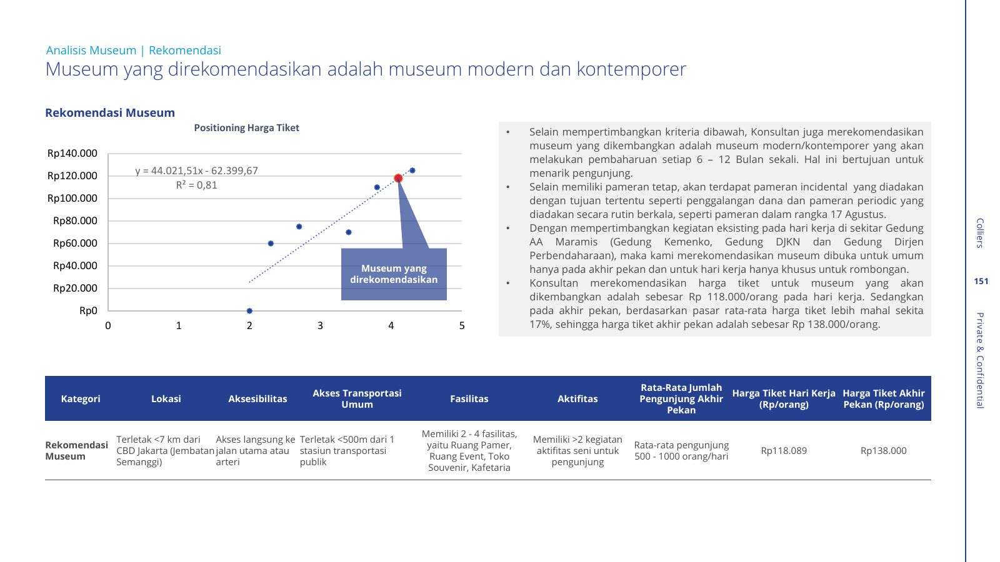
<!-- END COMPLETE PAGE RENDER: SLIDE 151 -->

| R² = 0,81 | Kolom 2 |
| :--- | :--- |
|  | Museum yang direkomendasikan |

Kategori Lokasi Aksesibilitas Akses Transportasi

Umum Fasilitas Aktifitas

Rata-Rata Jumlah Pengunjung Akhir

Pekan

Harga Tiket Hari Kerja

(Rp/orang)

Harga Tiket Akhir

Pekan (Rp/orang)

Rekomendasi Museum

Terletak <7 km dari CBD Jakarta (Jembatan Semanggi)

Akses langsung ke jalan utama atau arteri

Terletak <500m dari 1 stasiun transportasi publik

Memiliki 2 - 4 fasilitas,

yaitu Ruang Pamer,

Ruang Event, Toko Souvenir, Kafetaria

Memiliki >2 kegiatan

aktifitas seni untuk

pengunjung

Rata-rata pengunjung 500 - 1000 orang/hari Rp118.089 Rp138.000

y = 44.021,51x - 62.399,67

R² = 0,81

Rp0

Rp20.000

Rp40.000

Rp60.000

Rp80.000

Rp100.000

Rp120.000

Rp140.000

0 1 2 3 4 5

Positioning Harga Tiket

Museum yang direkomendasikan

Rekomendasi Museum

- 
  Selain mempertimbangkan kriteria dibawah, Konsultan juga merekomendasikan
  museum yang dikembangkan adalah museum modern/kontemporer yang akan
  melakukan pembaharuan setiap 6 – 12 Bulan sekali. Hal ini bertujuan untuk
  menarik pengunjung.
- 
  Selain memiliki pameran tetap, akan terdapat pameran incidental  yang diadakan
  dengan tujuan tertentu seperti penggalangan dana dan pameran periodic yang
  diadakan secara rutin berkala, seperti pameran dalam rangka 17 Agustus.
- 
  Dengan mempertimbangkan kegiatan eksisting pada hari kerja di sekitar Gedung
  AA
  Maramis
  (Gedung
  Kemenko,
  Gedung
  DJKN
  dan
  Gedung
  Dirjen
  Perbendaharaan), maka kami merekomendasikan museum dibuka untuk umum
  hanya pada akhir pekan dan untuk hari kerja hanya khusus untuk rombongan.
- 
  Konsultan
  merekomendasikan
  harga
  tiket
  untuk
  museum
  yang
  akan
  dikembangkan adalah sebesar Rp 118.000/orang pada hari kerja. Sedangkan
  pada akhir pekan, berdasarkan pasar rata-rata harga tiket lebih mahal sekita
  17%, sehingga harga tiket akhir pekan adalah sebesar Rp 138.000/orang.

---

## Bab 07: Rekomendasi Konsep Pengembangan

> [!IMPORTANT]
> Bab ini memaparkan rekomendasi konsep pengembangan, program ruang dan luasan NLA per lantai untuk Skenario Jangka Pendek (2024–2027) dan Skenario Jangka Menengah (2028–2053), serta desain sirkulasi dan pentahapan.

#### Slide 152: 07 Rekomendasi Konsep  Pengembangan

<!-- BEGIN COMPLETE PAGE RENDER: SLIDE 152 -->
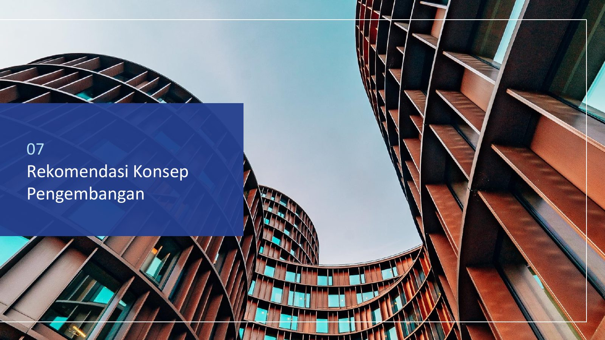
<!-- END COMPLETE PAGE RENDER: SLIDE 152 -->

---

### 7.1 Visi, Tagline & Konektivitas Kawasan

#### Slide 153: BAGAIMANA PERAN GEDUNG A.A. – MARAMIS DALAM MEWUJUDKAN  JAKARTA SEBAGAI KOTA GLOBAL?

<!-- BEGIN COMPLETE PAGE RENDER: SLIDE 153 -->
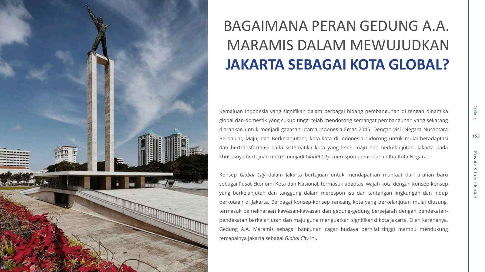
<!-- END COMPLETE PAGE RENDER: SLIDE 153 -->

Kemajuan Indonesia yang signifikan dalam berbagai bidang pembangunan di tengah dinamika

global dan domestik yang cukup tinggi telah mendorong semangat pembangunan yang sekarang

diarahkan untuk menjadi gagasan utama Indonesia Emas 2045. Dengan visi “N      Nusantara

Berdaulat, Maju, dan B  k    j    ”, kota-kota di Indonesia didorong untuk mulai beradaptasi

dan bertransformasi pada sistematika kota yang lebih maju dan berkelanjutan. Jakarta pada

khususnya bertujuan untuk menjadi Global City, merespon pemindahan Ibu Kota Negara.

Konsep Global City dalam Jakarta bertujuan untuk mendapatkan manfaat dari arahan baru

sebagai Pusat Ekonomi Kota dan Nasional, termasuk adaptasi wajah kota dengan konsep-konsep

yang berkelanjutan dan tanggung dalam merespon isu dan tantangan lingkungan dan hidup

perkotaan di Jakarta. Berbagai konsep-konsep rancang kota yang berkelanjutan mulai diusung,

termasuk pemeliharaan kawasan-kawasan dan gedung-gedung bersejarah dengan pendekatan-

pendekatan berkelanjutan dan maju guna menguatkan signifikansi kota Jakarta. Oleh karenanya,

Gedung A.A. Maramis sebagai bangunan cagar budaya bernilai tinggi mampu mendukung

tercapainya Jakarta sebagai Global City ini.

---

#### Slide 154: Rekomendasi Pengembangan – Pembentukan Konektivitas Kawasan – 7 1 – Lokasi strategis Gedung A.A. Maramis – dan kedekatannya dengan berbagai

<!-- BEGIN COMPLETE PAGE RENDER: SLIDE 154 -->
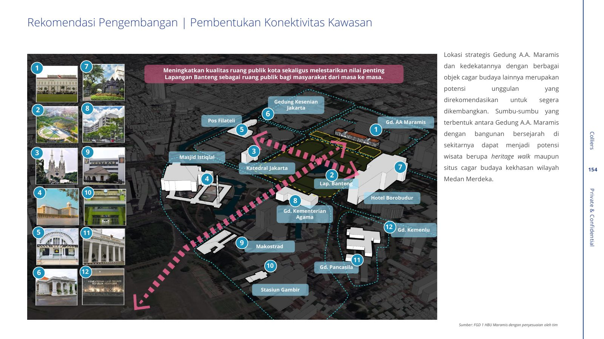
<!-- END COMPLETE PAGE RENDER: SLIDE 154 -->

> **Sumber: FGD 1 HBU Maramis dengan penyesuaian oleh tim**

Gedung Kesenian

Jakarta

Pos Filateli Gd. AA Maramis

Hotel Borobudur

Gd. Kemenlu

Masjid Istiqlal

Gd. Pancasila

Stasiun Gambir

Gd. Kementerian

Agama

Makostrad

Katedral Jakarta

Lap. Banteng 4

1

2

3

5

7

8

9

10 11

12

6

8 2

10

11

12

3

4

5

6

9

Meningkatkan kualitas ruang publik kota sekaligus melestarikan nilai penting

Lapangan Banteng sebagai ruang publik bagi masyarakat dari masa ke masa.

objek cagar budaya lainnya merupakan

potensi unggulan yang

direkomendasikan untuk segera

dikembangkan. Sumbu-sumbu yang

terbentuk antara Gedung A.A. Maramis

dengan bangunan bersejarah di

sekitarnya dapat menjadi potensi

wisata berupa heritage walk maupun

situs cagar budaya kekhasan wilayah

Medan Merdeka.

---

#### Slide 155: Rekomendasi Pengembangan – Integrasi Ruang Terbuka dan Lapangan Banteng – Dalam skala meso, interaksi antara

<!-- BEGIN COMPLETE PAGE RENDER: SLIDE 155 -->
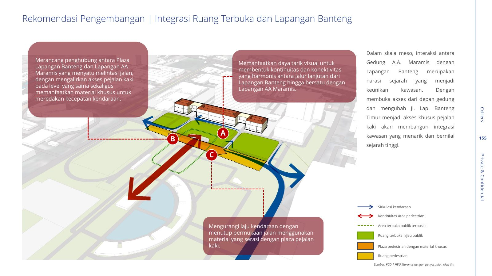
<!-- END COMPLETE PAGE RENDER: SLIDE 155 -->

Memanfaatkan daya tarik visual untuk membentuk kontinuitas dan konektivitas yang harmonis antara jalur lanjutan dari Lapangan Banteng hingga bersatu dengan Lapangan AA Maramis.

Merancang penghubung antara Plaza Lapangan Banteng dan Lapangan AA Maramis yang menyatu melintasi jalan, dengan mengalirkan akses pejalan kaki pada level yang sama sekaligus memanfaatkan material khusus untuk meredakan kecepatan kendaraan.

Mengurangi laju kendaraan dengan menutup permukaan jalan menggunakan material yang serasi dengan plaza pejalan kaki.

A

C

B

> **Sumber: FGD 1 HBU Maramis dengan penyesuaian oleh tim**

Sirkulasi kendaraan

Kontinuitas area pedestrian

Area terbuka publik terpusat

Ruang terbuka hijau publik

Plaza pedestrian dengan material khusus

Ruang pedestrian

Gedung A.A. Maramis dengan

Lapangan Banteng merupakan

narasi sejarah yang menjadi

keunikan kawasan. Dengan

membuka akses dari depan gedung

dan mengubah Jl. Lap. Banteng

Timur menjadi akses khusus pejalan

kaki akan membangun integrasi

kawasan yang menarik dan bernilai

sejarah tinggi.

---

#### Slide 156: Rekomendasi Pengembangan – Integrasi Ruang Terbuka dan Lapangan Banteng

<!-- BEGIN COMPLETE PAGE RENDER: SLIDE 156 -->
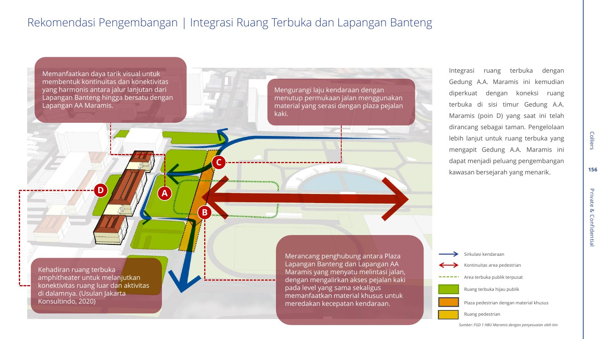
<!-- END COMPLETE PAGE RENDER: SLIDE 156 -->

Memanfaatkan daya tarik visual untuk membentuk kontinuitas dan konektivitas yang harmonis antara jalur lanjutan dari Lapangan Banteng hingga bersatu dengan Lapangan AA Maramis.

Merancang penghubung antara Plaza Lapangan Banteng dan Lapangan AA Maramis yang menyatu melintasi jalan, dengan mengalirkan akses pejalan kaki pada level yang sama sekaligus memanfaatkan material khusus untuk meredakan kecepatan kendaraan.

Mengurangi laju kendaraan dengan menutup permukaan jalan menggunakan material yang serasi dengan plaza pejalan kaki.

A

C

B

> **Sumber: FGD 1 HBU Maramis dengan penyesuaian oleh tim**

Sirkulasi kendaraan

Kontinuitas area pedestrian

Area terbuka publik terpusat

Ruang terbuka hijau publik

Plaza pedestrian dengan material khusus

Ruang pedestrian

Kehadiran ruang terbuka amphitheater untuk melanjutkan konektivitas ruang luar dan aktivitas di dalamnya. (Usulan Jakarta Konsultindo, 2020)

D

Integrasi ruang terbuka dengan

Gedung A.A. Maramis ini kemudian

diperkuat dengan koneksi ruang

terbuka di sisi timur Gedung A.A.

Maramis (poin D) yang saat ini telah

dirancang sebagai taman. Pengelolaan

lebih lanjut untuk ruang terbuka yang

mengapit Gedung A.A. Maramis ini

dapat menjadi peluang pengembangan

kawasan bersejarah yang menarik.

---

#### Slide 157: Rekomendasi Pengembangan – Visi dan Tagline – The Luxury Heritage: Bangunan Cagar Budaya Multi Fungsi di  Kawasan Pusat Kota Jakarta sebagai Ikon Baru Aset Negara GEDUNG A.A. MARAMIS

<!-- BEGIN COMPLETE PAGE RENDER: SLIDE 157 -->
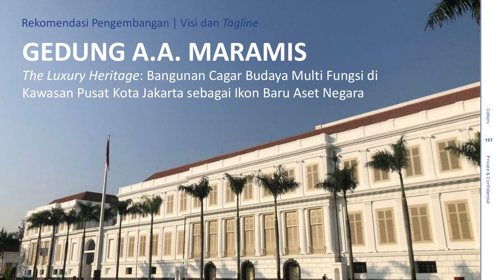
<!-- END COMPLETE PAGE RENDER: SLIDE 157 -->

---

### 7.2 Skenario Jangka Pendek (2024–2027) – Heritage Evolved

#### Slide 158: Skenario Jangka Pendek

<!-- BEGIN COMPLETE PAGE RENDER: SLIDE 158 -->

<!-- END COMPLETE PAGE RENDER: SLIDE 158 -->

7.1

---

#### Slide 159: Rekomendasi Pengembangan – Jangka Pendek HERITAGE EVOLVED

<!-- BEGIN COMPLETE PAGE RENDER: SLIDE 159 -->
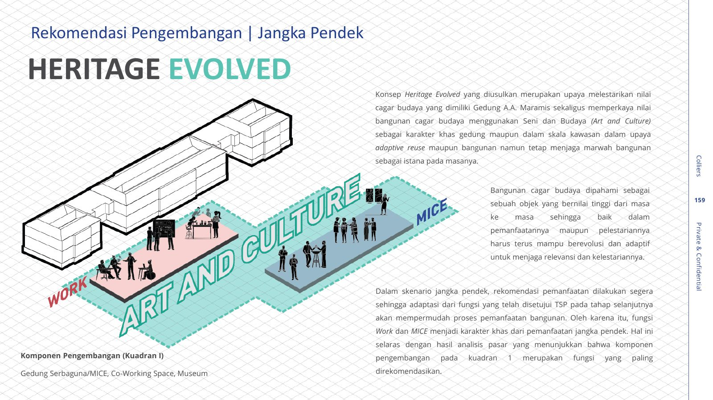
<!-- END COMPLETE PAGE RENDER: SLIDE 159 -->

Komponen Pengembangan (Kuadran I)

Gedung Serbaguna/MICE, Co-Working Space, Museum

Konsep Heritage Evolved yang diusulkan merupakan upaya melestarikan nilai

cagar budaya yang dimiliki Gedung A.A. Maramis sekaligus memperkaya nilai

bangunan cagar budaya menggunakan Seni dan Budaya (Art and Culture)

sebagai karakter khas gedung maupun dalam skala kawasan dalam upaya

adaptive reuse maupun bangunan namun tetap menjaga marwah bangunan

sebagai istana pada masanya.

Bangunan cagar budaya dipahami sebagai

sebuah objek yang bernilai tinggi dari masa

ke masa sehingga baik dalam

pemanfaatannya maupun pelestariannya

harus terus mampu berevolusi dan adaptif

untuk menjaga relevansi dan kelestariannya.

Dalam skenario jangka pendek, rekomendasi pemanfaatan dilakukan segera

sehingga adaptasi dari fungsi yang telah disetujui TSP pada tahap selanjutnya

akan mempermudah proses pemanfaatan bangunan. Oleh karena itu, fungsi

Work dan MICE menjadi karakter khas dari pemanfaatan jangka pendek. Hal ini

selaras dengan hasil analisis pasar yang menunjukkan bahwa komponen

pengembangan pada kuadran 1 merupakan fungsi yang paling

direkomendasikan.

---

#### Slide 160: Rekomendasi Konsep Pengembangan – Skenario Jangka Pendek Bagaimana Seni Dan Budaya Mampu Menjadi Stimulan?

<!-- BEGIN COMPLETE PAGE RENDER: SLIDE 160 -->
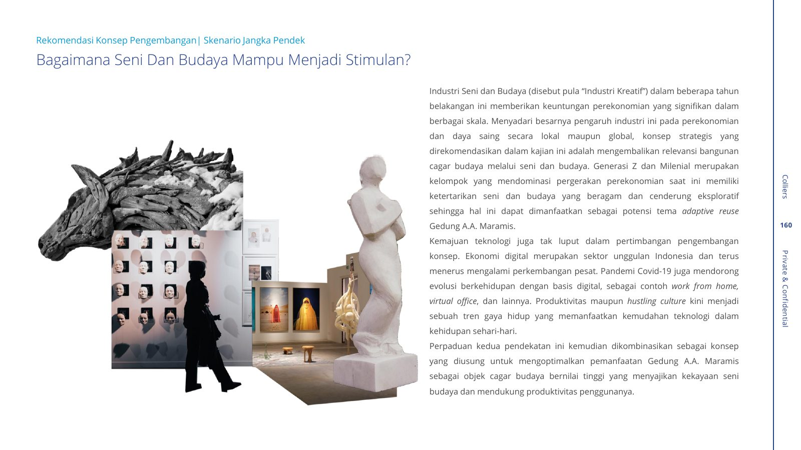
<!-- END COMPLETE PAGE RENDER: SLIDE 160 -->

Industri Seni dan Budaya (disebut pula “I d      K     f”) dalam beberapa tahun

belakangan ini memberikan keuntungan perekonomian yang signifikan dalam

berbagai skala. Menyadari besarnya pengaruh industri ini pada perekonomian

dan daya saing secara lokal maupun global, konsep strategis yang

direkomendasikan dalam kajian ini adalah mengembalikan relevansi bangunan

cagar budaya melalui seni dan budaya. Generasi Z dan Milenial merupakan

kelompok yang mendominasi pergerakan perekonomian saat ini memiliki

ketertarikan seni dan budaya yang beragam dan cenderung eksploratif

sehingga hal ini dapat dimanfaatkan sebagai potensi tema adaptive reuse

Gedung A.A. Maramis.

Kemajuan teknologi juga tak luput dalam pertimbangan pengembangan

konsep. Ekonomi digital merupakan sektor unggulan Indonesia dan terus

menerus mengalami perkembangan pesat. Pandemi Covid-19 juga mendorong

evolusi berkehidupan dengan basis digital, sebagai contoh work from home,

virtual office, dan lainnya. Produktivitas maupun hustling culture kini menjadi

sebuah tren gaya hidup yang memanfaatkan kemudahan teknologi dalam

kehidupan sehari-hari.

Perpaduan kedua pendekatan ini kemudian dikombinasikan sebagai konsep

yang diusung untuk mengoptimalkan pemanfaatan Gedung A.A. Maramis

sebagai objek cagar budaya bernilai tinggi yang menyajikan kekayaan seni

budaya dan mendukung produktivitas penggunanya.

---

#### Slide 161: Rekomendasi Konsep Pengembangan – Skenario Jangka Pendek Program Ruang – Lantai 1

<!-- BEGIN COMPLETE PAGE RENDER: SLIDE 161 -->
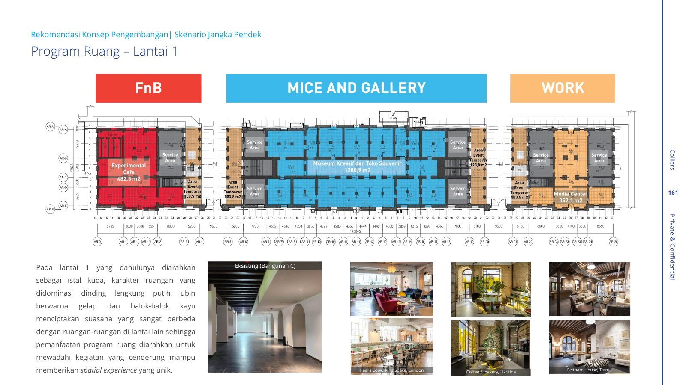
<!-- END COMPLETE PAGE RENDER: SLIDE 161 -->

Pada lantai 1 yang dahulunya diarahkan

sebagai istal kuda, karakter ruangan yang

didominasi dinding lengkung putih, ubin

berwarna gelap dan balok-balok kayu

menciptakan suasana yang sangat berbeda

dengan ruangan-ruangan di lantai lain sehingga

pemanfaatan program ruang diarahkan untuk

mewadahi kegiatan yang cenderung mampu

memberikan spatial experience yang unik.

Eksisting (Bangunan C)

H   ’  Coworking Space, London Feltham House, Tianu Coffee & bakery, Ukraine

---

#### Slide 162: Rekomendasi Konsep Pengembangan – Skenario Jangka Pendek Program Ruang – Lantai 2

<!-- BEGIN COMPLETE PAGE RENDER: SLIDE 162 -->
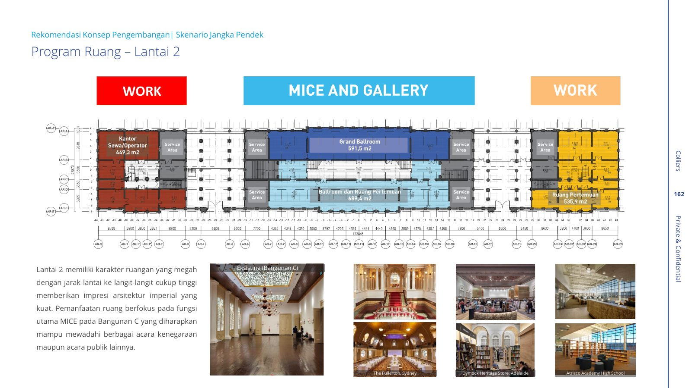
<!-- END COMPLETE PAGE RENDER: SLIDE 162 -->

Lantai 2 memiliki karakter ruangan yang megah

dengan jarak lantai ke langit-langit cukup tinggi

memberikan impresi arsitektur imperial yang

kuat. Pemanfaatan ruang berfokus pada fungsi

utama MICE pada Bangunan C yang diharapkan

mampu mewadahi berbagai acara kenegaraan

maupun acara publik lainnya.

Eksisting (Bangunan C)

Dymock Heritage Store, Adelaide Atrisco Academy High School The Fullerton, Sydney

WORK

---

#### Slide 163: Rekomendasi Konsep Pengembangan – Skenario Jangka Pendek Program Ruang – Lantai 3

<!-- BEGIN COMPLETE PAGE RENDER: SLIDE 163 -->
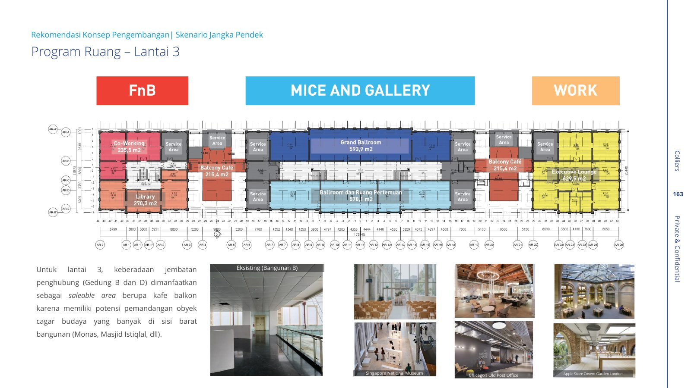
<!-- END COMPLETE PAGE RENDER: SLIDE 163 -->

Untuk lantai 3, keberadaan jembatan

penghubung (Gedung B dan D) dimanfaatkan

sebagai saleable area berupa kafe balkon

karena memiliki potensi pemandangan obyek

cagar budaya yang banyak di sisi barat

bangunan (Monas, Masjid Istiqlal, dll).

Eksisting (Bangunan B)

Singapore National Museum Ch    o’  O d Po   Off Apple Store Covent Garden London

---

#### Slide 164: Rekomendasi Konsep Pengembangan – Skenario Jangka Pendek Estimasi Saleable Area

<!-- BEGIN COMPLETE PAGE RENDER: SLIDE 164 -->
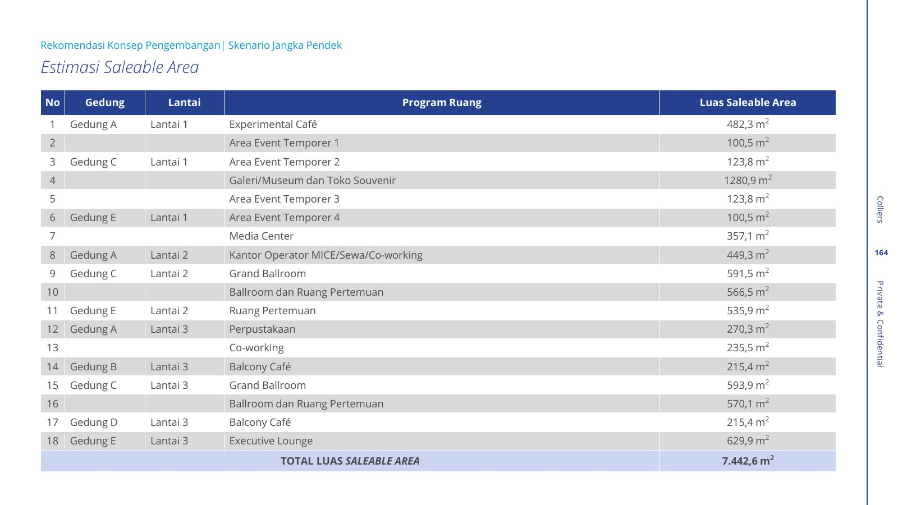
<!-- END COMPLETE PAGE RENDER: SLIDE 164 -->

| No | Gedung | Lantai | Program Ruang | Luas Saleable Area |
| :--- | :--- | :--- | :--- | :--- |
| 1 | Gedung A | Lantai 1 | Experimental Café | 482,3 m2 |
| 2 |  |  | Area Event Temporer 1 | 100,5 m2 |
| 3 | Gedung C | Lantai 1 | Area Event Temporer 2 | 123,8 m2 |
| 4 |  |  | Galeri/Museum dan Toko Souvenir | 1280,9 m2 |
| 5 |  |  | Area Event Temporer3 | 123,8 m2 |
| 6 | Gedung E | Lantai 1 | Area Event Temporer 4 | 100,5 m2 |
| 7 |  |  | Media Center | 357,1 m2 |
| 8 | Gedung A | Lantai 2 | Kantor Operator MICE/Sewa/Co-working | 449,3 m2 |
| 9 | Gedung C | Lantai 2 | Grand Ballroom | 591,5 m2 |
| 10 |  |  | Ballroom dan Ruang Pertemuan | 566,5 m2 |
| 11 | Gedung E | Lantai 2 | Ruang Pertemuan | 535,9 m2 |
| 12 | Gedung A | Lantai 3 | Perpustakaan | 270,3 m2 |
| 13 |  |  | Co-working | 235,5 m2 |
| 14 | Gedung B | Lantai 3 | Balcony Café | 215,4 m2 |
| 15 | Gedung C | Lantai 3 | Grand Ballroom | 593,9 m2 |
| 16 |  |  | Ballroom dan Ruang Pertemuan | 570,1 m2 |
| 17 | Gedung D | Lantai 3 | Balcony Café | 215,4 m2 |
| 18 | Gedung E | Lantai 3 | Executive Lounge | 629,9 m2 |
| TOTAL LUAS SALEABLE AREA |  |  |  | 7.442,6 m2 |

---

### 7.3 Skenario Jangka Menengah (2028–2053) – Heritage Evolved, Even Further

#### Slide 165: Skenario Jangka Menengah

<!-- BEGIN COMPLETE PAGE RENDER: SLIDE 165 -->

<!-- END COMPLETE PAGE RENDER: SLIDE 165 -->

7.2

---

#### Slide 166: Rekomendasi Pengembangan – Jangka Menengah HERITAGE EVOLVED, EVEN FURTHER

<!-- BEGIN COMPLETE PAGE RENDER: SLIDE 166 -->
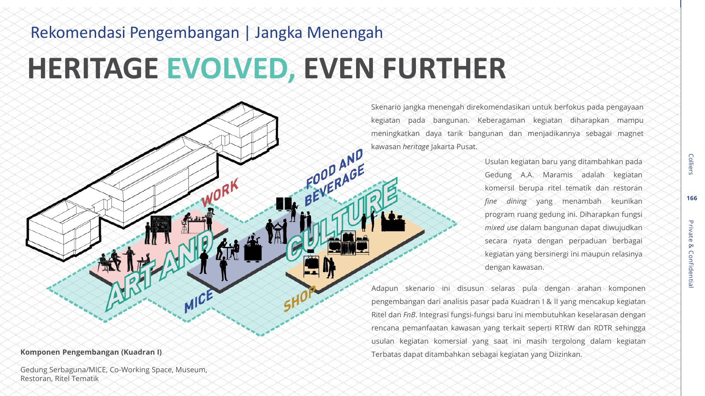
<!-- END COMPLETE PAGE RENDER: SLIDE 166 -->

Skenario jangka menengah direkomendasikan untuk berfokus pada pengayaan

kegiatan pada bangunan. Keberagaman kegiatan diharapkan mampu

meningkatkan daya tarik bangunan dan menjadikannya sebagai magnet

kawasan heritage Jakarta Pusat.

Usulan kegiatan baru yang ditambahkan pada

Gedung A.A. Maramis adalah kegiatan

komersil berupa ritel tematik dan restoran

fine dining yang menambah keunikan

program ruang gedung ini. Diharapkan fungsi

mixed use dalam bangunan dapat diwujudkan

secara nyata dengan perpaduan berbagai

kegiatan yang bersinergi ini maupun relasinya

dengan kawasan.

Adapun skenario ini disusun selaras pula dengan arahan komponen

pengembangan dari analisis pasar pada Kuadran I & II yang mencakup kegiatan

Ritel dan FnB. Integrasi fungsi-fungsi baru ini membutuhkan keselarasan dengan

rencana pemanfaatan kawasan yang terkait seperti RTRW dan RDTR sehingga

usulan kegiatan komersial yang saat ini masih tergolong dalam kegiatan

Terbatas dapat ditambahkan sebagai kegiatan yang Diizinkan. Komponen Pengembangan (Kuadran I)

Gedung Serbaguna/MICE, Co-Working Space, Museum, Restoran, Ritel Tematik

---

#### Slide 167: Rekomendasi Konsep Pengembangan – Skenario Jangka Menengah Program Ruang – Lantai 1

<!-- BEGIN COMPLETE PAGE RENDER: SLIDE 167 -->
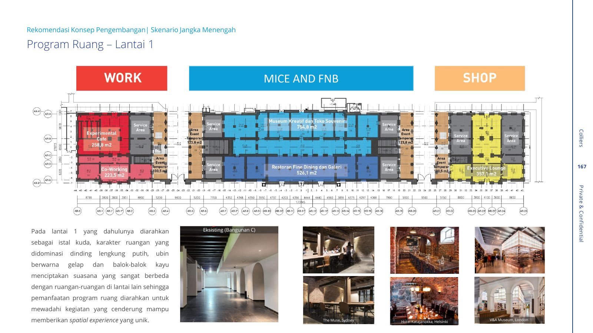
<!-- END COMPLETE PAGE RENDER: SLIDE 167 -->

Pada lantai 1 yang dahulunya diarahkan

sebagai istal kuda, karakter ruangan yang

didominasi dinding lengkung putih, ubin

berwarna gelap dan balok-balok kayu

menciptakan suasana yang sangat berbeda

dengan ruangan-ruangan di lantai lain sehingga

pemanfaatan program ruang diarahkan untuk

mewadahi kegiatan yang cenderung mampu

memberikan spatial experience yang unik.

Eksisting (Bangunan C)

The Muse, Sydney V&A Museum, London Hotel Katajanokka, Helsinki

MICE AND FNB

---

#### Slide 168: Rekomendasi Konsep Pengembangan – Skenario Jangka Menengah Program Ruang – Lantai 2

<!-- BEGIN COMPLETE PAGE RENDER: SLIDE 168 -->
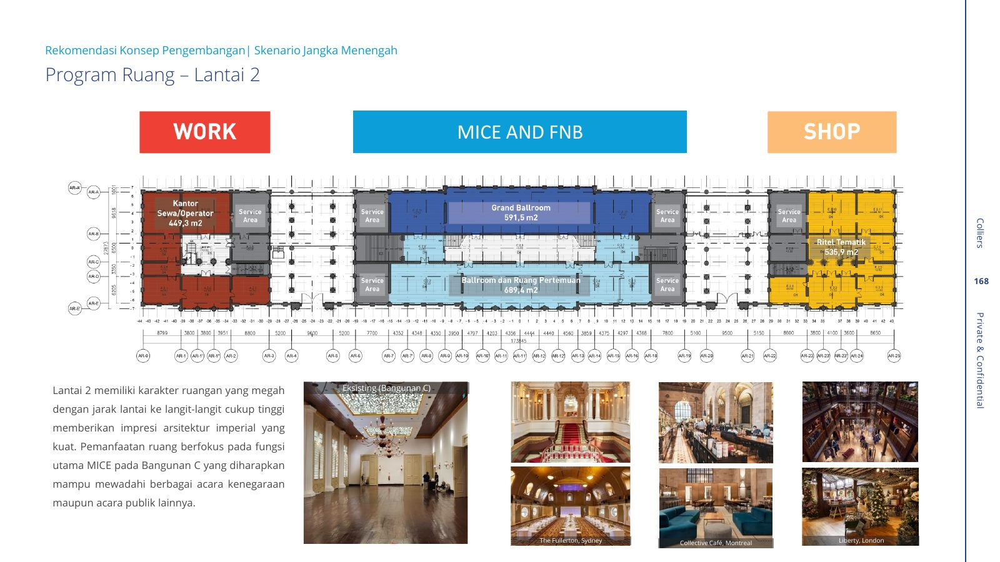
<!-- END COMPLETE PAGE RENDER: SLIDE 168 -->

Lantai 2 memiliki karakter ruangan yang megah

dengan jarak lantai ke langit-langit cukup tinggi

memberikan impresi arsitektur imperial yang

kuat. Pemanfaatan ruang berfokus pada fungsi

utama MICE pada Bangunan C yang diharapkan

mampu mewadahi berbagai acara kenegaraan

maupun acara publik lainnya.

Eksisting (Bangunan C)

The Fullerton, Sydney Collective Café, Montreal Liberty, London

MICE AND FNB

---

#### Slide 169: Rekomendasi Konsep Pengembangan – Skenario Jangka Menengah Program Ruang – Lantai 3

<!-- BEGIN COMPLETE PAGE RENDER: SLIDE 169 -->
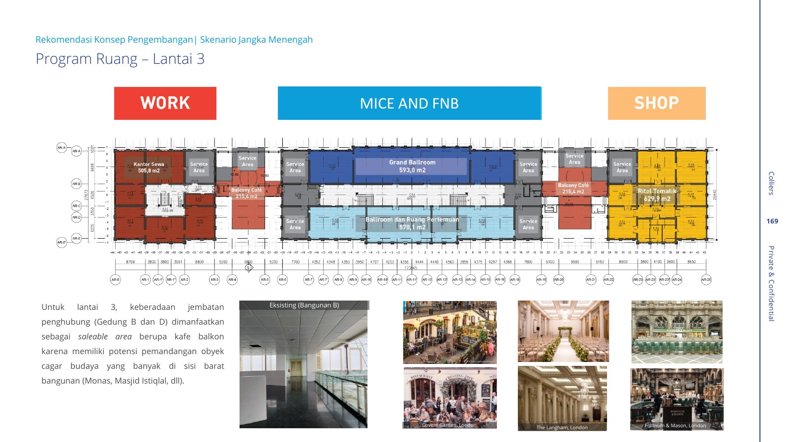
<!-- END COMPLETE PAGE RENDER: SLIDE 169 -->

Untuk lantai 3, keberadaan jembatan

penghubung (Gedung B dan D) dimanfaatkan

sebagai saleable area berupa kafe balkon

karena memiliki potensi pemandangan obyek

cagar budaya yang banyak di sisi barat

bangunan (Monas, Masjid Istiqlal, dll).

Eksisting (Bangunan B)

Covent Garden, London The Langham, London Fortnum & Mason, London

MICE AND FNB

---

#### Slide 170: Rekomendasi Konsep Pengembangan – Skenario Jangka Menengah Estimasi Saleable Area

<!-- BEGIN COMPLETE PAGE RENDER: SLIDE 170 -->
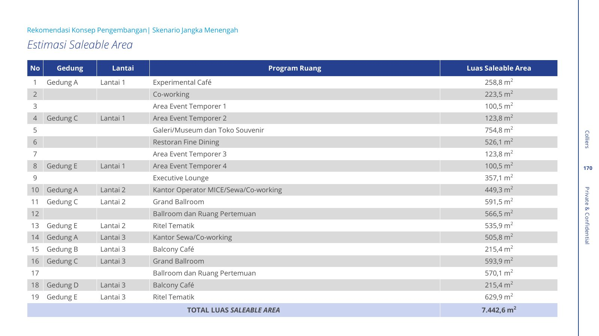
<!-- END COMPLETE PAGE RENDER: SLIDE 170 -->

| No | Gedung | Lantai | Program Ruang | Luas Saleable Area |
| :--- | :--- | :--- | :--- | :--- |
| 1 | Gedung A | Lantai 1 | Experimental Café | 258,8 m2 |
| 2 |  |  | Co-working | 223,5 m2 |
| 3 |  |  | Area Event Temporer 1 | 100,5 m2 |
| 4 | Gedung C | Lantai 1 | Area Event Temporer 2 | 123,8 m2 |
| 5 |  |  | Galeri/Museum dan Toko Souvenir | 754,8 m2 |
| 6 |  |  | Restoran Fine Dining | 526,1 m2 |
| 7 |  |  | Area Event Temporer3 | 123,8 m2 |
| 8 | Gedung E | Lantai 1 | Area Event Temporer 4 | 100,5 m2 |
| 9 |  |  | Executive Lounge | 357,1 m2 |
| 10 | Gedung A | Lantai 2 | Kantor Operator MICE/Sewa/Co-working | 449,3 m2 |
| 11 | Gedung C | Lantai 2 | Grand Ballroom | 591,5 m2 |
| 12 |  |  | Ballroom dan Ruang Pertemuan | 566,5 m2 |
| 13 | Gedung E | Lantai 2 | Ritel Tematik | 535,9 m2 |
| 14 | Gedung A | Lantai 3 | Kantor Sewa/Co-working | 505,8 m2 |
| 15 | Gedung B | Lantai 3 | Balcony Café | 215,4 m2 |
| 16 | Gedung C | Lantai 3 | Grand Ballroom | 593,9 m2 |
| 17 |  |  | Ballroom dan Ruang Pertemuan | 570,1 m2 |
| 18 | Gedung D | Lantai 3 | Balcony Café | 215,4 m2 |
| 19 | Gedung E | Lantai 3 | Ritel Tematik | 629,9 m2 |
| TOTAL LUAS SALEABLE AREA |  |  |  | 7.442,6 m2 |

---

### 7.4 Skenario Jangka Panjang (Pusat Edukasi & Diplomasi Keuangan)

#### Slide 171: Rekomendasi Skenario Jangka  Panjang

<!-- BEGIN COMPLETE PAGE RENDER: SLIDE 171 -->
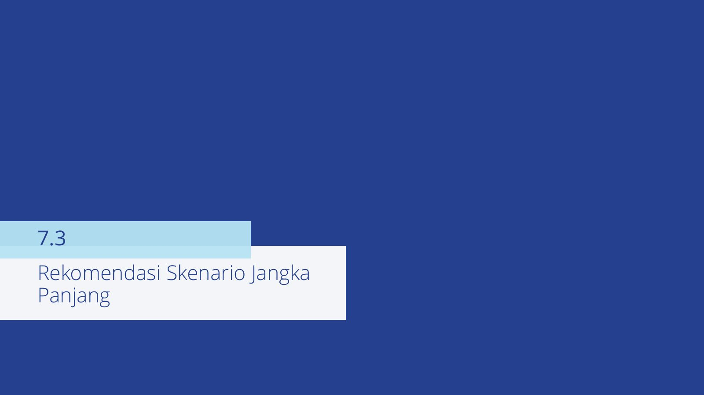
<!-- END COMPLETE PAGE RENDER: SLIDE 171 -->

7.3

---

#### Slide 172: BAGAIMANA GEDUNG A.A.  MARAMIS TERUS BEREVOLUSI

<!-- BEGIN COMPLETE PAGE RENDER: SLIDE 172 -->
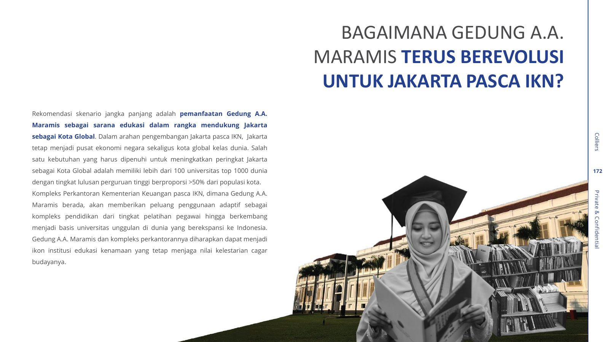
<!-- END COMPLETE PAGE RENDER: SLIDE 172 -->

Rekomendasi skenario jangka panjang adalah pemanfaatan Gedung A.A.

Maramis sebagai sarana edukasi dalam rangka mendukung Jakarta

sebagai Kota Global. Dalam arahan pengembangan Jakarta pasca IKN,  Jakarta

tetap menjadi pusat ekonomi negara sekaligus kota global kelas dunia. Salah

satu kebutuhan yang harus dipenuhi untuk meningkatkan peringkat Jakarta

sebagai Kota Global adalah memiliki lebih dari 100 universitas top 1000 dunia

dengan tingkat lulusan perguruan tinggi berproporsi >50% dari populasi kota.

Kompleks Perkantoran Kementerian Keuangan pasca IKN, dimana Gedung A.A.

Maramis berada, akan memberikan peluang penggunaan adaptif sebagai

kompleks pendidikan dari tingkat pelatihan pegawai hingga berkembang

menjadi basis universitas unggulan di dunia yang berekspansi ke Indonesia.

Gedung A.A. Maramis dan kompleks perkantorannya diharapkan dapat menjadi

ikon institusi edukasi kenamaan yang tetap menjaga nilai kelestarian cagar

budayanya.

UNTUK JAKARTA PASCA IKN?

---

### 7.5 Skenario Sirkulasi, Pedestrian & Parkir

#### Slide 173: Skenario Sirkulasi dan Parkir

<!-- BEGIN COMPLETE PAGE RENDER: SLIDE 173 -->

<!-- END COMPLETE PAGE RENDER: SLIDE 173 -->

7.4

---

#### Slide 174: Standar Parkir – Perkantoran 1 SRP/100 m2 – Rekomendasi Konsep Pengembangan – AA Maramis Rekomendasi Sirkulasi dan Parkir

<!-- BEGIN COMPLETE PAGE RENDER: SLIDE 174 -->
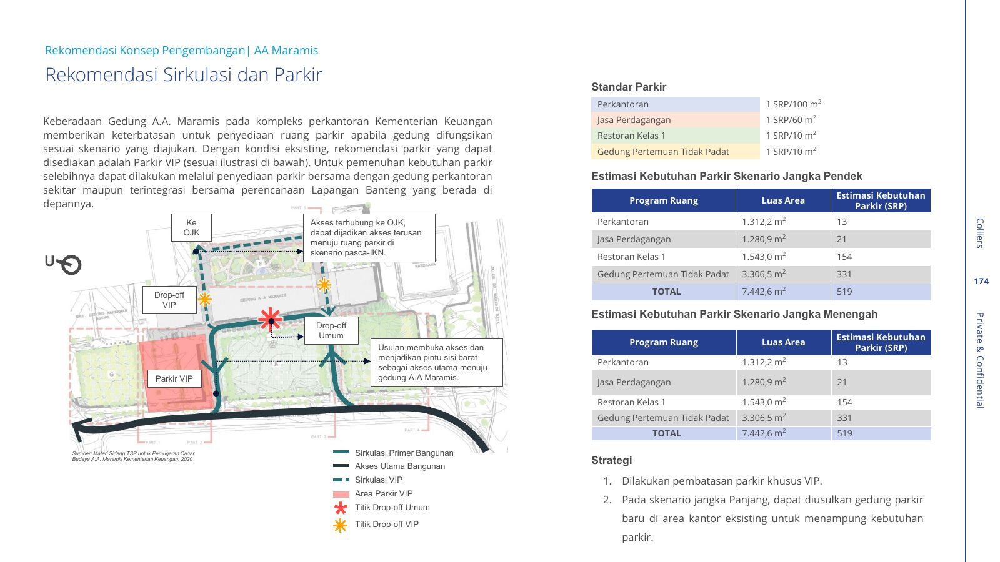
<!-- END COMPLETE PAGE RENDER: SLIDE 174 -->

| Program Ruang | Luas Area | Estimasi Kebutuhan Parkir (SRP) |
| :--- | :--- | :--- |
| Perkantoran | 1.312,2 m2 | 13 |
| Jasa Perdagangan | 1.280,9 m2 | 21 |
| Restoran Kelas 1 | 1.543,0 m2 | 154 |
| Gedung Pertemuan Tidak Padat | 3.306,5 m2 | 331 |
| TOTAL | 7.442,6 m2 | 519 |

| Program Ruang | Luas Area | Estimasi Kebutuhan Parkir (SRP) |
| :--- | :--- | :--- |
| Perkantoran | 1.312,2 m2 | 13 |
| Jasa Perdagangan Restoran Kelas 1 | 1.280,9 m2 1.543,0 m2 | 21 154 |
| Gedung Pertemuan Tidak Padat | 3.306,5 m2 | 331 |
| TOTAL | 7.442,6 m2 | 519 |

U

Usulan membuka akses dan menjadikan pintu sisi barat sebagai akses utama menuju gedung A.A Maramis.

Ke OJK

Parkir VIP

Drop-off

Umum

Akses terhubung ke OJK, dapat dijadikan akses terusan menuju ruang parkir di skenario pasca-IKN.

Parkir (SRP)

*

Sirkulasi Primer Bangunan

Akses Utama Bangunan

Sirkulasi VIP

Area Parkir VIP

Titik Drop-off Umum

Estimasi Kebutuhan Parkir Skenario Jangka Pendek

Estimasi Kebutuhan Parkir Skenario Jangka Menengah

Strategi

- **1.** 
  Dilakukan pembatasan parkir khusus VIP.

- **2.** 
  Pada skenario jangka Panjang, dapat diusulkan gedung parkir

baru di area kantor eksisting untuk menampung kebutuhan

parkir.

Parkir (SRP)

Keberadaan Gedung A.A. Maramis pada kompleks perkantoran Kementerian Keuangan memberikan keterbatasan untuk penyediaan ruang parkir apabila gedung difungsikan sesuai skenario yang diajukan. Dengan kondisi eksisting, rekomendasi parkir yang dapat disediakan adalah Parkir VIP (sesuai ilustrasi di bawah). Untuk pemenuhan kebutuhan parkir selebihnya dapat dilakukan melalui penyediaan parkir bersama dengan gedung perkantoran sekitar maupun terintegrasi bersama perencanaan Lapangan Banteng yang berada di depannya.

> **Sumber: Materi Sidang TSP untuk Pemugaran Cagar Budaya A.A. Maramis Kementerian Keuangan, 2020**

Titik Drop-off VIP

Drop-off

VIP

---

### 7.6 Skenario Pentahapan Pengembangan (Phasing)

#### Slide 175: Skenario Pentahapan  Pengembangan

<!-- BEGIN COMPLETE PAGE RENDER: SLIDE 175 -->

<!-- END COMPLETE PAGE RENDER: SLIDE 175 -->

7.5

---

#### Slide 176: Rekomendasi Pentahapan Pengembangan

<!-- BEGIN COMPLETE PAGE RENDER: SLIDE 176 -->
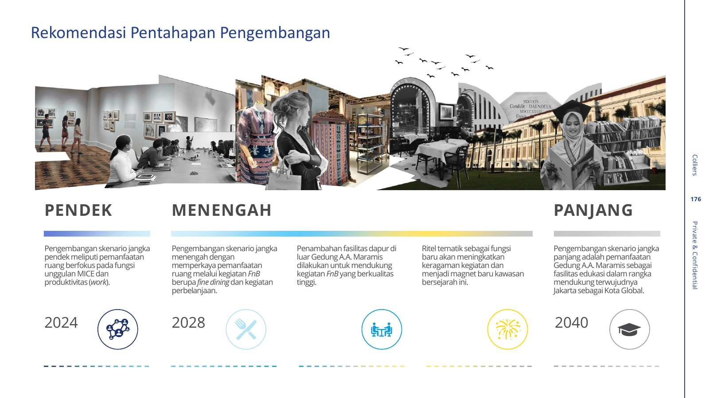
<!-- END COMPLETE PAGE RENDER: SLIDE 176 -->

PENDEK

Pengembangan skenario jangka pendek meliputi pemanfaatan ruang berfokus pada fungsi unggulan MICE dan produktivitas (work).

2024

MENENGAH

Pengembangan skenario jangka menengah dengan memperkaya pemanfaatan ruang melalui kegiatan FnB berupa fine dining dan kegiatan perbelanjaan.

2028

PANJANG

Pengembangan skenario jangka panjang adalah pemanfaatan Gedung A.A. Maramis sebagai fasilitas edukasi dalam rangka mendukung terwujudnya Jakarta sebagai Kota Global.

2040

Penambahan fasilitas dapur di luar Gedung A.A. Maramis dilakukan untuk mendukung kegiatan FnB yang berkualitas tinggi.

Ritel tematik sebagai fungsi baru akan meningkatkan keragaman kegiatan dan menjadi magnet baru kawasan bersejarah ini.

---

#### Slide 177: 08 Skema Kerja Sama

<!-- BEGIN COMPLETE PAGE RENDER: SLIDE 177 -->
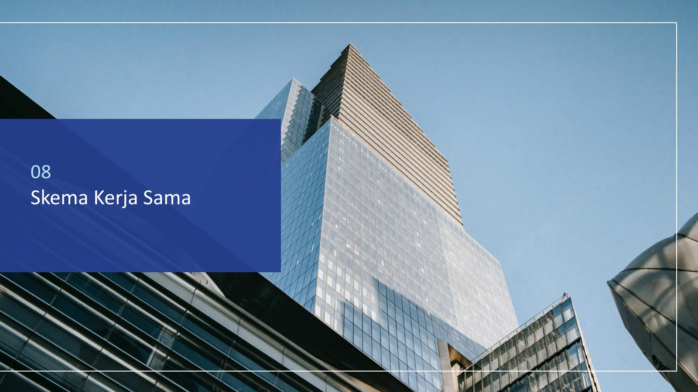
<!-- END COMPLETE PAGE RENDER: SLIDE 177 -->

---

## Bab 08: Skema Kerja Sama

> [!NOTE]
> Bab ini membandingkan dua opsi skema kerja sama optimal: Skema Sewa Guna (PMK 144/2020) vs Skema Kerja Sama Manajemen (KSM) dengan operator.

#### Slide 178: Anslisis Skema Kerja Sama – Kerja Sama Manajemen Skenario 1: Skema Sewa Guna

<!-- BEGIN COMPLETE PAGE RENDER: SLIDE 178 -->
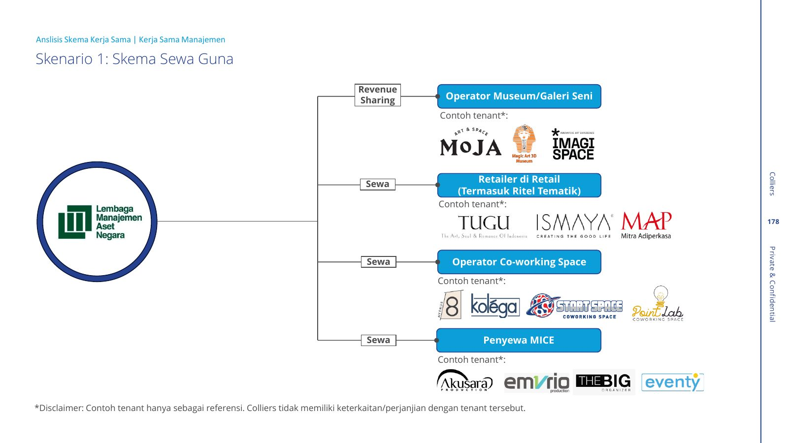
<!-- END COMPLETE PAGE RENDER: SLIDE 178 -->

Retailer di Retail (Termasuk Ritel Tematik)

Penyewa MICE

Operator Co-working Space

Operator Museum/Galeri Seni

Sewa

Sewa

Contoh tenant*:

Contoh tenant*:

Contoh tenant*:

Contoh tenant*:

*Disclaimer: Contoh tenant hanya sebagai referensi. Colliers tidak memiliki keterkaitan/perjanjian dengan tenant tersebut.

Sewa

Revenue

Sharing

---

#### Slide 179: Anslisis Skema Kerja Sama – Kerja Sama Manajemen Skenario 1: Skema Sewa Guna (Berdasarkan PMK No. 144/PMK.06/2020)

<!-- BEGIN COMPLETE PAGE RENDER: SLIDE 179 -->
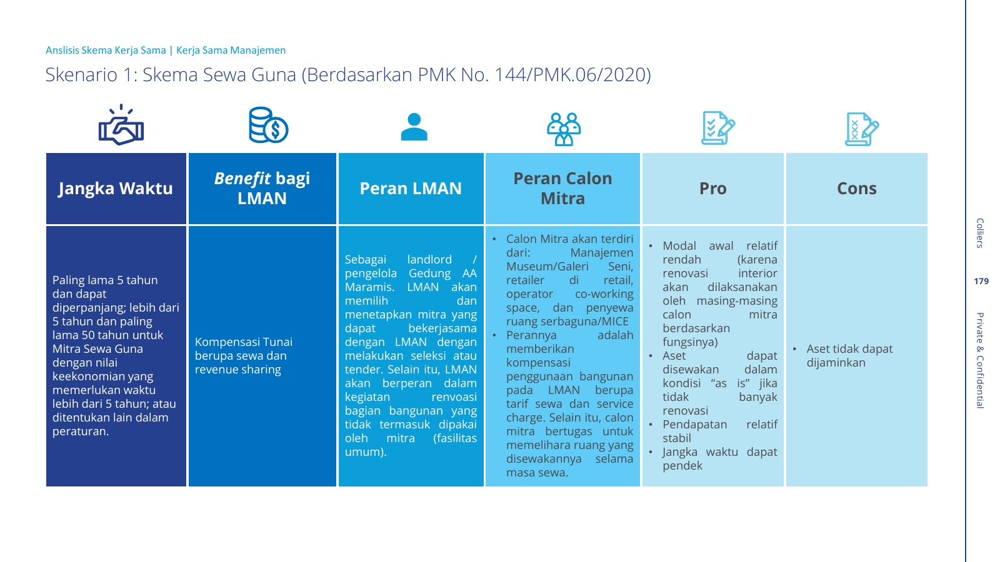
<!-- END COMPLETE PAGE RENDER: SLIDE 179 -->

| Jangka Waktu | Benefit bagi LMAN | Peran LMAN | Peran Calon Mitra | Pro | Cons |
| :--- | :--- | :--- | :--- | :--- | :--- |
| Paling lama 5 tahun dan dapat diperpanjang; lebihdari 5 tahundan paling lama 50 tahun untuk Mitra Sewa Guna dengannilai keekonomianyang memerlukanwaktu lebihdari5 tahun; atau ditentukanlain dalam peraturan. | Kompensasi Tunai berupa sewa dan revenue sharing | Sebagai landlord / pengelola Gedung AA Maramis. LMAN akan memilih dan menetapkan mitra yang dapat bekerjasama dengan LMAN dengan melakukan seleksi atau tender. Selain itu, LMAN akan berperan dalam kegiatan renvoasi bagian bangunan yang tidak termasuk dipakai oleh mitra (fasilitas umum). | • Calon Mitra akan terdiri dari: Manajemen Museum/Galeri Seni, retailer di retail, operator co-working space, dan penyewa ruangserbaguna/MICE • Perannya adalah memberikan kompensasi penggunaan bangunan pada LMAN berupa tarif sewa dan service charge. Selain itu, calon mitra bertugas untuk memelihararuangyang disewakannya selama masasewa. | • Modal awal relatif rendah (karena renovasi interior akan dilaksanakan oleh masing-masing calon mitra berdasarkan fungsinya) • Aset dapat disewakan dalam kondisi “ ” jika tidak banyak renovasi • Pendapatan relatif stabil • Jangka waktu dapat pendek | • Asettidakdapat dijaminkan |

Jangka Waktu Benefit bagi

Mitra Pro Cons

Paling lama 5 tahun dan dapat diperpanjang; lebih dari 5 tahun dan paling lama 50 tahun untuk Mitra Sewa Guna dengan nilai keekonomian yang memerlukan waktu lebih dari 5 tahun; atau ditentukan lain dalam peraturan.

- 
  Aset tidak dapat
  dijaminkan

---

#### Slide 180: Anslisis Skema Kerja Sama – Kerja Sama Manajemen Skenario 2: Skema Kerja Sama Manajemen (KSM)

<!-- BEGIN COMPLETE PAGE RENDER: SLIDE 180 -->
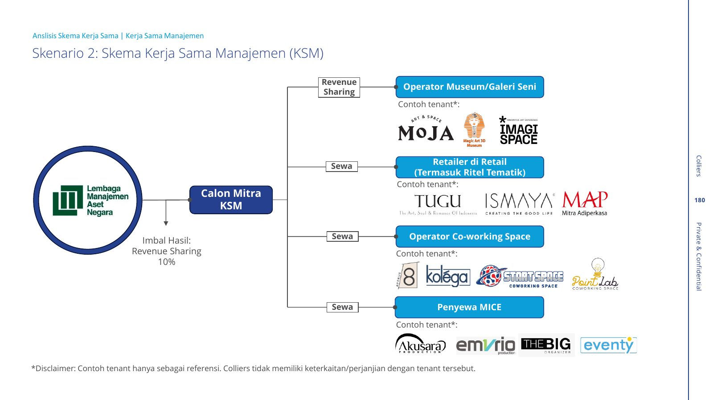
<!-- END COMPLETE PAGE RENDER: SLIDE 180 -->

Retailer di Retail (Termasuk Ritel Tematik)

Penyewa MICE

Operator Co-working Space

Operator Museum/Galeri Seni

Imbal Hasil: Revenue Sharing

10%

Calon Mitra

KSM

Sewa

Sewa

Contoh tenant*:

Contoh tenant*:

Contoh tenant*:

Contoh tenant*:

*Disclaimer: Contoh tenant hanya sebagai referensi. Colliers tidak memiliki keterkaitan/perjanjian dengan tenant tersebut.

Sewa

Revenue

Sharing

---

#### Slide 181: Anslisis Skema Kerja Sama – Kerja Sama Manajemen Skenario 2: Skema Kerja Sama Manajemen (Berdasarkan PMK No. 144/PMK.06/2020)

<!-- BEGIN COMPLETE PAGE RENDER: SLIDE 181 -->
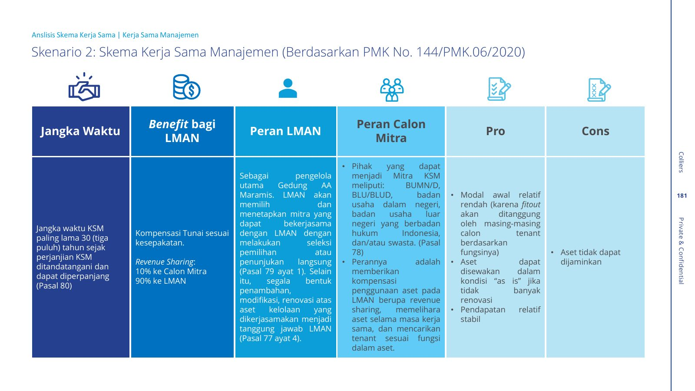
<!-- END COMPLETE PAGE RENDER: SLIDE 181 -->

| Jangka Waktu | Benefit bagi LMAN | Peran LMAN | Peran Calon Mitra | Pro | Cons |
| :--- | :--- | :--- | :--- | :--- | :--- |
| Jangka waktu KSM paling lama 30 (tiga puluh) tahun sejak perjanjian KSM ditandatangani dan dapat diperpanjang (Pasal 80) | Kompensasi Tunai sesuai kesepakatan. Revenue Sharing: 10% keCalon Mitra 90% keLMAN | Sebagai pengelola utama Gedung AA Maramis. LMAN akan memilih dan menetapkan mitra yang dapat bekerjasama dengan LMAN dengan melakukan seleksi pemilihan atau penunjukan langsung (Pasal 79 ayat 1). Selain itu, segala bentuk penambahan, modifikasi, renovasi atas aset kelolaan yang dikerjasamakan menjadi tanggung jawab LMAN (Pasal77ayat4). | • Pihak yang dapat menjadi Mitra KSM meliputi: BUMN/D, BLU/BLUD, badan usaha dalam negeri, badan usaha luar negeri yang berbadan hukum Indonesia, dan/atau swasta. (Pasal 78) • Perannya adalah memberikan kompensasi penggunaan aset pada LMAN berupa revenue sharing, memelihara aset selama masa kerja sama, dan mencarikan tenant sesuai fungsi dalamaset. | • Modal awal relatif rendah (karena fitout akan ditanggung oleh masing-masing calon tenant berdasarkan fungsinya) • Aset dapat disewakan dalam kondisi “ ” jika tidak banyak renovasi • Pendapatan relatif stabil | • Asettidakdapat dijaminkan |

Jangka Waktu Benefit bagi

Mitra Pro Cons

Kompensasi Tunai sesuai kesepakatan.

Revenue Sharing: 10% ke Calon Mitra 90% ke LMAN

- 
  Aset tidak dapat
  dijaminkan

---

## Bab 09: Analisis Iuran Pengelolaan Lingkungan (IPL)

> [!NOTE]
> Bab ini merinci estimasi beban operasional pengelolaan lingkungan (*Building Management* / IPL) sebesar Rp 10,87 Miliar/tahun, struktur SDM, dan tata kelola teknis.

#### Slide 182: 

<!-- BEGIN COMPLETE PAGE RENDER: SLIDE 182 -->
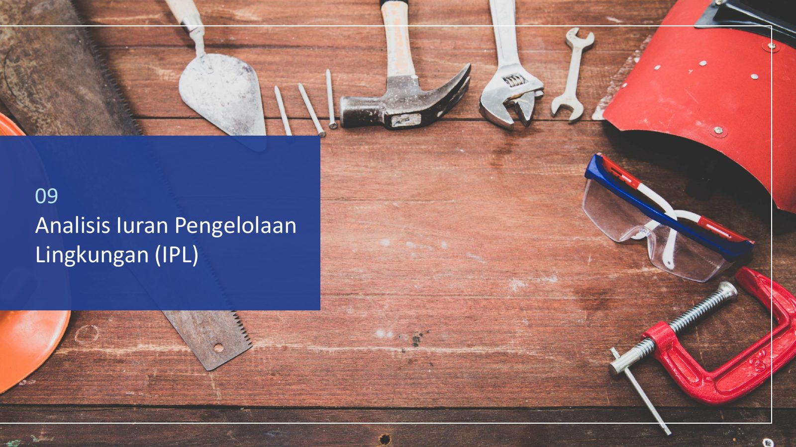
<!-- END COMPLETE PAGE RENDER: SLIDE 182 -->

---

#### Slide 183: Analisis IPL – Asumsi Umum Asumsi Umum

<!-- BEGIN COMPLETE PAGE RENDER: SLIDE 183 -->
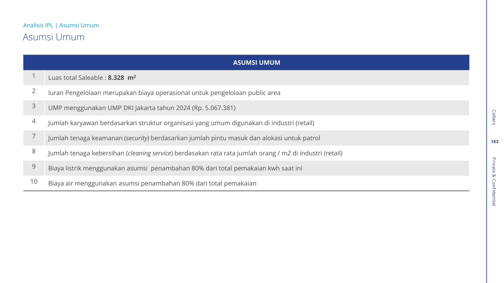
<!-- END COMPLETE PAGE RENDER: SLIDE 183 -->

| Kolom 1 | ASUMSI UMUM |
| :--- | :--- |
| 1 | Luas total Saleable : 8.328 m2 |
| 2 | Iuran Pengelolaan merupakanbiaya operasional untuk pengelolaan public area |
| 3 | UMP menggunakan UMP DKI Jakartatahun 2024 (Rp. 5.067.381) |
| 4 | Jumlah karyawanberdasarkanstruktur organisasi yang umum digunakan di industri (retail) |
| 7 | Jumlah tenaga keamanan(security)berdasarkanjumlah pintu masuk dan alokasi untuk patrol |
| 8 | Jumlah tenaga kebersihan (cleaningservice)berdasakan rata ratajumlah orang / m2 di industri (retail) |
| 9 | Biayalistrik menggunakan asumsi penambahan 80% daritotal pemakaiankwh saatini |
| 10 | Biayaairmenggunakan asumsipenambahan 80% daritotal pemakaian |

ASUMSI UMUM

2 Iuran Pengelolaan merupakan biaya operasional untuk pengelolaan public area

4 Jumlah karyawan berdasarkan struktur organisasi yang umum digunakan di industri (retail)

9 Biaya listrik menggunakan asumsi penambahan 80% dari total pemakaian kwh saat ini

10 Biaya air menggunakan asumsi penambahan 80% dari total pemakaian

---

#### Slide 184: Analisis IPL – Summary Komposisi IPL

<!-- BEGIN COMPLETE PAGE RENDER: SLIDE 184 -->
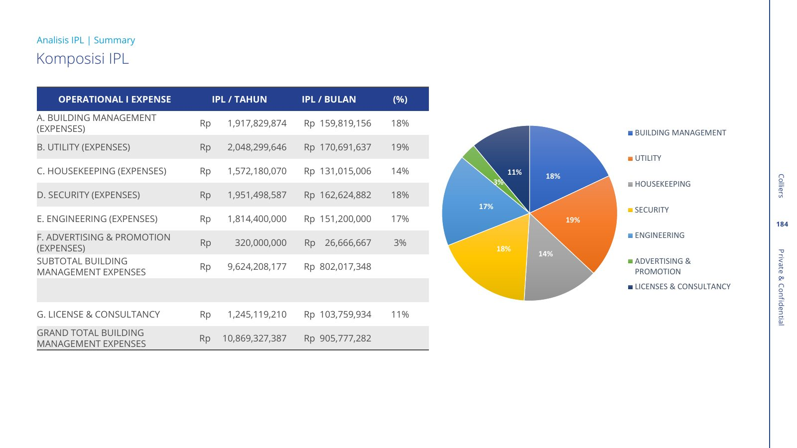
<!-- END COMPLETE PAGE RENDER: SLIDE 184 -->

| OPERATIONAL I EXPENSE | Kolom 2 | IPL / TAHUN | IPL / BULAN | (%) |
| :--- | :--- | :--- | :--- | :--- |
| A. BUILDING MANAGEMENT (EXPENSES) |  | Rp 1,917,829,874 | Rp 159,819,156 | 18% |
| B. UTILITY (EXPENSES) |  | Rp 2,048,299,646 | Rp 170,691,637 | 19% |
| C. HOUSEKEEPING (EXPENSES) |  | Rp 1,572,180,070 | Rp 131,015,006 | 14% |
| D. SECURITY (EXPENSES) |  | Rp 1,951,498,587 | Rp 162,624,882 | 18% |
| E. ENGINEERING (EXPENSES) |  | Rp 1,814,400,000 | Rp 151,200,000 | 17% |
| F. ADVERTISING & PROMOTION (EXPENSES) |  | Rp 320,000,000 | Rp 26,666,667 | 3% |
| SUBTOTAL BUILDING MANAGEMENT EXPENSES |  | Rp 9,624,208,177 | Rp 802,017,348 |  |
| G. LICENSE & CONSULTANCY |  | Rp 1,245,119,210 | Rp 103,759,934 | 11% |
| GRAND TOTAL BUILDING MANAGEMENT EXPENSES |  | Rp 10,869,327,387 | Rp 905,777,282 |  |

18%

19%

14% 18%

17%

3% 11%

BUILDING MANAGEMENT

UTILITY

HOUSEKEEPING

SECURITY

ENGINEERING

ADVERTISING & PROMOTION

LICENSES & CONSULTANCY

---

#### Slide 185: Analisis IPL – Summary Summary IPL

<!-- BEGIN COMPLETE PAGE RENDER: SLIDE 185 -->
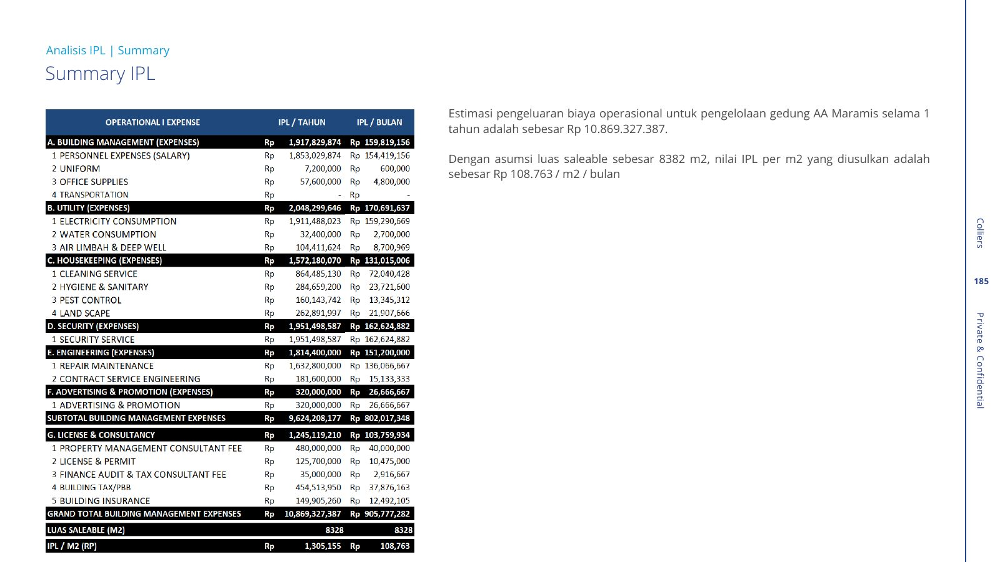
<!-- END COMPLETE PAGE RENDER: SLIDE 185 -->

Estimasi pengeluaran biaya operasional untuk pengelolaan gedung AA Maramis selama 1 tahun adalah sebesar Rp 10.869.327.387.

Dengan asumsi luas saleable sebesar 8382 m2, nilai IPL per m2 yang diusulkan adalah sebesar Rp 108.763 / m2 / bulan

---

#### Slide 186: Analisis IPL – Building Management Struktur Organisasi

<!-- BEGIN COMPLETE PAGE RENDER: SLIDE 186 -->
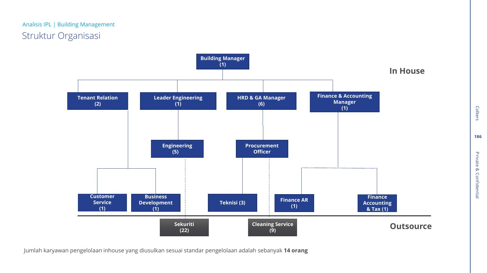
<!-- END COMPLETE PAGE RENDER: SLIDE 186 -->

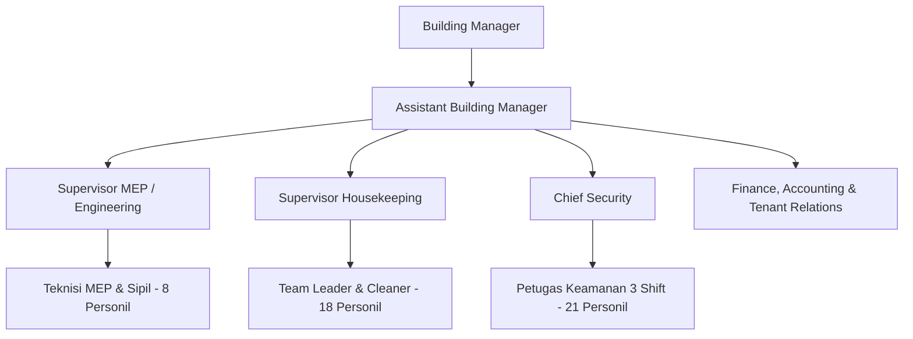
```mermaid
graph TD
    BM[Building Manager]
    ABM[Assistant Building Manager]
    BM --> ABM
    ABM --> SPV_MEP[Supervisor MEP / Engineering]
    ABM --> SPV_HK[Supervisor Housekeeping]
    ABM --> CHIEF_SEC[Chief Security]
    ABM --> ADM[Finance, Accounting & Tenant Relations]
    SPV_MEP --> TECH[Teknisi MEP & Sipil - 8 Personil]
    SPV_HK --> CLEAN[Team Leader & Cleaner - 18 Personil]
    CHIEF_SEC --> SEC[Petugas Keamanan 3 Shift - 21 Personil]
```

Building Manager

(1)

Tenant Relation

(2)

Leader Engineering

(1)

HRD & GA Manager

(6)

Customer

Service

(1)

Business Development

(1)

Engineering (5)

Procurement

Officer

Teknisi (3) Finance AR

(1)

Finance Accounting

& Tax (1)

Sekuriti

(22)

Cleaning Service

(9)

In House

Outsource

Jumlah karyawan pengelolaan inhouse yang diusulkan sesuai standar pengelolaan adalah sebanyak 14 orang

Finance & Accounting

Manager

(1)

(6)

---

#### Slide 187: Analisis IPL – Building Management Summary Biaya Building  Management

<!-- BEGIN COMPLETE PAGE RENDER: SLIDE 187 -->
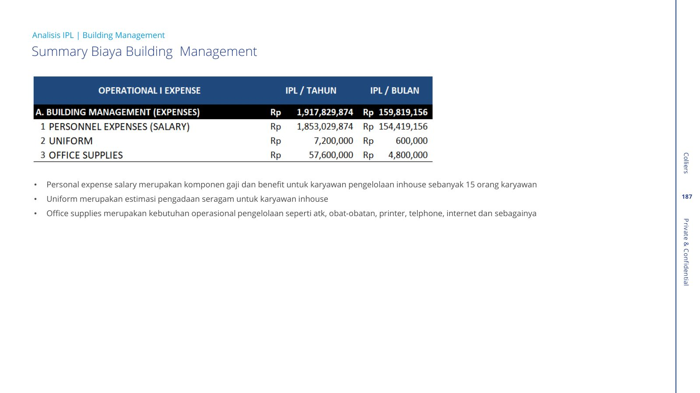
<!-- END COMPLETE PAGE RENDER: SLIDE 187 -->

- 
  Personal expense salary merupakan komponen gaji dan benefit untuk karyawan pengelolaan inhouse sebanyak 15 orang karyawan

- 
  Uniform merupakan estimasi pengadaan seragam untuk karyawan inhouse

- 
  Office supplies merupakan kebutuhan operasional pengelolaan seperti atk, obat-obatan, printer, telphone, internet dan sebagainya

---

#### Slide 188: Analisis IPL – Building Management Personal Expense Salary

<!-- BEGIN COMPLETE PAGE RENDER: SLIDE 188 -->
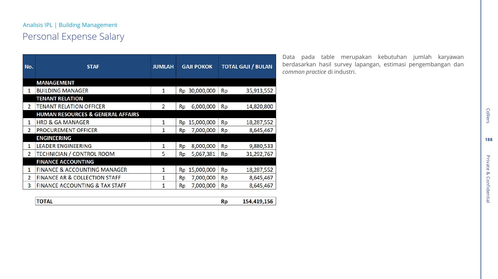
<!-- END COMPLETE PAGE RENDER: SLIDE 188 -->

- 
  Data
  pada
  table
  merupakan
  kebutuhan
  jumlah
  karyawan
  berdasarkan hasil survey lapangan, estimasi pengembangan dan
  common practice di industri.

---

#### Slide 189: Analisis IPL – Building Management Summary Biaya Housekeeping

<!-- BEGIN COMPLETE PAGE RENDER: SLIDE 189 -->
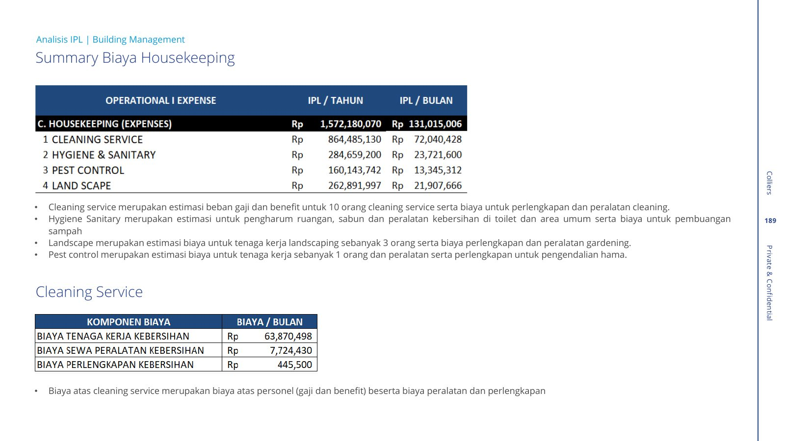
<!-- END COMPLETE PAGE RENDER: SLIDE 189 -->

- 
  Cleaning service merupakan estimasi beban gaji dan benefit untuk 10 orang cleaning service serta biaya untuk perlengkapan dan peralatan cleaning.
- 
  Hygiene Sanitary merupakan estimasi untuk pengharum ruangan, sabun dan peralatan kebersihan di toilet dan area umum serta biaya untuk pembuangan
  sampah
- 
  Landscape merupakan estimasi biaya untuk tenaga kerja landscaping sebanyak 3 orang serta biaya perlengkapan dan peralatan gardening.
- 
  Pest control merupakan estimasi biaya untuk tenaga kerja sebanyak 1 orang dan peralatan serta perlengkapan untuk pengendalian hama.

Cleaning Service

- 
  Biaya atas cleaning service merupakan biaya atas personel (gaji dan benefit) beserta biaya peralatan dan perlengkapan

---

#### Slide 190: Analisis IPL – Building Management Security

<!-- BEGIN COMPLETE PAGE RENDER: SLIDE 190 -->
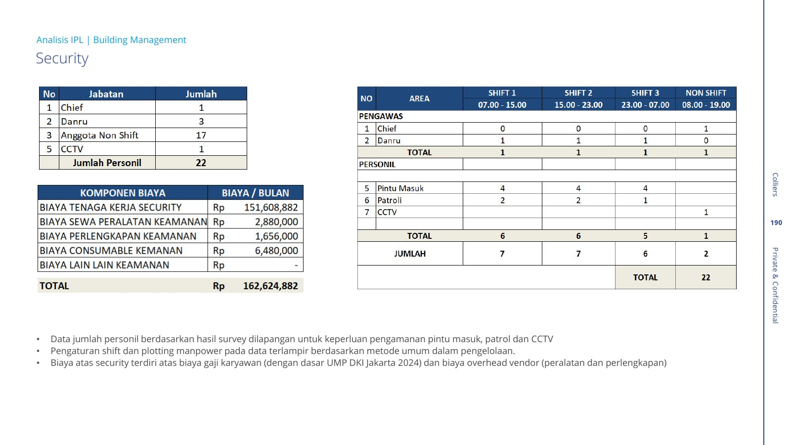
<!-- END COMPLETE PAGE RENDER: SLIDE 190 -->

- 
  Data jumlah personil berdasarkan hasil survey dilapangan untuk keperluan pengamanan pintu masuk, patrol dan CCTV
- 
  Pengaturan shift dan plotting manpower pada data terlampir berdasarkan metode umum dalam pengelolaan.
- 
  Biaya atas security terdiri atas biaya gaji karyawan (dengan dasar UMP DKI Jakarta 2024) dan biaya overhead vendor (peralatan dan perlengkapan)

---

#### Slide 191: Analisis IPL – Building Management Summary License & Consultancy

<!-- BEGIN COMPLETE PAGE RENDER: SLIDE 191 -->
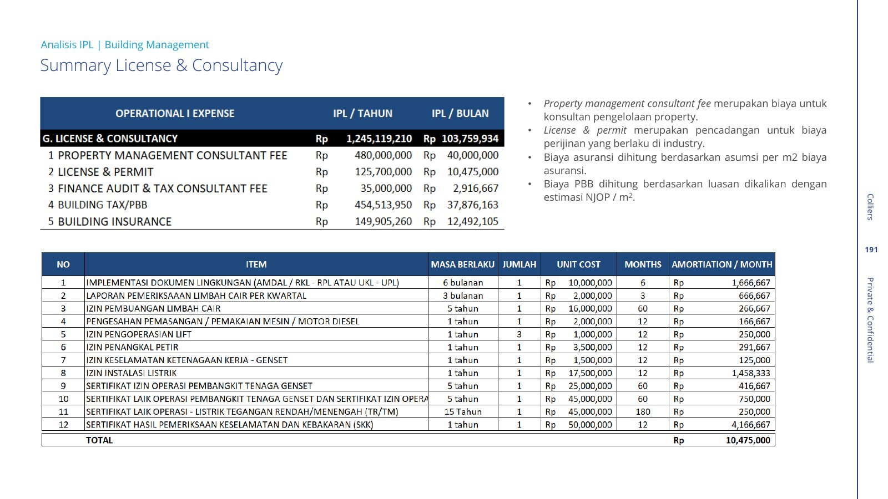
<!-- END COMPLETE PAGE RENDER: SLIDE 191 -->

- 
  Property management consultant fee merupakan biaya untuk
  konsultan pengelolaan property.
- 
  License & permit merupakan pencadangan untuk biaya
  perijinan yang berlaku di industry.
- 
  Biaya asuransi dihitung berdasarkan asumsi per m2 biaya
- **asuransi.** 
- 
  Biaya PBB dihitung berdasarkan luasan dikalikan dengan
  estimasi NJOP / m2.

---

#### Slide 192: Analisis IPL – Skema Kepengelolaan Skema Susunan Organisasi Kepengelolaan

<!-- BEGIN COMPLETE PAGE RENDER: SLIDE 192 -->
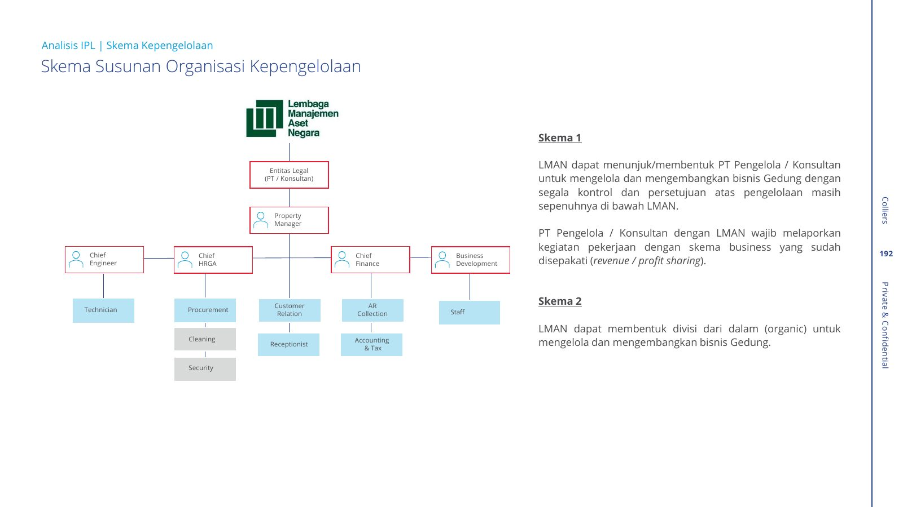
<!-- END COMPLETE PAGE RENDER: SLIDE 192 -->

Entitas Legal (PT / Konsultan)

Technician Customer

Relation

Receptionist

Procurement

Cleaning

Security

Property Manager

Chief Engineer

AR Collection

Accounting

& Tax

Chief Finance

Staff

Business Development Chief HRGA

Skema 1

LMAN dapat menunjuk/membentuk PT Pengelola / Konsultan untuk mengelola dan mengembangkan bisnis Gedung dengan segala kontrol dan persetujuan atas pengelolaan masih sepenuhnya di bawah LMAN.

PT Pengelola / Konsultan dengan LMAN wajib melaporkan kegiatan pekerjaan dengan skema business yang sudah disepakati (revenue / profit sharing).

Skema 2

LMAN dapat membentuk divisi dari dalam (organic) untuk mengelola dan mengembangkan bisnis Gedung.

---

## Bab 10: Analisis Keuangan & Kelayakan Investasi

> [!IMPORTANT]
> Bab ini memaparkan model kelayakan finansial: WACC 9,85%, proyeksi pendapatan per komponen, belanja modal (Capex Rp 92,6 M), laba rugi, arus kas, NPV (Rp 47,5 M), IRR (14,24%), dan Payback Period (9 tahun).

#### Slide 193: 10 Analisis Keuangan

<!-- BEGIN COMPLETE PAGE RENDER: SLIDE 193 -->
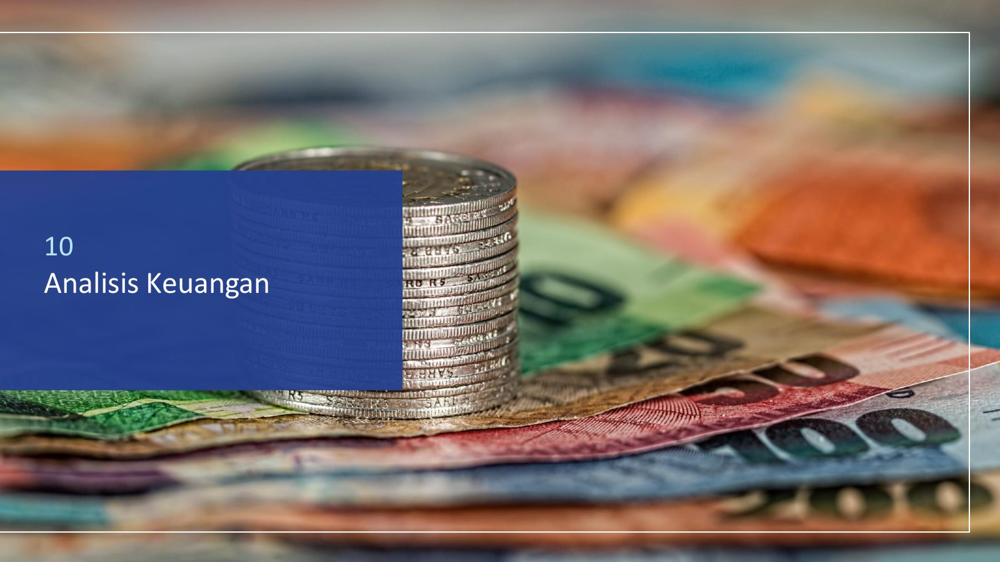
<!-- END COMPLETE PAGE RENDER: SLIDE 193 -->

---

### 10.1 Parameter Modal (WACC) & Timeline Alokasi Ruang

#### Slide 194: Analisis Keuangan WACC/Discount Rate yang digunakan adalah 9,85%

<!-- BEGIN COMPLETE PAGE RENDER: SLIDE 194 -->
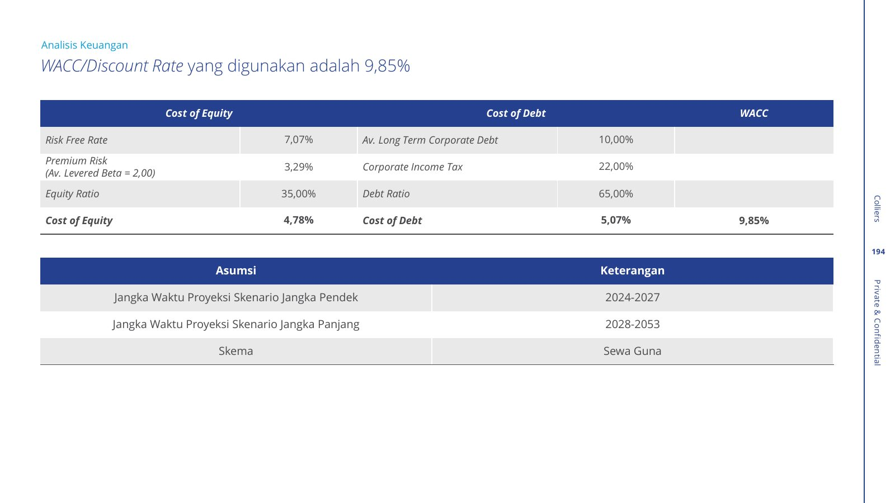
<!-- END COMPLETE PAGE RENDER: SLIDE 194 -->

| Costof Equity | Kolom 2 | Cost of Debt | Kolom 4 | WACC |
| :--- | :--- | :--- | :--- | :--- |
| Risk Free Rate | 7,07% | Av. Long Term Corporate Debt | 10,00% |  |
| Premium Risk (Av. Levered Beta = 2,00) | 3,29% | CorporateIncome Tax | 22,00% |  |
| EquityRatio | 35,00% | Debt Ratio | 65,00% |  |
| Cost ofEquity | 4,78% | Cost of Debt | 5,07% | 9,85% |

| Asumsi | Keterangan |
| :--- | :--- |
| Jangka Waktu Proyeksi Skenario Jangka Pendek | 2024-2027 |
| Jangka Waktu Proyeksi Skenario Jangka Panjang | 2028-2053 |
| Skema | Sewa Guna |

Asumsi Keterangan

Skema Sewa Guna

---

#### Slide 195: Analisis Keuangan Timeline Pengembangan – Lantai Komponen Pengembangan Jangka – Pendek NLA Jangka Pendek Komponen Pengembangan – Jangka Menengah NLA Jangka Menengah 2023 2024 2025 2026 2027 2028 2029 - 2053

<!-- BEGIN COMPLETE PAGE RENDER: SLIDE 195 -->
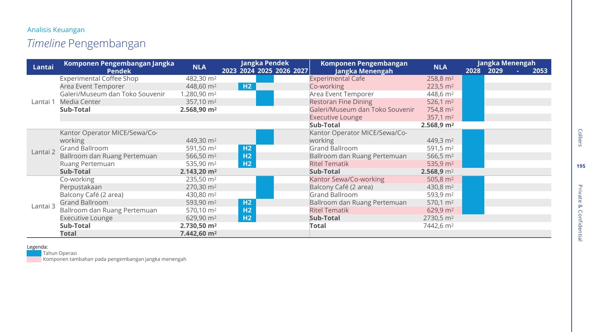
<!-- END COMPLETE PAGE RENDER: SLIDE 195 -->

| Lantai | Komponen Pengembangan Jangka Pendek | NLA | Kolom 4 | JangkaPendek | Kolom 6 | Kolom 7 | Kolom 8 | Kolom 9 | Komponen Pengembangan Jangka Menengah | NLA | Kolom 12 | JangkaMenengah | Kolom 14 | Kolom 15 | Kolom 16 |
| :--- | :--- | :--- | :--- | :--- | :--- | :--- | :--- | :--- | :--- | :--- | :--- | :--- | :--- | :--- | :--- |
|  |  |  |  | 2023 | 2024 | 2025 | 2026 | 2027 |  |  |  | 2028 | 2029 | - | 2053 |
| Lantai1 | Experimental Coffee Shop | 482,30 | m2 |  |  |  |  |  | Experimental Cafe | 258,8 | m2 |  |  |  |  |
|  | Area Event Temporer | 448,60 | m2 |  | H2 |  |  |  | Co-working | 223,5 | m2 |  |  |  |  |
|  | Galeri/Museum dan Toko Souvenir | 1.280,90 | m2 |  |  |  |  |  | Area Event Temporer | 448,6 | m2 |  |  |  |  |
|  | Media Center | 357,10 | m2 |  |  |  |  |  | RestoranFine Dining | 526,1 | m2 |  |  |  |  |
|  | Sub-Total | 2.568,90 | m2 |  |  |  |  |  | Galeri/Museum dan Toko Souvenir | 754,8 | m2 |  |  |  |  |
|  |  |  |  |  |  |  |  |  | Executive Lounge | 357,1 | m2 |  |  |  |  |
|  |  |  |  |  |  |  |  |  | Sub-Total | 2.568,9 | m2 |  |  |  |  |
| Lantai2 | Kantor Operator MICE/Sewa/Co- working | 449,30 | m2 |  |  |  |  |  | Kantor Operator MICE/Sewa/Co- working | 449,3 | m2 |  |  |  |  |
|  | Grand Ballroom | 591,50 | m2 |  | H2 |  |  |  | Grand Ballroom | 591,5 | m2 |  |  |  |  |
|  | Ballroom dan Ruang Pertemuan | 566,50 | m2 |  | H2 |  |  |  | Ballroom dan Ruang Pertemuan | 566,5 | m2 |  |  |  |  |
|  | Ruang Pertemuan | 535,90 | m2 |  | H2 |  |  |  | RitelTematik | 535,9 | m2 |  |  |  |  |
|  | Sub-Total | 2.143,20 | m2 |  |  |  |  |  | Sub-Total | 2.568,9 | m2 |  |  |  |  |
| Lantai3 | Co-working | 235,50 | m2 |  |  |  |  |  | Kantor Sewa/Co-working | 505,8 | m2 |  |  |  |  |
|  | Perpustakaan | 270,30 | m2 |  |  |  |  |  | Balcony Café (2 area) | 430,8 | m2 |  |  |  |  |
|  | Balcony Café (2 area) | 430,80 | m2 |  |  |  |  |  | Grand Ballroom | 593,9 | m2 |  |  |  |  |
|  | Grand Ballroom | 593,90 | m2 |  | H2 |  |  |  | Ballroom dan Ruang Pertemuan | 570,1 | m2 |  |  |  |  |
|  | Ballroom dan Ruang Pertemuan | 570,10 | m2 |  | H2 |  |  |  | RitelTematik | 629,9 | m2 |  |  |  |  |
|  | Executive Lounge | 629,90 | m2 |  | H2 |  |  |  | Sub-Total | 2730,5 | m2 |  |  |  |  |
|  | Sub-Total | 2.730,50 | m2 |  |  |  |  |  | Total | 7442,6 | m2 |  |  |  |  |
|  | Total | 7.442,60 | m2 |  |  |  |  |  |  |  |  |  |  |  |  |

Lantai 1

Lantai 2

Lantai 3

Legenda:

Tahun Operasi Komponen tambahan pada pengembangan jangka menengah

---

### 10.2 Asumsi Proyeksi Pendapatan (MICE, Ritel, Restoran, Museum)

#### Slide 196: Asumsi Pendapatan

<!-- BEGIN COMPLETE PAGE RENDER: SLIDE 196 -->

<!-- END COMPLETE PAGE RENDER: SLIDE 196 -->

10.1

---

#### Slide 197: Analisis Keuangan Asumsi Proyeksi Pendapatan Ritel

<!-- BEGIN COMPLETE PAGE RENDER: SLIDE 197 -->
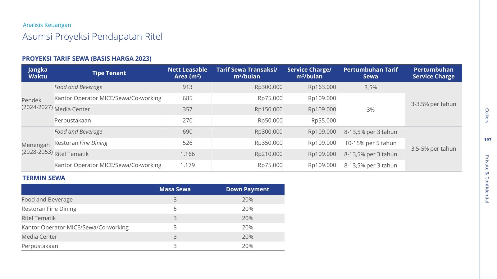
<!-- END COMPLETE PAGE RENDER: SLIDE 197 -->

| Jangka Waktu | TipeTenant | Nett Leasable Area (m2) | TarifSewaTransaksi/ m2/bulan | Service Charge/ m2/bulan | PertumbuhanTarif Sewa | Pertumbuhan Service Charge |
| :--- | :--- | :--- | :--- | :--- | :--- | :--- |
| Pendek (2024-2027) | Food and Beverage | 913 | Rp300.000 | Rp163.000 | 3,5% | 3-3,5% per tahun |
|  | Kantor Operator MICE/Sewa/Co-working | 685 | Rp75.000 | Rp109.000 | 3% |  |
|  | Media Center | 357 | Rp150.000 | Rp109.000 |  |  |
|  | Perpustakaan | 270 | Rp50.000 | Rp55.000 |  |  |
| Menengah (2028-2053) | Food and Beverage | 690 | Rp300.000 | Rp109.000 | 8-13,5% per 3 tahun | 3,5-5% per tahun |
|  | RestoranFine Dining | 526 | Rp350.000 | Rp109.000 | 10-15% per 5 tahun |  |
|  | RitelTematik | 1.166 | Rp210.000 | Rp109.000 | 8-13,5% per 3 tahun |  |
|  | Kantor Operator MICE/Sewa/Co-working | 1.179 | Rp75.000 | Rp109.000 | 8-13,5% per 3 tahun |  |

| Kolom 1 | MasaSewa | Down Payment |
| :--- | :--- | :--- |
| Food and Beverage | 3 | 20% |
| RestoranFine Dining | 5 | 20% |
| Ritel Tematik | 3 | 20% |
| Kantor Operator MICE/Sewa/Co-working | 3 | 20% |
| Media Center | 3 | 20% |
| Perpustakaan | 3 | 20% |

PROYEKSI TARIF SEWA (BASIS HARGA 2023)

Jangka

Waktu Tipe Tenant Nett Leasable

Area (m2)

Tarif Sewa Transaksi/

m2/bulan

Service Charge/

m2/bulan

Pertumbuhan Tarif

Sewa

Pertumbuhan Service Charge

Pendek (2024-2027)

Menengah (2028-2053)

Masa Sewa Down Payment

Restoran Fine Dining 5 20%

Ritel Tematik 3 20%

Media Center 3 20%

Perpustakaan 3 20%

TERMIN SEWA

---

#### Slide 198: Analisis Keuangan Asumsi Proyeksi Pendapatan Ritel

<!-- BEGIN COMPLETE PAGE RENDER: SLIDE 198 -->
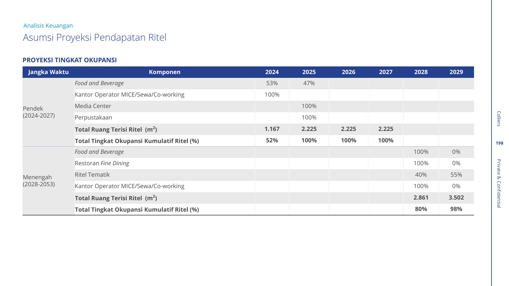
<!-- END COMPLETE PAGE RENDER: SLIDE 198 -->

| JangkaWaktu | Komponen | 2024 | 2025 | 2026 | 2027 | 2028 | 2029 |
| :--- | :--- | :--- | :--- | :--- | :--- | :--- | :--- |
| Pendek (2024-2027) | Food and Beverage | 53% | 47% |  |  |  |  |
|  | Kantor Operator MICE/Sewa/Co-working | 100% |  |  |  |  |  |
|  | Media Center |  | 100% |  |  |  |  |
|  | Perpustakaan |  | 100% |  |  |  |  |
|  | Total RuangTerisiRitel (m2) | 1.167 | 2.225 | 2.225 | 2.225 |  |  |
|  | Total TingkatOkupansiKumulatifRitel(%) | 52% | 100% | 100% | 100% |  |  |
| Menengah (2028-2053) | Food and Beverage |  |  |  |  | 100% | 0% |
|  | RestoranFine Dining |  |  |  |  | 100% | 0% |
|  | RitelTematik |  |  |  |  | 40% | 55% |
|  | Kantor Operator MICE/Sewa/Co-working |  |  |  |  | 100% | 0% |
|  | Total RuangTerisiRitel (m2) |  |  |  |  | 2.861 | 3.502 |
|  | Total TingkatOkupansiKumulatifRitel(%) |  |  |  |  | 80% | 98% |

PROYEKSI TINGKAT OKUPANSI

Jangka Waktu Komponen 2024 2025 2026 2027 2028 2029

Pendek (2024-2027)

Media Center 100%

Perpustakaan 100%

  Total Ruang Terisi Ritel (m2)
- **1.** 167
- **2.** 225
- **2.** 225
- **2.** 225

Total Tingkat Okupansi Kumulatif Ritel (%) 52% 100% 100% 100%

Menengah (2028-2053)

Restoran Fine Dining 100% 0%

Ritel Tematik 40% 55%

  Total Ruang Terisi Ritel (m2)
- **2.** 861
- **3.** 502

Total Tingkat Okupansi Kumulatif Ritel (%) 80% 98%

---

#### Slide 199: Analisis Keuangan Asumsi Proyeksi Pendapatan Museum untuk Revenue Sharing ke LMAN/Master Operator

<!-- BEGIN COMPLETE PAGE RENDER: SLIDE 199 -->
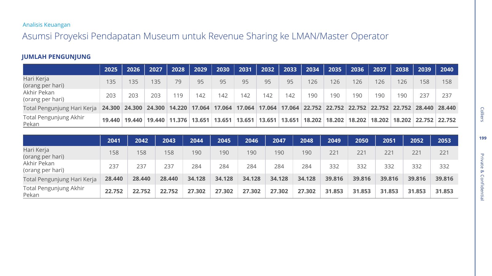
<!-- END COMPLETE PAGE RENDER: SLIDE 199 -->

| Kolom 1 | 2025 | 2026 | 2027 | 2028 | 2029 | 2030 | 2031 | 2032 | 2033 | 2034 | 2035 | 2036 | 2037 | 2038 | 2039 | 2040 |
| :--- | :--- | :--- | :--- | :--- | :--- | :--- | :--- | :--- | :--- | :--- | :--- | :--- | :--- | :--- | :--- | :--- |
| Hari Kerja (orang per hari) | 135 | 135 | 135 | 79 | 95 | 95 | 95 | 95 | 95 | 126 | 126 | 126 | 126 | 126 | 158 | 158 |
| Akhir Pekan (orang per hari) | 203 | 203 | 203 | 119 | 142 | 142 | 142 | 142 | 142 | 190 | 190 | 190 | 190 | 190 | 237 | 237 |
| Total PengunjungHari Kerja | 24.300 | 24.300 | 24.300 | 14.220 | 17.064 | 17.064 | 17.064 | 17.064 | 17.064 | 22.752 | 22.752 | 22.752 | 22.752 | 22.752 | 28.440 | 28.440 |
| Total PengunjungAkhir Pekan | 19.440 | 19.440 | 19.440 | 11.376 | 13.651 | 13.651 | 13.651 | 13.651 | 13.651 | 18.202 | 18.202 | 18.202 | 18.202 | 18.202 | 22.752 | 22.752 |

| Kolom 1 | 2041 | 2042 | 2043 | 2044 | 2045 | 2046 | 2047 | 2048 | 2049 | 2050 | 2051 | 2052 | 2053 |
| :--- | :--- | :--- | :--- | :--- | :--- | :--- | :--- | :--- | :--- | :--- | :--- | :--- | :--- |
| Hari Kerja (orang per hari) | 158 | 158 | 158 | 190 | 190 | 190 | 190 | 190 | 221 | 221 | 221 | 221 | 221 |
| Akhir Pekan (orang per hari) | 237 | 237 | 237 | 284 | 284 | 284 | 284 | 284 | 332 | 332 | 332 | 332 | 332 |
| Total PengunjungHari Kerja | 28.440 | 28.440 | 28.440 | 34.128 | 34.128 | 34.128 | 34.128 | 34.128 | 39.816 | 39.816 | 39.816 | 39.816 | 39.816 |
| Total PengunjungAkhir Pekan | 22.752 | 22.752 | 22.752 | 27.302 | 27.302 | 27.302 | 27.302 | 27.302 | 31.853 | 31.853 | 31.853 | 31.853 | 31.853 |

JUMLAH PENGUNJUNG

---

#### Slide 200: Analisis Keuangan Asumsi Proyeksi Pendapatan Museum untuk Revenue Sharing ke LMAN

<!-- BEGIN COMPLETE PAGE RENDER: SLIDE 200 -->
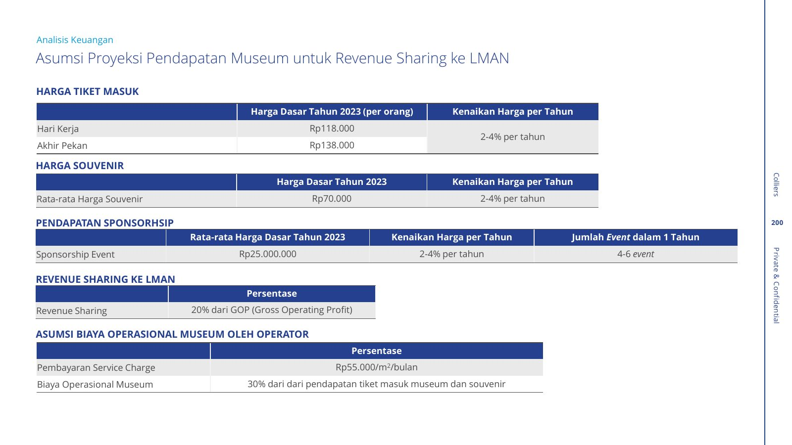
<!-- END COMPLETE PAGE RENDER: SLIDE 200 -->

HARGA TIKET MASUK

Harga Dasar Tahun 2023 (per orang) Kenaikan Harga per Tahun

Hari Kerja Rp118.000

Harga Dasar Tahun 2023 Kenaikan Harga per Tahun

HARGA SOUVENIR

Rata-rata Harga Dasar Tahun 2023 Kenaikan Harga per Tahun Jumlah Event dalam 1 Tahun

PENDAPATAN SPONSORHSIP

Persentase

Revenue Sharing 20% dari GOP (Gross Operating Profit)

REVENUE SHARING KE LMAN

Persentase

Pembayaran Service Charge Rp55.000/m2/bulan

Biaya Operasional Museum 30% dari dari pendapatan tiket masuk museum dan souvenir

ASUMSI BIAYA OPERASIONAL MUSEUM OLEH OPERATOR

---

#### Slide 201: Analisis Keuangan Asumsi Proyeksi Pendapatan MICE

<!-- BEGIN COMPLETE PAGE RENDER: SLIDE 201 -->
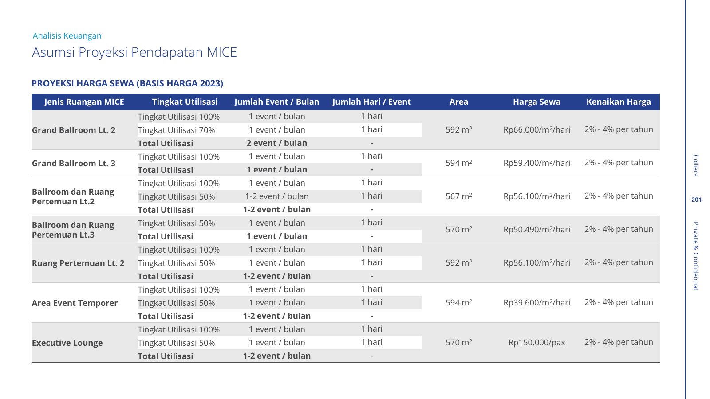
<!-- END COMPLETE PAGE RENDER: SLIDE 201 -->

| Jenis RuanganMICE | Tingkat Utilisasi | JumlahEvent / Bulan | JumlahHari/ Event | Area | HargaSewa | KenaikanHarga |
| :--- | :--- | :--- | :--- | :--- | :--- | :--- |
| Grand Ballroom Lt. 2 | Tingkat Utilisasi100% | 1 event /bulan | 1 hari | 592 m2 | Rp66.000/m2/hari | 2% -4%per tahun |
|  | Tingkat Utilisasi70% | 1 event /bulan | 1 hari |  |  |  |
|  | Total Utilisasi | 2 event / bulan | - |  |  |  |
| Grand Ballroom Lt. 3 | Tingkat Utilisasi100% | 1 event /bulan | 1 hari | 594 m2 | Rp59.400/m2/hari | 2% -4%per tahun |
|  | Total Utilisasi | 1 event / bulan | - |  |  |  |
| Ballroom dan Ruang PertemuanLt.2 | Tingkat Utilisasi100% | 1 event /bulan | 1 hari | 567 m2 | Rp56.100/m2/hari | 2% -4%per tahun |
|  | Tingkat Utilisasi50% | 1-2 event /bulan | 1 hari |  |  |  |
|  | Total Utilisasi | 1-2 event / bulan | - |  |  |  |
| Ballroom dan Ruang PertemuanLt.3 | Tingkat Utilisasi50% | 1 event /bulan | 1 hari | 570 m2 | Rp50.490/m2/hari | 2% -4%per tahun |
|  | Total Utilisasi | 1 event / bulan | - |  |  |  |
| Ruang PertemuanLt. 2 | Tingkat Utilisasi100% | 1 event /bulan | 1 hari | 592 m2 | Rp56.100/m2/hari | 2% -4%per tahun |
|  | Tingkat Utilisasi50% | 1 event /bulan | 1 hari |  |  |  |
|  | Total Utilisasi | 1-2 event / bulan | - |  |  |  |
| Area Event Temporer | Tingkat Utilisasi100% | 1 event /bulan | 1 hari | 594 m2 | Rp39.600/m2/hari | 2% -4%per tahun |
|  | Tingkat Utilisasi50% | 1 event /bulan | 1 hari |  |  |  |
|  | Total Utilisasi | 1-2 event / bulan | - |  |  |  |
| Executive Lounge | Tingkat Utilisasi100% | 1 event /bulan | 1 hari | 570 m2 | Rp150.000/pax | 2% -4%per tahun |
|  | Tingkat Utilisasi50% | 1 event /bulan | 1 hari |  |  |  |
|  | Total Utilisasi | 1-2 event / bulan | - |  |  |  |

PROYEKSI HARGA SEWA (BASIS HARGA 2023)

Jenis Ruangan MICE Tingkat Utilisasi Jumlah Event / Bulan Jumlah Hari / Event Area Harga Sewa Kenaikan Harga

Grand Ballroom Lt. 2

Grand Ballroom Lt. 3

Ruang Pertemuan Lt. 2

Area Event Temporer

Executive Lounge

---

### 10.3 Asumsi Biaya Capex & Biaya Operasional (Opex)

#### Slide 202: Asumsi Biaya Pengembangan dan Operasional

<!-- BEGIN COMPLETE PAGE RENDER: SLIDE 202 -->
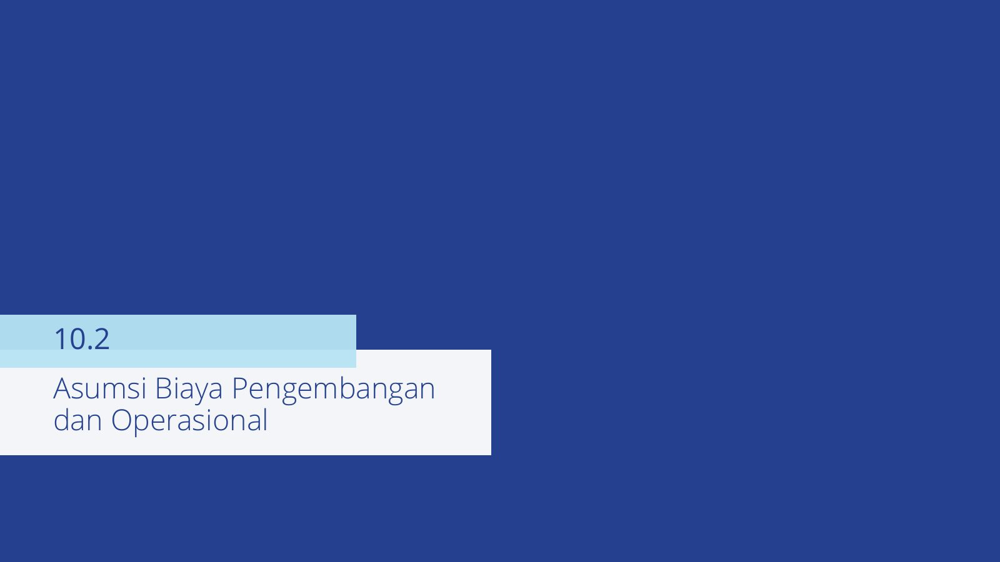
<!-- END COMPLETE PAGE RENDER: SLIDE 202 -->

10.2

---

#### Slide 203: Analisis Keuangan Asumsi Biaya Pengembangan

<!-- BEGIN COMPLETE PAGE RENDER: SLIDE 203 -->
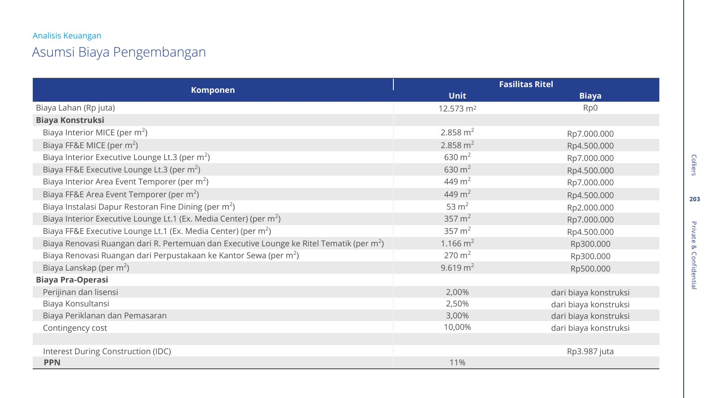
<!-- END COMPLETE PAGE RENDER: SLIDE 203 -->

| Komponen | FasilitasRitel | Kolom 3 |
| :--- | :--- | :--- |
|  | Unit | Biaya |
| BiayaLahan(Rpjuta) | 12.573 m2 | Rp0 |
| BiayaKonstruksi |  |  |
| BiayaInterior MICE (per m2) | 2.858 m2 | Rp7.000.000 |
| BiayaFF&E MICE (per m2) | 2.858 m2 | Rp4.500.000 |
| BiayaInterior Executive Lounge Lt.3 (per m2) | 630 m2 | Rp7.000.000 |
| BiayaFF&E Executive Lounge Lt.3 (per m2) | 630 m2 | Rp4.500.000 |
| BiayaInterior Area Event Temporer(per m2) | 449 m2 | Rp7.000.000 |
| BiayaFF&E Area Event Temporer(per m2) | 449 m2 | Rp4.500.000 |
| Biaya Instalasi Dapur Restoran Fine Dining (per m2) | 53 m2 | Rp2.000.000 |
| BiayaInterior Executive Lounge Lt.1 (Ex. Media Center) (per m2) | 357 m2 | Rp7.000.000 |
| Biaya FF&E Executive Lounge Lt.1 (Ex. Media Center) (per m2) | 357 m2 | Rp4.500.000 |
| BiayaRenovasiRuangandariR. Pertemuandan Executive Lounge keRitelTematik(per m2) | 1.166 m2 | Rp300.000 |
| BiayaRenovasiRuangandariPerpustakaankeKantor Sewa (per m2) | 270 m2 | Rp300.000 |
| BiayaLanskap(per m2) | 9.619 m2 | Rp500.000 |
| BiayaPra-Operasi |  |  |
| Perijinandan lisensi | 2,00% | daribiayakonstruksi |
| BiayaKonsultansi | 2,50% | daribiayakonstruksi |
| BiayaPeriklanandan Pemasaran | 3,00% | dari biaya konstruksi |
| Contingency cost | 10,00% | daribiayakonstruksi |
| Interest During Construction (IDC) |  | Rp3.987 juta |
| PPN | 11% |  |

Komponen Fasilitas Ritel Unit Biaya Biaya Lahan (Rp juta) 12.573 m2 Rp0

Biaya Konstruksi

---

#### Slide 204: Analisis Keuangan Asumsi Biaya Operasional

<!-- BEGIN COMPLETE PAGE RENDER: SLIDE 204 -->
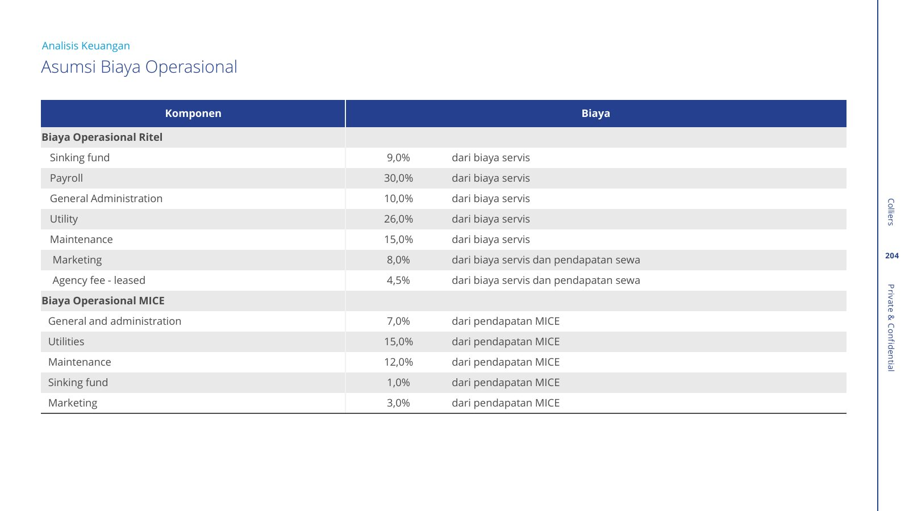
<!-- END COMPLETE PAGE RENDER: SLIDE 204 -->

| Komponen | Biaya | Kolom 3 |
| :--- | :--- | :--- |
| Biaya Operasional Ritel |  |  |
| Sinking fund | 9,0% | daribiayaservis |
| Payroll | 30,0% | daribiayaservis |
| General Administration | 10,0% | daribiayaservis |
| Utility | 26,0% | daribiayaservis |
| Maintenance | 15,0% | daribiayaservis |
| Marketing | 8,0% | daribiayaservisdan pendapatansewa |
| Agency fee -leased | 4,5% | daribiayaservisdan pendapatansewa |
| Biaya Operasional MICE |  |  |
| General and administration | 7,0% | dari pendapatan MICE |
| Utilities | 15,0% | dari pendapatan MICE |
| Maintenance | 12,0% | dari pendapatan MICE |
| Sinking fund | 1,0% | dari pendapatan MICE |
| Marketing | 3,0% | daripendapatanMICE |

Komponen Biaya

Biaya Operasional Ritel

Marketing 8,0% dari biaya servis dan pendapatan sewa

Agency fee - leased 4,5% dari biaya servis dan pendapatan sewa

Biaya Operasional MICE

---

#### Slide 205: Analisis Keuangan Asumsi Biaya Operasional

<!-- BEGIN COMPLETE PAGE RENDER: SLIDE 205 -->
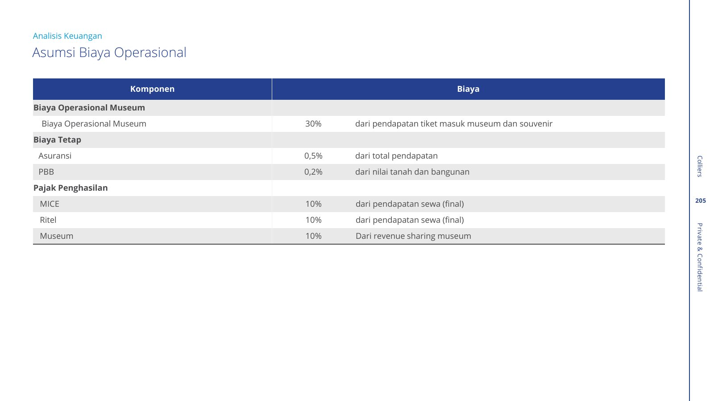
<!-- END COMPLETE PAGE RENDER: SLIDE 205 -->

| Komponen | Biaya | Kolom 3 |
| :--- | :--- | :--- |
| Biaya Operasional Museum |  |  |
| BiayaOperasionalMuseum | 30% | daripendapatantiketmasukmuseum dan souvenir |
| BiayaTetap |  |  |
| Asuransi | 0,5% | daritotal pendapatan |
| PBB | 0,2% | dari nilai tanah dan bangunan |
| PajakPenghasilan |  |  |
| MICE | 10% | daripendapatansewa(final) |
| Ritel | 10% | daripendapatansewa(final) |
| Museum | 10% | Dari revenue sharing museum |

Komponen Biaya

Biaya Operasional Museum

Biaya Tetap

Pajak Penghasilan

---

### 10.4 Proyeksi Laba Rugi, Arus Kas & Kelayakan Finansial

#### Slide 206: Proyeksi Imbal Hasil Investasi

<!-- BEGIN COMPLETE PAGE RENDER: SLIDE 206 -->

<!-- END COMPLETE PAGE RENDER: SLIDE 206 -->

10.3

---

#### Slide 207: Analisis Keuangan Proyeksi Laba Rugi dan Arus Kas

<!-- BEGIN COMPLETE PAGE RENDER: SLIDE 207 -->
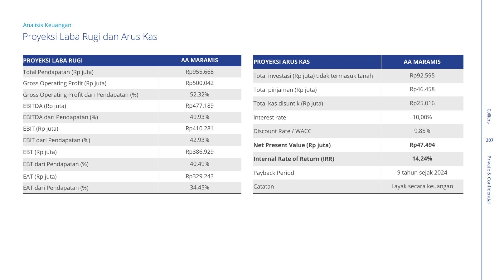
<!-- END COMPLETE PAGE RENDER: SLIDE 207 -->

| PROYEKSI LABA RUGI | AA MARAMIS |
| :--- | :--- |
| Total Pendapatan(Rp juta) | Rp955.668 |
| Gross Operating Profit (Rp juta) | Rp500.042 |
| Gross Operating Profit dari Pendapatan (%) | 52,32% |
| EBITDA (Rp juta) | Rp477.189 |
| EBITDA dari Pendapatan (%) | 49,93% |
| EBIT (Rp juta) | Rp410.281 |
| EBIT dari Pendapatan (%) | 42,93% |
| EBT (Rp juta) | Rp386.929 |
| EBT dari Pendapatan (%) | 40,49% |
| EAT (Rp juta) | Rp329.243 |
| EAT dari Pendapatan (%) | 34,45% |

| PROYEKSI ARUS KAS | AA MARAMIS |
| :--- | :--- |
| Total investasi(Rp juta) tidaktermasuktanah | Rp92.595 |
| Total pinjaman(Rp juta) | Rp46.458 |
| Total kas disuntik (Rp juta) | Rp25.016 |
| Interest rate | 10,00% |
| Discount Rate / WACC | 9,85% |
| Net Present Value (Rp juta) | Rp47.494 |
| Internal Rate of Return (IRR) | 14,24% |
| Payback Period | 9 tahun sejak 2024 |
| Catatan | Layaksecarakeuangan |

Total investasi (Rp juta) tidak termasuk tanah Rp92.595

Interest rate 10,00%

Catatan Layak secara keuangan

---

## Bab 11: Manajemen Risiko

> [!WARNING]
> Bab ini mengidentifikasi risiko proyek, operasional, pasar/IKN, dan finansial beserta langkah mitigasi mitigasi terpadu.

#### Slide 208: 11 Manajemen Resiko

<!-- BEGIN COMPLETE PAGE RENDER: SLIDE 208 -->

<!-- END COMPLETE PAGE RENDER: SLIDE 208 -->

---

#### Slide 209: Manajemen Risiko – AA Maramis Manajemen Resiko

<!-- BEGIN COMPLETE PAGE RENDER: SLIDE 209 -->
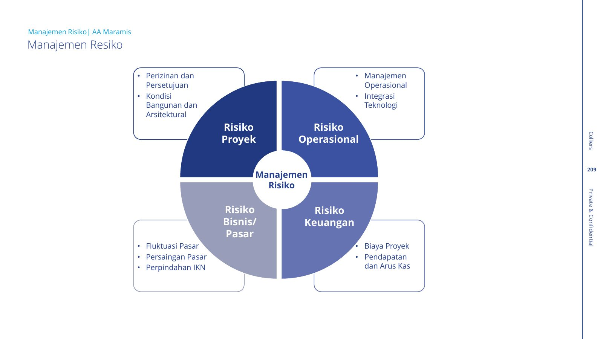
<!-- END COMPLETE PAGE RENDER: SLIDE 209 -->

- 
  Biaya Proyek
- 
  Pendapatan
  dan Arus Kas

- Fluktuasi Pasar
- Persaingan Pasar
- Perpindahan IKN

- 
  Manajemen
  Operasional
- 
  Integrasi
  Teknologi

- Perizinan dan
  Persetujuan
- Kondisi
  Bangunan dan
  Arsitektural

Manajemen

Risiko

Risiko Operasional Risiko Proyek

Risiko Bisnis/

Pasar

Risiko Keuangan

---

#### Slide 210: Manajemen Risiko – AA Maramis Manajemen Resiko

<!-- BEGIN COMPLETE PAGE RENDER: SLIDE 210 -->
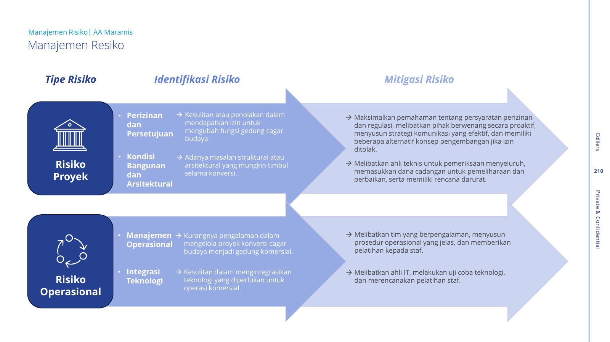
<!-- END COMPLETE PAGE RENDER: SLIDE 210 -->

| Tipe Risiko | Komponen Identifikasi Risiko | Deskripsi Risiko | Rencana Tindakan Mitigasi |
| :--- | :--- | :--- | :--- |
| **Risiko Proyek** | **Perizinan dan Persetujuan** | Kesulitan atau penolakan dalam mendapatkan izin untuk mengubah fungsi gedung cagar budaya menjadi fungsi komersial. | Maksimalkan pemahaman tentang persyaratan perizinan dan regulasi, melibatkan pihak berwenang secara proaktif, menyusun strategi komunikasi yang efektif, dan memiliki beberapa alternatif konsep pengembangan jika izin ditolak. |
| | **Kondisi Bangunan dan Arsitektural** | Adanya masalah struktural atau arsitektural yang mungkin timbul selama pekerjaan konversi/fit-out. | Melibatkan ahli teknis cagar budaya (TACB) untuk pemeriksaan menyeluruh, memasukkan dana cadangan (*contingency budget*) untuk pemeliharaan dan perbaikan, serta memiliki rencana tanggap darurat. |
| **Risiko Operasional** | **Manajemen Operasional** | Kurangnya pengalaman dalam mengelola proyek konversi cagar budaya menjadi gedung komersial adaptif. | Melibatkan tim/operator properti yang berpengalaman, menyusun prosedur operasional standar (SOP) yang ketat, dan memberikan pelatihan terstruktur kepada staf operasional. |
| | **Integrasi Teknologi** | Kesulitan dalam mengintegrasikan teknologi modern (MEP, IT, AV) tanpa merusak struktur cagar budaya. | Melibatkan konsultan ahli IT/MEP spesialis cagar budaya, melakukan uji coba teknologi secara bertahap, dan merencanakan pelatihan staf secara berkala. |

- Perizinan
  dan
  Persetujuan

- Kondisi
  Bangunan
  dan
  Arsitektural

Risiko Proyek

→Kesulitan atau penolakan dalam

mendapatkan izin untuk mengubah fungsi gedung cagar budaya.

→Adanya masalah struktural atau

arsitektural yang mungkin timbul selama konversi.

→Maksimalkan pemahaman tentang persyaratan perizinan

dan regulasi, melibatkan pihak berwenang secara proaktif, menyusun strategi komunikasi yang efektif, dan memiliki beberapa alternatif konsep pengembangan jika izin ditolak.

→Melibatkan ahli teknis untuk pemeriksaan menyeluruh,

memasukkan dana cadangan untuk pemeliharaan dan perbaikan, serta memiliki rencana darurat.

Risiko Operasional

- Manajemen
  Operasional

- Integrasi
  Teknologi

→Kurangnya pengalaman dalam

mengelola proyek konversi cagar budaya menjadi gedung komersial.

→Kesulitan dalam mengintegrasikan

teknologi yang diperlukan untuk operasi komersial.

→Melibatkan tim yang berpengalaman, menyusun

prosedur operasional yang jelas, dan memberikan pelatihan kepada staf.

→Melibatkan ahli IT, melakukan uji coba teknologi,

dan merencanakan pelatihan staf.

---

#### Slide 211: Manajemen Risiko – AA Maramis Manajemen Resiko

<!-- BEGIN COMPLETE PAGE RENDER: SLIDE 211 -->
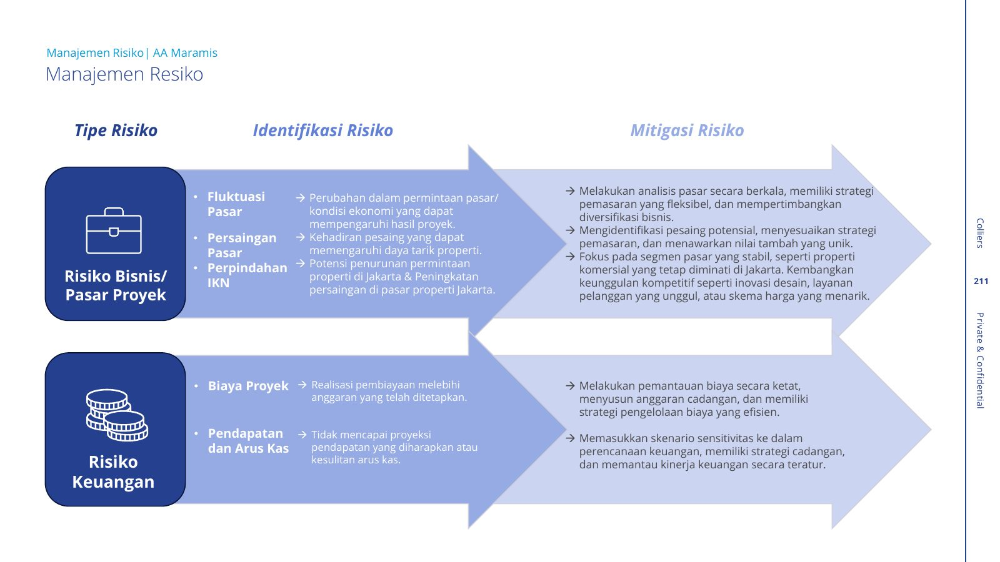
<!-- END COMPLETE PAGE RENDER: SLIDE 211 -->

| Tipe Risiko | Komponen Identifikasi Risiko | Deskripsi Risiko | Rencana Tindakan Mitigasi |
| :--- | :--- | :--- | :--- |
| **Risiko Bisnis / Pasar** | **Fluktuasi Pasar** | Perubahan dalam permintaan pasar atau kondisi ekonomi makro yang dapat mempengaruhi hasil pendapatan proyek. | Melakukan analisis pasar secara berkala, memiliki strategi pemasaran yang fleksibel, dan mempertimbangkan diversifikasi portofolio penyewa. |
| | **Persaingan Pasar** | Kehadiran pesaing baru yang dapat memengaruhi daya tarik dan tingkat okupansi properti. | Mengidentifikasi pesaing potensial, menyesuaikan strategi pemasaran, dan menawarkan nilai tambah (*unique selling point*) berbasis heritage otentik. |
| | **Perpindahan IKN** | Potensi penurunan permintaan properti perkantoran di Jakarta dan peningkatan persaingan di pasar properti komersial. | Fokus pada segmen pasar yang stabil (komersial gaya hidup, pariwisata heritage, MICE kenegaraan & swasta). Kembangkan keunggulan kompetitif unik berupa prestise sejarah, kualitas layanan, dan paket harga menarik. |
| **Risiko Keuangan** | **Biaya Proyek (Capex)** | Realisasi biaya pemugaran dan fit-out melebihi anggaran yang telah ditetapkan (*cost overrun*). | Melakukan pemantauan biaya secara ketat, menyusun alokasi anggaran cadangan (*contingency*), dan menerapkan kontrak kerja yang transparan. |
| | **Pendapatan & Arus Kas** | Tidak tercapainya proyeksi target pendapatan sewa atau timbulnya defisit arus kas operasional. | Memasukkan analisis sensitivitas ke dalam perencanaan keuangan, memiliki strategi cadangan (*buffer cash*), dan memantau kinerja keuangan mitra secara berkala. |

Risiko Bisnis/

Pasar Proyek

Risiko Keuangan

- Fluktuasi
  Pasar

- Persaingan
  Pasar
- Perpindahan
  IKN

→Perubahan dalam permintaan pasar/

kondisi ekonomi yang dapat mempengaruhi hasil proyek. →Kehadiran pesaing yang dapat

memengaruhi daya tarik properti. →Potensi penurunan permintaan

properti di Jakarta & Peningkatan persaingan di pasar properti Jakarta.

→Melakukan analisis pasar secara berkala, memiliki strategi

pemasaran yang fleksibel, dan mempertimbangkan diversifikasi bisnis. →Mengidentifikasi pesaing potensial, menyesuaikan strategi

pemasaran, dan menawarkan nilai tambah yang unik. →Fokus pada segmen pasar yang stabil, seperti properti

komersial yang tetap diminati di Jakarta. Kembangkan keunggulan kompetitif seperti inovasi desain, layanan pelanggan yang unggul, atau skema harga yang menarik.

• Biaya Proyek

- Pendapatan
  dan Arus Kas

→Realisasi pembiayaan melebihi

anggaran yang telah ditetapkan.

→Tidak mencapai proyeksi

pendapatan yang diharapkan atau kesulitan arus kas.

→Melakukan pemantauan biaya secara ketat,

menyusun anggaran cadangan, dan memiliki strategi pengelolaan biaya yang efisien.

→Memasukkan skenario sensitivitas ke dalam

perencanaan keuangan, memiliki strategi cadangan, dan memantau kinerja keuangan secara teratur.

---

## Bab 12: Rencana Aksi (Action Plan)

> [!NOTE]
> Bab ini menetapkan peta jalan rencana aksi (*Action Plan Roadmap*) periode 2023 hingga 2026.

#### Slide 212: 

<!-- BEGIN COMPLETE PAGE RENDER: SLIDE 212 -->
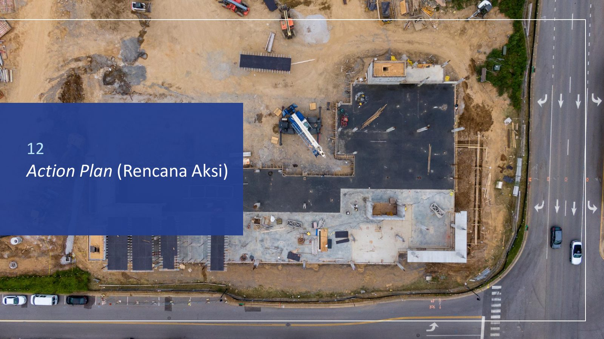
<!-- END COMPLETE PAGE RENDER: SLIDE 212 -->

---

#### Slide 213: Timeline Pengembangan – AA Maramis Action Plan (Rencana Aksi)

<!-- BEGIN COMPLETE PAGE RENDER: SLIDE 213 -->
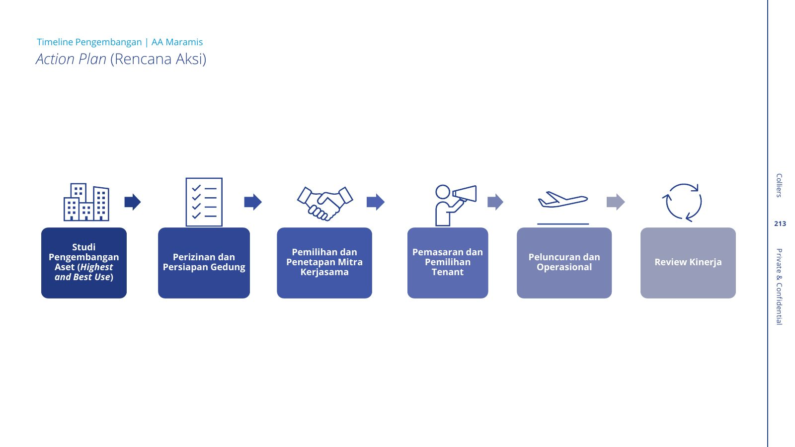
<!-- END COMPLETE PAGE RENDER: SLIDE 213 -->

Studi Pengembangan

Aset (Highest and Best Use)

Perizinan dan Persiapan Gedung

Pemilihan dan Penetapan Mitra

Kerjasama

Pemasaran dan

Pemilihan

Tenant

Peluncuran dan

Operasional Review Kinerja

---

#### Slide 214: Timeline Pengembangan – AA Maramis Action Plan (Rencana Aksi)

<!-- BEGIN COMPLETE PAGE RENDER: SLIDE 214 -->
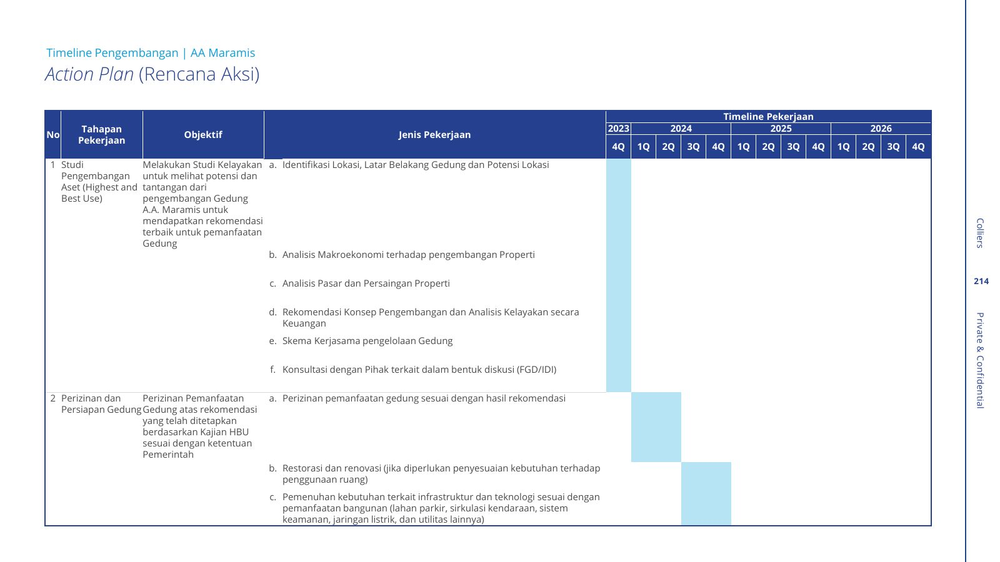
<!-- END COMPLETE PAGE RENDER: SLIDE 214 -->

| No | Tahapan Pekerjaan | Objektif | JenisPekerjaan | Kolom 5 | Timeline Pekerjaan | Kolom 7 | Kolom 8 | Kolom 9 | Kolom 10 | Kolom 11 | Kolom 12 | Kolom 13 | Kolom 14 | Kolom 15 | Kolom 16 | Kolom 17 | Kolom 18 |
| :--- | :--- | :--- | :--- | :--- | :--- | :--- | :--- | :--- | :--- | :--- | :--- | :--- | :--- | :--- | :--- | :--- | :--- |
|  |  |  |  |  | 2023 | 2024 |  |  |  | 2025 |  |  |  | 2026 |  |  |  |
|  |  |  |  |  | 4Q | 1Q | 2Q | 3Q | 4Q | 1Q | 2Q | 3Q | 4Q | 1Q | 2Q | 3Q | 4Q |
| 1 | Studi Pengembangan Aset(Highest and Best Use) | MelakukanStudiKelayakan untukmelihatpotensidan tantangandari pengembanganGedung A.A. Maramisuntuk mendapatkanrekomendasi terbaikuntukpemanfaatan Gedung | a. | Identifikasi Lokasi, Latar Belakang Gedung dan Potensi Lokasi |  |  |  |  |  |  |  |  |  |  |  |  |  |
|  |  |  | b. | AnalisisMakroekonomiterhadappengembanganProperti |  |  |  |  |  |  |  |  |  |  |  |  |  |
|  |  |  | c. | AnalisisPasar dan PersainganProperti |  |  |  |  |  |  |  |  |  |  |  |  |  |
|  |  |  | d. | RekomendasiKonsepPengembangandan AnalisisKelayakansecara Keuangan |  |  |  |  |  |  |  |  |  |  |  |  |  |
|  |  |  | e. | Skema Kerjasama pengelolaan Gedung |  |  |  |  |  |  |  |  |  |  |  |  |  |
|  |  |  | f. | KonsultasidenganPihakterkaitdalambentukdiskusi(FGD/IDI) |  |  |  |  |  |  |  |  |  |  |  |  |  |
| 2 | Perizinandan PersiapanGedung | PerizinanPemanfaatan Gedung atasrekomendasi yang telahditetapkan berdasarkanKajian HBU sesuaidenganketentuan Pemerintah | a. | Perizinanpemanfaatangedungsesuaidenganhasilrekomendasi |  |  |  |  |  |  |  |  |  |  |  |  |  |
|  |  |  | b. | Restorasidan renovasi(jikadiperlukanpenyesuaiankebutuhanterhadap penggunaanruang) |  |  |  |  |  |  |  |  |  |  |  |  |  |
|  |  |  | c. | Pemenuhankebutuhanterkaitinfrastrukturdan teknologisesuaidengan pemanfaatanbangunan(lahanparkir, sirkulasikendaraan, sistem keamanan, jaringanlistrik, dan utilitaslainnya) |  |  |  |  |  |  |  |  |  |  |  |  |  |

Melakukan Studi Kelayakan untuk melihat potensi dan tantangan dari pengembangan Gedung A.A. Maramis untuk mendapatkan rekomendasi terbaik untuk pemanfaatan Gedung

b. Analisis Makroekonomi terhadap pengembangan Properti

c. Analisis Pasar dan Persaingan Properti

d. Rekomendasi Konsep Pengembangan dan Analisis Kelayakan secara

Keuangan

f. Konsultasi dengan Pihak terkait dalam bentuk diskusi (FGD/IDI)

2 Perizinan dan Persiapan Gedung

Perizinan Pemanfaatan Gedung atas rekomendasi yang telah ditetapkan berdasarkan Kajian HBU sesuai dengan ketentuan Pemerintah

a. Perizinan pemanfaatan gedung sesuai dengan hasil rekomendasi

b. Restorasi dan renovasi (jika diperlukan penyesuaian kebutuhan terhadap

penggunaan ruang)

c. Pemenuhan kebutuhan terkait infrastruktur dan teknologi sesuai dengan

pemanfaatan bangunan (lahan parkir, sirkulasi kendaraan, sistem keamanan, jaringan listrik, dan utilitas lainnya)

---

#### Slide 215: Timeline Pengembangan – AA Maramis Action Plan (Rencana Aksi)

<!-- BEGIN COMPLETE PAGE RENDER: SLIDE 215 -->
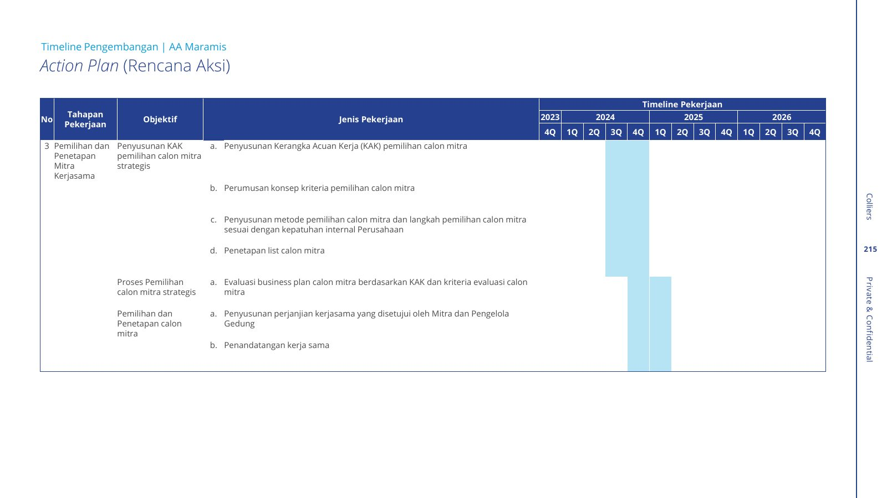
<!-- END COMPLETE PAGE RENDER: SLIDE 215 -->

| No | Tahapan Pekerjaan | Objektif | JenisPekerjaan | Kolom 5 | Timeline Pekerjaan | Kolom 7 | Kolom 8 | Kolom 9 | Kolom 10 | Kolom 11 | Kolom 12 | Kolom 13 | Kolom 14 | Kolom 15 | Kolom 16 | Kolom 17 | Kolom 18 |
| :--- | :--- | :--- | :--- | :--- | :--- | :--- | :--- | :--- | :--- | :--- | :--- | :--- | :--- | :--- | :--- | :--- | :--- |
|  |  |  |  |  | 2023 | 2024 |  |  |  | 2025 |  |  |  | 2026 |  |  |  |
|  |  |  |  |  | 4Q | 1Q | 2Q | 3Q | 4Q | 1Q | 2Q | 3Q | 4Q | 1Q | 2Q | 3Q | 4Q |
| 3 | Pemilihan dan Penetapan Mitra Kerjasama | PenyusunanKAK pemilihancalonmitra strategis | a. | Penyusunan Kerangka Acuan Kerja (KAK) pemilihan calon mitra |  |  |  |  |  |  |  |  |  |  |  |  |  |
|  |  |  | b. | Perumusan konsep kriteria pemilihan calon mitra |  |  |  |  |  |  |  |  |  |  |  |  |  |
|  |  |  | c. | Penyusunanmetodepemilihancalonmitradan langkahpemilihancalonmitra sesuaidengankepatuhaninternal Perusahaan |  |  |  |  |  |  |  |  |  |  |  |  |  |
|  |  |  | d. | Penetapan list calon mitra |  |  |  |  |  |  |  |  |  |  |  |  |  |
|  |  | Proses Pemilihan calon mitra strategis | a. | Evaluasibusiness plan calonmitraberdasarkanKAK dan kriteriaevaluasicalon mitra |  |  |  |  |  |  |  |  |  |  |  |  |  |
|  |  | Pemilihan dan Penetapan calon mitra | a. | Penyusunanperjanjiankerjasamayang disetujuioleh Mitra dan Pengelola Gedung |  |  |  |  |  |  |  |  |  |  |  |  |  |
|  |  |  | b. | Penandatangankerjasama |  |  |  |  |  |  |  |  |  |  |  |  |  |

Timeline Pekerjaan

2023 2024 2025 2026

- **c.** 
  Penyusunan metode pemilihan calon mitra dan langkah pemilihan calon mitra
  sesuai dengan kepatuhan internal Perusahaan

- **a.** 
  Evaluasi business plan calon mitra berdasarkan KAK dan kriteria evaluasi calon
  mitra

- **a.** 
  Penyusunan perjanjian kerjasama yang disetujui oleh Mitra dan Pengelola
  Gedung

b. Penandatangan kerja sama

---

#### Slide 216: Timeline Pengembangan – AA Maramis Action Plan (Rencana Aksi)

<!-- BEGIN COMPLETE PAGE RENDER: SLIDE 216 -->
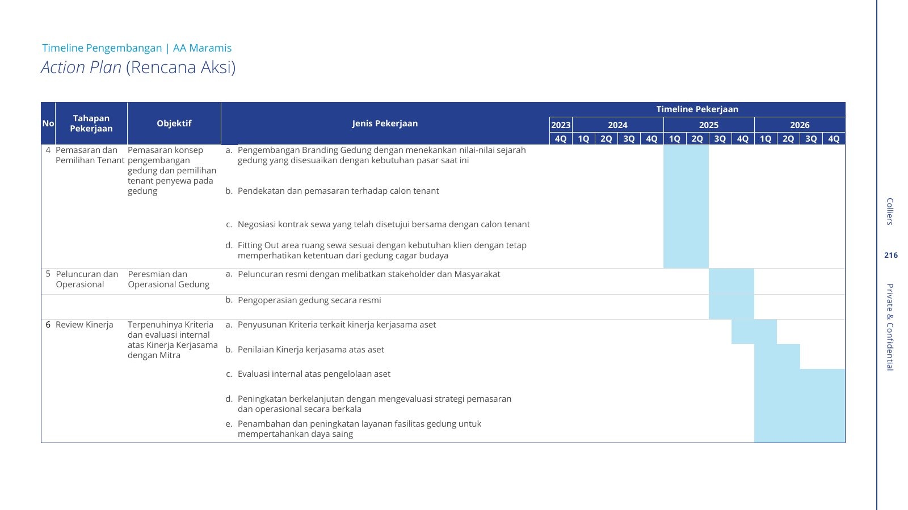
<!-- END COMPLETE PAGE RENDER: SLIDE 216 -->

| No | Tahapan Pekerjaan | Objektif | JenisPekerjaan | Kolom 5 | Kolom 6 | Timeline Pekerjaan | Kolom 8 | Kolom 9 | Kolom 10 | Kolom 11 | Kolom 12 | Kolom 13 | Kolom 14 | Kolom 15 | Kolom 16 | Kolom 17 | Kolom 18 | Kolom 19 |
| :--- | :--- | :--- | :--- | :--- | :--- | :--- | :--- | :--- | :--- | :--- | :--- | :--- | :--- | :--- | :--- | :--- | :--- | :--- |
|  |  |  |  |  |  | 2023 | 2024 |  |  |  | 2025 |  |  |  | 2026 |  |  |  |
|  |  |  |  |  |  | 4Q | 1Q | 2Q | 3Q | 4Q | 1Q | 2Q | 3Q | 4Q | 1Q | 2Q | 3Q | 4Q |
| 4 | Pemasarandan PemilihanTenant | Pemasarankonsep a. pengembangan gedungdan pemilihan tenant penyewapada gedung b. c. d. | a. | PengembanganBranding Gedung denganmenekankannilai-nilaisejarah gedungyang disesuaikandengankebutuhanpasar saatini |  |  |  |  |  |  |  |  |  |  |  |  |  |  |
|  |  |  | b. | Pendekatandan pemasaranterhadapcalontenant |  |  |  |  |  |  |  |  |  |  |  |  |  |  |
|  |  |  | c. | Negosiasikontraksewayang telahdisetujuibersamadengancalontenant |  |  |  |  |  |  |  |  |  |  |  |  |  |  |
|  |  |  |  | Fitting Out area ruangsewasesuaidengankebutuhankliendengantetap memperhatikanketentuandarigedungcagarbudaya |  |  |  |  |  |  |  |  |  |  |  |  |  |  |
| 5 | Peluncurandan Operasional | Peresmiandan OperasionalGedung | a. | Peluncuranresmidenganmelibatkanstakeholder dan Masyarakat |  |  |  |  |  |  |  |  |  |  |  |  |  |  |
|  |  |  | b. | Pengoperasian gedung secara resmi |  |  |  |  |  |  |  |  |  |  |  |  |  |  |
| 6 | Review Kinerja | Terpenuhinya Kriteria dan evaluasi internal atas Kinerja Kerjasama dengan Mitra | a. | Penyusunan Kriteria terkait kinerja kerjasama aset |  |  |  |  |  |  |  |  |  |  |  |  |  |  |
|  |  |  | b. | Penilaian Kinerja kerjasama atas aset |  |  |  |  |  |  |  |  |  |  |  |  |  |  |
|  |  |  | c. | Evaluasi internal atas pengelolaan aset |  |  |  |  |  |  |  |  |  |  |  |  |  |  |
|  |  |  | d. | Peningkatanberkelanjutandenganmengevaluasistrategi pemasaran dan operasionalsecaraberkala |  |  |  |  |  |  |  |  |  |  |  |  |  |  |
|  |  |  | e. | Penambahan dan peningkatan layanan fasilitas gedung untuk mempertahankan daya saing |  |  |  |  |  |  |  |  |  |  |  |  |  |  |

Timeline Pekerjaan

2023 2024 2025 2026

Pemasaran konsep pengembangan gedung dan pemilihan tenant penyewa pada gedung

a. Pengembangan Branding Gedung dengan menekankan nilai-nilai sejarah

gedung yang disesuaikan dengan kebutuhan pasar saat ini

b. Pendekatan dan pemasaran terhadap calon tenant

c. Negosiasi kontrak sewa yang telah disetujui bersama dengan calon tenant

d. Fitting Out area ruang sewa sesuai dengan kebutuhan klien dengan tetap

memperhatikan ketentuan dari gedung cagar budaya

5 Peluncuran dan Operasional

Peresmian dan Operasional Gedung

a. Peluncuran resmi dengan melibatkan stakeholder dan Masyarakat

d. Peningkatan berkelanjutan dengan mengevaluasi strategi pemasaran

dan operasional secara berkala

mempertahankan daya saing

---

## Bab 13: Benchmarking Internasional & Penutup

> [!NOTE]
> Bab ini menyajikan benchmarking proyek adaptasi cagar budaya internasional (Tai Kwun Hong Kong, National Gallery Singapore, CHIJMES).

#### Slide 217: 13 Benchmarking

<!-- BEGIN COMPLETE PAGE RENDER: SLIDE 217 -->
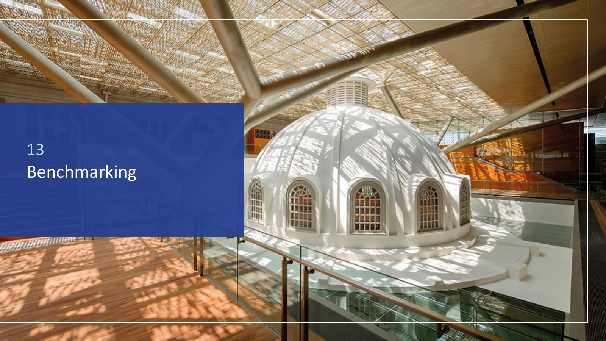
<!-- END COMPLETE PAGE RENDER: SLIDE 217 -->

---

#### Slide 218: Benchmarking – Singapore & Hongkong Benchmarking

<!-- BEGIN COMPLETE PAGE RENDER: SLIDE 218 -->
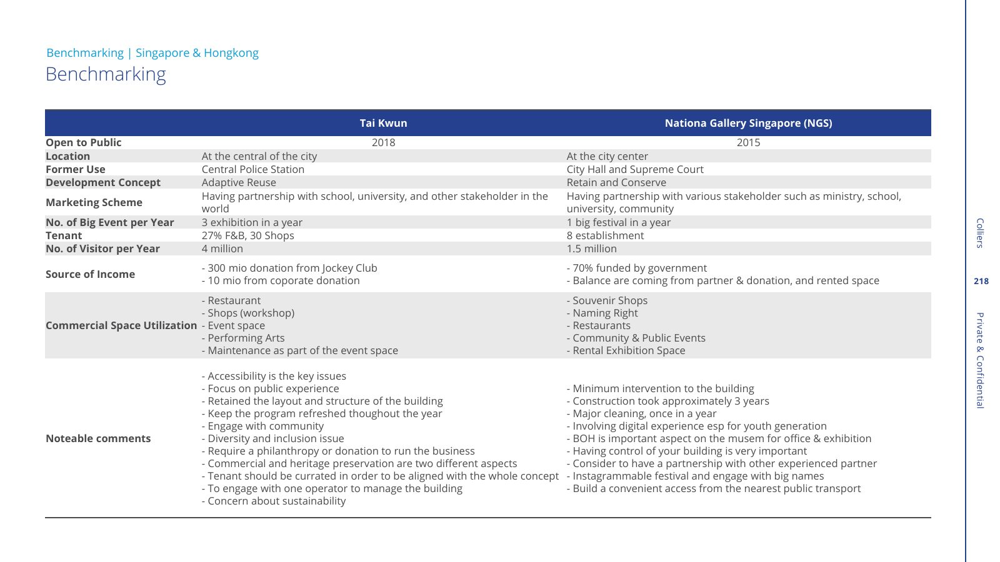
<!-- END COMPLETE PAGE RENDER: SLIDE 218 -->

| Kolom 1 | Tai Kwun | NationaGallery Singapore (NGS) |
| :--- | :--- | :--- |
| Open to Public | 2018 | 2015 |
| Location | At the central of the city | At the city center |
| Former Use | Central Police Station | City Hall and Supreme Court |
| Development Concept | Adaptive Reuse | Retain and Conserve |
| Marketing Scheme | Having partnership with school, university, and otherstakeholder in the world | Having partnership with various stakeholder such as ministry, school, university, community |
| No. of Big Event per Year | 3 exhibition in a year | 1 big festival in a year |
| Tenant | 27% F&B, 30 Shops | 8 establishment |
| No. of Visitor per Year | 4 million | 1.5 million |
| Source of Income | -300 mio donation from Jockey Club -10 mio from coporate donation | -70% funded by government -Balance are coming from partner & donation, and rented space |
| Commercial Space Utilization | -Restaurant -Shops (workshop) -Event space -Performing Arts -Maintenance as part of the event space | -Souvenir Shops -Naming Right -Restaurants -Community & Public Events -Rental Exhibition Space |
| Noteablecomments | -Accessibility is the key issues -Focus on public experience -Retained the layout and structure of the building -Keep the program refreshed thoughoutthe year -Engage with community -Diversity and inclusion issue -Require a philanthropy or donation to run the business -Commercial and heritage preservation are two different aspects -Tenant should be curratedin order tobe aligned with the whole concept -To engage with one operator to manage the building -Concern about sustainability | -Minimum intervention to the building -Construction took approximately 3 years -Major cleaning, once in a year -Involving digital experience espfor youth generation -BOH is important aspect on the musemfor office & exhibition -Having control of your building is very important -Consider to have a partnership with otherexperienced partner -Instagrammablefestival and engage with big names -Build a convenient access from the nearest public transport |

Tai Kwun Nationa Gallery Singapore (NGS)

Commercial Space Utilization

Noteable comments

---

#### Slide 219: Accelerating success.

<!-- BEGIN COMPLETE PAGE RENDER: SLIDE 219 -->
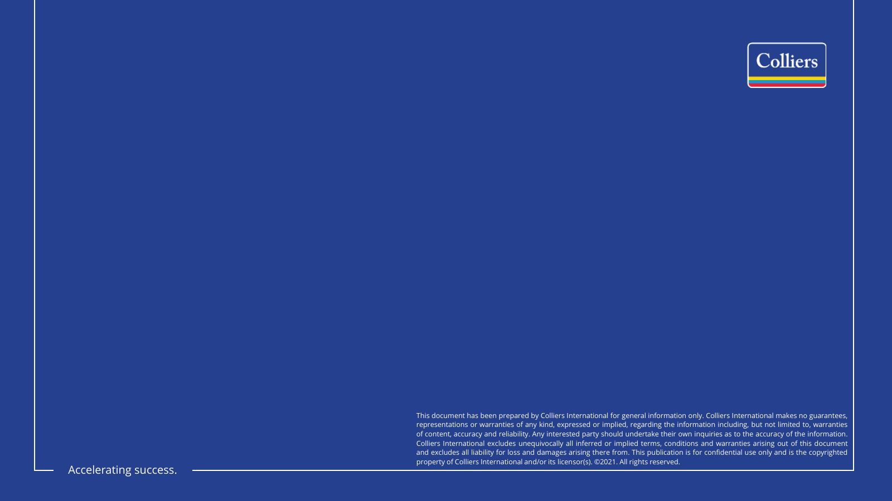
<!-- END COMPLETE PAGE RENDER: SLIDE 219 -->

This document has been prepared by Colliers International for general information only. Colliers International makes no guarantees, representations or warranties of any kind, expressed or implied, regarding the information including, but not limited to, warranties of content, accuracy and reliability. Any interested party should undertake their own inquiries as to the accuracy of the information. Colliers International excludes unequivocally all inferred or implied terms, conditions and warranties arising out of this document and excludes all liability for loss and damages arising there from. This publication is for confidential use only and is the copyrighted property of Colliers International and/or its licensor(s). ©2021. All rights reserved.

---
