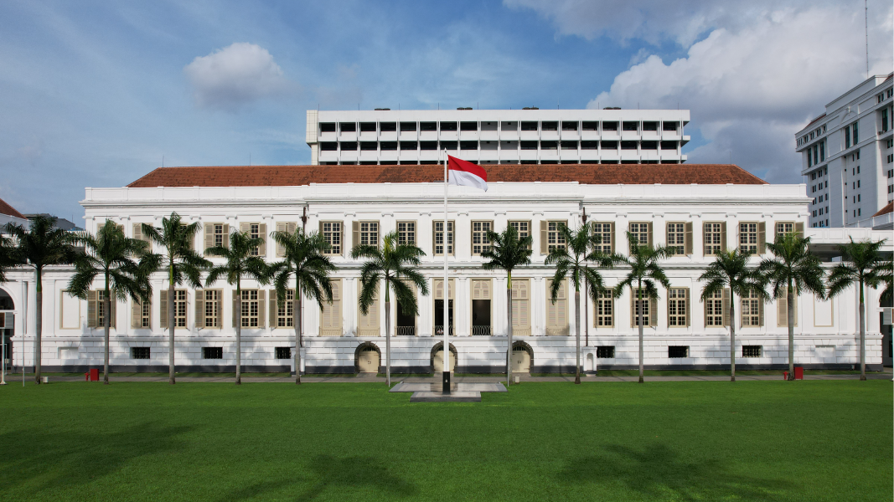
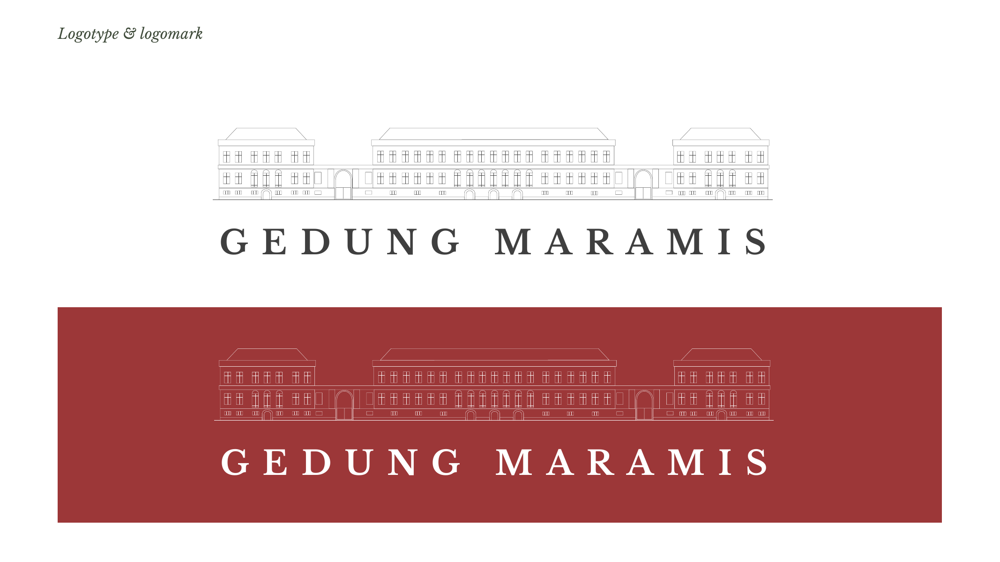
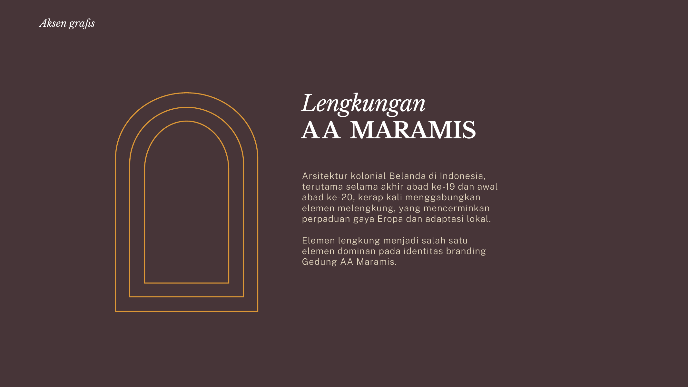
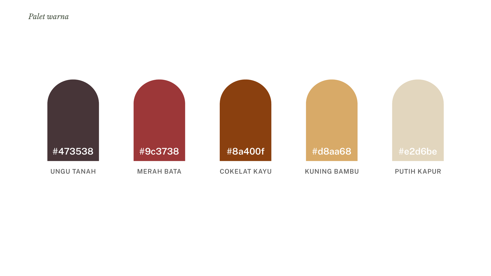
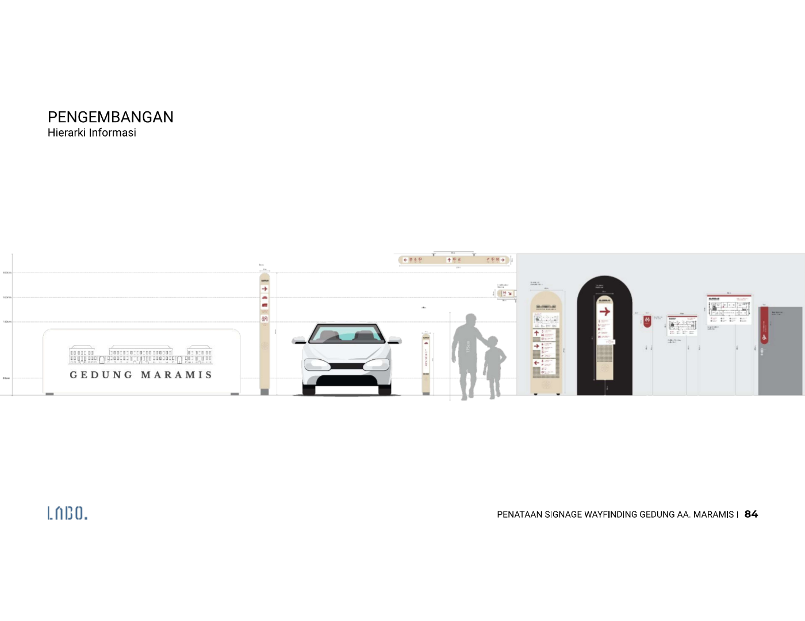
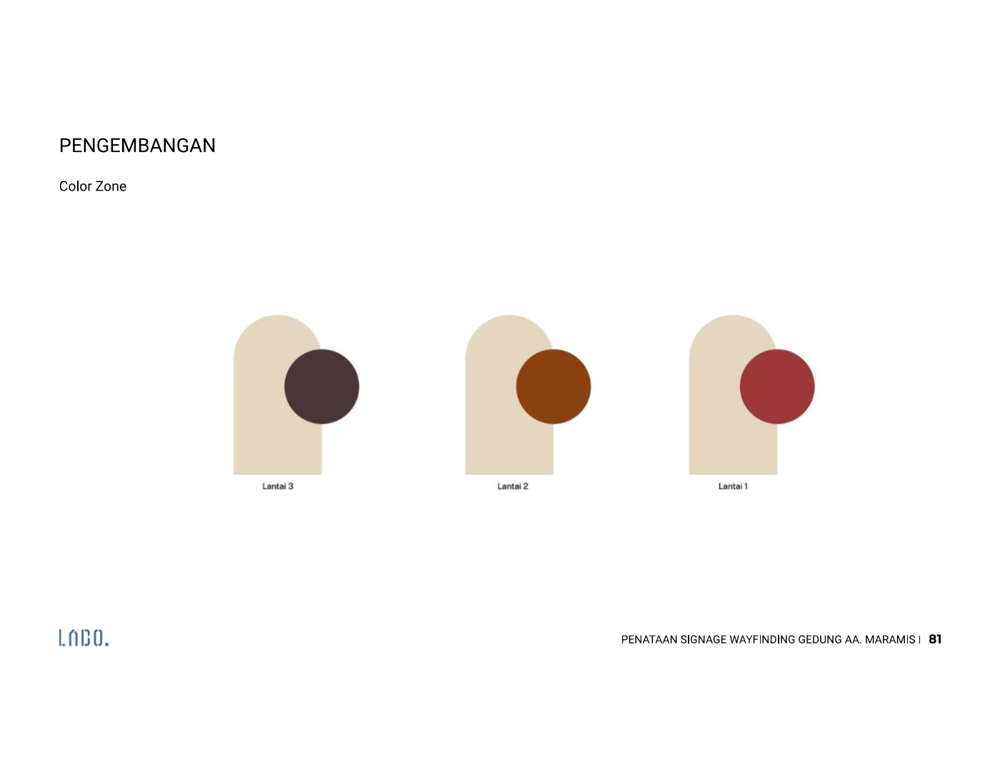
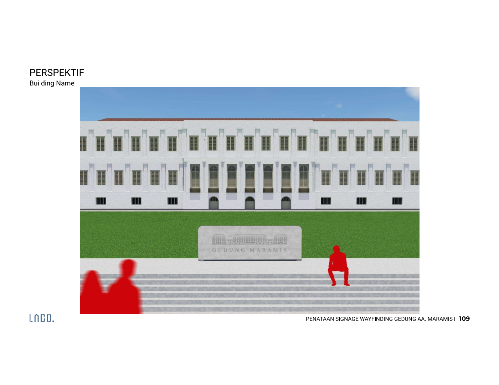
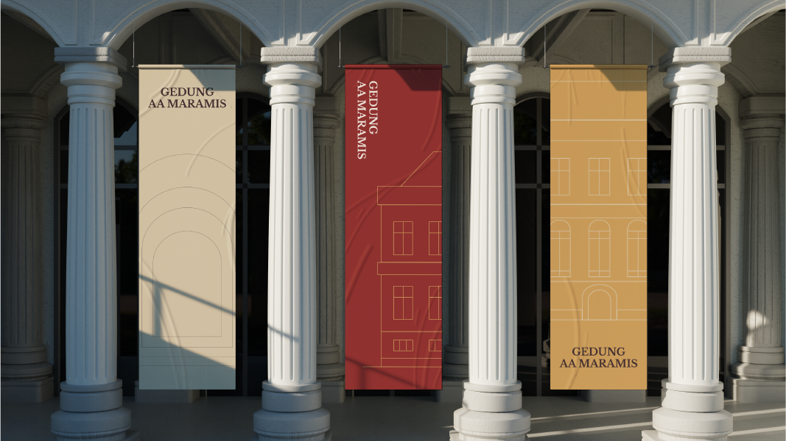
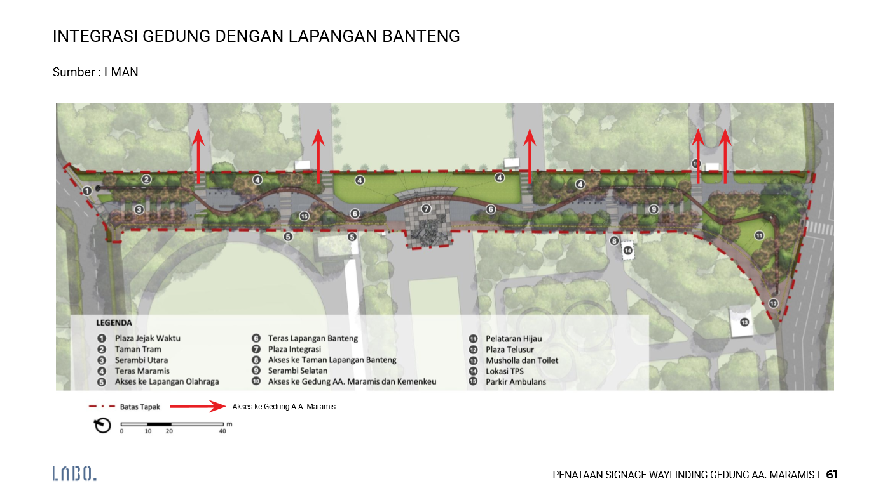
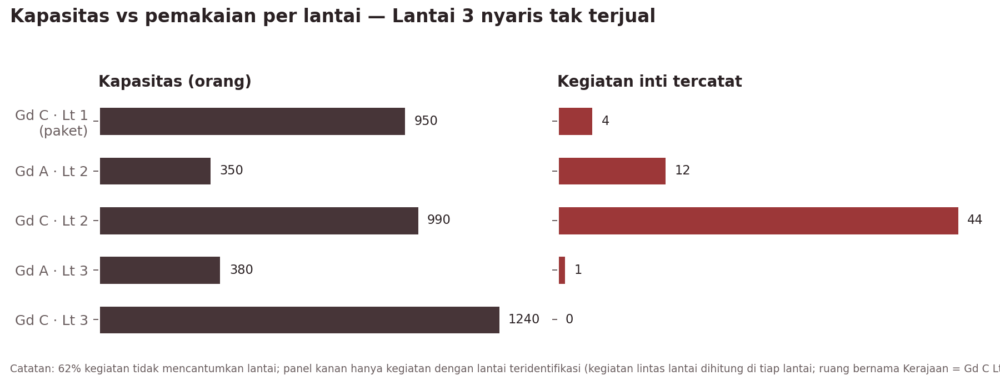

# KAJIAN STRATEGI KOMUNIKASI & BRANDING TERINTEGRASI
## GEDUNG A.A. MARAMIS
**Sub-judul: Dari "Gedung yang Tenggelam" menjadi Warisan yang Bekerja: Re-positioning Aset Cagar Budaya Nasional sebagai Ruang Negara, Ruang Karya, dan Ruang Publik yang Berkelanjutan**

---

### INFORMASI DOKUMEN
* **Penyusun:** Senior Analyst, Lembaga Manajemen Aset Negara (LMAN)
* **Unit/Departemen:** LMAN – Pengelola Gedung A.A. Maramis (BLU di bawah Kementerian Keuangan RI)
* **Tanggal Penyusunan:** 26 September 2026 (pembaruan 29 September 2026)
* **Versi Dokumen:** 2.2
* **Status Dokumen:** Draf untuk Review Pimpinan

**Perubahan dari versi 1.0 (v2.0)**
1. Mengintegrasikan **Laporan Final Kajian *Highest and Best Use* (HBU)** Gedung A.A. Maramis (Colliers International Indonesia untuk LMAN, 15 Desember 2023) ke dalam profil objek, konsep pemanfaatan, SWOT, kompetitor, risiko, dan lini masa.
2. Mengoreksi temuan "tidak ada kanal merek sendiri": akun Instagram resmi **@gedung_maramis** ("Gedung A.A Maramis") sudah ada. Strategi kanal diubah dari *membangun* menjadi *menata dan memperkuat* akun tersebut.
3. **Arsitektur merek disederhanakan menjadi dua lini: *Maramis Ruang* dan *Maramis Jelajah*.** Lini *Maramis Agenda* dihapus dan fungsinya dibagi ke kedua lini.

**Perubahan v2.1 (tindak lanjut Daftar Verifikasi)**
1. **Kepmendikbud No. 210/M/2015** ditetapkan sebagai satu-satunya rujukan status cagar budaya.
2. Klaim "bangunan tertua kedua setelah Istana Negara" dinyatakan valid.
3. **Rekomendasi HBU belum dijalankan.** Seluruh rujukan ke tenant, operator, dan seleksi mitra diperlakukan sebagai rencana masa depan.
4. Baseline Instagram: **@gedung_maramis memiliki ±150 pengikut.**
5. **Media sosial resmi hanya Instagram dan TikTok.** YouTube, LinkedIn, dan platform lain dihapus dari rencana kanal.
6. **Akses publik bersifat terbatas.** Gedung berada di kompleks perkantoran terpadu Kemenkeu, Kemenko Perekonomian, dan OJK; masuk hanya bagi pihak yang memiliki izin sah (peserta acara, survei calon klien, kontraktor). Produk *Maramis Jelajah* dan pesan akses dirancang ulang sebagai **kunjungan berizin melalui pendaftaran**.
7. **Reklame tidak diizinkan** di gedung; segmen pernikahan dijajaki sebagai opsi dengan catatan kendala parkir dan kompleks perkantoran.

**Perubahan v2.2 (sumber baru: rancangan *signage* & *wayfinding*)**
1. Mengintegrasikan dua paparan **Penataan *Signage*, *Wayfinding*, dan *Environmental Design* Gedung AA. Maramis** (konsultan LABO., 2026): Paparan 02 (analisis pendahuluan dan konsep skematik) dan Paparan 03 (pengembangan dan gambar teknis, 10 Juni 2026).
2. **Keputusan logotype menjadi mendesak.** Rancangan *signage* memakai "GEDUNG MARAMIS" pada monumen nama gedung (baja tahan karat di atas beton) dan seluruh totem. Keputusan nama harus diambil sebelum fabrikasi (6.1A, 8.1, 12.6).
3. Nomenklatur ruang (6.1B) diselaraskan dengan modul identifikasi *signage*, yang saat ini memakai nama generik ("Ruang Serbaguna 01", "Ruang Pamer 01–05").
4. Identitas visual (6.5) dilengkapi sistem *signage*: tipografi Public Sans, zona warna per lantai, bentuk lengkung, sistem modular, dan hierarki informasi. Kekosongan KV diperbarui.
5. Temuan kondisi eksisting (penanda *drop-off*, parkir, dan akses dari Lapangan Banteng belum ada) masuk ke SWOT (3.1.2), *issue register* (8.1), rencana aksi (9), dan daftar verifikasi (12.6).

**Basis bukti.** Kajian ini disusun dari enam kelompok sumber:
1. **Dokumen internal:** Booklet Gedung A.A. Maramis (Sept 2026), daftar ruang & tarif, buku *Gedung A.A. Maramis: Istana Putih di Weltevreden* (Kemenkeu, 2022), dan *Panduan Grafis Kunci* (KV) Gedung AA Maramis.
2. **Kajian HBU (Colliers, Des 2023):** analisis regulasi, signifikansi, lokasi, pasar properti, kompetitor (MICE, *fine dining*, ritel tematik, *co-working*, museum), konsep pengembangan, skema kerja sama, kelayakan finansial, dan risiko (lihat [laporan_hbu.md](<../1 - ingested/laporan_hbu.md>)).
3. **Data operasional:** 172 entri kalender Teamup, Sep 2025 – Des 2026 (lihat [data_analysis.md](<../1 - ingested/data_analysis.md>)).
4. **Riset daring:** pemantauan media, akun Instagram @gedung_maramis, regulasi, dan konteks pasar.
5. **Benchmarking:** tujuh kasus *adaptive reuse* ditambah dua kasus dari kajian HBU (Tai Kwun, National Gallery Singapore).
6. **Rancangan *signage* & *wayfinding* (LABO., Mei–Jun 2026):** analisis kondisi eksisting, zonasi ruang per lantai, sistem modular, tipografi, zona warna, dan gambar teknis (lihat 6.5 dan 12.3).

Seluruh angka pada dokumen ini dapat ditelusuri ke sumbernya. **Asumsi** ditandai secara eksplisit.

---

## DAFTAR ISI
1. [Ringkasan Eksekutif](#1-ringkasan-eksekutif)
2. [Latar Belakang & Konteks Objek](#2-latar-belakang--konteks-objek)
3. [Analisis Situasi & Lingkungan Strategis](#3-analisis-situasi--lingkungan-strategis)
4. [Tujuan Komunikasi](#4-tujuan-komunikasi-communication-objectives)
5. [Identifikasi & Pemetaan Pemangku Kepentingan](#5-identifikasi--pemetaan-pemangku-kepentingan-stakeholders)
6. [Positioning, Arsitektur Merek, Narasi Utama, dan Pesan Kunci](#6-positioning-arsitektur-merek-narasi-utama-dan-pesan-kunci)
7. [Strategi dan Taktik Saluran Komunikasi](#7-strategi-dan-taktik-saluran-komunikasi)
8. [Manajemen Isu dan Mitigasi Risiko Reputasi](#8-manajemen-isu-dan-mitigasi-risiko-reputasi)
9. [Rencana Aksi dan Lini Masa](#9-rencana-aksi-dan-lini-masa-implementation-timeline)
10. [Alokasi Anggaran dan Sumber Daya](#10-alokasi-anggaran-dan-sumber-daya)
11. [Matriks Pengukuran dan Evaluasi](#11-matriks-pengukuran-dan-evaluasi-kpis--metrics)
12. [Lampiran](#12-lampiran)

> **Catatan adaptasi kerangka.** Kerangka acuan (*skeleton*) mengasumsikan proyek yang akan diluncurkan. Gedung A.A. Maramis sudah beroperasi: pemugaran selesai Desember 2022, pengelolaan diserahkan kepada LMAN pada 31 Juli 2023, kajian HBU selesai Desember 2023, dan pada 12 bulan terakhir gedung terisi 41,8% hari. Karena itu:
> - Bab 9 dirumuskan sebagai **peluncuran ulang merek (*brand relaunch*)**, bukan *grand opening*. Peluncuran ulang ini sekaligus menjalankan butir "Pengembangan *Branding* Gedung" pada Rencana Aksi kajian HBU. Rekomendasi HBU lainnya (perizinan fungsi baru, seleksi mitra, tenant) **belum berjalan** per September 2026.
> - Bab 6 diperluas dengan **arsitektur merek, nomenklatur ruang, dan identitas visual**, karena permintaan kajian mencakup *branding*.

---

## 1. RINGKASAN EKSEKUTIF

### 1.1. Ikhtisar Singkat & Urgensi Komunikasi
Gedung A.A. Maramis (Istana Daendels / *Het Witte Huis*, 1809–1828) adalah Bangunan Cagar Budaya Peringkat Nasional. Gedung ini merupakan kantor pertama Kementerian Keuangan Republik Indonesia, dan menurut buku sejarah Kemenkeu (2022) adalah gedung kantor berlanggam imperial pengaruh Prancis terbesar abad ke-19 di Indonesia. Setelah pemugaran 2019–2022, gedung ini dikelola LMAN dengan mandat *Highest and Best Use*. Kajian HBU (Colliers, 2023) menyimpulkan pemanfaatan adaptif **layak secara finansial** (IRR 14,24%, NPV Rp47,49 miliar) dengan satu syarat utama: **prioritas fungsi kenegaraan, edukasi, dan kultural**. Rekomendasi tersebut belum dijalankan; pemanfaatan saat ini masih berupa sewa ruang harian.

Gedung ini berada di dalam **kompleks perkantoran terpadu Kemenkeu, Kemenko Perekonomian, dan OJK**. Karena itu lingkungannya bersifat terbatas bagi publik: yang dapat masuk hanyalah pihak dengan izin sah, seperti peserta acara, calon klien yang melakukan survei lokasi, dan kontraktor.

Gedung ini sudah memiliki momentum yang jarang dimiliki aset heritage:
- **Penghargaan internasional:** FIABCI World Prix d'Excellence 2025, Silver, kategori Heritage.
- **Integrasi fisik** dengan Taman Lapangan Banteng, selesai April 2026. Integrasi ini sudah diusulkan Menkeu sejak 2020 (Surat S-83/MK.1/2020) dan direkomendasikan kajian HBU.
- **Tamu kenegaraan:** kunjungan HM Queen Máxima dari Belanda (Nov 2025).
- **Produksi film:** *Rose Pandanwangi*, film ko-produksi empat negara.
- **Festival publik:** Jakarta International Coffee Conference dan Pesta Kreasi Kota.
- **Seremoni kenegaraan:** Hari Oeang dan Upacara HUT RI 2026.

**Namun momentum ini belum terakumulasi menjadi merek.** Tiga bukti utama:
1. **Kanal resmi ada, tetapi masih kecil dan belum menjadi sumber kebenaran.** Akun Instagram **@gedung_maramis** baru memiliki **±150 pengikut**, jauh di bawah jangkauan liputan media dan kreator tentang gedung ini. Belum ada akun TikTok, situs, sistem pemesanan daring, atau listing Google yang dikelola. Komunikasi masih tersebar di @blu.lman, @kemenkeuri, DJKN, penyelenggara acara, dan pemandu tur. Liputan media jarang menautkan akun resmi.
2. **Identitas belum konsisten.** Di materi resmi terdapat enam varian nama: "Gedung A.A. Maramis" (Booklet), "Gedung A.A Maramis" (nama tampilan Instagram), "A.A Maramis Heritage" (Booklet), "GEDUNG AA MARAMIS" (sampul KV), "GEDUNG MARAMIS" (logotype KV), dan "Istana Daendels" (media dan komunitas). Ruang juga disebut tanpa standar: "Gedung Utama (Historical Halls)", "R. Majapahit", "C.2.12", "Ruang VIP". Rancangan *signage* (Jun 2026) memakai "GEDUNG MARAMIS" dan nama ruang generik ("Ruang Serbaguna 01"). Setelah difabrikasi, varian ini menjadi permanen di lokasi, sehingga keputusan nama harus diambil lebih dulu.
3. **Informasi akses bertentangan dan tidak lengkap.** Media dan kreator menulis gedung ini "tidak dibuka untuk umum", sementara portal lain menulis "gratis, Senin–Jumat 09.00–15.00". Yang kedua keliru: gedung tidak menerima kunjungan bebas karena berada di kompleks perkantoran terbatas. Yang pertama benar, tetapi tidak lengkap, karena tidak menjelaskan cara masuk yang sah (acara, survei lokasi, atau program kunjungan berizin). Tidak ada sumber resmi yang meluruskannya.

### 1.2. Tantangan Kunci: Konservasi vs. Komersialisasi (dan Negara vs. Publik)
Gedung ini memikul tiga peran yang bisa saling bertabrakan:
- **Ruang negara:** 57% kegiatan inti berasal dari Kemenkeu serta K/L, BUMN, dan lembaga.
- **Ruang komersial-kreatif:** 15% kegiatan, tetapi durasinya panjang (51 hari).
- **Ruang publik-edukatif:** 25 walking tour, 40% di antaranya dari satu operator.

Kerangka hukum mendukung ketiganya:
- UU 11/2010 Pasal 85 dan PP 1/2022 mengizinkan pemanfaatan untuk agama, sosial, pendidikan, ilmu pengetahuan, kebudayaan, dan pariwisata.
- Permen PUPR 19/2021 menegaskan bahwa pemanfaatan bangunan gedung cagar budaya boleh "menggali potensi perolehan penghasilan untuk memenuhi kebutuhan operasional dan pemeliharaan".
- PMK 144/2020 mengatur sewa guna dan Kerja Sama Manajemen (KSM) aset kelolaan LMAN.
- UU 11/2010 Pasal 79 ayat (5) mewajibkan hasil penelitian dipublikasikan kepada masyarakat.

Tantangannya adalah **tata kelola persepsi**: memastikan publik melihat pendapatan sewa sebagai *pembiaya pelestarian*, bukan sebagai komersialisasi warisan bangsa. Tantangan ini makin nyata karena kajian HBU mengusulkan visi ***"The Luxury Heritage"*** dan membuka jalan bagi *fine dining*, ritel tematik, dan kafe. Bahasa "luxury" berguna untuk penjualan B2B, tetapi berisiko bila dipakai di ruang publik (lihat 6.1).

Tantangan kedua adalah **akses**. Kewajiban publikasi (Pasal 79) dan harapan publik terhadap warisan nasional harus dipenuhi di dalam lingkungan perkantoran yang terbatas. Jawabannya bukan membuka gedung secara bebas, melainkan **program kunjungan berizin yang jelas, terjadwal, dan mudah didaftari**, ditambah kehadiran digital yang membawa gedung kepada publik yang tidak bisa datang.

Dari sisi utilisasi, tantangan terbesar justru bersifat *produk-komunikasi*:
- **Lantai 3** (17 unit, kapasitas 1.620 orang, termasuk aula terbesar C3.8 berkapasitas 340 orang) praktis tidak pernah tercatat terjual, padahal kajian HBU memproyeksikan Grand Ballroom Lt 3 terisi satu acara per bulan.
- **Maret 2026** hampir kosong (1 kegiatan).
- **Ketergantungan pada anggaran K/L** berisiko saat terjadi efisiensi belanja seperti Inpres 1/2025, dan pemindahan ibu kota ke IKN dapat mengurangi permintaan dari instansi pusat.

### 1.3. Arah Strategis & Output yang Diharapkan
**Positioning yang diusulkan:**
> *Gedung A.A. Maramis adalah rumah pertama keuangan negara di jantung Weltevreden: warisan nasional yang dirawat dengan bekerja, tempat negara, kreativitas, dan publik bertemu.*
>
> **Tagline kerja:** *"Warisan yang Bekerja"*, dengan varian kampanye *"Rumah Pertama Keuangan Negara"*.

**Lima langkah strategis:**
1. **Satu merek, satu nama, satu pintu.** Tetapkan "Gedung A.A. Maramis" sebagai *masterbrand* dengan *endorsement* "Dikelola oleh LMAN – Kementerian Keuangan". Media sosial resmi hanya **Instagram dan TikTok**, keduanya dengan *handle* **@gedung_maramis**, didukung situs, WhatsApp Business, listing Google, dan satu pintu pemesanan dan pendaftaran kunjungan.
2. **Dua lini produk:** ***Maramis Ruang*** (menggunakan ruang: venue, MICE, acara mitra, izin foto/film, dan ke depan tenant bila rekomendasi HBU dijalankan) dan ***Maramis Jelajah*** (mengalami warisan: tur berizin, edukasi, Hari Terbuka, dan pameran).
3. **Akses berizin yang terjadwal dan dipublikasikan.** Karena gedung berada di kompleks perkantoran terbatas, kunjungan publik dikemas sebagai **acara terdaftar**: tur akhir pekan dengan kuota dan pendaftaran identitas, serta Hari Terbuka berkala yang dikoordinasikan dengan pengamanan kompleks. Setiap peserta terdaftar menjadi pengunjung berizin, sama seperti peserta acara.
4. **Nomenklatur ruang berbasis sejarah.** Beri nama pada Lantai 3 dan ruang tanpa nama, lalu kemas ruang tersebut sebagai paket untuk menghidupkan inventaris yang tidur.
5. **Kalender momen 2027.** Manfaatkan Jakarta 500 tahun (22 Juni 2027), MRT Fase 2A Bundaran HI–Monas (akhir 2027), Hari Oeang ke-81 (30 Okt 2027), dan HUT RI.

**Output yang diharapkan hingga akhir 2027** (target rinci di Bab 11):

| Indikator | Kondisi awal | Target akhir 2027 |
| :--- | ---: | ---: |
| Hari terisi | 41,8% | ≥55% |
| Porsi kegiatan komersial & kreatif | 15% | ≥25% |
| Lantai 3 | 0 kegiatan tercatat | ≥24 kegiatan/tahun |
| Kunjungan berizin terjadwal | tidak ada | ≥48 sesi tur milik pengelola per tahun |
| Pengikut media sosial resmi | Instagram ±150; TikTok belum ada | Instagram ≥5.000; TikTok ≥3.000 |

---

## 2. LATAR BELAKANG & KONTEKS OBJEK

### 2.1. Profil Objek Heritage


*Sumber: Panduan Grafis Kunci Gedung AA Maramis (LAMP 1).*

| Atribut | Keterangan |
| :--- | :--- |
| Nama resmi | Gedung A.A. Maramis |
| Nama historis | Istana Daendels, *Paleis Weltevreden*, *Het Groote Huis* (Rumah Besar), *Het Witte Huis* (Gedung Putih) |
| Alamat | Jl. Lapangan Banteng Timur No. 2–4, Pasar Baru, Sawah Besar, Jakarta Pusat 10710 |
| Luas kawasan | ±12.000 m² (Kompas, 2023) |
| Luas area yang dapat dimanfaatkan | 8.328 m² *saleable area*; 7.442,6 m² NLA efektif tahap awal (HBU, 2023) |
| Blok | Gedung A (fasad utama), B (sayap barat), C (blok utama dalam), D (sayap timur), E (pendukung) |
| Inventaris sewa | 49 unit: 15 ruang Lantai 1 Gedung C (paket Rp125 juta/hari) dan 34 ruang satuan (Rp3,44–30,30 juta/hari) |
| Zonasi | RDTR DKI 2022: Sub-Zona Perkantoran (KT), KDB 60%, KLB 6,00. Gedung serbaguna, restoran, museum, dan ruang pamer "diizinkan"; usaha informal F&B "terbatas" |
| Status cagar budaya | Bangunan Cagar Budaya Peringkat Nasional, **Kepmendikbud No. 210/M/2015** |
| Lingkungan | Di dalam kompleks perkantoran terpadu Kemenkeu, Kemenko Perekonomian, dan OJK; akses terbatas bagi pihak berizin |
| Pemilik / pengelola | BMN Kementerian Keuangan; dikelola LMAN (BLU) sejak 31 Juli 2023 |
| Penghargaan | FIABCI World Prix d'Excellence 2025, Silver (Heritage) |
| Kanal digital resmi | Instagram @gedung_maramis ("Gedung A.A Maramis", ±150 pengikut) |

#### 2.1.1. Status Cagar Budaya & Landasan Regulasi

**Penetapan.** Gedung A.A. Maramis ditetapkan sebagai Bangunan Cagar Budaya Peringkat Nasional berdasarkan **Keputusan Mendikbud No. 210/M/2015**. Keputusan ini adalah penetapan terbaru dan menjadi satu-satunya rujukan status di *fact sheet* dan seluruh materi resmi.

**Signifikansi fisik** (Pusat Dokumentasi Arsitektur, 2020; PT Jakarta Konsultindo, 2020)
- Nilai "istimewa" (*exceptional*) mendominasi gedung karena keaslian dan keutuhannya sejak awal abad ke-19.
- **Seluruh selubung bangunan berstatus "kritikal"**, yaitu wajib dipertahankan atau dikembalikan seperti semula.
- **Penggunaan ruang dalam berstatus "penting"**, yaitu boleh dimodifikasi dengan memperhatikan kualitas kunci.
- Jembatan dan bangunan tambahan dapat dimodifikasi sesuai kebutuhan.
- Karena umur struktur, **beberapa ruang direkomendasikan dibatasi hingga 70% kapasitas maksimum**.

*Implikasi komunikasi:* klaim kapasitas di katalog harus memakai angka aman (70%), dan batasan desain dekorasi acara perlu dikemas sebagai "standar prestise" (lihat 5.2.3).

**UU 11/2010 tentang Cagar Budaya**

| Pasal | Ketentuan | Implikasi bagi komunikasi |
| :--- | :--- | :--- |
| 75 | Kewajiban memelihara | Pesan "sewa untuk merawat" |
| 79 ayat (5) | Kewajiban mempublikasikan hasil penelitian | Dasar hukum pilar konten edukasi |
| 83 | Adaptasi dengan mempertahankan ciri asli dan fasad | Batas desain *signage* dan dekorasi acara |
| 85 | Pemanfaatan untuk agama, sosial, pendidikan, ilmu pengetahuan, teknologi, kebudayaan, dan pariwisata | Legitimasi kedua lini produk |
| 86 & 88 | Kajian sebelum pemanfaatan berisiko; pengembalian keadaan atas biaya pemanfaat | Klausul kontrak mitra dan "Piagam Etiket Acara" |
| 92 | Dokumentasi komersial wajib seizin pemilik/pengelola | Dasar **izin foto/film berbayar** sebagai lini pendapatan sekaligus alat kontrol merek |
| 93 | Penggandaan cagar budaya peringkat nasional perlu izin | Merchandise berbasis motif, bukan replika |

**PP 1/2022** (Register Nasional & Pelestarian Cagar Budaya)
- Adaptasi boleh menambah fasilitas dan mengubah susunan ruang secara terbatas, dengan mempertahankan gaya arsitektur, konstruksi asli, dan keharmonisan lingkungan.
- Mengatur izin adaptasi dan izin pemanfaatan dari Menteri (kini Menteri Kebudayaan) untuk peringkat nasional, serta fasilitasi "pemanfaatan dan promosi".

**Permen PUPR 19/2021** (Pedoman Teknis Bangunan Gedung Cagar Budaya yang Dilestarikan)
- Pemanfaatan harus selaras dengan pelestarian, menjaga karakter dan "kelayakan pandang tampak" bangunan, serta menjamin pemeliharaan.
- Pemanfaatan dimaksudkan untuk menampung kegiatan masyarakat **dan menggali penghasilan untuk operasional dan pemeliharaan**. Ketentuan ini adalah dasar regulasi terkuat bagi pesan "Dirawat dengan Bekerja".

**Reklame**
- **Reklame tidak diizinkan** pada Gedung A.A. Maramis.
- Implikasi: tidak ada papan iklan, *billboard*, atau materi promosi komersial permanen di gedung dan halamannya. Identitas sponsor dan *branding* mitra acara hanya boleh tampil secara terbatas, sementara, dan di dalam area acara, sesuai Piagam Etiket Acara. Penanda yang diizinkan adalah penunjuk arah (*wayfinding*), papan interpretasi, dan identitas gedung.
- Catatan: kajian *signage* (LABO., 2026) mencatat belum adanya *signage* temporer promosi untuk fasad depan yang menghadap Lapangan Banteng. Materi tersebut harus dibatasi pada identitas gedung dan informasi publik nonkomersial (misalnya jadwal Hari Terbuka dan cara mendaftar), tanpa logo sponsor, sampai ada kepastian tafsir larangan reklame (lihat 12.6).

**Rezim BMN dan LMAN**
- PP 27/2014 jo. PP 28/2020 dan PMK 115/2020 mengatur pemanfaatan BMN.
- **PMK 144/PMK.06/2020** mengatur aset kelolaan BLU LMAN:
  - **Sewa guna:** paling lama 5 tahun dan dapat diperpanjang, hingga 50 tahun untuk mitra yang nilai keekonomiannya memerlukan waktu lebih lama; tarif berbasis nilai wajar oleh Penilai.
  - **Kerja Sama Manajemen (KSM):** paling lama 30 tahun; mitra dapat berupa BUMN/D, BLU/BLUD, atau badan usaha; simulasi HBU memakai bagi hasil 90% LMAN : 10% mitra.
- Organisasi LMAN diatur dalam **PMK 35/2024**.

**Arahan pimpinan** (dikutip kajian HBU)
- **Presiden RI (2022):** setelah dipugar, gedung menjadi sarana museum, Perpustakaan Keuangan Negara, jamuan kenegaraan, ruang pertemuan, dan sarana edukasi, serta diintegrasikan dengan Masjid Istiqlal, Gereja Katedral, GKJ, dan Pasar Baru.
- **Menteri Keuangan:** dapat dikelola BLU dan dipergunakan sebagai museum, diintegrasikan dengan Taman Lapangan Banteng sebagai kesatuan wisata heritage (Surat S-83/MK.1/2020, 26 Juni 2020).

**Komunikasi publik pemerintah**
- **Inpres 9/2015** tentang narasi tunggal.
- **Perpres 96/2025** tentang Badan Komunikasi Pemerintah.
- Program **Employee Advocacy** Kemenkeu, dikoordinasikan Biro KLI.

#### 2.1.2. Nilai Historis, Arsitektural, dan Signifikansi Budaya
Nilai penting gedung ini dapat diringkas dalam empat lapis makna:

1. **Lapis kota.** Gedung dan Lapangan Banteng (dahulu *Paradeplaats*/*Waterlooplein*) adalah satu kesatuan ruang dan waktu. Keduanya menandai perpindahan pusat Batavia dari muara Ciliwung ke Weltevreden pada awal abad ke-19. Gedung ini juga berada di ujung **aksis monumental Monas – Lapangan Banteng – Gedung A.A. Maramis**, dan di simpul **aksis ekonomi** menuju Pasar Baru dan Pasar Senen.
2. **Lapis arsitektur.** Pembangunan dimulai 7 Maret 1809 atas prakarsa Daendels. Gedung dirancang Lt. Kol. J.C. Schultze dengan bantuan J. Jongkind, terhenti pada 1811, lalu diselesaikan era Du Bus de Gisignies. Pada 25 Januari 1828 gedung diresmikan sebagai kantor besar urusan keuangan. Langgam *Indisch Empire*/imperial Prancis ini menjadi yang terbesar dan paling monumental di Indonesia. Gedung ini juga merupakan **bangunan tertua kedua di kawasan pusat pemerintahan setelah Istana Negara** (kajian HBU), fakta yang dapat dipakai di materi publik.
3. **Lapis kelembagaan.** Sejak awal gedung ini adalah pusat administrasi keuangan: *Generale Directie van Financiën*, *Algemeene Rekenkamer* (cikal bakal badan pengawas keuangan), dan *'s Lands Drukkerij* (percetakan negara). Pada 1950 gedung diserahkan kepada Republik sebagai kantor Kementerian Keuangan RI. Namanya menghormati Mr. Alexander Andries Maramis, Menteri Keuangan era revolusi.
4. **Lapis kebangsaan.** Lapangan di mukanya dinamai "Banteng" oleh Sukarno dan menjadi lokasi Monumen Pembebasan Irian Barat (1963). Kawasan sekitarnya diperkaya bangunan era *Nation Building* (Masjid Istiqlal, Hotel Borobudur). **Bangunan kolonial telah "diindonesiakan"** menjadi rumah keuangan republik.


*Sumber: Kajian HBU (Colliers, 2023), slide 9.*

> **Kutipan kunci (Menkeu Sri Mulyani, 2017; dikutip dalam buku Kemenkeu 2022):** *"…jika dilestarikan gedung-gedung tersebut justru akan membentuk citra yang baik, bukan hanya bagi Jakarta, melainkan juga Indonesia. Indonesia harus mempresentasikan kota-kota dengan sejarahnya masa lalu yang bisa dipakai untuk belajar…"*

### 2.2. Konsep Pemanfaatan Komersial (Adaptive Reuse)

#### 2.2.1. Kondisi berjalan (per Sep 2026)
Model yang berjalan saat ini adalah **penyewaan ruang harian**, dengan tarif berbasis nilai wajar sesuai PMK 144/2020.

| Segmen penggunaan | Kegiatan inti | Porsi |
| :--- | ---: | ---: |
| Kemenkeu (internal) | 45 | 34% |
| K/L, BUMN & lembaga | 30 | 23% |
| Komunitas, pendidikan & seni | 29 | 22% |
| Komersial & kreatif | 20 | 15% |
| Lainnya | 9 | 7% |

#### 2.2.2. Arah pengembangan menurut kajian HBU (Colliers, 2023)
Kajian HBU menilai 11 komponen properti terhadap kondisi fisik, lokasi, dan pasar:

| Kuadran | Komponen | Status |
| :--- | :--- | :--- |
| I – fisik/lokasi tinggi, pasar tinggi | Gedung serbaguna/MICE (skor fisik 4,4), *fine dining* (4,4), ritel tematik heritage (4,2) | **Program utama komersial** |
| II – fisik/lokasi tinggi, pasar terbatas | *Co-working space* (4,8), museum/galeri (4,3) | **Program pendukung & edukasi budaya** |
| III & IV | Hotel, apartemen, mal, perkantoran konvensional, rumah sakit, universitas | Tidak direkomendasikan |

Pengembangan dirancang bertahap:

| Tahap | Konsep | Program ruang utama |
| :--- | :--- | :--- |
| **Jangka pendek (2024–2027)** | ***Heritage Evolved***: seni dan budaya sebagai karakter; fungsi MICE dan *work* | Grand Ballroom C Lt 2 (591,5 m²) dan C Lt 3 (593,9 m²); ballroom & ruang pertemuan; *Experimental Café* (A Lt 1, bekas istal kuda); Galeri/Museum & Toko Suvenir (C Lt 1, 1.280,9 m²); empat Area Event Temporer; *Media Center*; perpustakaan dan *co-working* (A Lt 3); *Balcony Café* di jembatan B & D Lt 3 dengan pandangan ke Monas dan Istiqlal; *Executive Lounge* (E Lt 3) |
| **Jangka menengah (2028–2053)** | ***Heritage Evolved, Even Further***: pengayaan kegiatan *mixed use* | Ditambah Restoran *Fine Dining* (C Lt 1, 526,1 m²) dan Ritel Tematik (E Lt 2, 535,9 m²; E Lt 3) |
| **Jangka panjang (pasca-IKN)** | Pusat edukasi dan diplomasi keuangan | Kompleks pendidikan, dari pelatihan pegawai hingga mitra universitas |

**Kelayakan finansial HBU:** *capex fit-out* Rp92,6 miliar; proyeksi pendapatan 2024–2053 Rp955,7 miliar; GOP 52,3%; NPV Rp47,5 miliar; IRR 14,24% (WACC 9,85%); *payback* 9 tahun. Biaya pengelolaan lingkungan (IPL) area publik diperkirakan Rp10,87 miliar per tahun.

**Status: rekomendasi HBU belum dijalankan.** Rencana Aksi HBU menjadwalkan perizinan, pemilihan mitra, **pengembangan *branding***, dan **peluncuran resmi** pada 2024–2026. Per September 2026, belum ada tahap yang berjalan: pemanfaatan masih berupa sewa ruang harian, tanpa kafe, galeri, atau tenant tetap. Implikasinya bagi komunikasi:
- Kajian ini mengisi butir *branding*, yang dapat berjalan tanpa menunggu keputusan HBU lainnya.
- **Jangan menjanjikan fungsi HBU di ruang publik** (kafe, museum, restoran) sebelum ada keputusan dan izin.
- Merek harus **cukup lentur** untuk menampung tenant bila kelak dijalankan (kafe, galeri, *fine dining*, ritel) tanpa kehilangan kendali. Pelajaran Tai Kwun dan National Gallery Singapore: **pemilik harus memegang kendali gedung dan merek**, dan tenant harus dikurasi agar selaras dengan konsep.
- Rekomendasi HBU yang mengandaikan kunjungan publik bebas (misalnya museum dibuka umum di akhir pekan) perlu disesuaikan dengan sifat kompleks perkantoran yang terbatas.

#### 2.2.3. Tiga lantai fungsi
Sejak serah kelola, rencana resmi menyebut Museum dan Perpustakaan Keuangan Negara, jamuan kenegaraan, edukasi generasi muda, dan zona wisata heritage yang menghubungkan Lapangan Banteng, Istiqlal, Katedral, GKJ, dan Pasar Baru (Setkab, 2022; DJKN, 2023). Kajian HBU menegaskan: *"restorasi dan pemanfaatan dilakukan dengan prioritas fungsi kenegaraan, edukasi, dan kultural"*.

Kajian ini merumuskan konsep pemanfaatan sebagai **"tiga lantai fungsi"**, yang dilayani oleh dua lini merek (6.1A):

| Fungsi | Prioritas | Bentuk | Lini merek | Peran komunikasi |
| :--- | :--- | :--- | :--- | :--- |
| **Ruang Negara** | 1 (hak prioritas protokol) | Seremoni, jamuan kenegaraan, rapat pimpinan, tamu negara | *Maramis Ruang* (pemakaian internal/negara) | Sumber prestise dan *earned media* tingkat nasional/internasional |
| **Ruang Karya** | 2 (pendapatan) | MICE, gala korporat, peluncuran produk, fashion show, film, pameran dan festival mitra; bila HBU dijalankan, kafe, *fine dining*, ritel tematik | *Maramis Ruang* | Sumber pendapatan untuk membiayai pelestarian; memperluas jangkauan ke segmen gaya hidup |
| **Ruang Publik** | 3 (legitimasi, terjadwal dan berizin) | Tur terdaftar, Hari Terbuka, pameran, edukasi sekolah/kampus, program komunitas, serta kehadiran digital | *Maramis Jelajah* | Menjawab kewajiban publikasi (Pasal 79) dan mencegah kritik eksklusivitas, di dalam batas kompleks perkantoran |

### 2.3. Alasan Perlunya Intervensi Strategi Komunikasi
1. **Aset "tenggelam".** Buku Kemenkeu (Bab V) mencatat bahwa sejak kemerdekaan gedung ini "seolah-olah tenggelam", karena fungsinya sebagai kantor tidak banyak diakses publik. Kondisi ini berlanjut: gedung berada di kompleks perkantoran terpadu Kemenkeu, Kemenko Perekonomian, dan OJK, dan hanya pihak berizin yang dapat masuk. Publik lebih mengenal Lapangan Banteng daripada gedungnya. Karena kunjungan fisik terbatas, **kanal digital menjadi pintu utama publik mengenal gedung ini**.
2. **Merek terfragmentasi.** Enam varian nama, kanal resmi dengan ±150 pengikut yang belum menjadi rujukan, dan ruang tanpa nomenklatur baku (lihat 1.1).
3. **Inventaris tidur.** Lantai 3 memiliki kapasitas 1.620 orang tetapi hampir 0 pemakaian tercatat. Ruang yang bernama (Lantai 2 Gedung C, tema Kerajaan Nusantara) justru paling laku.
4. **Kontradiksi informasi akses** yang menimbulkan kekecewaan pengunjung.
5. **Risiko konsentrasi permintaan** pada anggaran pemerintah (57%). Inpres 1/2025 menurunkan pemesanan MICE pemerintah; hotel Jakarta melaporkan penurunan pendapatan 20–40% (PHRI, awal 2025). Kajian HBU menambahkan risiko pemindahan ibu kota ke IKN.
6. **Mandat *branding* HBU yang belum dijalankan** (lihat 2.2.2). Bila rekomendasi HBU kelak dijalankan, calon mitra/operator memerlukan merek yang sudah jelas sebelum berinvestasi.
7. **Jendela momentum 2027:** Jakarta 500 tahun, MRT Fase 2A, dan pembentukan citra Jakarta sebagai "Kota Global" (UU 2/2024) pasca-pemindahan ibu kota. Kajian HBU secara eksplisit memosisikan gedung ini sebagai pendukung Jakarta Kota Global.

---

## 3. ANALISIS SITUASI & LINGKUNGAN STRATEGIS

### 3.1. Analisis SWOT

#### 3.1.1. Kekuatan (Strengths)
- **Keunikan tak tergantikan:** gedung imperial terbesar abad ke-19 di Indonesia, bangunan tertua kedua di kawasan pusat pemerintahan setelah Istana Negara, kantor pertama Kemenkeu RI, berusia lebih dari 200 tahun, dan kini dalam kondisi fisik sangat baik pasca-pemugaran.
- **Lingkungan aman dan terkendali:** berada di kompleks perkantoran negara dengan pengamanan terpadu, nilai jual bagi acara kenegaraan, VIP, dan korporat yang membutuhkan keamanan.
- **Posisi di aksis monumental** Monas – Lapangan Banteng, dikelilingi bangunan bernilai "istimewa" (Katedral, Istiqlal, GKJ, Gedung Jusuf Anwar) dalam radius jalan kaki 500 m – 1 km.
- **Legitimasi negara dan jejaring institusional.** DJKN, Kemenko Perekonomian, OJK, dan Pimpinan Kemenkeu adalah klien berulang. 19 penyelenggara berulang menyumbang 69,4% kegiatan.
- **Bukti prestise:** FIABCI 2025, kunjungan Queen Máxima, jamuan HUT RI, dan film internasional *Rose Pandanwangi*.
- **Produk ruang bernama yang terbukti laku.** Majapahit, Sriwijaya, Bone, dan Kutai paling sering disebut dalam pemesanan.
- **Aset visual kuat:** fasad putih simetris, lengkungan, koridor, serta karakter khas Lantai 1 (bekas istal kuda: dinding lengkung putih, ubin gelap, balok kayu). Kosakata publik yang terekam: *"megah"*, *"estetik"*, *"instagramable"*, *"expensive vibes"*, *"labirin yang megah"*.
- **Identitas visual (KV) dan akun Instagram resmi sudah tersedia.** Rancangan *signage* dan *wayfinding* lengkap dengan gambar teknis juga sudah ada (LABO., Jun 2026) dan menurunkan KV ke lokasi fisik (palet, lengkung, logomark fasad).
- **Kelayakan finansial terdokumentasi** (HBU: IRR 14,24%), sehingga argumen "pemanfaatan membiayai pelestarian" punya dasar angka.
- **Lokasi dan konektivitas:** terintegrasi dengan Lapangan Banteng (2026), dekat Istiqlal, Katedral, GKJ, dan Pasar Baru, serta akan dilayani MRT Fase 2A (Stasiun Monas, Harmoni, Sawah Besar).

#### 3.1.2. Kelemahan (Weaknesses)
- **Ekosistem kanal belum lengkap dan audiens sangat kecil.** Akun @gedung_maramis baru memiliki ±150 pengikut; belum ada akun TikTok, situs, katalog, sistem pemesanan daring, atau listing Google yang dikelola. Kontak penjualan hanya dua nomor WhatsApp di Booklet dan listing AESIA. Nama tampilan akun ("Gedung A.A Maramis") belum sesuai nama baku.
- **Akses publik terbatas secara struktural.** Gedung berada di kompleks perkantoran terpadu Kemenkeu, Kemenko Perekonomian, dan OJK. Hanya peserta acara, calon klien yang melakukan survei lokasi, kontraktor, dan pihak berizin lain yang dapat masuk. Kunjungan bebas (*walk-in*) tidak dimungkinkan.
- **Nama dan nomenklatur tidak konsisten.** 43 dari 49 unit hanya berkode. Pencatatan kalender tidak baku: 62% kegiatan tanpa keterangan lantai/ruang.
- **Penanda di lokasi belum menjadi satu sistem** (analisis eksisting LABO., 2026):
  - Belum ada penanda area *drop-off*, pintu utama, area servis, arah parkir, dan jalan keluar kawasan.
  - Belum ada informasi dan alur menuju gedung dari pintu akses umum. Integrasi *wayfinding* dengan Lapangan Banteng dan Pemprov DKI belum dibicarakan secara rinci.
  - Penanda lama, baru, dan regulasi (APAR, jalur evakuasi, area servis) berbeda-beda dan belum selaras dengan arsitektur; sebagian tidak terlihat, sebagian terlalu mencolok.
  - Ruang multifungsi belum memiliki nama dan kode yang terbaca pengunjung. Plafon tinggi membuat penanda di atas kurang efektif.
  - Blok gedung bercermin (*mirroring*), sehingga tanpa kode angka/warna pengunjung mudah tertukar antarzona.
- **Batasan fisik cagar budaya:** selubung bangunan kritikal, batas kapasitas 70% di beberapa ruang, tidak boleh memaku/menempel, larangan makanan-minuman tanpa izin, larangan alat berat, tangga curam dan sempit. Akses difabel belum terkomunikasikan.
- **Reklame tidak diizinkan**, sehingga eksposur sponsor bagi mitra acara lebih terbatas dibanding venue komersial.
- **Parkir sangat terbatas.** Kajian HBU menghitung kebutuhan ±519 SRP untuk skenario jangka pendek, sementara kondisi eksisting hanya memungkinkan parkir VIP. Sisanya bergantung pada parkir bersama dan transportasi umum.
- **Overhead teknis:** 45 hari loading (17,7% dari hari-kegiatan), sehingga kapasitas jual efektif berkurang.
- **Akses berizin belum dikelola sebagai produk.** Kunjungan membutuhkan surat izin kelompok tanpa prosedur yang dipublikasikan, dan 40% tur bergantung pada satu operator (Eat Chat Walk).
- **Cakrawala pemesanan pendek dan musiman.** Pipeline Q4-2026 hanya 18 entri dibanding 56 entri pada Q4-2025. Maret 2026 hampir kosong.
- **Tidak ada layanan F&B internal.** Pesaing *boutique hall* menjual paket per pax termasuk katering; Maramis hanya menjual ruang.
- **Data kinerja terbatas.** Kalender tidak mencatat jumlah peserta, nilai transaksi, atau sumber prospek.

#### 3.1.3. Peluang (Opportunities)
- **Jakarta 500 tahun (22 Juni 2027)** dan status **Kota Global** (UU 2/2024, prioritas pemajuan kebudayaan, Pasal 31).
- **MRT Fase 2A.** Segmen Bundaran HI–Monas beroperasi akhir 2027 dan Harmoni–Kota pada 2029. MoU LMAN–MRT Jakarta ditandatangani di gedung ini pada 17 Des 2025 (kalender internal).
- **Tren generasi muda:** kelompok usia 18–24 kini menjadi pengunjung terbesar Museum Nasional, dan kunjungan museum di bawah Indonesian Heritage Agency naik dari 704.506 (2024) menjadi 1.536.375 (2025). Kajian HBU juga menjadikan Gen Z dan Milenial sebagai motor konsep *Heritage Evolved* (seni, budaya, produktivitas).
- **Pasar MICE pulih pada 2026** dengan proyeksi pertumbuhan hingga 15% (Krista Exhibitions). Wisman nasional mencapai 15,39 juta pada 2025 (+10,8%; BPS). Portal Satu Data Jakarta melaporkan kunjungan wisman ke DKI Jakarta **melampaui 2,5 juta** (data sekunder; lihat 12.6).
- **Daya beli pasar sasaran:** 40% rumah tangga Jakarta berpengeluaran >Rp6,5 juta/bulan; restoran heritage pembanding (Tugu Kunstkring Paleis, Plataran Menteng, Bunga Rampai) mencatat tingkat kunjungan 80–100% pada jam sibuk (HBU).
- **Ekonomi kreatif dan diplomasi budaya:** film, fashion (Love Bonito, Stella Lunardy, Klamby), kopi (JICC), seni (AGSI, lelang DJKN), dan musik (Gitanada).
- **Narasi keuangan negara yang belum dimiliki siapa pun:** *fiscal heritage* sebagai pelengkap Museum Bank Indonesia (moneter) dan Museum Mandiri (perbankan). Galeri/Museum Keuangan Negara di C Lt 1 (rekomendasi HBU, belum dijalankan) dapat menjadi etalasenya kelak.
- **Ruang tumbuh digital yang besar:** dengan akses fisik terbatas, Instagram dan TikTok dapat menjangkau publik yang jauh lebih luas daripada kapasitas kunjungan. Titik awal ±150 pengikut berarti pertumbuhan relatif yang cepat bisa dicapai dengan konten yang konsisten.
- **Program *Fiscal Heritage Explorer* Biro KLI (Jul 2026)** dapat dikembangkan menjadi produk edukasi publik.
- **Calon mitra operator** (MICE, F&B, galeri, *co-working*), bila rekomendasi HBU dijalankan melalui skema sewa guna atau KSM, dapat menjadi amplifikator merek.
- **Employee Advocacy Kemenkeu:** puluhan ribu pegawai sebagai amplifikator organik.

#### 3.1.4. Ancaman (Threats)
- **Tuduhan komersialisasi warisan bangsa**, terutama jika acara gaya hidup/mewah tampil lebih dominan daripada akses publik, atau jika bahasa "luxury" dari kajian HBU terbawa ke komunikasi publik. Pos Bloc dikritik karena isu autentisitas; Sarinah dikritik soal "FOMO".
- **Kerusakan fisik akibat acara** (loading, dekorasi, katering), yang berdampak hukum (Pasal 88) dan reputasional.
- **Sensitivitas narasi kolonial.** Nama "Istana Daendels" berasosiasi dengan kerja paksa Jalan Raya Pos. Narasi yang tidak hati-hati dapat dibaca sebagai romantisasi kolonialisme.
- **Narasi lama "gedung berhantu"** masih muncul di arsip media (Liputan6, 2018; Kompas 2023: *"Dulu Mistik, Kini Estetik"*).
- **Efisiensi anggaran pemerintah** (Inpres 1/2025) dan **pemindahan ibu kota ke IKN**, karena segmen pemerintah mencakup 57% permintaan.
- **Kejenuhan atraksi sejenis** di sekitar kawasan (HBU): banyak objek heritage berdekatan menawarkan pengalaman serupa.
- **Kompetisi venue heritage/unik** (lihat 3.3.1).
- **Risiko perizinan perubahan fungsi** (HBU): izin adaptasi dari otoritas cagar budaya bisa tertunda atau ditolak, sehingga janji komunikasi (misalnya kafe atau galeri) tidak boleh mendahului izin.
- **Konflik jadwal dan keamanan** antara agenda protokoler Kemenkeu (prioritas, sering mendadak), kegiatan penghuni kompleks lain (Kemenko Perekonomian, OJK), dan komitmen kepada mitra komersial atau peserta tur.

### 3.2. Analisis Sentimen Publik & Media Monitoring Terkini
*Metode: penelusuran media daring, media sosial, dan blog (2017–Sep 2026). Akun @gedung_maramis tercatat memiliki ±150 pengikut (data pengelola, Sep 2026); metrik interaksi dan ulasan Google Maps belum tersedia. **Rekomendasi: tarik data Instagram Insights dan lakukan baseline formal dengan alat social listening pada Fase 1.***

| Tema | Arah sentimen | Contoh bukti | Implikasi |
| :--- | :--- | :--- | :--- |
| Kemegahan & estetika | Sangat positif | "Sri Mulyani Sulap Gedung Tua Daendels Jadi Estetik dan Instagramable" (Kumparan, 2023); "megah", "expensive vibes" (Kompas Travel, 2026) | Aset utama untuk konten visual dan segmen gaya hidup |
| Prestise kenegaraan | Positif | Kunjungan Presiden (Des 2022), jamuan Menkeu ASEAN (2023), FIABCI 2025, Queen Máxima (2025), upacara HUT RI 2026 | Diperkuat melalui konten "di balik layar" dan tata kelola yang transparan |
| Aset negara produktif | Positif | Unggahan "Dari gedung heritage jadi aset produktif!" di Instagram; unggahan Menkeu tentang pengelolaan oleh LMAN | Narasi Kemenkeu sudah sejalan; perlu dikaitkan ke kanal @gedung_maramis |
| Ruang publik kota | Positif, sedang tumbuh | Integrasi dengan Lapangan Banteng (Jul 2025–Apr 2026), JICC, Pesta Kreasi Kota, Lebaran Betawi 2026 | Narasi didorong Pemprov DKI; LMAN perlu **ikut memiliki** cerita ini |
| Akses terbatas | Negatif/friksi | "tidak dibuka untuk umum" (Kompas 2024 & 2026; TikTok/IG @jktguide); perlu izin kelompok dari LMAN; tangga curam | Faktanya benar: gedung berada di kompleks perkantoran terbatas. Isu prioritasnya adalah **menjelaskan cara masuk yang sah** (tur terdaftar, acara, Hari Terbuka) dan menyediakan satu sumber informasi resmi |
| Informasi akses keliru | Negatif laten | GNFI (2026) dan Kumparan (2025): "gratis, Senin–Jumat 09.00–15.00", padahal kunjungan bebas tidak dimungkinkan | Koreksi melalui @gedung_maramis, situs resmi, listing Google, dan *media brief*, agar pengunjung tidak datang lalu ditolak |
| Kerancuan lokasi | Netral | Lokasi Instagram "Gedung AA Maramis II – Kemenko Perekonomian" dan "Gedung Aa Maramis Depkeu" tercampur; kedua gedung berada di kompleks yang sama | Klaim dan rapikan *location tag* resmi; bedakan dari Gedung AA Maramis II (Kemenko Perekonomian) |
| Warisan mistik | Netral-negatif (memudar) | "berhantu" (Liputan6, 2018); "Dulu Mistik, Kini Estetik" (Kompas, 2023) | Jangan dilawan frontal; bingkai ulang seperti Lawang Sewu (tur malam berbasis sejarah) |
| Komersialisasi/kolonialisme | **Belum muncul** sebagai kritik terbuka | Tidak ditemukan artikel kritis | Risiko laten; siapkan narasi dan *holding statement* (Bab 8) |

**Kesimpulan media monitoring.** Liputan didominasi *earned media* dari momen kenegaraan dan acara pihak ketiga. **Share of voice LMAN sebagai pengelola rendah:** yang disebut adalah Kemenkeu, Pemprov DKI, atau penyelenggara acara, dan unggahan pihak ketiga jarang menandai @gedung_maramis. Dengan ±150 pengikut, akun resmi saat ini menjangkau jauh lebih sedikit orang dibanding satu unggahan kreator atau penyelenggara acara. Sejak 2025, gedung bergeser dari "aset heritage kementerian" menjadi "venue publik Jakarta", dan pergeseran ini dimotori Pemprov DKI. Ini peluang sekaligus risiko kehilangan kepemilikan narasi.

### 3.3. Tinjauan Tolok Ukur (Benchmarking)

#### 3.3.1. Pesaing langsung (venue & destinasi)

| Pesaing | Tipe | Harga/kapasitas | Implikasi |
| :--- | :--- | :--- | :--- |
| JCC, JIExpo Kemayoran, SMESCO | *Convention center* | Sewa ruang Rp31.000–98.000/m²; kapasitas ribuan orang | Maramis tidak bersaing di skala; bersaing di **makna** |
| The Tribrata, Rumah Imam Bonjol, Balai Sarwono | *Boutique multifunction hall* | Paket Rp325.000–850.000/pax termasuk katering; 200–3.000 orang | Pesaing terdekat untuk gala dan pernikahan. Paket per pax adalah bahasa pasar; Maramis perlu **paket bersama vendor katering rekanan** |
| Gedung Arsip Nasional | Heritage + MICE (pemerintah) | ±Rp30 juta per 6 jam | Pembanding heritage paling dekat; skor HBU lebih rendah dari Maramis |
| GKJ, Museum Nasional, Tugu Kunstkring, Pos Bloc | Heritage/budaya | GKJ Rp15–20 juta/hari; Museum Nasional Auditorium VIP A Rp30 juta/hari | Kompetisi segmen budaya dan kreatif |
| Ballroom hotel | Hotel | ±Rp600–900 ribu/pax paket rapat | Kompetisi segmen K/L dan korporat |

Kajian HBU merekomendasikan tarif sewa MICE **Rp47.693–65.817/m²/hari** (skor 3,0–3,8). Sebagai ilustrasi, Grand Ballroom C Lt 2 (591,5 m²) pada Rp66.000/m² setara ±Rp39 juta/hari.

**Segmen pernikahan: dijajaki sebagai opsi.** Pernikahan adalah segmen umum di hampir semua pesaing *boutique hall*, sehingga layak dijajaki. Namun segmen ini **menantang** bagi Gedung A.A. Maramis:
- **Parkir sangat terbatas**, sementara pernikahan biasanya mendatangkan ratusan tamu berkendaraan pribadi.
- **Gedung berada di kompleks perkantoran Kemenkeu, Kemenko Perekonomian, dan OJK**, sehingga arus tamu dalam jumlah besar harus melewati pengamanan kompleks dan tidak boleh mengganggu kegiatan kantor.
- Opsi yang dapat dijajaki: **pernikahan berskala kecil hingga menengah** pada akhir pekan, dengan jumlah tamu dibatasi, *shuttle* atau *valet* dari parkir di luar kompleks, dan daftar tamu yang diserahkan sebelumnya untuk pengamanan. Sesi foto *prewedding* berbayar (Pasal 92) adalah pintu masuk yang lebih mudah.
- **Komunikasi:** jangan dipromosikan sebagai *wedding venue* sampai uji coba membuktikan kelayakan operasional.

#### 3.3.2. Kasus *adaptive reuse*

| Kasus | Model | Positioning | Pelajaran bagi Gedung A.A. Maramis |
| :--- | :--- | :--- | :--- |
| **Pos Bloc / M Bloc** (Jakarta) | Aset BUMN (Pos Indonesia/Peruri), operator *placemaker* swasta, bagi hasil tenant | "Ruang kreatif publik"; ±2 juta kunjungan/tahun (M Bloc) | Mitra *placemaking* menghidupkan ruang dengan cepat, tetapi **cerita gedung harus dijaga pemilik** (kritik autentisitas Pos Bloc) |
| **Kota Tua / Museum Fatahillah** | Berganti-ganti konsorsium, JV, dan satgas | "Ruang publik kelas dunia" menuju Jakarta 500; 2,41 juta pengunjung (2025) | Tata kelola kabur memperlambat. **Satu kustodian, satu merek, satu pintu pemesanan.** |
| **Lawang Sewu** (KAI Wisata) | Anak usaha BUMN | Dari "angker" menjadi destinasi sejarah kereta api; 620.550 pengunjung (2025) | **Rebranding citra mistik berhasil** melalui tur bertingkat (siang, malam, *midnight*, privat) dan TikTok aktif |
| **Museum Bank Indonesia** | Museum institusi | "Penjaga masa lalu" dan edukasi ekonomi; ±100 ribu pengunjung/tahun | Ceruk *finance heritage* nyata; Maramis dapat memiliki cerita **fiskal** dan membangun "Jalur Keuangan Negara" bersama Museum BI dan Museum Mandiri |
| **National Gallery Singapore** | Lembaga nasional; dua monumen nasional | 2,28 juta pengunjung; pendapatan sewa S$5,27 juta (FY25/26); ±70% didanai pemerintah (HBU) | **Sewa venue dapat signifikan tanpa mengaburkan misi.** Dari HBU: intervensi minimum pada bangunan, **kendali pemilik atas gedung sangat penting**, pengalaman digital untuk generasi muda, festival *instagrammable*, dan akses nyaman dari transportasi publik terdekat |
| **Tai Kwun** (Hong Kong; dari HBU) | Bekas kantor polisi pusat; *adaptive reuse*; didanai Jockey Club | 4 juta pengunjung/tahun; tenant 27% F&B dan 30 toko; tiga pameran besar per tahun | **Program harus terus diperbarui**, tenant dikurasi agar selaras konsep, satu operator mengelola gedung, aksesibilitas adalah isu kunci, dan kemitraan dengan sekolah/kampus menjadi skema pemasaran |
| **The Fullerton Heritage** | Swasta, monumen nasional ke-71 | "Custodian of heritage"; merek presinct tujuh aset | **Tur warisan gratis terjadwal dan galeri kecil** membangun legitimasi bagi venue komersial |
| **Paleis op de Dam** (Amsterdam) | Aset negara (Rijksvastgoedbedrijf, padanan LMAN) | Istana kenegaraan aktif yang terbuka untuk publik 230+ hari/tahun | **Templat tata kelola paling relevan:** fungsi negara prioritas dan kalender buka publik dipublikasikan enam bulan ke depan. Skala bukanya tidak dapat ditiru karena Maramis berada di kompleks perkantoran; yang diadopsi adalah **prinsip kalender yang dapat diprediksi** |

**Praktik terbaik lintas kasus yang diadopsi:**
1. Merek dibangun dari fungsi asli gedung.
2. Hierarki fungsi yang eksplisit dan dipublikasikan.
3. Akses publik gratis/terjangkau yang terjadwal (bagi Maramis: berizin melalui pendaftaran).
4. Ruang interpretasi permanen yang kecil.
5. Tur bertingkat sebagai produk.
6. *Add-on* heritage pada setiap sewa.
7. Pedoman konten dan kurasi untuk mitra/tenant.
8. Pemilik memegang kendali merek, meski operasional diserahkan ke operator.
9. Program yang diperbarui berkala.
10. Momen kota sebagai jangkar kampanye.
11. Metrik di luar jumlah kunjungan.

---

## 4. TUJUAN KOMUNIKASI (COMMUNICATION OBJECTIVES)
*Horizon: Oktober 2026 – Desember 2027. Baseline diambil dari data kalender (Sep 2025 – Sep 2026) dan riset media. Target bersifat usulan dan perlu dikalibrasi setelah baseline formal pada Fase 1.*

### 4.1. Tujuan Kognitif (Kesadaran Merek & Warisan)

| # | Tujuan | Baseline | Target 2027 |
| :--- | :--- | :--- | :--- |
| K1 | Konsistensi nama "Gedung A.A. Maramis" di kanal resmi dan pemberitaan | Enam varian nama | ≥90% penyebutan resmi konsisten; ≥60% pemberitaan menyebut nama baku |
| K2 | Kesadaran bahwa gedung ini adalah **kantor pertama Kemenkeu RI** dan bangunan cagar budaya nasional | Belum diukur | ≥40% responden survei pengunjung/target mengetahui (survei awal vs akhir) |
| K3 | Pemahaman bahwa gedung dapat **disewa dan dikunjungi melalui pendaftaran** | Rendah (kontradiksi informasi) | Satu sumber informasi resmi; 0 informasi "bebas masuk" yang keliru di 10 portal teratas |
| K5 | Jangkauan digital resmi | Instagram ±150 pengikut; TikTok belum ada | Instagram ≥5.000; TikTok ≥3.000 pengikut |
| K4 | *Share of voice* pengelola (LMAN/@gedung_maramis) dalam pemberitaan dan unggahan tentang gedung | Rendah (tidak terukur) | ≥50% artikel menyebut kanal atau pengelola resmi; ≥50% unggahan mitra menandai @gedung_maramis |

### 4.2. Tujuan Afektif (Penerimaan Publik, Sentimen Positif, *Sense of Place*)

| # | Tujuan | Target 2027 |
| :--- | :--- | :--- |
| A1 | Sentimen positif + netral di media dan media sosial | ≥85%; sentimen negatif bertema "komersialisasi" atau "kerusakan" <5% |
| A2 | Persepsi "dapat dikunjungi" | Konten baru menyebut cara mendaftar kunjungan, bukan sekadar "tidak dibuka untuk umum"; skor kepuasan tur ≥4,5/5 |
| A3 | Dukungan komunitas heritage dan akademisi | ≥5 komunitas atau kampus menjadi mitra resmi; nol pernyataan keberatan publik dari komunitas pemerhati |
| A4 | Kebanggaan internal (pegawai Kemenkeu sebagai duta) | ≥1.000 unggahan advokasi pegawai per tahun |

### 4.3. Tujuan Konatif / Perilaku (Kunjungan, Transaksi, & Kepatuhan Konservasi)

| # | Tujuan | Baseline | Target 2027 |
| :--- | :--- | :--- | :--- |
| B1 | Tingkat hari terisi (hari unik/365) | 41,8% | ≥55% |
| B2 | Porsi kegiatan komersial & kreatif | 15% | ≥25% |
| B3 | Kegiatan di Lantai 3 (A & C) | ±1 | ≥24 kegiatan/tahun (setara proyeksi HBU: Grand Ballroom Lt 3 satu acara/bulan, ditambah ruang lain) |
| B4 | Tur berizin terjadwal milik pengelola (*Maramis Jelajah*) | 0 (25 kunjungan oleh pihak ketiga) | ≥48 sesi/tahun; ≥1.500 peserta terdaftar (tur akhir pekan dan rombongan sekolah) |
| B5 | Isi bulan sepi (Feb–Mar/Ramadan) | Mar-26: 1 kegiatan | ≥6 kegiatan pada bulan tersepi |
| B6 | Prospek masuk melalui kanal resmi | Tidak tercatat | ≥30 prospek berkualitas/bulan; konversi ≥25% |
| B7 | Kepatuhan konservasi mitra | Tidak tercatat | 100% mitra menandatangani Piagam Etiket Acara; 0 insiden kerusakan material |
| B8 | Minat calon mitra/operator (hanya bila rekomendasi HBU diputuskan untuk dijalankan) | HBU belum berjalan | ≥5 calon mitra berkualitas per komponen yang ditawarkan |

---

## 5. IDENTIFIKASI & PEMETAAN PEMANGKU KEPENTINGAN (STAKEHOLDERS)

### 5.1. Matriks Pengaruh dan Kepentingan (Power-Interest Matrix)

```
                         KEPENTINGAN TERHADAP GEDUNG
                    Rendah ◄──────────────────────────► Tinggi
         ┌───────────────────────────────┬───────────────────────────────┐
  Tinggi │ JAGA KEPUASAN (Keep Satisfied)│ KELOLA ERAT (Manage Closely)  │
    ▲    │ • Kementerian Kebudayaan/TACB │ • Menkeu & Pimpinan Kemenkeu  │
    │    │   Nasional (izin adaptasi/    │ • DJKN (pembina LMAN; klien #1)│
    │    │   pemanfaatan)                │ • Biro Umum & Biro KLI Kemenkeu│
 PENGARUH│ • TSP/TACB DKI (sidang pemugaran│ • Pemprov DKI (Gubernur,      │
    │    │   & adaptasi)                 │   Disparekraf, Disbud/TSP)    │
    │    │ • Bakom RI / Komdigi (narasi) │ • PT MRT Jakarta (mitra MoU)  │
    │    │ • BPK / Inspektorat (audit)   │ • Klien jangkar: Kemenko Ekon, │
    │    │ • Media nasional tier-1       │   OJK, BI, LPEI               │
    │    │                               │ • Penghuni kompleks: Kemenko   │
    │    │                               │   Perekonomian & OJK, serta    │
    │    │                               │   pengamanan kompleks          │
         ├───────────────────────────────┼───────────────────────────────┤
  Rendah │ PANTAU (Monitor)              │ INFORMASIKAN & LIBATKAN       │
         │ • Warga sekitar & pedagang    │   (Keep Informed / Engage)    │
         │   Pasar Baru                  │ • Komunitas heritage & tur     │
         │ • Wisatawan umum non-tersegmen│   (ECW, JGG, WKJ, Jejak       │
         │ • Kompetitor venue            │   Historia, AKARA, Girls Go Walk)│
         │ • Calon mitra operator HBU    │                               │
         │   (bila HBU dijalankan)       │                               │
         │                               │ • Akademisi/arsitek (PDA, IAI, │
         │                               │   kampus)                     │
         │                               │ • EO/wedding organizer, brand  │
         │                               │   lifestyle, rumah produksi    │
         │                               │ • Kreator konten & influencer  │
         │                               │ • Pengikut @gedung_maramis     │
         │                               │ • Pelajar & generasi muda      │
         └───────────────────────────────┴───────────────────────────────┘
```

### 5.2. Profil Audiens Sasaran

#### 5.2.1. Regulator & Instansi Kebudayaan/Pemerintah
- **Siapa:**
  - Kementerian Kebudayaan (Direktorat Pelindungan Kebudayaan, TACB Nasional)
  - Pemprov DKI: Disbud, TACB/TSP DKI, Disparekraf, DCKTRP (termasuk revisi RDTR bila kegiatan baru diusulkan)
  - Kemenkeu: Menkeu dan Wamen, Setjen, Biro Umum, Biro KLI, DJKN
  - BPK
- **Kepentingan:** kepatuhan pelestarian, akuntabilitas aset negara, kontribusi pada citra pemerintah dan kota.
- **Hambatan:** kekhawatiran bahwa komersialisasi merusak fisik atau makna; perubahan fungsi (kafe, restoran, ritel) memerlukan izin adaptasi.
- **Pendekatan:** pelaporan berkala berbasis data, konsultasi pra-desain untuk *signage*, dekorasi, dan fungsi baru, serta undangan pada momen kenegaraan. Rujuk dasar penilaian signifikansi (PDA/Jakarta Konsultindo 2020) dalam setiap pengajuan.

#### 5.2.1A. Penghuni & Pengamanan Kompleks Perkantoran
- **Siapa:** Biro Umum Kemenkeu (pengelola kompleks dan pengamanan), Kemenko Perekonomian (Gedung AA Maramis II), dan OJK.
- **Kepentingan:** keamanan, ketertiban, dan kelancaran kegiatan kantor.
- **Hambatan:** setiap kunjungan dan acara menambah arus orang dan kendaraan di kompleks yang terbatas.
- **Pendekatan:** SOP akses bersama untuk acara dan tur (daftar peserta sebelumnya, identitas, jalur masuk-keluar, jam), kalender kegiatan yang dibagikan, dan koordinasi parkir. **Tanpa dukungan kelompok ini, seluruh program *Maramis Jelajah* tidak dapat berjalan.**

#### 5.2.2. Komunitas Sejarah, Arsitek, & Pemerhati Heritage
- **Siapa:**
  - Operator walking tour: Eat Chat Walk, Jakarta Good Guide, Wisata Kreatif Jakarta, Jejak Historia, AKARA, Girls Go Walk, SINTAS
  - Pusat Dokumentasi Arsitektur (PDA, peneliti 2004/2012/2020)
  - Ikatan Arsitek Indonesia, BPPI, akademisi (UI, Unpar, Untar)
- **Kepentingan:** akses, akurasi sejarah, dan jaminan pelestarian.
- **Hambatan:** izin tertulis yang berbelit, ketiadaan jadwal, dan persepsi eksklusivitas.
- **Pendekatan:**
  - Program **Mitra Jelajah Maramis**: slot rutin, pelatihan pemandu, dan kit narasi resmi.
  - Forum konsultasi tahunan.
  - Kredit publik dalam konten resmi dan *repost* di @gedung_maramis.

#### 5.2.3. Mitra Usaha, Tenant, Operator, & Investor
- **Siapa:**
  - Klien institusional berulang: DJKN, Kemenko Perekonomian, OJK, LMAN, DJPb, DJPPR, Setjen
  - BUMN/lembaga keuangan: BNI, PGN, SMF, LPEI, LDKPI
  - Brand gaya hidup: Frank & Co, Love Bonito, Klamby, Stella Lunardy, Kinetik
  - EO festival: JICC, MoveFest, Semasa di Kota, Bazar Indonesia
  - Rumah produksi film
  - Pendidikan seni: Gitanada School of Music
  - **Calon mitra operator hasil kajian HBU** (belum berjalan; hanya bila diputuskan): operator MICE, operator F&B heritage (kafe, *fine dining*), operator galeri/museum, operator *co-working*, dan peritel lokal, melalui sewa guna atau KSM
- **Kepentingan:** prestise lokasi, kepastian jadwal dan teknis, daya tarik visual bagi tamu atau kamera, serta (untuk operator) kepastian arus pengunjung dan merek yang kuat.
- **Hambatan:**
  - Informasi produk tersebar (tidak ada katalog daring).
  - Aturan heritage yang ketat dan batas kapasitas 70%.
  - Reklame tidak diizinkan, sehingga eksposur sponsor terbatas.
  - Parkir terbatas dan prosedur masuk kompleks perkantoran (daftar tamu, identitas).
  - Risiko jadwal tergeser agenda protokoler.
  - Tarif paket Lantai 1 (Rp125 juta) setara ballroom hotel tanpa layanan F&B.
- **Pendekatan:**
  - Katalog ruang daring dengan tur virtual.
  - Paket terkurasi, termasuk paket per pax bersama katering rekanan (bahasa pasar *boutique hall*).
  - SLA jadwal dan kebijakan *bumping* yang transparan.
  - Piagam Etiket Acara yang dikemas sebagai "standar prestise".
  - Daftar vendor rekanan terkurasi (dekorasi non-invasif, katering bersertifikat).
  - Panduan akses dan parkir (MRT/Transjakarta, *valet*, parkir bersama) serta prosedur daftar tamu untuk pengamanan kompleks.
  - Pedoman *branding* acara yang jelas tentang apa yang boleh tampil (tanpa reklame), dikemas sebagai kelebihan: "latar yang bersih dan bermartabat".
  - **Survei lokasi (*site visit*) terjadwal** bagi calon klien, karena ini salah satu jalur masuk sah ke gedung dan momen konversi terpenting.
  - **Prospektus mitra** (*investment/partner deck*) berbasis data HBU, disiapkan hanya bila pimpinan memutuskan menjalankan rekomendasi HBU.

#### 5.2.4. Konsumen Akhir / Pengunjung
Kajian HBU menargetkan kelas menengah hingga menengah-atas (pengeluaran rumah tangga Rp4,0–16,2 juta/bulan; ±1 juta jiwa di area tangkapan Jabodetabek).

| Segmen | Motivasi | Kanal | Produk |
| :--- | :--- | :--- | :--- |
| Generasi muda Jakarta (18–30) | Estetika, *museum date*, konten | Instagram dan TikTok @gedung_maramis, komunitas tur | Tur akhir pekan terdaftar, tur senja, Hari Terbuka, festival mitra (sebagai peserta acara), konten digital |
| Pelajar & mahasiswa (termasuk PKN STAN) | Edukasi sejarah dan keuangan negara | Sekolah/kampus, Kemendikdasmen, OJK/Kemenkeu Mengajar | *Fiscal Heritage Explorer* versi sekolah (rombongan berizin) |
| Keluarga & warga (pengguna Lapangan Banteng) | Rekreasi akhir pekan | *Signage* di luar kompleks, media kota | Hari Terbuka terdaftar; menikmati fasad dari Lapangan Banteng |
| Wisatawan mancanegara & ekspatriat | Warisan Indonesia–Belanda, arsitektur | Kedutaan, Jakarta Tourism, platform tur | Tur berbahasa Inggris/Belanda |
| ASN Kemenkeu | Kebanggaan institusi | Intranet, Employee Advocacy | Tur internal, konten "rumah pertama kita" |

#### 5.2.5. Media & Influencer Kebudayaan/Lifestyle
- **Media ekonomi dan nasional:** Kompas, Kumparan, CNBC Indonesia, Antara, Tempo, Detik. Isu yang diangkat: aset negara produktif dan tata kelola.
- **Media wisata dan gaya hidup:** Kompas Travel, Hypeabis, GNFI, NOW! Jakarta, Tirto (Hola).
- **Media arsitektur dan desain:** Archinesia, IAI.
- **Kreator konten:** kreator sejarah dan kota (misalnya @jktguide), kreator arsitektur, fotografer, dan penulis Kompasiana (KOTEKA).
- **Media internasional:** koresponden Belanda (NOS, NRC) karena kaitan sejarah Belanda. Momen kunjungan Queen Máxima menjadi preseden.

### 5.3. Pemetaan Kebutuhan Informasi per Segmen Audiens

| Segmen | Kebutuhan informasi utama | Format | Frekuensi |
| :--- | :--- | :--- | :--- |
| Pimpinan Kemenkeu & DJKN | Kinerja pemanfaatan, kontribusi pendapatan vs. proyeksi HBU, isu reputasi | Dasbor dan laporan satu halaman | Bulanan dan triwulanan |
| Kementerian Kebudayaan / TACB / TSP / Disbud | Rencana kegiatan berisiko, adaptasi dan fungsi baru, *signage*, kondisi fisik | Laporan pelestarian dan pengajuan izin | Per kegiatan dan semesteran |
| Pemprov DKI | Kalender acara publik, integrasi Lapangan Banteng, momen Jakarta 500 | Rapat koordinasi dan kalender bersama | Bulanan |
| Penghuni & pengamanan kompleks | Jadwal acara dan tur, jumlah dan daftar peserta, kebutuhan parkir | Kalender bersama dan daftar tamu | Mingguan dan per kegiatan |
| Klien & EO | Katalog ruang, tarif, ketersediaan, aturan teknis dan *branding* (tanpa reklame), vendor, akses/parkir, prosedur daftar tamu | Situs, e-brosur, *technical rider*, *site visit* | Sesuai permintaan |
| Calon mitra operator (bila HBU dijalankan) | Konsep, luas ruang, proyeksi pasar, skema kerja sama, pedoman merek | Prospektus mitra, *site visit*, sesi informasi | Per tahap seleksi |
| Komunitas heritage | Jadwal slot, narasi resmi, aturan kunjungan | Kit mitra dan grup koordinasi | Bulanan |
| Publik umum | Cara mendaftar kunjungan, jadwal tur, acara mendatang, sejarah | Instagram & TikTok @gedung_maramis, situs, Google Business Profile | Mingguan |
| Media | Fakta resmi, foto resmi, narasumber, izin liputan | Ruang pers daring, *press kit*, *media brief* | Per momen |
| ASN Kemenkeu | Konten siap-bagi, agenda, cara menggunakan gedung | Konten advokasi dan intranet | Dua mingguan |

---

## 6. POSITIONING, ARSITEKTUR MEREK, NARASI UTAMA, DAN PESAN KUNCI

### 6.1. Brand Positioning Statement
> **Bagi** lembaga negara, korporasi, pelaku kreatif, dan publik yang mencari ruang dengan makna,
> **Gedung A.A. Maramis** adalah **rumah pertama keuangan negara di jantung Weltevreden**:
> satu-satunya istana berlanggam imperial abad ke-19 di Indonesia yang kini menjadi ruang negara, ruang karya, dan ruang publik,
> **karena** setiap kegiatan di dalamnya ikut merawat warisan nasional yang telah bekerja untuk republik sejak hari pertamanya.

**Esensi merek:** *Warisan yang Bekerja.*

**Kepribadian merek:**
- **Anggun** (bukan mewah)
- **Terpercaya** (sesuai nilai LMAN: *Kredibel, Optimal, Kontributif*)
- **Terbuka** (bukan eksklusif)
- **Bercerita** (bukan menggurui)

**Pembeda utama terhadap kompetitor:**
- vs. **Pos Bloc/M Bloc:** Maramis bukan *hangout space*; ia ruang bermakna kenegaraan.
- vs. **ballroom hotel dan *boutique hall* (The Tribrata, Rumah Imam Bonjol):** setiap acara memiliki cerita 200 tahun.
- vs. **museum:** gedung ini masih bekerja, bukan sekadar dipamerkan.

**Penyelarasan dengan visi HBU "*The Luxury Heritage*".** Kajian HBU mengusulkan visi *"The Luxury Heritage: Bangunan Cagar Budaya Multi Fungsi di Kawasan Pusat Kota Jakarta sebagai Ikon Baru Aset Negara"* dan konsep pengembangan *Heritage Evolved*. Kajian ini mengambil substansinya tetapi menyesuaikan bahasanya:

| Unsur HBU | Dipakai? | Penerapan |
| :--- | :--- | :--- |
| "Ikon Baru Aset Negara" | Ya | Selaras dengan pesan untuk pimpinan Kemenkeu dan media ekonomi |
| "Multi fungsi di pusat kota" | Ya | Diterjemahkan menjadi "tiga lantai fungsi" |
| *Heritage Evolved* | Ya, **internal** | Nama konsep pengembangan dan tema program seni-budaya; tidak dipakai sebagai tagline publik |
| "Luxury" | **Tidak** untuk publik | Di materi B2B diganti "premium", "prestisius", atau "bermartabat". Kata "mewah/luxury" memicu isu komersialisasi aset publik (Bab 8) dan bertentangan dengan kepribadian "Anggun, bukan mewah" |


*Sumber: Kajian HBU (Colliers, 2023), slide 157.*

### 6.1A. Arsitektur Merek & Standar Penamaan
**Model:** *Endorsed brand* dengan **dua lini produk**. Merek gedung berdiri kuat dan diendors oleh institusi. Pembagian lini mengikuti satu pertanyaan sederhana: **apakah audiens *memakai* ruang, atau *mengalami* warisan?**

```
                    GEDUNG A.A. MARAMIS                    ← Masterbrand (nama baku)
            Dikelola oleh LMAN – Kementerian Keuangan RI      ← Endorsement (wajib)
                ┌────────────────────┴────────────────────┐
          MARAMIS RUANG                            MARAMIS JELAJAH
   "Memakai ruang bersejarah"               "Mengalami warisan"
   B2B / berbayar                          B2C / publik / edukasi
   • Venue, MICE, rapat, gala               • Tur terdaftar & tur senja
   • Acara & festival mitra                 • Hari Terbuka terdaftar
   • Izin foto/film komersial               • Pameran (kelak Galeri Keuangan Negara)
   • Pemakaian kenegaraan (protokol)        • Edukasi sekolah/kampus
   • Survei lokasi calon klien              • Mitra Jelajah & Jalur Keuangan Negara
   • Tenant & operator, bila HBU            • Jelajah digital (konten, tur virtual)
     dijalankan (kafe, ritel, co-working)
```

**Pembagian program budaya** (sebelumnya direncanakan di bawah lini ketiga):
- **Diselenggarakan atau dikurasi pengelola dan terbuka bagi publik yang mendaftar** (pameran "Weltevreden 1809–2027", Hari Terbuka tematik, Forum Sahabat Maramis, pekan literasi fiskal) → **Maramis Jelajah**.
- **Diselenggarakan pihak ketiga dengan skema sewa** (JICC, bazar, fashion show, konser, lelang DJKN) → **Maramis Ruang**. Konten tentang acara ini tampil sebagai seri editorial *"Karya di Maramis"*, bukan sebagai lini produk.
- **Kalender tahunan acara** (7.2.3) adalah alat komunikasi lintas lini, bukan merek.

**Aturan penggunaan lini:**
1. Lini selalu tampil di bawah *masterbrand*, tidak berdiri sendiri (misalnya "Maramis Jelajah – Gedung A.A. Maramis").
2. Setiap produk *Maramis Jelajah* di lokasi adalah **kunjungan berizin**: peserta mendaftar dengan identitas, dan daftarnya diteruskan ke pengamanan kompleks. *Maramis Jelajah* juga mencakup **jelajah digital** (konten sejarah dan tur virtual) bagi publik yang tidak dapat datang.
3. Bila rekomendasi HBU dijalankan, tenant/operator memakai merek sendiri dengan penanda lokasi baku ("di Gedung A.A. Maramis") dan tunduk pada pedoman co-branding. Merek gedung tetap dipegang LMAN, sesuai pelajaran Tai Kwun dan National Gallery Singapore.
4. Galeri/Museum Keuangan Negara, bila terwujud, dapat menjadi sub-merek di bawah *Maramis Jelajah*.

| Aspek | Standar yang diusulkan | Catatan |
| :--- | :--- | :--- |
| Nama dalam teks | **Gedung A.A. Maramis** (dengan dua titik, sesuai nama tokoh Mr. A.A. Maramis) | "A.A Maramis Heritage" dihentikan sebagai nama. "Istana Daendels" hanya dipakai sebagai konteks sejarah ("dahulu dikenal sebagai…"), tidak sebagai nama pemasaran. |
| Logotype | Mengikuti KV: huruf kapital serif berspasi lebar. **Perlu keputusan:** "GEDUNG MARAMIS" (versi logotype KV dan rancangan *signage*) atau "GEDUNG A.A. MARAMIS" (versi sampul KV dan kajian HBU) | **Rekomendasi: "GEDUNG A.A. MARAMIS".** Menghapus "A.A." memutus penghormatan kepada tokohnya dan membuka kerancuan dengan nama lain. **Mendesak:** rancangan *signage* sudah memakai "GEDUNG MARAMIS" pada monumen nama gedung (cor beton, huruf CNC baja tahan karat 5 mm) dan kepala setiap totem. Putuskan sebelum RAB difinalkan dan fabrikasi dimulai; mengganti huruf setelah terpasang jauh lebih mahal. |
| Media sosial resmi | **Hanya Instagram dan TikTok**, keduanya **@gedung_maramis** | *Handle* Instagram sudah berjalan; klaim *handle* yang sama di TikTok. *Handle* adalah alamat, bukan nama merek. Platform lain tidak dipakai. |
| Nama tampilan akun | Ubah dari "Gedung A.A Maramis" menjadi **"Gedung A.A. Maramis"** | Perubahan cepat, tanpa biaya, dan langsung memperbaiki konsistensi |
| Bio akun | Nama baku · endorsement LMAN · satu kalimat positioning · "Kunjungan melalui pendaftaran" · tautan tunggal ke situs | Lihat 7.1.1 |
| Domain | gedungaamaramis.id atau subdomain lman.kemenkeu.go.id | Cek ketersediaan pada Fase 1 |
| Tagar | #GedungAAMaramis #WarisanyangBekerja | Tagar kampanye: #RumahPertamaKeuanganNegara; tagar lini: #MaramisJelajah |
| Nama lini produk | **Maramis Ruang · Maramis Jelajah** | Dipakai sebagai dua kategori utama di situs, bio, *highlight* Instagram, dan materi penjualan |

### 6.1B. Nomenklatur Ruang (usulan)
Temuan data menunjukkan **ruang bernama lebih laku**. Lantai 2 Gedung C (Mataram, Sriwijaya, Bone, Ternate, Majapahit, Kutai) menyerap mayoritas pemesanan yang tercatat, sedangkan Lantai 3 tanpa nama nyaris kosong.

**Usulan: sistem penamaan berbasis sejarah gedung.** Kode ruang tetap dipakai untuk operasional. Program ruang dari kajian HBU dipakai sebagai acuan fungsi jangka panjang; selama HBU belum dijalankan, seluruh ruang dijual sebagai ruang acara di bawah *Maramis Ruang*.

| Area | Fungsi (acuan HBU jangka pendek) | Tema | Contoh penamaan (usulan, perlu kajian sejarah & persetujuan) |
| :--- | :--- | :--- | :--- |
| Gedung C Lt 2 | Grand Ballroom, ballroom & ruang pertemuan | **Kerajaan Nusantara** (sudah ada) | Tetap. Tambahkan nama untuk C2.7, C2.8, C2.9 (misalnya Samudra Pasai, Demak, Gowa) |
| Gedung C Lt 3 | Grand Ballroom, ballroom & ruang pertemuan | **Tokoh Keuangan Republik** | C3.8 (496 m², 340 orang): **"Balairung Republik"**; ruang lain dinamai tokoh seperti Sjafruddin Prawiranegara, Soerachman, Djuanda, dan seterusnya |
| Gedung A Lt 2 & Lt 3 | Kantor operator, perpustakaan, *co-working* | **Lembaga Bersejarah di Gedung ini** | "Ruang Rekenkamer" (Algemeene Rekenkamer), "Ruang Percetakan Negara" ('s Lands Drukkerij), "Ruang Sekretariat Negara" (Algemeene Secretarie), "Perpustakaan Keuangan Negara" |
| Jembatan B & D Lt 3 | *Balcony café* | **Pandangan kota** | Misalnya "Serambi Monas" dan "Serambi Istiqlal", merujuk pandangan dari jembatan |
| Gedung A Lt 1 | *Experimental café*, area event | **Istal** | Misalnya "Istal Weltevreden", memanfaatkan cerita bekas istal kuda dan karakter lengkung putih |
| Gedung C Lt 1 (paket) | Galeri/museum & toko suvenir, area event temporer | **Aula** | "Aula Weltevreden" sebagai nama paket; C1.4 sebagai "Serambi Utama" |

Kalender Teamup dan seluruh materi wajib memakai format **"Nama (Kode) – Gedung/Lantai"**, misalnya *"Majapahit (C2.12) – Gedung C Lt 2"*. Label ad hoc seperti "Gedung Utama (Historical Halls)" dan "Ruang VIP" dihapus.

**Penyelarasan dengan rancangan *signage* (LABO., Jun 2026).** Modul identifikasi *signage* saat ini memakai nama fungsi generik: "Ruang Serbaguna 01", "Ruang Pamer 01–05", "Prefunction Hall", "Holding Room VIP", dan "Ruang Pendukung Pimpinan". Nama generik ini mengulang masalah Lantai 3: ruang tanpa nama sulit dijual dan sulit diingat. Usulan penyelarasan:
- **Isi modul mengikuti nomenklatur ini.** Baris utama (Public Sans Bold) memuat nama dan kode, misalnya **"Majapahit · C2.12"**. Baris kedua (Italic) memuat fungsi dalam bahasa Inggris, misalnya *"Multifunction Room"*. Fungsi dalam bahasa Indonesia tetap dicantumkan di peta direktori.
- **Kode di *signage* sama dengan kode di katalog, Booklet, situs, dan Teamup.** Sistem *signage* membagi ruang dengan nomor zona per lantai, sedangkan katalog memakai kode unit (C2.12, C3.8). Satu kode saja yang dipakai; nomor zona cukup untuk gambar kerja.
- **Fungsi HBU yang belum diputuskan tidak dicetak permanen.** Zonasi Lantai 1 dan pustaka piktogram memuat "Galeri", "Perpustakaan", "Kafe", dan "Restoran". Selama fungsi tersebut belum diputuskan dan diizinkan, gunakan modul yang dapat diganti (*interchangeable*), sesuai prinsip "jangan menjanjikan fungsi HBU" (2.2.2, isu #10).
- **Nama ruang disahkan sebelum pesanan fabrikasi modul identifikasi.** Karena sistemnya modular (modul akrilik/pelat logam pada rangka), modul nama dapat dipesan terakhir tanpa menunda totem dan penunjuk arah.

### 6.2. Pillar Narrative (Pilar Cerita Utama)

**Narasi induk (±100 kata):**
> *Dua abad lalu, gedung ini dibangun sebagai istana kekuasaan kolonial di Weltevreden. Sejarah lalu mengubah maknanya. Di sinilah Republik yang baru lahir mulai mengatur keuangannya sendiri. Namanya menghormati Mr. A.A. Maramis, Menteri Keuangan di masa revolusi. Setelah lama tertutup, gedung ini dipugar dengan standar cagar budaya dan kini kembali bekerja: menjadi tempat negara menjamu dunia, tempat karya kreatif Indonesia ditampilkan, dan tempat publik belajar tentang perjalanan bangsanya. Setiap kegiatan di dalamnya ikut merawatnya. Inilah warisan yang bekerja.*

#### 6.2.1. Pilar Pelestarian / Konservasi: *"Dirawat dengan Bekerja"*
- **Pesan inti:** pendapatan dari pemanfaatan kembali untuk pemeliharaan. Setiap kegiatan tunduk pada kaidah cagar budaya.
- **Bukti:**
  - Pemugaran 2019–2022 setelah dua dekade upaya (2000, 2004, 2012, 2017)
  - Penilaian signifikansi 2020: selubung "kritikal" dijaga utuh
  - FIABCI 2025
  - Tata tertib pengunjung dan mitra
  - Permen PUPR 19/2021 (pemanfaatan untuk membiayai pemeliharaan) dan Pasal 79 UU 11/2010
- **Format:** seri *"Catatan Pemugaran"* (detail material, jendela, lantai), konten "di balik layar" perawatan, dan laporan pelestarian tahunan untuk publik.

#### 6.2.2. Pilar Dampak Sosial-Ekonomi & Komunitas: *"Rumah bagi Karya Indonesia"*
- **Pesan inti:** gedung ini panggung bagi ekonomi kreatif, UMKM, film, seni, dan musik Indonesia, serta mitra kota dalam ruang publik Lapangan Banteng.
- **Bukti:**
  - JICC dengan 49 tenant
  - Pesta Kreasi Kota dengan 33 UMKM
  - Film *Rose Pandanwangi* (diplomasi budaya)
  - Lelang lukisan DJKN
  - Resital Gitanada
  - Kolaborasi dengan komunitas walking tour
  - Bila rekomendasi HBU dijalankan: ritel tematik dan F&B berbasis merek lokal
- **Format:** seri *"Karya di Maramis"* (profil mitra), angka dampak tahunan (jumlah acara, pengunjung, UMKM, pendapatan negara), dan cerita komunitas.

#### 6.2.3. Pilar Pengalaman (Customer Experience): *"Ruang yang Bercerita"*
- **Pesan inti:** setiap ruang punya cerita. Acara di Maramis bukan sekadar sewa tempat, melainkan pengalaman bermakna bagi tamu.
- **Bukti:** ruang bertema Kerajaan Nusantara, koridor lengkung, istal berdinding lengkung putih, fasad simetris, pandangan ke Monas dan Istiqlal dari Lantai 3, Lapangan Banteng sebagai latar, dan *add-on* tur untuk tamu acara.
- **Format:** katalog ruang bernarasi, tur virtual 360°, *"Maramis Moments"* (UGC tamu), dan panduan fotografi.

**Pilar pendukung (lintas pilar): *"Rumah Pertama Keuangan Negara"*.** Narasi literasi fiskal yang menghubungkan sejarah gedung dengan APBN, pajak, dan kekayaan negara. Pilar ini khas dan tidak dimiliki venue lain, selaras dengan Kemenkeu dan Employee Advocacy, dan menjadi benang merah menuju visi jangka panjang HBU sebagai pusat edukasi dan diplomasi keuangan.

### 6.3. Pesan Kunci (Key Messages) per Kelompok Audiens

| Audiens | Pesan kunci | Bukti pendukung |
| :--- | :--- | :--- |
| Pimpinan Kemenkeu & DJKN | "Gedung A.A. Maramis membuktikan bahwa aset cagar budaya negara dapat produktif, akuntabel, dan membanggakan." | Hari terisi 41,8% → target 55%; kelayakan HBU (IRR 14,24%); FIABCI 2025; tamu negara |
| Regulator kebudayaan | "Setiap pemanfaatan tunduk pada kaidah pelestarian dan dilaporkan terbuka; pendapatan kembali untuk merawat." | Piagam Etiket Acara; laporan pelestarian; kit *signage* non-invasif; batas kapasitas 70% |
| Pemprov DKI | "Maramis dan Lapangan Banteng adalah satu jantung Weltevreden; bersama menuju Jakarta 500 dan Kota Global." | Aksis Monas–Lapangan Banteng–Maramis; integrasi 2025–2026; JICC; Lebaran Betawi |
| Komunitas heritage | "Gedung ini dapat dikunjungi melalui program berizin yang terjadwal; Anda mitra kami dalam menceritakannya dengan benar." | Program Mitra Jelajah; kit narasi resmi; slot rutin; prosedur izin yang dipublikasikan |
| Klien korporat & EO | "Acara Anda akan diingat karena tempatnya punya cerita dua abad, dan kami memastikan teknisnya lancar." | Katalog ruang; referensi (OJK, Frank & Co, Love Bonito); tim teknis; paket per pax dengan katering rekanan |
| Calon mitra operator (bila HBU dijalankan) | "Bermitra di satu-satunya istana imperial di pusat Jakarta, dengan arus acara kenegaraan, korporat, dan publik yang sudah berjalan." | Data HBU (pasar, luas, skema); data kalender; FIABCI; integrasi Lapangan Banteng dan MRT |
| Brand lifestyle & film | "Latar ikonik yang tak dapat direplikasi, dengan izin resmi yang jelas." | Izin foto/film (Pasal 92); *Rose Pandanwangi*; fashion show |
| Generasi muda | "Bukan cuma estetik: di sinilah Republik pertama kali mengatur keuangannya. Daftar, jelajahi, ceritakan." | Tur akhir pekan terdaftar; Hari Terbuka; konten Instagram dan TikTok @gedung_maramis |
| Media | "Gedung A.A. Maramis kini dikelola sebagai ruang negara, ruang karya, dan ruang publik: ini fakta, jadwal, dan narasumber resminya." | Ruang pers; *fact sheet* resmi |
| ASN Kemenkeu | "Ini rumah pertama kita. Banggakan, gunakan dengan tertib, ceritakan." | Konten advokasi; tur internal |

### 6.4. Panduan Nada dan Suara (*Tone of Voice*)

| Prinsip | Lakukan | Hindari |
| :--- | :--- | :--- |
| **Anggun, bukan mewah** | "Ruang yang bercerita", "megah dan bersahaja", "premium" (B2B) | "Eksklusif", "VIP", "sultan", "mewah", "*luxury*" (memicu isu komersialisasi) |
| **Bangga, bukan romantis kolonial** | "Dibangun di masa kolonial, kini menjadi rumah keuangan republik" | Memuja Daendels; "Istana Daendels" sebagai nama jual; nostalgia "tempo doeloe" tanpa konteks |
| **Akurat & terbuka** | Angka dan tanggal bersumber; akui batasan dengan jujur ("kunjungan melalui pendaftaran", "berada di kompleks perkantoran", kapasitas terbatas) | Klaim "terbuka untuk umum" atau "bebas masuk"; menjanjikan fungsi HBU (kafe, museum) yang belum diputuskan |
| **Hangat & mengundang** | Kalimat aktif, sapaan "Anda/kamu" sesuai kanal | Bahasa birokratis ("dalam rangka", "sehubungan dengan") di kanal publik |
| **Dua bahasa** | Bahasa Indonesia utama; Inggris untuk tamu mancanegara; Belanda untuk materi khusus | Campur bahasa tidak konsisten |

**Registrasi per kanal:**
- **Situs/pers:** formal-informatif.
- **Instagram @gedung_maramis:** naratif-visual.
- **TikTok @gedung_maramis:** ringan, rasa ingin tahu ("Tahu nggak…?").
- **Materi B2B** (e-brosur, WhatsApp Business, email, presentasi): profesional, berbasis dampak.

### 6.5. Identitas Visual (berbasis Panduan Grafis Kunci)





| Elemen | Spesifikasi KV | Pedoman penerapan |
| :--- | :--- | :--- |
| Logomark | Gambar garis fasad simetris | Dipakai di semua titik sentuh, termasuk foto profil @gedung_maramis; ukuran minimum dan ruang kosong perlu ditetapkan dalam *brand book* lengkap |
| Logotype | Serif kapital, *tracking* lebar | Lihat keputusan nama di 6.1A |
| Aksen grafis | **Lengkungan**, elemen dominan arsitektur | Bingkai foto, *wayfinding*, kartu nama ruang, sampul *highlight* Instagram |
| Palet | Ungu Tanah #473538 · Merah Bata #9c3738 · Cokelat Kayu #8a400f · Kuning Bambu #d8aa68 · Putih Kapur #e2d6be | Merah Bata sebagai warna utama; Putih Kapur sebagai latar; Ungu Tanah untuk teks. Usulan pembeda lini: **Merah Bata untuk *Maramis Ruang***, **Kuning Bambu untuk *Maramis Jelajah*** (digital dan cetak saja; di lokasi, warna menandai lantai, lihat 6.5.1) |
| Endorsement | "Dikelola oleh Lembaga Manajemen Aset Negara" | Tambahkan logo Kemenkeu/LMAN di area endorsement sesuai pedoman identitas Kemenkeu |

#### 6.5.1. Sistem *Signage* & *Wayfinding* (rancangan LABO., Jun 2026)
Rancangan *signage* menurunkan KV ke lokasi fisik. Acuan desainnya adalah *A Complete Guide to Creating Environmental Graphic Design Systems* (2015), *NMT Vision and Guidelines* (ITDP, 2020/2021), dan *Legible London System Architecture* (2010). Tahapan pekerjaan berlangsung enam minggu: survei, analisis, konsep, skematik (laporan 15/05), pengembangan, pra-perancangan teknis, RAB & BoQ, dan RKS (laporan 08/06).

| Elemen | Rancangan | Implikasi bagi merek |
| :--- | :--- | :--- |
| Tipografi | **Public Sans Bold** untuk teks bahasa Indonesia (utama); **Public Sans Italic** untuk bahasa Inggris (pendamping), sesuai UU 24/2009 | Mengisi kekosongan "tipografi teks" KV. **Usulan:** tetapkan Public Sans sebagai huruf teks resmi di semua titik sentuh (situs, templat Instagram/TikTok, katalog), berpasangan dengan logotype serif KV. Aturan dwibahasa yang sama dipakai di materi digital. |
| Zona warna per lantai | Lantai 1 **Merah Bata**, Lantai 2 **Cokelat Kayu**, Lantai 3 **Ungu Tanah**, di atas latar Putih Kapur | Seluruhnya dari palet KV. Karena warna di lokasi sudah bermakna "lantai", **pembeda lini (Merah Bata untuk *Maramis Ruang*, Kuning Bambu untuk *Maramis Jelajah*) hanya dipakai di materi digital dan cetak**, tidak di *signage*. |
| Bentuk | Kepala totem melengkung, diambil dari lengkung gerbang di setiap lorong; ornamen roset dari *bovenlicht* pintu sebagai elemen grafis | Konsisten dengan aksen lengkung KV. Roset dapat masuk *brand book* sebagai motif sekunder (juga untuk merchandise, Pasal 93). |
| Piktogram | 34 piktogram dwibahasa (toilet, lift, APAR, titik kumpul, mushala, parkir, dan lain-lain) | Pakai set yang sama di situs dan peta digital agar informasi akses seragam. |
| Sistem modular | Modul orientasi (peta "Posisi Anda"), arah, identifikasi (vertikal, horizontal, nama, zona), dan modul yang dapat diganti (nama acara, jenis kegiatan) | Modul acara ("Gala Dinner – Jamuan Nusantara") menjadi **tempat resmi identitas acara mitra**, menggantikan *banner* ad hoc. Masukkan ke Piagam Etiket Acara: nama acara boleh tampil di modul; logo sponsor tidak. |
| Hierarki informasi | Monumen nama gedung → totem kawasan (300 cm) → *bollard drop-off* (150 cm) → totem orientasi beroda (210 cm) → totem dinding (170 cm) → penunjuk arah plafon (220 × 15 cm) → direktori dinding (60 × 40 cm) → penanda ruang gantung/dinding → penutup regulasi (APAR 60 × 30 cm) | Penanda ruang ditempatkan pada ketinggian pandang 100–200 cm karena plafon tinggi. |
| Material | Pelat logam berlubang, cetak UV, rangka besi *hollow*, alas beton atau roda; monumen nama dari cor beton dengan huruf CNC baja tahan karat | Totem beroda dan berdiri bebas sesuai prinsip non-invasif. Penanda yang menempel atau menggantung pada dinding/plafon bersejarah perlu metode pemasangan yang disetujui TACB/TSP (Pasal 83). |


*Sumber: Paparan 03 LABO. (2026), hlm. 84.*


*Sumber: Paparan 03 LABO. (2026), hlm. 81.*

**Butir yang perlu diselaraskan sebelum fabrikasi:**
1. **Logotype:** monumen nama dan kepala totem memakai "GEDUNG MARAMIS" (lihat 6.1A).
2. **Nama ruang:** modul identifikasi memakai nama generik (lihat 6.1B).
3. **Pesan akses:** totem kawasan dan titik masuk dari Lapangan Banteng perlu memuat informasi "kunjungan melalui pendaftaran" dan QR ke situs/@gedung_maramis, agar pengunjung tanpa izin tidak berjalan sampai gerbang lalu ditolak (isu #3).
4. **Lapisan interpretasi:** rancangan LABO. mencakup penunjuk arah dan identifikasi, **bukan interpretasi sejarah**. Papan cerita dan QR interpretasi (7.1.1) perlu dirancang terpisah dengan bahasa visual yang sama.
5. **Fasad yang menghadap Lapangan Banteng:** kajian mencatat belum ada *signage* temporer untuk fasad ini. Batasi pada identitas gedung dan informasi publik nonkomersial (lihat 2.1.1).


*Monumen nama gedung dalam rancangan (Paparan 03, hlm. 109). Teks masih "GEDUNG MARAMIS".*

**Kekosongan yang perlu dilengkapi** (KV baru mencakup 9 halaman; sebagian kini terisi oleh rancangan *signage*):
- ~~Tipografi teks~~ → diisi Public Sans (rancangan *signage*); perlu ditetapkan resmi di *brand book* beserta aturan hierarki untuk digital
- Fotografi (arahan dan bank foto resmi)
- Templat media sosial Instagram dan TikTok (*feed*, *story*, *reels*/video *cover*, *highlight*)
- Penanda dua lini produk (khusus digital dan cetak; lihat 6.5.1)
- *Signage* dan *wayfinding* → rancangan sudah ada; sisa pekerjaan adalah penyelarasan lima butir di atas dan persetujuan TACB/TSP untuk metode pemasangan, **tanpa unsur reklame**
- Papan interpretasi sejarah (di luar lingkup rancangan *signage*)
- Templat co-branding mitra acara (dan tenant, bila HBU dijalankan), termasuk batas tampilan sponsor; manfaatkan modul acara yang dapat diganti
- Kartu identitas pengunjung/peserta tur berizin
- Seragam petugas
- Merchandise berbasis motif (Pasal 93)



---

## 7. STRATEGI DAN TAKTIK SALURAN KOMUNIKASI

### 7.1. Model Saluran Terpadu (PESO)
**Prinsip: *Owned* sebagai fondasi** (satu sumber kebenaran, berporos pada @gedung_maramis dan situs), **Earned sebagai pengungkit utama** (momen kenegaraan dan acara mitra sudah menghasilkan liputan), **Shared sebagai pengganda** (estetika gedung memicu UGC), dan **Paid secara selektif** (segmen B2B dan kampanye momen).

**Media sosial resmi hanya Instagram dan TikTok.** Karena akses fisik terbatas, kedua kanal ini adalah pintu utama publik mengenal gedung, dan titik awalnya kecil (±150 pengikut). Situs, Google Business Profile, dan WhatsApp Business bukan media sosial dan tetap diperlukan sebagai infrastruktur informasi dan penjualan.

#### 7.1.1. Owned Media
| Kanal | Fungsi | Isi minimum | Prioritas |
| :--- | :--- | :--- | :--- |
| **Instagram @gedung_maramis** (sudah ada, ±150 pengikut) | Etalase visual, komunitas, dan **titik masuk utama publik** sampai situs siap | **Penataan segera:** nama tampilan baku; bio dengan endorsement LMAN, positioning, "kunjungan melalui pendaftaran", dan satu tautan; *highlight* per lini (Ruang, Jelajah, Cara Berkunjung, FAQ, Pers); klaim *location tag* resmi. **Konten:** 3–4 unggahan/minggu: 40% cerita sejarah, 30% acara dan mitra (*Karya di Maramis*), 20% ruang dan produk, 10% di balik layar pelestarian | ★★★ Fase 1 (segera) |
| **TikTok @gedung_maramis** (baru) | Jangkauan generasi muda dan **jelajah digital** bagi yang tidak bisa datang | 2–3 video/minggu: "Tahu nggak…?", tur 60 detik, transformasi acara (*setup timelapse*), seri "ruang demi ruang" | ★★★ Fase 1 |
| **Situs resmi** (mikrosite) | Satu sumber kebenaran; katalog; pemesanan; pendaftaran kunjungan | Sejarah; katalog 49 ruang (foto, denah, kapasitas aman, tarif); kalender tur dan Hari Terbuka dengan formulir pendaftaran; formulir prospek dan jadwal survei lokasi; FAQ; ruang pers; aturan; akses & parkir; **film profil dan tur virtual 360°** (di-*host* di situs, bukan di platform video) | ★★★ Fase 1 |
| **Google Business Profile & Maps** | Mengoreksi informasi akses | Keterangan "kunjungan melalui pendaftaran" (bukan jam buka bebas), foto resmi, tautan pendaftaran tur, respons ulasan | ★★★ Fase 1 (biaya nol) |
| **WhatsApp Business** | Kanal penjualan dan layanan | Katalog per lini, balasan otomatis, label prospek, konfirmasi pendaftaran kunjungan | ★★★ |
| ***Signage*, *wayfinding*, dan interpretasi di lokasi** | Pengalaman fisik peserta acara dan tur | *Wayfinding* dan penanda ruang mengikuti rancangan LABO. (6.5.1) setelah diselaraskan dengan nama baku dan nomenklatur ruang. Ditambah lapisan interpretasi: papan berdiri bebas (QR ke cerita dan ke @gedung_maramis) dan "Ruang Sejarah Keuangan Negara" kecil (model Fullerton Heritage Gallery). Modul acara yang dapat diganti menjadi satu-satunya tempat identitas acara mitra. Tanpa unsur reklame | ★★ |
| **Materi penjualan** | B2B | E-brosur (pembaruan Booklet), *technical rider*, *deck* paket, *case book*; prospektus mitra hanya bila HBU dijalankan | ★★★ |
| **Kanal internal Kemenkeu** | ASN | Konten advokasi, intranet, *newsletter* | ★★ |

#### 7.1.2. Earned Media
- **Kalender momen pers.** Siapkan *media kit* per momen: Hari Oeang (30 Okt), Upacara HUT RI (17 Agu), HUT Jakarta (22 Jun), Hari Cagar Budaya, dan ulang tahun serah kelola (31 Jul).
- **Program *media visit* dan *familiarization trip***, dua kali per tahun, untuk jurnalis gaya hidup, wisata, arsitektur, dan ekonomi.
- **Ko-publisitas mitra.** Masukkan **klausul kredit** ("di Gedung A.A. Maramis, dikelola LMAN") dan kewajiban menandai **@gedung_maramis** dalam kontrak sewa. Saat ini kredit sering hilang (misalnya JICC 2024 menulis "Gedung AA Maramis II").
- **Koreksi faktual** kepada portal yang memuat informasi akses keliru (GNFI, Kumparan, dan lainnya) melalui *fact sheet* resmi: gedung tidak menerima kunjungan bebas; kunjungan melalui pendaftaran.
- **Narasumber ahli.** Siapkan juru bicara pelestarian bersama sejarawan dan arsitek pemugaran untuk media arsitektur dan kebudayaan.
- **Penghargaan:** ajukan ke UNESCO Asia-Pacific Awards for Cultural Heritage Conservation, IAI Awards, dan Anugerah Pesona Indonesia.

#### 7.1.3. Shared Media
- **Titik foto resmi** (*photo spot*) dengan penanda @gedung_maramis dan tagar di selasar lengkung dan fasad, untuk peserta acara dan tur. Terapkan kebijakan foto non-komersial gratis dan izin komersial berbayar (Pasal 92).
- **Kolaborasi kreator** yang terkurasi, 6–10 per tahun, bertema sejarah, arsitektur, dan fotografi, melalui kunjungan berizin. Perlakukan sebagai kurasi cerita, bukan *endorsement* mewah. Gunakan fitur *collab post* Instagram dan *duet/stitch* TikTok agar audiens kreator mengalir ke @gedung_maramis. Ini cara tercepat keluar dari basis ±150 pengikut.
- **Kampanye UGC** #WarisanyangBekerja atau *"Maramis Moments"*, dengan kurasi ulang (*repost*) dan kredit.
- **Employee Advocacy Kemenkeu:** paket konten dua mingguan melalui Biro KLI.
- **Jejaring mitra:** konten co-branded dengan ECW, JGG, WKJ, Pemprov DKI (@dkijakarta, @disparekrafdki), MRT Jakarta, Museum BI/Mandiri, dan @blu.lman (akun induk mengarahkan audiens ke @gedung_maramis).

#### 7.1.4. Paid Media
- **Iklan digital tertarget** di Instagram, TikTok, dan Google Search untuk kata kunci seperti *"venue heritage Jakarta"*, *"gedung untuk acara Jakarta Pusat"*, *"lokasi syuting heritage"*, *"gala dinner venue Jakarta"*.
- **Advertorial selektif** di media ekonomi (aset negara produktif) dan gaya hidup (venue). Maksimal empat per tahun, ditempatkan pada momen peluncuran ulang dan Jakarta 500.
- **Listing berbayar** di direktori venue dan MICE: platform pemesanan venue dan asosiasi INCCA/ASPERAPI.
- **Promosi terukur** di Instagram dan TikTok untuk Hari Terbuka dan tur (geo-target Jakarta, usia 18–35), dengan tujuan kampanye pertumbuhan pengikut @gedung_maramis dan pendaftaran kunjungan.

### 7.2. Program Aktivasi & Public Engagement

#### 7.2.1. Diskusi Publik / Konsultasi Komunitas
- **Forum Sahabat Maramis** (tahunan) dengan komunitas heritage, akademisi, IAI, PDA, dan warga, untuk membahas rencana pemanfaatan dan menampung masukan. Hasilnya dipublikasikan.
- **Dialog pra-kegiatan** dengan TACB, TSP, dan Disbud untuk kegiatan berskala besar (festival, film, instalasi), serta dengan pengamanan kompleks untuk kegiatan yang mendatangkan banyak orang.
- **Diskusi publik "Warisan & Kota"** berkala (triwulanan), terbuka dan disiarkan, bekerja sama dengan kampus dan media.

#### 7.2.2. *Maramis Jelajah*: Kunjungan Berizin, Edukasi, dan Program Publik
**Prinsip akses.** Gedung berada di kompleks perkantoran terpadu Kemenkeu, Kemenko Perekonomian, dan OJK, sehingga tidak ada kunjungan bebas. Yang boleh masuk hanyalah pihak dengan izin sah: peserta acara, calon klien yang melakukan survei lokasi, kontraktor, dan **peserta program kunjungan yang terdaftar**. Karena itu setiap produk *Maramis Jelajah* di lokasi dirancang sebagai acara terdaftar:
- Pendaftaran daring dengan identitas, kuota per sesi, dan konfirmasi lewat WhatsApp Business.
- Daftar peserta dikirim ke pengamanan kompleks sebelum sesi.
- Masuk dan keluar melalui satu jalur yang disepakati, didampingi pemandu.
- Diutamakan akhir pekan dan di luar jam kerja kantor, agar tidak mengganggu kegiatan kompleks.

| Produk | Format | Jadwal | Harga (usulan) |
| :--- | :--- | :--- | :--- |
| **Jelajah Akhir Pekan** | Tur 90 menit dipandu, kuota 25 orang, pendaftaran wajib | Setiap Sabtu (dan Minggu ke-1), pagi dan sore | Terjangkau (tiket simbolis) atau gratis dengan pendaftaran; keputusan tarif mengikuti PMK/BLU |
| **Hari Terbuka Maramis** | Area gedung dibuka lebih luas dengan pameran mini, peserta terdaftar dengan kuota | Triwulanan dan momen nasional (dikoordinasikan dengan pengamanan kompleks) | Gratis dengan pendaftaran |
| **Jelajah Senja / Cahaya** | Tur senja dengan tata cahaya fasad (model Lawang Sewu *night tour*) | Bulanan | Premium |
| **Fiscal Heritage Explorer – Sekolah & Kampus** | Tur dan modul literasi keuangan negara untuk rombongan berizin (adaptasi program Biro KLI) | Dengan reservasi rombongan dan surat permohonan dari sekolah/kampus | Gratis untuk sekolah negeri |
| **Pameran tematik** | Pameran yang diperbarui berkala, misalnya "Weltevreden 1809–2027", dibuka bagi peserta tur, Hari Terbuka, dan tamu acara | Sesuai kalender | Termasuk dalam tur |
| **Jelajah Digital** | Seri konten sejarah di Instagram dan TikTok, tur virtual 360° di situs | Berkelanjutan | Gratis |
| **Mitra Jelajah** | Slot rutin untuk operator tur berlisensi dengan kit narasi resmi dan prosedur izin yang sama | Kalender bulanan | Skema kemitraan |
| **Jalur Keuangan Negara** | Rute Museum BI – Museum Mandiri – Gedung A.A. Maramis (dan ke depan: MRT Kota–Monas) | Triwulanan dan momen | Kolaborasi |
| **Tur Tamu Acara** (*add-on* lintas lini) | Tur 30 menit bagi tamu penyewa *Maramis Ruang*, yang sudah berstatus pengunjung berizin | Sesuai acara | Termasuk dalam paket premium |

> **Catatan: museum dalam kajian HBU.** Kajian HBU memodelkan museum modern/kontemporer oleh operator yang dibuka umum di akhir pekan, dengan tiket Rp118.000–138.000. Model ini **belum berjalan** dan mengandaikan kunjungan publik yang lebih bebas daripada yang dimungkinkan kompleks perkantoran saat ini. Bila kelak dijalankan, museum tetap harus mengikuti prosedur kunjungan berizin, dan akses dasar (Jelajah Akhir Pekan, Hari Terbuka) tetap gratis/terjangkau.

#### 7.2.3. Kalender Tahunan & Acara Mitra Berwawasan Budaya
- **Kalender tahunan jangkar** (alat komunikasi lintas lini; R = *Maramis Ruang*, J = *Maramis Jelajah*):

| Bulan | Kegiatan jangkar | Lini |
| :--- | :--- | :---: |
| Mar/Apr | Ramadan & Lebaran: "Buka Bersama di Rumah Republik" (korporat); kerja sama dengan Lebaran Betawi | R |
| Jun | Jakarta 500: pameran "Weltevreden 1809–2027" dan Hari Terbuka khusus (terdaftar) | J |
| Jul | Ulang tahun serah kelola dan "Laporan Warisan yang Bekerja" | J |
| Agu | HUT RI: upacara (R) dan pameran bertema kemerdekaan (J) | R + J |
| Okt | Hari Oeang, pekan literasi fiskal | J |
| Nov | Musim festival: JICC, AGSI, MoveFest, bazar | R |
| Des | Semasa di Kota dan pasar akhir tahun | R |

- **Kurasi mitra *Maramis Ruang*.** Tetapkan kriteria kesesuaian merek: kegiatan harus memiliki nilai budaya, edukasi, atau kenegaraan, atau memberi ruang publik (misalnya festival gratis bagi peserta terdaftar). Brand gaya hidup didorong menyertakan elemen cerita lokal. **Tidak ada reklame**: tampilan sponsor dibatasi di dalam area acara dan bersifat sementara. Kriteria yang sama berlaku untuk seleksi tenant/operator bila rekomendasi HBU kelak dijalankan.
- **Festival publik** (JICC, bazar) diperlakukan sebagai acara dengan peserta terdaftar atau bertiket, agar sesuai dengan prosedur masuk kompleks.
- **Paket produk untuk Lantai 3 (*Maramis Ruang*):**
  - "Balairung Republik" untuk konferensi 200–340 orang (dengan batas kapasitas aman)
  - Paket *workshop* dan pelatihan (A3)
  - Paket *photo & film location* dengan tarif berbasis jam (PMK 144/2020 memungkinkan faktor penyesuai per jam)
  - Paket acara di jembatan B & D dengan pandangan ke Monas dan Istiqlal
- **Paket per pax** bersama katering rekanan terkurasi, untuk bersaing dengan *boutique hall* (Rp325.000–850.000/pax).
- **Opsi segmen pernikahan** (lihat 3.3.1): uji coba terbatas untuk pernikahan kecil–menengah dan foto *prewedding* berbayar, dengan batas tamu, *shuttle*/*valet* dari luar kompleks, dan daftar tamu untuk pengamanan. Tidak dipromosikan terbuka sebelum uji coba dievaluasi.
- **Program musim sepi** (Feb–Mar): diskon paket rapat kerja awal tahun untuk K/L dan BUMN, buka puasa korporat, serta produksi foto/film pada hari kerja.

---

## 8. MANAJEMEN ISU DAN MITIGASI RISIKO REPUTASI

### 8.1. Identifikasi Potensi Isu Kritis (Issue Register)

| # | Isu | Pemicu potensial | Kemungkinan | Dampak | Mitigasi preventif |
| :---: | :--- | :--- | :---: | :---: | :--- |
| 1 | **"Warisan bangsa dikomersialkan"** | Acara mewah atau privat viral; bahasa "*luxury*" di materi publik; tampilan sponsor berlebihan; publik tidak bisa masuk sementara acara berbayar berjalan | Sedang | Tinggi | Publikasikan hierarki fungsi dan kalender kunjungan berizin; laporan tahunan penggunaan pendapatan; kurasi mitra; larangan reklame; pedoman bahasa (6.4) |
| 2 | **Kerusakan fisik saat acara** | Loading alat berat, dekorasi yang dipaku/ditempel, katering, kebakaran, pemasangan AV | Sedang | Sangat tinggi | Piagam Etiket Acara; *technical rider*; deposit kerusakan; pengawas konservasi saat loading; asuransi; dokumentasi kondisi pra dan pasca acara |
| 3 | **"Tertutup untuk publik" / eksklusivitas** | Calon pengunjung datang tanpa pendaftaran dan ditolak di gerbang kompleks; informasi keliru di portal | Tinggi | Sedang | Jelaskan secara jujur bahwa gedung berada di kompleks perkantoran; tawarkan jalur resmi (*Maramis Jelajah* terdaftar, acara, Jelajah Digital); satu sumber informasi (@gedung_maramis + situs); skrip untuk petugas gerbang dan *front desk* |
| 4 | **Romantisasi kolonial** | Materi yang memuja Daendels; acara bertema "kolonial" | Rendah–Sedang | Tinggi | Pedoman narasi (Bab 6.4); tinjauan konten oleh sejarawan; larangan tema acara yang merendahkan |
| 5 | **Konten atau acara tidak pantas** | Kegiatan bertentangan dengan norma atau hukum; foto komersial tanpa izin | Rendah | Tinggi | Tata tertib mitra (butir 7); izin dokumentasi komersial (Pasal 92); kewenangan menghentikan kegiatan |
| 6 | **Konflik jadwal protokoler** | Agenda pimpinan mendadak menggeser acara mitra atau tur | Sedang | Sedang | Kebijakan prioritas tertulis dalam kontrak; kompensasi; komunikasi proaktif kepada klien dan peserta tur |
| 7 | **Keselamatan pengunjung** | Tangga curam, kerumunan festival, kapasitas melebihi batas 70%, akses difabel | Sedang | Tinggi | Batas kapasitas; jalur evakuasi; informasi aksesibilitas yang jujur di situs |
| 8 | **Narasi "angker"** | Konten viral mistis | Sedang | Rendah | Tidak dilawan frontal; alihkan ke tur senja berbasis sejarah |
| 9 | **Tuduhan konflik kepentingan / tarif tidak adil** | Klien internal gratis vs swasta membayar | Rendah | Sedang | Publikasikan dasar tarif (nilai wajar, PMK 144/2020) dan kebijakan pemakaian internal |
| 10 | **Janji mendahului keputusan** | Mengumumkan kafe, museum, atau restoran dari kajian HBU yang belum diputuskan dan belum berizin | Sedang | Sedang | Jangan mengomunikasikan fungsi HBU ke publik sampai ada keputusan pimpinan dan izin adaptasi |
| 11 | **Keluhan akses & parkir** | Tamu acara kesulitan parkir; antrean pemeriksaan di gerbang kompleks; kemacetan Jl. Gunung Sahari | Tinggi | Rendah–Sedang | Panduan akses dan prosedur daftar tamu di setiap undangan; promosi MRT/Transjakarta; *valet* dan parkir bersama; narasi "Tiba dengan MRT" |
| 12 | **Gangguan terhadap penghuni kompleks** | Arus tamu acara, tur, atau pernikahan mengganggu kegiatan Kemenkeu, Kemenko Perekonomian, atau OJK | Sedang | Sedang | SOP akses bersama; jadwal di luar jam kerja; batas jumlah peserta; kalender kegiatan yang dibagikan |
| 13 | **Pelanggaran larangan reklame** | Mitra memasang *banner* sponsor, *billboard*, atau materi promosi di fasad dan halaman; *signage* temporer fasad (Lapangan Banteng) dipakai untuk promosi komersial | Sedang | Sedang | Klausul larangan reklame di kontrak dan Piagam Etiket; identitas acara hanya pada modul acara resmi (6.5.1); pemeriksaan pra-acara; kewenangan menurunkan materi |
| 14 | **Nama tidak baku terpasang permanen** | *Signage* difabrikasi dengan "GEDUNG MARAMIS" dan nama ruang generik sebelum keputusan merek | Tinggi | Sedang | Keputusan logotype dan nomenklatur sebelum RAB final dan pesanan fabrikasi; pesan modul nama ruang paling akhir (6.1A, 6.1B) |
| 15 | **Penanda merusak atau mengganggu selubung bangunan** | Penanda dinding/gantung dipasang dengan cara invasif; monumen beton di halaman tanpa kajian | Rendah–Sedang | Tinggi | Pra-konsultasi TACB/TSP atas metode pemasangan; utamakan totem berdiri bebas dan beroda; dokumentasi kondisi sebelum pemasangan |

### 8.2. Protokol Komunikasi Krisis (Crisis Escalation Protocol)

| Level | Definisi | Contoh | Penanggung jawab | Waktu respons |
| :--- | :--- | :--- | :--- | :--- |
| **1 – Rutin** | Keluhan individual, ulasan negatif, pertanyaan, komentar di @gedung_maramis | Ulasan Google "tidak bisa masuk"; komentar Instagram soal parkir | Admin kanal dan tim layanan | ≤24 jam |
| **2 – Isu** | Sorotan media atau medsos terbatas, belum viral | Artikel kritik tarif; unggahan kreator dengan >50 ribu tayangan | Kepala Unit Pengelola Gedung dan Humas LMAN | ≤6 jam untuk *holding statement* |
| **3 – Krisis** | Viral nasional, kerusakan fisik, insiden keselamatan, perhatian pimpinan atau DPR | Kerusakan elemen asli saat acara; kecelakaan pengunjung | Direktur Utama LMAN, dengan koordinasi DJKN dan Biro KLI Kemenkeu | ≤2 jam untuk *holding statement*; ≤24 jam untuk pernyataan lengkap |
| **4 – Krisis institusional** | Menyangkut Menkeu, kebijakan, atau hukum | Tuduhan penyalahgunaan aset negara | Biro KLI Kemenkeu (narasi tunggal, Inpres 9/2015) dan Bakom | Sesuai arahan pimpinan |

**Alur kerja:**
1. Deteksi melalui *social listening*, pemantauan komentar @gedung_maramis, dan laporan petugas.
2. Verifikasi fakta (≤1 jam).
3. Klasifikasi level.
4. *Holding statement*.
5. Tindakan korektif di lapangan (misalnya hentikan kegiatan, sesuai Pasal 88).
6. Pernyataan lengkap dan pembaruan berkala.
7. Evaluasi pasca-krisis dan pembaruan SOP.

### 8.3. Holding Statements & FAQ Khusus Isu Sensitif

**HS-1 · Komersialisasi**
> "Gedung A.A. Maramis adalah cagar budaya nasional milik negara yang dikelola LMAN. Pemanfaatannya mengikuti UU Cagar Budaya dan peraturan pengelolaan aset negara. Fungsi kenegaraan dan edukasi publik tetap menjadi prioritas. Pendapatan dari pemanfaatan ruang dipakai untuk mendukung pemeliharaan dan pelestarian gedung. Jadwal program kunjungan terdaftar dapat dilihat di @gedung_maramis dan [situs resmi]."

**HS-2 · Dugaan kerusakan**
> "Kami telah menerima laporan terkait kondisi [elemen] pada [tanggal]. Kegiatan terkait telah [dihentikan/diawasi], dan tim pemeliharaan bersama ahli pelestarian sedang memeriksa kondisinya. Sesuai ketentuan, setiap kerusakan wajib dipulihkan oleh pihak yang bertanggung jawab. Kami akan menyampaikan hasil pemeriksaan secara terbuka."

**HS-3 · Akses publik**
> "Gedung A.A. Maramis berada di dalam kompleks perkantoran Kementerian Keuangan, Kementerian Koordinator Bidang Perekonomian, dan OJK, sehingga tidak dapat dikunjungi tanpa izin. Publik tetap dapat mengunjunginya melalui program *Maramis Jelajah*, yaitu tur terjadwal dan Hari Terbuka dengan pendaftaran, atau sebagai peserta acara yang diselenggarakan di gedung. Informasi jadwal dan pendaftaran resmi tersedia di @gedung_maramis dan [situs]. Kami mohon maaf atas informasi yang kurang jelas sebelumnya."

**HS-4 · Narasi kolonial**
> "Gedung ini dibangun pada masa kolonial, dan sejarah itu kami ceritakan apa adanya, termasuk sisi kelamnya. Sejak kemerdekaan, gedung ini menjadi kantor pertama Kementerian Keuangan Republik Indonesia dan dinamai untuk menghormati Mr. A.A. Maramis. Itulah makna yang kami rawat."

**HS-5 · Fungsi baru (kafe, restoran, ritel)**
> "Saat ini Gedung A.A. Maramis dimanfaatkan untuk kegiatan kenegaraan, acara, dan program kunjungan edukasi. Setiap rencana pengembangan fungsi baru akan dikaji dan hanya dilakukan setelah mendapat izin sesuai ketentuan cagar budaya. Informasi resmi akan disampaikan melalui kanal resmi kami."

**FAQ sensitif (ringkas)**

| Pertanyaan | Jawaban |
| :--- | :--- |
| Bisakah saya datang langsung? | Tidak. Gedung berada di kompleks perkantoran yang aksesnya terbatas. Silakan mendaftar tur atau Hari Terbuka melalui @gedung_maramis atau [situs], atau hadir sebagai peserta acara. |
| Mengapa tarif sewa mahal? | Tarif ditetapkan berdasarkan nilai wajar oleh Penilai sesuai PMK 144/2020, dengan mempertimbangkan kekhususan cagar budaya dan biaya pemeliharaan. Paket untuk pendidikan dan komunitas tersedia. |
| Apakah boleh foto atau prewedding? | Foto pribadi non-komersial di area dan jadwal yang ditentukan diperbolehkan. Foto atau film komersial memerlukan izin resmi (UU 11/2010 Pasal 92). |
| Apakah gedung ini museum? | Belum. Museum & Perpustakaan Keuangan Negara merupakan bagian dari visi jangka panjang. Saat ini tersedia tur terdaftar dan pameran tematik. *Sampaikan tahapan secara jujur.* |
| Apakah akan ada restoran atau toko? | Belum ada rencana yang diputuskan. Informasi resmi akan diumumkan di kanal resmi. |
| Apakah bisa untuk pernikahan? | Sedang kami kaji. Karena parkir terbatas dan gedung berada di kompleks perkantoran, pernikahan hanya mungkin dalam skala terbatas. Silakan hubungi tim kami untuk konsultasi. |
| Bolehkah memasang *banner* sponsor? | Reklame tidak diizinkan di gedung ini. Identitas sponsor hanya boleh tampil terbatas dan sementara di dalam area acara, sesuai pedoman. |
| Di mana parkir? | Parkir di dalam kompleks sangat terbatas. Kami menyarankan MRT/Transjakarta atau parkir di sekitar Lapangan Banteng. |
| Apakah gedung ini angker? | Gedung ini sempat lama tak terawat sehingga memunculkan cerita. Kini gedung telah dipugar dan hidup kembali. Ikuti tur senja kami untuk mendengar sejarah aslinya. |

### 8.4. Penunjukan Juru Bicara (Spokesperson Guidelines)

| Peran | Juru bicara | Lingkup |
| :--- | :--- | :--- |
| Juru bicara utama | **Direktur Utama LMAN** | Kebijakan pemanfaatan, kinerja, krisis Level 3 |
| Juru bicara operasional | Kepala unit/divisi pengelola Gedung A.A. Maramis | Jadwal, produk, layanan, isu Level 1–2 |
| Juru bicara pelestarian | Ahli cagar budaya atau arsitek pemugaran (mitra) | Pertanyaan teknis konservasi dan sejarah |
| Juru bicara institusi | Kepala Biro KLI Kemenkeu | Isu Level 4 dan isu yang menyangkut pimpinan Kemenkeu |

**Aturan:**
1. Hanya juru bicara yang ditunjuk yang memberi pernyataan resmi. Petugas lapangan dan admin @gedung_maramis memakai skrip dan meneruskan pertanyaan.
2. Selalu sampaikan tiga pesan jangkar: **dirawat, dapat dikunjungi melalui pendaftaran, bekerja untuk negeri**.
3. Jangan berspekulasi soal angka yang belum diverifikasi, termasuk proyeksi finansial HBU, dan jangan mengumumkan rekomendasi HBU yang belum diputuskan.
4. Koordinasi dengan Biro KLI sebelum wawancara media tier-1.
5. Pelatihan media (*media training*) sekali setahun dan simulasi krisis dua kali setahun.

---

## 9. RENCANA AKSI DAN LINI MASA (IMPLEMENTATION TIMELINE)
*Adaptasi kerangka: gedung sudah beroperasi, sehingga fase disusun sebagai **Penyelarasan → Peluncuran Ulang Merek → Pengelolaan Berkelanjutan**, dengan jangkar Jakarta 500 dan MRT 2027. Fase ini sekaligus menjalankan butir *branding* pada Rencana Aksi HBU. Rekomendasi HBU lainnya belum berjalan dan tidak menjadi bagian lini masa ini; bila kelak diputuskan, rencana komunikasinya disusun terpisah.*

### 9.1. Fase 1 – Penyelarasan & Fondasi (Okt 2026 – Jan 2027)
- **Tindakan cepat media sosial (Oktober 2026):**
  - Instagram: ubah nama tampilan menjadi "Gedung A.A. Maramis"; perbarui bio ("kunjungan melalui pendaftaran") dan tautan.
  - Susun *highlight* per lini (Ruang, Jelajah, Cara Berkunjung, FAQ, Pers).
  - Tarik data Instagram Insights sebagai baseline (titik awal: ±150 pengikut).
  - Buat akun **TikTok @gedung_maramis** dan klaim *location tag* resmi.
- **Keputusan merek:** nama baku, logotype (6.1A), arsitektur dua lini, dan nomenklatur ruang (6.1B). Mintakan persetujuan pimpinan LMAN dan DJKN, serta konsultasi Biro KLI. Selaraskan dengan visi HBU (6.1). **Keputusan logotype dan nama ruang harus mendahului finalisasi RAB dan fabrikasi *signage*.**
- **Penyelarasan rancangan *signage* LABO.** (6.5.1): perbarui logotype, isi modul identifikasi, pesan akses di totem kawasan, dan batas *signage* fasad. Pra-konsultasi metode pemasangan dengan TACB/TSP dan Disbud. Bahas titik masuk dan penunjuk arah dari Lapangan Banteng bersama Pemprov DKI.
- **Brand book lengkap** berdasarkan KV dan rancangan *signage* (tipografi Public Sans, fotografi, templat Instagram dan TikTok, penanda lini, co-branding mitra acara, papan interpretasi).
- **SOP kunjungan berizin** bersama Biro Umum Kemenkeu, Kemenko Perekonomian, dan OJK: pendaftaran identitas, penyerahan daftar peserta, jalur masuk-keluar, jam, kuota, dan parkir. **Ini prasyarat sebelum tur apa pun dipromosikan.**
- **Fondasi *owned* lainnya:** Google Business Profile, WhatsApp Business, mikrosite versi 1 (katalog ruang, FAQ, formulir).
- **Baseline:**
  - Survei persepsi (±400 responden)
  - *Social listening* awal
  - Audit informasi akses di 20 portal teratas
  - Standardisasi pencatatan Teamup: nama ruang, lantai, peserta, nilai, sumber prospek
- **Dokumen tata kelola:** Piagam Etiket Acara (termasuk larangan reklame), kebijakan izin foto/film, kebijakan prioritas protokoler, kajian opsi segmen pernikahan, *fact sheet* resmi (termasuk status cagar budaya Kepmendikbud 210/M/2015 dan cara berkunjung), dan *holding statements*.
- **Penyelarasan pemangku kepentingan:** rapat dengan DJKN, Biro KLI, Biro Umum, Kemenko Perekonomian dan OJK (penghuni kompleks), Pemprov DKI (Disparekraf/Disbud), MRT Jakarta, dan mitra komunitas (kick-off Program Mitra Jelajah).
- **Pilot *Maramis Jelajah*:** empat sesi tur akhir pekan terdaftar (Nov–Des 2026) sebagai uji SOP kunjungan berizin.

### 9.2. Fase 2 – Peluncuran Ulang Merek "Warisan yang Bekerja" (Feb – Jul 2027)
- **Momen peluncuran:** pertengahan Februari 2027. Opsi alternatif adalah dirangkaikan dengan Jakarta 500 (Juni) untuk jangkauan maksimal; lihat catatan keputusan di bawah.
- **Peluncuran:**
  - Konferensi pers dan *media visit*
  - Film profil
  - Situs versi penuh dengan tur 360°
  - Pengumuman dua lini (*Maramis Ruang* dan *Maramis Jelajah*) dan nama ruang baru ("Balairung Republik" dan lainnya)
  - Kalender tur dan Hari Terbuka 2027 dengan pendaftaran daring
- **Peluncuran produk:** paket Lantai 3, paket per pax dengan katering rekanan, *Maramis Jelajah* reguler, dan izin foto/film.
- **Uji coba segmen pernikahan** skala terbatas (bila kajian opsi Fase 1 merekomendasikan).
- **Program musim sepi Ramadan** (±Feb–Mar 2027): "Buka Bersama di Rumah Republik" dan paket rapat kerja.
- **Kampanye Jakarta 500** (Mei–Jun 2027): pameran "Weltevreden 1809–2027", Hari Terbuka khusus dengan pendaftaran, kampanye Jelajah Digital di Instagram dan TikTok, kolaborasi dengan Pemprov DKI dan Lapangan Banteng.
- **Ulang tahun serah kelola ke-4** (31 Jul 2027): peluncuran **Laporan "Warisan yang Bekerja" pertama**.

> **Catatan keputusan:** peluncuran pada Februari memberi waktu produk matang sebelum puncak Jakarta 500. Peluncuran pada Juni lebih "besar", tetapi bersaing dengan kebisingan acara kota. **Rekomendasi: *soft relaunch* Februari dan *hero campaign* Juni.**

### 9.3. Fase 3 – Pengelolaan Berkelanjutan (Agu – Des 2027 dan seterusnya)
- Siklus konten rutin, Employee Advocacy, dan Mitra Jelajah.
- HUT RI, **Hari Oeang ke-81** (pekan literasi fiskal), dan musim festival November.
- Persiapan narasi **"Tiba dengan MRT"** menjelang pembukaan MRT Bundaran HI–Monas (akhir 2027): *wayfinding* bersama dan konten. Narasi ini juga menjawab keterbatasan parkir.
- Evaluasi tahunan, pembaruan target 2028, dan pengajuan penghargaan konservasi.
- Bila pimpinan memutuskan menjalankan rekomendasi HBU: susun rencana komunikasi seleksi mitra dan pembukaan fungsi baru.
- Kajian tahap berikutnya: Ruang Sejarah Keuangan Negara (interpretasi permanen) sebagai langkah menuju Museum & Perpustakaan Keuangan Negara, dan visi jangka panjang HBU sebagai pusat edukasi dan diplomasi keuangan.

### 9.4. Tabel Rencana Kerja (Gantt Skeleton)

| Aktivitas | O-26 | N-26 | D-26 | J-27 | F-27 | M-27 | A-27 | M-27 | J-27 | J-27 | A-27 | S-27 | O-27 | N-27 | D-27 |
| :--- | :---: | :---: | :---: | :---: | :---: | :---: | :---: | :---: | :---: | :---: | :---: | :---: | :---: | :---: | :---: |
| Penataan Instagram & pembuatan TikTok @gedung_maramis | ■ | | | | | | | | | | | | | | |
| SOP kunjungan berizin bersama penghuni kompleks | ■ | ■ | | | | | | | | | | | | | |
| Keputusan merek, dua lini & nomenklatur | ■ | ■ | | | | | | | | | | | | | |
| Penyelarasan rancangan *signage* LABO. & konsultasi TACB/TSP | ■ | ■ | | | | | | | | | | | | | |
| Brand book (termasuk papan interpretasi) | ■ | ■ | ■ | ■ | | | | | | | | | | | |
| Fabrikasi & pemasangan *signage* (asumsi: setelah keputusan nama dan pengadaan) | | | ■ | ■ | ■ | | | | | | | | | | |
| Kanal *owned* dasar (GBP, WA, situs v1) | ■ | ■ | ■ | | | | | | | | | | | | |
| Baseline riset & standardisasi data | ■ | ■ | | | | | | | | | | | | | ■ |
| Dokumen tata kelola & *holding statements* | ■ | ■ | ■ | | | | | | | | | | | | |
| Pilot *Maramis Jelajah* | | ■ | ■ | ■ | | | | | | | | | | | |
| Situs penuh, tur 360°, film profil | | | ■ | ■ | ■ | | | | | | | | | | |
| **Soft relaunch** & *media visit* | | | | | ■ | | | | | | | | | | |
| Paket Lantai 3, paket per pax & izin foto/film | | | | ■ | ■ | ■ | ■ | ■ | ■ | ■ | ■ | ■ | ■ | ■ | ■ |
| Uji coba segmen pernikahan (opsi) | | | | | | | ■ | ■ | ■ | | | | | | |
| Program Ramadan/musim sepi | | | | | ■ | ■ | | | | | | | | | |
| **Kampanye Jakarta 500** | | | | | | | ■ | ■ | ■ | | | | | | |
| *Maramis Jelajah* reguler & Hari Terbuka | | | | | ■ | ■ | ■ | ■ | ■ | ■ | ■ | ■ | ■ | ■ | ■ |
| Laporan "Warisan yang Bekerja" | | | | | | | | | | ■ | | | | | |
| HUT RI & Hari Oeang (pekan literasi fiskal) | | | | | | | | | | | ■ | | ■ | | |
| Musim festival & narasi "Tiba dengan MRT" | | | | | | | | | | | | ■ | ■ | ■ | ■ |
| Forum Sahabat Maramis | | | | | | ■ | | | | | | ■ | | | |
| Evaluasi & pelaporan triwulanan | | | ■ | | | ■ | | | ■ | | | ■ | | | ■ |

---

## 10. ALOKASI ANGGARAN DAN SUMBER DAYA
> **⚠ Asumsi.** Sumber data tidak memuat anggaran komunikasi eksisting maupun pendapatan sewa riil (data pendapatan akan diverifikasi kemudian). Angka di bawah adalah **estimasi indikatif** berdasarkan harga pasar jasa kreatif Jakarta (2026) untuk horizon Okt 2026 – Des 2027. Angka wajib divalidasi melalui survei harga, mengikuti ketentuan pengadaan barang/jasa dan RBA BLU LMAN.

### 10.1. Rincian Anggaran Program Komunikasi (indikatif)

| Pos | Rincian | Estimasi (Rp juta) |
| :--- | :--- | ---: |
| **A. Identitas & brand book** | Penyempurnaan KV menjadi brand book lengkap, penanda dua lini, templat, desain papan interpretasi, pedoman co-branding mitra acara. Desain *wayfinding* sudah dikerjakan LABO. (2026); pos ini hanya mencakup penyelarasannya | 250 – 400 |
| **B. Produksi *signage* & interpretasi** | *Wayfinding* sesuai rancangan LABO., papan interpretasi berdiri bebas, QR interpretasi, banner gantung (model KV). **Angka ini diganti dengan RAB & BoQ LABO.** (tidak termasuk dalam sumber kajian ini) setelah tersedia | 350 – 600 |
| **C. Kanal digital** | Mikrosite dan katalog, sistem pendaftaran kunjungan, tur virtual 360°, pemeliharaan setahun | 300 – 500 |
| **D. Produksi konten** | Film profil (di-*host* di situs), bank foto resmi, konten rutin 15 bulan untuk Instagram dan TikTok @gedung_maramis (foto/video) | 400 – 700 |
| **E. Media & PR** | *Media visit*, *press kit*, *monitoring*/*social listening*, *media training* | 200 – 350 |
| **F. Paid media** | Iklan Instagram, TikTok, dan Google Search; listing direktori; advertorial selektif | 300 – 550 |
| **G. Aktivasi publik** | Pilot dan operasional *Maramis Jelajah*, Hari Terbuka, Forum Sahabat Maramis, pameran Jakarta 500 | 400 – 750 |
| **H. Riset & evaluasi** | Survei baseline dan endline, evaluasi tahunan | 100 – 175 |
| **I. Kontinjensi** | ±10% | 230 – 400 |
| **Total indikatif** | | **±2.530 – 4.425** |

**Konteks kewajaran (ilustrasi).**
- Tarif harian median satu ruang adalah Rp6,16 juta, dan paket Lantai 1 Rp125 juta/hari. Kenaikan tingkat hari terisi dari 41,8% ke 55% berarti tambahan ±48 hari terisi per tahun. Bila sebagian dari tambahan itu merupakan sewa komersial dengan beberapa ruang per hari, potensi tambahan pendapatan dapat menutupi sebagian besar biaya program.
- Sebagai pembanding skala, total anggaran komunikasi ini setara ±2,7–4,8% dari *capex fit-out* dalam kajian HBU (Rp92,6 miliar). Bila rekomendasi HBU kelak dijalankan, proyeksi pendapatannya hanya tercapai bila gedung sudah dikenal dan diminati, sehingga *branding* adalah prasyarat, bukan pelengkap.
- *Kalkulasi presisi memerlukan data realisasi pendapatan LMAN, yang akan diverifikasi kemudian.*

### 10.2. Kebutuhan Tenaga Ahli

| Peran | Status | Keterangan |
| :--- | :--- | :--- |
| **Brand & Communication Lead Gedung A.A. Maramis** | Internal LMAN (1 FTE) | Pemilik merek, koordinasi Biro KLI dan DJKN, penjaga pedoman co-branding dan larangan reklame |
| Content & Community Officer | Internal/kontrak (1–2 FTE) | Pengelola Instagram dan TikTok @gedung_maramis, Mitra Jelajah, UGC |
| Sales & Partnership Officer | Internal (1–2 FTE) | Prospek B2B, survei lokasi calon klien, paket, CRM |
| Koordinator kunjungan | Internal (paruh waktu) | Pendaftaran peserta, penghubung dengan pengamanan kompleks, SOP kunjungan berizin |
| Pemandu heritage | Kontrak/mitra (pool 6–10 orang, bersertifikat) | Pelatihan narasi resmi; kolaborasi dengan JGG/ECW |
| Konsultan PR / agensi digital | Pengadaan | Peluncuran ulang, *media relations*, iklan |
| Konsultan pelestarian (arsitek/konservator) | Mitra/kontrak | Tinjauan *signage*, *technical rider*, pengawasan acara berisiko, juru bicara teknis |
| Sejarawan / kurator | Mitra (PDA, kampus, tim penulis buku 2022) | Validasi narasi, nomenklatur ruang, pameran |
| Analis data | Internal LMAN (paruh waktu) | Dasbor KPI, kualitas data Teamup, pembandingan realisasi vs. proyeksi HBU |

### 10.3. Efisiensi Sumber Daya & Kolaborasi Mitra
- **Gunakan aset yang ada:** akun Instagram @gedung_maramis, KV, rancangan *signage* dan *wayfinding* LABO. (tipografi, piktogram, dan denah zonasi per lantai juga dapat dipakai untuk situs dan katalog), buku sejarah 2022 (materi narasi dan visual berhak cipta Kemenkeu), Booklet Sept 2026, kajian HBU (data pasar kompetitor dan visual kawasan), serta dokumentasi pemugaran.
- **Sinergi Kemenkeu:** Biro KLI (produksi, Employee Advocacy, program *Fiscal Heritage Explorer*), DJKN (lelang dan pameran sebagai konten), dan PKN STAN (pemandu mahasiswa).
- **Kolaborasi non-anggaran:**
  - Pemprov DKI: kalender Jakarta 500, Lapangan Banteng, Jakarta Tourism
  - MRT Jakarta: *wayfinding* dan konten "Tiba dengan MRT", tindak lanjut MoU Des 2025
  - Biro Umum Kemenkeu, Kemenko Perekonomian, dan OJK: SOP akses dan parkir bersama
  - Museum BI dan Museum Mandiri: Jalur Keuangan Negara
  - Operator tur: skema bagi hasil
  - Kedutaan Belanda: sejarah bersama, sesuai preseden Queen Máxima
- **Barter nilai dengan mitra acara:** kredit, penandaan @gedung_maramis, dan konten sebagai syarat kontrak, serta akses dokumentasi resmi.
- **Pendapatan penyeimbang:** izin foto/film, tiket tur senja premium, merchandise berbasis motif, dan paket *add-on* tur.

---

## 11. MATRIKS PENGUKURAN DAN EVALUASI (KPIs & METRICS)

### 11.1. Indikator Kuantitatif

| Kategori | KPI | Baseline (Sep 2025–Sep 2026) | Target 2027 | Sumber data |
| :--- | :--- | ---: | ---: | :--- |
| Utilisasi | Hari unik terisi / tahun | 153 hari (41,8%) | ≥200 hari (≥55%) | Teamup (standar baru) |
| Utilisasi | Kegiatan inti / tahun | 119 | ≥150 | Teamup |
| Bauran | Porsi kegiatan komersial & kreatif | 15% | ≥25% | Teamup |
| Produk | Kegiatan di Lantai 3 | ±1 | ≥24 | Teamup |
| Produk | Bulan tersepi (kegiatan inti) | 1 (Mar-26) | ≥6 | Teamup |
| Publik | Sesi tur *Maramis Jelajah* / peserta terdaftar | 0 / 0 | ≥48 / ≥1.500 | Sistem pendaftaran |
| Publik | Hari Terbuka / pengunjung terdaftar | 1 (Open House Sep 2025) | ≥4 / ≥2.000 | Sistem pendaftaran |
| Publik | Kunjungan tanpa pendaftaran yang ditolak di gerbang | Tidak tercatat | Menurun per triwulan | Laporan pengamanan |
| Penjualan | Prospek masuk / konversi | Tidak tercatat | ≥30 per bulan / ≥25% | CRM/WA Business |
| Penjualan | Survei lokasi calon klien / konversi | Tidak tercatat | ≥8 per bulan / ≥40% | CRM |
| Penjualan | Klien baru non-pemerintah | Belum dihitung | ≥20 per tahun | CRM |
| Media | Pemberitaan (*media mentions*) | Belum diukur | ≥120 per tahun; ≥50% menyebut kanal atau pengelola resmi | *Media monitoring* |
| Media | Nilai setara (*earned value*) | Belum diukur | Ditetapkan setelah baseline | *Media monitoring* |
| Digital | Pengikut Instagram @gedung_maramis | ±150 (Sep 2026) | ≥5.000 | Instagram Insights |
| Digital | Pengikut TikTok @gedung_maramis | 0 (belum ada akun) | ≥3.000 | TikTok Analytics |
| Digital | *Engagement rate* Instagram / TikTok | Perlu ditarik dari Insights | ≥3% / ≥5% | Analitik platform |
| Digital | Unggahan pihak ketiga yang menandai @gedung_maramis | Belum diukur | ≥50% unggahan mitra acara | *Listening* & kontrak |
| Digital | Kunjungan situs / tampilan Google Maps | – | ≥8.000/bulan / ≥20.000/bulan | GA4 / GBP |
| Internal | Unggahan Employee Advocacy | – | ≥1.000 per tahun | Biro KLI |
| Konservasi | Insiden kerusakan material | Tidak tercatat | 0 | Laporan pemeliharaan |
| Konservasi | Mitra menandatangani Piagam Etiket | – | 100% | Kontrak |

*Catatan: target digital bersifat indikatif untuk akun berbasis kecil (±150 pengikut) dengan dukungan iklan, kolaborasi kreator, dan *earned media*; kalibrasi ulang setelah tiga bulan pertama. Target kunjungan disesuaikan dengan kapasitas SOP kunjungan berizin di kompleks perkantoran.*

### 11.2. Indikator Kualitatif

| Aspek | Indikator | Metode |
| :--- | :--- | :--- |
| Sentimen publik | Proporsi sentimen positif/netral ≥85%; tema negatif utama | *Social listening* bulanan dan analisis konten media |
| Persepsi akses | Konten baru yang menjelaskan cara mendaftar kunjungan vs. yang hanya menyebut "tidak dibuka untuk umum" atau "bebas masuk" | *Listening* kata kunci |
| Pemahaman makna | Pengetahuan bahwa gedung ini kantor pertama Kemenkeu dan cagar budaya nasional | Survei pengunjung dan survei daring (pra/pasca) |
| Sikap komunitas | Dukungan atau keberatan komunitas heritage dan akademisi | Forum Sahabat Maramis dan wawancara mendalam (8–10 informan) |
| Pengalaman klien | *Net Promoter Score* klien ≥50; keluhan teknis, akses, dan parkir | Survei pasca-acara |
| Pengalaman tur | Kepuasan ≥4,5/5; kualitas pemandu | Survei QR pasca-tur |
| Reputasi aset | Penilaian regulator (TACB/TSP/Disbud) atas kepatuhan pelestarian | Laporan dan umpan balik resmi |
| Konsistensi merek | Audit penggunaan nama, logo, lini, nomenklatur, dan kepatuhan larangan reklame di kanal internal, mitra, dan media | Audit semesteran |
| Hubungan dengan penghuni kompleks | Keluhan dari Biro Umum, Kemenko Perekonomian, atau OJK terkait acara dan tur | Rapat koordinasi triwulanan |

### 11.3. Mekanisme Evaluasi & Pelaporan Berkala

| Frekuensi | Laporan | Penerima | Isi |
| :--- | :--- | :--- | :--- |
| Mingguan | *Pulse* operasional | Tim pengelola, pengamanan kompleks | Prospek, pemesanan, pendaftar tur, isu kanal, komentar Instagram dan TikTok |
| Bulanan | Dasbor KPI (satu halaman) | Direksi LMAN | Utilisasi, bauran, digital, media, isu |
| Triwulanan | Laporan kinerja komunikasi & pemanfaatan | Direksi LMAN, DJKN | KPI vs target, pembelajaran, penyesuaian taktik |
| Semesteran | Laporan pelestarian & audit merek | TACB/TSP/Disbud (pelestarian), internal (merek) | Kondisi fisik, kegiatan berisiko, kepatuhan |
| Tahunan | **Laporan "Warisan yang Bekerja"** (publik) | Pimpinan Kemenkeu, publik, media | Dampak ekonomi, sosial, dan pelestarian; memenuhi semangat Pasal 79 UU 11/2010 |

**Prasyarat data (tindakan segera).** Perbarui format entri Teamup dan buat CRM sederhana dengan kolom wajib berikut:

| Kolom | Keterangan |
| :--- | :--- |
| Nama & kode ruang baku | Sesuai nomenklatur 6.1B |
| Lantai | |
| Lini | *Maramis Ruang* / *Maramis Jelajah* |
| Jumlah peserta | Dibandingkan dengan kapasitas aman (70%) |
| Jenis penggunaan | Internal/sewa, dengan nilai transaksi |
| Sumber prospek | Instagram, TikTok, situs, WA, rujukan, pameran |
| Segmen | |
| Status loading | |
| Catatan kondisi pra dan pasca acara | |

---

## 12. LAMPIRAN

### 12.1. Lembar Regulasi & SK Cagar Budaya Terkait
| Regulasi | Relevansi |
| :--- | :--- |
| **Kepmendikbud No. 210/M/2015** | Penetapan Bangunan Cagar Budaya Peringkat Nasional (rujukan tunggal) |
| UU 11/2010 tentang Cagar Budaya | Pasal 1, 75, 79, 81, 83, 85–88, 92, 93 (lihat 2.1.1) |
| PP 1/2022 tentang Register Nasional & Pelestarian Cagar Budaya | Adaptasi, izin pemanfaatan; fasilitasi promosi |
| Permen PUPR 19/2021 | Pedoman teknis bangunan gedung cagar budaya; pemanfaatan untuk membiayai pemeliharaan |
| RDTR Wilayah Perencanaan DKI Jakarta 2022 | Sub-Zona Perkantoran (KT); kegiatan diizinkan/terbatas/bersyarat |
| Surat Menkeu S-83/MK.1/2020 (26 Juni 2020) | Usulan integrasi dengan Struktur Cagar Budaya Taman Lapangan Banteng |
| PP 27/2014 jo. PP 28/2020 | Pengelolaan BMN/D |
| PMK 115/PMK.06/2020 | Pemanfaatan BMN (sewa, formula tarif) |
| PMK 144/PMK.06/2020 | Pemanfaatan aset kelolaan LMAN (sewa guna, KSM, nilai wajar, faktor penyesuai) |
| PMK 35/2024 | Organisasi dan tata kerja LMAN |
| UU 2/2024 jo. UU 151/2024 | Daerah Khusus Jakarta, Kota Global, prioritas kebudayaan |
| Inpres 9/2015; Perpres 96/2025 | Pengelolaan komunikasi publik; Badan Komunikasi Pemerintah |
| Pergub DKI 148/2017 | Penyelenggaraan reklame: **reklame tidak diizinkan** di Gedung A.A. Maramis |
| Inpres 1/2025 | Efisiensi belanja (risiko permintaan segmen pemerintah) |

### 12.2. Daftar Pemangku Kepentingan (tingkat organisasi)
*Kontak personal tidak dicantumkan dalam dokumen ini. Kontak operasional mengacu pada Booklet Sept 2026 (Bab 6–7).*

- **Kemenkeu:** Menteri & Wamen; Sekretariat Jenderal (Biro Umum sebagai pengelola dan pengamanan kompleks, Biro KLI, Biro SDM, Biro Advokasi); DJKN (termasuk Direktorat Lelang, Kanwil DKI); DJPb; DJPPR; DJSPSK; PKN STAN.
- **Penghuni kompleks:** Kemenko Perekonomian (Gedung AA Maramis II); OJK.
- **LMAN:** Direksi; unit pengelola Gedung A.A. Maramis; pengelola Instagram dan TikTok @gedung_maramis serta @blu.lman; koordinasi pengamanan dan pemeliharaan.
- **Regulator kebudayaan:** Kementerian Kebudayaan; TACB Nasional; Dinas Kebudayaan DKI; TACB/TSP DKI.
- **Pemprov DKI:** Gubernur; Disparekraf; Diskominfotik; DCKTRP; pengelola Taman Lapangan Banteng.
- **Mitra infrastruktur:** PT MRT Jakarta (MoU Des 2025); Transjakarta.
- **Klien jangkar:** Kemenko Perekonomian; OJK; Bank Indonesia; LPEI; LDKPI; SMF; BNI; PGN; Mahkamah Konstitusi; PERADI.
- **Kreatif & komersial:** JICC; MoveFest; Semasa di Kota; Bazar Indonesia; AGSI; Frank & Co; Love Bonito; Klamby; Stella Lunardy; Kinetik; Gitanada School of Music; rumah produksi *Rose Pandanwangi* dan film Bung Hatta.
- **Calon mitra operator (kategori HBU; hanya bila rekomendasi HBU dijalankan):** operator MICE, F&B heritage, galeri/museum, *co-working*, dan peritel merek lokal.
- **Komunitas & akademisi:** Eat Chat Walk; Jakarta Good Guide; Wisata Kreatif Jakarta; Jejak Historia; AKARA; Girls Go Walk; SINTAS; Komunitas Membaca Raden Saleh; PDA; IAI; BPPI; Unpar; UI; Untar.
- **Jejaring heritage-keuangan:** Museum Bank Indonesia; Museum Bank Mandiri.
- **Diplomatik:** Kedutaan Besar Kerajaan Belanda.

### 12.3. Rujukan Identitas Visual (Brand Book Reference)
- Sumber: `0 - source/LAMP 1 - konsep kv aa maramis.pdf` (Panduan Grafis Kunci, 9 halaman), dengan render halaman di `images/kv/`.
- Isi: sampul (GEDUNG AA MARAMIS – Dikelola oleh LMAN), foto fasad, logotype dan logomark (GEDUNG MARAMIS), aksen grafis lengkung, palet lima warna, serta *mockup* penerapan (banner gantung).
- Rujukan tambahan: visual kawasan dan program ruang dalam kajian HBU (`1 - ingested/images/laporan_hbu_pages/`), khususnya slide 9 (aksis monumental), 157 (visi), dan 161–164 (program ruang).
- Rancangan *signage* dan *wayfinding*:
  - `0 - source/PAPARAN 02 - PENATAAN SIGNANGE, WAYFINDING AA MARAMIS_SUBMISSION 1.pdf` (LABO., 28 halaman, hlm. 49–74 dari laporan): lini masa pekerjaan, keterangan ruang per lantai, analisis kondisi eksisting, rencana integrasi dengan Lapangan Banteng (sumber LMAN), acuan desain, regulasi, konsep bentuk, dan tipografi.
  - `0 - source/PAPARAN O3 - PENATAAN SIGNANGE, WAYFINDING AA MARAMIS_100626.pdf` (LABO., 10 Jun 2026, 35 halaman, hlm. 77–110): piktogram, zonasi dan penempatan per lantai, zona warna, *grid*, sistem modular, hierarki informasi, spesifikasi setiap tipe penanda, gambar teknis, dan perspektif.
  - Render halaman terpilih di `images/signage/`.
- Rencana integrasi Lapangan Banteng (Paparan 02, hlm. 61) menamai zona di sisi gedung, antara lain **"Teras Maramis"**, "Plaza Integrasi", dan "Akses ke Gedung AA. Maramis dan Kemenkeu". Nama-nama ini perlu dipakai konsisten di peta situs dan materi "Cara Berkunjung".


*Sumber: Paparan 02 LABO. (2026), hlm. 61 (sumber asli: LMAN).*

- Kekosongan yang perlu dilengkapi dirinci di Bab 6.5.

### 12.4. Data Pendukung
- [laporan_hbu.md](<../1 - ingested/laporan_hbu.md>): Laporan Final Kajian HBU (Colliers, Des 2023), 219 slide, beserta render halaman.
- [data_analysis.md](<../1 - ingested/data_analysis.md>): definisi, tabel bulanan, bauran sektor dan kategori, pola hari, walking tour, dan inventaris vs pemanfaatan ruang.
- [renter_profiles.md](<../1 - ingested/renter_profiles.md>): direktori dan profil penyewa/pemangku kepentingan (60 entitas), sebagai pelengkap Bab 5.
- [bookletmarketing.md](<../1 - ingested/bookletmarketing.md>) dan [daftar_ruangan.csv](<../1 - ingested/daftar_ruangan.csv>): inventaris ruang dan tarif.
- Grafik: `images/01_kegiatan_bulanan.png` s.d. `images/06_kapasitas_vs_pemakaian.png`.



### 12.5. Daftar Sumber Utama
**Dokumen internal**
- Booklet Gedung A.A. Maramis – Updated Sept 2026 (LMAN).
- *Gedung A.A. Maramis: Istana Putih di Weltevreden* (Kemenkeu, 2022; ISBN 978-623-88224-0-9).
- Panduan Grafis Kunci Gedung AA Maramis (LAMP 1).
- LABO. (2026). *Penataan Signage, Wayfinding, dan Environmental Design Gedung AA. Maramis: Analisa Pendahuluan dan Konsep Skematik* (Paparan 02, Submission 1).
- LABO. (2026). *Penataan Signage, Wayfinding, dan Environmental Design Gedung AA. Maramis: Pengembangan dan Gambar Teknis* (Paparan 03, 10 Jun 2026).
- Laporan Final Analisis Penggunaan Tertinggi dan Terbaik Aset Bangunan Cagar Budaya AA Maramis (Colliers International Indonesia untuk LMAN, 15 Des 2023; *Private & Confidential*). Status: rekomendasi belum dijalankan per Sep 2026.
- Data pengelola (Sep 2026): jumlah pengikut Instagram, ketentuan akses kompleks, larangan reklame.
- Ekspor Teamup Calendar "A.A. Maramis Events" (diakses 26 Sep 2026).

**Kanal resmi**
- Instagram Gedung A.A Maramis (@gedung_maramis). https://www.instagram.com/gedung_maramis/ (±150 pengikut, Sep 2026).

**Media & pemantauan**
- Setkab (2022): kunjungan Presiden. https://setkab.go.id/melihat-gedung-bersejarah-a-a-maramis-yang-ditinjau-presiden-jokowi/
- DJKN (2023): serah kelola kepada LMAN. https://www.djkn.kemenkeu.go.id/berita/baca/32969/
- Kompas (2023): "Gedung Maramis, Dulu Mistik Kini Estetik". https://money.kompas.com/read/2023/08/31/064000526/
- Kumparan (2023): "Sri Mulyani Sulap Gedung Tua Daendels…". https://kumparan.com/kumparanbisnis/sri-mulyani-sulap-gedung-tua-daendels-jadi-estetik-dan-instagramable-1zahhqXrco5
- Instagram (pihak ketiga): unggahan Menkeu tentang pengelolaan LMAN (https://www.instagram.com/reel/C1ZletvJpzb/), "Dari gedung heritage jadi aset produktif!" (https://www.instagram.com/p/DMXI4QoTSgq/), Jakarta Guide (https://www.instagram.com/reel/DXeXhdAiS0e/).
- Antara/Viva/Niaga.Asia (2025): integrasi dengan Lapangan Banteng. https://www.antaranews.com/berita/4958501/
- Antara (Apr 2026): Lapangan Banteng tersambung dan Lebaran Betawi. https://www.antaranews.com/berita/5520413/
- Kumparan/Liputan6 (Nov 2025): Queen Máxima dan OJK. https://www.liputan6.com/bisnis/read/6222578/
- Antara (Jan 2026): film *Rose Pandanwangi*. https://www.antaranews.com/berita/5385270/
- NOW! Jakarta, Pemkot Jakpus (2025): JICC 2025. https://www.nowjakarta.co.id/jakarta-international-coffee-conference-2025-opens-with-a-spotlight-on-innovation-and-global-exchange/
- Tirto/Detik (Des 2025): Pesta Kreasi Kota. https://tirto.id/pesta-kreasi-kota-menakar-peran-jakarta-dalam-peta-ekraf-global-hola
- Hai Jakarta (2026): Pameran & Lelang "Puspawarna Nusantara". https://haijakarta.id/optimalkan-aset-negara-djkn-gelar-pameran-dan-lelang-lukisan-puspawarna-nusantara-2026-di-gedung-cagar-budaya-a-a-maramis/
- Kompas Travel (2024 & 2026): pengalaman walking tour. https://travel.kompas.com/read/2024/06/22/194339427/ ; https://travel.kompas.com/read/2026/02/16/060000727/
- Kompas (Agu 2026): upacara HUT RI di Gedung AA Maramis. https://money.kompas.com/read/2026/08/17/093650626/
- LMAN (2025): FIABCI World Prix d'Excellence (*dari cuplikan mesin pencari*). https://lman.kemenkeu.go.id/berita/gedung-aa-maramis-prestasi-internasional-dan-wujud-nyata-optimalisasi-aset-negara.html?id=93

**Regulasi & pasar**
- UU 11/2010. https://peraturan.bpk.go.id/Details/38552/uu-no-11-tahun-2010
- PP 1/2022. https://peraturan.go.id/id/pp-no-1-tahun-2022
- PMK 115/2020. https://peraturan.bpk.go.id/Details/144664/pmk-no-115pmk062020
- PMK 144/2020. https://peraturan.bpk.go.id/Details/147636/pmk-no-144pmk062020
- PMK 35/2024. https://jdih.kemenkeu.go.id/dok/pmk-35-tahun-2024
- UU 2/2024. https://pasal.id/peraturan/uu/uu-no-2-tahun-2024
- BPS (2026): kunjungan wisman 2025. https://www.bps.go.id/en/pressrelease/2026/02/02/2541/
- Satu Data Jakarta: "Wisman ke DKI Jakarta Lampaui 2,5 Juta Kunjungan" (data sekunder). https://satudata.jakarta.go.id/statistik-sektoral/detail?kategori=artikel&page_url=wisman-ke-dki-jakarta-lampaui-25-juta-kunjungan
- BPS Provinsi DKI Jakarta: tabel kunjungan wisman ke DKI Jakarta dan Indonesia. https://jakarta.bps.go.id/en/statistics-table/2/MjQxIzI=/kunjungan-wisatawan-mancanegara-yang-datang-ke-dki-jakarta-dan-indonesia.html
- CNN Indonesia (2026): tren pengunjung museum muda. https://www.cnnindonesia.com/gaya-hidup/20260728135903-269-1385738/
- Detik (2026): progres MRT Fase 2A. https://finance.detik.com/infrastruktur/d-8516800/
- Tarif venue pembanding: GKJ/TIM (Detik, Kompas 2024), Museum Nasional (IHA), Tugu Kunstkring; *boutique hall* dan *convention center* (kajian HBU, 2023).

**Benchmarking**
- Pos Bloc/M Bloc (Tempo, Peruri, Antara), Kota Tua (Invest Jakarta, CNBC), Lawang Sewu (Liputan6, KAI Wisata), Museum BI (bi.go.id, Suara), National Gallery Singapore (nationalgallery.sg, Redhot; kajian HBU), Tai Kwun (kajian HBU), The Fullerton Heritage (fullertonhotels.com), Paleis op de Dam (paleisamsterdam.nl, Rijksvastgoedbedrijf).

### 12.6. Daftar Verifikasi (status per 29 Sep 2026)

**Sudah ditetapkan**

| Butir | Keputusan | Diterapkan di |
| :--- | :--- | :--- |
| Dasar status cagar budaya | **Kepmendikbud No. 210/M/2015** sebagai rujukan tunggal | 2.1, 2.1.1, 12.1, *fact sheet* |
| Klaim "bangunan tertua kedua setelah Istana Negara" | Valid; boleh dipakai di materi publik | 2.1.2, 3.1.1 |
| Status rekomendasi HBU | **Belum dijalankan**; fungsi HBU tidak dikomunikasikan ke publik sampai ada keputusan | 2.2.2, 6.1A, 7.2.2, 8.1, 9 |
| Baseline Instagram | @gedung_maramis ±150 pengikut | 1.1, 4.1, 11.1 |
| Media sosial resmi | **Hanya Instagram dan TikTok** (@gedung_maramis) | 6.1A, 7.1, 9.1 |
| Segmen pernikahan | Dijajaki sebagai opsi; menantang karena parkir sangat terbatas dan gedung berada di kompleks Kemenkeu, Kemenko Perekonomian, dan OJK | 3.3.1, 7.2.3, 9.2 |
| Reklame | **Tidak diizinkan** | 2.1.1, 6.5, 7.2.3, 8.1, 12.1 |
| Kebijakan akses | Lingkungan terbatas (kompleks perkantoran terpadu); masuk hanya bagi pihak berizin sah: peserta acara, survei calon klien, kontraktor, dan peserta program kunjungan terdaftar | 1, 2.3, 3, 5.2.1A, 6, 7.2.2, 8.3, 9.1 |

**Masih terbuka**

| Butir | Status | Tindakan |
| :--- | :--- | :--- |
| Ruang yang terkena batas kapasitas 70% | Valid, rincian per ruang belum ada | Identifikasi per ruang untuk katalog (Fase 1) |
| Data pendapatan sewa riil dan porsi penggunaan internal non-PNBP | Akan diverifikasi kemudian | Kalibrasi Bab 10–11 setelah data tersedia |
| Kunjungan wisman ke DKI Jakarta 2025 | Data sekunder: Satu Data Jakarta melaporkan kunjungan wisman ke DKI Jakarta "melampaui 2,5 juta"; tahun rujukan belum terkonfirmasi karena tabel BPS DKI tidak dapat diakses otomatis | Konfirmasi angka dan tahun dari tabel BPS DKI sebelum dikutip sebagai angka pasti |
| Prosedur akses rinci (jalur masuk, jam, kuota, parkir) | Belum ada SOP tertulis | Susun SOP kunjungan berizin bersama Biro Umum, Kemenko Perekonomian, dan OJK (Fase 1) |
| Ketersediaan *handle* @gedung_maramis di TikTok dan domain situs | Belum dicek | Klaim pada Oktober 2026 |
| Logotype pada *signage* ("GEDUNG MARAMIS" vs "GEDUNG A.A. MARAMIS") | Rancangan LABO. memakai "GEDUNG MARAMIS"; kajian ini merekomendasikan "GEDUNG A.A. MARAMIS" | **Mendesak.** Putuskan sebelum RAB final dan fabrikasi (Oktober 2026) |
| Status pengadaan dan fabrikasi *signage* | Rancangan, RAB & BoQ, dan RKS dijadwalkan selesai Juni 2026; status pengadaan tidak tercatat dalam sumber | Konfirmasi status dan jadwal ke unit pengelola; RAB & BoQ dipakai untuk kalibrasi pos B (10.1) |
| Nama ruang pada modul identifikasi | Rancangan memakai nama generik; nomenklatur 6.1B belum disahkan | Sahkan nomenklatur, lalu kirim daftar isi modul ke konsultan |
| *Signage* temporer fasad (sisi Lapangan Banteng) dan larangan reklame | Kajian *signage* mencatat kebutuhannya; batas yang diizinkan belum ditetapkan | Konfirmasi tafsir Pergub 148/2017 untuk materi identitas dan informasi publik nonkomersial |
| Metode pemasangan penanda dinding, gantung, dan monumen nama | Belum dikonsultasikan dengan TACB/TSP | Pra-konsultasi pada Fase 1 (Pasal 83) |
| Integrasi *wayfinding* dengan Lapangan Banteng | "Belum ada pembicaraan detail" dengan Pemprov DKI (Paparan 02) | Agendakan dalam rapat penyelarasan dengan Pemprov DKI (9.1) |
